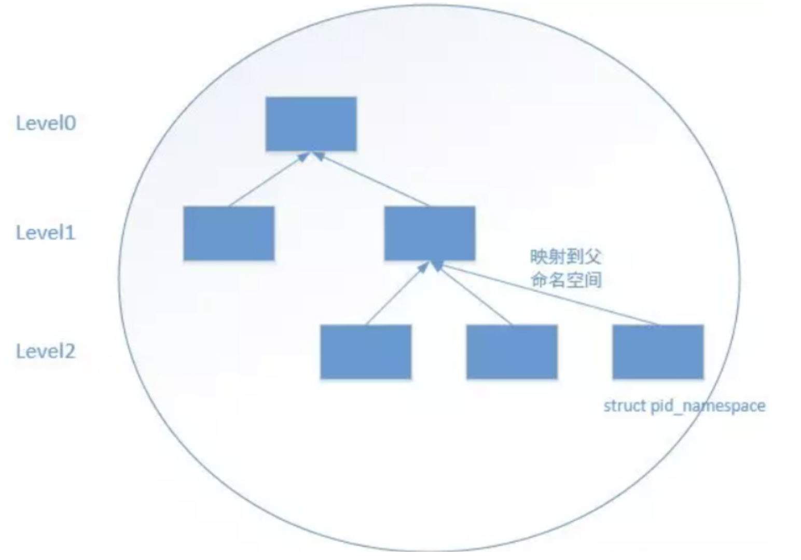
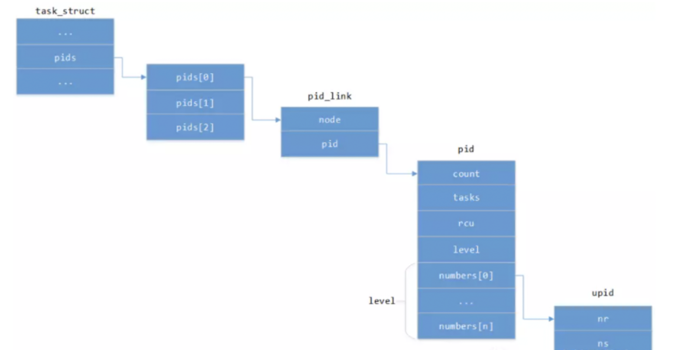

* [1 namespace 简介](#1-namespace-简介)
* [2\. pid namespace](#2-pid-namespace)
  * [2\.1 如何查看一个进程的 pid namespace](#21-如何查看一个进程的-pid-namespace)
  * [2\.2 子进程不共享父进程的pid namespaces](#22-子进程不共享父进程的pid-namespaces)
  * [2\.3 pid namespace的原理](#23-pid-namespace的原理)
  * [2\.4 task\_struct 结构图](#24-task_struct-结构图)
* [3 总结](#3-总结)
* [4\.参考](#4参考)

### 1 namespace 简介

`namespace（命名空间）` 是Linux提供的一种内核级别环境隔离的方法，很多编程语言也有 namespace 这样的功能，例如C++，Java等，编程语言的 namespace 是为了解决项目中能够在不同的命名空间里使用相同的函数名或者类名。而Linux的 namespace 也是为了实现资源能够在不同的命名空间里有相同的名称，譬如在 `A命名空间` 有个pid为1的进程，而在 `B命名空间` 中也可以有一个pid为1的进程。

有了 `namespace` 就可以实现基本的容器功能，著名的 `Docker` 也是使用了 namespace 来实现资源隔离的。

Linux支持6种资源的 `namespace`，分别为（文档）：

| Type               | Parameter     | Linux Version |
| ------------------ | ------------- | ------------- |
| Mount namespaces   | CLONE_NEWNS   | Linux 2.4.19  |
| UTS namespaces     | CLONE_NEWUTS  | Linux 2.6.19  |
| IPC namespaces     | CLONE_NEWIPC  | Linux 2.6.19  |
| PID namespaces     | CLONE_NEWPID  | Linux 2.6.24  |
| Network namespaces | CLONE_NEWNET  | Linux 2.6.24  |
| User namespaces    | CLONE_NEWUSER | Linux 2.6.23  |

<br>

个人理解：namespace 就是对进程进行了内核资源的隔离（mount, uts, ipc, pid, network, user）这六种资源。


接下来以 pid 这个来介绍 namespaces是如何起作用的。

<br>

### 2. pid namespace

#### 2.1 如何查看一个进程的 pid namespace

/proc/pid/ns  目录下目前可以看到pid namespace

```
ps ajxf 查看到一个父进程，和子进程
 4556  4574  4574  4574 ?           -1 Ss       0   0:00          \_ nginx: master process nginx -g daemon off;
 4574  4621  4574  4574 ?           -1 S      101   0:00              \_ nginx: worker process
 4574  4629  4574  4574 ?           -1 S      101   0:00              \_ nginx: worker process


// 父进程
root@k8s-master:/proc/170/ns# ls -l /proc/4574/ns
total 0
lrwxrwxrwx 1 root root 0 Dec  5 08:49 cgroup -> 'cgroup:[4026531835]'
lrwxrwxrwx 1 root root 0 Dec  5 08:49 ipc -> 'ipc:[4026532263]'
lrwxrwxrwx 1 root root 0 Dec  5 08:49 mnt -> 'mnt:[4026532331]'
lrwxrwxrwx 1 root root 0 Dec  5 08:49 net -> 'net:[4026532266]'
lrwxrwxrwx 1 root root 0 Dec  5 08:49 pid -> 'pid:[4026532333]'
lrwxrwxrwx 1 root root 0 Dec  5 08:49 pid_for_children -> 'pid:[4026532333]'
lrwxrwxrwx 1 root root 0 Dec  5 08:49 user -> 'user:[4026531837]'
lrwxrwxrwx 1 root root 0 Dec  5 08:49 uts -> 'uts:[4026532332]'

// 子进程和父进程有一样的namespaces
root@k8s-master:/proc/170/ns# ls -l /proc/4621/ns
total 0
lrwxrwxrwx 1 systemd-timesync systemd-journal 0 Dec  5 08:49 cgroup -> 'cgroup:[4026531835]'
lrwxrwxrwx 1 systemd-timesync systemd-journal 0 Dec  5 08:49 ipc -> 'ipc:[4026532263]'
lrwxrwxrwx 1 systemd-timesync systemd-journal 0 Dec  5 08:49 mnt -> 'mnt:[4026532331]'
lrwxrwxrwx 1 systemd-timesync systemd-journal 0 Dec  5 08:49 net -> 'net:[4026532266]'
lrwxrwxrwx 1 systemd-timesync systemd-journal 0 Dec  5 08:49 pid -> 'pid:[4026532333]'
lrwxrwxrwx 1 systemd-timesync systemd-journal 0 Dec  5 08:49 pid_for_children -> 'pid:[4026532333]'
lrwxrwxrwx 1 systemd-timesync systemd-journal 0 Dec  5 08:49 user -> 'user:[4026531837]'
lrwxrwxrwx 1 systemd-timesync systemd-journal 0 Dec  5 08:49 uts -> 'uts:[4026532332]
```

<br>

#### 2.2 子进程不共享父进程的pid namespaces 

```
root@k8s-master:~# unshare --fork --pid --mount-proc sleep 100
```

<br>

```
   1   701   701   701 ?           -1 Ss       0   1:28 /usr/sbin/sshd -D
  701  4462  4462  4462 ?           -1 Ss       0   0:00  \_ sshd: root@pts/0,pts/1
 4462  4497  4497  4497 pts/0     3994 Ss       0   0:00      \_ -bash
 4497  3106  3106  4497 pts/0     3994 S        0   0:00      |   \_ bash
 3106  3994  3994  4497 pts/0     3994 S+       0   0:00      |       \_ unshare --fork --pid --mount-
 3994  3995  3994  4497 pts/0     3994 S+       0   0:00      |           \_ sleep 100
```

<br>

```
// 这个是 sleep 100的进程，所以他的子进程和它是公用pid的
root@k8s-master:~# ls -l /proc/3995/ns
total 0
lrwxrwxrwx 1 root root 0 Dec  5 10:00 cgroup -> 'cgroup:[4026531835]'
lrwxrwxrwx 1 root root 0 Dec  5 10:00 ipc -> 'ipc:[4026531839]'
lrwxrwxrwx 1 root root 0 Dec  5 10:00 mnt -> 'mnt:[4026532334]'
lrwxrwxrwx 1 root root 0 Dec  5 10:00 net -> 'net:[4026531992]'
lrwxrwxrwx 1 root root 0 Dec  5 10:00 pid -> 'pid:[4026532335]'                 // 这里 pid 和pid_for_children是一样的
lrwxrwxrwx 1 root root 0 Dec  5 10:00 pid_for_children -> 'pid:[4026532335]'    
lrwxrwxrwx 1 root root 0 Dec  5 10:00 user -> 'user:[4026531837]'
lrwxrwxrwx 1 root root 0 Dec  5 10:00 uts -> 'uts:[4026531838]'
root@k8s-master:~# 

// 这个是 unshare 的进程，因为使用了 --pid mount,所以和父进程pid namespaces是不一样的
root@k8s-master:~# ls -l /proc/3994/ns
total 0
lrwxrwxrwx 1 root root 0 Dec  5 10:01 cgroup -> 'cgroup:[4026531835]'
lrwxrwxrwx 1 root root 0 Dec  5 10:01 ipc -> 'ipc:[4026531839]'
lrwxrwxrwx 1 root root 0 Dec  5 10:01 mnt -> 'mnt:[4026532334]'
lrwxrwxrwx 1 root root 0 Dec  5 10:01 net -> 'net:[4026531992]'
lrwxrwxrwx 1 root root 0 Dec  5 10:01 pid -> 'pid:[4026531836]'                  // 这里就是不一样的，因为这个进程是
lrwxrwxrwx 1 root root 0 Dec  5 10:01 pid_for_children -> 'pid:[4026532335]'
lrwxrwxrwx 1 root root 0 Dec  5 10:01 user -> 'user:[4026531837]'
lrwxrwxrwx 1 root root 0 Dec  5 10:01 uts -> 'uts:[4026531838]'
```

#### 2.3 pid namespace的原理

为了让每个进程都可以从属于某一个namespace，Linux内核为进程描述符添加了一个 `struct nsproxy` 的结构，如下：

```
struct task_struct {
    ...
    /* namespaces */
    struct nsproxy *nsproxy;
    ...
}

struct nsproxy {
    atomic_t count;
    struct uts_namespace  *uts_ns;
    struct ipc_namespace  *ipc_ns;
    struct mnt_namespace  *mnt_ns;
    struct pid_namespace  *pid_ns;
    struct user_namespace *user_ns;
    struct net            *net_ns;
};
```

从 `struct nsproxy` 结构的定义可以看出，Linux为每种不同类型的资源定义了不同的命名空间结构体进行管理。比如对于 `pid命名空间` 定义了 `struct pid_namespace` 结构来管理 。由于 namespace 涉及的资源种类比较多，所以本文主要以 `pid命名空间` 作为分析的对象。

我们先来看看管理 `pid命名空间` 的 `struct pid_namespace` 结构的定义：

```
struct pid_namespace {
    struct kref kref;
    struct pidmap pidmap[PIDMAP_ENTRIES];
    int last_pid;
    struct task_struct *child_reaper;
    struct kmem_cache *pid_cachep;
    unsigned int level;
    struct pid_namespace *parent;
#ifdef CONFIG_PROC_FS
    struct vfsmount *proc_mnt;
#endif
};
```

因为 `struct pid_namespace` 结构主要用于为当前 `pid命名空间` 分配空闲的pid，所以定义比较简单：

- `kref` 成员是一个引用计数器，用于记录引用这个结构的进程数
- `pidmap` 成员用于快速找到可用pid的位图
- `last_pid` 成员是记录最后一个可用的pid
- `level` 成员记录当前 `pid命名空间` 所在的层次
- `parent` 成员记录当前 `pid命名空间` 的父命名空间

由于 `pid命名空间` 是分层的，也就是说新创建一个 `pid命名空间` 时会记录父级 `pid命名空间` 到 `parent` 字段中，所以随着 `pid命名空间` 的创建，在内核中会形成一颗 `pid命名空间` 的树，如下图（图片来源）：



第0层的 `pid命名空间` 是 `init` 进程所在的命名空间。如果一个进程所在的 `pid命名空间` 为 `N`，那么其在 `0 ~ N 层pid命名空间` 都有一个唯一的pid号。也就是说 `高层pid命名空间` 的进程对 `低层pid命名空间` 的进程是可见的，但是 `低层pid命名空间`的进程对 `高层pid命名空间` 的进程是不可见的。

由于在 `第N层pid命名空间` 的进程其在 `0 ~ N层pid命名空间` 都有一个唯一的pid号，所以在进程描述符中通过 `pids` 成员来记录其在每个层的pid号，代码如下：

```
struct task_struct {
    ...
    struct pid_link pids[PIDTYPE_MAX];
    ...
}

enum pid_type {
    PIDTYPE_PID,
    PIDTYPE_PGID,
    PIDTYPE_SID,
    PIDTYPE_MAX
};

struct upid {
    int nr;
    struct pid_namespace *ns;
    struct hlist_node pid_chain;
};

struct pid {
    atomic_t count;
    struct hlist_head tasks[PIDTYPE_MAX];
    struct rcu_head rcu;
    unsigned int level;
    struct upid numbers[1];
};

struct pid_link {
    struct hlist_node node;
    struct pid *pid;
};
```

这几个结构的关系如下图：



我们主要关注 `struct pid` 这个结构，`struct pid` 有个类型为 `struct upid` 的成员 `numbers`，其定义为只有一个元素的数组，但是其实是一个动态的数据，它的元素个数与 `level` 的值一致，也就是说当 `level` 的值为5时，那么 `numbers` 成员就是一个拥有5个元素的数组。而每个元素记录了其在每层 `pid命名空间` 的pid号，而 `struct upid` 结构的 `nr` 成员就是用于记录进程在不同层级 `pid命名空间` 的pid号。

我们通过代码来看看怎么为进程分配pid号的，在内核中是用过 `alloc_pid()` 函数分配pid号的，代码如下：

```
struct pid *alloc_pid(struct pid_namespace *ns)
{
    struct pid *pid;
    enum pid_type type;
    int i, nr;
    struct pid_namespace *tmp;
    struct upid *upid;

    pid = kmem_cache_alloc(ns->pid_cachep, GFP_KERNEL);
    if (!pid)
        goto out;

    tmp = ns;
    for (i = ns->level; i >= 0; i--) {
        nr = alloc_pidmap(tmp);    // 为当前进程所在的不同层级pid命名空间分配一个pid
        if (nr < 0)
            goto out_free;

        pid->numbers[i].nr = nr;   // 对应i层namespace中的pid数字
        pid->numbers[i].ns = tmp;  // 对应i层namespace的实体
        tmp = tmp->parent;
    }

    get_pid_ns(ns);
    pid->level = ns->level;
    atomic_set(&pid->count, 1);
    for (type = 0; type < PIDTYPE_MAX; ++type)
        INIT_HLIST_HEAD(&pid->tasks[type]);

    spin_lock_irq(&pidmap_lock);
    for (i = ns->level; i >= 0; i--) {
        upid = &pid->numbers[i];
        // 把upid连接到全局pid中, 用于快速查找pid
        hlist_add_head_rcu(&upid->pid_chain,
                &pid_hash[pid_hashfn(upid->nr, upid->ns)]);
    }
    spin_unlock_irq(&pidmap_lock);

out:
    return pid;

    ...
}
```

上面的代码中，那个 `for (i = ns->level; i >= 0; i--)` 就是通过 `parent` 成员不断向上检索为不同层级的 `pid命名空间`分配一个唯一的pid号，并且保存到对应的 `nr` 字段中。另外，还会把进程所在各个层级的pid号添加到全局pid哈希表中，这样做是为了通过pid号快速找到进程。

现在我们来看看怎么通过pid号快速找到一个进程，在内核中 `find_get_pid()` 函数用来通过pid号查找对应的 `struct pid`结构，代码如下（find_get_pid() -> find_vpid() -> find_pid_ns()）：

```
struct pid *find_get_pid(pid_t nr)
{
    struct pid *pid;

    rcu_read_lock();
    pid = get_pid(find_vpid(nr));
    rcu_read_unlock();

    return pid;
}

struct pid *find_vpid(int nr)
{
    return find_pid_ns(nr, current->nsproxy->pid_ns);
}

struct pid *find_pid_ns(int nr, struct pid_namespace *ns)
{
    struct hlist_node *elem;
    struct upid *pnr;

    hlist_for_each_entry_rcu(pnr, elem,
            &pid_hash[pid_hashfn(nr, ns)], pid_chain)
        if (pnr->nr == nr && pnr->ns == ns)
            return container_of(pnr, struct pid,
                    numbers[ns->level]);

    return NULL;
}
```

通过pid号查找 `struct pid` 结构时，首先会把进程pid号和当前进程的 `pid命名空间` 传入到 `find_pid_ns()` 函数，而在 `find_pid_ns()` 函数中通过全局pid哈希表来快速查找对应的 `struct pid` 结构。获取到 `struct pid` 结构后就可以很容易地获取到进程对应的进程描述符，例如可以通过 `pid_task()` 函数来获取 `struct pid` 结构对应进程描述符，由于代码比较简单，这里就不再分析了。


#### 2.4 task_struct 结构图

```
struct task_struct 
{
    /* 
    1. state: 进程执行时，它会根据具体情况改变状态。进程状态是进程调度和对换的依据。Linux中的进程主要有如下状态:
        1) TASK_RUNNING: 可运行
        处于这种状态的进程，只有两种状态:
            1.1) 正在运行
            正在运行的进程就是当前进程(由current所指向的进程)
            1.2) 正准备运行
            准备运行的进程只要得到CPU就可以立即投入运行，CPU是这些进程唯一等待的系统资源，系统中有一个运行队列(run_queue)，用来容纳所有处于可运行状态的进程，调度程序执行时，从中选择一个进程投入运行 
        
        2) TASK_INTERRUPTIBLE: 可中断的等待状态，是针对等待某事件或其他资源的睡眠进程设置的，在内核发送信号给该进程表明事件已经发生时，进程状态变为TASK_RUNNING，它只要调度器选中该进程即可恢复执行 
        
        3) TASK_UNINTERRUPTIBLE: 不可中断的等待状态
        处于该状态的进程正在等待某个事件(event)或某个资源，它肯定位于系统中的某个等待队列(wait_queue)中，处于不可中断等待态的进程是因为硬件环境不能满足而等待，例如等待特定的系统资源，它任何情况下都不能被打断，只能用特定的方式来唤醒它，例如唤醒函数wake_up()等 
　　　　　它们不能由外部信号唤醒，只能由内核亲自唤醒        

        4) TASK_ZOMBIE: 僵死
        进程虽然已经终止，但由于某种原因，父进程还没有执行wait()系统调用，终止进程的信息也还没有回收。顾名思义，处于该状态的进程就是死进程，这种进程实际上是系统中的垃圾，必须进行相应处理以释放其占用的资源。

        5) TASK_STOPPED: 暂停
        此时的进程暂时停止运行来接受某种特殊处理。通常当进程接收到SIGSTOP、SIGTSTP、SIGTTIN或 SIGTTOU信号后就处于这种状态。例如，正接受调试的进程就处于这种状态
　　　　
　　　　　6) TASK_TRACED
　　　　　从本质上来说，这属于TASK_STOPPED状态，用于从停止的进程中，将当前被调试的进程与常规的进程区分开来
　　　　　　
　　　　　7) TASK_DEAD
　　　　　父进程wait系统调用发出后，当子进程退出时，父进程负责回收子进程的全部资源，子进程进入TASK_DEAD状态

        8) TASK_SWAPPING: 换入/换出
    */
    volatile long state;
    
    /*
    2. stack
    进程内核栈，进程通过alloc_thread_info函数分配它的内核栈，通过free_thread_info函数释放所分配的内核栈
    */     
    void *stack;
    
    /*
    3. usage
    进程描述符使用计数，被置为2时，表示进程描述符正在被使用而且其相应的进程处于活动状态
    */
    atomic_t usage;

    /*
    4. flags
    flags是进程当前的状态标志(注意和运行状态区分)
        1) #define PF_ALIGNWARN    0x00000001: 显示内存地址未对齐警告
        2) #define PF_PTRACED    0x00000010: 标识是否是否调用了ptrace
        3) #define PF_TRACESYS    0x00000020: 跟踪系统调用
        4) #define PF_FORKNOEXEC 0x00000040: 已经完成fork，但还没有调用exec
        5) #define PF_SUPERPRIV    0x00000100: 使用超级用户(root)权限
        6) #define PF_DUMPCORE    0x00000200: dumped core  
        7) #define PF_SIGNALED    0x00000400: 此进程由于其他进程发送相关信号而被杀死 
        8) #define PF_STARTING    0x00000002: 当前进程正在被创建
        9) #define PF_EXITING    0x00000004: 当前进程正在关闭
        10) #define PF_USEDFPU    0x00100000: Process used the FPU this quantum(SMP only)  
        #define PF_DTRACE    0x00200000: delayed trace (used on m68k)  
    */
    unsigned int flags;     

    /*
    5. ptrace
    ptrace系统调用，成员ptrace被设置为0时表示不需要被跟踪，它的可能取值如下： 
    linux-2.6.38.8/include/linux/ptrace.h  
        1) #define PT_PTRACED    0x00000001
        2) #define PT_DTRACE    0x00000002: delayed trace (used on m68k, i386) 
        3) #define PT_TRACESYSGOOD    0x00000004
        4) #define PT_PTRACE_CAP    0x00000008: ptracer can follow suid-exec 
        5) #define PT_TRACE_FORK    0x00000010
        6) #define PT_TRACE_VFORK    0x00000020
        7) #define PT_TRACE_CLONE    0x00000040
        8) #define PT_TRACE_EXEC    0x00000080
        9) #define PT_TRACE_VFORK_DONE    0x00000100
        10) #define PT_TRACE_EXIT    0x00000200
    */
    unsigned int ptrace;
    unsigned long ptrace_message;
    siginfo_t *last_siginfo; 

    /*
    6. lock_depth
    用于表示获取大内核锁的次数，如果进程未获得过锁，则置为-1
    */
    int lock_depth;         

    /*
    7. oncpu
    在SMP上帮助实现无加锁的进程切换(unlocked context switches)
    */
#ifdef CONFIG_SMP
#ifdef __ARCH_WANT_UNLOCKED_CTXSW
    int oncpu;
#endif
#endif

    /*
    8. 进程调度
        1) prio: 调度器考虑的优先级保存在prio，由于在某些情况下内核需要暂时提高进程的优先级，因此需要第三个成员来表示(除了static_prio、normal_prio之外)，由于这些改变不是持久的，因此静态(static_prio)和普通(normal_prio)优先级不受影响
        2) static_prio: 用于保存进程的"静态优先级"，静态优先级是进程"启动"时分配的优先级，它可以用nice、sched_setscheduler系统调用修改，否则在进程运行期间会一直保持恒定
        3) normal_prio: 表示基于进程的"静态优先级"和"调度策略"计算出的优先级，因此，即使普通进程和实时进程具有相同的静态优先级(static_prio)，其普通优先级(normal_prio)也是不同的。进程分支时(fork)，新创建的子进程会集成普通优先级   
    */
    int prio, static_prio, normal_prio;
    /*
        4) rt_priority: 表示实时进程的优先级，需要明白的是，"实时进程优先级"和"普通进程优先级"有两个独立的范畴，实时进程即使是最低优先级也高于普通进程，最低的实时优先级为0，最高的优先级为99，值越大，表明优先级越高
    */
    unsigned int rt_priority;
    /*
        5) sched_class: 该进程所属的调度类，目前内核中有实现以下四种： 
            5.1) static const struct sched_class fair_sched_class;
            5.2) static const struct sched_class rt_sched_class;
            5.3) static const struct sched_class idle_sched_class;
            5.4) static const struct sched_class stop_sched_class;        
    */
    const struct sched_class *sched_class;
    /*
        6) se: 用于普通进程的调用实体 
　　调度器不限于调度进程，还可以处理更大的实体，这可以实现"组调度"，可用的CPU时间可以首先在一般的进程组(例如所有进程可以按所有者分组)之间分配，接下来分配的时间在组内再次分配
　　这种一般性要求调度器不直接操作进程，而是处理"可调度实体"，一个实体有sched_entity的一个实例标识
　　在最简单的情况下，调度在各个进程上执行，由于调度器设计为处理可调度的实体，在调度器看来各个进程也必须也像这样的实体，因此se在task_struct中内嵌了一个sched_entity实例，调度器可据此操作各个task_struct
    */
    struct sched_entity se;
    /*
        7) rt: 用于实时进程的调用实体 
    */
    struct sched_rt_entity rt;

#ifdef CONFIG_PREEMPT_NOTIFIERS 
    /*
    9. preempt_notifier
    preempt_notifiers结构体链表 
    */
    struct hlist_head preempt_notifiers;
#endif
 
     /*
     10. fpu_counter
     FPU使用计数 
     */
    unsigned char fpu_counter;

#ifdef CONFIG_BLK_DEV_IO_TRACE
    /*
    11. btrace_seq
    blktrace是一个针对Linux内核中块设备I/O层的跟踪工具
    */
    unsigned int btrace_seq;
#endif

    /*
    12. policy
    policy表示进程的调度策略，目前主要有以下五种：
        1) #define SCHED_NORMAL        0: 用于普通进程，它们通过完全公平调度器来处理
        2) #define SCHED_FIFO        1: 先来先服务调度，由实时调度类处理
        3) #define SCHED_RR            2: 时间片轮转调度，由实时调度类处理
        4) #define SCHED_BATCH        3: 用于非交互、CPU使用密集的批处理进程，通过完全公平调度器来处理，调度决策对此类进程给与"冷处理"，它们绝不会抢占CFS调度器处理的另一个进程，因此不会干扰交互式进程，如果不打算用nice降低进程的静态优先级，同时又不希望该进程影响系统的交互性，最适合用该调度策略
        5) #define SCHED_IDLE        5: 可用于次要的进程，其相对权重总是最小的，也通过完全公平调度器来处理。要注意的是，SCHED_IDLE不负责调度空闲进程，空闲进程由内核提供单独的机制来处理
    只有root用户能通过sched_setscheduler()系统调用来改变调度策略 
    */
    unsigned int policy;

    /*
    13. cpus_allowed
    cpus_allowed是一个位域，在多处理器系统上使用，用于控制进程可以在哪里处理器上运行
    */
    cpumask_t cpus_allowed;

    /*
    14. RCU同步原语 
    */
#ifdef CONFIG_TREE_PREEMPT_RCU
    int rcu_read_lock_nesting;
    char rcu_read_unlock_special;
    struct rcu_node *rcu_blocked_node;
    struct list_head rcu_node_entry;
#endif /* #ifdef CONFIG_TREE_PREEMPT_RCU */

#if defined(CONFIG_SCHEDSTATS) || defined(CONFIG_TASK_DELAY_ACCT)
    /*
    15. sched_info
    用于调度器统计进程的运行信息
    */
    struct sched_info sched_info;
#endif

    /*
    16. tasks
    通过list_head将当前进程的task_struct串联进内核的进程列表中，构建；linux进程链表
    */
    struct list_head tasks;

    /*
    17. pushable_tasks
    limit pushing to one attempt 
    */
    struct plist_node pushable_tasks;

    /*
    18. 进程地址空间 
        1) mm: 指向进程所拥有的内存描述符 
        2) active_mm: active_mm指向进程运行时所使用的内存描述符
    对于普通进程而言，这两个指针变量的值相同。但是，内核线程不拥有任何内存描述符，所以它们的mm成员总是为NULL。当内核线程得以运行时，它的active_mm成员被初始化为前一个运行进程的active_mm值
    */
    struct mm_struct *mm, *active_mm;

    /*
    19. exit_state
    进程退出状态码
    */
    int exit_state;

    /*
    20. 判断标志
        1) exit_code
        exit_code用于设置进程的终止代号，这个值要么是_exit()或exit_group()系统调用参数(正常终止)，要么是由内核提供的一个错误代号(异常终止)
        2) exit_signal
        exit_signal被置为-1时表示是某个线程组中的一员。只有当线程组的最后一个成员终止时，才会产生一个信号，以通知线程组的领头进程的父进程
    */
    int exit_code, exit_signal; 
    /*
        3) pdeath_signal
        pdeath_signal用于判断父进程终止时发送信号
    */
    int pdeath_signal;   
    /*
        4)  personality用于处理不同的ABI，它的可能取值如下： 
            enum 
            {
                PER_LINUX =        0x0000,
                PER_LINUX_32BIT =    0x0000 | ADDR_LIMIT_32BIT,
                PER_LINUX_FDPIC =    0x0000 | FDPIC_FUNCPTRS,
                PER_SVR4 =        0x0001 | STICKY_TIMEOUTS | MMAP_PAGE_ZERO,
                PER_SVR3 =        0x0002 | STICKY_TIMEOUTS | SHORT_INODE,
                PER_SCOSVR3 =        0x0003 | STICKY_TIMEOUTS |
                                 WHOLE_SECONDS | SHORT_INODE,
                PER_OSR5 =        0x0003 | STICKY_TIMEOUTS | WHOLE_SECONDS,
                PER_WYSEV386 =        0x0004 | STICKY_TIMEOUTS | SHORT_INODE,
                PER_ISCR4 =        0x0005 | STICKY_TIMEOUTS,
                PER_BSD =        0x0006,
                PER_SUNOS =        0x0006 | STICKY_TIMEOUTS,
                PER_XENIX =        0x0007 | STICKY_TIMEOUTS | SHORT_INODE,
                PER_LINUX32 =        0x0008,
                PER_LINUX32_3GB =    0x0008 | ADDR_LIMIT_3GB,
                PER_IRIX32 =        0x0009 | STICKY_TIMEOUTS, 
                PER_IRIXN32 =        0x000a | STICKY_TIMEOUTS, 
                PER_IRIX64 =        0x000b | STICKY_TIMEOUTS, 
                PER_RISCOS =        0x000c,
                PER_SOLARIS =        0x000d | STICKY_TIMEOUTS,
                PER_UW7 =        0x000e | STICKY_TIMEOUTS | MMAP_PAGE_ZERO,
                PER_OSF4 =        0x000f,              
                PER_HPUX =        0x0010,
                PER_MASK =        0x00ff,
            };
    */
    unsigned int personality;
    /*
        5) did_exec
        did_exec用于记录进程代码是否被execve()函数所执行
    */
    unsigned did_exec:1;
    /*
        6) in_execve
        in_execve用于通知LSM是否被do_execve()函数所调用
    */
    unsigned in_execve:1;     
    /*
        7) in_iowait
        in_iowait用于判断是否进行iowait计数
    */
    unsigned in_iowait:1;

    /*
        8) sched_reset_on_fork
        sched_reset_on_fork用于判断是否恢复默认的优先级或调度策略
    */
    unsigned sched_reset_on_fork:1;

    /*
    21. 进程标识符(PID)
    在CONFIG_BASE_SMALL配置为0的情况下，PID的取值范围是0到32767，即系统中的进程数最大为32768个
    #define PID_MAX_DEFAULT (CONFIG_BASE_SMALL ? 0x1000 : 0x8000)  
    在Linux系统中，一个线程组中的所有线程使用和该线程组的领头线程(该组中的第一个轻量级进程)相同的PID，并被存放在tgid成员中。只有线程组的领头线程的pid成员才会被设置为与tgid相同的值。注意，getpid()系统调用
返回的是当前进程的tgid值而不是pid值。
    */
    pid_t pid;
    pid_t tgid;

#ifdef CONFIG_CC_STACKPROTECTOR 
    /*
    22. stack_canary
    防止内核堆栈溢出，在GCC编译内核时，需要加上-fstack-protector选项
    */
    unsigned long stack_canary;
#endif
 
     /*
     23. 表示进程亲属关系的成员 
         1) real_parent: 指向其父进程，如果创建它的父进程不再存在，则指向PID为1的init进程
         2) parent: 指向其父进程，当它终止时，必须向它的父进程发送信号。它的值通常与real_parent相同 
     */
    struct task_struct *real_parent;  
    struct task_struct *parent;   
    /*
        3) children: 表示链表的头部，链表中的所有元素都是它的子进程(子进程链表)
        4) sibling: 用于把当前进程插入到兄弟链表中(连接到父进程的子进程链表(兄弟链表))
        5) group_leader: 指向其所在进程组的领头进程
    */
    struct list_head children;     
    struct list_head sibling;     
    struct task_struct *group_leader;     
     
    struct list_head ptraced;
    struct list_head ptrace_entry; 
    struct bts_context *bts;

    /*
    24. pids
    PID散列表和链表  
    */
    struct pid_link pids[PIDTYPE_MAX];
    /*
    25. thread_group
    线程组中所有进程的链表
    */
    struct list_head thread_group;

    /*
    26. do_fork函数 
        1) vfork_done
        在执行do_fork()时，如果给定特别标志，则vfork_done会指向一个特殊地址
        2) set_child_tid、clear_child_tid
        如果copy_process函数的clone_flags参数的值被置为CLONE_CHILD_SETTID或CLONE_CHILD_CLEARTID，则会把child_tidptr参数的值分别复制到set_child_tid和clear_child_tid成员。这些标志说明必须改变子
进程用户态地址空间的child_tidptr所指向的变量的值。
    */
    struct completion *vfork_done;         
    int __user *set_child_tid;         
    int __user *clear_child_tid;         

    /*
    27. 记录进程的I/O计数(时间)
        1) utime
        用于记录进程在"用户态"下所经过的节拍数(定时器)
        2) stime
        用于记录进程在"内核态"下所经过的节拍数(定时器)
        3) utimescaled
        用于记录进程在"用户态"的运行时间，但它们以处理器的频率为刻度
        4) stimescaled
        用于记录进程在"内核态"的运行时间，但它们以处理器的频率为刻度
    */
    cputime_t utime, stime, utimescaled, stimescaled;
    /*
        5) gtime
        以节拍计数的虚拟机运行时间(guest time)
    */
    cputime_t gtime;
    /*
        6) prev_utime、prev_stime是先前的运行时间
    */
    cputime_t prev_utime, prev_stime; 
    /*
        7) nvcsw
        自愿(voluntary)上下文切换计数
        8) nivcsw
        非自愿(involuntary)上下文切换计数
    */
    unsigned long nvcsw, nivcsw; 
    /*
        9) start_time
        进程创建时间
        10) real_start_time
        进程睡眠时间，还包含了进程睡眠时间，常用于/proc/pid/stat，
    */
    struct timespec start_time;          
    struct timespec real_start_time;
    /*
        11) cputime_expires
        用来统计进程或进程组被跟踪的处理器时间，其中的三个成员对应着cpu_timers[3]的三个链表
    */
    struct task_cputime cputime_expires;
    struct list_head cpu_timers[3];
    #ifdef CONFIG_DETECT_HUNG_TASK 
    /*
        12) last_switch_count
        nvcsw和nivcsw的总和
    */
    unsigned long last_switch_count;
    #endif
    struct task_io_accounting ioac;
#if defined(CONFIG_TASK_XACCT)
    u64 acct_rss_mem1;     
    u64 acct_vm_mem1;     
    cputime_t acct_timexpd;     
#endif

    /*
    28. 缺页统计 
    */     
    unsigned long min_flt, maj_flt; 

    /*
    29. 进程权能 
    */
    const struct cred *real_cred;     
    const struct cred *cred;     
    struct mutex cred_guard_mutex;     
    struct cred *replacement_session_keyring;  

    /*
    30. comm[TASK_COMM_LEN]
    相应的程序名 
    */
    char comm[TASK_COMM_LEN]; 

    /*
    31. 文件 
        1) fs
        用来表示进程与文件系统的联系，包括当前目录和根目录
        2) files
        表示进程当前打开的文件
    */
    int link_count, total_link_count; 
    struct fs_struct *fs; 
    struct files_struct *files;

#ifdef CONFIG_SYSVIPC 
    /*
    32. sysvsem
    进程通信(SYSVIPC)
    */
    struct sysv_sem sysvsem;
#endif

    /*
    33. 处理器特有数据
    */
    struct thread_struct thread;  

    /*
    34. nsproxy
    命名空间 
    */
    struct nsproxy *nsproxy; 

    /*
    35. 信号处理 
        1) signal: 指向进程的信号描述符
        2) sighand: 指向进程的信号处理程序描述符
    */
    struct signal_struct *signal;
    struct sighand_struct *sighand;
    /*
        3) blocked: 表示被阻塞信号的掩码
        4) real_blocked: 表示临时掩码
    */
    sigset_t blocked, real_blocked;
    sigset_t saved_sigmask;     
    /*
        5) pending: 存放私有挂起信号的数据结构
    */
    struct sigpending pending;
    /*
        6) sas_ss_sp: 信号处理程序备用堆栈的地址
        7) sas_ss_size: 表示堆栈的大小
    */
    unsigned long sas_ss_sp;
    size_t sas_ss_size;
    /*
        8) notifier
        设备驱动程序常用notifier指向的函数来阻塞进程的某些信号
        9) otifier_data
        指的是notifier所指向的函数可能使用的数据。
        10) otifier_mask
        标识这些信号的位掩码
    */
    int (*notifier)(void *priv);
    void *notifier_data;
    sigset_t *notifier_mask;

    /*
    36. 进程审计 
    */
    struct audit_context *audit_context; 
#ifdef CONFIG_AUDITSYSCALL
    uid_t loginuid;
    unsigned int sessionid;
#endif

    /*
    37. secure computing 
    */
    seccomp_t seccomp;
     
     /*
     38. 用于copy_process函数使用CLONE_PARENT标记时 
     */
       u32 parent_exec_id;
       u32 self_exec_id;
 
     /*
     39. alloc_lock
     用于保护资源分配或释放的自旋锁 
     */
    spinlock_t alloc_lock;

    /*
    40. 中断 
    */
#ifdef CONFIG_GENERIC_HARDIRQS 
    struct irqaction *irqaction;
#endif
#ifdef CONFIG_TRACE_IRQFLAGS
    unsigned int irq_events;
    int hardirqs_enabled;
    unsigned long hardirq_enable_ip;
    unsigned int hardirq_enable_event;
    unsigned long hardirq_disable_ip;
    unsigned int hardirq_disable_event;
    int softirqs_enabled;
    unsigned long softirq_disable_ip;
    unsigned int softirq_disable_event;
    unsigned long softirq_enable_ip;
    unsigned int softirq_enable_event;
    int hardirq_context;
    int softirq_context;
#endif
     
     /*
     41. pi_lock
     task_rq_lock函数所使用的锁 
     */
    spinlock_t pi_lock;

#ifdef CONFIG_RT_MUTEXES 
    /*
    42. 基于PI协议的等待互斥锁，其中PI指的是priority inheritance/9优先级继承)
    */
    struct plist_head pi_waiters; 
    struct rt_mutex_waiter *pi_blocked_on;
#endif

#ifdef CONFIG_DEBUG_MUTEXES 
    /*
    43. blocked_on
    死锁检测
    */
    struct mutex_waiter *blocked_on;
#endif

/*
    44. lockdep，
*/
#ifdef CONFIG_LOCKDEP
# define MAX_LOCK_DEPTH 48UL
    u64 curr_chain_key;
    int lockdep_depth;
    unsigned int lockdep_recursion;
    struct held_lock held_locks[MAX_LOCK_DEPTH];
    gfp_t lockdep_reclaim_gfp;
#endif
 
     /*
     45. journal_info
     JFS文件系统
     */
    void *journal_info;
     
     /*
     46. 块设备链表
     */
    struct bio *bio_list, **bio_tail; 

    /*
    47. reclaim_state
    内存回收
    */
    struct reclaim_state *reclaim_state;

    /*
    48. backing_dev_info
    存放块设备I/O数据流量信息
    */
    struct backing_dev_info *backing_dev_info;

    /*
    49. io_context
    I/O调度器所使用的信息 
    */
    struct io_context *io_context;

    /*
    50. CPUSET功能 
    */
#ifdef CONFIG_CPUSETS
    nodemask_t mems_allowed;     
    int cpuset_mem_spread_rotor;
#endif

    /*
    51. Control Groups 
    */
#ifdef CONFIG_CGROUPS 
    struct css_set *cgroups; 
    struct list_head cg_list;
#endif

    /*
    52. robust_list
    futex同步机制 
    */
#ifdef CONFIG_FUTEX
    struct robust_list_head __user *robust_list;
#ifdef CONFIG_COMPAT
    struct compat_robust_list_head __user *compat_robust_list;
#endif
    struct list_head pi_state_list;
    struct futex_pi_state *pi_state_cache;
#endif 
#ifdef CONFIG_PERF_EVENTS
    struct perf_event_context *perf_event_ctxp;
    struct mutex perf_event_mutex;
    struct list_head perf_event_list;
#endif

    /*
    53. 非一致内存访问(NUMA  Non-Uniform Memory Access)
    */
#ifdef CONFIG_NUMA
    struct mempolicy *mempolicy;    /* Protected by alloc_lock */
    short il_next;
#endif

    /*
    54. fs_excl
    文件系统互斥资源
    */
    atomic_t fs_excl;

    /*
    55. rcu
    RCU链表 
    */     
    struct rcu_head rcu;

    /*
    56. splice_pipe
    管道
    */
    struct pipe_inode_info *splice_pipe;

    /*
    57. delays
    延迟计数
    */
#ifdef    CONFIG_TASK_DELAY_ACCT
    struct task_delay_info *delays;
#endif

    /*
    58. make_it_fail
    fault injection
    */
#ifdef CONFIG_FAULT_INJECTION
    int make_it_fail;
#endif

    /*
    59. dirties
    FLoating proportions 
    */
    struct prop_local_single dirties;

    /*
    60. Infrastructure for displayinglatency 
    */
#ifdef CONFIG_LATENCYTOP
    int latency_record_count;
    struct latency_record latency_record[LT_SAVECOUNT];
#endif
     
    /*
    61. time slack values，常用于poll和select函数 
    */
    unsigned long timer_slack_ns;
    unsigned long default_timer_slack_ns;

    /*
    62. scm_work_list
    socket控制消息(control message)
    */
    struct list_head    *scm_work_list;

    /*
    63. ftrace跟踪器
    */
#ifdef CONFIG_FUNCTION_GRAPH_TRACER 
    int curr_ret_stack; 
    struct ftrace_ret_stack    *ret_stack; 
    unsigned long long ftrace_timestamp;  
    atomic_t trace_overrun; 
    atomic_t tracing_graph_pause;
#endif
#ifdef CONFIG_TRACING 
    unsigned long trace; 
    unsigned long trace_recursion;
#endif  
};
```

### 3 总结

（1）pid 就是一个编号，通过pid namespace的引入，让每个进程，可以存在多个ns命名空间。比如2.2中的sleep，其实就是存在两层的ns。

第一层就是父进程所在的那层，父进程是直接fork和bash, 以及真正的1号进程的pid namespaces是一致的。

第二层就是 自己新创建的这层。

分配pid的时候，首先在第二层分配给sleep pid=1(这个没进去，看不见)

然后再再父进程的ns，给sleep 分配的pid = 3994

这样的话，就实现了进程隔离，因为子进程在第二层看到的 pid=1，所以它在第二层只能看到，自己产生的所有进程，从而达到了隔离。

### 4.参考

[容器原理之 - namespace](https://mp.weixin.qq.com/s/FnuOMbWAhLQoiCBA_NFYXA)

[Linux-进程描述符 task_struct 详解](https://www.cnblogs.com/JohnABC/p/9084750.html)

