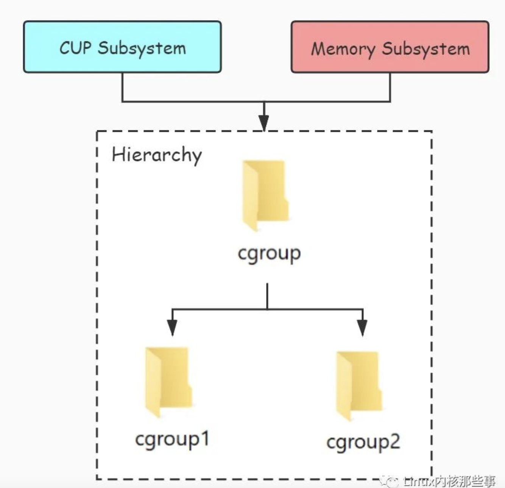
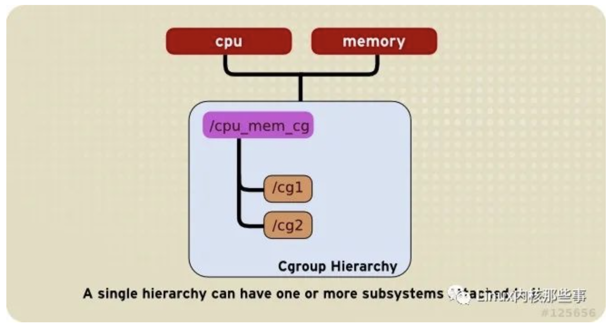
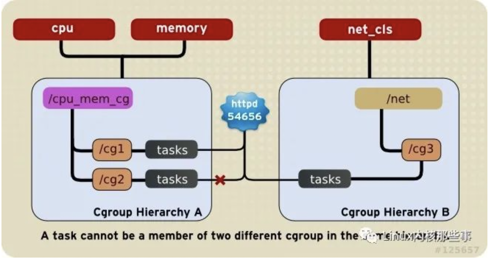
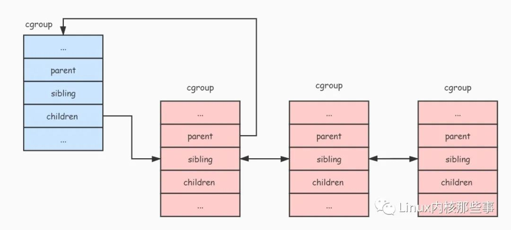
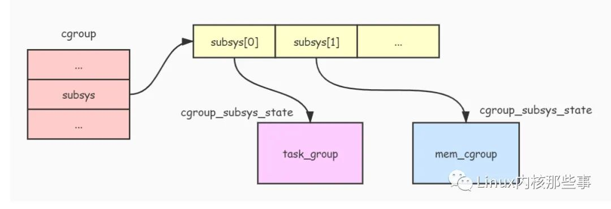
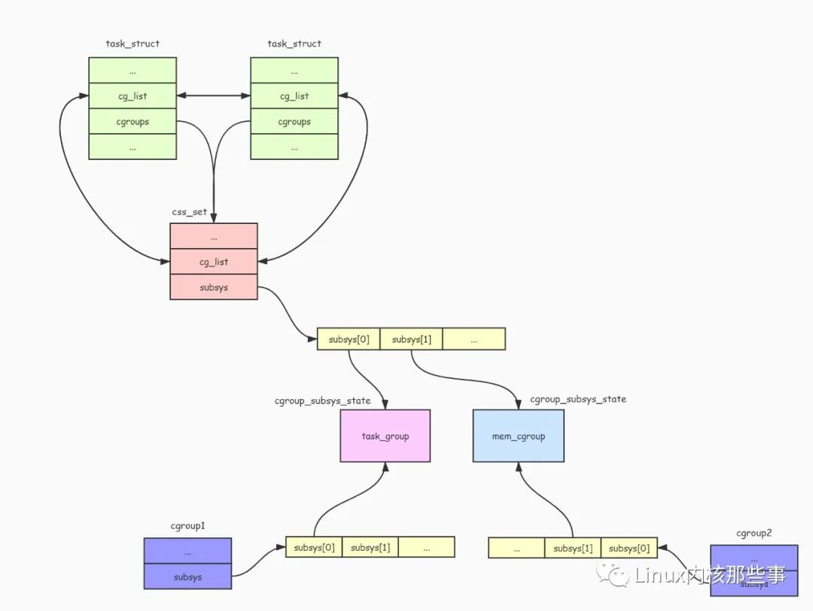

* [0\. 说明](#0-说明)
* [1\. cgroup简介](#1-cgroup简介)
* [2\. CGroup 使用](#2-cgroup-使用)
* [3\. CGroup 基本概念](#3-cgroup-基本概念)
* [4\. CGroup 操作规则](#4-cgroup-操作规则)
* [5\. CGroup的原理实现](#5-cgroup的原理实现)
  * [5\.1 cgroup 结构体](#51-cgroup-结构体)
  * [5\.2 CGroup 的挂载](#52-cgroup-的挂载)
  * [5\.3 向 CGroup 添加要进行资源控制的进程](#53-向-cgroup-添加要进行资源控制的进程)
  * [5\.4 限制 CGroup 的资源使用](#54-限制-cgroup-的资源使用)
  * [5\.5 限制进程使用资源](#55-限制进程使用资源)
* [6\.参考资料](#6参考资料)

### 0. 说明

本文章转载微信公众的一篇文章。地址如下：https://mp.weixin.qq.com/s/n796FnrKsfLLxcvV4-dAlg

该笔记绝大部分来源于上诉公众号，用于自己对cgroup的理解，当做笔记记录。

### 1. cgroup简介

`CGroup` 全称 `Control Group` 中文意思为 `控制组`，用于控制（限制）进程对系统各种资源的使用，比如 `CPU`、`内存`、`网络` 和 `磁盘I/O` 等资源的限制，著名的容器引擎 `Docker` 就是使用 `CGroup` 来对容器进行资源限制。

### 2. CGroup 使用

本文主要以 `内存子系统（memory subsystem）` 作为例子来阐述 `CGroup` 的原理，所以这里先介绍怎么通过 `内存子系统` 来限制进程对内存的使用。

> `子系统` 是 `CGroup` 用于控制某种资源（如内存或者CPU等）使用的逻辑或者算法
>
> 在系统的开机阶段，systemd会把支持的子系统挂载到默认的 `/sys/fs/cgroup` 目录下面。

`CGroup` 使用了 `虚拟文件系统` 来进行管理限制的资源信息和被限制的进程列表等，例如要创建一个限制内存使用的 `CGroup` 可以使用下面命令：

```
$ mount -t cgroup -o memory memory /sys/fs/cgroup/memory
```

上面的命令用于创建内存子系统的根 `CGroup`，如果系统已经存在可以跳过。然后我们使用下面命令在这个目录下面创建一个新的目录 `test`，

```
$ mkdir /sys/fs/cgroup/memory/test
```

这样就在内存子系统的根 `CGroup` 下创建了一个子 `CGroup`，我们可以通过 `ls` 目录来查看这个目录下有哪些文件：

```
$ ls -l /sys/fs/cgroup/memory/test
cgroup.clone_childrenmemory.kmem.max_usage_in_bytesmemory.limit_in_bytesmemory.numa_statmemory.use_hierarchy
cgroup.event_controlmemory.kmem.slabinfomemory.max_usage_in_bytesmemory.oom_controlnotify_on_release
cgroup.procsmemory.kmem.tcp.failcntmemory.memsw.failcntmemory.pressure_leveltasks
memory.failcntmemory.kmem.tcp.limit_in_bytesmemory.memsw.limit_in_bytesmemory.soft_limit_in_bytes
memory.force_emptymemory.kmem.tcp.max_usage_in_bytesmemory.memsw.max_usage_in_bytesmemory.stat
memory.kmem.failcntmemory.kmem.tcp.usage_in_bytesmemory.memsw.usage_in_bytesmemory.swappiness
memory.kmem.limit_in_bytesmemory.kmem.usage_in_bytesmemory.move_charge_at_immigratememory.usage_in_bytes
```

可以看到在目录下有很多文件，每个文件都是 `CGroup` 用于控制进程组的资源使用。我们可以向 `memory.limit_in_bytes` 文件写入限制进程（进程组）使用的内存大小，单位为字节(bytes)。例如可以使用以下命令写入限制使用的内存大小为 `1MB`：

```
$ echo 1048576 > /sys/fs/cgroup/memory/test/memory.limit_in_bytes
```

然后我们可以通过以下命令把要限制的进程加入到 `CGroup` 中：

```
$ echo task_pid > /sys/fs/cgroup/memory/test/tasks
```

上面的 `task_pid` 为进程的 `PID`，把进程PID添加到 `tasks` 文件后，进程对内存的使用就受到此 `CGroup` 的限制。

### 3. CGroup 基本概念

在介绍 `CGroup` 原理前，先介绍一下 `CGroup` 几个相关的概念，因为要理解 `CGroup` 就必须要理解他们：

- `任务（task）`。任务指的是系统的一个进程，如上面介绍的 `tasks` 文件中的进程；
- `控制组（control group）`。控制组就是受相同资源限制的一组进程。`CGroup` 中的资源控制都是以控制组为单位实现。一个进程可以加入到某个控制组，也从一个进程组迁移到另一个控制组。一个进程组的进程可以使用 `CGroup` 以控制组为单位分配的资源，同时受到 `CGroup` 以控制组为单位设定的限制；
- `层级（hierarchy）`。由于控制组是以目录形式存在的，所以控制组可以组织成层级的形式，即一棵控制组组成的树。控制组树上的子节点控制组是父节点控制组的孩子，继承父控制组的特定的属性；
- `子系统（subsystem）`。一个子系统就是一个资源控制器，比如 `CPU子系统` 就是控制 CPU 时间分配的一个控制器。子系统必须附加（attach）到一个层级上才能起作用，一个子系统附加到某个层级以后，这个层级上的所有控制组都受到这个子系统的控制。

他们之间的关系如下图：




我们可以把 `层级` 中的一个目录当成是一个 `CGroup`，那么目录里面的文件就是这个 `CGroup` 用于控制进程组使用各种资源的信息（比如 `tasks` 文件用于保存这个 `CGroup` 控制的进程组所有的进程PID，而 `memory.limit_in_bytes` 文件用于描述这个 `CGroup` 能够使用的内存字节数）。

而附加在 `层级` 上的 `子系统` 表示这个 `层级` 中的 `CGroup` 可以控制哪些资源，每当向 `层级` 附加 `子系统` 时，`层级` 中的所有 `CGroup` 都会产生很多与 `子系统` 资源控制相关的文件。

### 4. CGroup 操作规则

使用 `CGroup` 时，必须按照 `CGroup` 一些操作规则来进行操作，否则会出错。下面介绍一下关于 `CGroup` 的一些操作规则：

1. 一个 `层级` 可以附加多个 `子系统`，如下图：

2. 一个已经被挂载的 `子系统` 只能被再次挂载在一个空的 `层级` 上，不能挂载到已经挂载了其他 `子系统` 的 `层级`，如下图：


3. 每个 `任务` 只能在同一个 `层级` 的唯一一个 `CGroup` 里，并且可以在多个不同层级的 `CGroup` 中，如下图：



4. 子进程在被 `fork` 出时自动继承父进程所在 `CGroup`，但是 `fork` 之后就可以按需调整到其他 `CGroup`，如下图：

   

### 5. CGroup的原理实现

#### 5.1 `cgroup` 结构体

前面介绍过，`cgroup` 是用来控制进程组对各种资源的使用，而在内核中，`cgroup` 是通过 `cgroup` 结构体来描述的，我们来看看其定义：

```
struct cgroup {
    unsigned long flags;        /* "unsigned long" so bitops work */
    atomic_t count;
    struct list_head sibling;   /* my parent's children */
    struct list_head children;  /* my children */
    struct cgroup *parent;      /* my parent */
    struct dentry *dentry;      /* cgroup fs entry */
    struct cgroup_subsys_state *subsys[CGROUP_SUBSYS_COUNT];
    struct cgroupfs_root *root;
    struct cgroup *top_cgroup;
    struct list_head css_sets;
    struct list_head release_list;
};
```

下面我们来介绍一下 `cgroup` 结构体各个字段的用途：

1. `flags`: 用于标识当前 `cgroup` 的状态。
2. `count`: 引用计数器，表示有多少个进程在使用这个 `cgroup`。
3. `sibling、children、parent`: 由于 `cgroup` 是通过 `层级` 来进行管理的，这三个字段就把同一个 `层级` 的所有 `cgroup` 连接成一棵树。`parent` 指向当前 `cgroup` 的父节点，`sibling` 连接着所有兄弟节点，而 `children` 连接着当前 `cgroup` 的所有子节点。
4. `dentry`: 由于 `cgroup` 是通过 `虚拟文件系统` 来进行管理的，在介绍 `cgroup` 使用时说过，可以把 `cgroup` 当成是 `层级` 中的一个目录，所以 `dentry` 字段就是用来描述这个目录的。
5. `subsys`: 前面说过，`子系统` 能够附加到 `层级`，而附加到 `层级` 的 `子系统` 都有其限制进程组使用资源的算法和统计数据。所以 `subsys` 字段就是提供给各个 `子系统` 存放其限制进程组使用资源的统计数据。我们可以看到 `subsys` 字段是一个数组，而数组中的每一个元素都代表了一个 `子系统` 相关的统计数据。从实现来看，`cgroup` 只是把多个进程组织成控制进程组，而真正限制资源使用的是各个 `子系统`。
6. `root`: 用于保存 `层级` 的一些数据，比如：`层级` 的根节点，附加到 `层级` 的 `子系统` 列表（因为一个 `层级` 可以附加多个 `子系统`），还有这个 `层级` 有多少个 `cgroup` 节点等。
7. `top_cgroup`: `层级` 的根节点（根cgroup）。

我们通过下面图片来描述 `层级` 中各个 `cgroup` 组成的树状关系：



`cgroup_subsys_state` 结构体

每个 `子系统` 都有属于自己的资源控制统计信息结构，而且每个 `cgroup` 都绑定一个这样的结构，这种资源控制统计信息结构就是通过 `cgroup_subsys_state` 结构体实现的，其定义如下：

```
struct cgroup_subsys_state {
    struct cgroup *cgroup;
    atomic_t refcnt;
    unsigned long flags;
};
```

下面介绍一下 `cgroup_subsys_state` 结构各个字段的作用：

1. `cgroup`: 指向了这个资源控制统计信息所属的 `cgroup`。
2. `refcnt`: 引用计数器。
3. `flags`: 标志位，如果这个资源控制统计信息所属的 `cgroup` 是 `层级` 的根节点，那么就会将这个标志位设置为 `CSS_ROOT` 表示属于根节点。

从 `cgroup_subsys_state` 结构的定义看不到各个 `子系统` 相关的资源控制统计信息，这是因为 `cgroup_subsys_state` 结构并不是真实的资源控制统计信息结构，比如 `内存子系统` 真正的资源控制统计信息结构是 `mem_cgroup`，那么怎样通过这个 `cgroup_subsys_state` 结构去找到对应的 `mem_cgroup` 结构呢？我们来看看 `mem_cgroup` 结构的定义：

```
struct mem_cgroup {
    struct cgroup_subsys_state css; // 注意这里
    struct res_counter res;
    struct mem_cgroup_lru_info info;
    int prev_priority;
    struct mem_cgroup_stat stat;
};
```

从 `mem_cgroup` 结构的定义可以发现，`mem_cgroup` 结构的第一个字段就是一个 `cgroup_subsys_state` 结构。下面的图片展示了他们之间的关系：


从上图可以看出，`mem_cgroup` 结构包含了 `cgroup_subsys_state` 结构，`内存子系统` 对外暴露出 `mem_cgroup` 结构的 `cgroup_subsys_state` 部分（即返回 `cgroup_subsys_state` 结构的指针），而其余部分由 `内存子系统` 自己维护和使用。

由于 `cgroup_subsys_state` 部分在 `mem_cgroup` 结构的首部，所以要将 `cgroup_subsys_state` 结构转换成 `mem_cgroup` 结构，只需要通过指针类型转换即可。如下代码：

`cgroup` 结构与 `cgroup_subsys_state` 结构之间的关系如下图：



`css_set` 结构体

由于一个进程可以同时添加到不同的 `cgroup` 中（前提是这些 `cgroup` 属于不同的 `层级`）进行资源控制，而这些 `cgroup` 附加了不同的资源控制 `子系统`。所以需要使用一个结构把这些 `子系统` 的资源控制统计信息收集起来，方便进程通过 `子系统ID` 快速查找到对应的 `子系统` 资源控制统计信息，而 `css_set` 结构体就是用来做这件事情。`css_set` 结构体定义如下：

```
struct css_set {
    struct kref ref;
    struct list_head list;
    struct list_head tasks;
    struct list_head cg_links;
    struct cgroup_subsys_state *subsys[CGROUP_SUBSYS_COUNT];
};
```

下面介绍一下 `css_set` 结构体各个字段的作用：

1. `ref`: 引用计数器，用于计算有多少个进程在使用此 `css_set`。
2. `list`: 用于连接所有 `css_set`。
3. `tasks`: 由于可能存在多个进程同时受到相同的 `cgroup` 控制，所以用此字段把所有使用此 `css_set` 的进程连接起来。
4. `subsys`: 用于收集各种 `子系统` 的统计信息结构。

进程描述符 `task_struct` 有两个字段与此相关，如下：

```
struct task_struct {
    ...
    struct css_set *cgroups;
    struct list_head cg_list;
    ...
}
```

可以看出，`task_struct` 结构的 `cgroups` 字段就是指向 `css_set` 结构的指针，而 `cg_list` 字段用于连接所有使用此 `css_set` 结构的进程列表。

`task_struct` 结构与 `css_set` 结构的关系如下图：



`cgroup_subsys` 结构

`CGroup` 通过 `cgroup_subsys` 结构操作各个 `子系统`，每个 `子系统` 都要实现一个这样的结构，其定义如下：

```
struct cgroup_subsys {
    struct cgroup_subsys_state *(*create)(struct cgroup_subsys *ss,
                          struct cgroup *cgrp);
    void (*pre_destroy)(struct cgroup_subsys *ss, struct cgroup *cgrp);
    void (*destroy)(struct cgroup_subsys *ss, struct cgroup *cgrp);
    int (*can_attach)(struct cgroup_subsys *ss,
              struct cgroup *cgrp, struct task_struct *tsk);
    void (*attach)(struct cgroup_subsys *ss, struct cgroup *cgrp,
            struct cgroup *old_cgrp, struct task_struct *tsk);
    void (*fork)(struct cgroup_subsys *ss, struct task_struct *task);
    void (*exit)(struct cgroup_subsys *ss, struct task_struct *task);
    int (*populate)(struct cgroup_subsys *ss,
            struct cgroup *cgrp);
    void (*post_clone)(struct cgroup_subsys *ss, struct cgroup *cgrp);
    void (*bind)(struct cgroup_subsys *ss, struct cgroup *root);

    int subsys_id;
    int active;
    int disabled;
    int early_init;
    const char *name;
    struct cgroupfs_root *root;
    struct list_head sibling;
    void *private;
};
```

`cgroup_subsys` 结构包含了很多函数指针，通过这些函数指针，`CGroup` 可以对 `子系统` 进行一些操作。比如向 `CGroup` 的 `tasks` 文件添加要控制的进程PID时，就会调用 `cgroup_subsys` 结构的 `attach()` 函数。当在 `层级` 中创建新目录时，就会调用 `create()` 函数创建一个 `子系统` 的资源控制统计信息对象 `cgroup_subsys_state`，并且调用 `populate()` 函数创建 `子系统` 相关的资源控制信息文件。

除了函数指针外，`cgroup_subsys` 结构还包含了很多字段，下面说明一下各个字段的作用：

1. `subsys_id`: 表示了子系统的ID。
2. `active`: 表示子系统是否被激活。
3. `disabled`: 子系统是否被禁止。
4. `name`: 子系统名称。
5. `root`: 被附加到的层级挂载点。
6. `sibling`: 用于连接被附加到同一个层级的所有子系统。
7. `private`: 私有数据。

`内存子系统` 定义了一个名为 `mem_cgroup_subsys` 的 `cgroup_subsys` 结构，如下：

```
struct cgroup_subsys mem_cgroup_subsys = {
    .name = "memory",
    .subsys_id = mem_cgroup_subsys_id,
    .create = mem_cgroup_create,
    .pre_destroy = mem_cgroup_pre_destroy,
    .destroy = mem_cgroup_destroy,
    .populate = mem_cgroup_populate,
    .attach = mem_cgroup_move_task,
    .early_init = 0,
};
```

另外 Linux 内核还定义了一个 `cgroup_subsys` 结构的数组 `subsys`，用于保存所有 `子系统` 的 `cgroup_subsys` 结构，如下：

```
static struct cgroup_subsys *subsys[] = {
    cpuset_subsys,
    debug_subsys,
    ns_subsys,
    cpu_cgroup_subsys,
    cpuacct_subsys,
    mem_cgroup_subsys
};
```

#### 5.2 `CGroup` 的挂载

前面介绍了 `CGroup` 相关的几个结构体，接下来我们分析一下 `CGroup` 的实现。

要使用 `CGroup` 功能首先必须先进行挂载操作，比如使用下面命令挂载一个 `CGroup`：

```
$ mount -t cgroup -o memory memory /sys/fs/cgroup/memory
```

在上面的命令中，`-t` 参数指定了要挂载的文件系统类型为 `cgroup`，而 `-o` 参数表示要附加到此 `层级` 的子系统，上面表示附加了 `内存子系统`，当然可以附加多个 `子系统`。而紧随 `-o` 参数后的 `memory` 指定了此 `CGroup` 的名字，最后一个参数表示要挂载的目录路径。

挂载过程最终会调用内核函数 `cgroup_get_sb()` 完成，由于 `cgroup_get_sb()` 函数比较长，所以我们只分析重要部分：

```
static int cgroup_get_sb(struct file_system_type *fs_type,
     int flags, const char *unused_dev_name,
     void *data, struct vfsmount *mnt)
{
    ...
    struct cgroupfs_root *root;
    ...
    root = kzalloc(sizeof(*root), GFP_KERNEL);
    ...
    ret = rebind_subsystems(root, root->subsys_bits);
    ...

    struct cgroup *cgrp = &root->top_cgroup;

    cgroup_populate_dir(cgrp);
    ...
}
```

`cgroup_get_sb()` 函数会调用 `kzalloc()` 函数创建一个 `cgroupfs_root` 结构。`cgroupfs_root` 结构主要用于描述这个挂载点的信息，其定义如下：

```
struct cgroupfs_root {
    struct super_block *sb;
    unsigned long subsys_bits;
    unsigned long actual_subsys_bits;
    struct list_head subsys_list;
    struct cgroup top_cgroup;
    int number_of_cgroups;
    struct list_head root_list;
    unsigned long flags;
    char release_agent_path[PATH_MAX];
};
```

下面介绍一下 `cgroupfs_root` 结构的各个字段含义：

1. `sb`: 挂载的文件系统超级块。
2. `subsys_bits/actual_subsys_bits`: 附加到此层级的子系统标志。
3. `subsys_list`: 附加到此层级的子系统(cgroup_subsys)列表。
4. `top_cgroup`: 此层级的根cgroup。
5. `number_of_cgroups`: 层级中有多少个cgroup。
6. `root_list`: 连接系统中所有的cgroupfs_root。
7. `flags`: 标志位。

其中最重要的是 `subsys_list` 和 `top_cgroup` 字段，`subsys_list` 表示了附加到此 `层级` 的所有 `子系统`，而 `top_cgroup` 表示此 `层级` 的根 `cgroup`。

接着调用 `rebind_subsystems()` 函数把挂载时指定要附加的 `子系统` 添加到 `cgroupfs_root` 结构的 `subsys_list` 链表中，并且为根 `cgroup` 的 `subsys` 字段设置各个 `子系统` 的资源控制统计信息对象，最后调用 `cgroup_populate_dir()` 函数向挂载目录创建 `cgroup` 的管理文件（如 `tasks` 文件）和各个 `子系统` 的管理文件（如 `memory.limit_in_bytes` 文件）。

#### 5.3 向 `CGroup` 添加要进行资源控制的进程

通过向 `CGroup` 的 `tasks` 文件写入要进行资源控制的进程PID，即可以对进程进行资源控制。例如下面命令：

```
$ echo 123012 > /sys/fs/cgroup/memory/test/tasks
```

向 `tasks` 文件写入进程PID是通过 `attach_task_by_pid()` 函数实现的，代码如下：

```
static int attach_task_by_pid(struct cgroup *cgrp, char *pidbuf)
{
    pid_t pid;
    struct task_struct *tsk;
    int ret;

    if (sscanf(pidbuf, "%d", &pid) != 1) // 读取进程pid
        return -EIO;

    if (pid) { // 如果有指定进程pid
        ...
        tsk = find_task_by_vpid(pid); // 通过pid查找对应进程的进程描述符
        if (!tsk || tsk->flags & PF_EXITING) {
            rcu_read_unlock();
            return -ESRCH;
        }
        ...
    } else {
        tsk = current; // 如果没有指定进程pid, 就使用当前进程
        ...
    }

    ret = cgroup_attach_task(cgrp, tsk); // 调用 cgroup_attach_task() 把进程添加到cgroup中
    ...
    return ret;
}
```

`attach_task_by_pid()` 函数首先会判断是否指定了进程pid，如果指定了就通过进程pid查找到进程描述符，如果没指定就使用当前进程，然后通过调用 `cgroup_attach_task()` 函数把进程添加到 `cgroup` 中。

我们接着看看 `cgroup_attach_task()` 函数的实现：

```
int cgroup_attach_task(struct cgroup *cgrp, struct task_struct *tsk)
{
    int retval = 0;
    struct cgroup_subsys *ss;
    struct cgroup *oldcgrp;
    struct css_set *cg = tsk->cgroups;
    struct css_set *newcg;
    struct cgroupfs_root *root = cgrp->root;

    ...
    newcg = find_css_set(cg, cgrp); // 根据新的cgroup查找css_set对象
    ...
    rcu_assign_pointer(tsk->cgroups, newcg); // 把进程的cgroups字段设置为新的css_set对象
    ...
    // 把进程添加到css_set对象的tasks列表中
    write_lock(&css_set_lock);
    if (!list_empty(&tsk->cg_list)) {
        list_del(&tsk->cg_list);
        list_add(&tsk->cg_list, &newcg->tasks);
    }
    write_unlock(&css_set_lock);

    // 调用各个子系统的attach函数
    for_each_subsys(root, ss) {
        if (ss->attach)
            ss->attach(ss, cgrp, oldcgrp, tsk);
    }
    ...
    return 0;
}
```

`cgroup_attach_task()` 函数首先会调用 `find_css_set()` 函数查找或者创建一个 `css_set` 对象。前面说过 `css_set` 对象用于收集不同 `cgroup` 上附加的 `子系统` 资源统计信息对象。

因为一个进程能够被加入到不同的 `cgroup` 进行资源控制，所以 `find_css_set()` 函数就是收集进程所在的所有 `cgroup` 上附加的 `子系统` 资源统计信息对象，并返回一个 `css_set` 对象。接着把进程描述符的 `cgroups` 字段设置为这个 `css_set` 对象，并且把进程添加到这个 `css_set` 对象的 `tasks` 链表中。

最后，`cgroup_attach_task()` 函数会调用附加在 `层级` 上的所有 `子系统` 的 `attach()` 函数对新增进程进行一些其他的操作（这些操作由各自 `子系统` 去实现）。

#### 5.4 限制 `CGroup` 的资源使用

本文主要是使用 `内存子系统` 作为例子，所以这里分析内存限制的原理。

可以向 `cgroup` 的 `memory.limit_in_bytes` 文件写入要限制使用的内存大小（单位为字节），如下面命令限制了这个 `cgroup` 只能使用 1MB 的内存：

```
$ echo 1048576 > /sys/fs/cgroup/memory/test/memory.limit_in_bytes
```

向 `memory.limit_in_bytes` 写入数据主要通过 `mem_cgroup_write()` 函数实现的，其实现如下：

```
static ssize_t mem_cgroup_write(struct cgroup *cont, struct cftype *cft,
                struct file *file, const char __user *userbuf,
                size_t nbytes, loff_t *ppos)
{
    return res_counter_write(&mem_cgroup_from_cont(cont)->res,
                cft->private, userbuf, nbytes, ppos,
                mem_cgroup_write_strategy);
}
```

其主要工作就是把 `内存子系统` 的资源控制对象 `mem_cgroup` 的 `res.limit` 字段设置为指定的数值。

#### 5.5 限制进程使用资源

当设置好 `cgroup` 的资源使用限制信息，并且把进程添加到这个 `cgroup` 的 `tasks` 列表后，进程的资源使用就会受到这个 `cgroup` 的限制。这里使用 `内存子系统` 作为例子，来分析一下内核是怎么通过 `cgroup` 来限制进程对资源的使用的。

当进程要使用内存时，会调用 `do_anonymous_page()` 来申请一些内存页，而 `do_anonymous_page()` 函数会调用 `mem_cgroup_charge()` 函数来检测进程是否超过了 `cgroup` 设置的资源限制。而 `mem_cgroup_charge()` 最终会调用 `mem_cgroup_charge_common()` 函数进行检测，`mem_cgroup_charge_common()` 函数实现如下：

```
static int mem_cgroup_charge_common(struct page *page, struct mm_struct *mm,
                gfp_t gfp_mask, enum charge_type ctype)
{
    struct mem_cgroup *mem;
    ...
    mem = rcu_dereference(mm->mem_cgroup); // 获取进程对应的内存限制对象
    ...
    while (res_counter_charge(&mem->res, PAGE_SIZE)) { // 判断进程使用内存是否超出限制
        if (!(gfp_mask & __GFP_WAIT))
            goto out;

        if (try_to_free_mem_cgroup_pages(mem, gfp_mask)) // 如果超出限制, 就释放一些不用的内存
            continue;

        if (res_counter_check_under_limit(&mem->res))
            continue;

        if (!nr_retries--) {
            mem_cgroup_out_of_memory(mem, gfp_mask); // 如果尝试过5次后还是超出限制, 那么发出oom信号
            goto out;
        }
        ...
    }
    ...
}
```

`mem_cgroup_charge_common()` 函数会对进程内存使用情况进行检测，如果进程已经超过了 `cgroup` 设置的限制，那么就会尝试进行释放一些不用的内存，如果还是超过限制，那么就会发出 `OOM (out of memory)` 的信号。

### 6.参考资料

[容器三把斧之 | cgroup原理与实现](https://mp.weixin.qq.com/s/n796FnrKsfLLxcvV4-dAlg)

[CGroup 介绍](https://mp.weixin.qq.com/s/66MKhzWTVCZ_nJ07fPrVIw)