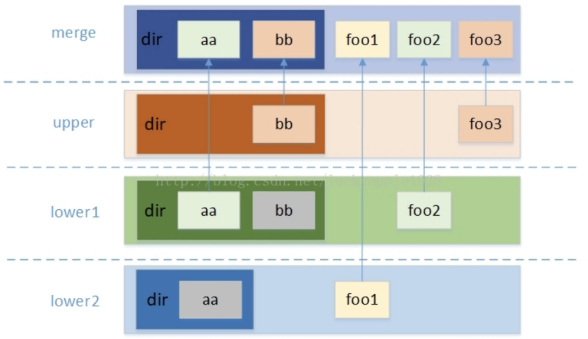

* [0 背景](#0-背景)
* [1 overlay介绍](#1-overlay介绍)
* [2\. 实验\-通过实验来理解](#2-实验-通过实验来理解)
  * [2\.1 实验设置](#21-实验设置)
  * [2\.2 补充实验](#22-补充实验)
  * [2\.2 结论](#22-结论)
    * [2\.2\.1 workdir作用是什么](#221-workdir作用是什么)
    * [2\.2\.2 文件覆盖规则](#222-文件覆盖规则)
* [3 源码分析\-通过原理来理解](#3-源码分析-通过原理来理解)
* [4 总结](#4-总结)

### 0 背景

cgroup, namespaces, chroot都是Linux 已有功能。这些计算是可以做到了隔离。但是docker在这些基层上来，加上了联合文件系统，这个是docker image的基础，使得镜像可以分层继承。overlay是docker联合文件系统的一种。本节就是对overlay的基础知识进行整理总结。

### 1 overlay介绍



`OverlayFS` 文件系统主要有三个角色，`lowerdir`、`upperdir` 和 `merged`。`lowerdir` 是只读层，用户不能修改这个层的文件；`upperdir` 是可读写层，用户能够修改这个层的文件；而 `merged` 是合并层，把 `lowerdir` 层和 `upperdir` 层的文件合并展示。

<br>

使用 `OverlayFS` 前需要进行挂载操作，挂载 `OverlayFS` 文件系统的基本命令如下：

```
$ mount -t overlay overlay -o lowerdir=lower1:lower2,upperdir=upper,workdir=work merged
```

参数 `-t` 表示挂载的文件系统类型，这里设置为 `overlay` 表示文件系统类型为 `OverlayFS`，而参数 `-o` 指定的是 `lowerdir`、`upperdir` 和 `workdir`，最后的 `merged` 目录就是最终的挂载点目录。下面说明一下 `-o` 参数几个目录的作用：

1. `lowerdir`：指定用户需要挂载的lower层目录，指定多个目录可以使用 `:` 来分隔（最大支持500层）。
2. `upperdir`：指定用户需要挂载的upper层目录。
3. `workdir`：指定文件系统的工作基础目录，挂载后内容会被清空，且在使用过程中其内容用户不可见。

### 2. 实验-通过实验来理解

#### 2.1 实验设置

```
root@k8s-master:~/testOverlay# mkdir -p fileRoot A B C worker

root@k8s-master:~/testOverlay# echo "from A" > A/a.txt
root@k8s-master:~/testOverlay# echo "from B" > B/b.txt
root@k8s-master:~/testOverlay# echo "from C" > C/c.txt
root@k8s-master:~/testOverlay# mkdir -p A/aa
root@k8s-master:~/testOverlay# tree
.
├── A
│   ├── aa
│   └── a.txt
├── B
│   └── b.txt
├── C
│   └── c.txt
├── fileRoot
└── worker
```

<br>

指定 A，B是 底层文件； C是 上层文件。 worker为工作目录。 入口函数为 fileRoot

```
mount -t overlay overlay -o lowerdir=A:B,upperdir=C,workdir=worker fileRoot
```

查看fileRoot结果：

```
root@k8s-master:~/testOverlay# mount -t overlay overlay -o lowerdir=A:B,upperdir=C,workdir=worker fileRoot
root@k8s-master:~/testOverlay# 
root@k8s-master:~/testOverlay# ls fileRoot/
aa  a.txt  b.txt  c.txt

// 1.对worker目录进行实验。 结果：worker目录可以写入，但是不会影响fileRoot文件
root@k8s-master:~/testOverlay# echo "from worker" > worker/work.txt
root@k8s-master:~/testOverlay# 
root@k8s-master:~/testOverlay# ls fileRoot/
aa  a.txt  b.txt  c.txt
root@k8s-master:~/testOverlay# 
root@k8s-master:~/testOverlay# ls worker/
work  work.txt


// 2.文件覆盖规则实验;  lowerdir可以手动修改
root@k8s-master:~/testOverlay# echo "from A1" > A/a.txt
root@k8s-master:~/testOverlay# cat fileRoot/a.txt 
from A1
root@k8s-master:~/testOverlay# ls worker/
work  work.txt
root@k8s-master:~/testOverlay# ls worker/work


// 3. 覆盖顺序测试： upperdir优先级最高，lowerdir按照mount时从左到右的顺序，权重依次降低，左边的覆盖右边的同名文件或者文件夹。
root@k8s-master:~/testOverlay# echo "from B" > B/a.txt
root@k8s-master:~/testOverlay# 
root@k8s-master:~/testOverlay# ls fileRoot/
aa  a.txt  b.txt  c.txt
root@k8s-master:~/testOverlay# cat fileRoot/a.txt 
from A1
root@k8s-master:~/testOverlay# cat A/a.txt 
from A1
root@k8s-master:~/testOverlay# cat B/a.txt 
from B

oot@k8s-master:~/testOverlay# echo "from A" > A/b.txt
root@k8s-master:~/testOverlay# cat A/b.txt 
from A
root@k8s-master:~/testOverlay# cat fileRoot/b.txt 
from A
root@k8s-master:~/testOverlay# cat B/b.txt 
from B
root@k8s-master:~/testOverlay# 
root@k8s-master:~/testOverlay# cat C/c.txt 
from C
root@k8s-master:~/testOverlay# cat fileRoot/c.txt 
from C
root@k8s-master:~/testOverlay# echo "from A" > A/c.txt
root@k8s-master:~/testOverlay# 
root@k8s-master:~/testOverlay# cat A/c.txt 
from A
root@k8s-master:~/testOverlay# cat C/c.txt 
from C
root@k8s-master:~/testOverlay# cat fileRoot/c.txt 
from C

// 目录中的文件也是一样，存在同名的时，以左边的A为准
root@k8s-master:~/testOverlay# mkdir B/aa
root@k8s-master:~/testOverlay# echo "from bb" > B/aa/a.txt
root@k8s-master:~/testOverlay# 
root@k8s-master:~/testOverlay# cat fileRoot/aa/a.txt 
from aa


root@k8s-master:~/testOverlay# echo "from bb" > B/aa/b.txt

// 为什么aa目录下没有b.txt
root@k8s-master:~/testOverlay# ls fileRoot/aa
a.txt
root@k8s-master:~/testOverlay# ls fileRoot/aa
a.txt
root@k8s-master:~/testOverlay# ls B/aa/b.txt 
B/aa/b.txt
root@k8s-master:~/testOverlay# ls A/aa/b.txt 
ls: cannot access 'A/aa/b.txt': No such file or directory
root@k8s-master:~/testOverlay# ls fileRoot/aa
a.txt
root@k8s-master:~/testOverlay# 
root@k8s-master:~/testOverlay# ls fileRoot/
aa  a.txt  b.txt  c.txt
root@k8s-master:~/testOverlay# 
root@k8s-master:~/testOverlay# cd fileRoot/
root@k8s-master:~/testOverlay/fileRoot# ls
aa  a.txt  b.txt  c.txt
root@k8s-master:~/testOverlay/fileRoot# cd aa/
root@k8s-master:~/testOverlay/fileRoot/aa# ls
a.txt

// 破案了，因为 A//aa 目录的优先级 比 B/aa高，所以fileRoot/aa = A/aa
root@k8s-master:~/testOverlay# echo "from aa" > A/aa/e.txt
root@k8s-master:~/testOverlay# 
root@k8s-master:~/testOverlay# ls fileRoot/a
aa/    a.txt  
root@k8s-master:~/testOverlay# ls fileRoot/a
aa/    a.txt  
root@k8s-master:~/testOverlay# ls fileRoot/aa/
a.txt  e.txt
root@k8s-master:~/testOverlay# 
root@k8s-master:~/testOverlay# echo "from bb" > B/aa/f.txt
root@k8s-master:~/testOverlay# ls fileRoot/aa/
a.txt  e.txt
root@k8s-master:~/testOverlay#

// 这个就有，所以
root@k8s-master:~/testOverlay# echo "from bb" > B/f.txt
root@k8s-master:~/testOverlay# ls fileRoot/
aa  a.txt  b.txt  c.txt  f.txt
root@k8s-master:~/testOverlay# cat fileRoot/f.txt 
from bb

// 为啥这个f.txt 不是from aa ???, 看起来又不是A为主？？
root@k8s-master:~/testOverlay# echo "from bb" > B/f.txt
root@k8s-master:~/testOverlay# ls fileRoot/
aa  a.txt  b.txt  c.txt  f.txt
root@k8s-master:~/testOverlay# cat fileRoot/f.txt 
from bb
root@k8s-master:~/testOverlay# echo "from aa" > A/f.txt
root@k8s-master:~/testOverlay# cat fileRoot/f.txt 
from bb
root@k8s-master:~/testOverlay# cat fileRoot/f.txt 
from bb

在merged文件夹所做的所有修改，最终都会存储到upperdir目录中
root@k8s-master:~/testOverlay# echo "from fileRoot" > fileRoot/fr.txt
root@k8s-master:~/testOverlay# ls C
c.txt  fr.txt
```

<br>

#### 2.2 补充实验

```
root@k8s-master:~/testOver# mkdir -p  fileRoot A/aa B/aa C worker
root@k8s-master:~/testOver# echo "from A" > A/a.txt
root@k8s-master:~/testOver# echo "from A" > A/aa/a.txt
root@k8s-master:~/testOver# echo "from B" > B/aa/a.txt
root@k8s-master:~/testOver# echo "from B" > B/aa/b.txt
root@k8s-master:~/testOver# echo "from B" > B/a.txt
root@k8s-master:~/testOver# echo "from B" > B/b.txt
root@k8s-master:~/testOver# echo "from C" > C/c.txt

root@k8s-master:~/testOver# mount -t overlay overlay -o lowerdir=A:B,upperdir=C,workdir=worker fileRoot
root@k8s-master:~/testOver# ls fileRoot/
aa  a.txt  b.txt  c.txt
root@k8s-master:~/testOver# ls fileRoot/a.txt 
fileRoot/a.txt
root@k8s-master:~/testOver# cat fileRoot/a.txt 
from A
root@k8s-master:~/testOver# ls fileRoot/aa/
a.txt  b.txt
root@k8s-master:~/testOver# cat fileRoot/aa/a.txt 
from A
```

#### 2.2 结论

##### 2.2.1 workdir作用是什么

通过实验：wokrdir目录平时都是空的，但是可以手动写入文件，写入文件后不影响overlay文件(fileRoot)；

通过实验没看出来，查询资料，解析是：

workdir选项是必需的，用于在原子操作中将文件切换到覆盖目标之前准备文件（workdir必须与upperdir在同一文件系统上）。

资料来源：[http](http://windsock.io/the-overlay-filesystem/) : [//windsock.io/the-overlay-filesystem/](http://windsock.io/the-overlay-filesystem/)

我可能会猜测“覆盖目标”的意思`upperdir`。

所以...某些文件（也许是“ whiteout”文件？）是非原子创建和配置的`workdir`，然后原子移动到的`upperdir`。

链接：https://qastack.cn/unix/324515/linux-filesystem-overlay-what-is-workdir-used-for-overlayfs

<br>

##### 2.2.2 文件覆盖规则

（1）lowerdir的值可以是一些的文件夹列表，文件都可以读写

（2）merged文件夹是最终联合起来的文件系统，我们可以在merged文件夹中访问所有lowerdir和upperdir中的内容

（3）文件的覆盖顺序，upperdir目录拥有最高覆盖权限，lowerdir按照mount时从左到右的顺序，权重依次降低，左边的覆盖右边的同名文件或者文件夹。

（4）在merged文件夹所做的所有修改，最终都会存储到upperdir目录中

（5）workdir指定的目录需要和upperdir位于同一目录中


（6）mount的时候，lowerdir相同文件会被最左边的覆盖，不同的文件和合并到相同目录 （补充实验）


### 3 源码分析-通过原理来理解

目前暂时先不设计这一块代码，了解大概的使用即可。如果需要，后面参考这两个链接再仔细研究。

https://mp.weixin.qq.com/s/pgu0uXvokgBTXUNk1LpB6Q

https://docs.docker.com/storage/storagedriver/overlayfs-driver/


###  4 总结

从实验结果来看，docker image里面的应该是最新的在最左边。
