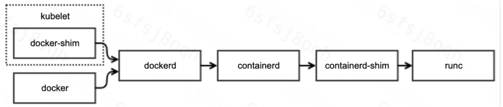

* [0\. 章节目的](#0-章节目的)
* [1\.docker 组件介绍](#1docker-组件介绍)
* [2\. docker 组件分析](#2-docker-组件分析)
  * [2\.1 docker](#21-docker)
  * [2\.2 docker proxy](#22-docker-proxy)
  * [2\.2 docker\-init](#22-docker-init)
  * [2\.4 runc](#24-runc)
  * [2\.5 dockerd](#25-dockerd)
  * [2\.6 containerd](#26-containerd)
  * [2\.7 <strong>containerd\-shim</strong>](#27-containerd-shim)
  * [2\.8 ctr](#28-ctr)
  * [2\.9 组件总结](#29-组件总结)
* [3\. 进程关系](#3-进程关系)
* [4\. docker为什么是这种结构](#4-docker为什么是这种结构)
* [5\. 参考文档](#5-参考文档)

### 0. 章节目的

本节的目的就是为了弄清楚：

（1）docker各组件有什么功能

（2）通过docker运行的容器，进程关系是什么样子，为什么会这样

### 1.docker 组件介绍

二进制安装docker的时候，可以发现，docker由以下的组件组成。

```
root@k8s-node:~#  tar zxvf docker-19.03.9.tgz
docker/
docker/docker-init
docker/runc
docker/docker
docker/docker-proxy
docker/containerd
docker/ctr
docker/dockerd
docker/containerd-shim
```

<br>

### 2. docker 组件分析

#### 2.1 docker

docker 是 Docker 客户端的一个完整实现，它是一个二进制文件，对用户可见的操作形式为 docker 命令，通过 docker 命令可以完成所有的 Docker 客户端与服务端的通信。

Docker 客户端与服务端的交互过程是：docker 组件向服务端发送请求后，服务端根据请求执行具体的动作并将结果返回给 docker，docker 解析服务端的返回结果，并将结果通过命令行标准输出展示给用户。这样一次完整的客户端服务端请求就完成了。

例如常见的命令  docker run/ps 等等

<br>

#### 2.2 docker proxy

docker-proxy 主要是用来做端口映射的。当我们使用 docker run 命令启动容器时，如果使用了 -p 参数，docker-proxy 组件就会把容器内相应的端口映射到主机上来，底层是依赖于 iptables 实现的。

```
root@cld-dnode1-1051:/usr/bin# docker run --name=nginx -d -p 8080:80 nginx


root@cld-dnode1-1051:/usr/bin# docker inspect --format '{{ .NetworkSettings.IPAddress }}' nginx
172.17.0.2

// 会多一个docker-proxy的进程
root@cld-dnode1-1051:/usr/bin# ps aux |grep docker-proxy
root     1983163  0.0  0.0 105912  4252 ?        Sl   15:42   0:00 /bin/docker-proxy -proto tcp -host-ip 0.0.0.0 -host-port 8080 -container-ip 172.17.0.2 -container-port 80
root     1985160  0.0  0.0  13544  2600 pts/1    S+   15:43   0:00 grep docker-proxy
```

#### 2.2 docker-init

在执行 docker run 启动容器时可以添加 --init 参数，此时 Docker 会使用 docker-init 作为1号进程，帮你管理容器内子进程，例如回收僵尸进程等。

```
root@cld-dnode1-1051:/usr/bin# ls docker*
docker	dockerd  dockerd-ce  docker-init  docker-proxy
root@cld-dnode1-1051:/usr/bin#

root@cld-dnode1-1051:/usr/bin# docker-init version
[WARN  tini (1973230)] Tini is not running as PID 1 and isn't registered as a child subreaper.
Zombie processes will not be re-parented to Tini, so zombie reaping won't work.
To fix the problem, use the -s option or set the environment variable TINI_SUBREAPER to register Tini as a child subreaper, or run Tini as PID 1.
[FATAL tini (1973231)] exec version failed: No such file or directory


root@cld-dnode1-1051:/usr/bin# docker run -it busybox sh
/ # ps aux
PID   USER     TIME  COMMAND
    1 root      0:00 sh
    6 root      0:00 ps aux

// 容器里面的init就是docker-init（看起来就是tini）
root@cld-dnode1-1051:/usr/bin# docker run -it --init busybox sh
/ # ps aux
PID   USER     TIME  COMMAND
    1 root      0:00 /dev/init -- sh
    6 root      0:00 sh
    7 root      0:00 ps aux

/ # /dev/init version
[WARN  tini (8)] Tini is not running as PID 1 and isn't registered as a child subreaper.
Zombie processes will not be re-parented to Tini, so zombie reaping won't work.
To fix the problem, use the -s option or set the environment variable TINI_SUBREAPER to register Tini as a child subreaper, or run Tini as PID 1.
[FATAL tini (9)] exec version failed: No such file or directory
```

#### 2.4 runc

runc 是一个标准的 OCI 容器运行时的实现，它是一个命令行工具，可以直接用来创建和运行容器。接下来直接进行演示：

(1) 准备容器运行时文件。可以看出来这里时和docker啥的都没有关系，都是一堆的基础目录和文件

```
root@cld-dnode1-1051:/ cd /root
root@cld-dnode1-1051:/ mkdir runc
root@cld-dnode1-1051:/ mkdir rootfs && docker export $(docker create busybox) | tar -C rootfs -xvf -

root@cld-dnode1-1051:/home/zouxiang/runc# tree -L 2
.
└── rootfs
    ├── bin
    ├── dev
    ├── etc
    ├── home
    ├── proc
    ├── root
    ├── sys
    ├── tmp
    ├── usr
    └── var
```

（2）准备config文件

使用 runc spec 命令根据文件系统生成对应的 config.json 文件。

在config.json里指定了容器运行的args，env等等。

```
root@cld-dnode1-1051:/home/zouxiang/runc# runc spec

root@cld-dnode1-1051:/home/zouxiang/runc# cat config.json
{
	"ociVersion": "1.0.1-dev",
	"process": {
		"terminal": true,
		"user": {
			"uid": 0,
			"gid": 0
		},
		"args": [
			"sh"
		],
		"env": [
			"PATH=/usr/local/sbin:/usr/local/bin:/usr/sbin:/usr/bin:/sbin:/bin",
			"TERM=xterm"
		],
		"cwd": "/",
		"capabilities": {
			"bounding": [
				"CAP_AUDIT_WRITE",
				"CAP_KILL",
				"CAP_NET_BIND_SERVICE"
			],
			"effective": [
				"CAP_AUDIT_WRITE",
				"CAP_KILL",
				"CAP_NET_BIND_SERVICE"
			],
			"inheritable": [
				"CAP_AUDIT_WRITE",
				"CAP_KILL",
				"CAP_NET_BIND_SERVICE"
			],
			"permitted": [
				"CAP_AUDIT_WRITE",
				"CAP_KILL",
				"CAP_NET_BIND_SERVICE"
			],
			"ambient": [
				"CAP_AUDIT_WRITE",
				"CAP_KILL",
				"CAP_NET_BIND_SERVICE"
			]
		},
		"rlimits": [
			{
				"type": "RLIMIT_NOFILE",
				"hard": 1024,
				"soft": 1024
			}
		],
		"noNewPrivileges": true
	},
	"root": {
		"path": "rootfs",
		"readonly": true
	},
	"hostname": "runc",
	"mounts": [
		{
			"destination": "/proc",
			"type": "proc",
			"source": "proc"
		},
		{
			"destination": "/dev",
			"type": "tmpfs",
			"source": "tmpfs",
			"options": [
				"nosuid",
				"strictatime",
				"mode=755",
				"size=65536k"
			]
		},
		{
			"destination": "/dev/pts",
			"type": "devpts",
			"source": "devpts",
			"options": [
				"nosuid",
				"noexec",
				"newinstance",
				"ptmxmode=0666",
				"mode=0620",
				"gid=5"
			]
		},
		{
			"destination": "/dev/shm",
			"type": "tmpfs",
			"source": "shm",
			"options": [
				"nosuid",
				"noexec",
				"nodev",
				"mode=1777",
				"size=65536k"
			]
		},
		{
			"destination": "/dev/mqueue",
			"type": "mqueue",
			"source": "mqueue",
			"options": [
				"nosuid",
				"noexec",
				"nodev"
			]
		},
		{
			"destination": "/sys",
			"type": "sysfs",
			"source": "sysfs",
			"options": [
				"nosuid",
				"noexec",
				"nodev",
				"ro"
			]
		},
		{
			"destination": "/sys/fs/cgroup",
			"type": "cgroup",
			"source": "cgroup",
			"options": [
				"nosuid",
				"noexec",
				"nodev",
				"relatime",
				"ro"
			]
		}
	],
	"linux": {
		"resources": {
			"devices": [
				{
					"allow": false,
					"access": "rwm"
				}
			]
		},
		"namespaces": [
			{
				"type": "pid"
			},
			{
				"type": "network"
			},
			{
				"type": "ipc"
			},
			{
				"type": "uts"
			},
			{
				"type": "mount"
			}
		],
		"maskedPaths": [
			"/proc/acpi",
			"/proc/asound",
			"/proc/kcore",
			"/proc/keys",
			"/proc/latency_stats",
			"/proc/timer_list",
			"/proc/timer_stats",
			"/proc/sched_debug",
			"/sys/firmware",
			"/proc/scsi"
		],
		"readonlyPaths": [
			"/proc/bus",
			"/proc/fs",
			"/proc/irq",
			"/proc/sys",
			"/proc/sysrq-trigger"
		]
	}
}

注意 config.json 和rootfs是同一级
root@cld-dnode1-1051:/home/zouxiang/runc# tree -L 1
.
├── config.json
└── rootfs
```

（3）运行容器

```
root@cld-dnode1-1051:/home/zouxiang/runc# runc run container1
/ # ps aux
PID   USER     TIME  COMMAND
    1 root      0:00 sh
    7 root      0:00 ps aux

另一个窗口就能看到
root@cld-dnode1-1051:/home/zouxiang# runc list
ID           PID         STATUS      BUNDLE                CREATED                          OWNER
container1   2040317     running     /home/zouxiang/runc   2022-01-26T08:14:57.916602955Z   root
```

#### 2.5 dockerd

dockerd 是 Docker 服务端的后台常驻进程，用来接收客户端发送的请求，执行具体的处理任务，处理完成后将结果返回给客户端。

docker run/ps 是客户端。dockerd是服务器端。但是dockerd不是真正干活的，正在干活的是containerd。

#### 2.6 containerd

containerd 组件是从 Docker 1.11 版本正式从 dockerd 中剥离出来的，它的诞生完全遵循 OCI 标准，是容器标准化后的产物。containerd 完全遵循了 OCI 标准，并且是完全社区化运营的，因此被容器界广泛采用。

containerd 不仅负责容器生命周期的管理，同时还负责一些其他的功能：

- 镜像的管理，例如容器运行前从镜像仓库拉取镜像到本地；
- 接收 dockerd 的请求，通过适当的参数调用 runc 启动容器；
- 管理存储相关资源；
- 管理网络相关资源。

containerd 包含一个后台常驻进程，默认的 socket 路径为 /run/containerd/containerd.sock，dockerd 通过 UNIX 套接字向 containerd 发送请求，containerd 接收到请求后负责执行相关的动作并把执行结果返回给 dockerd。

如果你不想使用 dockerd，也可以直接使用 containerd 来管理容器，由于 containerd 更加简单和轻量，生产环境中越来越多的人开始直接使用 containerd 来管理容器。

#### 2.7 **containerd-shim**

containerd-shim 的意思是垫片，类似于拧螺丝时夹在螺丝和螺母之间的垫片。containerd-shim 的主要作用是将 containerd 和真正的容器进程解耦，使用 containerd-shim 作为容器进程的父进程，从而实现重启 containerd 不影响已经启动的容器进程。

```
root@cld-dnode1-1051:/usr/bin# containerd-shim -h
Usage of containerd-shim:
  -address string
    	grpc address back to main containerd
  -containerd-binary containerd publish
    	path to containerd binary (used for containerd publish) (default "containerd")
  -criu string
    	path to criu binary
  -debug
    	enable debug output in logs
  -namespace string
    	namespace that owns the shim
  -runtime-root string
    	root directory for the runtime (default "/run/containerd/runc")
  -socket string
    	abstract socket path to serve
  -systemd-cgroup
    	set runtime to use systemd-cgroup
  -workdir string
    	path used to storge large temporary data
```

#### 2.8 ctr 

ctr 实际上是 containerd-ctr，它是 containerd 的客户端，主要用来开发和调试，在没有 dockerd 的环境中，ctr 可以充当 docker 客户端的部分角色，直接向 containerd 守护进程发送操作容器的请求。

```
root@cld-dnode1-1051:/usr/bin# ctr -h
NAME:
   ctr -
        __
  _____/ /______
 / ___/ __/ ___/
/ /__/ /_/ /
\___/\__/_/

containerd CLI


USAGE:
   ctr [global options] command [command options] [arguments...]

VERSION:
   1.2.13

COMMANDS:
     plugins, plugin           provides information about containerd plugins
     version                   print the client and server versions
     containers, c, container  manage containers
     content                   manage content
     events, event             display containerd events
     images, image, i          manage images
     leases                    manage leases
     namespaces, namespace     manage namespaces
     pprof                     provide golang pprof outputs for containerd
     run                       run a container
     snapshots, snapshot       manage snapshots
     tasks, t, task            manage tasks
     install                   install a new package
     shim                      interact with a shim directly
     cri                       interact with cri plugin
     help, h                   Shows a list of commands or help for one command

GLOBAL OPTIONS:
   --debug                      enable debug output in logs
   --address value, -a value    address for containerd's GRPC server (default: "/run/containerd/containerd.sock")
   --timeout value              total timeout for ctr commands (default: 0s)
   --connect-timeout value      timeout for connecting to containerd (default: 0s)
   --namespace value, -n value  namespace to use with commands (default: "default") [$CONTAINERD_NAMESPACE]
   --help, -h                   show help
   --version, -v                print the version
```

<br>

#### 2.9 组件总结

| 组件类别           | 组件名称        | 核心功能                                                     |
| ------------------ | --------------- | ------------------------------------------------------------ |
| docker相关组件     | Docker          | docker的客户端，复杂发送docker操作请求                       |
| docker相关组件     | Docker          | docker服务端的入口，负责处理客户端请求                       |
| docker相关组件     | Docker-init     | 实用docker-init作为1号进程（业务1号进程没有回收僵尸进程的能力）。 |
| docker相关组件     | Docker-proxy    | docker网络实现，通过操作iptables实现。                       |
| Containerd相关组件 | Containerd      | 负责管理容器生命周期，通过接受dockerd的请求, 执行启动或者销毁容器草 |
| Containerd相关组件 | Containerd-shim | 将真正运行的容器进程和Container解藕，Containerd-shim作为容器进程的父进程 |
| Containerd相关组件 | Ctr             | Containerd的客户端，可以直接向containerd发送容器操作的请求，主要用于开发和调试 |
| 容器运行时组件     | Runc            | 通过调用namespaces, groups等系统调用接口，实现容器的操作     |

<br>

### 3. 进程关系

并且查看进程树，发现进程关系为：

```
docker     ctr
  |         |
  V         V
dockerd -> containerd ---> shim -> runc -> runc init -> process
                      |-- > shim -> runc -> runc init -> process
                      +-- > shim -> runc -> runc init -> process
```

<br>

```
root     3250772  ...    /usr/bin/dockerd -p /var/run/docker.pid
root        2010 ...  /usr/bin/containerd
root     3467567  ... containerd-shim -namespace moby -workdir /var/lib/containerd/io.containerd.runtime.v1.linux/moby/cabf53bfcd5f079159b8891520c2c2c0dee811568f7d0942b80dd8d12459ab06 -address /run/containerd/containerd.sock -containerd-binary /usr/bin/containerd -runtime-root /var/run/docker/runtime-runc
```

Docker, containerd的父进程都是1好进程。从进程树来看，并没有直接的父子关系。

从这篇文章可以看出来，[docker进程模型，架构分析](https://segmentfault.com/a/1190000011294361)，containerd进程时docker启动的。

<br>

### 4. docker为什么是这种结构

当 Kubelet 想要创建一个**容器**时, 有这么几步:

1. Kubelet 通过 **CRI 接口**(gRPC) 调用 dockershim, 请求创建一个容器. **CRI** 即容器运行时接口(Container Runtime Interface), 这一步中, Kubelet 可以视作一个简单的 CRI Client, 而 dockershim 就是接收请求的 Server. 目前 dockershim 的代码其实是内嵌在 Kubelet 中的, 所以接收调用的凑巧就是 Kubelet 进程;
2. dockershim 收到请求后, 转化成 Docker Daemon 能听懂的请求, 发到 Docker Daemon 上请求创建一个容器;
3. Docker Daemon 早在 1.12 版本中就已经将针对容器的操作移到另一个守护进程: containerd 中了, 因此 Docker Daemon 仍然不能帮我们创建容器, 而是要请求 containerd 创建一个容器;
4. containerd 收到请求后, 并不会自己直接去操作容器, 而是创建一个叫做 containerd-shim 的进程, 让 containerd-shim 去操作容器. 这是因为容器进程需要一个父进程来做诸如收集状态, 维持 stdin 等 fd 打开等工作. 而假如这个父进程就是 containerd, 那每次 containerd 挂掉或升级, 整个宿主机上所有的容器都得退出了. 而引入了 containerd-shim 就规避了这个问题(containerd 和 shim 并不是父子进程关系);
5. 我们知道创建容器需要做一些设置 namespaces 和 cgroups, 挂载 root filesystem 等等操作, 而这些事该怎么做已经有了公开的规范了, 那就是 [OCI(Open Container Initiative, 开放容器标准)](https://link.zhihu.com/?target=https%3A//github.com/opencontainers/runtime-spec). 它的一个参考实现叫做 [runc](https://link.zhihu.com/?target=https%3A//github.com/opencontainers/runc). 于是, containerd-shim 在这一步需要调用 `runc` 这个命令行工具, 来启动容器;
6. `runc` 启动完容器后本身会直接退出, containerd-shim 则会成为容器进程的父进程, 负责收集容器进程的状态, 上报给 containerd, 并在容器中 pid 为 1 的进程退出后接管容器中的子进程进行清理, 确保不会出现僵尸进程;





（1）为什么需要docker-shim?

因为k8s定义了CRI，这样可以和docker, rkt等容器运行时解藕。但是dockerd没有不支持CRI。虽有需要docker-shim进行一次转换。

（2）为什么需要containerd

其实 k8s 最开始的 Runtime 架构远没这么复杂: kubelet 想要创建容器直接跟 Docker Daemon 说一声就行, 而那时也不存在 containerd, Docker Daemon 自己调一下 `libcontainer` 这个库把容器跑起来, 整个过程就搞完了.

但是大佬们为了不让容器运行时标准被 Docker 一家公司控制, 于是就撺掇着搞了开放容器标准 OCI. Docker 则把 `libcontainer` 封装了一下, 变成 runC 捐献出来作为 OCI 的参考实现。

所以： libcontainer = runc

containerd就变成了负责兼容的处理人，处理客户端请求。具体执行变成了runc

（3）为什么需要containers-shim

主要作用是将 containerd 和真正的容器进程解耦，使用 containerd-shim 作为容器进程的父进程，从而实现重启 containerd 不影响已经启动的容器进程。

### 5. 参考文档

[组件组成：剖析 Docker 组件作用及其底层工作原理](https://blog.csdn.net/qq_34556414/article/details/112247223)

[系列好文 ｜ Kubernetes 弃用 Docker，我们该何去何从？](http://blog.itpub.net/70002215/viewspace-2779207/)

[docker进程模型，架构分析](https://segmentfault.com/a/1190000011294361)

https://www.huweihuang.com/article/docker/code-analysis/code-analysis-of-docker-server/

[白话 Kubernetes Runtime](https://zhuanlan.zhihu.com/p/58784095)

[Docker源码分析](https://www.huweihuang.com/article/docker/code-analysis/code-analysis-of-docker-server/)

[docker exec 失败问题排查之旅](https://xyz.uscwifi.xyz/post/DdS5a690E/)

[kubectl exec 是怎么工作的](https://www.techclone.cn/post/tech/k8s/k8s-exec-failure/)