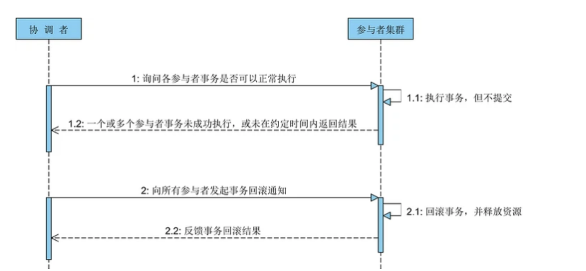
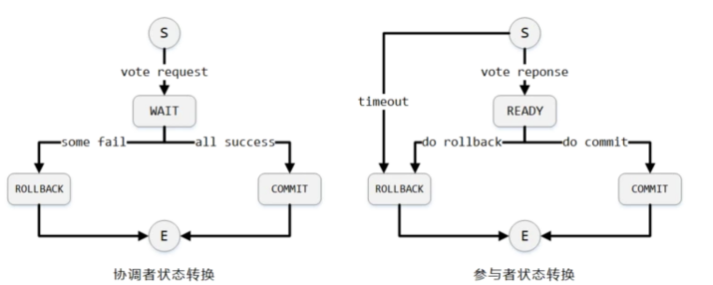

### 1.ACID是什么

事务是由一组SQL语句组成的逻辑处理单元，事务具有以下4个属性，通常简称为事务的ACID属性。

ACID
Atomic（原子性）

Consistency（一致性）

Isolation（隔离性）

Durability（持久性）的英文缩写。

### 2. 分布式系统如何实现ACID
#### 2.1 二阶段提交协议

两阶段提交协议（2PC：Two-Phase Commit）
两阶段提交协议的目标在于为分布式系统保证数据的一致性，许多分布式系统采用该协议提供对分布式事务的支持。顾名思义，该协议将一个分布式的事务过程拆分成两个阶段： 投票 和 事务提交 。为了让整个数据库集群能够正常的运行，该协议指定了一个 协调者 单点，用于协调整个数据库集群各节点的运行。为了简化描述，我们将数据库集群中的各个节点称为 参与者 ，三阶段提交协议中同样包含协调者和参与者这两个角色定义。

##### 2.1.1 原理

**第一阶段：投票**
该阶段的主要目的在于打探数据库集群中的各个参与者是否能够正常的执行事务，具体步骤如下：

协调者向所有的参与者发送事务执行请求，并等待参与者反馈事务执行结果；
事务参与者收到请求之后，执行事务但不提交，并记录事务日志；
参与者将自己事务执行情况反馈给协调者，同时阻塞等待协调者的后续指令。
**第二阶段：事务提交**
在经过第一阶段协调者的询盘之后，各个参与者会回复自己事务的执行情况，这时候存在 3 种可能性：

（1）所有的参与者都回复能够正常执行事务。

（2）一个或多个参与者回复事务执行失败。

（3）协调者等待超时。

 

对于第 1 种情况，协调者将向所有的参与者发出提交事务的通知，具体步骤如下：

协调者向各个参与者发送 commit 通知，请求提交事务；
参与者收到事务提交通知之后执行 commit 操作，然后释放占有的资源；
参与者向协调者返回事务 commit 结果信息。

对于第 2 和第 3 种情况，协调者均认为参与者无法成功执行事务，为了整个集群数据的一致性，所以要向各个参与者发送事务回滚通知，具体步骤如下：

协调者向各个参与者发送事务 rollback 通知，请求回滚事务；
参与者收到事务回滚通知之后执行 rollback 操作，然后释放占有的资源；
参与者向协调者返回事务 rollback 结果信息。

__两阶段提交协议解决的是分布式数据库数据强一致性问题__，实际应用中更多的是用来解决事务操作的原子性，下图描绘了协调者与参与者的状态转换。

站在协调者的角度，在发起投票之后就进入了 WAIT 状态，等待所有参与者回复各自事务执行状态，并在收到所有参与者的回复后决策下一步是发送 commit 或 rollback 信息。站在参与者的角度，当回复完协调者的投票请求之后便进入 READY 状态（能够正常执行事务），接下去就是等待协调者最终的决策通知，一旦收到通知便可依据决策执行 commit 或 rollback 操作。

##### 2.1.2 优缺点

两阶段提交协议原理简单、易于实现，但是缺点也是显而易见的，包含如下：

（1）单点问题
协调者在整个两阶段提交过程中扮演着举足轻重的作用，一旦协调者所在服务器宕机，就会影响整个数据库集群的正常运行。比如在第二阶段中，如果协调者因为故障不能正常发送事务提交或回滚通知，那么参与者们将一直处于阻塞状态，整个数据库集群将无法提供服务。

（2）同步阻塞
两阶段提交执行过程中，所有的参与者都需要听从协调者的统一调度，期间处于阻塞状态而不能从事其他操作，这样效率极其低下。

（3）数据不一致性
两阶段提交协议虽然是分布式数据强一致性所设计，但仍然存在数据不一致性的可能性。比如在第二阶段中，假设协调者发出了事务 commit 通知，但是因为网络问题该通知仅被一部分参与者所收到并执行了commit 操作，其余的参与者则因为没有收到通知一直处于阻塞状态，这时候就产生了数据的不一致性。

针对上述问题可以引入 超时机制 和 互询机制 在很大程度上予以解决。

对于协调者来说如果在指定时间内没有收到所有参与者的应答，则可以自动退出 WAIT 状态，并向所有参与者发送 rollback 通知。对于参与者来说如果位于 READY 状态，但是在指定时间内没有收到协调者的第二阶段通知，则不能武断地执行 rollback 操作，因为协调者可能发送的是 commit 通知，这个时候执行 rollback 就会导致数据不一致。

此时，我们可以介入互询机制，让参与者 A 去询问其他参与者 B 的执行情况。如果 B 执行了 rollback 或 commit 操作，则 A 可以大胆的与 B 执行相同的操作；如果 B 此时还没有到达 READY 状态，则可以推断出协调者发出的肯定是 rollback 通知；如果 B 同样位于 READY 状态，则 A 可以继续询问另外的参与者。只有当所有的参与者都位于 READY 状态时，此时两阶段提交协议无法处理，将陷入长时间的阻塞状态。

**三段式提交协议多了一个预询盘阶段**

#### 2.2 TCC （Try-confirm-cancel）

TCC 其实就是采用的补偿机制，其核心思想是：针对每个操作，都要注册一个与其对应的确认和补偿（撤销）操作。它分为三个阶段：

（1）Try 阶段主要是对业务系统做检测及资源预留

（2）Confirm 阶段主要是对业务系统做确认提交，Try阶段执行成功并开始执行 Confirm阶段时，默认 Confirm阶段是不会出错的。即：只要Try成功，Confirm一定成功。

（3）Cancel 阶段主要是在业务执行错误，需要回滚的状态下执行的业务取消，预留资源释放。
举个例子，假入 Bob 要向 Smith 转账，思路大概是：我们有一个本地方法，里面依次调用

1、首先在 Try 阶段，要先调用远程接口把 Smith 和 Bob 的钱给冻结起来。

2、在 Confirm 阶段，执行远程调用的转账的操作，转账成功进行解冻。

3、如果第2步执行成功，那么转账成功，如果第二步执行失败，则调用远程冻结接口对应的解冻方法 (Cancel)。

#### 2.3 二阶段提交和TCC区别

经常在网络上看见有人介绍TCC时，都提一句，”TCC是两阶段提交的一种”。其理由是TCC将业务逻辑分成try、confirm/cancel在两个不同的阶段中执行。其实这个说法，是不正确的。

可能是因为既不太了解两阶段提交机制、也不太了解TCC机制的缘故，于是将两阶段提交机制的prepare、commit两个事务提交阶段和TCC机制的try、confirm/cancel两个业务执行阶段互相混淆，才有了这种说法。两阶段提交（Two Phase Commit，下文简称2PC），简单的说，是将事务的提交操作分成了prepare、commit两个阶段。

其事务处理方式为：

1、 在全局事务决定提交时，

​     a）逐个向RM发送prepare请求；

​     b）若所有RM都返回OK，则逐个发送commit请求最终提交事务；否则，逐个发送rollback请求来回滚事务；

2、 在全局事务决定回滚时，直接逐个发送rollback请求即可，不必分阶段。

需要注意的是：2PC机制需要RM提供底层支持（一般是兼容XA），而TCC机制则不需要。

TCC（Try-Confirm-Cancel），则是将业务逻辑分成try、confirm/cancel两个阶段执行，其事务处理方式为：

1、 在全局事务决定提交时，调用与try业务逻辑相对应的confirm业务逻辑；

2、 在全局事务决定回滚时，调用与try业务逻辑相对应的cancel业务逻辑。

可见，TCC在事务处理方式上，是很简单的：要么调用confirm业务逻辑，要么调用cancel逻辑。这里为什么没有提到try业务逻辑呢？因为try逻辑与全局事务处理无关。

当讨论2PC时，我们只专注于事务处理阶段，因而只讨论prepare和commit，所以，可能很多人都忘了，使用2PC事务管理机制时也是有业务逻辑阶段的。正是因为业务逻辑的执行，发起了全局事务，这才有其后的事务处理阶段。

实际上，使用2PC机制时

————以提交为例————

一个完整的事务生命周期是：begin -> 业务逻辑 -> prepare -> commit。

再看TCC，也不外乎如此。我们要发起全局事务，同样也必须通过执行一段业务逻辑来实现。该业务逻辑

一来通过执行触发TCC全局事务的创建；二来也需要执行部分数据写操作；

此外，还要通过执行来向TCC全局事务注册自己，以便后续TCC全局事务commit/rollback时回调其相应的confirm/cancel业务逻辑。

所以，使用TCC机制时

————以提交为例————

一个完整的事务生命周期是：begin -> 业务逻辑(try业务) -> commit(comfirm业务)。

综上，我们可以从执行的阶段上将二者一一对应起来：

1、 2PC机制的业务阶段 等价于 TCC机制的try业务阶段；

2、 2PC机制的提交阶段（prepare & commit） 等价于 TCC机制的提交阶段（confirm）；

3、 2PC机制的回滚阶段（rollback） 等价于 TCC机制的回滚阶段（cancel）。

因此，可以看出，虽然TCC机制中有两个阶段都存在业务逻辑的执行，但其中try业务阶段其实是与全局事务处理无关的。认清了这一点，当我们再比较TCC和2PC时，就会很容易地发现，TCC不是两阶段提交，而只是它对事务的提交/回滚是通过执行一段confirm/cancel业务逻辑来实现，仅此而已。