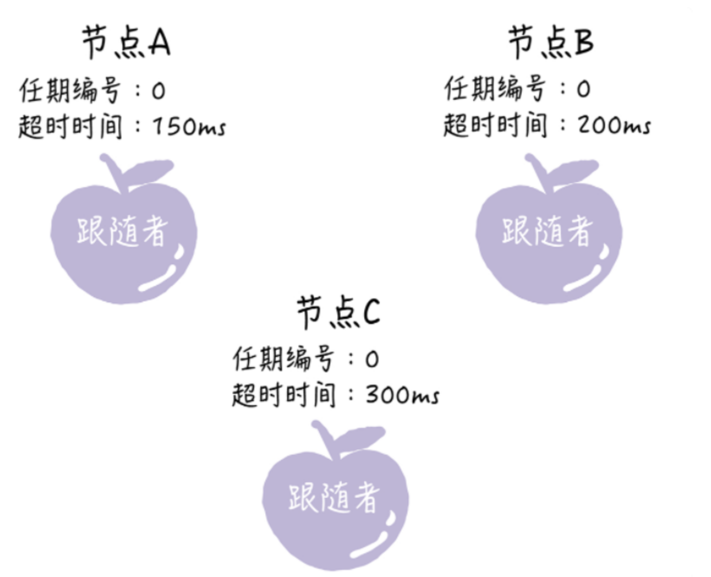
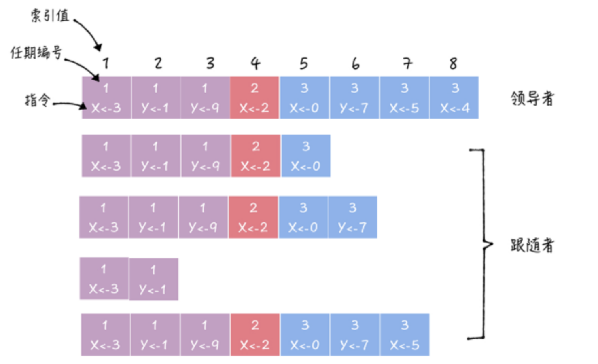
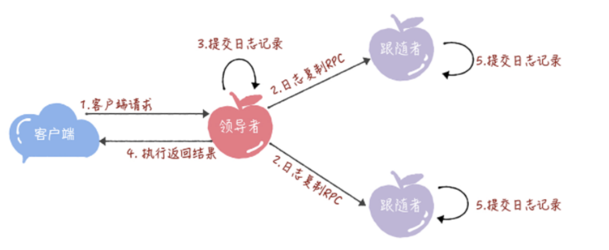
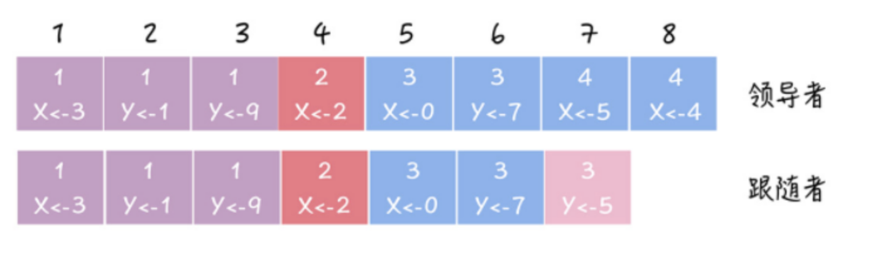

[toc]

### 1. raft算法是如何初始化的

初始状态下，集群中所有的节点都是跟随者状态。

Raft 算法实现了随机超时时间的特性。也就是说，每个节点等待领导者节点心跳信息的超时时间间隔是随机的。通过下面的图片你可以看到，集群中没有领导者，而节点 A 的等待超时时间最小（150ms），它会最先因为没有等到领导者的心跳信息，发生超时。

所以A节点最先没有收到领导者的心跳。所以这个时候，节点 A 就增加自己的任期编号，并推举自己为候选人，先给自己投上一张选票，然后向其他节点发送请求投票 RPC 消息，请它们选举自己为领导者。

如果其他节点接收到候选人 A 的请求投票 RPC 消息，在编号为 1 的这届任期内，也还没有进行过投票，那么它将把选票投给节点 A，并增加自己的任期编号。

如果候选人在选举超时时间内赢得了大多数的选票，那么它就会成为本届任期内新的领导者。

节点 A 当选领导者后，他将周期性地发送心跳消息，通知其他服务器我是领导者，阻止跟随者发起新的选举，篡权。

#### 1.1 节点之间是如何通信的

在 Raft 算法中，服务器节点间的沟通联络采用的是远程过程调用（RPC），在领导者选举中，需要用到这样两类的 RPC：

1. 请求投票（RequestVote）RPC，是由候选人在选举期间发起，通知各节点进行投票；

2. 日志复制（AppendEntries）RPC，是由领导者发起，用来复制日志和提供心跳消息。

我想强调的是，日志复制 RPC 只能由领导者发起，这是实现强领导者模型的关键之一，希望你能注意这一点，后续能更好地理解日志复制，理解日志的一致是怎么实现的。

#### 1.2 任期编号有什么用

任期编号是递增的，随着选举的举行而不断变化的。具体有：

（1）跟随者在等待领导者心跳信息超时后，推举自己为候选人时，会增加自己的任期号，比如节点 A 的当前任期编号为 0，那么在推举自己为候选人时，会将自己的任期编号增加为 1。

（2）如果一个服务器节点，发现自己的任期编号比其他节点小，那么它会更新自己的编号到较大的编号值。比如节点 B 的任期编号是 0，当收到来自节点 A 的请求投票 RPC 消息时，因为消息中包含了节点 A 的任期编号，且编号为 1，那么节点 B 将把自己的任期编号更新为 1。

#### 1.3 选举规则
（1）领导者周期性地向所有跟随者发送心跳消息（即不包含日志项的日志复制 RPC 消息），通知大家我是领导者，阻止跟随者发起新的选举。

（2）如果在指定时间内，跟随者没有接收到来自领导者的消息，那么它就认为当前没有领导者，推举自己为候选人，发起领导者选举。

（3）在一次选举中，赢得大多数选票的候选人，将晋升为领导者。

（4）在一个任期内，领导者一直都会是领导者，直到它自身出现问题（比如宕机），或者因为网络延迟，其他节点发起一轮新的选举。

（5）在一次选举中，每一个服务器节点最多会对一个任期编号投出一张选票，并且按照“先来先服务”的原则进行投票。比如节点 C 的任期编号为 3，先收到了 1 个包含任期编号为 4 的投票请求（来自节点 A），然后又收到了 1 个包含任期编号为 4 的投票请求（来自节点 B）。那么节点 C 将会把唯一一张选票投给节点 A，当再收到节点 B 的投票请求 RPC 消息时，对于编号为 4 的任期，已没有选票可投了。

（6）当任期编号相同时，日志完整性高的跟随者（也就是最后一条日志项对应的任期编号值更大，索引号更大），拒绝投票给日志完整性低的候选人。比如节点 B、C 的任期编号都是 3，节点 B 的最后一条日志项对应的任期编号为 3，而节点 C 为 2，那么当节点 C 请求节点 B 投票给自己时，节点 B 将拒绝投票。

选举是跟随者发起的，推举自己为候选人；大多数选票是指集群成员半数以上的选票；大多数选票规则的目标，是为了保证在一个给定的任期内最多只有一个领导者。

#### 1.4 如何理解随机超时时间

在议会选举中，常出现未达到指定票数，选举无效，需要重新选举的情况。在 Raft 算法的选举中，也存在类似的问题，那它是如何处理选举无效的问题呢？

其实，Raft 算法巧妙地使用随机选举超时时间的方法，把超时时间都分散开来，在大多数情况下只有一个服务器节点先发起选举，而不是同时发起选举，这样就能减少因选票瓜分导致选举失败的情况。

随机超时包括两层含义：

（1）跟随者等待领导者心跳信息超时的时间间隔，是随机的；

（2）当没有候选人赢得过半票数，选举无效了，这时需要等待一个随机时间间隔，也就是说，等待选举超时的时间间隔，是随机的。

#### 1.5.疑问

（1）选举规则5,6有矛盾，先来先到 和根据日志判断。 

看起来跟随者是有等待时间的吗，等待所有的候选人发的rpc到了之后，再选择一个投票吗？

目前看起来就是和自己比。如果当前节点收到了一个投票者的RPC。如果item比自己小直接拒绝；如果item一致，但是日志index比自己小也直接拒绝。因为集群写入好一个数据，会在大部分节点上都写好才算。所以候选人会和挂之前的leader保持一致的。

（2）如果A是候选人，B，C是跟随者。但是A->C 出现了网络问题。 C发起重新选举。并且C和A的日志是一样的，会怎么样？

目前看起来是会切换为C的。

#### 1.6. raft的选举机制的局限

关于raft的领导者选举限制和局限：

1.读写请求和数据转发压力落在领导者节点，导致领导者压力。

2.大规模跟随者的集群，领导者需要承担大量元数据维护和心跳通知的成本。

3.领导者单点问题，故障后直到新领导者选举出来期间集群不可用。

4.随着候选人规模增长，收集半数以上投票的成本更大。
 

### 2.raft日志机制

#### 2.1 什么是日志

日志项是一种数据格式，它主要包含用户指定的数据，也就是指令（Command），还包含一些附加信息，比如索引值（Log index）、任期编号（Term）。

（1）指令：一条由客户端请求指定的、状态机需要执行的指令。你可以将指令理解成客户端指定的数据。

（2）索引值：日志项对应的整数索引值。它其实就是用来标识日志项的，是一个连续的、单调递增的整数号码。

（3）任期编号：创建这条日志项的领导者的任期编号。

从图中可以看到，一届领导者任期，往往有多条日志项。而且日志项的索引值是连续的。

上述四个节点的日志不一致的原因在于，由于网络原因或者服务器其他问题，导致某些节点的日志点没跟上。所以这个时候就要进行日志同步了。

#### 2.2 日志同步

正常的日志同步是这样的：

（1）接收到客户端请求后，领导者基于客户端请求中的指令，创建一个新日志项，并附加到本地日志中。

（2）领导者通过日志复制 RPC，将新的日志项复制到其他的服务器。

（3）当领导者将日志项，成功复制到大多数的服务器上的时候，领导者会将这条日志项提交到它的状态机中。

（4）领导者将执行的结果返回给客户端。

（5）当跟随者接收到心跳信息，或者新的日志复制 RPC 消息后，如果跟随者发现领导者已经提交了某条日志项，而它还没提交，那么跟随者就将这条日志项提交到本地的状态机中。

但是由于网络或者其他原因，某些节点并不是大多数之一，所以日志就一直落后。这个时候就需要复制日志了。

在 Raft 算法中，领导者通过强制跟随者直接复制自己的日志项，处理不一致日志。也就是说，Raft 是通过以领导者的日志为准，来实现各节点日志的一致的。具体有 2 个步骤。

首先，领导者通过日志复制 RPC 的一致性检查，找到跟随者节点上，与自己相同日志项的最大索引值。也就是说，这个索引值之前的日志，领导者和跟随者是一致的，之后的日志是不一致的了。

然后，领导者强制跟随者更新覆盖的不一致日志项，实现日志的一致。

详细过程如下：

PrevLogEntry：表示当前要复制的日志项，前面一条日志项的索引值。比如在图中，如果领导者将索引值为 8 的日志项发送给跟随者，那么此时 PrevLogEntry 值为 7。

PrevLogTerm：表示当前要复制的日志项，前面一条日志项的任期编号，比如在图中，如果领导者将索引值为 8 的日志项发送给跟随者，那么此时 PrevLogTerm 值为 4。

那么复制日志的过程如下：

（1）领导者通过日志复制 RPC 消息，发送当前最新日志项到跟随者（为了演示方便，假设当前需要复制的日志项是最新的），这个消息的 PrevLogEntry 值为 7，PrevLogTerm 值为 4。

（2）如果跟随者在它的日志中，找不到与 PrevLogEntry 值为 7、PrevLogTerm 值为 4 的日志项，也就是说它的日志和领导者的不一致了，那么跟随者就会拒绝接收新的日志项，并返回失败信息给领导者。

（3）这时，领导者会递减要复制的日志项的索引值，并发送新的日志项到跟随者，这个消息的 PrevLogEntry 值为 6，PrevLogTerm 值为 3。

（4）如果跟随者在它的日志中，找到了 PrevLogEntry 值为 6、PrevLogTerm 值为 3 的日志项，那么日志复制 RPC 返回成功，这样一来，领导者就知道在 PrevLogEntry 值为 6、PrevLogTerm 值为 3 的位置，跟随者的日志项与自己相同。

（5）领导者通过日志复制 RPC，复制并更新覆盖该索引值之后的日志项（也就是不一致的日志项），最终实现了集群各节点日志的一致。

从上面步骤中你可以看到，领导者通过日志复制 RPC 一致性检查，找到跟随者节点上与自己相同日志项的最大索引值，然后复制并更新覆盖该索引值之后的日志项，实现了各节点日志的一致。需要你注意的是，跟随者中的不一致日志项会被领导者的日志覆盖，而且领导者从来不会覆盖或者删除自己的日志。
 

当这个跟随者与leader恢复响应后，leader通过rpc日志检查一致性来进行日志同步，但是这里有个问题，如果跟随者跟leader的日志相差太多，会有很频繁的rpc日志检查。

这个只是思想，代码实现的时候可以优化，不是递增的寻找。

**etcd** 中就是leader节点定期向每个fllower节点发送 PrevLogEntry+PrevLogTerm用于判断日志同步

### 3.raft集群成员变更

（1）成员变更的问题，主要在于进行成员变更时，可能存在新旧配置的 2 个“大多数”，导致集群中同时出现两个领导者，破坏了 Raft 的领导者的唯一性原则，影响了集群的稳定运行。

（2）单节点变更是利用“一次变更一个节点，不会同时存在旧配置和新配置 2 个‘大多数’”的特性，实现成员变更。

（3）因为联合共识实现起来复杂，不好实现，所以绝大多数 Raft 算法的实现，采用的都是单节点变更的方法（比如 Etcd、Hashicorp Raft）。其中，Hashicorp Raft 单节点变更的实现，是由 Raft 算法的作者迭戈·安加罗（Diego Ongaro）设计的，很有参考价值。