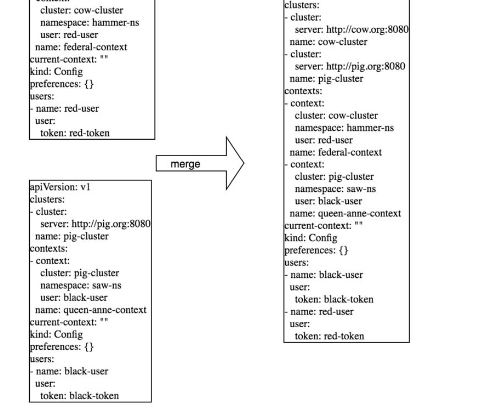

Table of Contents
=================

  * [1. client-go简介](#1-client-go简介)
     * [1.1 client-go章节安排](#11-client-go章节安排)
  * [2. client-go如何使用kubeconfig配置](#2-client-go如何使用kubeconfig配置)
     * [2.1 kube-config介绍](#21-kube-config介绍)
     * [2.1 client-go加载kubeconfig](#21-client-go加载kubeconfig)
     * [2.2 BuildConfigFromFlags](#22-buildconfigfromflags)
  * [3.总结](#3总结)

### 1. client-go简介

client-go就是  Go client for Kubernetes。它提供了与k8s交互的各种方法。

Kubernetes官方从2016年8月份开始，将Kubernetes资源操作相关的核心源码抽取出来，独立出来一个项目Client-go，作为官方提供的Go client。Kubernetes的部分代码也是基于这个client实现的，所以对这个client的质量、性能等方面还是非常有信心的。

client-go是一个调用kubernetes集群资源对象API的客户端，即通过client-go实现对kubernetes集群中资源对象（包括deployment、service、ingress、replicaSet、pod、namespace、node等）的增删改查等操作。大部分对kubernetes进行前置API封装的二次开发都通过client-go这个第三方包来实现。

client-go的代码库已经集成到Kubernetes源码中了，无须考虑版本兼容性问题，源码结构示例如下。client-go源码目录结构如下所示：

```
[root@k8s-node client-go]# tree -L 1
.
├── code-of-conduct.md  
├── CONTRIBUTING.md
├── discovery            提供discovery client客户端
├── dynamic              提供dynamic客户端
├── examples             几个常见的example示例
├── Godeps               godeps的简单说明
├── informers            每种资源的informer实现
├── INSTALL.md 
├── kubernetes           提供clientset客户端
├── LICENSE 
├── listers              每种资源的list实现
├── OWNERS
├── pkg
├── plugin               提供openstack, GCP, Azure等云服务商授权插件
├── rest                 提供restful客户端，执行restful操作
├── restmapper
├── scale                提供scale客户端，用于deploy,rs,rc等的扩缩容。
├── SECURITY_CONTACTS
├── testing
├── third_party
├── tools                提供常用的工具，例如cache,Indexers,DealtFIFO
├── transport            提供安全的TCP连接，支持Http Stream
└── util                 提供常用方法，例如workqueue,证书管理等。
```

#### 1.1 client-go章节安排

打算主要从这三个方面入手，研究client-go的源码

（1）client-go提供四种连接apiserver的客户端

（2）client-go list-watch功能实现

（3）与之配套提供的cache，dealtFifo，queue等辅助功能

希望加强对这些部分更深入的了解，对k8s整理以及以后控制器的编写根据得心应手。

接下来的文章安排就是了解上述的功能如何使用，如何实现。

<br>

### 2. client-go如何使用kubeconfig配置

#### 2.1 kube-config介绍

kubeconfig用于管理访问kube-apiserver的配置信息，同时也支持访问多kube-apiserver的配置管理，可以在不同的环境下管理不同的kube-apiserver集群配置，不同的业务线也可以拥有不同的集群。Kubernetes的其他组件都使用kubeconfig配置信息来连接kube-apiserver组件，例如当kubectl访问kube-apiserver时，会默认加载kubeconfig配置信息。kubeconfig中存储了集群、用户、命名空间和身份验证等信息，在默认的情况下，kubeconfig存放在$HOME/.kube/config路径下。Kubeconfig配置信息如下：

```
cat /root/.kube/config
apiVersion: v1
clusters:
- cluster:
    server: https://39.98.210.73:6443
    certificate-authority-data: 
  name: kubernetes
contexts:
- context:
    cluster: kubernetes
    user: "kubernetes-admin"
  name: kubernetes-admin-cd0201255113548b782faa6fbf68c80cd
current-context: kubernetes-admin-cd0201255113548b782faa6fbf68c80cd
kind: Config
preferences: {}
users:
- name: "kubernetes-admin"
  user:
    client-certificate-data: 
    client-key-data: 
```

kubeconfig配置信息通常包含3个部分，分别介绍如下。

● clusters：定义Kubernetes集群信息，例如kube-apiserver的服务地址及集群的证书信息等。

● users：定义Kubernetes集群用户身份验证的客户端凭据，例如client-certificate、client-key、token及username/password等。

● contexts：定义Kubernetes集群用户信息和命名空间等，用于将请求发送到指定的集群。

这里其实就很好理解。就是定义 集群用户，和上下文。集群上下文可以有多个。例如 context1 <集群A，用于A>

context2 <集群B，用户A>

这样使用 kubectl config指定 context2就能马上  以用户A的角色连接到 集群B。

#### 2.1 client-go加载kubeconfig

client-go会读取kubeconfig配置信息并生成config对象，用于与kube-apiserver通信。这里主要就是通过 tools/clientcmd包实现的。更具体就是通过 clientcmd.BuildConfigFromFlags

```
像kube-eventwatcher组件也是通过这个 连接集群。
func NewPodController(opt *config.Option) (*PodController, error) {
	cfg, err := clientcmd.BuildConfigFromFlags("", opt.KubeConfig)
	if err != nil {
		glog.Errorf("can not read the cfg: %v\n", err)
		return nil, err
	}
```

<br>

#### 2.2 BuildConfigFromFlags

这个函数的主要作用就是，通过 path，或者命令行输入，实例化一个 restclient.Config对象。

从主函数BuildConfigFromFlags可以看出来。还是命令行输入的config优先使用

```go
// 1.主函数BuildConfigFromFlags
// BuildConfigFromFlags is a helper function that builds configs from a master
// url or a kubeconfig filepath. These are passed in as command line flags for cluster
// components. Warnings should reflect this usage. If neither masterUrl or kubeconfigPath
// are passed in we fallback to inClusterConfig. If inClusterConfig fails, we fallback
// to the default config.
func BuildConfigFromFlags(masterUrl, kubeconfigPath string) (*restclient.Config, error) {
	if kubeconfigPath == "" && masterUrl == "" {
		glog.Warningf("Neither --kubeconfig nor --master was specified.  Using the inClusterConfig.  This might not work.")
		kubeconfig, err := restclient.InClusterConfig()
		if err == nil {
			return kubeconfig, nil
		}
		glog.Warning("error creating inClusterConfig, falling back to default config: ", err)
	}
	return NewNonInteractiveDeferredLoadingClientConfig(
		&ClientConfigLoadingRules{ExplicitPath: kubeconfigPath},
		&ConfigOverrides{ClusterInfo: clientcmdapi.Cluster{Server: masterUrl}}).ClientConfig()
}


// 2. 调用了clientconfig()看起来就是合并，因为可能一份kubeconfig可能要操作多个集群。并且还是通过文件指定一部分集群，通过命令行指定一部分集群。
// ClientConfig implements ClientConfig
func (config *DeferredLoadingClientConfig) ClientConfig() (*restclient.Config, error) {
	mergedClientConfig, err := config.createClientConfig()
	if err != nil {
		return nil, err
	}

	// load the configuration and return on non-empty errors and if the
	// content differs from the default config
	mergedConfig, err := mergedClientConfig.ClientConfig()
	switch {
	case err != nil:
		if !IsEmptyConfig(err) {
			// return on any error except empty config
			return nil, err
		}
	case mergedConfig != nil:
		// the configuration is valid, but if this is equal to the defaults we should try
		// in-cluster configuration
		if !config.loader.IsDefaultConfig(mergedConfig) {
			return mergedConfig, nil
		}
	}

	// check for in-cluster configuration and use it
	if config.icc.Possible() {
		glog.V(4).Infof("Using in-cluster configuration")
		return config.icc.ClientConfig()
	}

	// return the result of the merged client config
	return mergedConfig, err
}

// 3.调用NewNonInteractiveDeferredLoadingClientConfig函数
// NewNonInteractiveDeferredLoadingClientConfig creates a ConfigClientClientConfig using the passed context name
func NewNonInteractiveDeferredLoadingClientConfig(loader ClientConfigLoader, overrides *ConfigOverrides) ClientConfig {
	return &DeferredLoadingClientConfig{loader: loader, overrides: overrides, icc: &inClusterClientConfig{overrides: overrides}}
}

// 4.最终就是实例化这样一个对象
// DeferredLoadingClientConfig is a ClientConfig interface that is backed by a client config loader.
// It is used in cases where the loading rules may change after you've instantiated them and you want to be sure that
// the most recent rules are used.  This is useful in cases where you bind flags to loading rule parameters before
// the parse happens and you want your calling code to be ignorant of how the values are being mutated to avoid
// passing extraneous information down a call stack
type DeferredLoadingClientConfig struct {
	loader         ClientConfigLoader
	overrides      *ConfigOverrides
	fallbackReader io.Reader

	clientConfig ClientConfig
	loadingLock  sync.Mutex

	// provided for testing
	icc InClusterConfig
}
```

合并Kubeconfig的效果如下：


### 3.总结

（1）简单了解client-go的结构和对kube-config的使用