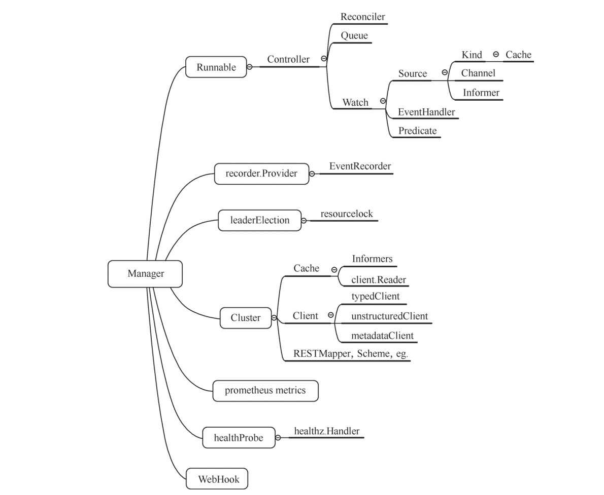
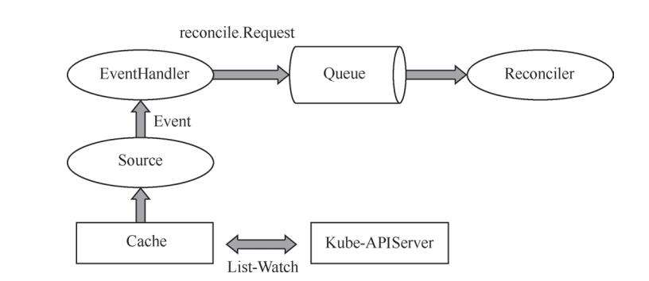
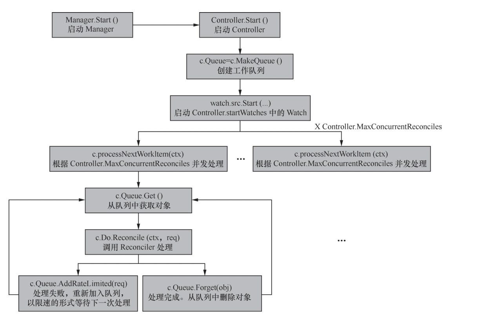
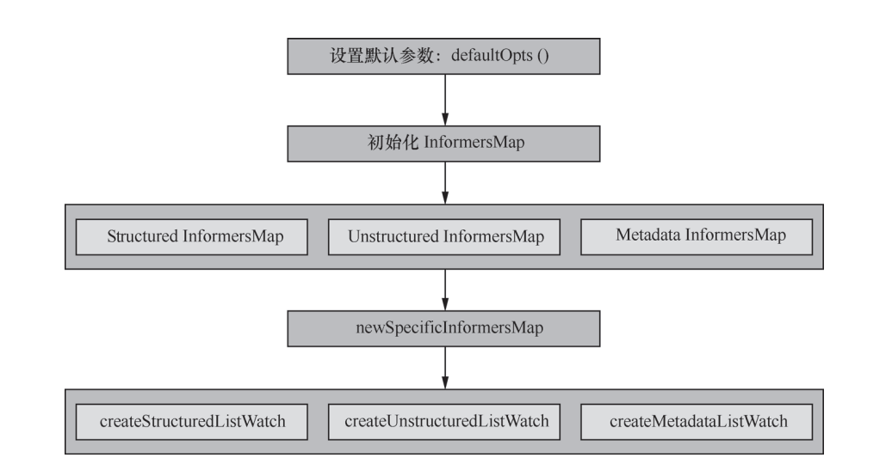
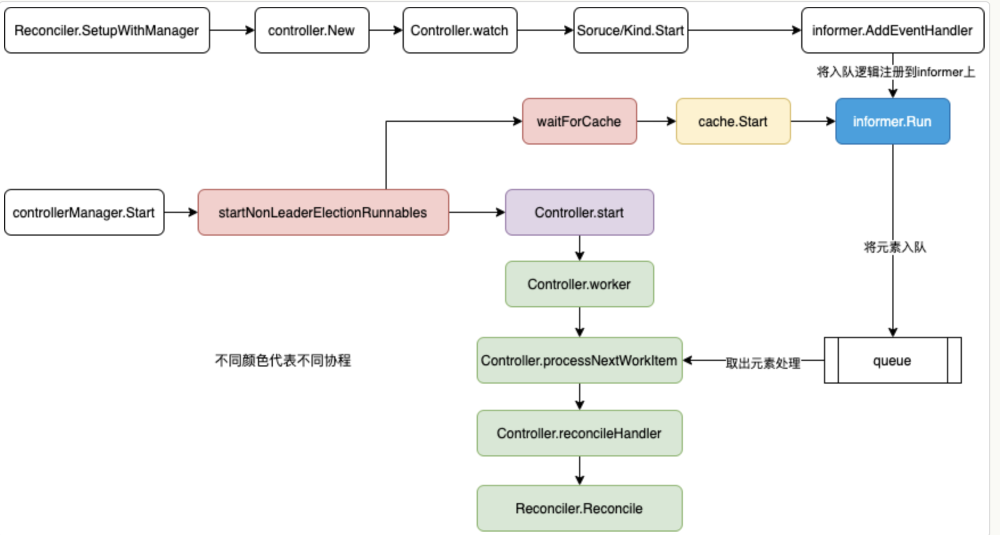

- [1. Controller-runtime结构介绍](#1-controller-runtime----)
- [2. Controller-runtime 底层原理](#2-controller-runtime-----)
  * [2.1 manager相关结构体介绍](#21-manager-------)
  * [2.2 controller相关结构体介绍](#22-controller-------)
  * [2.3 controller启动流程](#23-controller----)
  * [2.4 manager是如何启动controller的](#24-manager-----controller-)
    + [2.4.1 第一步-manager的初始化](#241-----manager----)
    + [2.4.2 第二步-将controller绑定到manager](#242------controller---manager)
    + [2.4.3 第三步-启动manager.start](#243-------managerstart)
  * [2.5 runtime cache](#25-runtime-cache)
    + [2.5.1 cache是什么](#251-cache---)
    + [2.5.2 cache初始化逻辑](#252-cache-----)
- [3.总结](#3--)
- [4. 参考](#4---)

### 1. Controller-runtime结构介绍

kubebuilder底层使用的就是Controller-runtime，Controller-runtime为 Controller 的开发提供了各种功能模块，每个模块中包括了一个 或多个实现，通过这些模块，开发者可以灵活地构建自己的 Controller，主要包括以下内容:

（1） Client：用于读写 Kubernetes 资源对象的客户端。 

（2） Cache：本地缓存，用于保存需要监听的 Kubernetes 资源。缓存提供了只读客户端， 用于从缓存中读取对象。缓存还可以注册处理方法（EventHandler），以响应更新的事件。 

（3） Manager：用于控制多个 Controller，提供 Controller 共用的依赖项，如 Client、 Cache、Schemes 等。通过调用 Manager.Start 方法，可以启动 Controller。

（4） Controller：控制器，响应事件（Kubernetes 资源对象的创建、更新、删除）并 确保对象规范（Spec 字段）中指定的状态与系统状态匹配，如果不匹配，则控制器需要根 据事件的对象，通过协调器（Reconciler）进行同步。在实现上，Controller 是用于处理 reconcile.Requests 的工作队列，reconcile.Requests 包含了需要匹配状态的资源对象。

 ① Controller 需要提供 Reconciler 来处理从工作队列中获取的请求。

 ② Controller 需要配置相应的资源监听，根据监听到的 Event 生成 reconcile.Requests 并加入队列。

 （5） Reconciler：为 Controller 提供同步的功能，Controller 可以随时通过资源对象的 Name 和 Namespace 来调用 Reconciler，调用时，Reconciler 将确保系统状态与资源对象 所表示的状态相匹配。例如，当某个 ReplicaSet 的副本数为 5，但系统中只有 3 个 Pod 时， 同步 ReplicaSet 资源的 Reconciler 需要新建两个 Pod，并将它们的 OwnerReference 字段 指向对应的 ReplicaSet。

 ① Reconciler 包含了 Controller 所有的业务逻辑。

 ② Reconciler 通常只处理单个对象类型，例如只处理 ReplicaSets 的 Reconciler，不 处理其他的对象类型。如果需要处理多种对象类型，需要实现多个 Controller。如果你 希望通过其他类型来触发 Reconciler，例如，通过 Pod 对象的事件来触发 ReplicaSet 的 Recon- ciler，则可以提供一个映射，通过该映射将触发 Reconciler 的类型映射到需要匹 配的类型。 

③ 提供给 Reconciler 的参数是需要匹配的资源对象的 Name 和 Namespace。 

④ Reconciler 不关心触发它的事件的内容和类型。例如，对于同步 ReplicaSet 资源的 Reconciler 来说，触发它的是 ReplicaSet 的创建还是更新并不重要，Reconciler 总是会比 较系统中相应的 Pod 数量和 ReplicaSet 中指定的副本数量。 

（6） WebHook：准 入 WebHook（Admission WebHook） 是 扩 展 Kubernetes API 的 一种机制，WebHook 可以根据事件类型进行配置，比如资源对象的创建、删除、更改等 事件，当配置的事件发生时，Kubernetes 的 APIServer 会向 WebHook 发送准入请求 （AdmissionRequests），WebHook 可以对请求中的资源对象进行更改或准入验证，然后将 处理结果响应给 APIServer。

（7） Source：resource.Source 是 Controller.Watch 的参数，提供事件，事件通常是来 自 Kubernetes 的 APIServer（如 Pod 创建、更新和删除）。例如，source.Kind 使用指定 对象（通过 GroupVersionKind 指定）的 Kubernetes API Watch 接口来提供此对象的创建、 更新、删除事件。 

① Source 通过 Watch API 提供 Kubernetes 指定对象的事件流。

② 建议开发者使用 Controller-runtime 中已有的 Source 实现，而不是自己实现此接口。 

（8） EventHandler：handler.EventHandler 是 Controller.Watch 的 参 数， 用 于 将 事 件对应的 reconcile.Requests 加入队列。例如，从 Source 中接收到一个 Pod 的创建事 件，eventhandler.EnqueueHandler 会 根 据 Pod 的 Name 与 Namespace 生 成 reconcile. Requests 后，加入队列。

 ① EventHandlers 处理事件的方式是将一个或多个 reconcile.Requests 加入队列。 

② 在 EventHandler 的处理中，事件所属的对象的类型（比如 Pod 的创建事件属于 Pod 对象），可能与 reconcile.Requests 所加入的对象类型相同。

③ 事件所属的对象的类型也可能与 reconcile.Requests 所加入的对象类型不同。例如 将 Pod 的事件映射为所属的 ReplicaSet 的 reconcile.Requests。 

④ EventHandler 可能会将一个事件映射为多个 reconcile.Requests 并加入队列，多个 reconcile.Requests 可能属于一个对象类型，也可能涉及多个对象类型。例如，由于集群扩 展导致的 Node 事件。

 ⑤ 在大多数情况下，建议开发者使用 Controller-runtime 中已有的 EventHandler 来 实现，而不是自己实现此接口。

（9） Predicate：predicate.Predicate 是 Controller.Watch 的参数，是用于过滤事件的 过滤器，过滤器可以复用或者组合。

 ① Predicate 接口以事件作为输入，以布尔值作为输出，当返回 True 时，表示需要将 事件加入队列。

 ② Predicate 是可选的。

 ③ 建议开发者使用 Controller-runtime 中已有的 Predicate 实现，但可以使用其他 Predicate 进行过滤。




Controller-runtime 核心流程如下：

* Source 通过 Kubernetes APIServer 监听指定资源对象
* EventHandler 根据资源对象变化事件，将 reconcile.Request 加入队列
* 从队列中获取 reconcile.Request，并调用 Reconciler 进行同步



### 2. Controller-runtime 底层原理

#### 2.1 manager相关结构体介绍

Manager的方法

```

type Manager interface {
	cluster.Cluster                   //cluster.Cluster  提供了一系列方法，以获取与集群相关的对象。
	Add(Runnable) error               //添加controller
	Elected() <-chan struct{}         // 选举相关, 返回一个 Channel 结构，用于判断选举状态。当未配
置选举或当选 Leader 时，Channel 将被关闭。
	AddMetricsExtraHandler(path string, handler http.Handler) error     // metrics相关
	AddHealthzCheck(name string, check healthz.Checker) error           // 健康检查相关
	AddReadyzCheck(name string, check healthz.Checker) error            // 是否就绪
	Start(ctx context.Context) error                                    // 启动所有的controller
	GetWebhookServer() *webhook.Server                                  
	GetLogger() logr.Logger
	GetControllerOptions() v1alpha1.ControllerConfigurationSpec             
}
```

Manager启动时Options介绍。这里介绍几个关键的。

（1） Scheme 结构。一般先通过 k8s.io/apimachinery/pkg/runtime 中的 NewScheme() 方法获取 Kubernetes 的 Scheme，然后再将 CRD 注册到 Scheme

（2） MapperProvider 是一个函数对象，其定义为 func（c *rest.Config) （meta.RESTMapper，error)，用于定义 Manager 如何获取 RESTMapper。默认通过 k8s.io/client-go 中的 DiscoveryClient 请求获取 Kube-APIServer。 

（3） Logger 用于定义 Manager 的日志输出对象，默认使用 pkg/internal/log 包下的 全局参数 RuntimeLog。 

（4）SyncPeriod 参数用于指定 Informer 重新同步并处理资源的时间间隔，默认为 10 小时。此参数也决定了 Controller 重新同步的时间间隔，每个 Controller 的时间间隔以此 参数为基准有 10% 的抖动，以避免多个 Controller 同时进行重新同步。

（5） Namespace 参数用于限制 Manager.Cache 只监听指定 Namespace 的资源，默认 情况下无限制。 

（6） EventBroadcaster 参数用于提供 Manager，以获取 EventRecorder，当前已不 推荐使用，因为当Manager或Controller的生命周期短于EventBroadcaster的生命周期时， 可能会导致 goroutine 泄露。

```
// Options are the arguments for creating a new Manager.
type Options struct {
	// Scheme is the scheme used to resolve runtime.Objects to GroupVersionKinds / Resources
	// Defaults to the kubernetes/client-go scheme.Scheme, but it's almost always better
	// idea to pass your own scheme in.  See the documentation in pkg/scheme for more information.
	Scheme *runtime.Scheme

	// MapperProvider provides the rest mapper used to map go types to Kubernetes APIs
	MapperProvider func(c *rest.Config) (meta.RESTMapper, error)

	SyncPeriod *time.Duration
	。。。
}
```

<br>

#### 2.2 controller相关结构体介绍

**接口**

```
type Controller interface {
  // 匿名接口，定义了 Reconcile（context.Context，Request） （Result，error）
	reconcile.Reconciler

  // Watch() 方法会从 source.Source 中 获 取 Event， 并 根 据 参 数 Eventhandler 来 决 定 如 何 入 队， 根 据 参 数 Predicates 进行 Event 过滤，Preficates 可能有多个，只有所有的 Preficates 都返回True 时，才会将 Event 发送给 Eventhandler 处理。
	Watch(src source.Source, eventhandler handler.EventHandler, predicates ...predicate.Predicate) error

  // Controller 的启动方法，实现了 Controller 接 口的对象，也实现了 Runnable，因此，该方法可以被 Manager 管理。
	Start(ctx context.Context) error

	// 获取 Controller 内的 Logger，用于日志输出。
	GetLogger() logr.Logger
}
```

**结构体实现**

Controller 的实现在 pkg/internal/controller/controller.go 下，为结构体 Controller， Controller 结构体中包括的主要成员如下。 （1） Name string：必须设置，用于标识 Controller，会在 Controller 的日志输 出中进行关联。 

（2） MaxConcurrentReconciles int：定义允许 reconcile.Reconciler 同时运行的最多个 数，默认为 1。 

（3） Do reconcile.Reconciler：定义了 Reconcile() 方法，包含了 Controller 同步的业务 逻辑。Reconcile() 能在任意时刻被调用，接收一个对象的 Name 与 Namespace，并同步集 群当前实际状态至该对象被设置的期望状态。 

（4） MakeQueue func() workqueue.RateLimitingInterface：用 于 在 Controller 启动时，创建工作队列。由于标准的 Kubernetes 工作队列创建后会立即启动，因此， 如果在 Controller 启动前就创建队列，在重复调用 controller.New() 方法创建 Controller 的情况下，就会导致 Goroutine 泄露。

 （5） Queue workqueue.RateLimitingInterface：使用上面方法创建的工作队列。 （6） SetFields func（i interface{}） error：用 于 从 Manager 中 获 取 Controller 依 赖 的 方 法， 依 赖 包 括 Sourcess、EventHandlers 和 Predicates 等。 此 方 法 存 储 的 是 controllerManager.SetFields() 方法。 （7） Started Bool：用于表示 Controller 是否已经启动。 （8） CacheSyncTimeout time.Duration：定义了 Cache 完成同步的等待时长，超过时 长会被认为是同步失败。默认时长为 2 分钟。 （9） startWatches [ ]watchDescription：定 义 了 一 组 Watch 操 作 的 属 性， 会 在 Controller 启动时，根据属性进行 Watch 操作。watchDescription 的定义见代码清单 3-30，watchDescription 包 括 Event 的 源 source.Source、Event 的 入 队 方 法 handler. EventHandler 以及 Event 的过滤方法 predicate.Predicate。

```
// Controller implements controller.Controller.
type Controller struct {
	// Name is used to uniquely identify a Controller in tracing, logging and monitoring.  Name is required.
	Name string

	// MaxConcurrentReconciles is the maximum number of concurrent Reconciles which can be run. Defaults to 1.
	MaxConcurrentReconciles int

	// Reconciler is a function that can be called at any time with the Name / Namespace of an object and
	// ensures that the state of the system matches the state specified in the object.
	// Defaults to the DefaultReconcileFunc.
	Do reconcile.Reconciler

	// MakeQueue constructs the queue for this controller once the controller is ready to start.
	// This exists because the standard Kubernetes workqueues start themselves immediately, which
	// leads to goroutine leaks if something calls controller.New repeatedly.
	MakeQueue func() workqueue.RateLimitingInterface

	// Queue is an listeningQueue that listens for events from Informers and adds object keys to
	// the Queue for processing
	Queue workqueue.RateLimitingInterface

	// SetFields is used to inject dependencies into other objects such as Sources, EventHandlers and Predicates
	// Deprecated: the caller should handle injected fields itself.
	SetFields func(i interface{}) error

	// mu is used to synchronize Controller setup
	mu sync.Mutex

	// Started is true if the Controller has been Started
	Started bool

	// ctx is the context that was passed to Start() and used when starting watches.
	//
	// According to the docs, contexts should not be stored in a struct: https://golang.org/pkg/context,
	// while we usually always strive to follow best practices, we consider this a legacy case and it should
	// undergo a major refactoring and redesign to allow for context to not be stored in a struct.
	ctx context.Context

	// CacheSyncTimeout refers to the time limit set on waiting for cache to sync
	// Defaults to 2 minutes if not set.
	CacheSyncTimeout time.Duration

	// startWatches maintains a list of sources, handlers, and predicates to start when the controller is started.
	startWatches []watchDescription

	// Log is used to log messages to users during reconciliation, or for example when a watch is started.
	Log logr.Logger

	// RecoverPanic indicates whether the panic caused by reconcile should be recovered.
	RecoverPanic bool
}
```

#### 2.3 controller启动流程

controller跟随manager.start而启动。然后根据下面的流程运行。在c.Do.Reconcile函数中调用了我们实现的Reconcile函数进行真正的控制器逻辑处理。



#### 2.4 manager是如何启动controller的

##### 2.4.1 第一步-manager的初始化

一般在main函数就调用ctrl.NewManager函数进行初始化。ctrl.NewManager函数有2个参数，第一个参数就是k8s集群的*rest.Config， 第二个就是Options。就是manger结构体介绍的参数，比如可以自定义SyncPeriod等等。

```
mgr, err := ctrl.NewManager(ctrl.GetConfigOrDie(), ctrl.Options{
		Scheme:                 scheme,
		MetricsBindAddress:     metricsAddr,
		Port:                   9443,
		HealthProbeBindAddress: probeAddr,
		LeaderElection:         enableLeaderElection,
		LeaderElectionID:       "ec7e1f70.github.com",
		// LeaderElectionReleaseOnCancel defines if the leader should step down voluntarily
		// when the Manager ends. This requires the binary to immediately end when the
		// Manager is stopped, otherwise, this setting is unsafe. Setting this significantly
		// speeds up voluntary leader transitions as the new leader don't have to wait
		// LeaseDuration time first.
		//
		// In the default scaffold provided, the program ends immediately after
		// the manager stops, so would be fine to enable this option. However,
		// if you are doing or is intended to do any operation such as perform cleanups
		// after the manager stops then its usage might be unsafe.
		// LeaderElectionReleaseOnCancel: true,
	})
```

<br>

ctrl.NewManager实际就是初始化这个结构体，有了这个结构体就可以和k8s集群打交道了。

```
return &controllerManager{
		stopProcedureEngaged:          pointer.Int64(0),
		cluster:                       cluster,
		runnables:                     runnables,
		errChan:                       errChan,
		recorderProvider:              recorderProvider,
		resourceLock:                  resourceLock,
		metricsListener:               metricsListener,
		metricsExtraHandlers:          metricsExtraHandlers,
		controllerOptions:             options.Controller,
		logger:                        options.Logger,
		elected:                       make(chan struct{}),
		port:                          options.Port,
		host:                          options.Host,
		certDir:                       options.CertDir,
		webhookServer:                 options.WebhookServer,
		leaseDuration:                 *options.LeaseDuration,
		renewDeadline:                 *options.RenewDeadline,
		retryPeriod:                   *options.RetryPeriod,
		healthProbeListener:           healthProbeListener,
		readinessEndpointName:         options.ReadinessEndpointName,
		livenessEndpointName:          options.LivenessEndpointName,
		gracefulShutdownTimeout:       *options.GracefulShutdownTimeout,
		internalProceduresStop:        make(chan struct{}),
		leaderElectionStopped:         make(chan struct{}),
		leaderElectionReleaseOnCancel: options.LeaderElectionReleaseOnCancel,
	}, nil
```

##### 2.4.2 第二步-将controller绑定到manager

这一步需要调用SetupWithManager函数，这个是每个controller自己实现的。最简单就是使用通用的方法。

```
// SetupWithManager sets up the controller with the Manager.
func (r *PodCountReconciler) SetupWithManager(mgr ctrl.Manager) error {
	return ctrl.NewControllerManagedBy(mgr).
		For(&zouxappv1.PodCount{}).
		Complete(r)
}
```

详细地说，创建 Controller 基本分为 3 步。

 **第一步**，通过 ControllerManagedBy（m manager.Manager） *Builder 方法实例化一个 Builder 对象，其中传入的 Manager 提供创建 Controller 所需的依赖。 

这步骤的意思是，我定义了一个builder，绑定了manager

```
// Builder builds a Controller.
type Builder struct {
	forInput         ForInput
	ownsInput        []OwnsInput
	watchesInput     []WatchesInput
	mgr              manager.Manager
	globalPredicates []predicate.Predicate
	ctrl             controller.Controller
	ctrlOptions      controller.Options
	name             string
}

// ControllerManagedBy returns a new controller builder that will be started by the provided Manager.
func ControllerManagedBy(m manager.Manager) *Builder {
	return &Builder{mgr: m}
}
```

**第二步**，使用 For（object client.Object，opts ...ForOption）方法设置需要监听的资源 类型。

实际就是完善Builder的forInput结构体。

**注意：**这里就相对于调用了Watches(&source.Kind{Type: apiType}, &handler.EnqueueRequestForObject{}).

如果想一个controller监听多个对象，或者想实现自己的监听逻辑，比如不想监听删除操作，执行监听特定的update操作。就需要自己NewController来实现了。

```
// For defines the type of Object being *reconciled*, and configures the ControllerManagedBy to respond to create / delete /
// update events by *reconciling the object*.
// This is the equivalent of calling
// Watches(&source.Kind{Type: apiType}, &handler.EnqueueRequestForObject{}).
func (blder *Builder) For(object client.Object, opts ...ForOption) *Builder {
	if blder.forInput.object != nil {
		blder.forInput.err = fmt.Errorf("For(...) should only be called once, could not assign multiple objects for reconciliation")
		return blder
	}
	input := ForInput{object: object}
	for _, opt := range opts {
		opt.ApplyToFor(&input)
	}

	blder.forInput = input
	return blder
}
```

**第三步**，使用Complete函数将controller绑定到manager

```
// Complete builds the Application Controller.
func (blder *Builder) Complete(r reconcile.Reconciler) error {
	_, err := blder.Build(r)
	return err
}
```

**总结：** controller-runtime实际是通过builder这个对象，将mgr和controller绑定。

##### 2.4.3 第三步-启动manager.start

controllerManager.start会依次启动serveMetrics，serveHealthProbes，Webhooks，Caches，startLeaderElectionRunnables

这里就是关注如何启动每个controller的。manager.start->startLeaderElectionRunnables->cm.runnables.LeaderElection.Start -> go r.reconcile() -> fou循环go routinue启动每个controller

```
if err := mgr.Start(ctrl.SetupSignalHandler()); err != nil {
		setupLog.Error(err, "problem running manager")
		os.Exit(1)
	}


// Start starts the manager and waits indefinitely.
// There is only two ways to have start return:
// An error has occurred during in one of the internal operations,
// such as leader election, cache start, webhooks, and so on.
// Or, the context is cancelled.
func (cm *controllerManager) Start(ctx context.Context) (err error) {
	cm.Lock()
	if cm.started {
		cm.Unlock()
		return errors.New("manager already started")
	}
	var ready bool
	defer func() {
		// Only unlock the manager if we haven't reached
		// the internal readiness condition.
		if !ready {
			cm.Unlock()
		}
	}()

	// Initialize the internal context.
	cm.internalCtx, cm.internalCancel = context.WithCancel(ctx)

	// This chan indicates that stop is complete, in other words all runnables have returned or timeout on stop request
	stopComplete := make(chan struct{})
	defer close(stopComplete)
	// This must be deferred after closing stopComplete, otherwise we deadlock.
	defer func() {
		// https://hips.hearstapps.com/hmg-prod.s3.amazonaws.com/images/gettyimages-459889618-1533579787.jpg
		stopErr := cm.engageStopProcedure(stopComplete)
		if stopErr != nil {
			if err != nil {
				// Utilerrors.Aggregate allows to use errors.Is for all contained errors
				// whereas fmt.Errorf allows wrapping at most one error which means the
				// other one can not be found anymore.
				err = kerrors.NewAggregate([]error{err, stopErr})
			} else {
				err = stopErr
			}
		}
	}()

	// Add the cluster runnable.
	if err := cm.add(cm.cluster); err != nil {
		return fmt.Errorf("failed to add cluster to runnables: %w", err)
	}

	// Metrics should be served whether the controller is leader or not.
	// (If we don't serve metrics for non-leaders, prometheus will still scrape
	// the pod but will get a connection refused).
	if cm.metricsListener != nil {
		cm.serveMetrics()
	}

	// Serve health probes.
	if cm.healthProbeListener != nil {
		cm.serveHealthProbes()
	}

	// First start any webhook servers, which includes conversion, validation, and defaulting
	// webhooks that are registered.
	//
	// WARNING: Webhooks MUST start before any cache is populated, otherwise there is a race condition
	// between conversion webhooks and the cache sync (usually initial list) which causes the webhooks
	// to never start because no cache can be populated.
	if err := cm.runnables.Webhooks.Start(cm.internalCtx); err != nil {
		if err != wait.ErrWaitTimeout {
			return err
		}
	}

	// Start and wait for caches.
	if err := cm.runnables.Caches.Start(cm.internalCtx); err != nil {
		if err != wait.ErrWaitTimeout {
			return err
		}
	}

	// Start the non-leaderelection Runnables after the cache has synced.
	if err := cm.runnables.Others.Start(cm.internalCtx); err != nil {
		if err != wait.ErrWaitTimeout {
			return err
		}
	}

	// Start the leader election and all required runnables.
	{
		ctx, cancel := context.WithCancel(context.Background())
		cm.leaderElectionCancel = cancel
		go func() {
			if cm.resourceLock != nil {
				if err := cm.startLeaderElection(ctx); err != nil {
					cm.errChan <- err
				}
			} else {
			   // 启动每个controller
				// Treat not having leader election enabled the same as being elected.
				if err := cm.startLeaderElectionRunnables(); err != nil {
					cm.errChan <- err
				}
				close(cm.elected)
			}
		}()
	}

	ready = true
	cm.Unlock()
	select {
	case <-ctx.Done():
		// We are done
		return nil
	case err := <-cm.errChan:
		// Error starting or running a runnable
		return err
	}
}
```

<br>

最终Controller就像内置的控制器一样，通过processNextWorkItem函数一个个处理。主要这里还可以通过**MaxConcurrentReconciles**提高并发。

```
// Start implements controller.Controller.
func (c *Controller) Start(ctx context.Context) error {
	// use an IIFE to get proper lock handling
	// but lock outside to get proper handling of the queue shutdown
	c.mu.Lock()
	if c.Started {
		return errors.New("controller was started more than once. This is likely to be caused by being added to a manager multiple times")
	}

	c.initMetrics()

	// Set the internal context.
	c.ctx = ctx

	c.Queue = c.MakeQueue()
	go func() {
		<-ctx.Done()
		c.Queue.ShutDown()
	}()

	wg := &sync.WaitGroup{}
	err := func() error {
		defer c.mu.Unlock()

		// TODO(pwittrock): Reconsider HandleCrash
		defer utilruntime.HandleCrash()

		// NB(directxman12): launch the sources *before* trying to wait for the
		// caches to sync so that they have a chance to register their intendeded
		// caches.
		for _, watch := range c.startWatches {
			c.Log.Info("Starting EventSource", "source", fmt.Sprintf("%s", watch.src))

			if err := watch.src.Start(ctx, watch.handler, c.Queue, watch.predicates...); err != nil {
				return err
			}
		}

		// Start the SharedIndexInformer factories to begin populating the SharedIndexInformer caches
		c.Log.Info("Starting Controller")

		for _, watch := range c.startWatches {
			syncingSource, ok := watch.src.(source.SyncingSource)
			if !ok {
				continue
			}

			if err := func() error {
				// use a context with timeout for launching sources and syncing caches.
				sourceStartCtx, cancel := context.WithTimeout(ctx, c.CacheSyncTimeout)
				defer cancel()

				// WaitForSync waits for a definitive timeout, and returns if there
				// is an error or a timeout
				if err := syncingSource.WaitForSync(sourceStartCtx); err != nil {
					err := fmt.Errorf("failed to wait for %s caches to sync: %w", c.Name, err)
					c.Log.Error(err, "Could not wait for Cache to sync")
					return err
				}

				return nil
			}(); err != nil {
				return err
			}
		}

		// All the watches have been started, we can reset the local slice.
		//
		// We should never hold watches more than necessary, each watch source can hold a backing cache,
		// which won't be garbage collected if we hold a reference to it.
		c.startWatches = nil

		// Launch workers to process resources
		c.Log.Info("Starting workers", "worker count", c.MaxConcurrentReconciles)
		wg.Add(c.MaxConcurrentReconciles)
		for i := 0; i < c.MaxConcurrentReconciles; i++ {
			go func() {
				defer wg.Done()
				// Run a worker thread that just dequeues items, processes them, and marks them done.
				// It enforces that the reconcileHandler is never invoked concurrently with the same object.
				for c.processNextWorkItem(ctx) {
				}
			}()
		}

		c.Started = true
		return nil
	}()
	if err != nil {
		return err
	}

	<-ctx.Done()
	c.Log.Info("Shutdown signal received, waiting for all workers to finish")
	wg.Wait()
	c.Log.Info("All workers finished")
	return nil
}
```


#### 2.5 runtime cache

##### 2.5.1 cache是什么

Cache 接口定义了如下两个接口:

 （1）client.Reader：用于从 Cache 中获取及列举 Kubernetes 集群的资源。 

（2）Informers：可为不同的 GVK 创建或获取对应的 Informer，并将 Index 添加到对 应的 Informer 中。

Kubernetes 是典型的 Server-Client 的架构，APIServer 作为集群统一的操作入口，任 何对资源所做的操作（包括增删改查）都必须经过 APIServer。为了减轻 APIServer 的压力， Controller-runtime 抽象出一个 Cache 层，Client 端对 APIServer 数据的读取和监听操作都 将通过 Cache 层来进行。

```
// Cache knows how to load Kubernetes objects, fetch informers to request
// to receive events for Kubernetes objects (at a low-level),
// and add indices to fields on the objects stored in the cache.
type Cache interface {
	// Cache acts as a client to objects stored in the cache.
	client.Reader

	// Cache loads informers and adds field indices.
	Informers
}
```

<br>

##### 2.5.2 cache初始化逻辑

在new Manager的时候就初始化了缓存，具体的步骤是 New-> cluster.New -> 

```
// New returns a new Manager for creating Controllers.
func New(config *rest.Config, options Options) (Manager, error) {
	// Set default values for options fields
	options = setOptionsDefaults(options)

	cluster, err := cluster.New(config, func(clusterOptions *cluster.Options) {
		clusterOptions.Scheme = options.Scheme
		clusterOptions.MapperProvider = options.MapperProvider
		clusterOptions.Logger = options.Logger
		clusterOptions.SyncPeriod = options.SyncPeriod
		clusterOptions.Namespace = options.Namespace
		clusterOptions.NewCache = options.NewCache
		clusterOptions.NewClient = options.NewClient
		clusterOptions.ClientDisableCacheFor = options.ClientDisableCacheFor
		clusterOptions.DryRunClient = options.DryRunClient
		clusterOptions.EventBroadcaster = options.EventBroadcaster //nolint:staticcheck
	})


options.NewCache初始化cache
// Create the cache for the cached read client and registering informers
	cache, err := options.NewCache(config, cache.Options{Scheme: options.Scheme, Mapper: mapper, Resync: options.SyncPeriod, Namespace: options.Namespace})
	if err != nil {
		return nil, err
	}
	
// Allow newCache to be mocked
	if options.NewCache == nil {
		options.NewCache = cache.New
	}
```

在 Controller Manager 的初始化启动过程中，将会构建 Cache 层，以供 Manager 使 用。在用户没有指定 Cache 初始化函数的前提下，将使用 Controller-runtime 默认提供的 Cache 初始化函数，默认 Cache 初始化的流程如下：

```
// New initializes and returns a new Cache.
func New(config *rest.Config, opts Options) (Cache, error) {
   opts, err := defaultOpts(config, opts)
   if err != nil {
      return nil, err
   }
   selectorsByGVK, err := convertToSelectorsByGVK(opts.SelectorsByObject, opts.DefaultSelector, opts.Scheme)
   if err != nil {
      return nil, err
   }
   disableDeepCopyByGVK, err := convertToDisableDeepCopyByGVK(opts.UnsafeDisableDeepCopyByObject, opts.Scheme)
   if err != nil {
      return nil, err
   }
   im := internal.NewInformersMap(config, opts.Scheme, opts.Mapper, *opts.Resync, opts.Namespace, selectorsByGVK, disableDeepCopyByGVK)
   return &informerCache{InformersMap: im}, nil
}
```

（1） 设 置 默 认 参 数：若 Scheme 为 空， 则 设 置 为 scheme.Scheme ；若 Mapper 为 空， 则 通 过 apiutil.NewDiscoveryRESTMapper 基 于 Discovery 的 信 息 构 建 出 一 个 RESTMapper，用于管理所有 Object 的信息；若同步时间为空，则将 Informer 的同步时 间设置为 10 小时。 

（2）初始化 InformersMap，为 3 种不同类型的 Object（structured、unstructured、 metadata-only）分别构建 InformersMap。

 （3）初始化 specificInformersMap：该接口通过 Object 与 GVK 的组合信息创建并缓 存 Informers。 

（4）定义 List-Watch 函数：为 3 种不同类型的 Object 实现 List-Watch 函数，通过 该函数可对 GVK 进行 List 和 Watch 操作。 通过 Cache 的初始化流程，我们可以看出 Cache 主要创建了 InformersMap，Scheme 中的每个 GVK 都会创建对应的 Informer，再通过 informersByGVK 的 Map，实现 GVK 到 Informer的映射；每个Informer都会通过List-Watch函数对相应的GVK进行List和Watch操作。




Cache 启动的核心是启动创建的所有 Informer

```
// Start calls Run on each of the informers and sets started to true.  Blocks on the context.
func (m *InformersMap) Start(ctx context.Context) error {
   go m.structured.Start(ctx)
   go m.unstructured.Start(ctx)
   go m.metadata.Start(ctx)
   <-ctx.Done()
   return nil
}


// Start calls Run on each of the informers and sets started to true.  Blocks on the context.
// It doesn't return start because it can't return an error, and it's not a runnable directly.
func (ip *specificInformersMap) Start(ctx context.Context) {
	func() {
		ip.mu.Lock()
		defer ip.mu.Unlock()

		// Set the stop channel so it can be passed to informers that are added later
		ip.stop = ctx.Done()

		// Start each informer
		for _, informer := range ip.informersByGVK {
			go informer.Informer.Run(ctx.Done())
		}

		// Set started to true so we immediately start any informers added later.
		ip.started = true
		close(ip.startWait)
	}()
	<-ctx.Done()
}
```

Informer 的启动流程主要包含以下 3 个步骤：

 （1）初始化 Delta FIFO 队列。

 （2）创建内部 Controller：配置 Delta FIFO 队列和事件的处理函数。 

（3）启动 Controller：创建 Reflector，负责监听 APIServer 上指定的 GVK，将 Add、 Update、Delete 变更事件写入 Delta FIFO 队列中，作为变更事件的生产者；Controller 中 的事件处理函数 HandleDeltas() 会消费这些变更事件，负责将更新写入本地 Indexer，同 时将这些 Add、Update、Delete 事件分发给之前注册的监听器。

### 3.总结

controller-runtime其实就是利用client-go informer那套，底层是创建shareIndexInformer。

controller-runtime通过屏蔽底层细节，让crd operator的实现非常简单。梳理一下，整理的工作流程如下所示：



### 4. 参考

云原生应用开发：Operator原理与实践