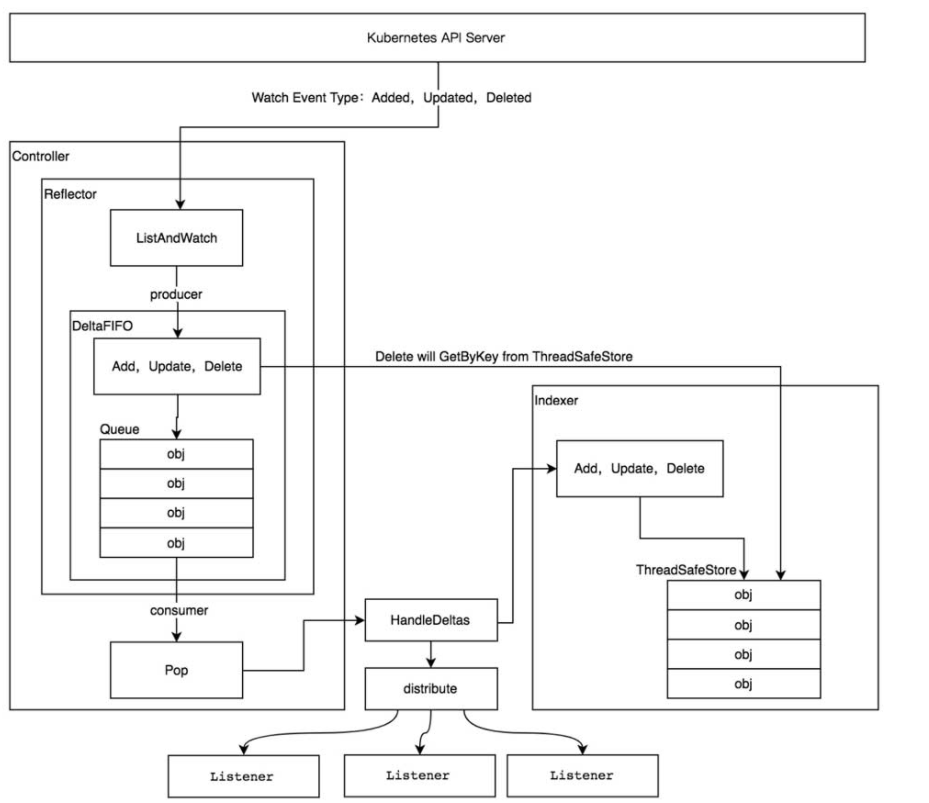
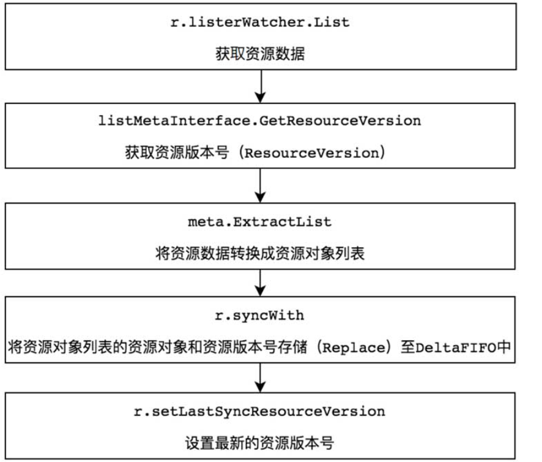
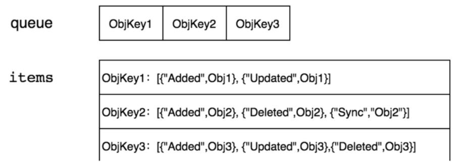
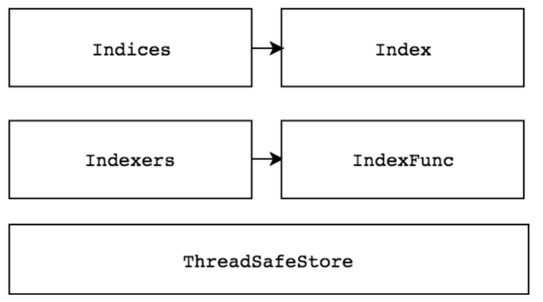

Table of Contents
=================

  * [1. informer机制简介](#1-informer机制简介)
     * [1.2. informer机制 example介绍](#12-informer机制-example介绍)
  * [2. informer](#2-informer)
     * [2.1 shared informer](#21-shared-informer)
     * [2.2 shared informer是如何实现的](#22-shared-informer是如何实现的)
     * [2.3 informer和reflector的关系](#23-informer和reflector的关系)
  * [3. Reflector](#3-reflector)
  * [4. listAndwatcher](#4-listandwatcher)
     * [4.1 list](#41-list)
     * [4.2 watcher](#42-watcher)
  * [5. DeltaFIFO](#5-deltafifo)
     * [5.1 生产者](#51-生产者)
     * [5.2 消费者](#52-消费者)
     * [5.3 Resync](#53-resync)
  * [6.Indexer](#6indexer)
     * [6.1 Indexer索引器](#61-indexer索引器)
  * [7. 总结](#7-总结)
  * [8.附录](#8附录)
  * [9.参考](#9参考)

### 1. informer机制简介

在Kubernetes系统中，组件之间通过HTTP协议进行通信，在不依赖任何中间件的情况下需要保证消息的实时性、可靠性、顺序性是通过list-watch机制实现的。

作为客户端，client-go也实现了一套对应的list-watch进行用来处理对象的变化。这个机制在client-go就是informer机制。

Kubernetes的其他组件（kcm, kubelet等等）都是通过client-go的Informer机制与Kubernetes API Server进行通信的。

Informer机制运行原理如图：



大体流程如下：

（1）new一个informer，然后informer的时候指定了 listAndwatcher（这个就是获取apiserver数据）

（2）informer.Run的时候，会new 一个 Reflector对象。Reflector包含了listAndwatcher，接下来基本就是Reflector进行操作了

（3）Reflector对listWatcher来的数据进行处理，这里使用到了DeltaFIFO队列对watch来的数据一个个的处理，HandleDeltas函数

（4）具体的处理逻辑分为两部分，第一部分是，通过操作cache.indexer，更新本地缓存+索引; 第二部分是，将watch的数据发送给 Informer自定义的处理函数进行处理

本节就先总结一下informer机制的大概流程，然后简单介绍一个流程中出现的几个概念。后面的章节一个一个进行详细研究

<br>

#### 1.2. informer机制 example介绍

直接阅读Informer机制代码会比较晦涩，通过Informers Example代码示例来理解Informer，印象会更深刻。Informers Example代码示例如下：

```
package main

import (
	"log"
	"time"

	corev1 "k8s.io/api/core/v1"
	"k8s.io/apimachinery/pkg/apis/meta/v1"
	"k8s.io/client-go/informers"
	"k8s.io/client-go/kubernetes"
	"k8s.io/client-go/tools/cache"
	"k8s.io/client-go/tools/clientcmd"
)

func main() {
	config, err := clientcmd.BuildConfigFromFlags("", "/root/.kube/config")
	if err!= nil {
		pannic(er)
	}

	clientset, err := kubernetes.NewForConfig(config)
    if err!=nil {
    	panic(err)
	}
    
	stopCh := make(chan struct{})
	defer close(stopCh)
	sharedInformers := informers.NewSharedInformerFactory(clientset, time.Minute)
	informer := sharedInformers.Core().V1().Pods().Informer()
	
	informers.AddEventHandler(cache.ResourceEventHandlerFuncs{
		AddFunc: func(obj interface{}) {
			mObj := obj.(v1.Object)
			log.Printf("New Pod Added to Store:%s", mObj.GetName())
		},
		UpdateFunc: func(oldObj, newObj interface{}) {
			oObj := oldObj.(v1.Object)
			nObj := newObj.(v1.Object)
			log.Printf("%s Pod Updated to %s", oObj.GetName(), nObj.GetName())
		},
		DeleteFunc: func(obj interface{}) {
			mObj := obj.(v1.Object)
			log.Printf("Pod Deleted from Store:%s", mObj.GetName())
		},
	})

	informer.Run(stopCh)
}
```

首先通过kubernetes.NewForConfig创建clientset对象，Informer需要通过ClientSet与Kubernetes API Server进行交互。另外，创建stopCh对象，该对象用于在程序进程退出之前通知Informer提前退出，因为Informer是一个持久运行的goroutine。informers.NewSharedInformerFactory函数实例化了SharedInformer对象，它接收两个参数：第1个参数clientset是用于与Kubernetes API Server交互的客户端，第2个参数time.Minute用于设置多久进行一次resync（重新同步），resync会周期性地执行List操作，将所有的资源存放在Informer Store中，如果该参数为0，则禁用resync功能。

在Informers Example代码示例中，通过sharedInformers.Core（）.V1（）.Pods（）.Informer可以得到具体Pod资源的informer对象。通过informer.AddEventHandler函数可以为Pod资源添加资源事件回调方法，支持3种资源事件回调方法，分别介绍如下。

● AddFunc：当创建Pod资源对象时触发的事件回调方法。

● UpdateFunc：当更新Pod资源对象时触发的事件回调方法。

● DeleteFunc：当删除Pod资源对象时触发的事件回调方法。在正常的情况下，Kubernetes的其他组件在使用Informer机制时触发资源事件回调方法，将资源对象推送到WorkQueue或其他队列中(**实际过程中大都是这样的**)，在InformersExample代码示例中，我们直接输出触发的资源事件。最后通过informer.Run函数运行当前的Informer，内部为Pod资源类型创建Informer。

<br>

### 2. informer

每一个Kubernetes资源上都实现了Informer机制。每一个Informer上都会实现Informer和Lister方法，例如PodInformer，代码示例如下

```
// PodInformer provides access to a shared informer and lister for
// Pods.
type PodInformer interface {
	Informer() cache.SharedIndexInformer
	Lister() v1.PodLister
}
```

用不同资源的Informer，代码示例如下：

```
podInformer := sharedInformers.Core().V1().Pods().Informer()
nodeInformer := sharedInformers.Node().V1beta1().RuntimeClasses().Informer
```

定义不同资源的Informer，允许监控不同资源的资源事件，例如，监听Node资源对象，当Kubernetes集群中有新的节点（Node）加入时，client-go能够及时收到资源对象的变更信息。

<br>

#### 2.1 shared informer

可以认为 informer都是 shared informer

Informer也被称为Shared Informer，它是可以共享使用的。在用client-go编写代码程序时，若同一资源的Informer被实例化了多次，每个Informer使用一个Reflector，那么会运行过多相同的ListAndWatch，太多重复的序列化和反序列化操作会导致Kubernetes API Server负载过重。Shared Informer可以使同一类资源Informer共享一个Reflector，这样可以节约很多资源。通过map数据结构实现共享的Informer机制。SharedInformer定义了一个map数据结构，用于存放所有Informer的字段，代码示例如下：

```
type sharedInformerFactory struct {
	client           kubernetes.Interface
	namespace        string
	tweakListOptions internalinterfaces.TweakListOptionsFunc
	lock             sync.Mutex
	defaultResync    time.Duration
	customResync     map[reflect.Type]time.Duration

	informers map[reflect.Type]cache.SharedIndexInformer
	// startedInformers is used for tracking which informers have been started.
	// This allows Start() to be called multiple times safely.
	startedInformers map[reflect.Type]bool
}
```

informers字段中存储了资源类型和对应于SharedIndexInformer的映射关系。InformerFor函数添加了不同资源的Informer，在添加过程中如果已经存在同类型的资源Informer，则返回当前Informer，不再继续添加。最后通过Shared Informer的Start方法使f.informers中的每个informer通过goroutine持久运行。

同一个factory定义的shareInformer可以复用复用。

#### 2.2 shared informer是如何实现的

从结构体可以看出来：有一个字段 Store，这里就是保存从apiserver同步过来的数据。

还有一个函数Run()，这个函数会调用controller.Run --> Reflector.Run->ListAndWatch()

而ListAndWatch()就是从apiserver获取数据。

```
// SharedInformer has a shared data cache and is capable of distributing notifications for changes
// to the cache to multiple listeners who registered via AddEventHandler. If you use this, there is
// one behavior change compared to a standard Informer.  When you receive a notification, the cache
// will be AT LEAST as fresh as the notification, but it MAY be more fresh.  You should NOT depend
// on the contents of the cache exactly matching the notification you've received in handler
// functions.  If there was a create, followed by a delete, the cache may NOT have your item.  This
// has advantages over the broadcaster since it allows us to share a common cache across many
// controllers. Extending the broadcaster would have required us keep duplicate caches for each
// watch.
type SharedInformer interface {
	// AddEventHandler adds an event handler to the shared informer using the shared informer's resync
	// period.  Events to a single handler are delivered sequentially, but there is no coordination
	// between different handlers.
	AddEventHandler(handler ResourceEventHandler)
	// AddEventHandlerWithResyncPeriod adds an event handler to the shared informer using the
	// specified resync period.  Events to a single handler are delivered sequentially, but there is
	// no coordination between different handlers.
	AddEventHandlerWithResyncPeriod(handler ResourceEventHandler, resyncPeriod time.Duration)
	// GetStore returns the Store.
	GetStore() Store
	// GetController gives back a synthetic interface that "votes" to start the informer
	GetController() Controller
	// Run starts the shared informer, which will be stopped when stopCh is closed.
	Run(stopCh <-chan struct{})
	// HasSynced returns true if the shared informer's store has synced.
	HasSynced() bool
	// LastSyncResourceVersion is the resource version observed when last synced with the underlying
	// store. The value returned is not synchronized with access to the underlying store and is not
	// thread-safe.
	LastSyncResourceVersion() string
}
```

EventHandler：这是一个回调函数，当一个`Informer`/`SharedInformer`要分发一个对象到控制器时，会调用此函数。例如：将对象的`Key`放在`WorkQueue`中并等待后续的处理。

这里先简单介绍整体的逻辑。后面再详细介绍。

<br>

#### 2.3 informer和reflector的关系

再使用informer的时候，一般都是：

（1）new 一个sharedInformerFactory对象

（2）根据sharedInformerFactory生成一个informer

（3）定义informer的 addFunc, deleteFunc, updateFunc函数

（4）informer.Run(stopCh) 运行起来

```
// 在informer的Run函数中调用了controller.Run
func (s *sharedIndexInformer) Run(stopCh <-chan struct{}) {
	

	func() {
		s.startedLock.Lock()
		defer s.startedLock.Unlock()

		s.controller = New(cfg)
		s.controller.(*controller).clock = s.clock
		s.started = true
	}()
    
	s.controller.Run(stopCh)
}

// run函数生成了一个reflector对象
// Run begins processing items, and will continue until a value is sent down stopCh.
// It's an error to call Run more than once.
// Run blocks; call via go.
func (c *controller) Run(stopCh <-chan struct{}) {
    ....
	r := NewReflector(
		c.config.ListerWatcher,
		c.config.ObjectType,
		c.config.Queue,
		c.config.FullResyncPeriod,
	)
   ...
}
```

**可以看出来：**

（1）一个informer对应一个reflector

（2）reflector是informer run的时候才生成的，并且Informer list-watch都是由reflector完成的. informer只管定义add, update, del处理事件即可

### 3. Reflector

Informer可以对Kubernetes API Server的资源执行监控（Watch）操作，资源类型可以是Kubernetes内置资源，也可以是CRD自定义资源，其中最核心的功能是Reflector。Reflector用于监控指定资源的Kubernetes资源，当监控的资源发生变化时，触发相应的变更事件，例如Added（资源添加）事件、Updated（资源更新）事件、Deleted（资源删除）事件，并将其资源对象存放到本地缓存DeltaFIFO中。通过NewReflector实例化Reflector对象，实例化过程中须传入ListerWatcher数据接口对象，它拥有List和Watch方法，用于获取及监控资源列表。只要实现了List和Watch方法的对象都可以称为ListerWatcher。Reflector对象通过Run函数启动监控并处理监控事件。而在Reflector源码实现中，其中最主要的是ListAndWatch函数，它负责获取资源列表（List）和监控（Watch）指定的Kubernetes API Server资源。

```
// Reflector watches a specified resource and causes all changes to be reflected in the given store.
type Reflector struct {
	// name identifies this reflector. By default it will be a file:line if possible.
	name string

	// The name of the type we expect to place in the store. The name
	// will be the stringification of expectedGVK if provided, and the
	// stringification of expectedType otherwise. It is for display
	// only, and should not be used for parsing or comparison.
	expectedTypeName string
	// The type of object we expect to place in the store.
	expectedType reflect.Type
	// The GVK of the object we expect to place in the store if unstructured.
	expectedGVK *schema.GroupVersionKind
	// The destination to sync up with the watch source
	store Store                     // store对象
	// listerWatcher is used to perform lists and watches.
	listerWatcher ListerWatcher     // listwatcher对象
	// period controls timing between one watch ending and
	// the beginning of the next one.
	period       time.Duration
	resyncPeriod time.Duration
	ShouldResync func() bool
	// clock allows tests to manipulate time
	clock clock.Clock
	// lastSyncResourceVersion is the resource version token last
	// observed when doing a sync with the underlying store
	// it is thread safe, but not synchronized with the underlying store
	lastSyncResourceVersion string
	// lastSyncResourceVersionMutex guards read/write access to lastSyncResourceVersion
	lastSyncResourceVersionMutex sync.RWMutex
	// WatchListPageSize is the requested chunk size of initial and resync watch lists.
	// Defaults to pager.PageSize.
	WatchListPageSize int64
}
```

**reflector包含了listwatch对象**

<br>

### 4. listAndwatcher

#### 4.1 list

```
// ListAndWatch first lists all items and get the resource version at the moment of call,
// and then use the resource version to watch.
// It returns error if ListAndWatch didn't even try to initialize watch.
func (r *Reflector) ListAndWatch(stopCh <-chan struct{}) error {
	klog.V(3).Infof("Listing and watching %v from %s", r.expectedTypeName, r.name)
	var resourceVersion string

	// Explicitly set "0" as resource version - it's fine for the List()
	// to be served from cache and potentially be delayed relative to
	// etcd contents. Reflector framework will catch up via Watch() eventually.
	// resourceVersion=0 表示 list所有资源
	options := metav1.ListOptions{ResourceVersion: "0"}
    
    // 
	if err := func() error {
		initTrace := trace.New("Reflector ListAndWatch", trace.Field{"name", r.name})
		defer initTrace.LogIfLong(10 * time.Second)
		var list runtime.Object
		var err error
		listCh := make(chan struct{}, 1)
		panicCh := make(chan interface{}, 1)
		go func() {
			defer func() {
				if r := recover(); r != nil {
					panicCh <- r
				}
			}()
			// 判断是否chunks一段一段的list
			// Attempt to gather list in chunks, if supported by listerWatcher, if not, the first
			// list request will return the full response.
			pager := pager.New(pager.SimplePageFunc(func(opts metav1.ListOptions) (runtime.Object, error) {
				return r.listerWatcher.List(opts)
			}))
			if r.WatchListPageSize != 0 {
				pager.PageSize = r.WatchListPageSize
			}
			// Pager falls back to full list if paginated list calls fail due to an "Expired" error.
			list, err = pager.List(context.Background(), options)
			close(listCh)
		}()
		select {
		case <-stopCh:
			return nil
		case r := <-panicCh:
			panic(r)
		case <-listCh:
		}
		if err != nil {
			return fmt.Errorf("%s: Failed to list %v: %v", r.name, r.expectedTypeName, err)
		}
		initTrace.Step("Objects listed")
		listMetaInterface, err := meta.ListAccessor(list)
		if err != nil {
			return fmt.Errorf("%s: Unable to understand list result %#v: %v", r.name, list, err)
		}
		resourceVersion = listMetaInterface.GetResourceVersion()
		initTrace.Step("Resource version extracted")
		items, err := meta.ExtractList(list)
		if err != nil {
			return fmt.Errorf("%s: Unable to understand list result %#v (%v)", r.name, list, err)
		}
		initTrace.Step("Objects extracted")
		if err := r.syncWith(items, resourceVersion); err != nil {
			return fmt.Errorf("%s: Unable to sync list result: %v", r.name, err)
		}
		initTrace.Step("SyncWith done")
		r.setLastSyncResourceVersion(resourceVersion)
		initTrace.Step("Resource version updated")
		return nil
	}(); err != nil {
		return err
	}

	resyncerrc := make(chan error, 1)
	cancelCh := make(chan struct{})
	defer close(cancelCh)
	go func() {
		resyncCh, cleanup := r.resyncChan()
		defer func() {
			cleanup() // Call the last one written into cleanup
		}()
		for {
			select {
			case <-resyncCh:
			case <-stopCh:
				return
			case <-cancelCh:
				return
			}
			if r.ShouldResync == nil || r.ShouldResync() {
				klog.V(4).Infof("%s: forcing resync", r.name)
				if err := r.store.Resync(); err != nil {
					resyncerrc <- err
					return
				}
			}
			cleanup()
			resyncCh, cleanup = r.resyncChan()
		}
	}()

	for {
		// give the stopCh a chance to stop the loop, even in case of continue statements further down on errors
		select {
		case <-stopCh:
			return nil
		default:
		}

		timeoutSeconds := int64(minWatchTimeout.Seconds() * (rand.Float64() + 1.0))
		options = metav1.ListOptions{
			ResourceVersion: resourceVersion,
			// We want to avoid situations of hanging watchers. Stop any wachers that do not
			// receive any events within the timeout window.
			TimeoutSeconds: &timeoutSeconds,
			// To reduce load on kube-apiserver on watch restarts, you may enable watch bookmarks.
			// Reflector doesn't assume bookmarks are returned at all (if the server do not support
			// watch bookmarks, it will ignore this field).
			AllowWatchBookmarks: true,
		}

		w, err := r.listerWatcher.Watch(options)
		if err != nil {
			switch err {
			case io.EOF:
				// watch closed normally
			case io.ErrUnexpectedEOF:
				klog.V(1).Infof("%s: Watch for %v closed with unexpected EOF: %v", r.name, r.expectedTypeName, err)
			default:
				utilruntime.HandleError(fmt.Errorf("%s: Failed to watch %v: %v", r.name, r.expectedTypeName, err))
			}
			// If this is "connection refused" error, it means that most likely apiserver is not responsive.
			// It doesn't make sense to re-list all objects because most likely we will be able to restart
			// watch where we ended.
			// If that's the case wait and resend watch request.
			if utilnet.IsConnectionRefused(err) {
				time.Sleep(time.Second)
				continue
			}
			return nil
		}

		if err := r.watchHandler(w, &resourceVersion, resyncerrc, stopCh); err != nil {
			if err != errorStopRequested {
				switch {
				case apierrs.IsResourceExpired(err):
					klog.V(4).Infof("%s: watch of %v ended with: %v", r.name, r.expectedTypeName, err)
				default:
					klog.Warningf("%s: watch of %v ended with: %v", r.name, r.expectedTypeName, err)
				}
			}
			return nil
		}
	}
}
```

ListAndWatch List在程序第一次运行时获取该资源下所有的对象数据并将其存储至DeltaFIFO中。以Informers Example代码示例为例，在其中，我们获取的是所有Pod的资源数据。ListAndWatch List流程图如下所示。



（1）r.listerWatcher.List用于获取资源下的所有对象的数据，例如，获取所有Pod的资源数据。获取资源数据是由options的ResourceVersion（资源版本号)参数控制的，如果ResourceVersion为0，则表示获取所有Pod的资源数据；如果ResourceVersion非0，则表示根据资源版本号继续获取，功能有些类似于文件传输过程中的“断点续传”，当传输过程中遇到网络故障导致中断，下次再连接时，会根据资源版本号继续传输未完成的部分。可以使本地缓存中的数据与Etcd集群中的数据保持一致。

（2）listMetaInterface.GetResourceVersion用于获取资源版本号，ResourceVersion （资源版本号）非常重要，Kubernetes中所有的资源都拥有该字段，它标识当前资源对象的版本号。每次修改当前资源对象时，Kubernetes API Server都会更改ResourceVersion，使得client-go执行Watch操作时可以根据ResourceVersion来确定当前资源对象是否发生变化。更多关于ResourceVersion资源版本号的内容，请参考6.5.2节“ResourceVersion资源版本号”。

（3）meta.ExtractList用于将资源数据转换成资源对象列表，将runtime.Object对象转换成[]runtime.Object对象。因为r.listerWatcher.List获取的是资源下的所有对象的数据，例如所有的Pod资源数据，所以它是一个资源列表。

（4） r.syncWith用于将资源对象列表中的资源对象和资源版本号存储至DeltaFIFO中，并会替换已存在的对象。

（5）r.setLastSyncResourceVersion用于设置最新的资源版本号。

r.listerWatcher.List函数实际调用了Pod Informer下的ListFunc函数（NewFilteredListWatchFromClient），它通过ClientSet客户端与Kubernetes API Server交互并获取Pod资源列表数据.

<br>

#### 4.2 watcher

Watch（监控）操作通过HTTP协议与Kubernetes API Server建立长连接，接收Kubernetes API Server发来的资源变更事件。Watch操作的实现机制使用HTTP协议的分块传输编码（Chunked Transfer Encoding）。当client-go调用Kubernetes API Server时，Kubernetes API Server在Response的HTTPHeader中设置Transfer-Encoding的值为chunked，表示采用分块传输编码，客户端收到该信息后，便与服务端进行连接，并等待下一个数据块（即资源的事件信息）。

ListAndWatch Watch代码示例如下：

```go
for {
		timeoutSeconds := int64(minWatchTimeout.Seconds() * (rand.Float64() + 1.0))
		
		// 列出要watcher的资源和timeout时间
		options = metav1.ListOptions{
			ResourceVersion: resourceVersion,
			// We want to avoid situations of hanging watchers. Stop any wachers that do not
			// receive any events within the timeout window.
			TimeoutSeconds: &timeoutSeconds,
		}
       
		r.metrics.numberOfWatches.Inc()
		
		// 这个就是reflector提到的watch函数
		w, err := r.listerWatcher.Watch(options)
		
        // 用于处理资源的变更事件。
		if err := r.watchHandler(w, &resourceVersion, resyncerrc, stopCh); err != nil {
			if err != errorStopRequested {
				glog.Warningf("%s: watch of %v ended with: %v", r.name, r.expectedType, err)
			}
			return nil
		}
	}
```

<br>

r.watchHandler用于处理资源的变更事件。当触发Added（资源添加）事件、Updated （资源更新）事件、Deleted（资源删除）事件时，将对应的资源对象更新到本地缓存DeltaFIFO中并更新ResourceVersion资源版本号。r.watchHandler代码示例如下：

```
// watchHandler watches w and keeps *resourceVersion up to date.
func (r *Reflector) watchHandler(w watch.Interface, resourceVersion *string, errc chan error, stopCh <-chan struct{}) error {
	start := r.clock.Now()
	eventCount := 0

	
			newResourceVersion := meta.GetResourceVersion()
			switch event.Type {
			case watch.Added:
				err := r.store.Add(event.Object)
				if err != nil {
					utilruntime.HandleError(fmt.Errorf("%s: unable to add watch event object (%#v) to store: %v", r.name, event.Object, err))
				}
			case watch.Modified:
				err := r.store.Update(event.Object)
				if err != nil {
					utilruntime.HandleError(fmt.Errorf("%s: unable to update watch event object (%#v) to store: %v", r.name, event.Object, err))
				}
			case watch.Deleted:
				// TODO: Will any consumers need access to the "last known
				// state", which is passed in event.Object? If so, may need
				// to change this.
				err := r.store.Delete(event.Object)
				if err != nil {
					utilruntime.HandleError(fmt.Errorf("%s: unable to delete watch event object (%#v) from store: %v", r.name, event.Object, err))
				}
			default:
				utilruntime.HandleError(fmt.Errorf("%s: unable to understand watch event %#v", r.name, event))
			}
			// 有改变就将 resourceVersion+1
			*resourceVersion = newResourceVersion
			r.setLastSyncResourceVersion(newResourceVersion)
			eventCount++
		}
	}

	watchDuration := r.clock.Now().Sub(start)
	if watchDuration < 1*time.Second && eventCount == 0 {
		r.metrics.numberOfShortWatches.Inc()
		return fmt.Errorf("very short watch: %s: Unexpected watch close - watch lasted less than a second and no items received", r.name)
	}
	glog.V(4).Infof("%s: Watch close - %v total %v items received", r.name, r.expectedType, eventCount)
	return nil
}
```

<br>

### 5. DeltaFIFO

DeltaFIFO可以分开理解，FIFO是一个先进先出的队列，它拥有队列操作的基本方法，例如Add、Update、Delete、List、Pop、Close等，而Delta是一个资源对象存储，它可以保存资源对象的操作类型，例如Added（添加）操作类型、Updated（更新）操作类型、Deleted（删除）操作类型、Sync（同步）操作类型等。DeltaFIFO结构代码示例如下：

```
type DeltaFIFO struct {
	// lock/cond protects access to 'items' and 'queue'.
	lock sync.RWMutex
	cond sync.Cond

	// We depend on the property that items in the set are in
	// the queue and vice versa, and that all Deltas in this
	// map have at least one Delta.
	items map[string]Deltas
	queue []string

	// populated is true if the first batch of items inserted by Replace() has been populated
	// or Delete/Add/Update was called first.
	populated bool
	// initialPopulationCount is the number of items inserted by the first call of Replace()
	initialPopulationCount int

	// keyFunc is used to make the key used for queued item
	// insertion and retrieval, and should be deterministic.
	keyFunc KeyFunc

	// knownObjects list keys that are "known", for the
	// purpose of figuring out which items have been deleted
	// when Replace() or Delete() is called.
	knownObjects KeyListerGetter

	// Indication the queue is closed.
	// Used to indicate a queue is closed so a control loop can exit when a queue is empty.
	// Currently, not used to gate any of CRED operations.
	closed     bool
	closedLock sync.Mutex
}
```

DeltaFIFO与其他队列最大的不同之处是，它会保留所有关于资源对象（obj）的操作类型，队列中会存在拥有不同操作类型的同一个资源对象，消费者在处理该资源对象时能够了解该资源对象所发生的事情。queue字段存储资源对象的key，该key通过KeyOf函数计算得到。items字段通过map数据结构的方式存储，value存储的是对象的Deltas数组。DeltaFIFO存储结构如下图所示。



DeltaFIFO本质上是一个先进先出的队列，有数据的生产者和消费者，其中生产者是Reflector调用的Add方法，消费者是Controller调用的Pop方法。

#### 5.1 生产者

```
// Add inserts an item, and puts it in the queue. The item is only enqueued
// if it doesn't already exist in the set.
func (f *DeltaFIFO) Add(obj interface{}) error {
	f.lock.Lock()
	defer f.lock.Unlock()
	f.populated = true
	return f.queueActionLocked(Added, obj)
}

// Update is just like Add, but makes an Updated Delta.
func (f *DeltaFIFO) Update(obj interface{}) error {
	f.lock.Lock()
	defer f.lock.Unlock()
	f.populated = true
	return f.queueActionLocked(Updated, obj)
}

// Delete is just like Add, but makes an Deleted Delta. If the item does not
// already exist, it will be ignored. (It may have already been deleted by a
// Replace (re-list), for example.
func (f *DeltaFIFO) Delete(obj interface{}) error {
	id, err := f.KeyOf(obj)
	if err != nil {
		return KeyError{obj, err}
	}
	f.lock.Lock()
	defer f.lock.Unlock()
	f.populated = true
	if f.knownObjects == nil {
		if _, exists := f.items[id]; !exists {
			// Presumably, this was deleted when a relist happened.
			// Don't provide a second report of the same deletion.
			return nil
		}
	} else {
		// We only want to skip the "deletion" action if the object doesn't
		// exist in knownObjects and it doesn't have corresponding item in items.
		// Note that even if there is a "deletion" action in items, we can ignore it,
		// because it will be deduped automatically in "queueActionLocked"
		_, exists, err := f.knownObjects.GetByKey(id)
		_, itemsExist := f.items[id]
		if err == nil && !exists && !itemsExist {
			// Presumably, this was deleted when a relist happened.
			// Don't provide a second report of the same deletion.
			return nil
		}
	}

	return f.queueActionLocked(Deleted, obj)
}
```

DeltaFIFO队列中的资源对象在Added（资源添加）事件、Updated（资源更新）事件、Deleted（资源删除）事件中都调用了queueActionLocked函数，它是DeltaFIFO实现的关键，代码示例如下：

```
// queueActionLocked appends to the delta list for the object.
// Caller must lock first.
func (f *DeltaFIFO) queueActionLocked(actionType DeltaType, obj interface{}) error {
	id, err := f.KeyOf(obj)
	if err != nil {
		return KeyError{obj, err}
	}

	// If object is supposed to be deleted (last event is Deleted),
	// then we should ignore Sync events, because it would result in
	// recreation of this object.
	if actionType == Sync && f.willObjectBeDeletedLocked(id) {
		return nil
	}

	newDeltas := append(f.items[id], Delta{actionType, obj})
	newDeltas = dedupDeltas(newDeltas)

	_, exists := f.items[id]
	if len(newDeltas) > 0 {
		if !exists {
			f.queue = append(f.queue, id)
		}
		f.items[id] = newDeltas
		f.cond.Broadcast()
	} else if exists {
		// We need to remove this from our map (extra items
		// in the queue are ignored if they are not in the
		// map).
		delete(f.items, id)
	}
	return nil
}
```

queueActionLocked代码执行流程如下。

（1）通过f.KeyOf函数计算出资源对象的key。

（2）如果操作类型为Sync，则标识该数据来源于Indexer（本地存储）。如果Indexer中的资源对象已经被删除，则直接返回。

（3）将actionType和资源对象构造成Delta，添加到items中，并通过dedupDeltas函数进行去重操作。

（4）更新构造后的Delta并通过cond.Broadcast通知所有消费者解除阻塞。

<br>

#### 5.2 消费者

Pop方法作为消费者方法使用，从DeltaFIFO的头部取出最早进入队列中的资源对象数据。Pop方法须传入process函数（**而这里的process函数就是**），用于接收并处理对象的回调方法，代码示例如下：

```
// Pop blocks until an item is added to the queue, and then returns it.  If
// multiple items are ready, they are returned in the order in which they were
// added/updated. The item is removed from the queue (and the store) before it
// is returned, so if you don't successfully process it, you need to add it back
// with AddIfNotPresent().
// process function is called under lock, so it is safe update data structures
// in it that need to be in sync with the queue (e.g. knownKeys). The PopProcessFunc
// may return an instance of ErrRequeue with a nested error to indicate the current
// item should be requeued (equivalent to calling AddIfNotPresent under the lock).
//
// Pop returns a 'Deltas', which has a complete list of all the things
// that happened to the object (deltas) while it was sitting in the queue.
func (f *DeltaFIFO) Pop(process PopProcessFunc) (interface{}, error) {
	f.lock.Lock()
	defer f.lock.Unlock()
	for {
		for len(f.queue) == 0 {
			// When the queue is empty, invocation of Pop() is blocked until new item is enqueued.
			// When Close() is called, the f.closed is set and the condition is broadcasted.
			// Which causes this loop to continue and return from the Pop().
			if f.IsClosed() {
				return nil, FIFOClosedError
			}

			f.cond.Wait()
		}
		id := f.queue[0]
		f.queue = f.queue[1:]
		item, ok := f.items[id]
		if f.initialPopulationCount > 0 {
			f.initialPopulationCount--
		}
		if !ok {
			// Item may have been deleted subsequently.
			continue
		}
		// 从队列中删除
		delete(f.items, id)
		// 然后调用 process处理，这里的item还是之前的列表，bojkey1 {“add”,obj1; "update",obj1}
		err := process(item)
		if e, ok := err.(ErrRequeue); ok {
			f.addIfNotPresent(id, item)
			err = e.Err
		}
		// Don't need to copyDeltas here, because we're transferring
		// ownership to the caller.
		return item, err
	}
}
```

<br>

当队列中没有数据时，通过f.cond.wait阻塞等待数据，只有收到cond.Broadcast时才说明有数据被添加，解除当前阻塞状态。如果队列中不为空，取出f.queue的头部数据，将该对象传入process回调函数，由上层消费者进行处理。如果process回调函数处理出错，则将该对象重新存入队列。Controller的processLoop方法负责从DeltaFIFO队列中取出数据传递给process回调函数。process回调函数代码示例如下：

```go
func (s *sharedIndexInformer) HandleDeltas(obj interface{}) error {
	s.blockDeltas.Lock()
	defer s.blockDeltas.Unlock()

	// from oldest to newest
	for _, d := range obj.(Deltas) {
		switch d.Type {
		case Sync, Added, Updated:
			isSync := d.Type == Sync
			s.cacheMutationDetector.AddObject(d.Object)
			if old, exists, err := s.indexer.Get(d.Object); err == nil && exists {
				if err := s.indexer.Update(d.Object); err != nil {
					return err
				}
				s.processor.distribute(updateNotification{oldObj: old, newObj: d.Object}, isSync)
			} else {
				if err := s.indexer.Add(d.Object); err != nil {
					return err
				}
				s.processor.distribute(addNotification{newObj: d.Object}, isSync)
			}
		case Deleted:
			if err := s.indexer.Delete(d.Object); err != nil {
				return err
			}
			s.processor.distribute(deleteNotification{oldObj: d.Object}, false)
		}
	}
	return nil
}
```

HandleDeltas函数作为process回调函数，当资源对象的操作类型为Added、Updated、Deleted时，将该资源对象存储至Indexer（它是并发安全的存储），并通过distribute函数将资源对象分发至SharedInformer。还记得Informers Example代码示例吗？在Informers Example代码示例中，我们通过informer.AddEventHandler函数添加了对资源事件进行处理的函数，distribute函数则将资源对象分发到该事件处理函数中。

<br>

#### 5.3 Resync

Resync机制会将Indexer本地存储中的资源对象同步到DeltaFIFO中，并将这些资源对象设置为Sync的操作类型。Resync函数在Reflector中定时执行，它的执行周期由NewReflector函数传入的resyncPeriod参数设定。Resync→syncKeyLocked代码示例如下：

```
func (f *DeltaFIFO) syncKeyLocked(key string) error {
	obj, exists, err := f.knownObjects.GetByKey(key)
	if err != nil {
		glog.Errorf("Unexpected error %v during lookup of key %v, unable to queue object for sync", err, key)
		return nil
	} else if !exists {
		glog.Infof("Key %v does not exist in known objects store, unable to queue object for sync", key)
		return nil
	}

	// If we are doing Resync() and there is already an event queued for that object,
	// we ignore the Resync for it. This is to avoid the race, in which the resync
	// comes with the previous value of object (since queueing an event for the object
	// doesn't trigger changing the underlying store <knownObjects>.
	id, err := f.KeyOf(obj)
	if err != nil {
		return KeyError{obj, err}
	}
	if len(f.items[id]) > 0 {
		return nil
	}

	if err := f.queueActionLocked(Sync, obj); err != nil {
		return fmt.Errorf("couldn't queue object: %v", err)
	}
	return nil
}

```

f.knownObjects是Indexer本地存储对象，通过该对象可以获取client-go目前存储的所有资源对象，Indexer对象在NewDeltaFIFO函数实例化DeltaFIFO对象时传入。

### 6.Indexer

的数据与Etcd集群中的数据保持完全一致。client-go可以很方便地从本地存储中读取相应的资源对象数据，而无须每次都从远程Etcd集群中读取，这样可以减轻Kubernetes API Server和Etcd集群的压力。

在介绍Indexer之前，先介绍一下ThreadSafeMap。ThreadSafeMap是实现并发安全的存储。作为存储，它拥有存储相关的增、删、改、查操作方法，例如Add、Update、Delete、List、Get、Replace、Resync等。Indexer在ThreadSafeMap的基础上进行了封装，它继承了与ThreadSafeMap相关的操作方法并实现了Indexer Func等功能，例如Index、IndexKeys、GetIndexers等方法，这些方法为ThreadSafeMap提供了索引功能。Indexer存储结构如下图所示。



ThreadSafeMap是一个内存中的存储，其中的数据并不会写入本地磁盘中，每次的增、删、改、查操作都会加锁，以保证数据的一致性。ThreadSafeMap将资源对象数据存储于一个map数据结构中，ThreadSafeMap结构代码示例如下：

```
// threadSafeMap implements ThreadSafeStore
type threadSafeMap struct {
	lock  sync.RWMutex
	items map[string]interface{}

	// indexers maps a name to an IndexFunc
	indexers Indexers
	// indices maps a name to an Index
	indices Indices
}
```

items字段中存储的是资源对象数据，其中items的key通过keyFunc函数计算得到，计算默认使用MetaNamespaceKeyFunc函数，该函数根据资源对象计算出<namespace>/<name>格式的key，如果资源对象的<namespace>为空，则<name>作为key，而items的value用于存储资源对象。

<br>

#### 6.1 Indexer索引器

在每次增、删、改ThreadSafeMap数据时，都会通过updateIndices或deleteFromIndices函数变更Indexer。Indexer被设计为可以自定义索引函数，这符合Kubernetes高扩展性的特点。Indexer有4个非常重要的数据结构，分别是Indices、Index、Indexers及IndexFunc。直接阅读相关代码会比较晦涩，通过Indexer Example代码示例来理解Indexer，印象会更深刻。Indexer Example代码示例如下：

```
package main

import (
	"fmt"
	"k8s.io/api/core/v1"
	metav1 "k8s.io/apimachinery/pkg/apis/meta/v1"
	"k8s.io/client-go/tools/cache"
	"strings"
)

func UsersIndexFunc(obj interface{}) ([]string, error) {
	pod := obj.(*v1.Pod)
	userString := pod.Annotations["users"]

	return strings.Split(userString, ","), nil
}

func main() {
	index := cache.NewIndexer(cache.MetaNamespaceKeyFunc,cache.Indexers{"byUser": UsersIndexFunc})

	pod1 := &v1.Pod{ObjectMeta:metav1.ObjectMeta{Name:"one",Annotations: map[string]string{"users": "ernie,bert"}}}
	pod2 := &v1.Pod{ObjectMeta:metav1.ObjectMeta{Name:"two",Annotations: map[string]string{"users": "oscar,bert"}}}
	pod3 := &v1.Pod{ObjectMeta:metav1.ObjectMeta{Name:"tre",Annotations: map[string]string{"users": "ernie,elmo"}}}

    index.Add(pod1)
	index.Add(pod2)
	index.Add(pod3)

	erniePods, err := index.ByIndex("byUser", "ernie")
	if err != nil {
		panic(err)
	}

	for _, erniePod := range erniePods {
		fmt.Println(erniePod.(*v1.Pod).Name)
	}
}

## 输出
one
tre
```

首先定义一个索引器函数UsersIndexFunc，在该函数中，我们定义查询出所有Pod资源下Annotations字段的key为users的Pod。cache.NewIndexer函数实例化了Indexer对象，该函数接收两个参数：第1个参数是KeyFunc，它用于计算资源对象的key，计算默认使用cache.MetaNamespaceKeyFunc函数；第2个参数是cache.Indexers，用于定义索引器，其中key为索引器的名称（即byUser），value为索引器。通过index.Add函数添加3个Pod资源对象。最后通过index.ByIndex函数查询byUser索引器下匹配ernie字段的Pod列表。Indexer Example代码示例最终检索出名称为one和tre的Pod。现在再来理解Indexer的4个重要的数据结构就非常容易了，它们分别是Indexers、IndexFunc、Indices、Index，数据结构如下：

```
// Index maps the indexed value to a set of keys in the store that match on that value
type Index map[string]sets.String

// Indexers maps a name to a IndexFunc
type Indexers map[string]IndexFunc

// Indices maps a name to an Index
type Indices map[string]Index

// IndexFunc knows how to provide an indexed value for an object.
type IndexFunc func(obj interface{}) ([]string, error)
```

Indexer数据结构说明如下。

● Indexers：存储索引器，key为索引器名称，value为索引器的实现函数。

● IndexFunc：索引器函数，定义为接收一个资源对象，返回检索结果列表。

● Indices：存储缓存器，key为缓存器名称（在Indexer Example代码示例中，缓存器命名与索引器命名相对应），value为缓存数据。

● Index：存储缓存数据，其结构为K/V。

<br>

### 7. 总结

目前通过整体的介绍已经大概理清楚client-go informer的大致过程：

（1）定义好 informerFactory， 然后初始化一个Informer

（2）定义好add, update, del处理函数

（3）informer.run运行

（4）informer.run初始化了一个reflector，里面实现了list-watch

（5）reflector里面使用了deltaFIFO队列对list watch的数据进行处理。
一方面：通过该队列的数据 使得本地cache和etcd数据一致 （indexer里面的数据）

另一方面：之前定义好的add ,update ,del就是这些数据的消费者

当然这个只是大概的运作过程。接下来将详细研究具体每个过程是如何实现的。


### 8.附录

以下的例子对pod的监听。可以看出来步骤为：

（1）生成clientset客户端

（2）New一个 listandwatcher对象，这里是pod

（3）实例化一个informer，在这个informer中，指定ADD，UPDATE，DELETE的处理函数。

```
// creates the clientset
	clientset, err := kubernetes.NewForConfig(cfg)
	if err != nil {
		glog.Errorf("can not creates the clientset: %v\n", err)
		return nil, err
	}

	// create the pod watcher, set the func of list and watch
	podListWatcher := cache.NewListWatchFromClient(
		clientset.Core().RESTClient(),
		"pods",
		v1.NamespaceAll,
		fields.Everything(),
	)

	indexer, informer := cache.NewIndexerInformer(
		podListWatcher,
		&v1.Pod{},
		0,
		cache.ResourceEventHandlerFuncs{
			AddFunc: func(obj interface{}) {},
			UpdateFunc: func(old interface{}, new interface{}) {
				pusher.PushBlackHole(old, new, opt)
			},
			DeleteFunc: func(obj interface{}) {},
		},
		cache.Indexers{cache.NamespaceIndex: cache.MetaNamespaceIndexFunc},
	)

```

<br>

### 9.参考

https://zhuanlan.zhihu.com/p/228534306

https://houmin.cc/posts/1f0eb2ff/

<<k8s源码解剖-郑东旭>>