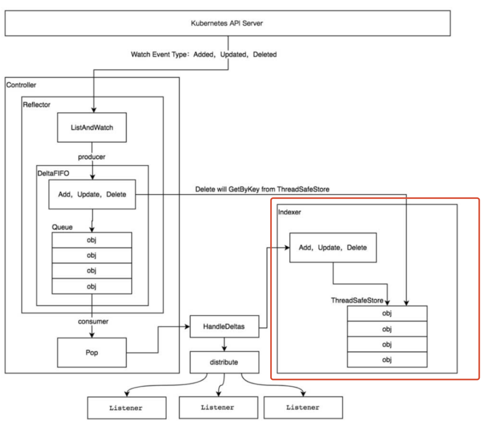

Table of Contents
=================

  * [1. 背景](#1-背景)
  * [2. Indexer结构说明](#2-indexer结构说明)
  * [3 store结构说明](#3-store结构说明)
  * [4. cache](#4-cache)
     * [4.1 cache结构说明](#41-cache结构说明)
     * [4.2 ThreadSafeStore结构说明](#42-threadsafestore结构说明)
     * [4.3 举例说明](#43-举例说明)
     * [4.4 Cache总结](#44-cache总结)
  * [5. cache.index在informer中的应用](#5-cacheindex在informer中的应用)

### 1. 背景

tool/cache.indexer是informer中提供本地缓存，并且带有丰富索引的机制。

index是索引的实现。类似于数据库的索引一样，index可以加快查找速度。

本节就是弄清楚cache中indexer是如何实现的

本节研究的内容位置整个informer机制的红色圈起来区域



如何存储+如何索引

<br>

### 2. Indexer结构说明

Indexer是一个接口，包含两个部分：

（1）Store。从Store定义来看，Store是真正保存数据的结构体。Store本身也是一个接口，具体的存储需要实现这些接口。

（2）Index，IndexKeys，ListIndexFuncValues，ByIndex，GetIndexers，AddIndexers 等和操作索引有关的函数

```
// IndexFunc knows how to provide an indexed value for an object.
type IndexFunc func(obj interface{}) ([]string, error)

// Index maps the indexed value to a set of keys in the store that match on that value
type Index map[string]sets.String

// Indexers maps a name to a IndexFunc
type Indexers map[string]IndexFunc

// Indices maps a name to an Index
type Indices map[string]Index


// Indexer接口是为了添加或者查询索引用的。当前可能一下子看注释很迷惑，先看看后面的例子就清楚了
type Indexer interface {
	Store
	// 通过indexName获得索引函数，然后obj(pod)对象作为函数输入，输出所有检索值。然后找出来所有包含检索值的对象(pod)
	// 举例pod1 通过byuser这个函数，检索出来有ernie，bert两个检索值
	// 然后Index("byuser",pod1) 会输出pod1, pod2(包含bert),pod3(包含ernie)
	// Retrieve list of objects that match on the named indexing function
	Index(indexName string, obj interface{}) ([]interface{}, error)
	
	// 通过索引函数的名字（byUser）+具体的值(bert)，获得pod的名字（ns/podName）
	// IndexKeys returns the set of keys that match on the named indexing function.
	IndexKeys(indexName, indexKey string) ([]string, error)
	
	// 通过索引函数的名字（byUser）, 获得所有的索引值。这里输入byuser, 输出：ernie, bert, elmo, oscar
	// ListIndexFuncValues returns the list of generated values of an Index func
	ListIndexFuncValues(indexName string) []string
	
	// 通过索引函数的名字（byUser）+具体的值(bert)，获得pod对象
	// ByIndex lists object that match on the named indexing function with the exact key
	ByIndex(indexName, indexKey string) ([]interface{}, error)
	
	// 返回所有的索引函数
	// GetIndexer return the indexers
	GetIndexers() Indexers
	
	// AddIndexers adds more indexers to this store.  If you call this after you already have data
	// in the store, the results are undefined.
	// 添加 索引函数。每个索引函数都有一个唯一的名字，那就是 indexName 
	AddIndexers(newIndexers Indexers) error
}
```

<br>

Store是一个存储的接口，后面结合具体存储实现再讲。这里先讲一下 Index, Indexers, Indices的关系。

IndexFunc：索引函数。输入对象，输出对象在该索引函数下匹配的字段（索引值）列表。

Index： 索引表。 map结构，key索引值， value是对象名（初始化Indexer的时候需要指定，默认是ns+metadata.name表示一个对象）

Indexers：索引函数表。 map结构，索引函数可以有多个，所以每个索引函数需要起一个名字来表示。map的key是一个索引函数的名称，value是一个个的索引函数。

Indices：Index的复数形式。每个索引函数名对应一个索引函数，每个索引函数对应很多索引值。每个索引值会对应很多实际的对象。

index只能知道索引值对应对象。

Indices可以通过函数索引名，知道每个索引值对应的对象。

<br>

### 3 store结构说明

store可以认为只是一个父类，它只是一个接口，说明了要想实现存储，必须要实现这些函数。

```
// Store is a generic object storage interface. Reflector knows how to watch a server
// and update a store. A generic store is provided, which allows Reflector to be used
// as a local caching system, and an LRU store, which allows Reflector to work like a
// queue of items yet to be processed.
//
// Store makes no assumptions about stored object identity; it is the responsibility
// of a Store implementation to provide a mechanism to correctly key objects and to
// define the contract for obtaining objects by some arbitrary key type.
type Store interface {
	Add(obj interface{}) error         //往存储增加，更新，删除元素
	Update(obj interface{}) error  
	Delete(obj interface{}) error
	List() []interface{}              
	ListKeys() []string
	Get(obj interface{}) (item interface{}, exists bool, err error)
	GetByKey(key string) (item interface{}, exists bool, err error)

	// Replace will delete the contents of the store, using instead the
	// given list. Store takes ownership of the list, you should not reference
	// it after calling this function.
	Replace([]interface{}, string) error
	Resync() error
}
```

### 4. cache

#### 4.1 cache结构说明

cache结构体本身只有 cacheStorage + keyFunc两个元素。

```
// cache responsibilities are limited to:
// 1. Computing keys for objects via keyFunc
//  2. Invoking methods of a ThreadSafeStorage interface
type cache struct {
   // cacheStorage bears the burden of thread safety for the cache
   cacheStorage ThreadSafeStore
   // keyFunc is used to make the key for objects stored in and retrieved from items, and
   // should be deterministic.
   keyFunc KeyFunc
}

```

cacheStorage是真正的存储结构。

keyFunc 就是如何通过一个 String 定位到一个对象（例如pod）

查看k8s.io/client-go/tools/cache/store.go 中的函数定义。

可以发现 cache即实现了 indexer的所有函数，又实现了store的所有函数。但是cache结构的所有方法都是调用了成员变量cacheStorage的方法。如下：

```
// Add inserts an item into the cache.
func (c *cache) Add(obj interface{}) error {
	key, err := c.keyFunc(obj)
	if err != nil {
		return KeyError{obj, err}
	}
	c.cacheStorage.Add(key, obj)
	return nil
}
```

所以`ThreadSafeStore`才是真正实现了 缓存+索引 功能的结构体。

#### 4.2 ThreadSafeStore结构说明

ThreadSafeStore本身就是一个接口，定义了 store + indexer的所有函数。threadSafeMap是真正的实现类。

在thread_safe_store.go文件一看就非常清楚

k8s.io/client-go/tools/cache/thread_safe_store.go

```
// threadSafeMap implements ThreadSafeStore
type threadSafeMap struct {
	lock  sync.RWMutex
	items map[string]interface{}     //真正的存储，存储所有的元数据

	// indexers maps a name to an IndexFunc
	indexers Indexers
	// indices maps a name to an Index
	indices Indices
}
```

#### 4.3 举例说明

threadSafeMap的实现都非常简单。看看代码就明白了。但是结合上面对Indexer的文字描述太过于枯燥，所以这里以一个例子说明cache.indexer是如何实现 `存储+索引` 的。该例子来源于 k8s.io/client-go/tools/cache/index_test.go 具体如下：

```
// 1. 先定义一个IndexFunc
// testUsersIndexFunc 就是上面提到的索引函数
// 从函数的实现可以看出来。这个就是想根据 pod Annotations中users的名字做索引
func testUsersIndexFunc(obj interface{}) ([]string, error) {
	pod := obj.(*v1.Pod)
	usersString := pod.Annotations["users"]

	return strings.Split(usersString, ","), nil
}

// 2. 初始化一个NewIndexer
// NewIndexer必须指定一个func，这个func的作用就是KeyFunc， 能用一个string代表 pod对象。这里就是MetaNamespaceKeyFunc，用ns/name来表示一个pod
// 同时还指定一个Indexers。这个表示，当前Indexers只有一个索引函数testUsersIndexFunc，索引函数名为byUser
index := NewIndexer(MetaNamespaceKeyFunc, Indexers{"byUser": testUsersIndexFunc})

查看NewIndexer的定义可以发现，就是生成了cache结构体
// NewIndexer returns an Indexer implemented simply with a map and a lock.
func NewIndexer(keyFunc KeyFunc, indexers Indexers) Indexer {
	return &cache{
		cacheStorage: NewThreadSafeStore(indexers, Indices{}),
		keyFunc:      keyFunc,
	}
}


// 3.定义三个pod
// pod1 -> ernie,bert
// pod2 -> bert,oscar
// pod3 -> ernie,elmo
	pod1 := &v1.Pod{ObjectMeta: metav1.ObjectMeta{Name: "one", Annotations: map[string]string{"users": "ernie,bert"}}}
	pod2 := &v1.Pod{ObjectMeta: metav1.ObjectMeta{Name: "two", Annotations: map[string]string{"users": "bert,oscar"}}}
	pod3 := &v1.Pod{ObjectMeta: metav1.ObjectMeta{Name: "tre", Annotations: map[string]string{"users": "ernie,elmo"}}}

// 4.将三个pod放入pod
	index.Add(pod1)
	index.Add(pod2)
	index.Add(pod3)
	
到这里先暂停一下，看看上面提到的IndexFunc，Index，Indexers，Indices都有哪些内容
IndexFunc：testUsersIndexFunc
threadSafeMap.Indexers: {
   "byUser": testUsersIndexFunc
}

threadSafeMap.Indices: {
   "byUser": {
       "ernie": ["one","tre"],
       "bert": ["one","two"],
       "oscar": ["two"],
       "elmo": ["tre"],
   }
}

Index：就是上面的Indices的一个个数据，就是byUser。因为只有一个索引函数
"byUser": {
       "ernie": ["one","tre"],
       "bert": ["one","two"],
       "oscar": ["two"],
       "elmo": ["tre"],
   }
   

threadSafeMap.items {
	  "one" : pod1,
	  "two" : pod2,
	  "tre" : pod3
}
其中。pod1，pod2，pod3都是一个个pod结构的对象。
所以可以看到 threadSafeMap 通过 items实现了存储，Indices + Indexers实现了索引

// 增加一个元素，处理操作items外，还要更新Indices
func (c *threadSafeMap) Add(key string, obj interface{}) {
	c.lock.Lock()
	defer c.lock.Unlock()
	oldObject := c.items[key]
	c.items[key] = obj
	c.updateIndices(oldObject, obj, key)
}


接下来再看看 threadSafeMap 是如何实现 索引的各个函数的。代码不在贴了，直接写输出。


  // indexName就是索引函数名，obj(pod)就是pod对象。
  // 该函数的功能是, 通过索引函数名，找到索引函数，在将pod作为索引函数的输入，得到所有的检索值。然后再找出来所有包含检索值的对象列表
	// Index("byuser",pod1) 会输出[pod1, pod2，pod3]
	// 原因：pod1通过byuser这个函数，检索出来有ernie，bert两个检索值
	// pod1,pod2,pod3都包含ernie，bert之一，所有都符合条件
	Index(indexName string, obj interface{}) ([]interface{}, error)
	
	
	// 该函数的功能是：通过索引函数名+索引值，得到所有的对象的名字
	// 举例：IndexKeys("byUser", "bert")的输出是： ["one","two"]
	// IndexKeys returns the set of keys that match on the named indexing function.
	IndexKeys(indexName, indexKey string) ([]string, error)
	
	
	// 该函数的功能是：根据索引函数名，得到所有的索引值
  // 举例：ListIndexFuncValues("byuser")  输出为：ernie, bert, elmo, oscar
	// ListIndexFuncValues returns the list of generated values of an Index func
	ListIndexFuncValues(indexName string) []string
	
	// 该函数的功能是：通过索引函数名+索引值，得到所有的对象
	// 举例：IndexKeys("byUser", "bert")的输出是： [pod1,pod2]
	// IndexKeys得到的是对象的名字(key)
	// ByIndex lists object that match on the named indexing function with the exact key
	ByIndex(indexName, indexKey string) ([]interface{}, error)
	
	
	// 返回所有的索引函数
	// GetIndexer return the indexers
	GetIndexers() Indexers
	
	// AddIndexers adds more indexers to this store.  If you call this after you already have data
	// in the store, the results are undefined.
	// 添加 索引函数。每个索引函数都有一个唯一的名字，那就是 indexName 
	AddIndexers(newIndexers Indexers) error
```

<br>

#### 4.4 Cache总结

（1）cache提供了 存储+索引的功能，最终是通过threadSafeMap实现的

（2）threadSafeMap中items实现了存储。indexers + Indices 实现了索引

（3）add, del, update元素除了更新items这个map，还要更新indexers + Indices

（4）吐槽一下，indexers,Indices,index这些名字感觉没起好，咋一看莫名其妙

<br>

### 5. cache.index在informer中的应用

以podinformer为例介绍cache这一套在informer中的应用。本节只是介绍podinformer是如何生成cache的。具体cache的更新，结合list watcher再做说明。

<br>k8s.io/client-go/informers/core/v1/pod.go

（1）defaultInformer传入的是cache.Indexers{cache.NamespaceIndex: cache.MetaNamespaceIndexFunc}

indexers就是一个map。因为索引函数有很多，所以就需要一个名字来区分不同的索引函数。

比如MetaNamespaceIndexFunc，就是根据对象的namespace来做索引

```
func (f *podInformer) defaultInformer(client kubernetes.Interface, resyncPeriod time.Duration) cache.SharedIndexInformer {
	return NewFilteredPodInformer(client, f.namespace, resyncPeriod, cache.Indexers{cache.NamespaceIndex: cache.MetaNamespaceIndexFunc}, f.tweakListOptions)
}

key是一个string
const (
	NamespaceIndex string = "namespace"
)

type IndexFunc func(obj interface{}) ([]string, error)
// MetaNamespaceIndexFunc is a default index function that indexes based on an object's namespace
func MetaNamespaceIndexFunc(obj interface{}) ([]string, error) {
	meta, err := meta.Accessor(obj)
	if err != nil {
		return []string{""}, fmt.Errorf("object has no meta: %v", err)
	}
	return []string{meta.GetNamespace()}, nil
}
```

（2）cache.Indexers是一个参数，传入到了SharedIndexInformer的实例化

```
func NewFilteredPodInformer(client kubernetes.Interface, namespace string, resyncPeriod time.Duration, indexers cache.Indexers, tweakListOptions internalinterfaces.TweakListOptionsFunc) cache.SharedIndexInformer {
	return cache.NewSharedIndexInformer(
		&cache.ListWatch{
			ListFunc: func(options metav1.ListOptions) (runtime.Object, error) {
				if tweakListOptions != nil {
					tweakListOptions(&options)
				}
				return client.CoreV1().Pods(namespace).List(options)   //直接调用apiserver的list接口
			},
			WatchFunc: func(options metav1.ListOptions) (watch.Interface, error) {
				if tweakListOptions != nil {
					tweakListOptions(&options)
				}
				return client.CoreV1().Pods(namespace).Watch(options)  // 直接调用apiserver的watch接口
			},
		},
		&corev1.Pod{},   //说明是pod对象
		resyncPeriod,
		indexers,    //指定indexer
	)
}
```

从这里可以看出来，cache只管做缓存+索引。数据来源都定义好了，不用管。

<br>

(3) 实例化时调用了 NewIndexer(DeletionHandlingMetaNamespaceKeyFunc, indexers)

```
func NewSharedIndexInformer(lw ListerWatcher, objType runtime.Object, defaultEventHandlerResyncPeriod time.Duration, indexers Indexers) SharedIndexInformer {
	realClock := &clock.RealClock{}
	sharedIndexInformer := &sharedIndexInformer{
		processor:                       &sharedProcessor{clock: realClock},
		indexer:                         NewIndexer(DeletionHandlingMetaNamespaceKeyFunc, indexers),
		listerWatcher:                   lw,
		objectType:                      objType,
		resyncCheckPeriod:               defaultEventHandlerResyncPeriod,
		defaultEventHandlerResyncPeriod: defaultEventHandlerResyncPeriod,
		cacheMutationDetector:           NewCacheMutationDetector(fmt.Sprintf("%T", objType)),
		clock: realClock,
	}
	return sharedIndexInformer
}


// NewIndexer returns an Indexer implemented simply with a map and a lock.
func NewIndexer(keyFunc KeyFunc, indexers Indexers) Indexer {
	return &cache{
		cacheStorage: NewThreadSafeStore(indexers, Indices{}),
		keyFunc:      keyFunc,
	}
}

DeletionHandlingMetaNamespaceKeyFunc 最终调用了 MetaNamespaceKeyFunc
所以 ns/podname 就能代表一个 Pod实例
// MetaNamespaceKeyFunc is a convenient default KeyFunc which knows how to make
// keys for API objects which implement meta.Interface.
// The key uses the format <namespace>/<name> unless <namespace> is empty, then
// it's just <name>.
//
// TODO: replace key-as-string with a key-as-struct so that this
// packing/unpacking won't be necessary.
func MetaNamespaceKeyFunc(obj interface{}) (string, error) {
	if key, ok := obj.(ExplicitKey); ok {
		return string(key), nil
	}
	meta, err := meta.Accessor(obj)
	if err != nil {
		return "", fmt.Errorf("object has no meta: %v", err)
	}
	if len(meta.GetNamespace()) > 0 {
		return meta.GetNamespace() + "/" + meta.GetName(), nil
	}
	return meta.GetName(), nil
}
```

（4）informer.indexer 最终就是一个熟悉的cache结构体

```
// 
// cache responsibilities are limited to:
//	1. Computing keys for objects via keyFunc
//  2. Invoking methods of a ThreadSafeStorage interface
type cache struct {
	// cacheStorage bears the burden of thread safety for the cache
	cacheStorage ThreadSafeStore
	// keyFunc is used to make the key for objects stored in and retrieved from items, and
	// should be deterministic.
	keyFunc KeyFunc
}
```

<br>

总结：

到这里就可以看出来一个Informer是如何定义本地存储+索引的。至于整个系统如何运转，看后面的Informer分析。