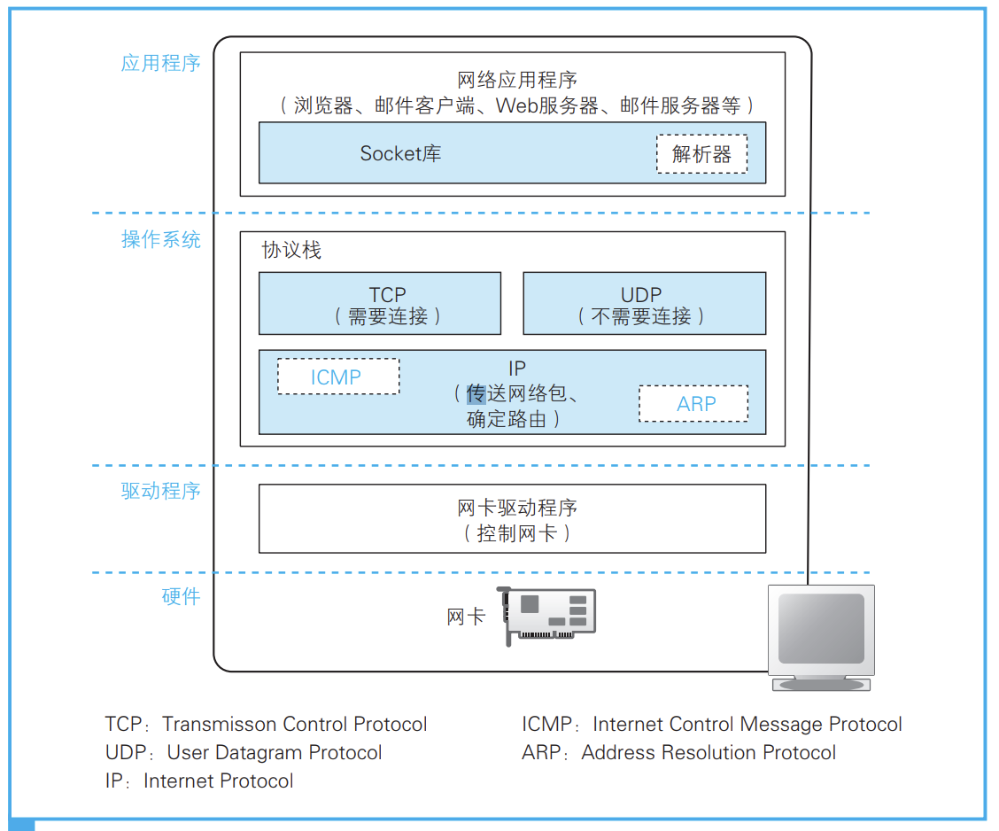
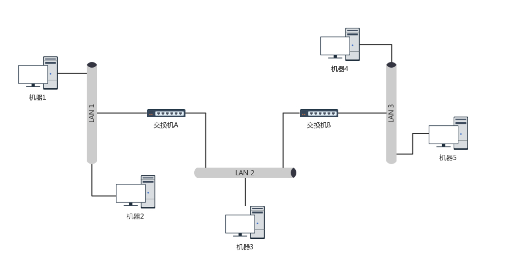
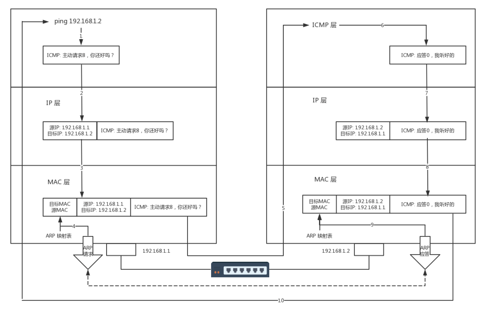
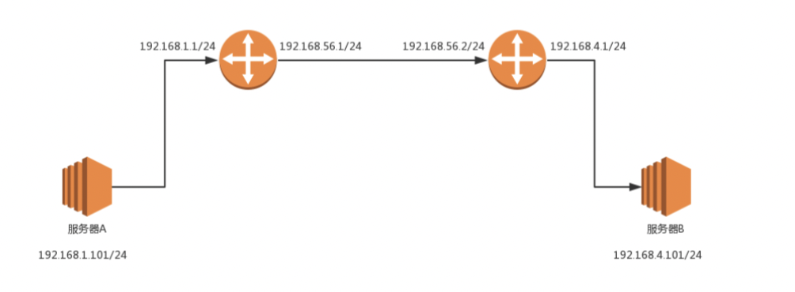
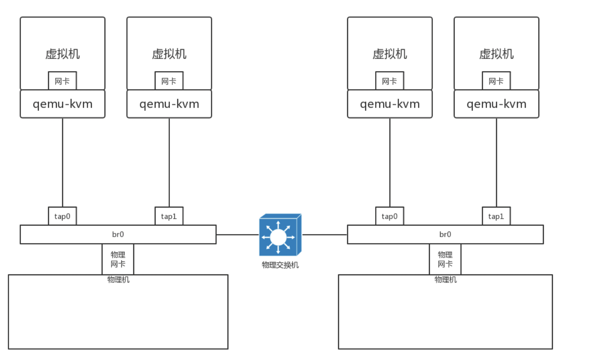

* [1\. 网络基础知识](#1-网络基础知识)
  * [1\.1 基础概念](#11-基础概念)
  * [1\.2  一个宿主是如何处理数据包的](#12--一个宿主是如何处理数据包的)
* [2\. 物理层工作原理](#2-物理层工作原理)
* [3\. 链路层工作原理](#3-链路层工作原理)
  * [3\.1  这个包是发给谁的？谁应该接收？](#31--这个包是发给谁的谁应该接收)
  * [3\.2 大家都在发，会不会产生混乱？有没有谁先发、谁后发的规则？](#32-大家都在发会不会产生混乱有没有谁先发谁后发的规则)
  * [3\.3  如果发送的时候出现了错误，怎么办？](#33--如果发送的时候出现了错误怎么办)
* [4\. 网络层工作原理](#4-网络层工作原理)
  * [4\.1 ping的流程](#41-ping的流程)
  * [4\.2 不同子网之间的ip访问](#42-不同子网之间的ip访问)
    * [4\.2\.1\. 路由器是如何工作的](#421-路由器是如何工作的)
    * [4\.2\.2 不同子网的ip通信流程](#422-不同子网的ip通信流程)
    * [4\.2\.3 路由是如何设置的](#423-路由是如何设置的)
* [5\. 网卡介绍](#5-网卡介绍)
  * [5\.1  查看网卡](#51--查看网卡)
    * [5\.1\.1  ifconfig介绍](#511--ifconfig介绍)
    * [5\.1\.2 其他方式查看网卡](#512-其他方式查看网卡)
  * [5\.2 虚拟网卡](#52-虚拟网卡)
    * [5\.2\.1 虚拟网卡介绍](#521-虚拟网卡介绍)
    * [5\.2\.2 云计算中的网络计算\-虚拟网卡](#522-云计算中的网络计算-虚拟网卡)

本节主要重新学习一下非常基础的网络知识，为后面cni的学习做基础。

参考：

* 网络是怎样连接的-[日]户根勤
* 趣谈网络协议

### 1. 网络基础知识

#### 1.1 基础概念

数据包（packet）：IP 协议传送数据的单位；
帧（frame）：链路层传送数据的单位；
节点（node）：实现了 IP 协议的设备；
路由器（router）：可以转发不是发给自己的 IP 包的设备；
主机（host）：不是路由器的节点；
链路（link）：一种通信机制或介质，节点可以通过它在链路层通信。比如以太网、PPP 链接，也包括隧道；
接口（interface）：节点与链路的连接（可以理解为抽象的“网卡”）；
链路层地址（link-layer address）：接口的链路层标识符（如以太网的 mac 地址）

#### 1.2  一个宿主是如何处理数据包的

* 网卡收到包之后会判断mac是不是自己的，如果是自己的会触发硬中断、软中断通知cpu收包（链路层）
* 之后数据包进入内核网络协议栈，做四层处理，iptables、nat之类的（网络层）
* 然后送到对应的socket缓冲区（传输层）
* 最后送到用户空间进程（应用层）



网络协议栈：是操作系统中对网络相关做处理的逻辑。解封包、iptables、route、netns、vxlan、tunnel、等等都是这里面的一块逻辑（hook）

所以不同的network namespaces会有自己不同的网络协议栈，比如有不同的路由规则等等。这样就达到了隔离的作用。

<br>

### 2. 物理层工作原理

**发送过程**：网卡驱动从 IP 模块获取包之后，会将其复制到网卡内的缓冲区中，然后向 MAC 模块发送发送包的命令。接下来就轮到 MAC 模块进行工作了。 首先，MAC 模块会将包从缓冲区中取出，并在开头加上报头和起始帧 分界符，在末尾加上用于检测错误的帧校验序列。

报头是一串像 10101010…这样 1 和 0 交替出现的比特序列，长度为 56 比特。当这些 1010 的比特序列被转换成电 信号后，会形成如图 高低电平的波形。然后通过光缆或者网线传输出去。

<br>

**集线器**，也叫做**Hub**。这种设备有多个口，可以将多台电脑连接起来。但是和交换机不同，集线器没有大脑，它完全在物理层工作。它会将自己收到的每一个字节，都复制到其他端口上去。这是第一层物理层联通的方案。

### 3. 链路层工作原理

有了物理层的基础就能做到，不同主机直接可以发送数据。但是还有几个问题需要解决

#### 3.1  这个包是发给谁的？谁应该接收？

* 在发送数据的时候，链路层会包装头部，指定目标地址的mac地址。

* 接受时通过mac地址来确定谁应该接受包

* 最开始可能会不知道某个ip的MAC地址，通过 arp 协议在局域网里面广播一下，ip XXX你的mac地址是啥

####  3.2 大家都在发，会不会产生混乱？有没有谁先发、谁后发的规则？

使用的是随机接入协议：有事儿先出门，发现特堵，就回去。错过高峰再出（退避算法）。

#### 3.3  如果发送的时候出现了错误，怎么办？

**循环冗余检测**。通过 XOR 异或的算法，来计算整个包是否在发送的过程中出现了错误。

<br>

链路层工作的设备是交换机。交换机是在局域网工作的，本身不需要ip

交换机的作用就是根据 mac地址进行端口转发。交换机有学习功能，举例如下：

如果机器 1 只知道机器 4 的 IP 地址，当它想要访问机器 4，把包发出去的时候，它必须要知道机器 4 的 MAC 地址。

于是机器 1 发起广播，机器 2 收到这个广播，但是这不是找它的，所以没它什么事。交换机 A 一开始是不知道任何拓扑信息的，在它收到这个广播后，采取的策略是，除了广播包来的方向外，它还要转发给其他所有的网口。于是机器 3 也收到广播信息了，但是这和它也没什么关系。

当然，交换机 B 也是能够收到广播信息的，但是这时候它也是不知道任何拓扑信息的，因而也是进行广播的策略，将包转发到局域网三。这个时候，机器 4 和机器 5 都收到了广播信息。机器 4 主动响应说，这是找我的，这是我的 MAC 地址。于是一个 ARP 请求就成功完成了。




这里可以会有一个问题，就是可能局域网的机器太多，交换机数量也多，然后就会出现回路。这个时候可能就会出现广播风暴。解决办法就是通过STP 协议解决

### 4. 网络层工作原理

#### 4.1 ping的流程

ping 是基于 ICMP 协议工作的。**ICMP**全称**Internet Control Message Protocol**，就是**互联网控制报文协议**。

假定主机 A 的 IP 地址是 192.168.1.1，主机 B 的 IP 地址是 192.168.1.2，它们都在同一个子网。那当你在主机 A 上运行“ping 192.168.1.2”后，会发生什么呢?

（1）ping 命令执行的时候，源主机首先会构建一个 ICMP 请求数据包，ICMP 数据包内包含多个字段。最重要的是两个，第一个是**类型字段**，对于请求数据包而言该字段为 8；另外一个是**顺序号**，主要用于区分连续 ping 的时候发出的多个数据包。每发出一个请求数据包，顺序号会自动加 1。为了能够计算往返时间 RTT，它会在报文的数据部分插入发送时间。

（2）然后，由 ICMP 协议将这个数据包连同地址 192.168.1.2 一起交给 IP 层。IP 层将以 192.168.1.2 作为目的地址，本机 IP 地址作为源地址，加上一些其他控制信息，构建一个 IP 数据包。

（3）接下来，需要加入 MAC 头。如果在本节 ARP 映射表中查找出 IP 地址 192.168.1.2 所对应的 MAC 地址，则可以直接使用；如果没有，则需要发送 ARP 协议查询 MAC 地址，获得 MAC 地址后，由数据链路层构建一个数据帧，目的地址是 IP 层传过来的 MAC 地址，源地址则是本机的 MAC 地址；还要附加上一些控制信息，依据以太网的介质访问规则，将它们传送出去。

（4）主机 B 收到这个数据帧后，先检查它的目的 MAC 地址，并和本机的 MAC 地址对比，如符合，则接收，否则就丢弃。接收后检查该数据帧，将 IP 数据包从帧中提取出来，交给本机的 IP 层。同样，IP 层检查后，将有用的信息提取后交给 ICMP 协议。

（5）主机 B 会构建一个 ICMP 应答包，应答数据包的类型字段为 0，顺序号为接收到的请求数据包中的顺序号，然后再发送出去给主机 A。

（6）在规定的时候间内，源主机如果没有接到 ICMP 的应答包，则说明目标主机不可达；如果接收到了 ICMP 应答包，则说明目标主机可达。此时，源主机会检查，用当前时刻减去该数据包最初从源主机上发出的时刻，就是 ICMP 数据包的时间延迟。



<br>

#### 4.2 不同子网之间的ip访问

##### 4.2.1. 路由器是如何工作的

**路由器是一台设备，它有每个网口或者网卡，都连着局域网。每只手的 IP 地址都和局域网的 IP 地址相同的网段，每只手都是它握住的那个局域网的网关。**

其实就是路由器有多个端口，每个端口配置了ip，端口A配置了一个子网A的ip。

端口B配置了一个子网B的ip。

所以子网AB通过路由器就可以通信了。

<br>

Gateway 的地址一定是和源 IP 地址是一个网段的。往往不是第一个，就是第二个。

例如 192.168.1.0/24 这个网段，Gateway 往往会是 192.168.1.1/24 或者 192.168.1.2/24。

网关主要是用来连接两种不同的网络，同时，网关它还能够同时与两边的主机之间进行通信。但是两边的主机是不能够直接进行通信，是必须要经过网关才能进行通信。网关的工作是在应用层当中。简单来说，网关它就是为了管理不同网段的IP，我们一般在交换机上做VLAN的时候，就需要在默认的VLAN接口之下做一个IP，而这个IP它就是我们所说的网关。

<br>

##### 4.2.2 不同子网的ip通信流程


**mac头部如上所示**：在 MAC 头里面，先是目标 MAC 地址，然后是源 MAC 地址，然后有一个协议类型，用来说明里面是 IP 协议。IP 头里面的版本号，目前主流的还是 IPv4，服务类型 TOS 在第三节讲 ip addr 命令的时候讲过，TTL 在第 7 节讲 ICMP 协议的时候讲过。另外，还有 8 位标识协议。这里到了下一层的协议，也就是，是 TCP 还是 UDP。最重要的就是源 IP 和目标 IP。先是源 IP 地址，然后是目标 IP 地址。

在任何一台机器上，当要访问另一个 IP 地址的时候，都会先判断，这个目标 IP 地址，和当前机器的 IP 地址，是否在同一个网段。怎么判断同一个网段呢？需要 CIDR 和子网掩码，这个在第三节的时候也讲过了。

**如果是同一个网段**，例如，你访问你旁边的兄弟的电脑，那就没网关什么事情，直接将源地址和目标地址放入 IP 头中，然后通过 ARP 获得 MAC 地址，将源 MAC 和目的 MAC 放入 MAC 头中，发出去就可以了。

**如果不是同一网段**，例如，你要访问你们校园网里面的 BBS，该怎么办？这就需要发往默认网关 Gateway。Gateway 的地址一定是和源 IP 地址是一个网段的。往往不是第一个，就是第二个。例如 192.168.1.0/24 这个网段，Gateway 往往会是 192.168.1.1/24 或者 192.168.1.2/24。

**举例说明：**



服务器A属于子网： 192.168.1.101/24

服务器B属于子网：192.168.4.101/24

A服务器需要访问B服务器。访问的过程如下：

（1）服务器A配置了mac包信息

- 源 MAC：服务器 A 的 MAC
- 目标 MAC：192.168.1.1 **这个网口的 MAC **    //注意这里是吓一跳的mac地址，而不是目标地址的mac地址
- 源 IP：192.168.1.101
- 目标 IP：192.168.4.101

这里为什么会知道mac地址，是因为服务器A会通过自己的路由设置，判断这个包下一跳是路由器 192.168.1.1 。由于192.168.1.1 和服务器A是一个子网。所以是可以知道mac地址，并且可以通过mac地址将包发送给路由器的。

（2）包到达 192.168.1.1 这个网口，发现 MAC 一致，将包收进来，开始思考往哪里转发。

在路由器 A 中配置了静态路由之后，要想访问 192.168.4.0/24，要从 192.168.56.1 这个口出去，下一跳为 192.168.56.2。

这个时候mac地址变程了192.168.56.2的mac

（3）包到达 192.168.56.2 这个网口，发现 MAC 一致，将包收进来，开始思考往哪里转发。

在路由器 B 中配置了静态路由，要想访问 192.168.4.0/24，要从 192.168.4.1 这个口出去，没有下一跳了。因为我右手这个网卡，就是这个网段的，我是最后一跳了。

于是，路由器 B 思考的时候，匹配上了这条路由，要从 192.168.4.1 这个口发出去，发给 192.168.4.101。那 192.168.4.101 的 MAC 地址是多少呢？路由器 B 发送 ARP 获取 192.168.4.101 的 MAC 地址，然后发送包。

通过这个过程可以看出，每到一个新的局域网，MAC 都是要变的，但是 IP 地址都不变。在 IP 头里面，不会保存任何网关的 IP 地址。**所谓的下一跳是，某个 IP 要将这个 IP 地址转换为 MAC 放入 MAC 头。**

<br>

有的时候是不同的私有网络访问，可能2个子网都是一致的，这个时候路由器/网络会有NAT 转换功能。

<br>

##### 4.2.3 路由是如何设置的

（1）静态路由可以通过手动配置，修改iptables规则等

（2）动态路由通过链路状态路由算法等等动态设置

<br>

### 5. 网卡介绍

网卡的作用是负责接收网络上的数据包，通过和自己本身的物理地址相比较决定是否为本机应接信息，解包后将数据通过主板上的总线传输给本地计算机，另一方面将本地计算机上的数据打包后送出网络。 网卡是一块被设计用来允许计算机在计算机网络上进行通讯的计算机硬件。 由于其拥有MAC地址，因此属于OSI模型的第2层。

<br>

#### 5.1  查看网卡

##### 5.1.1  ifconfig介绍

```
root@onlinegame:/home/zouxiang# ifconfig
br-15db8aed13ee: flags=4099<UP,BROADCAST,MULTICAST>  mtu 1500
        inet 172.18.0.1  netmask 255.255.0.0  broadcast 172.18.255.255   // 桥接
        ether 02:42:e7:49:61:ba  txqueuelen 0  (Ethernet)
        RX packets 24  bytes 2202 (2.1 KiB)
        RX errors 0  dropped 0  overruns 0  frame 0
        TX packets 29  bytes 1965 (1.9 KiB)
        TX errors 0  dropped 0 overruns 0  carrier 0  collisions 0

br-837c9a286528: flags=4099<UP,BROADCAST,MULTICAST>  mtu 1500
        inet 172.19.0.1  netmask 255.255.0.0  broadcast 172.19.255.255
        ether 02:42:6a:d2:3e:4b  txqueuelen 0  (Ethernet)
        RX packets 0  bytes 0 (0.0 B)
        RX errors 0  dropped 0  overruns 0  frame 0
        TX packets 0  bytes 0 (0.0 B)
        TX errors 0  dropped 0 overruns 0  carrier 0  collisions 0

docker0: flags=4099<UP,BROADCAST,MULTICAST>  mtu 1500
        inet 172.17.0.1  netmask 255.255.0.0  broadcast 172.17.255.255
        ether 02:42:17:8d:1d:41  txqueuelen 0  (Ethernet)
        RX packets 180476  bytes 12421319 (11.8 MiB)
        RX errors 0  dropped 0  overruns 0  frame 0
        TX packets 289194  bytes 417833816 (398.4 MiB)
        TX errors 0  dropped 0 overruns 0  carrier 0  collisions 0

eth0: flags=4163<UP,BROADCAST,RUNNING,MULTICAST>  mtu 1400
        inet 10.212.31.96  netmask 255.255.255.0  broadcast 10.212.31.255
        ether 52:54:00:2d:09:10  txqueuelen 1000  (Ethernet)
        RX packets 31059650  bytes 6131166764 (5.7 GiB)
        RX errors 0  dropped 0  overruns 0  frame 0
        TX packets 29660001  bytes 6106589785 (5.6 GiB)
        TX errors 0  dropped 0 overruns 0  carrier 0  collisions 0

lo: flags=73<UP,LOOPBACK,RUNNING>  mtu 65536               // loop设备
        inet 127.0.0.1  netmask 255.0.0.0
        loop  txqueuelen 1  (Local Loopback)
        RX packets 10494509  bytes 790297025 (753.6 MiB)
        RX errors 0  dropped 0  overruns 0  frame 0
        TX packets 10494509  bytes 790297025 (753.6 MiB)
        TX errors 0  dropped 0 overruns 0  carrier 0  collisions 0
```

eth0 表示第一块网卡， 其中 ether表示网卡的mac地址，可以看到目前这个网卡的物理地址(MAC地址）是 52:54:00:2d:09:10

inet addr 用来表示网卡的IP地址，此网卡的 IP地址是 192.168.120.204，广播地址， Bcast:192.168.120.255，掩码地址Mask:255.255.255.0

lo 是表示主机的回环地址，这个一般是用来测试一个网络程序，但又不想让局域网或外网的用户能够查看，只能在此台主机上运行和查看所用的网络接口。比如把 HTTPD服务器的指定到回坏地址，在浏览器输入 127.0.0.1 就能看到你所架WEB网站了。但只是您能看得到，局域网的其它主机或用户无从知道。

第一行：连接类型：Ethernet（以太网）HWaddr（硬件mac地址）

第二行：网卡的IP地址、子网、掩码

第三行：UP（代表网卡开启状态）RUNNING（代表网卡的网线被接上）MULTICAST（支持组播）MTU:1500（最大传输单元）：1500字节

第四、五行：接收、发送数据包情况统计

RX packets: errors:0 dropped:0 overruns:0 frame:0 接受包数量/出错数量/丢失数量…

TX packets: errors:0 dropped:0 overruns:0 carrier:0 发送包数量/出错数量/丢失数量…

**loop设备**

lo 是loop设备的意思，地址是127.0.0.1即本机回送地址，一般网站服务本地测试的时候时候这个ip进行本地测试

第七行：接收、发送数据字节数统计信息。

**桥接**

真实主机中安装的虚拟主机，需要和外界主机进行通讯的时候，数据需要通过真实主机的网卡进行传输，但是虚拟主机内核无法对真实主机的网卡进行控制，一般情况下需要将虚拟主机先将数据包发送给真实主机的内核，再由真实主机内核将该数据通过真实物理网卡发送出去，该过程成为NAT（网络地址转换），虽然可以实现该功能，但是数据传数度较慢。

怎么办呢？
linux内核支持网络接口的桥接，什么意思？就是说可以由真实主机的内核虚拟出来一个接口br0，同时这个也是一个对外的虚拟网卡设备，通过该接口可以将虚拟主机网卡和真实主机网卡直接连接起来，进行正常的数据通讯，提升数据传输效率。该过程就是桥接。（目前只支持以太网接口，linux内核是通过一个虚拟的网桥设备来实现虚拟桥接接口的，这个虚拟设备可以绑定若干个以太网接口设备，从而将它们桥接起来）

##### 5.1.2 其他方式查看网卡

```
root@# ip link
1: lo: <LOOPBACK,UP,LOWER_UP> mtu 65536 qdisc noqueue state UNKNOWN mode DEFAULT group default qlen 1000
    link/loopback 00:00:00:00:00:00 brd 00:00:00:00:00:00
24578: usb0: <BROADCAST,MULTICAST> mtu 1500 qdisc noop state DOWN mode DEFAULT group default qlen 1000
    link/ether 3a:68:dd:49:76:07 brd ff:ff:ff:ff:ff:ff
2: eth1: <BROADCAST,MULTICAST> mtu 1500 qdisc noop state DOWN mode DEFAULT group default qlen 1000
    link/ether 04:3f:72:ed:d5:8a brd ff:ff:ff:ff:ff:ff
3: eth0: <BROADCAST,MULTICAST,UP,LOWER_UP> mtu 1500 qdisc mq state UP mode DEFAULT group default qlen 10000
    link/ether 04:3f:72:ed:d5:8b brd ff:ff:ff:ff:ff:ff
4: eth3: <BROADCAST,MULTICAST> mtu 1500 qdisc noop state DOWN mode DEFAULT group default qlen 1000
    link/ether 04:3f:72:ed:d5:9a brd ff:ff:ff:ff:ff:ff
5: eth2: <BROADCAST,MULTICAST> mtu 1500 qdisc noop state DOWN mode DEFAULT group default qlen 1000
    link/ether 04:3f:72:ed:d5:9b brd ff:ff:ff:ff:ff:ff
6: eth4: <BROADCAST,MULTICAST> mtu 1500 qdisc noop state DOWN mode DEFAULT group default qlen 1000
    link/ether 04:3f:72:ed:d5:be brd ff:ff:ff:ff:ff:ff
7: eth5: <BROADCAST,MULTICAST> mtu 1500 qdisc noop state DOWN mode DEFAULT group default qlen 1000
    link/ether 04:3f:72:ed:d5:bf brd ff:ff:ff:ff:ff:ff
9: ovs-system: <BROADCAST,MULTICAST> mtu 1500 qdisc noop state DOWN mode DEFAULT group default qlen 1000
    link/ether 16:00:1c:04:75:4c brd ff:ff:ff:ff:ff:ff
10: acc-int: <BROADCAST,MULTICAST> mtu 1500 qdisc noop state DOWN mode DEFAULT group default qlen 1000
    link/ether 82:ca:f2:02:d4:4b brd ff:ff:ff:ff:ff:ff
12: docker0: <BROADCAST,MULTICAST,UP,LOWER_UP> mtu 1500 qdisc noqueue state UP mode DEFAULT group default
    link/ether 02:42:78:6b:b0:54 brd ff:ff:ff:ff:ff:ff
17: vxlan_sys_4789: <BROADCAST,MULTICAST,UP,LOWER_UP> mtu 65000 qdisc noqueue master ovs-system state UNKNOWN mode DEFAULT group default qlen 1000
    link/ether 32:35:2a:28:fd:ab brd ff:ff:ff:ff:ff:ff
71699: qvo_d888ac@if71700: <BROADCAST,MULTICAST,UP,LOWER_UP> mtu 1500 qdisc noqueue master ovs-system state UP mode DEFAULT group default qlen 1000
    link/ether fe:54:00:dd:11:4f brd ff:ff:ff:ff:ff:ff link-netns ns_network
71703: qvo_8f5819@if71704: <BROADCAST,MULTICAST,UP,LOWER_UP> mtu 1500 qdisc noqueue master ovs-system state UP mode DEFAULT group default qlen 1000
    link/ether fe:54:00:4e:d0:7b brd ff:ff:ff:ff:ff:ff link-netns ns_network
71451: qvo_11a63f@if71452: <BROADCAST,MULTICAST,UP,LOWER_UP> mtu 1500 qdisc noqueue master ovs-system state UP mode DEFAULT group default qlen 1000
    link/ether fe:54:00:10:56:1e brd ff:ff:ff:ff:ff:ff link-netns ns_network
71731: qvo_0d237c@if71732: <BROADCAST,MULTICAST,UP,LOWER_UP> mtu 1500 qdisc noqueue master ovs-system state UP mode DEFAULT group default qlen 1000
    link/ether fe:54:00:fb:d9:ff brd ff:ff:ff:ff:ff:ff link-netns ns_network
71514: veth14feb1d@if71513: <BROADCAST,MULTICAST,UP,LOWER_UP> mtu 1500 qdisc noqueue master docker0 state UP mode DEFAULT group default
    link/ether 8e:f8:a2:35:53:ba brd ff:ff:ff:ff:ff:ff link-netnsid 7
71783: qvo_87db25@if71784: <BROADCAST,MULTICAST,UP,LOWER_UP> mtu 1500 qdisc noqueue master ovs-system state UP mode DEFAULT group default qlen 1000
    link/ether fe:54:00:36:a2:4a brd ff:ff:ff:ff:ff:ff link-netns ns_network
71607: qvo_759d55@if71608: <BROADCAST,MULTICAST,UP,LOWER_UP> mtu 1500 qdisc noqueue master ovs-system state UP mode DEFAULT group default qlen 1000
    link/ether fe:54:00:41:28:b0 brd ff:ff:ff:ff:ff:ff link-netns ns_network
71611: qvo_988854@if71612: <BROADCAST,MULTICAST,UP,LOWER_UP> mtu 1500 qdisc noqueue master ovs-system state UP mode DEFAULT group default qlen 1000
    link/ether fe:54:00:f1:56:1e brd ff:ff:ff:ff:ff:ff link-netns ns_network
71387: qvo_9b9a37@if71388: <BROADCAST,MULTICAST,UP,LOWER_UP> mtu 1500 qdisc noqueue master ovs-system state UP mode DEFAULT group default qlen 1000
    link/ether fe:54:00:02:cc:4f brd ff:ff:ff:ff:ff:ff link-netns ns_network


// 查看所有的网卡，这个和上面的ip link是一样的
root# cd /sys/class/net
root# ls
acc-int  docker0  eth0	eth1  eth2  eth3  eth4	eth5  lo  ovs-system  qvo_0d237c  qvo_11a63f  qvo_759d55  qvo_87db25  qvo_8f5819  qvo_988854  qvo_9b9a37  qvo_d888ac  usb0  veth14feb1d  vxlan_sys_4789
```

#### 5.2 虚拟网卡

##### 5.2.1 虚拟网卡介绍

虚拟网卡简单来说就是通过软件模拟出来的电脑网卡。在虚拟化中经常用到。

```
// 查看/sys/devices/virtual/net/这个目录，可以判断出哪些是虚拟网卡
root# ls /sys/devices/virtual/net/
acc-int  docker0  lo  ovs-system  qvo_0d237c  qvo_11a63f  qvo_16bb20  qvo_759d55  qvo_8f5819  qvo_988854  qvo_9b9a37  qvo_d888ac  veth14feb1d  vxlan_sys_4789
root@cld-dnode1-1051:/sys/class/net#
```

<br>

虚拟网卡的实际工作原理就是：

协议栈处理完的会从网卡送出，这些可能是虚拟网卡，虚拟网卡最终会通过IO将数据送到物理网卡（NIC），然后发送出去。

虚拟网卡和物理网卡的连接方式有很多种。比如桥接（通过brideg连接虚拟网卡和物理网卡）。

不同namespaces经常通过veth-pair连接。

例如，在docker内部其实就是veth-pair，一个虚拟网卡在容器内部，一个在宿主，然后进行通信。

veth-pair就是一堆虚拟网卡设备。往一个网卡发送数据，另一个网卡就能收到。

```
bash-5.1$ route
Kernel IP routing table
Destination     Gateway         Genmask         Flags Metric Ref    Use Iface
default         7.53.64.65      0.0.0.0         UG    0      0        0 eth0
7.53.64.64      *               255.255.255.192 U     0      0        0 eth0
bash-5.1$
bash-5.1$ ifconfig
eth0      Link encap:Ethernet  HWaddr 52:54:00:BA:9F:2D
          inet addr:7.53.64.112  Bcast:0.0.0.0  Mask:255.255.255.192
          UP BROADCAST RUNNING MULTICAST  MTU:1400  Metric:1
          RX packets:132698569 errors:0 dropped:0 overruns:0 frame:0
          TX packets:129715622 errors:0 dropped:0 overruns:0 carrier:0
          collisions:0 txqueuelen:1000
          RX bytes:11982615680 (11.1 GiB)  TX bytes:13782715446 (12.8 GiB)

lo        Link encap:Local Loopback
          inet addr:127.0.0.1  Mask:255.0.0.0
          UP LOOPBACK RUNNING  MTU:65536  Metric:1
          RX packets:4567760 errors:0 dropped:0 overruns:0 frame:0
          TX packets:4567760 errors:0 dropped:0 overruns:0 carrier:0
          collisions:0 txqueuelen:1000
          RX bytes:332750268 (317.3 MiB)  TX bytes:332750268 (317.3 MiB)
```

##### 5.2.2 云计算中的网络计算-虚拟网卡

虚拟网卡的作用有很多，当前云计算技术中就离不开虚拟网卡。

云计算中的网络有以下的点需要实现：

（1）**共享**：尽管每个虚拟机都会有一个或者多个虚拟网卡，但是物理机上可能只有有限的网卡。那这么多虚拟网卡如何共享同一个出口？

**通过网桥解决共享问题**



（2）**隔离**：分两个方面，一个是安全隔离，两个虚拟机可能属于两个用户，那怎么保证一个用户的数据不被另一个用户窃听？一个是流量隔离，两个虚拟机，如果有一个疯狂下片，会不会导致另外一个上不了网？

有一个命令**vconfig**，可以基于物理网卡 eth0 创建带 VLAN 的虚拟网卡，所有从这个虚拟网卡出去的包，都带这个 VLAN，如果这样，跨物理机的互通和隔离就可以通过这个网卡来实现。

不同的用户由于网桥不通，不能相互通信，一旦出了网桥，由于 VLAN 不同，也不会将包转发到另一个网桥上。另外，出了物理机，也是带着 VLAN ID 的。只要物理交换机也是支持 VLAN 的，到达另一台物理机的时候，VLAN ID 依然在，它只会将包转发给相同 VLAN 的网卡和网桥，所以跨物理机，不同的 VLAN 也不会相互通信。


（3） **互通**：分两个方面，一个是如果同一台机器上的两个虚拟机，属于同一个用户的话，这两个如何相互通信？另一个是如果不同物理机上的两个虚拟机，属于同一个用户的话，这两个如何相互通信？

如上

（4）**灵活**：虚拟机和物理不同，会经常创建、删除，从一个机器漂移到另一台机器，有的互通、有的不通等等，灵活性比物理网络要好得多，需要能够灵活配置。

通过OpenvSwitch 配置

<br>

虚拟网卡的介绍：https://keenjin.github.io/2019/06/virtual-net/
