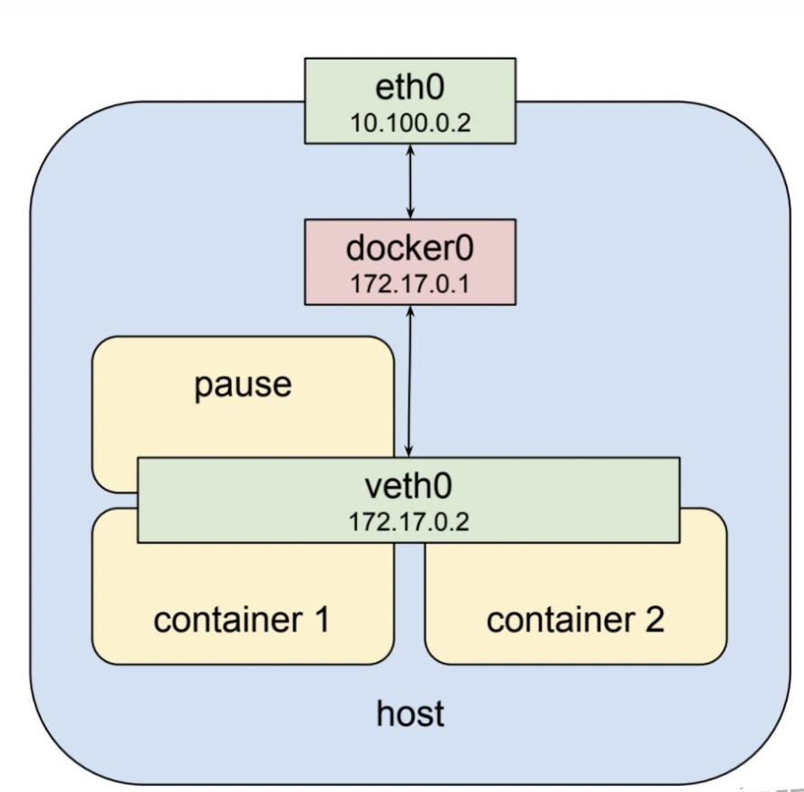
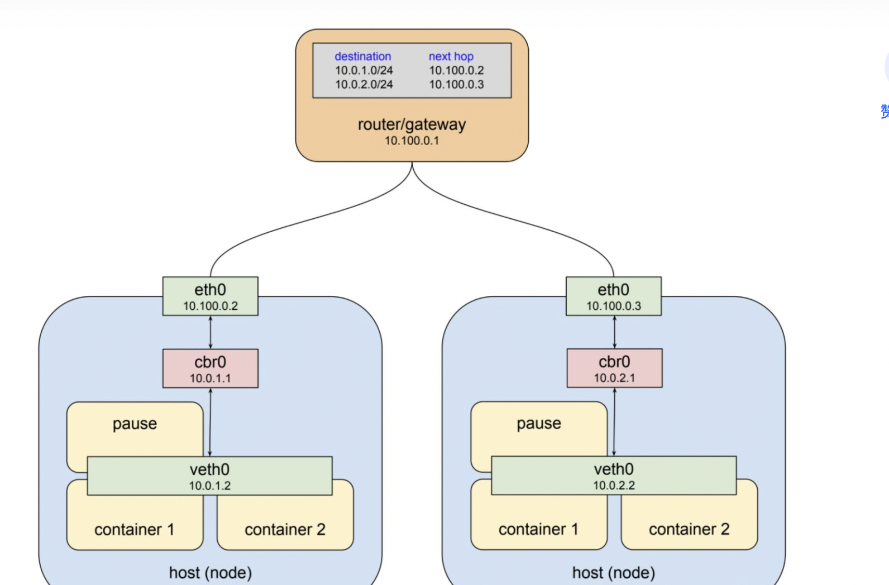

* [1\. 目标](#1-目标)
* [2\. 通信原理](#2-通信原理)
  * [2\.1 同一个Pod内部不同容器之间的通信](#21-同一个pod内部不同容器之间的通信)
  * [2\.2 同一个节点上不同pod之间的通信原理](#22-同一个节点上不同pod之间的通信原理)
  * [2\.3 不同节点之间的Pod通信原理](#23-不同节点之间的pod通信原理)
  * [2\.4 K8S集群内部访问服务的原理](#24-k8s集群内部访问服务的原理)
    * [2\.4\.1 clusterIp介绍](#241-clusterip介绍)
    * [2\.4\.2 clusterIp原理说明](#242-clusterip原理说明)
  * [2\.5 K8S集群外部部访问服务的原理](#25-k8s集群外部部访问服务的原理)
    * [2\.5\.1 LoadBalancer](#251-loadbalancer)
    * [2\.5\.2 NodePort](#252-nodeport)
* [2\.6 ingress](#26-ingress)

### 1. 目标

了解以下情况下k8s集群内部网络的通信原理

（1）同一个Pod内部不同容器之间的通信原理

（2）同一个节点上不同pod之间的通信原理

（3）不同节点之间的Pod通信原理

（4）K8S集群内部访问服务的原理

（5）K8S集群外部部访问服务的原理

<br>

### 2. 通信原理

#### 2.1 同一个Pod内部不同容器之间的通信

Pods中的多个container共享一个网络栈，每个pod都是有一个pause容器，就是sandbox。所有的业务容器都是加入了这个namespaces。所以他们可以直接通过localhost通信。

#### 2.2 同一个节点上不同pod之间的通信原理

这里可以先了解一下基础知识：

* 不同network namespace之间可以通过veth pair来互相通信
* 多个network namespace之间可以通过 bridge 来通信

可以参考：https://www.cnblogs.com/bakari/p/10443484.html

而这个bridge就是docker0。在pods的namespace中，pods的虚拟网络接口为veth0；在宿主机上，物理网络的网络接口为eth0。docker bridge作为veth0的默认网关，用于和宿主机网络的通信。

所有pods的veth0所能分配的IP是一个独立的IP地址范围，来自于创建cluster时候kubeadm的--pod-network-cidr参数设定的CIDR，这里看起来像是172.17.0.0/24，是一个B类局域网IP地址段；所有宿主机的网络接口eth0所能分配的IP是实际物理网络的设定，一般来自于实际物理网络中的路由器通过DHCP分配的，这里看起来是10.100.0.0/24，是一个A类局域网IP地址段。



#### 2.3 不同节点之间的Pod通信原理

上面2个其实是docker做的工作。在k8s层，我们部署的往往需要flannel或者calico来打通网络。

下面的docker0的名字被改成了cbr0，意思是custom bridge。由此，如果左侧的pod想访问右侧的pod，则IP包会通过bridge cbr0来到左侧宿主机的eth0，然后查询宿主机上新增的路由信息，继而将IP包送往右侧的宿主机的eth0，继而再送往右侧的bridge cbr0，最后送往右侧的pod。



<br>

以flannel为例子, flannel为pod分配Ip，并且设置路由。所以一个pod的请求达到docker后会被flannel接收，然后进行转发。

Flannel 是 CoreOS 团队针对 Kubernetes 设计的一个网络规划实现。简单来说，它的功能有以下几点：

1、使集群中的不同 Node 主机创建的 Docker 容器都具有全集群唯一的虚拟 IP 地址；

2、建立一个覆盖网络（overlay network），这个覆盖网络会将数据包原封不动的传递到目标容器中。覆盖网络是建立在另一个网络之上并由其基础设施支持的虚拟网络。覆盖网络通过将一个分组封装在另一个分组内来将网络服务与底层基础设施分离。在将封装的数据包转发到端点后，将其解封装；

3、创建一个新的虚拟网卡 flannel0 接收 docker 网桥的数据，通过维护路由表，对接收到的数据进行封包和转发（VXLAN）；

4、路由信息一般存放到 etcd 中：多个 Node 上的 Flanneld 依赖一个 etcd cluster 来做集中配置服务，etcd 保证了所有 Node 上 Flannel 所看到的配置是一致的。同时每个 Node 上的 Flannel 都可以监听 etcd 上的数据变化，实时感知集群中 Node 的变化；

5、Flannel 首先会在 Node 上创建一个名为 flannel0 的网桥（VXLAN 类型的设备），并且在每个 Node 上运行一个名为 Flanneld 的代理。每个 Node 上的 Flannel 代理会从 etcd 上为当前 Node 申请一个 CIDR 地址块用来给该 Node 上的 Pod 分配地址；

6、Flannel 致力于给 Kubernetes 集群中的 Node 提供一个三层网络，它并不控制 Node 中的容器是如何进行组网的，仅仅关心流量如何在 Node 之间流转。


#### 2.4 K8S集群内部访问服务的原理

正式业务下，Pod可能会被重启或者因为其他原因重建，而且一个服务有很多pod如何服务，怎么确定是那个服务？

这个时候就有了service的概念。在集群内部访问一般是 headless or clusterIp

##### 2.4.1 clusterIp介绍

以clusterIp为例, 创建完之后查看svc就有一个 CLUSTER-IP。

这样在集群内的容器或节点上都能够访问Service

```
apiVersion: v1
kind: Service
metadata:
  labels:
    app: nginx
  name: nginx-clusterip
spec:
  ports:
  - name: service0
    port: 8080                # 访问Service的端口
    protocol: TCP             # 访问Service的协议，支持TCP和UDP
    targetPort: 80            # Service访问目标容器的端口，此端口与容器中运行的应用强相关，如本例中nginx镜像默认使用80端口
  selector:                   # 标签选择器，Service通过标签选择Pod，将访问Service的流量转发给Pod，此处选择带有 app:nginx 标签的Pod
    app: nginx
  type: ClusterIP             # Service的类型，ClusterIP表示在集群内访问
  
  
# kubectl get svc
NAME              TYPE        CLUSTER-IP     EXTERNAL-IP   PORT(S)    AGE
nginx-clusterip   ClusterIP   10.247.74.52   <none>        8080/TCP   14m
```

<br>

headless svc是一种特色的clusterIp类型。他在定义的时候制定了 clusterIp=none。例如：

```
apiVersion: v1
kind: Service
metadata:
  name: nginx
  labels:
    app: nginx
spec:
  ports:
  - port: 80
    name: nginx-web
  # clusterIP 设置为 None
  clusterIP: None
  selector:
    app: nginx
```

`Headless Service`其实就是没头的`Service`。使用场景如下：

- client感知到svc的所有endpoint, 通过查询dns自主选择访问哪个后端
- `Headless Service`的对应的每一个`Endpoints`，即每一个`Pod`，都会有对应的`DNS`域名；这样`Pod`之间就可以互相访问。StatefulSets就是使用了headless service

##### 2.4.2 clusterIp原理说明

到了svc这层都需要额外的控制器来处理。社区常见的就是 kube-proxy。这里只是简单说一下原理。

kube-proxy在每个节点上监听svc, ep, pod资源的变化，然后通过iptable来控制访问svc的时候，具体访问哪个pod。

 iptables可以实现负载均衡：比如通过**--probability** 设置概率来保证负载均衡。

可以参考：https://blog.csdn.net/ksj367043706/article/details/89764546

比如： clusterip=10.247.74.52 的svc有两个Pod, kube-proxy会设置每个节点上iptables的规则。

访问ip=10.247.74.52的路由，以50%的概率先访问 podA; 然后 100%概率访问podB。

<br>

#### 2.5 K8S集群外部部访问服务的原理

##### 2.5.1 LoadBalancer

负载均衡( LoadBalancer )可以通过弹性负载均衡从公网访问到工作负载，与弹性IP方式相比提供了高可靠的保障，一般用于系统中需要暴露到公网的服务。

到这里为止其实和k8s的关系不是很大了，一般各个网络服务提供了LoadBalancer，在定义yaml制定subnet-id，vpc等信息申请LoadBalancer-ip，然后对应的节点的网络配置（路由转发等）通过直接访问这个ip即可（后面负载均衡啥的，网络服务部门已经干了）

```
apiVersion: v1 
kind: Service 
metadata: 
  annotations:   
    kubernetes.io/elb.pass-through: "true"
    kubernetes.io/elb.class: union
    kubernetes.io/session-affinity-mode: SOURCE_IP
    kubernetes.io/elb.subnet-id: a9cf6d24-ad43-4f75-94d1-4e0e0464afac
    kubernetes.io/elb.autocreate: '{"type":"public","bandwidth_name":"cce-bandwidth","bandwidth_chargemode":"bandwidth","bandwidth_size":5,"bandwidth_sharetype":"PER","eip_type":"5_bgp","name":"james"}'
  labels: 
    app: nginx 
  name: nginx 
spec: 
  externalTrafficPolicy: Local
  ports: 
  - name: service0 
    port: 80
    protocol: TCP 
    targetPort: 80
  selector: 
    app: nginx 
  type: LoadBalancer
```

<br>

##### 2.5.2 NodePort

节点访问 ( NodePort )是指在每个节点的IP上开放一个静态端口，通过静态端口对外暴露服务。节点访问 ( NodePort )会路由到ClusterIP服务，这个ClusterIP服务会自动创建。通过请求 <NodeIP>:<NodePort>，可以从集群的外部访问一个NodePort服务。

部署yaml如下所示：

```
apiVersion: v1
kind: Service
metadata:
  labels:
    app: nginx
  name: nginx-nodeport
spec:
  ports:
  - name: service
    nodePort: 30000     # 节点端口，取值范围为30000-32767
    port: 8080          # 访问Service的端口
    protocol: TCP       # 访问Service的协议，支持TCP和UDP
    targetPort: 80      # Service访问目标容器的端口，此端口与容器中运行的应用强相关，如本例中nginx镜像默认使用80端口
  selector:             # 标签选择器，Service通过标签选择Pod，将访问Service的流量转发给Pod，此处选择带有 app:nginx 标签的Pod
    app: nginx
  type: NodePort        # Service的类型，NodePort表示在通过节点端口访问
```

NodePort的核心实现也是非常简单。外部服务通过访问节点某个port, iptables通过转发访问服务，这样就将外部访问变成了内部访问。

### 2.6 ingress

kubernetes提供了Ingress资源对象，Ingress只需要一个NodePort或者一个LB就可以满足暴露多个Service的需求。可以做到7层了负载均衡。这里只是简单说一下，目前还没有研究ingress，后面再补充。