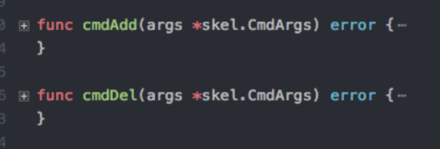

* [1\. 背景](#1-背景)
* [2\. conf如何配置](#2-conf如何配置)
* [3\. cni插件如何实现](#3-cni插件如何实现)
  * [3\.1 摘抄部分](#31-摘抄部分)
  * [3\.2 原创部分](#32-原创部分)
* [4\. 参考](#4-参考)

### 1. 背景

CNI的定义可以参照[官方文档](https://github.com/containernetworking/cni)，这里不详细介绍。

CNI插件是由kubelet加载和运行，具体的目录和配置可以由参数`--network-plugin --cni-conf-dir --cni-bin-dir`指定。

参数必须是 --network-plugin = cni， --cni-bin-dir 里面放的是自定义cni的二进制文件。 --cni-conf-dir 是配置文件。

以calico为例：

```
# CNI和IPAM的二进制文件
# ls /opt/cni/bin/
calico  calico-ipam  loopback

# CNI的配置文件
# ls /etc/cni/net.d/
10-calico.conf  calico-kubeconfig
```

<br>

可以看到关键在于2点：

（1）conf如何配置

（2）二进制代码需要如何实现

### 2. conf如何配置

一般来说，CNI 插件需要在集群的每个节点上运行，在 CNI 的规范里面，实现一个 CNI 插件首先需要一个 JSON 格式的配置文件，配置文件需要放到每个节点的 `/etc/cni/net.d/` 目录，一般命名为 `<数字>-<CNI-plugin>.conf`，而且配置文件至少需要以下几个必须的字段：

1. `cniVersion`: CNI 插件的字符串版本号，要求符合  [Semantic Version 2.0 规范](https://semver.org/)
2. `name`: 字符串形式的网络名；
3. `type`: 字符串表示的 CNI 插件的可运行文件；

除此之外，我们也可以增加一些自定义的配置字段，用于传递参数给 CNI 插件，这些配置会在运行时传递给 CNI 插件。在我们的例子里面，需要配置每个宿主机网桥的设备名、网络设备的最大传输单元(MTU)以及每个节点分配的 24 位子网地址，因此，我们的 CNI 插件的配置看起来会像下面这样：

```
{
    "cniVersion": "0.1.0",
    "name": "minicni",
    "type": "minicni",
    "bridge": "minicni0",
    "mtu": 1500,
    "subnet": __NODE_SUBNET__
}
```

Note: 确保配置文件放到 `/etc/cni/net.d/` 目录，kubelet 默认此目录寻找 CNI 插件配置；并且，插件的配置可以分为多个插件链的形式来运行，但是为了简单起见，在我们的例子中，只配置一个独立的 CNI 插件，因为配置文件的后缀名为 `.conf`。

### 3. cni插件如何实现

#### 3.1 摘抄部分

本节摘抄自：https://jishuin.proginn.com/p/763bfbd57bc0

接下来就开始看怎么实现 CNI 插件来管理 pod IP 地址以及配置容器网络设备。在此之前，我们需要明确的是，CNI 介入的时机是 kubelet 创建 pause 容器创建对应的网络命名空间之后，同时当 CNI 插件被调用的时候，kubelet 会将相关操作命令以及参数通过环境变量的形式传递给它。这些环境变量包括：

1. `CNI_COMMAND`: CNI 操作命令，包括 ADD, DEL, CHECK 以及 VERSION
2. `CNI_CONTAINERID`: 容器 ID
3. `CNI_NETNS`: pod 网络命名空间
4. `CNI_IFNAME`: pod 网络设备名称
5. `CNI_PATH`: CNI 插件可执行文件的搜索路径
6. `CNI_ARGS`: 可选的其他参数，形式类似于 `key1=value1,key2=value2...`

在运行时，kubelet 通过 CNI 配置文件寻找 CNI 可执行文件，然后基于上述几个环境变量来执行相关的操作。CNI 插件必须支持的操作包括：

1. ADD: 将 pod 加入到 pod 网络中
2. DEL: 将 pod 从 pod 网络中删除
3. CHECK: 检查 pod 网络配置正常
4. VERSION: 返回可选 CNI 插件的版本信息

```
func main() {
 cmd, cmdArgs, err := args.GetArgsFromEnv()
 if err != nil {
  fmt.Fprintf(os.Stderr, "getting cmd arguments with error: %v", err)
 }

 fh := handler.NewFileHandler(IPStore)

 switch cmd {
 case "ADD":
  err = fh.HandleAdd(cmdArgs)
 case "DEL":
  err = fh.HandleDel(cmdArgs)
 case "CHECK":
  err = fh.HandleCheck(cmdArgs)
 case "VERSION":
  err = fh.HandleVersion(cmdArgs)
 default:
  err = fmt.Errorf("unknown CNI_COMMAND: %s", cmd)
 }
 if err != nil {
  fmt.Fprintf(os.Stderr, "Failed to handle CNI_COMMAND %q: %v", cmd, err)
  os.Exit(1)
 }
}
```

可以看到，我们首先调用 `GetArgsFromEnv()` 函数将 CNI 插件的操作命令以及相关参数通过环境变量读入，同时从标准输入获取 CNI 插件的 JSON 配置，然后基于不同的 CNI 操作命令执行不同的处理函数。

需要注意的是，我们将处理函数的集合实现为一个**接口**[12]，这样就可以很容易的扩展不同的接口实现。在最基础的版本实现中，我们基本文件存储分配的 IP 信息。但是，这种实现方式存在很多问题，例如，文件存储不可靠，读写可能会发生冲突等，在后续的版本中，我们会实现基于 kubernetes 存储的接口实现，将子网信息以及 IP 信息存储到 apiserver 中，从而实现可靠存储。

接下来，我们就看看基于文件的接口实现是怎么处理这些 CNI 操作命令的。

对于 ADD 命令：

1. 从标准输入获取 CNI 插件的配置信息，最重要的是当前宿主机网桥的设备名、网络设备的最大传输单元(MTU)以及当前节点分配的 24 位子网地址；
2. 然后从环境变量中找到对应的 CNI 操作参数，包括 pod 容器网络命名空间以及 pod 网络设备名等；
3. 接下来创建或者更新节点宿主机网桥，从当前节点分配的 24 位子网地址中抽取子网的网关地址，准备分配给节点宿主机网桥；
4. 接着将从文件读取已经分配的 IP 地址列表，遍历 24 位子网地址并从中取出第一个没有被分配的 IP 地址信息，准备分配给 pod 网络设备；pod 网络设备是 veth 设备对，一端在 pod 网络命名空间中，另外一端连接着宿主机上的网桥设备，同时所有的 pod 网络设备将宿主机上的网桥设备当作默认网关；
5. 最终成功后需要将新的 pod IP 写入到文件中

看起来很简单对吧？其实作为最简单的方式，这种方案可以实现最基础的 ADD 功能：

```
func (fh *FileHandler) HandleAdd(cmdArgs *args.CmdArgs) error {
 cniConfig := args.CNIConfiguration{}
 if err := json.Unmarshal(cmdArgs.StdinData, &cniConfig); err != nil {
  return err
 }
 allIPs, err := nettool.GetAllIPs(cniConfig.Subnet)
 if err != nil {
  return err
 }
 gwIP := allIPs[0]

 // open or create the file that stores all the reserved IPs
 f, err := os.OpenFile(fh.IPStore, os.O_RDWR|os.O_CREATE, 0600)
 if err != nil {
  return fmt.Errorf("failed to open file that stores reserved IPs %v", err)
 }
 defer f.Close()

 // get all the reserved IPs from file
 content, err := ioutil.ReadAll(f)
 if err != nil {
  return err
 }
 reservedIPs := strings.Split(strings.TrimSpace(string(content)), "\n")
 
 podIP := ""
 for _, ip := range allIPs[1:] {
  reserved := false
  for _, rip := range reservedIPs {
   if ip == rip {
    reserved = true
    break
   }
  }
  if !reserved {
   podIP = ip
   reservedIPs = append(reservedIPs, podIP)
   break
  }
 }
 if podIP == "" {
  return fmt.Errorf("no IP available")
 }

 // Create or update bridge
 brName := cniConfig.Bridge
 if brName != "" {
  // fall back to default bridge name: minicni0
  brName = "minicni0"
 }
 mtu := cniConfig.MTU
 if mtu == 0 {
  // fall back to default MTU: 1500
  mtu = 1500
 }
 br, err := nettool.CreateOrUpdateBridge(brName, gwIP, mtu)
 if err != nil {
  return err
 }

 netns, err := ns.GetNS(cmdArgs.Netns)
 if err != nil {
  return err
 }

 if err := nettool.SetupVeth(netns, br, cmdArgs.IfName, podIP, gwIP, mtu); err != nil {
  return err
 }

 // write reserved IPs back into file
 if err := ioutil.WriteFile(fh.IPStore, []byte(strings.Join(reservedIPs, "\n")), 0600); err != nil {
  return fmt.Errorf("failed to write reserved IPs into file: %v", err)
 }

 return nil
```

一个关键的问题是如何选择合适的 Go 语言库函数来操作 Linux 网络设备，如创建网桥设备、网络命名空间以及连接 veth 设备对。在我们的例子中，选择了比较成熟的 **netlink**[13]，实际上，所有基于 iproute2 工具包的命令在 netlink 库中都有对应的 API，例如 `ip link add` 可以通过调用 `AddLink()` 函数来实现。

还有一个问题需要格外小心，那就是处理网络命名空间切换、Go 协程与线程调度问题。在 Linux 中，不同的操作系统线程可能会设置不同的网络命名空间，而 Go 语言的协程会基于操作系统线程的负载以及其他信息动态地在不同的操作系统线程之间切换，这样可能会导致 Go 协程在意想不到的情况下切换到不同的网络命名空间中。

比较稳妥的做法是，利用 Go 语言提供的 `runtime.LockOSThread()` 函数保证特定的 Go 协程绑定到当前的操作系统线程中。

对于 ADD 操作的返回，确保操作成功之后向标准输出中写入 ADD 操作的返回信息：

```
addCmdResult := &AddCmdResult{
  CniVersion: cniConfig.CniVersion,
  IPs: &nettool.AllocatedIP{
   Version: "IPv4",
   Address: podIP,
   Gateway: gwIP,
  },
 }
 addCmdResultBytes, err := json.Marshal(addCmdResult)
 if err != nil {
  return err
 }

 // kubelet expects json format from stdout if success
 fmt.Print(string(addCmdResultBytes))

    return nil
```

其他三个 CNI 操作命令的处理就更简单了。DEL 操作只需要回收分配的 IP 地址，从文件中删除对应的条目，我们不需要处理 pod 网络设备的删除，原因是 kubelet 在删除 pod 网络命名空间之后这些 pod 网络设备也会自动被删除；CHECK 命令检查之前创建的网络设备与配置，暂时是可选的；VERSION 命令以 JSON 形式输出 CNI 版本信息到标准输出。

```
func (fh *FileHandler) HandleDel(cmdArgs *args.CmdArgs) error {
 netns, err := ns.GetNS(cmdArgs.Netns)
 if err != nil {
  return err
 }
 ip, err := nettool.GetVethIPInNS(netns, cmdArgs.IfName)
 if err != nil {
  return err
 }

 // open or create the file that stores all the reserved IPs
 f, err := os.OpenFile(fh.IPStore, os.O_RDWR|os.O_CREATE, 0600)
 if err != nil {
  return fmt.Errorf("failed to open file that stores reserved IPs %v", err)
 }
 defer f.Close()

 // get all the reserved IPs from file
 content, err := ioutil.ReadAll(f)
 if err != nil {
  return err
 }
 reservedIPs := strings.Split(strings.TrimSpace(string(content)), "\n")

 for i, rip := range reservedIPs {
  if rip == ip {
   reservedIPs = append(reservedIPs[:i], reservedIPs[i+1:]...)
   break
  }
 }

 // write reserved IPs back into file
 if err := ioutil.WriteFile(fh.IPStore, []byte(strings.Join(reservedIPs, "\n")), 0600); err != nil {
  return fmt.Errorf("failed to write reserved IPs into file: %v", err)
 }

 return nil
}

func (fh *FileHandler) HandleCheck(cmdArgs *args.CmdArgs) error {
 // to br implemented
 return nil
}

func (fh *FileHandler) HandleVersion(cmdArgs *args.CmdArgs) error {
 versionInfo, err := json.Marshal(fh.VersionInfo)
 if err != nil {
  return err
 }
 fmt.Print(string(versionInfo))
 return nil
```

#### 3.2 原创部分

kubelet会将`pod_namespace pod_name infra_container_id`连同CNI的配置一起作为参数传递给CNI插件，CNI插件需要完成对`infra container`的网络配置和IP分配，并将结果通过标准输出返回给kubelet。

而在CNI的二进制中，实际上只需要实现两个方法



Cni可以获取到Pod的元数据，我们可以再pod Annotation里面携带vpc信息，实现定制化操作。

<br>

其实cni的核心就是根据 kubelet传入的参数，初始化网络环境。其实这样知道了原理，很容易实现一个自定义的cni。

可以看看这个repo，直接通过shell脚本就实现了一个cni： https://github.com/eranyanay/cni-from-scratch/

### 4. 参考

https://jishuin.proginn.com/p/763bfbd57bc0

https://github.com/containernetworking/cni/blob/main/SPEC.md

 https://github.com/eranyanay/cni-from-scratch/

