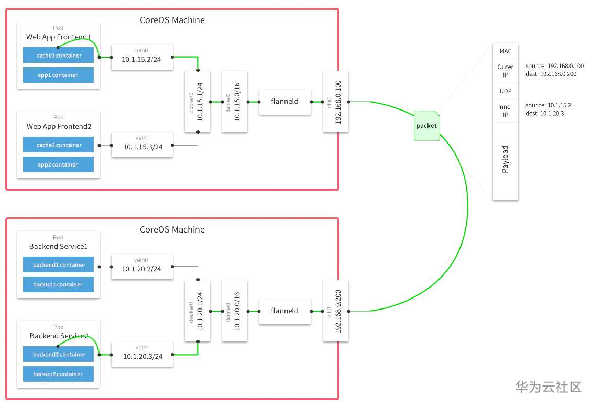

### 1. 原理简介

Flannel 是 CoreOS 团队针对 Kubernetes 设计的一个网络规划实现。简单来说，它的功能有以下几点：

1、使集群中的不同 Node 主机创建的 Docker 容器都具有全集群唯一的虚拟 IP 地址；

2、建立一个覆盖网络（overlay network），这个覆盖网络会将数据包原封不动的传递到目标容器中。覆盖网络是建立在另一个网络之上并由其基础设施支持的虚拟网络。覆盖网络通过将一个分组封装在另一个分组内来将网络服务与底层基础设施分离。在将封装的数据包转发到端点后，将其解封装；

3、创建一个新的虚拟网卡 flannel0 接收 docker 网桥的数据，通过维护路由表，对接收到的数据进行封包和转发（VXLAN）；

4、路由信息一般存放到 etcd 中：多个 Node 上的 Flanneld 依赖一个 etcd cluster 来做集中配置服务，etcd 保证了所有 Node 上 Flannel 所看到的配置是一致的。同时每个 Node 上的 Flannel 都可以监听 etcd 上的数据变化，实时感知集群中 Node 的变化；

5、Flannel 首先会在 Node 上创建一个名为 flannel0 的网桥（VXLAN 类型的设备），并且在每个 Node 上运行一个名为 Flanneld 的代理。每个 Node 上的 Flannel 代理会从 etcd 上为当前 Node 申请一个 CIDR 地址块用来给该 Node 上的 Pod 分配地址；

6、Flannel 致力于给 Kubernetes 集群中的 Node 提供一个三层网络，它并不控制 Node 中的容器是如何进行组网的，仅仅关心流量如何在 Node 之间流转。

### 2. 源码分析

待补充