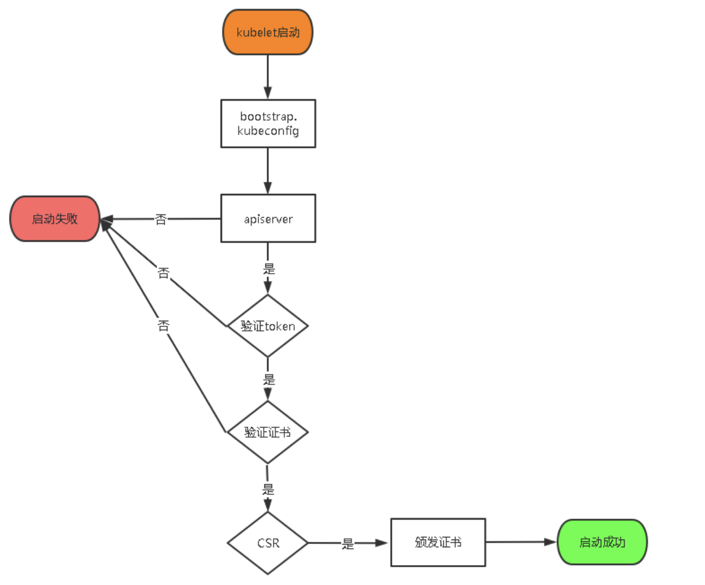

Table of Contents
=================

  * [1. 集群规划](#1-集群规划)
  * [2.准备工作](#2准备工作)
     * [2.1 修改主机名](#21-修改主机名)
     * [2.1 关闭 SElinux 和防火墙](#21-关闭-selinux-和防火墙)
     * [2.3 同步机器时间](#23-同步机器时间)
  * [3. etcd集群部署](#3-etcd集群部署)
     * [2.1 etcd部署前的准备工作](#21-etcd部署前的准备工作)
        * [2.1.1 准备cfssl证书生成工具](#211-准备cfssl证书生成工具)
        * [2.1.2 自签证书颁发机构（CA）](#212-自签证书颁发机构ca)
        * [2.1.3 使用自签CA签发Etcd HTTPS证书](#213-使用自签ca签发etcd-https证书)
     * [2.2 下载etcd](#22-下载etcd)
     * [2.3 安装etcd](#23-安装etcd)
  * [3. node和master 安装docker](#3-node和master-安装docker)
  * [4. 部署kmaster组件](#4-部署kmaster组件)
     * [4.1 部署kube-apiserver](#41-部署kube-apiserver)
        * [4.1.1 生成kube-apiserver证书](#411-生成kube-apiserver证书)
        * [4.2.1 确定二进制文件和配置文件路径](#421-确定二进制文件和配置文件路径)
        * [4.2.2 启用 TLS Bootstrapping 机制](#422-启用-tls-bootstrapping-机制)
        * [4.2.3 systemd管理apiserver](#423-systemd管理apiserver)
        * [4.2.4 授权kubelet-bootstrap用户允许请求证书](#424-授权kubelet-bootstrap用户允许请求证书)
     * [4.2 部署kube-controller-manager](#42-部署kube-controller-manager)
        * [4.2.1 创建配置文件](#421-创建配置文件)
        * [4.2.2 systemd管理controller-manager](#422-systemd管理controller-manager)
     * [4.3 部署kube-scheduler](#43-部署kube-scheduler)
        * [4.3.1 创建配置文件](#431-创建配置文件)
        * [4.3.2 systemd管理scheduler](#432-systemd管理scheduler)
        * [4.3.3 启动并设置开机启动](#433-启动并设置开机启动)
        * [4.3.4 查看集群状态](#434-查看集群状态)
  * [5.部署dnode节点](#5部署dnode节点)
     * [5.1 文件和目录准备](#51-文件和目录准备)
     * [5.2 部署kubelet](#52-部署kubelet)
        * [5.2.1. 创建配置文件](#521-创建配置文件)
        * [5.2.2 配置参数文件](#522-配置参数文件)
        * [5.2.3 生成bootstrap.kubeconfig文件](#523-生成bootstrapkubeconfig文件)
        * [5.2.4 systemd管理kubelet](#524-systemd管理kubelet)
        * [5.2.5 批准kubelet证书申请并加入集群](#525-批准kubelet证书申请并加入集群)
     * [5.3 部署kube-proxy](#53-部署kube-proxy)
        * [5.3.1 创建配置文件](#531-创建配置文件)
        * [5.3.2 配置参数文件](#532-配置参数文件)
        * [5.3.3. 生成kube-proxy.kubeconfig文件](#533-生成kube-proxykubeconfig文件)
        * [5.3.4. systemd管理kube-proxy](#534-systemd管理kube-proxy)
     * [5.4 部署网络环境](#54-部署网络环境)
     * [5.5  授权apiserver访问kubelet](#55--授权apiserver访问kubelet)
  * [6 新增加Node](#6-新增加node)
        * [6.1. 拷贝已部署好的Node相关文件到新节点](#61-拷贝已部署好的node相关文件到新节点)
        * [6.2 删除kubelet证书和kubeconfig文件](#62-删除kubelet证书和kubeconfig文件)
        * [6.3. 修改主机名](#63-修改主机名)
        * [6.4. 启动并设置开机启动](#64-启动并设置开机启动)
        * [6.5. 在Master上批准新Node kubelet证书申请](#65-在master上批准新node-kubelet证书申请)
        * [6.6. 查看Node状态](#66-查看node状态)
  * [7.可能遇到的坑](#7可能遇到的坑)

### 1. 集群规划

这里使用了百度云的两条主机作为集群搭建。配置如下：

两台机器都是：2核，4GB，40GB， 1M   计算型C3

| 主机1       | 主机2           |
| ----------- | --------------- |
| 192.168.0.4 | kmaster & dnode |
| 192.168.0.5 | dnode           |


其中etcd集群：部署在 192.168.0.4,192.168.0.5中

192.168.0.4 节点又当kmaster又当dnode
192.168.0.5 节点又当dnode

### 2.准备工作
#### 2.1 修改主机名
默认的云机器名都是一个字符串，这里我进行了修改
（1） 在192.168.0.4 使用如下的命令，将主机名修改为 k8s-master
```
hostname k8s-master
```
（2）在192.168.0.5 使用如下的命令，将主机名修改为 k8s-node
```
hostname k8s-node
```

#### 2.1 关闭 SElinux 和防火墙

debian 可能下面的配置，没有就跳过

```
[root@k8s-master ~]# cat /etc/selinux/config 

# This file controls the state of SELinux on the system.
# SELINUX= can take one of these three values:
#     disabled - SELinux security policy is enforced.
#     permissive - SELinux prints warnings instead of disabled.
#     disabled - No SELinux policy is loaded.
SELINUX=disabled
# SELINUXTYPE= can take one of three values:
#     targeted - Targeted processes are protected,
#     minimum - Modification of targeted policy. Only selected processes are protected. 
#     mls - Multi Level Security protection.
SELINUXTYPE=targeted


[root@k8s-master ~]# 
[root@k8s-master ~]# systemctl stop firewalld
```

#### 2.3 同步机器时间

一般云主机时间都是对的，像虚拟机一般都要同步一下时间

```
ntpdate time.windows.com

```

<br>

### 3. etcd集群部署

#### 2.1 etcd部署前的准备工作

##### 2.1.1 准备cfssl证书生成工具

cfssl是一个开源的证书管理工具，使用json文件生成证书，相比openssl更方便使用。

找任意一台服务器操作，这里用Master节点。

```
wget https://pkg.cfssl.org/R1.2/cfssl_linux-amd64
wget https://pkg.cfssl.org/R1.2/cfssljson_linux-amd64
wget https://pkg.cfssl.org/R1.2/cfssl-certinfo_linux-amd64
chmod +x cfssl_linux-amd64 cfssljson_linux-amd64 cfssl-certinfo_linux-amd64
mv cfssl_linux-amd64 /usr/local/bin/cfssl
mv cfssljson_linux-amd64 /usr/local/bin/cfssljson
mv cfssl-certinfo_linux-amd64 /usr/bin/cfssl-certinfo
```

##### 2.1.2 自签证书颁发机构（CA）
（1） 创建工作目录：
```
mkdir -p ~/TLS/{etcd,k8s}

cd TLS/etcd
```

(2) 自签CA：

```
cat > ca-config.json << EOF
{
  "signing": {
    "default": {
      "expiry": "87600h"
    },
    "profiles": {
      "www": {
         "expiry": "87600h",
         "usages": [
            "signing",
            "key encipherment",
            "server auth",
            "client auth"
        ]
      }
    }
  }
}
EOF

cat > ca-csr.json << EOF
{
    "CN": "etcd CA",
    "key": {
        "algo": "rsa",
        "size": 2048
    },
    "names": [
        {
            "C": "CN",
            "L": "Beijing",
            "ST": "Beijing"
        }
    ]
}
EOF
```

(3) 生成证书：

```
cfssl gencert -initca ca-csr.json | cfssljson -bare ca -
```

查看是否成功，只要有ca-key.pem ca.pem就是成功了
```
ls *pem
ca-key.pem  ca.pem
```

##### 2.1.3 使用自签CA签发Etcd HTTPS证书

（1）创建证书申请文件：

```
cat > server-csr.json << EOF
{
    "CN": "etcd",
    "hosts": [
    "192.168.0.4",
    "192.168.0.5"
    ],
    "key": {
        "algo": "rsa",
        "size": 2048
    },
    "names": [
        {
            "C": "CN",
            "L": "BeiJing",
            "ST": "BeiJing"
        }
    ]
}
EOF
```
上述文件hosts字段中IP为所有etcd节点的集群内部通信IP，一个都不能少！为了方便后期扩容可以多写几个预留的IP。

（2）生成证书：

```
cfssl gencert -ca=ca.pem -ca-key=ca-key.pem -config=ca-config.json -profile=www server-csr.json | cfssljson -bare server
```
查看是否成功，只要有server-key.pem server.pem就是成功了
```
ls server*pem
server-key.pem  server.pem
```

#### 2.2 下载etcd

不同的k8s版本对应不同的etcd版本，这个可以在官网的changelog里面看到。这里下载的是3.4.3版本

下载地址：https://github.com/etcd-io/etcd/releases

#### 2.3 安装etcd


（1）确定二进制文件和配置文件路径

/opt/etcd/bin 是存放二进制文件的，主要是 ectd, etcdctl

/opt/etcd/cfg 是存放etcd 配置的

/opt/etcd/ssl 是存放ectd 证书的


```
root@k8s-master:~# mkdir /opt/etcd/{bin,cfg,ssl} -p

[root@k8s-master ]# cd /opt/etcd/
[root@k8s-master etcd]# ls
bin  cfg  ssl

// bin目录
tar zxvf etcd-v3.4.3-linux-amd64.tar.gz
cp etcd etcdctl /opt/etcd/bin/

[root@k8s-master bin]# ls
etcd  etcdctl


// ssl目录  这里的证书就是，上面第二步生成的etcd证书
cp ~/TLS/etcd/ca*pem ~/TLS/etcd/server*pem /opt/etcd/ssl/


[root@k8s-master etcd-cert]# cd /opt/etcd/ssl/
[root@k8s-master ssl]# ls
ca-key.pem  ca.pem  server-key.pem  server.pem


// config目录
etcd会监听俩个接口，2380是集群之间进行通信的，2379是数据接口，get,put等数据的接口

cat > /opt/etcd/cfg/etcd.conf << EOF
#[Member]
ETCD_NAME="etcd01"
ETCD_DATA_DIR="/var/lib/etcd/default.etcd"
ETCD_LISTEN_PEER_URLS="https://192.168.0.4:2380"
ETCD_LISTEN_CLIENT_URLS="https://192.168.0.4:2379"

#[Clustering]
ETCD_INITIAL_ADVERTISE_PEER_URLS="https://192.168.0.4:2380"
ETCD_ADVERTISE_CLIENT_URLS="https://192.168.0.4:2379"
ETCD_INITIAL_CLUSTER="etcd01=https://192.168.0.4:2380,etcd02=https://192.168.0.5:2380"
ETCD_INITIAL_CLUSTER_TOKEN="etcd-cluster"
ETCD_INITIAL_CLUSTER_STATE="new"
EOF

ETCD_NAME：节点名称，集群中唯一
ETCD_DATA_DIR：数据目录
ETCD_LISTEN_PEER_URLS：集群通信监听地址
ETCD_LISTEN_CLIENT_URLS：客户端访问监听地址
ETCD_INITIAL_ADVERTISE_PEER_URLS：集群通告地址
ETCD_ADVERTISE_CLIENT_URLS：客户端通告地址
ETCD_INITIAL_CLUSTER：集群节点地址
ETCD_INITIAL_CLUSTER_TOKEN：集群Token
ETCD_INITIAL_CLUSTER_STATE：加入集群的当前状态，new是新集群，existing表示加入已有集群

```

(2) systemd管理etcd
```
cat > /usr/lib/systemd/system/etcd.service << EOF
[Unit]
Description=Etcd Server
After=network.target
After=network-online.target
Wants=network-online.target

[Service]
Type=notify
EnvironmentFile=/opt/etcd/cfg/etcd.conf
ExecStart=/opt/etcd/bin/etcd \
--cert-file=/opt/etcd/ssl/server.pem \
--key-file=/opt/etcd/ssl/server-key.pem \
--peer-cert-file=/opt/etcd/ssl/server.pem \
--peer-key-file=/opt/etcd/ssl/server-key.pem \
--trusted-ca-file=/opt/etcd/ssl/ca.pem \
--peer-trusted-ca-file=/opt/etcd/ssl/ca.pem \
--logger=zap
Restart=on-failure
LimitNOFILE=65536

[Install]
WantedBy=multi-user.target
EOF
```

(3) 启动并设置开机启动
```
systemctl daemon-reload
systemctl start etcd
systemctl enable etcd
```

第一次启动都是会失败的，因为第二个节点还没有启动etcd
查看关于etcd 服务最后40行日志, 有时候还可以通过：，tail -f /var/log/message 查看哪里出现了问题。
```
journalctl -n 40 -u etcd
```


(4) 在其他节点上启动etcd服务

```
1. 将master的相关配置复制到node节点
scp -r /opt/etcd/ root@192.168.0.5:/opt/

scp /usr/lib/systemd/system/etcd.service root@192.168.0.5:/usr/lib/systemd/system/

2. 在node修改不一致的地方
root@k8s-dnode:~# cat /opt/etcd/cfg/etcd.conf 
#[Member]
ETCD_NAME="etcd02"   
ETCD_DATA_DIR="/var/lib/etcd/default.etcd"
ETCD_LISTEN_PEER_URLS="https://192.168.0.5:2380"
ETCD_LISTEN_CLIENT_URLS="https://192.168.0.5:2379"

#[Clustering]
ETCD_INITIAL_ADVERTISE_PEER_URLS="https://192.168.0.5:2380"
ETCD_ADVERTISE_CLIENT_URLS="https://192.168.0.5:2379"
ETCD_INITIAL_CLUSTER="etcd01=https://192.168.0.4:2380,etcd02=https://192.168.0.5:2380"
ETCD_INITIAL_CLUSTER_TOKEN="etcd-cluster"
ETCD_INITIAL_CLUSTER_STATE="new"

3.设置开机启动
systemctl daemon-reload
systemctl start etcd
systemctl enable etcd
```

（5）检查etcd集群是否正常运行
```
root@k8s-master:/usr/lib/systemd/system# systemctl enable etcd
Created symlink /etc/systemd/system/multi-user.target.wants/etcd.service → /lib/systemd/system/etcd.service.
root@k8s-master:/usr/lib/systemd/system# 
root@k8s-master:/usr/lib/systemd/system# 
root@k8s-master:/usr/lib/systemd/system# systemctl status etcd
● etcd.service - Etcd Server
   Loaded: loaded (/lib/systemd/system/etcd.service; enabled; vendor preset: enabled)
   Active: active (running) since Sat 2021-10-23 15:58:02 CST; 20s ago
 Main PID: 3728 (etcd)
    Tasks: 10 (limit: 4700)
   Memory: 23.8M
   CGroup: /system.slice/etcd.service
           └─3728 /opt/etcd/bin/etcd --cert-file=/opt/etcd/ssl/server.pem --key-file=/opt/etcd/ssl/server-key.pem --peer-cert-file=/opt/etcd/ssl/server.pem --peer-key-file=/opt/etc

Oct 23 15:58:02 k8s-master etcd[3728]: {"level":"info","ts":"2021-10-23T15:58:02.698+0800","caller":"raft/raft.go:765","msg":"5ac283d796e472ba became leader at term 579"}
Oct 23 15:58:02 k8s-master etcd[3728]: {"level":"info","ts":"2021-10-23T15:58:02.698+0800","caller":"raft/node.go:325","msg":"raft.node: 5ac283d796e472ba elected leader 5ac283d796e
Oct 23 15:58:02 k8s-master etcd[3728]: {"level":"warn","ts":"2021-10-23T15:58:02.703+0800","caller":"etcdserver/server.go:2045","msg":"failed to publish local member to cluster thr
Oct 23 15:58:02 k8s-master etcd[3728]: {"level":"info","ts":"2021-10-23T15:58:02.707+0800","caller":"etcdserver/server.go:2016","msg":"published local member to cluster through raf
Oct 23 15:58:02 k8s-master etcd[3728]: {"level":"info","ts":"2021-10-23T15:58:02.709+0800","caller":"embed/serve.go:191","msg":"serving client traffic securely","address":"192.168.
Oct 23 15:58:02 k8s-master systemd[1]: Started Etcd Server.
Oct 23 15:58:02 k8s-master etcd[3728]: {"level":"info","ts":"2021-10-23T15:58:02.719+0800","caller":"etcdserver/server.go:2501","msg":"setting up initial cluster version","cluster-
Oct 23 15:58:02 k8s-master etcd[3728]: {"level":"info","ts":"2021-10-23T15:58:02.722+0800","caller":"membership/cluster.go:558","msg":"set initial cluster version","cluster-id":"a8
Oct 23 15:58:02 k8s-master etcd[3728]: {"level":"info","ts":"2021-10-23T15:58:02.722+0800","caller":"api/capability.go:76","msg":"enabled capabilities for version","cluster-version
Oct 23 15:58:02 k8s-master etcd[3728]: {"level":"info","ts":"2021-10-23T15:58:02.722+0800","caller":"etcdserver/server.go:2533","msg":"cluster version is updated","cluster-version"
root@k8s-master:/usr/lib/systemd/system#


查看集群健康状态
root@k8s-master:/usr/lib/systemd/system# ETCDCTL_API=3 /opt/etcd/bin/etcdctl --cacert=/opt/etcd/ssl/ca.pem --cert=/opt/etcd/ssl/server.pem --key=/opt/etcd/ssl/server-key.pem --endpoints="https://192.168.0.4:2379,https://192.168.0.5:2379" endpoint health
https://192.168.0.4:2379 is healthy: successfully committed proposal: took = 12.092244ms
https://192.168.0.5:2379 is healthy: successfully committed proposal: took = 12.96782m

```


<br>

### 3. node和master 安装docker

这里我master节点也想使用docker,所以在每个节点都安装了。

具体步骤如下：
（1）下载二进制
下载地址：https://download.docker.com/linux/static/stable/x86_64/docker-19.03.9.tgz

（2）解压二进制包
```
tar zxvf docker-19.03.9.tgz
mv docker/* /usr/bin
```
(3) systemd管理docker
```
cat > /usr/lib/systemd/system/docker.service << EOF
[Unit]
Description=Docker Application Container Engine
Documentation=https://docs.docker.com
After=network-online.target firewalld.service
Wants=network-online.target

[Service]
Type=notify
ExecStart=/usr/bin/dockerd
ExecReload=/bin/kill -s HUP $MAINPID
LimitNOFILE=infinity
LimitNPROC=infinity
LimitCORE=infinity
TimeoutStartSec=0
Delegate=yes
KillMode=process
Restart=on-failure
StartLimitBurst=3
StartLimitInterval=60s

[Install]
WantedBy=multi-user.target
EOF
```
(4) 创建配置文件

registry-mirrors 阿里云镜像加速器
```
mkdir /etc/docker
cat > /etc/docker/daemon.json << EOF
{
  "registry-mirrors": ["https://b9pmyelo.mirror.aliyuncs.com"]
}
EOF
```
(5) 启动并设置开机启动
```
systemctl daemon-reload
systemctl start docker
systemctl enable docker
```


<br>

### 4. 部署kmaster组件
#### 4.1 部署kube-apiserver

##### 4.1.1 生成kube-apiserver证书

(1) 自签证书颁发机构（CA）

在 ~/TLS/k8s目录下生成

```
cat > ca-config.json << EOF
{
  "signing": {
    "default": {
      "expiry": "87600h"
    },
    "profiles": {
      "kubernetes": {
         "expiry": "87600h",
         "usages": [
            "signing",
            "key encipherment",
            "server auth",
            "client auth"
        ]
      }
    }
  }
}
EOF
cat > ca-csr.json << EOF
{
    "CN": "kubernetes",
    "key": {
        "algo": "rsa",
        "size": 2048
    },
    "names": [
        {
            "C": "CN",
            "L": "Beijing",
            "ST": "Beijing",
            "O": "k8s",
            "OU": "System"
        }
    ]
}
EOF
```

(2) 生成ca证书：
```
root@k8s-master:~/TLS/k8s# cfssl gencert -initca ca-csr.json | cfssljson -bare ca -
2021/10/23 16:27:02 [INFO] generating a new CA key and certificate from CSR
2021/10/23 16:27:02 [INFO] generate received request
2021/10/23 16:27:02 [INFO] received CSR
2021/10/23 16:27:02 [INFO] generating key: rsa-2048
2021/10/23 16:27:02 [INFO] encoded CSR
2021/10/23 16:27:02 [INFO] signed certificate with serial number 691553883019556193564185774219449501300204309030
root@k8s-master:~/TLS/k8s# ls *pem
ca-key.pem  ca.pem
```

(3) 使用自签CA签发kube-apiserver HTTPS证书
```
cat > server-csr.json << EOF
{
    "CN": "kubernetes",
    "hosts": [
      "10.0.0.1",
      "127.0.0.1",
      "192.168.0.4",
      "192.168.0.5",
      "kubernetes",
      "kubernetes.default",
      "kubernetes.default.svc",
      "kubernetes.default.svc.cluster",
      "kubernetes.default.svc.cluster.local"
    ],
    "key": {
        "algo": "rsa",
        "size": 2048
    },
    "names": [
        {
            "C": "CN",
            "L": "BeiJing",
            "ST": "BeiJing",
            "O": "k8s",
            "OU": "System"
        }
    ]
}
EOF
```

注：上述文件hosts字段中IP为所有Master/LB/VIP IP，一个都不能少！为了方便后期扩容可以多写几个预留的IP。

(4) 生成证书：
```
root@k8s-master:~/TLS/k8s# cfssl gencert -ca=ca.pem -ca-key=ca-key.pem -config=ca-config.json -profile=kubernetes server-csr.json | cfssljson -bare server
2021/10/23 16:30:16 [INFO] generate received request
2021/10/23 16:30:16 [INFO] received CSR
2021/10/23 16:30:16 [INFO] generating key: rsa-2048
2021/10/23 16:30:16 [INFO] encoded CSR
2021/10/23 16:30:16 [INFO] signed certificate with serial number 85202347845231770518313014605424297876620496751
2021/10/23 16:30:16 [WARNING] This certificate lacks a "hosts" field. This makes it unsuitable for
websites. For more information see the Baseline Requirements for the Issuance and Management
of Publicly-Trusted Certificates, v.1.1.6, from the CA/Browser Forum (https://cabforum.org);
specifically, section 10.2.3 ("Information Requirements").
root@k8s-master:~/TLS/k8s# ls server*pem
server-key.pem  server.pem
```

##### 4.2.1 确定二进制文件和配置文件路径
(1) 从Github下载二进制文件

下载地址： https://github.com/kubernetes/kubernetes/blob/master/CHANGELOG/CHANGELOG-1.17.md

注：打开链接你会发现里面有很多包，下载一个server包就够了，包含了Master和Worker Node二进制文件


（2）bin目录
```
mkdir -p /opt/kubernetes/{bin,cfg,ssl,logs} 
tar zxvf kubernetes-server-linux-amd64.tar.gz
cd kubernetes/server/bin
cp kube-apiserver kube-scheduler kube-controller-manager /opt/kubernetes/bin
cp kubectl /usr/bin/
```


（3）cfg目录
```
cat > /opt/kubernetes/cfg/kube-apiserver.conf << EOF
KUBE_APISERVER_OPTS="--logtostderr=false \\
--v=4 \\
--log-dir=/opt/kubernetes/logs \\
--etcd-servers=https://192.168.0.4:2379,https://192.168.0.4:2379 \\
--bind-address=192.168.0.4 \\
--secure-port=6443 \\
--advertise-address=192.168.0.4 \\
--allow-privileged=true \\
--service-cluster-ip-range=10.0.0.0/24 \\
--enable-admission-plugins=NamespaceLifecycle,LimitRanger,ServiceAccount,ResourceQuota,NodeRestriction \\
--authorization-mode=RBAC,Node \\
--enable-bootstrap-token-auth=true \\
--token-auth-file=/opt/kubernetes/cfg/token.csv \\
--service-node-port-range=30000-32767 \\
--kubelet-client-certificate=/opt/kubernetes/ssl/server.pem \\
--kubelet-client-key=/opt/kubernetes/ssl/server-key.pem \\
--tls-cert-file=/opt/kubernetes/ssl/server.pem  \\
--tls-private-key-file=/opt/kubernetes/ssl/server-key.pem \\
--client-ca-file=/opt/kubernetes/ssl/ca.pem \\
--service-account-key-file=/opt/kubernetes/ssl/ca-key.pem \\
--etcd-cafile=/opt/etcd/ssl/ca.pem \\
--etcd-certfile=/opt/etcd/ssl/server.pem \\
--etcd-keyfile=/opt/etcd/ssl/server-key.pem \\
--audit-log-maxage=30 \\
--audit-log-maxbackup=3 \\
--audit-log-maxsize=100 \\
--audit-log-path=/opt/kubernetes/logs/k8s-audit.log"
EOF
```

注：上面两个\ \ 第一个是转义符，第二个是换行符，使用转义符是为了使用EOF保留换行符。

–logtostderr：启用日志

—v：日志等级

–log-dir：日志目录

–etcd-servers：etcd集群地址

–bind-address：监听地址

–secure-port：https安全端口

–advertise-address：集群通告地址

–allow-privileged：启用授权

–service-cluster-ip-range：Service虚拟IP地址段

–enable-admission-plugins：准入控制模块

–authorization-mode：认证授权，启用RBAC授权和节点自管理

–enable-bootstrap-token-auth：启用TLS bootstrap机制

–token-auth-file：bootstrap token文件

–service-node-port-range：Service nodeport类型默认分配端口范围

–kubelet-client-xxx：apiserver访问kubelet客户端证书

–tls-xxx-file：apiserver https证书

–etcd-xxxfile：连接Etcd集群证书

–audit-log-xxx：审计日志

（4）ssl目录

把刚才生成的证书拷贝到配置文件中的路径：
```
cp ~/TLS/k8s/ca*pem ~/TLS/k8s/server*pem /opt/kubernetes/ssl/

```

##### 4.2.2 启用 TLS Bootstrapping 机制
TLS Bootstraping：Master apiserver启用TLS认证后，Node节点kubelet和kube-proxy要与kube-apiserver进行通信，必须使用CA签发的有效证书才可以，当Node节点很多时，这种客户端证书颁发需要大量工作，同样也会增加集群扩展复杂度。为了简化流程，Kubernetes引入了TLS bootstraping机制来自动颁发客户端证书，kubelet会以一个低权限用户自动向apiserver申请证书，kubelet的证书由apiserver动态签署。所以强烈建议在Node上使用这种方式，目前主要用于kubelet，kube-proxy还是由我们统一颁发一个证书。

TLS bootstraping 工作流程：



创建上述配置文件中token文件：

```
cat > /opt/kubernetes/cfg/token.csv << EOF
c47ffb939f5ca36231d9e3121a252940,kubelet-bootstrap,10001,"system:node-bootstrapper"
EOF
```
格式：token，用户名，UID，用户组

token也可用这个命令自行生成替换：
```
head -c 16 /dev/urandom | od -An -t x | tr -d ' '
```

##### 4.2.3 systemd管理apiserver
```
cat > /usr/lib/systemd/system/kube-apiserver.service << EOF
[Unit]
Description=Kubernetes API Server
Documentation=https://github.com/kubernetes/kubernetes

[Service]
EnvironmentFile=/opt/kubernetes/cfg/kube-apiserver.conf
ExecStart=/opt/kubernetes/bin/kube-apiserver \$KUBE_APISERVER_OPTS
Restart=on-failure

[Install]
WantedBy=multi-user.target
EOF
```

systemctl daemon-reload
systemctl start kube-apiserver
systemctl enable kube-apiserver

这个时候用 systemclt status kube-apiserver 是running的。
并且kubectl get svc有输出的
```
root@k8s-master:~/kubernetes/server/bin# kubectl get svc
NAME         TYPE        CLUSTER-IP   EXTERNAL-IP   PORT(S)   AGE
kubernetes   ClusterIP   10.0.0.1     <none>        443/TCP   44s
```

##### 4.2.4 授权kubelet-bootstrap用户允许请求证书
```
kubectl create clusterrolebinding kubelet-bootstrap --clusterrole=system:node-bootstrapper --user=kubelet-bootstrap
```

#### 4.2 部署kube-controller-manager

##### 4.2.1 创建配置文件
```
cat > /opt/kubernetes/cfg/kube-controller-manager.conf << EOF
KUBE_CONTROLLER_MANAGER_OPTS="--logtostderr=false \\
--v=4 \\
--log-dir=/opt/kubernetes/logs \\
--leader-elect=true \\
--master=127.0.0.1:8080 \\
--bind-address=127.0.0.1 \\
--allocate-node-cidrs=true \\
--cluster-cidr=10.244.0.0/16 \\
--service-cluster-ip-range=10.0.0.0/24 \\
--cluster-signing-cert-file=/opt/kubernetes/ssl/ca.pem \\
--cluster-signing-key-file=/opt/kubernetes/ssl/ca-key.pem  \\
--root-ca-file=/opt/kubernetes/ssl/ca.pem \\
--service-account-private-key-file=/opt/kubernetes/ssl/ca-key.pem \\
--experimental-cluster-signing-duration=87600h0m0s"
EOF
```
–master：通过本地非安全本地端口8080连接apiserver。

–leader-elect：当该组件启动多个时，自动选举（HA）

–cluster-signing-cert-file/–cluster-signing-key-file：自动为kubelet颁发证书的CA，与apiserver保持一致

##### 4.2.2 systemd管理controller-manager
```
cat > /usr/lib/systemd/system/kube-controller-manager.service << EOF
[Unit]
Description=Kubernetes Controller Manager
Documentation=https://github.com/kubernetes/kubernetes

[Service]
EnvironmentFile=/opt/kubernetes/cfg/kube-controller-manager.conf
ExecStart=/opt/kubernetes/bin/kube-controller-manager \$KUBE_CONTROLLER_MANAGER_OPTS
Restart=on-failure

[Install]
WantedBy=multi-user.target
EOF
```

systemctl daemon-reload
systemctl start kube-controller-manager
systemctl enable kube-controller-manager

这个时候kcm状态是running的
```
root@k8s-master:/opt/kubernetes/cfg# systemctl status kube-controller-manager
● kube-controller-manager.service - Kubernetes Controller Manager
   Loaded: loaded (/lib/systemd/system/kube-controller-manager.service; enabled; vendor preset: enabled)
   Active: active (running) since Sat 2021-10-23 17:03:50 CST; 22s ago
     Docs: https://github.com/kubernetes/kubernetes
 Main PID: 4957 (kube-controller)
    Tasks: 9 (limit: 4700)
   Memory: 29.0M
   CGroup: /system.slice/kube-controller-manager.service
           └─4957 /opt/kubernetes/bin/kube-controller-manager --logtostderr=false --v=4 --log-dir=/opt/kubernetes/logs --leader-elect=true --master=127.0.0.1:8080 --bind-address=12

Oct 23 17:03:50 k8s-master systemd[1]: Started Kubernetes Controller Manager.
Oct 23 17:03:52 k8s-master kube-controller-manager[4957]: E1023 17:03:52.290939    4957 core.go:91] Failed to start service controller: WARNING: no cloud provider provided, service
Oct 23 17:03:52 k8s-master kube-controller-manager[4957]: E1023 17:03:52.545623    4957 core.go:232] failed to start cloud node lifecycle controller: no cloud provider provided
Oct 23 17:04:02 k8s-master kube-controller-manager[4957]: E1023 17:04:02.670438    4957 clusterroleaggregation_controller.go:180] admin failed with : Operation cannot be fulfilled 
Oct 23 17:04:02 k8s-master kube-controller-manager[4957]: E1023 17:04:02.683306    4957 clusterroleaggregation_controller.go:180] admin failed with : Operation cannot be fulfilled 
root@k8s-master:/opt/kubernetes/cfg# 
```

#### 4.3 部署kube-scheduler

##### 4.3.1 创建配置文件
```
cat > /opt/kubernetes/cfg/kube-scheduler.conf << EOF
KUBE_SCHEDULER_OPTS="--logtostderr=false \
--v=4 \
--log-dir=/opt/kubernetes/logs \
--leader-elect \
--master=127.0.0.1:8080 \
--bind-address=127.0.0.1"
EOF
```

–master：通过本地非安全本地端口8080连接apiserver。

–leader-elect：当该组件启动多个时，自动选举（HA）

##### 4.3.2 systemd管理scheduler
```
cat > /usr/lib/systemd/system/kube-scheduler.service << EOF
[Unit]
Description=Kubernetes Scheduler
Documentation=https://github.com/kubernetes/kubernetes

[Service]
EnvironmentFile=/opt/kubernetes/cfg/kube-scheduler.conf
ExecStart=/opt/kubernetes/bin/kube-scheduler \$KUBE_SCHEDULER_OPTS
Restart=on-failure

[Install]
WantedBy=multi-user.target
EOF
```
##### 4.3.3 启动并设置开机启动
systemctl daemon-reload
systemctl start kube-scheduler
systemctl enable kube-scheduler

##### 4.3.4 查看集群状态
如下输出说明Master节点组件运行正常。


```
root@k8s-master:/opt/kubernetes/cfg# kubectl get cs
NAME                 STATUS    MESSAGE             ERROR
scheduler            Healthy   ok                  
controller-manager   Healthy   ok                  
etcd-0               Healthy   {"health":"true"} 
```


### 5.部署dnode节点

#### 5.1 文件和目录准备

下面还是在Master Node上操作，即同时也作为Node

**master节点：**

从master节点拷贝：

cd kubernetes/server/bin
cp kubelet kube-proxy /opt/kubernetes/bin   # 本地拷贝

**node节点**

在所有worker node创建工作目录：

mkdir -p /opt/kubernetes/{bin,cfg,ssl,logs} 

从master节点拷贝：
scp -r /root/kubernetes/server/bin/ root@192.168.0.5:/root/kubernetes/server/bin
cd kubernetes/server/bin
cp kubelet kube-proxy /opt/kubernetes/bin   # 本地拷贝

#### 5.2 部署kubelet

##### 5.2.1. 创建配置文件
```
cat > /opt/kubernetes/cfg/kubelet.conf << EOF
KUBELET_OPTS="--logtostderr=false \\
--v=4 \\
--log-dir=/opt/kubernetes/logs \\
--hostname-override=k8s-master \\
--network-plugin=cni \\
--kubeconfig=/opt/kubernetes/cfg/kubelet.kubeconfig \\
--bootstrap-kubeconfig=/opt/kubernetes/cfg/bootstrap.kubeconfig \\
--config=/opt/kubernetes/cfg/kubelet-config.yml \\
--cert-dir=/opt/kubernetes/ssl \\
--pod-infra-container-image=lizhenliang/pause-amd64:3.0"
EOF
```

–hostname-override：显示名称，集群中唯一

–network-plugin：启用CNI

–kubeconfig：空路径，会自动生成，后面用于连接apiserver

–bootstrap-kubeconfig：首次启动向apiserver申请证书

–config：配置参数文件

–cert-dir：kubelet证书生成目录

–pod-infra-container-image：管理Pod网络容器的镜像


##### 5.2.2 配置参数文件
```
cat > /opt/kubernetes/cfg/kubelet-config.yml << EOF
kind: KubeletConfiguration
apiVersion: kubelet.config.k8s.io/v1beta1
address: 0.0.0.0
port: 10250
readOnlyPort: 10255
cgroupDriver: cgroupfs
clusterDNS:
- 10.0.0.2
clusterDomain: cluster.local 
failSwapOn: false
authentication:
  anonymous:
    enabled: false
  webhook:
    cacheTTL: 2m0s
    enabled: true
  x509:
    clientCAFile: /opt/kubernetes/ssl/ca.pem 
authorization:
  mode: Webhook
  webhook:
    cacheAuthorizedTTL: 5m0s
    cacheUnauthorizedTTL: 30s
evictionHard:
  imagefs.available: 15%
  memory.available: 100Mi
  nodefs.available: 10%
  nodefs.inodesFree: 5%
maxOpenFiles: 1000000
maxPods: 110
EOF
```

##### 5.2.3 生成bootstrap.kubeconfig文件
```
KUBE_APISERVER="https://192.168.0.4:6443" # apiserver IP:PORT
TOKEN="c47ffb939f5ca36231d9e3121a252940" # 与token.csv里保持一致
cd /opt/kubernetes/cfg/


# 生成 kubelet bootstrap kubeconfig 配置文件
kubectl config set-cluster kubernetes --certificate-authority=/opt/kubernetes/ssl/ca.pem --embed-certs=true --server=${KUBE_APISERVER} --kubeconfig=bootstrap.kubeconfig

kubectl config set-credentials "kubelet-bootstrap" --token=${TOKEN}  --kubeconfig=bootstrap.kubeconfig
kubectl config set-context default --cluster=kubernetes --user="kubelet-bootstrap" --kubeconfig=bootstrap.kubeconfig
kubectl config use-context default --kubeconfig=bootstrap.kubeconfig
```

##### 5.2.4 systemd管理kubelet
```
cat > /usr/lib/systemd/system/kubelet.service << EOF
[Unit]
Description=Kubernetes Kubelet
After=docker.service

[Service]
EnvironmentFile=/opt/kubernetes/cfg/kubelet.conf
ExecStart=/opt/kubernetes/bin/kubelet \$KUBELET_OPTS
Restart=on-failure
LimitNOFILE=65536

[Install]
WantedBy=multi-user.target
EOF
```

启动并设置开机启动
systemctl daemon-reload

systemctl start kubelet

systemctl enable kubelet

##### 5.2.5 批准kubelet证书申请并加入集群
查看kubelet证书请求
```
root@k8s-master:/opt/kubernetes/cfg# kubectl get csr
NAME                                                   AGE   REQUESTOR           CONDITION
node-csr-uYm2cSUxv0HWPXQ4JNj5bYPaR_B2rLbkCM257un0iV4   41s   kubelet-bootstrap   Pending
```

批准申请
```
kubectl certificate approve node-csr-uYm2cSUxv0HWPXQ4JNj5bYPaR_B2rLbkCM257un0iV4
```

查看节点
```
root@k8s-master:/opt/kubernetes/cfg# kubectl get node
NAME         STATUS     ROLES    AGE   VERSION
k8s-master   NotReady   <none>   4s    v1.17.3
```

注：由于网络插件还没有部署，节点会没有准备就绪 NotReady


#### 5.3 部署kube-proxy
##### 5.3.1 创建配置文件
```
cat > /opt/kubernetes/cfg/kube-proxy.conf << EOF
KUBE_PROXY_OPTS="--logtostderr=false \\
--v=2 \\
--log-dir=/opt/kubernetes/logs \\
--config=/opt/kubernetes/cfg/kube-proxy-config.yml"
EOF
```

##### 5.3.2 配置参数文件
```
cat > /opt/kubernetes/cfg/kube-proxy-config.yml << EOF
kind: KubeProxyConfiguration
apiVersion: kubeproxy.config.k8s.io/v1alpha1
bindAddress: 0.0.0.0
metricsBindAddress: 0.0.0.0:10249
clientConnection:
  kubeconfig: /opt/kubernetes/cfg/kube-proxy.kubeconfig
hostnameOverride: k8s-master
clusterCIDR: 10.0.0.0/24
EOF
```

##### 5.3.3. 生成kube-proxy.kubeconfig文件
生成kube-proxy证书：

切换工作目录
cd TLS/k8s

(1) 创建证书请求文件
```
cat > kube-proxy-csr.json << EOF
{
  "CN": "system:kube-proxy",
  "hosts": [],
  "key": {
    "algo": "rsa",
    "size": 2048
  },
  "names": [
    {
      "C": "CN",
      "L": "BeiJing",
      "ST": "BeiJing",
      "O": "k8s",
      "OU": "System"
    }
  ]
}
EOF
```

(2) 生成证书
cfssl gencert -ca=ca.pem -ca-key=ca-key.pem -config=ca-config.json -profile=kubernetes kube-proxy-csr.json | cfssljson -bare kube-proxy
```
ls kube-proxy*pem
kube-proxy-key.pem  kube-proxy.pem
```
将证书拷贝到/opt/kubernetes/ssl/ 目录：  cp kube-proxy-key.pem kube-proxy.pem /opt/kubernetes/ssl/

(3) 生成kubeconfig文件：

```
cd /opt/kubernetes/cfg/
KUBE_APISERVER="https://192.168.0.4:6443"

kubectl config set-cluster kubernetes --certificate-authority=/opt/kubernetes/ssl/ca.pem --embed-certs=true --server=${KUBE_APISERVER}  --kubeconfig=kube-proxy.kubeconfig
kubectl config set-credentials kube-proxy --client-certificate=/opt/kubernetes/ssl/kube-proxy.pem --client-key=/opt/kubernetes/ssl/kube-proxy-key.pem --embed-certs=true --kubeconfig=kube-proxy.kubeconfig
kubectl config set-context default --cluster=kubernetes --user=kube-proxy --kubeconfig=kube-proxy.kubeconfig
kubectl config use-context default --kubeconfig=kube-proxy.kubeconfig
```

##### 5.3.4. systemd管理kube-proxy
```
cat > /usr/lib/systemd/system/kube-proxy.service << EOF
[Unit]
Description=Kubernetes Proxy
After=network.target

[Service]
EnvironmentFile=/opt/kubernetes/cfg/kube-proxy.conf
ExecStart=/opt/kubernetes/bin/kube-proxy \$KUBE_PROXY_OPTS
Restart=on-failure
LimitNOFILE=65536

[Install]
WantedBy=multi-user.target
EOF
```

启动并设置开机启动
systemctl daemon-reload
systemctl start kube-proxy
systemctl enable kube-proxy


#### 5.4 部署网络环境

先准备好CNI二进制文件：

下载地址：https://github.com/containernetworking/plugins/releases/download/v0.8.6/cni-plugins-linux-amd64-v0.8.6.tgz

解压二进制包并移动到默认工作目录：

mkdir /opt/cni/bin
tar zxvf cni-plugins-linux-amd64-v0.8.6.tgz -C /opt/cni/bin
部署CNI网络：
```
wget https://raw.githubusercontent.com/coreos/flannel/master/Documentation/kube-flannel.yml
sed -i -r "s#quay.io/coreos/flannel:.*-amd64#lizhenliang/flannel:v0.12.0-amd64#g" kube-flannel.yml
```
默认镜像地址无法访问，修改为docker hub镜像仓库。
```
root@k8s-master:~# kubectl get pod -n kube-system
NAME                    READY   STATUS    RESTARTS   AGE
kube-flannel-ds-mwmmn   1/1     Running   0          72s
root@k8s-master:~# 
root@k8s-master:~# 
root@k8s-master:~# kubectl get node
NAME         STATUS   ROLES    AGE   VERSION
k8s-master   Ready    <none>   23m   v1.17.3
```
部署好网络插件，Node准备就绪。


#### 5.5  授权apiserver访问kubelet

如何没有这个,kubectl exec -it pod会报错

```
cat > apiserver-to-kubelet-rbac.yaml << EOF
apiVersion: rbac.authorization.k8s.io/v1
kind: ClusterRole
metadata:
  annotations:
    rbac.authorization.kubernetes.io/autoupdate: "true"
  labels:
    kubernetes.io/bootstrapping: rbac-defaults
  name: system:kube-apiserver-to-kubelet
rules:
  - apiGroups:
      - ""
    resources:
      - nodes/proxy
      - nodes/stats
      - nodes/log
      - nodes/spec
      - nodes/metrics
      - pods/log
    verbs:
      - "*"
---
apiVersion: rbac.authorization.k8s.io/v1
kind: ClusterRoleBinding
metadata:
  name: system:kube-apiserver
  namespace: ""
roleRef:
  apiGroup: rbac.authorization.k8s.io
  kind: ClusterRole
  name: system:kube-apiserver-to-kubelet
subjects:
  - apiGroup: rbac.authorization.k8s.io
    kind: User
    name: kubernetes
EOF

kubectl apply -f apiserver-to-kubelet-rbac.yaml
```

### 6 新增加Node

##### 6.1. 拷贝已部署好的Node相关文件到新节点
在Master节点将Worker Node涉及文件拷贝到新节点

scp -r /opt/kubernetes root@192.168.0.5:/opt/
scp -r /usr/lib/systemd/system/{kubelet,kube-proxy}.service root@192.168.0.5:/usr/lib/systemd/system
scp -r /opt/cni/ root@192.168.0.5:/opt/
scp /opt/kubernetes/ssl/ca.pem root@192.168.0.5:/opt/kubernetes/ssl


##### 6.2 删除kubelet证书和kubeconfig文件
```
rm /opt/kubernetes/cfg/kubelet.kubeconfig 
rm -f /opt/kubernetes/ssl/kubelet*
```
注：这几个文件是证书申请审批后自动生成的，每个Node不同，必须删除重新生成。


##### 6.3. 修改主机名
```
vi /opt/kubernetes/cfg/kubelet.conf
--hostname-override=k8s-node1

vi /opt/kubernetes/cfg/kube-proxy-config.yml
hostnameOverride: k8s-node1
```

##### 6.4. 启动并设置开机启动
systemctl daemon-reload
systemctl start kubelet
systemctl enable kubelet
systemctl start kube-proxy
systemctl enable kube-proxy


##### 6.5. 在Master上批准新Node kubelet证书申请
```
root@k8s-master:~# kubectl get csr
NAME                                                   AGE   REQUESTOR           CONDITION
node-csr-hqhgEI8ez2hjy5Cm0nJ_OeP2s7pPow99b3c8PUDnmIE   32s   kubelet-bootstrap   Pending
node-csr-uYm2cSUxv0HWPXQ4JNj5bYPaR_B2rLbkCM257un0iV4   73m   kubelet-bootstrap   Approved,Issued
root@k8s-master:~# 
root@k8s-master:~# kubectl certificate approve node-csr-hqhgEI8ez2hjy5Cm0nJ_OeP2s7pPow99b3c8PUDnmIE
certificatesigningrequest.certificates.k8s.io/node-csr-hqhgEI8ez2hjy5Cm0nJ_OeP2s7pPow99b3c8PUDnmIE approved
```

##### 6.6. 查看Node状态
```
root@k8s-master:~# kubectl get node
NAME         STATUS   ROLES    AGE   VERSION
k8s-master   Ready    <none>   73m   v1.17.3
k8s-node     Ready    <none>   55s   v1.17.3
```

正常创建pod测试
```
root@k8s-master:~# kubectl get pod -o wide
NAME    READY   STATUS    RESTARTS   AGE    IP           NODE       NOMINATED NODE   READINESS GATES
nginx   1/1     Running   0          114s   10.244.1.2   k8s-node   <none>           <none>
```

### 7.可能遇到的坑 
https://blog.csdn.net/zhuzhuxiazst/article/details/103887137