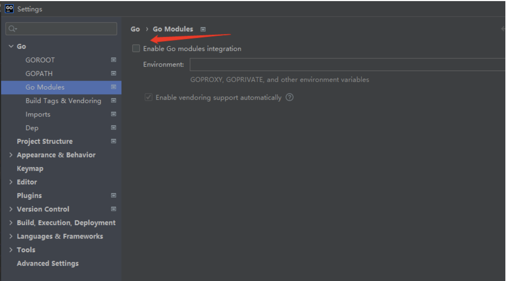

Table of Contents
=================

* [1. 代码下载](#1-代码下载)

### 1. 代码下载

（1）管理员运行git 

(2) 然后使用-c core.symlinks=true 来下载链接关系
```
git clone  -c core.symlinks=true https://github.com/kubernetes/kubernetes.git -b v1.17.4
```

（3）goland 可以使用eval reset 插件，每次打开时激活30天的免费使用，从而达到白嫖

https://blog.csdn.net/qq_37699336/article/details/116528062

（4）goland配置如下


kubernetes 源码要放到 gopath/src 目录下



然后代码就不会变红了，到处乱跳了


参考链接：https://zhuanlan.zhihu.com/p/52056165