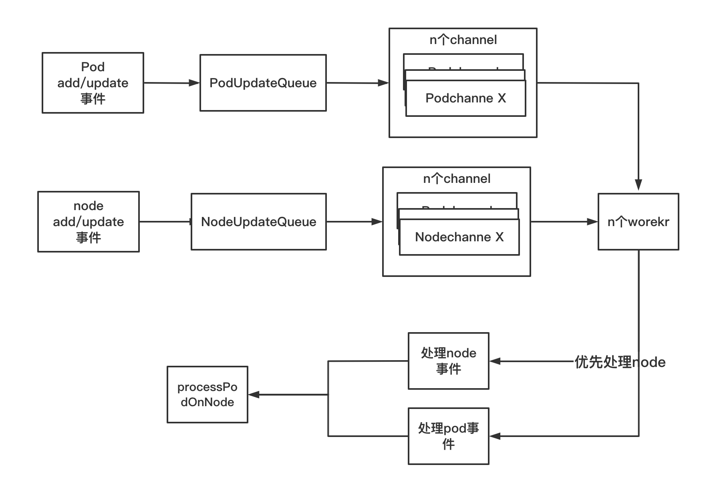
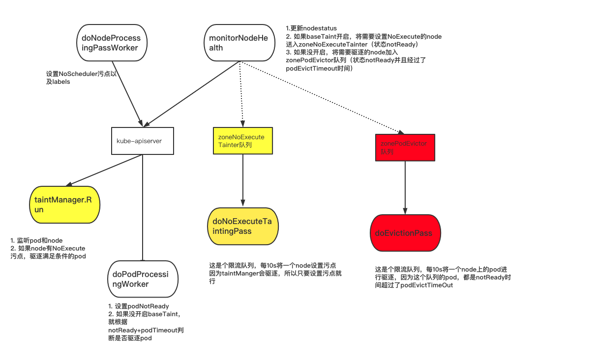

* [1\. startNodeLifecycleController](#1-startnodelifecyclecontroller)
* [2\. NewNodeLifecycleController](#2-newnodelifecyclecontroller)
  * [2\.1 NodeLifecycleController结构体介绍](#21-nodelifecyclecontroller结构体介绍)
  * [2\.2 NewNodeLifecycleController](#22-newnodelifecyclecontroller)
* [3\. NodeLifecycleController\.run](#3-nodelifecyclecontrollerrun)
  * [3\.1 nc\.taintManager\.Run](#31-nctaintmanagerrun)
    * [3\.1\.1 worker处理](#311-worker处理)
    * [3\.1\.2 handleNodeUpdate](#312-handlenodeupdate)
      * [3\.1\.2\.1 processPodOnNode](#3121-processpodonnode)
    * [3\.1\.3 handlePodUpdate](#313-handlepodupdate)
    * [3\.1\.3 nc\.taintManager\.Run总结](#313-nctaintmanagerrun总结)
  * [3\.2 doNodeProcessingPassWorker](#32-donodeprocessingpassworker)
    * [3\.2\.1 doNoScheduleTaintingPass](#321-donoscheduletaintingpass)
    * [3\.2\.2 reconcileNodeLabels](#322-reconcilenodelabels)
  * [3\.3 doPodProcessingWorker](#33-dopodprocessingworker)
    * [3\.3\.1 processNoTaintBaseEviction](#331-processnotaintbaseeviction)
  * [3\.4 doEvictionPass(if useTaintBasedEvictions==false)](#34-doevictionpassif-usetaintbasedevictionsfalse)
  * [3\.5 doNoExecuteTaintingPass(if useTaintBasedEvictions==true)](#35-donoexecutetaintingpassif-usetaintbasedevictionstrue)
  * [3\.6 monitorNodeHealth](#36-monitornodehealth)
    * [3\.6\.1  node分类并初始化](#361--node分类并初始化)
    * [3\.6\.2 处理node status](#362-处理node-status)
      * [3\.6\.3 集群健康状态处理](#363-集群健康状态处理)
* [4 总结](#4-总结)

代码版本：1.17.4

### 1. startNodeLifecycleController

可以看到startNodeLifecycleController就是分为2个步骤：

* NodeLifecycleController
* NodeLifecycleController.run

```
func startNodeLifecycleController(ctx ControllerContext) (http.Handler, bool, error) {
	lifecycleController, err := lifecyclecontroller.NewNodeLifecycleController(
		ctx.InformerFactory.Coordination().V1().Leases(),
		ctx.InformerFactory.Core().V1().Pods(),
		ctx.InformerFactory.Core().V1().Nodes(),
		ctx.InformerFactory.Apps().V1().DaemonSets(),
		// node lifecycle controller uses existing cluster role from node-controller
		ctx.ClientBuilder.ClientOrDie("node-controller"),
		
		// 就是node-monitor-period参数
		ctx.ComponentConfig.KubeCloudShared.NodeMonitorPeriod.Duration,   
		
		// 就是node-startup-grace-period参数
		ctx.ComponentConfig.NodeLifecycleController.NodeStartupGracePeriod.Duration,
		
	  // 就是node-monitor-grace-period参数
		ctx.ComponentConfig.NodeLifecycleController.NodeMonitorGracePeriod.Duration,
		
		// 就是pod-eviction-timeout参数
		ctx.ComponentConfig.NodeLifecycleController.PodEvictionTimeout.Duration,
		
		// 就是node-eviction-rate参数
		ctx.ComponentConfig.NodeLifecycleController.NodeEvictionRate,
		
		// 就是secondary-node-eviction-rate参数
		ctx.ComponentConfig.NodeLifecycleController.SecondaryNodeEvictionRate,
		
		// 就是large-cluster-size-threshold参数
		ctx.ComponentConfig.NodeLifecycleController.LargeClusterSizeThreshold,
		
		// 就是unhealthy-zone-threshold参数
		ctx.ComponentConfig.NodeLifecycleController.UnhealthyZoneThreshold,
		
		// 就是enable-taint-manager参数  （默认打开的）
		ctx.ComponentConfig.NodeLifecycleController.EnableTaintManager,
		
		// 就是这个是否打开--feature-gates=TaintBasedEvictions=true （默认打开的）
		utilfeature.DefaultFeatureGate.Enabled(features.TaintBasedEvictions),
	)
	if err != nil {
		return nil, true, err
	}
	go lifecycleController.Run(ctx.Stop)
	return nil, true, nil
}

```

具体参数介绍

* enable-taint-manager                                   默认为true, 表示允许NoExecute污点，并且将会驱逐pod                                                                                   
* large-cluster-size-threshold                         默认50，基于这个阈值来判断所在集群是否为大规模集群。当集群规模小于等于这个值的时候，会将--secondary-node-eviction-rate参数强制赋值为0
*  secondary-node-eviction-rate                    默认0.01。 当zone unhealthy时候，一秒内多少个node进行驱逐node上pod。二级驱赶速率，当集群中宕机节点过多时，相应的驱赶速率也降低，默认为0.01。
* node-eviction-rate float32                            默认为0.1。驱赶速率，即驱赶Node的速率，由令牌桶流控算法实现，默认为0.1，即每秒驱赶0.1个节点，注意这里不是驱赶Pod的速率，而是驱赶节点的速率。相当于每隔10s，清空一个节点。
*  node-monitor-grace-period duration         默认40s, 多久node没有响应认为node为unhealthy
* node-startup-grace-period duration           默认1分钟。多久允许刚启动的node未响应，认为unhealthy
* pod-eviction-timeout duration                     默认5min。当node unhealthy时候多久删除上面的pod（只在taint manager未启用时候生效）
* unhealthy-zone-threshold float32                默认55%，多少比例的unhealthy node认为zone unhealthy

<br>

### 2. NewNodeLifecycleController

#### 2.1 NodeLifecycleController结构体介绍

```
// Controller is the controller that manages node's life cycle.
type Controller struct {
  // taintManager监听节点的Taint/Toleration变化，用于驱逐pod
	taintManager *scheduler.NoExecuteTaintManager
  
  // 监听pod
	podLister         corelisters.PodLister
	podInformerSynced cache.InformerSynced
	kubeClient        clientset.Interface

	// This timestamp is to be used instead of LastProbeTime stored in Condition. We do this
	// to avoid the problem with time skew across the cluster.
	now func() metav1.Time
	
	// 返回secondary-node-eviction-rate参数值。就是根据集群是否为大集群，如果是大集群，返回secondary-node-eviction-rate,否则返回0
	enterPartialDisruptionFunc func(nodeNum int) float32
	
	// 返回evictionLimiterQPS参数
	enterFullDisruptionFunc    func(nodeNum int) float32
	
	// 返回集群有多少nodeNotReady, 并且返回bool值ZoneState用于判断zone是否健康。利用了unhealthyZoneThreshold参数
	computeZoneStateFunc       func(nodeConditions []*v1.NodeCondition) (int, ZoneState)
	
	// node map
	knownNodeSet map[string]*v1.Node
	
	// node健康信息map表
	// per Node map storing last observed health together with a local time when it was observed.
	nodeHealthMap *nodeHealthMap
	
	
	// evictorLock protects zonePodEvictor and zoneNoExecuteTainter.
	// TODO(#83954): API calls shouldn't be executed under the lock.
	evictorLock     sync.Mutex
	
	// 存放node上pod是否已经执行驱逐的状态， 从这读取node eviction的状态是evicted、tobeeviced
	nodeEvictionMap *nodeEvictionMap
	// workers that evicts pods from unresponsive nodes.
	
	// zone的需要pod evictor的node列表
	zonePodEvictor map[string]*scheduler.RateLimitedTimedQueue
	
	// 存放需要更新taint的unready node列表--令牌桶队列
	// workers that are responsible for tainting nodes.
	zoneNoExecuteTainter map[string]*scheduler.RateLimitedTimedQueue
	
	// 重试列表
	nodesToRetry sync.Map
	
	// 存放每个zone的健康状态,有stateFullDisruption、statePartialDisruption、stateNormal、stateInitial
	zoneStates map[string]ZoneState
	
	// 监听ds相关
	daemonSetStore          appsv1listers.DaemonSetLister
	daemonSetInformerSynced cache.InformerSynced
	
	// 监听node相关
	leaseLister         coordlisters.LeaseLister
	leaseInformerSynced cache.InformerSynced
	nodeLister          corelisters.NodeLister
	nodeInformerSynced  cache.InformerSynced
  
	getPodsAssignedToNode func(nodeName string) ([]*v1.Pod, error)

	recorder record.EventRecorder
	
	// 之前推到的一对参数
	// Value controlling Controller monitoring period, i.e. how often does Controller
	// check node health signal posted from kubelet. This value should be lower than
	// nodeMonitorGracePeriod.
	// TODO: Change node health monitor to watch based.
	nodeMonitorPeriod time.Duration
	
	// When node is just created, e.g. cluster bootstrap or node creation, we give
	// a longer grace period.
	nodeStartupGracePeriod time.Duration

	// Controller will not proactively sync node health, but will monitor node
	// health signal updated from kubelet. There are 2 kinds of node healthiness
	// signals: NodeStatus and NodeLease. NodeLease signal is generated only when
	// NodeLease feature is enabled. If it doesn't receive update for this amount
	// of time, it will start posting "NodeReady==ConditionUnknown". The amount of
	// time before which Controller start evicting pods is controlled via flag
	// 'pod-eviction-timeout'.
	// Note: be cautious when changing the constant, it must work with
	// nodeStatusUpdateFrequency in kubelet and renewInterval in NodeLease
	// controller. The node health signal update frequency is the minimal of the
	// two.
	// There are several constraints:
	// 1. nodeMonitorGracePeriod must be N times more than  the node health signal
	//    update frequency, where N means number of retries allowed for kubelet to
	//    post node status/lease. It is pointless to make nodeMonitorGracePeriod
	//    be less than the node health signal update frequency, since there will
	//    only be fresh values from Kubelet at an interval of node health signal
	//    update frequency. The constant must be less than podEvictionTimeout.
	// 2. nodeMonitorGracePeriod can't be too large for user experience - larger
	//    value takes longer for user to see up-to-date node health.
	nodeMonitorGracePeriod time.Duration

	podEvictionTimeout          time.Duration
	evictionLimiterQPS          float32
	secondaryEvictionLimiterQPS float32
	largeClusterThreshold       int32
	unhealthyZoneThreshold      float32

	// if set to true Controller will start TaintManager that will evict Pods from
	// tainted nodes, if they're not tolerated.
	runTaintManager bool

	// if set to true Controller will taint Nodes with 'TaintNodeNotReady' and 'TaintNodeUnreachable'
	// taints instead of evicting Pods itself.
	useTaintBasedEvictions bool
  
  // pod, node队列
	nodeUpdateQueue workqueue.Interface
	podUpdateQueue  workqueue.RateLimitingInterface
}
```

<br>

#### 2.2 NewNodeLifecycleController

核心逻辑如下：

（1）根据参数初始化Controller

（2）定义了pod的监听处理逻辑。都是先nc.podUpdated，如果enable-taint-manager=true,还会经过nc.taintManager.PodUpdated函数处理

（3）实现找出所有node上pod的函数

（4）如果enable-taint-manager=true，node有变化都需要经过 nc.taintManager.NodeUpdated函数

（5）实现node的监听处理，这里不管开没开taint-manager，都是要监听

（6）实现node, ds, lease的list，用于获取对象

```
// NewNodeLifecycleController returns a new taint controller.
func NewNodeLifecycleController(
	leaseInformer coordinformers.LeaseInformer,
	podInformer coreinformers.PodInformer,
	nodeInformer coreinformers.NodeInformer,
	daemonSetInformer appsv1informers.DaemonSetInformer,
	kubeClient clientset.Interface,
	nodeMonitorPeriod time.Duration,
	nodeStartupGracePeriod time.Duration,
	nodeMonitorGracePeriod time.Duration,
	podEvictionTimeout time.Duration,
	evictionLimiterQPS float32,
	secondaryEvictionLimiterQPS float32,
	largeClusterThreshold int32,
	unhealthyZoneThreshold float32,
	runTaintManager bool,
	useTaintBasedEvictions bool,
) (*Controller, error) {

  // 1.根据参数初始化Controller
	nc := &Controller{
	  省略代码
		....
	}
	
	if useTaintBasedEvictions {
		klog.Infof("Controller is using taint based evictions.")
	}
	nc.enterPartialDisruptionFunc = nc.ReducedQPSFunc
	nc.enterFullDisruptionFunc = nc.HealthyQPSFunc
	nc.computeZoneStateFunc = nc.ComputeZoneState
	
	// 2.定义了pod的监听处理逻辑。都是先nc.podUpdated，如果enable-taint-manager=true,还会经过nc.taintManager.PodUpdated
	podInformer.Informer().AddEventHandler(cache.ResourceEventHandlerFuncs{
		。。。
		省略代码
	})
	
	// 3.实现找出所有node上pod的函数
	nc.podInformerSynced = podInformer.Informer().HasSynced
	podInformer.Informer().AddIndexers(cache.Indexers{
		nodeNameKeyIndex: func(obj interface{}) ([]string, error) {
			pod, ok := obj.(*v1.Pod)
			if !ok {
				return []string{}, nil
			}
			if len(pod.Spec.NodeName) == 0 {
				return []string{}, nil
			}
			return []string{pod.Spec.NodeName}, nil
		},
	})

	podIndexer := podInformer.Informer().GetIndexer()
	nc.getPodsAssignedToNode = func(nodeName string) ([]*v1.Pod, error) {
		objs, err := podIndexer.ByIndex(nodeNameKeyIndex, nodeName)
		if err != nil {
			return nil, err
		}
		pods := make([]*v1.Pod, 0, len(objs))
		for _, obj := range objs {
			pod, ok := obj.(*v1.Pod)
			if !ok {
				continue
			}
			pods = append(pods, pod)
		}
		return pods, nil
	}
	nc.podLister = podInformer.Lister()
	
	// 4.如果enable-taint-manager=true，node有变化都需要经过 nc.taintManager.NodeUpdated函数
	if nc.runTaintManager {
		podGetter := func(name, namespace string) (*v1.Pod, error) { return nc.podLister.Pods(namespace).Get(name) }
		nodeLister := nodeInformer.Lister()
		nodeGetter := func(name string) (*v1.Node, error) { return nodeLister.Get(name) }
		nc.taintManager = scheduler.NewNoExecuteTaintManager(kubeClient, podGetter, nodeGetter, nc.getPodsAssignedToNode)
		nodeInformer.Informer().AddEventHandler(cache.ResourceEventHandlerFuncs{
			AddFunc: nodeutil.CreateAddNodeHandler(func(node *v1.Node) error {
				nc.taintManager.NodeUpdated(nil, node)
				return nil
			}),
			UpdateFunc: nodeutil.CreateUpdateNodeHandler(func(oldNode, newNode *v1.Node) error {
				nc.taintManager.NodeUpdated(oldNode, newNode)
				return nil
			}),
			DeleteFunc: nodeutil.CreateDeleteNodeHandler(func(node *v1.Node) error {
				nc.taintManager.NodeUpdated(node, nil)
				return nil
			}),
		})
	}
	
	// 5. 实现node的监听处理，这里不管开没开taint-manager，都是要监听
	klog.Infof("Controller will reconcile labels.")
	nodeInformer.Informer().AddEventHandler(cache.ResourceEventHandlerFuncs{
		AddFunc: nodeutil.CreateAddNodeHandler(func(node *v1.Node) error {
			nc.nodeUpdateQueue.Add(node.Name)
			nc.nodeEvictionMap.registerNode(node.Name)
			return nil
		}),
		UpdateFunc: nodeutil.CreateUpdateNodeHandler(func(_, newNode *v1.Node) error {
			nc.nodeUpdateQueue.Add(newNode.Name)
			return nil
		}),
		DeleteFunc: nodeutil.CreateDeleteNodeHandler(func(node *v1.Node) error {
			nc.nodesToRetry.Delete(node.Name)
			nc.nodeEvictionMap.unregisterNode(node.Name)
			return nil
		}),
	})
	
	// 6. 实现node, ds, lease的list，用于获取对象
	nc.leaseLister = leaseInformer.Lister()
	nc.leaseInformerSynced = leaseInformer.Informer().HasSynced

	nc.nodeLister = nodeInformer.Lister()
	nc.nodeInformerSynced = nodeInformer.Informer().HasSynced

	nc.daemonSetStore = daemonSetInformer.Lister()
	nc.daemonSetInformerSynced = daemonSetInformer.Informer().HasSynced

	return nc, nil
}
```

### 3. NodeLifecycleController.run

逻辑如下：

（1）等待leaseInformer、nodeInformer、podInformerSynced、daemonSetInformerSynced同步完成。

（2）如果enable-taint-manager=true,开启nc.taintManager.Run

（3）执行doNodeProcessingPassWorker，这个是处理nodeUpdateQueue队列的node

（4）doPodProcessingWorker，这个是处理podUpdateQueue队列的pod

（5）如果开启了feature-gates=TaintBasedEvictions=true，执行doNoExecuteTaintingPass函数。否则执行doEvictionPass函数

（6）一直监听node状态是否健康

```
// Run starts an asynchronous loop that monitors the status of cluster nodes.
func (nc *Controller) Run(stopCh <-chan struct{}) {
	defer utilruntime.HandleCrash()

	klog.Infof("Starting node controller")
	defer klog.Infof("Shutting down node controller")
	
	// 1.等待leaseInformer、nodeInformer、podInformerSynced、daemonSetInformerSynced同步完成。
	if !cache.WaitForNamedCacheSync("taint", stopCh, nc.leaseInformerSynced, nc.nodeInformerSynced, nc.podInformerSynced, nc.daemonSetInformerSynced) {
		return
	}
	
	// 2.如果enable-taint-manager=true,开启nc.taintManager.Run
	if nc.runTaintManager {
		go nc.taintManager.Run(stopCh)
	}
	
	// Close node update queue to cleanup go routine.
	defer nc.nodeUpdateQueue.ShutDown()
	defer nc.podUpdateQueue.ShutDown()
	
	// 3.执行doNodeProcessingPassWorker，这个是处理nodeUpdateQueue队列的node
	// Start workers to reconcile labels and/or update NoSchedule taint for nodes.
	for i := 0; i < scheduler.UpdateWorkerSize; i++ {
		// Thanks to "workqueue", each worker just need to get item from queue, because
		// the item is flagged when got from queue: if new event come, the new item will
		// be re-queued until "Done", so no more than one worker handle the same item and
		// no event missed.
		go wait.Until(nc.doNodeProcessingPassWorker, time.Second, stopCh)
	}
	
// 4.doPodProcessingWorker，这个是处理podUpdateQueue队列的pod
	for i := 0; i < podUpdateWorkerSize; i++ {
		go wait.Until(nc.doPodProcessingWorker, time.Second, stopCh)
	}
	
	// 5. 如果开启了feature-gates=TaintBasedEvictions=true，执行doNoExecuteTaintingPass函数。否则执行doEvictionPass函数
	if nc.useTaintBasedEvictions {
		// Handling taint based evictions. Because we don't want a dedicated logic in TaintManager for NC-originated
		// taints and we normally don't rate limit evictions caused by taints, we need to rate limit adding taints.
		go wait.Until(nc.doNoExecuteTaintingPass, scheduler.NodeEvictionPeriod, stopCh)
	} else {
		// Managing eviction of nodes:
		// When we delete pods off a node, if the node was not empty at the time we then
		// queue an eviction watcher. If we hit an error, retry deletion.
		go wait.Until(nc.doEvictionPass, scheduler.NodeEvictionPeriod, stopCh)
	}
	
	
	// 6.一直监听node状态是否健康
	// Incorporate the results of node health signal pushed from kubelet to master.
	go wait.Until(func() {
		if err := nc.monitorNodeHealth(); err != nil {
			klog.Errorf("Error monitoring node health: %v", err)
		}
	}, nc.nodeMonitorPeriod, stopCh)

	<-stopCh
}
```

#### 3.1 nc.taintManager.Run

在newNodeLifecycleContainer的时候就初始化了NewNoExecuteTaintManager。

taint manager是由pod和node事件触发执行，根据node或pod绑定的node是否有的noExcute taint，如果有则对node上所有的pod或这个pod执行删除。

具体逻辑为：如果启用了taint manager就会调用NewNoExecuteTaintManager对taint manager进行初始化。可以看出来这里就是初始化了nodeUpdateQueue，podUpdateQueue队列以及事件上报。

核心数据机构：

* nodeUpdateQueue 在nodelifecycleController的时候定义了，node变化会扔进这个队列
* podUpdateQueue   在nodelifecycleController的时候定义了，pod变化会扔进这个队列

* taintedNodes是存放node上所有的noExecute taint，handlePodUpdate会从taintedNodes查询node的noExecute taint。
* taintEvictionQueuetaintEvictionQueue是一个TimedWorkerQueue–定时自动执行队列。因为有的pod设置了污点容忍时间，所以需要一个时间队列来定时删除。

```
// NewNoExecuteTaintManager creates a new NoExecuteTaintManager that will use passed clientset to
// communicate with the API server.
func NewNoExecuteTaintManager(c clientset.Interface, getPod GetPodFunc, getNode GetNodeFunc, getPodsAssignedToNode GetPodsByNodeNameFunc) *NoExecuteTaintManager {
	eventBroadcaster := record.NewBroadcaster()
	recorder := eventBroadcaster.NewRecorder(scheme.Scheme, v1.EventSource{Component: "taint-controller"})
	eventBroadcaster.StartLogging(klog.Infof)
	if c != nil {
		klog.V(0).Infof("Sending events to api server.")
		eventBroadcaster.StartRecordingToSink(&v1core.EventSinkImpl{Interface: c.CoreV1().Events("")})
	} else {
		klog.Fatalf("kubeClient is nil when starting NodeController")
	}

	tm := &NoExecuteTaintManager{
		client:                c,
		recorder:              recorder,
		getPod:                getPod,
		getNode:               getNode,
		getPodsAssignedToNode: getPodsAssignedToNode,
		taintedNodes:          make(map[string][]v1.Taint),

		nodeUpdateQueue: workqueue.NewNamed("noexec_taint_node"),
		podUpdateQueue:  workqueue.NewNamed("noexec_taint_pod"),
	}
	tm.taintEvictionQueue = CreateWorkerQueue(deletePodHandler(c, tm.emitPodDeletionEvent))

	return tm
}
```

run函数逻辑如下：

这里的核心其实就是从nodeUpdateQueue, UpdateWorkerSize 取出一个元素，然后执行worker处理。和一般的controller思想是一样的。

**注意**: 这里用了负载均衡的思想。因为worker数量是UpdateWorkerSize个，所以这里就定义UpdateWorkerSize个channel。然后开启UpdateWorkerSize个协程，处理对应的channel。这样通过哈希取模的方式，就相当于尽可能使得每个channel的元素尽可能相等。

```
// Run starts NoExecuteTaintManager which will run in loop until `stopCh` is closed.
func (tc *NoExecuteTaintManager) Run(stopCh <-chan struct{}) {
	klog.V(0).Infof("Starting NoExecuteTaintManager")

	for i := 0; i < UpdateWorkerSize; i++ {
		tc.nodeUpdateChannels = append(tc.nodeUpdateChannels, make(chan nodeUpdateItem, NodeUpdateChannelSize))
		tc.podUpdateChannels = append(tc.podUpdateChannels, make(chan podUpdateItem, podUpdateChannelSize))
	}

	// Functions that are responsible for taking work items out of the workqueues and putting them
	// into channels.
	go func(stopCh <-chan struct{}) {
		for {
			item, shutdown := tc.nodeUpdateQueue.Get()
			if shutdown {
				break
			}
			nodeUpdate := item.(nodeUpdateItem)
			hash := hash(nodeUpdate.nodeName, UpdateWorkerSize)
			select {
			case <-stopCh:
				tc.nodeUpdateQueue.Done(item)
				return
			case tc.nodeUpdateChannels[hash] <- nodeUpdate:
				// tc.nodeUpdateQueue.Done is called by the nodeUpdateChannels worker
			}
		}
	}(stopCh)

	go func(stopCh <-chan struct{}) {
		for {
			item, shutdown := tc.podUpdateQueue.Get()
			if shutdown {
				break
			}
			// The fact that pods are processed by the same worker as nodes is used to avoid races
			// between node worker setting tc.taintedNodes and pod worker reading this to decide
			// whether to delete pod.
			// It's possible that even without this assumption this code is still correct.
			podUpdate := item.(podUpdateItem)
			hash := hash(podUpdate.nodeName, UpdateWorkerSize)
			select {
			case <-stopCh:
				tc.podUpdateQueue.Done(item)
				return
			case tc.podUpdateChannels[hash] <- podUpdate:
				// tc.podUpdateQueue.Done is called by the podUpdateChannels worker
			}
		}
	}(stopCh)

	wg := sync.WaitGroup{}
	wg.Add(UpdateWorkerSize)
	for i := 0; i < UpdateWorkerSize; i++ {
		go tc.worker(i, wg.Done, stopCh)
	}
	wg.Wait()
}
```

<br>

##### 3.1.1 worker处理

worker的处理逻辑其实很简单。就是每个worker协程从对应的chanel取出一个nodeUpdate/podUpdate 事件进行处理。

分别对应：handleNodeUpdate函数和handlePodUpdate函数

**但是**：这里又得注意的是：worker会优先处理nodeUpdate事件。（很好理解，因为处理node事件是驱逐整个节点的Pod, 这个可能包括了Pod）

```
func (tc *NoExecuteTaintManager) worker(worker int, done func(), stopCh <-chan struct{}) {
	defer done()

	// When processing events we want to prioritize Node updates over Pod updates,
	// as NodeUpdates that interest NoExecuteTaintManager should be handled as soon as possible -
	// we don't want user (or system) to wait until PodUpdate queue is drained before it can
	// start evicting Pods from tainted Nodes.
	for {
		select {
		case <-stopCh:
			return
		case nodeUpdate := <-tc.nodeUpdateChannels[worker]:
			tc.handleNodeUpdate(nodeUpdate)
			tc.nodeUpdateQueue.Done(nodeUpdate)
		case podUpdate := <-tc.podUpdateChannels[worker]:
			// If we found a Pod update we need to empty Node queue first.
		priority:
			for {
				select {
				case nodeUpdate := <-tc.nodeUpdateChannels[worker]:
					tc.handleNodeUpdate(nodeUpdate)
					tc.nodeUpdateQueue.Done(nodeUpdate)
				default:
					break priority
				}
			}
			// After Node queue is emptied we process podUpdate.
			tc.handlePodUpdate(podUpdate)
			tc.podUpdateQueue.Done(podUpdate)
		}
	}
}
```

##### 3.1.2 handleNodeUpdate

核心逻辑：

（1）先得到该node上所有的taint

（2）得到这个node上所有的pod

（3）for循环执行processPodOnNode来一个个的处理pod

```
func (tc *NoExecuteTaintManager) handleNodeUpdate(nodeUpdate nodeUpdateItem) {
	node, err := tc.getNode(nodeUpdate.nodeName)
	if err != nil {
		if apierrors.IsNotFound(err) {
			// Delete
			klog.V(4).Infof("Noticed node deletion: %#v", nodeUpdate.nodeName)
			tc.taintedNodesLock.Lock()
			defer tc.taintedNodesLock.Unlock()
			delete(tc.taintedNodes, nodeUpdate.nodeName)
			return
		}
		utilruntime.HandleError(fmt.Errorf("cannot get node %s: %v", nodeUpdate.nodeName, err))
		return
	}
	
	// 1.先得到该node上所有的taint
	// Create or Update
	klog.V(4).Infof("Noticed node update: %#v", nodeUpdate)
	taints := getNoExecuteTaints(node.Spec.Taints)
	func() {
		tc.taintedNodesLock.Lock()
		defer tc.taintedNodesLock.Unlock()
		klog.V(4).Infof("Updating known taints on node %v: %v", node.Name, taints)
		if len(taints) == 0 {
			delete(tc.taintedNodes, node.Name)
		} else {
			tc.taintedNodes[node.Name] = taints
		}
	}()
	
	// 2. 得到这个node上所有的pod
	// This is critical that we update tc.taintedNodes before we call getPodsAssignedToNode:
	// getPodsAssignedToNode can be delayed as long as all future updates to pods will call
	// tc.PodUpdated which will use tc.taintedNodes to potentially delete delayed pods.
	pods, err := tc.getPodsAssignedToNode(node.Name)
	if err != nil {
		klog.Errorf(err.Error())
		return
	}
	if len(pods) == 0 {
		return
	}
	// Short circuit, to make this controller a bit faster.
	if len(taints) == 0 {
		klog.V(4).Infof("All taints were removed from the Node %v. Cancelling all evictions...", node.Name)
		for i := range pods {
			tc.cancelWorkWithEvent(types.NamespacedName{Namespace: pods[i].Namespace, Name: pods[i].Name})
		}
		return
	}
	
	// 3. for循环执行processPodOnNode来一个个的处理pod
	now := time.Now()
	for _, pod := range pods {
		podNamespacedName := types.NamespacedName{Namespace: pod.Namespace, Name: pod.Name}
		tc.processPodOnNode(podNamespacedName, node.Name, pod.Spec.Tolerations, taints, now)
	}
}
```

###### 3.1.2.1 processPodOnNode

核心逻辑如下：

（1） 如果node没有taint了，那就取消该pod的处理（可能在定时队列中挂着）

（2）通过pod的Tolerations和node的taints进行对比，看该pod有没有完全容忍。

（3）如果没有完全容忍，那就先取消对该pod的处理（防止如果pod已经在队列中，不能添加到队列中去），然后再通过AddWork重新挂进去。注意这里设置的时间都是time.now，意思就是马上删除

（4）如果完全容忍，找出来最短能够容忍的时间。看这个函数就知道。如果没有身容忍时间或者容忍时间为负数，都赋值为0，表示马上删除。如果设置了最大值math.MaxInt64。表示一直容忍，永远不删除。否则就找设置的最小的容忍时间

（5）接下里就是根据最小时间来设置等多久触发删除pod了，但是设置之前还要和之前已有的触发再判断一下

* 如果之前就有在等着到时间删除的，并且这次的触发删除时间在那之前。不删除。举例，podA应该是11点删除，这次更新发现pod应该是10.50删除，那么这次就忽略，还是以上次为准
* 否则删除后，再次设置这次的删除时间

```
func (tc *NoExecuteTaintManager) processPodOnNode(
	podNamespacedName types.NamespacedName,
	nodeName string,
	tolerations []v1.Toleration,
	taints []v1.Taint,
	now time.Time,
) {
  // 1. 如果node没有taint了，那就取消该pod的处理（可能在定时队列中挂着）
	if len(taints) == 0 {
		tc.cancelWorkWithEvent(podNamespacedName)
	}
	
	// 2.通过pod的Tolerations和node的taints进行对比，看该pod有没有完全容忍。
	allTolerated, usedTolerations := v1helper.GetMatchingTolerations(taints, tolerations)
  // 3.如果没有完全容忍，那就先取消对该pod的处理（防止如果pod已经在队列中，不能添加到队列中去），然后再通过AddWork重新挂进去。注意这里设置的时间都是time.now，意思就是马上删除
  if !allTolerated {
		klog.V(2).Infof("Not all taints are tolerated after update for Pod %v on %v", podNamespacedName.String(), nodeName)
		// We're canceling scheduled work (if any), as we're going to delete the Pod right away.
		tc.cancelWorkWithEvent(podNamespacedName)
		tc.taintEvictionQueue.AddWork(NewWorkArgs(podNamespacedName.Name, podNamespacedName.Namespace), time.Now(), time.Now())
		return
	}
	
	// 4.如果完全容忍，找出来最短能够容忍的时间。看这个函数就知道。如果没有身容忍时间或者容忍时间为负数，都赋值为0，表示马上删除。如果设置了最大值math.MaxInt64。表示一直容忍，永远不删除。否则就找设置的最小的容忍时间
	minTolerationTime := getMinTolerationTime(usedTolerations)
	// getMinTolerationTime returns negative value to denote infinite toleration.
	if minTolerationTime < 0 {
		klog.V(4).Infof("New tolerations for %v tolerate forever. Scheduled deletion won't be cancelled if already scheduled.", podNamespacedName.String())
		return
	}
	
	// 5. 接下里就是根据最小时间来设置等多久触发删除pod了
	startTime := now
	triggerTime := startTime.Add(minTolerationTime)
	scheduledEviction := tc.taintEvictionQueue.GetWorkerUnsafe(podNamespacedName.String())
	if scheduledEviction != nil {
		startTime = scheduledEviction.CreatedAt
		// 5.1 如果之前就有在等着到时间删除的，并且这次的触发删除时间在那之前。不删除。举例，podA应该是11点删除，这次更新发现pod应该是10.50删除，那么这次就忽略，还是以上次为准
		if startTime.Add(minTolerationTime).Before(triggerTime) {
			return
		}
		// 5.2 否则删除后，再次设置这次的删除时间
		tc.cancelWorkWithEvent(podNamespacedName)
	}
	tc.taintEvictionQueue.AddWork(NewWorkArgs(podNamespacedName.Name, podNamespacedName.Namespace), startTime, triggerTime)
}
```

##### 3.1.3 handlePodUpdate

handlePodUpdate是handleNodeUpdate的子集。核心逻辑就是processPodOnNode。这个上面分析了，不在分析了

```
func (tc *NoExecuteTaintManager) handlePodUpdate(podUpdate podUpdateItem) {
	pod, err := tc.getPod(podUpdate.podName, podUpdate.podNamespace)
	if err != nil {
		if apierrors.IsNotFound(err) {
			// Delete
			podNamespacedName := types.NamespacedName{Namespace: podUpdate.podNamespace, Name: podUpdate.podName}
			klog.V(4).Infof("Noticed pod deletion: %#v", podNamespacedName)
			tc.cancelWorkWithEvent(podNamespacedName)
			return
		}
		utilruntime.HandleError(fmt.Errorf("could not get pod %s/%s: %v", podUpdate.podName, podUpdate.podNamespace, err))
		return
	}

	// We key the workqueue and shard workers by nodeName. If we don't match the current state we should not be the one processing the current object.
	if pod.Spec.NodeName != podUpdate.nodeName {
		return
	}

	// Create or Update
	podNamespacedName := types.NamespacedName{Namespace: pod.Namespace, Name: pod.Name}
	klog.V(4).Infof("Noticed pod update: %#v", podNamespacedName)
	nodeName := pod.Spec.NodeName
	if nodeName == "" {
		return
	}
	taints, ok := func() ([]v1.Taint, bool) {
		tc.taintedNodesLock.Lock()
		defer tc.taintedNodesLock.Unlock()
		taints, ok := tc.taintedNodes[nodeName]
		return taints, ok
	}()
	// It's possible that Node was deleted, or Taints were removed before, which triggered
	// eviction cancelling if it was needed.
	if !ok {
		return
	}
	tc.processPodOnNode(podNamespacedName, nodeName, pod.Spec.Tolerations, taints, time.Now())
}
```

##### 3.1.3 nc.taintManager.Run总结

**可以看出来nc.taintManager针对NoExecute污点立即生效的，只要节点有污点，我就要开始驱逐，pod你自身通过设置容忍时间来避免马上驱逐**

（1）监听pod, node的add/update事件

（2）通过多个channel的方式，hash打断pod/node事件到不容的chanenl，这样让n个worker负载均衡处理

（3）优先处理node事件，但实际node处理和pod处理是一样的。处理node是将上面的pod一个一个的判断，是否需要驱逐。判断驱逐逻辑核心就是：

*  如果node没有taint了，那就取消该pod的处理（可能在定时队列中挂着）

* 通过pod的Tolerations和node的taints进行对比，看该pod有没有完全容忍。

* 如果没有完全容忍，那就先取消对该pod的处理（防止如果pod已经在队列中，不能添加到队列中去），然后再通过AddWork重新挂进去。注意这里设置的时间都是time.now，意思就是马上删除

* 如果完全容忍，找出来最短能够容忍的时间。看这个函数就知道。如果没有身容忍时间或者容忍时间为负数，都赋值为0，表示马上删除。如果设置了最大值math.MaxInt64。表示一直容忍，永远不删除。否则就找设置的最小的容忍时间

* 接下里就是根据最小时间来设置等多久触发删除pod了，但是设置之前还要和之前已有的触发再判断一下
  * 如果之前就有在等着到时间删除的，并且这次的触发删除时间在那之前。不删除。举例，podA应该是11点删除，这次更新发现pod应该是10.50删除，那么这次就忽略，还是以上次为准
  * 否则删除后，再次设置这次的删除时间



#### 3.2 doNodeProcessingPassWorker

可以看出来doNodeProcessingPassWorker核心就是2件事：

（1）给node添加NoScheduleTaint

（2）给node添加lables

```
func (nc *Controller) doNodeProcessingPassWorker() {
   for {
      obj, shutdown := nc.nodeUpdateQueue.Get()
      // "nodeUpdateQueue" will be shutdown when "stopCh" closed;
      // we do not need to re-check "stopCh" again.
      if shutdown {
         return
      }
      nodeName := obj.(string)
      if err := nc.doNoScheduleTaintingPass(nodeName); err != nil {
         klog.Errorf("Failed to taint NoSchedule on node <%s>, requeue it: %v", nodeName, err)
         // TODO(k82cn): Add nodeName back to the queue
      }
      // TODO: re-evaluate whether there are any labels that need to be
      // reconcile in 1.19. Remove this function if it's no longer necessary.
      if err := nc.reconcileNodeLabels(nodeName); err != nil {
         klog.Errorf("Failed to reconcile labels for node <%s>, requeue it: %v", nodeName, err)
         // TODO(yujuhong): Add nodeName back to the queue
      }
      nc.nodeUpdateQueue.Done(nodeName)
   }
}
```

##### 3.2.1 doNoScheduleTaintingPass

核心逻辑就是检查该 node 是否需要添加对应的NoSchedule

 逻辑为：

- 1、从 nodeLister 中获取该 node 对象；
- 2、判断该 node 是否存在以下几种 Condition：(1) False 或 Unknown 状态的 NodeReady Condition；(2) MemoryPressureCondition；(3) DiskPressureCondition；(4) NetworkUnavailableCondition；(5) PIDPressureCondition；若任一一种存在会添加对应的 `NoSchedule` taint；
- 3、判断 node 是否处于 `Unschedulable` 状态，若为 `Unschedulable` 也添加对应的 `NoSchedule` taint；
- 4、对比 node 已有的 taints 以及需要添加的 taints，以需要添加的 taints 为准，调用 `nodeutil.SwapNodeControllerTaint` 为 node 添加不存在的 taints 并删除不需要的 taints；

```
func (nc *Controller) doNoScheduleTaintingPass(nodeName string) error {
	node, err := nc.nodeLister.Get(nodeName)
	if err != nil {
		// If node not found, just ignore it.
		if apierrors.IsNotFound(err) {
			return nil
		}
		return err
	}

	// Map node's condition to Taints.
	var taints []v1.Taint
	for _, condition := range node.Status.Conditions {
		if taintMap, found := nodeConditionToTaintKeyStatusMap[condition.Type]; found {
			if taintKey, found := taintMap[condition.Status]; found {
				taints = append(taints, v1.Taint{
					Key:    taintKey,
					Effect: v1.TaintEffectNoSchedule,
				})
			}
		}
	}
	if node.Spec.Unschedulable {
		// If unschedulable, append related taint.
		taints = append(taints, v1.Taint{
			Key:    v1.TaintNodeUnschedulable,
			Effect: v1.TaintEffectNoSchedule,
		})
	}

	// Get exist taints of node.
	nodeTaints := taintutils.TaintSetFilter(node.Spec.Taints, func(t *v1.Taint) bool {
		// only NoSchedule taints are candidates to be compared with "taints" later
		if t.Effect != v1.TaintEffectNoSchedule {
			return false
		}
		// Find unschedulable taint of node.
		if t.Key == v1.TaintNodeUnschedulable {
			return true
		}
		// Find node condition taints of node.
		_, found := taintKeyToNodeConditionMap[t.Key]
		return found
	})
	taintsToAdd, taintsToDel := taintutils.TaintSetDiff(taints, nodeTaints)
	// If nothing to add not delete, return true directly.
	if len(taintsToAdd) == 0 && len(taintsToDel) == 0 {
		return nil
	}
	if !nodeutil.SwapNodeControllerTaint(nc.kubeClient, taintsToAdd, taintsToDel, node) {
		return fmt.Errorf("failed to swap taints of node %+v", node)
	}
	return nil
}


nodeConditionToTaintKeyStatusMap = map[v1.NodeConditionType]map[v1.ConditionStatus]string{
		v1.NodeReady: {
			v1.ConditionFalse:   v1.TaintNodeNotReady,
			v1.ConditionUnknown: v1.TaintNodeUnreachable,
		},
		v1.NodeMemoryPressure: {
			v1.ConditionTrue: v1.TaintNodeMemoryPressure,
		},
		v1.NodeDiskPressure: {
			v1.ConditionTrue: v1.TaintNodeDiskPressure,
		},
		v1.NodeNetworkUnavailable: {
			v1.ConditionTrue: v1.TaintNodeNetworkUnavailable,
		},
		v1.NodePIDPressure: {
			v1.ConditionTrue: v1.TaintNodePIDPressure,
		},
	}
```

##### 3.2.2 reconcileNodeLabels

reconcileNodeLabels就是及时给node更新：

```
 beta.kubernetes.io/arch: amd64
    beta.kubernetes.io/os: linux
    kubernetes.io/arch: amd64
    kubernetes.io/os: linux
```

<br>

```
// reconcileNodeLabels reconciles node labels.
func (nc *Controller) reconcileNodeLabels(nodeName string) error {
	node, err := nc.nodeLister.Get(nodeName)
	if err != nil {
		// If node not found, just ignore it.
		if apierrors.IsNotFound(err) {
			return nil
		}
		return err
	}

	if node.Labels == nil {
		// Nothing to reconcile.
		return nil
	}

	labelsToUpdate := map[string]string{}
	for _, r := range labelReconcileInfo {
		primaryValue, primaryExists := node.Labels[r.primaryKey]
		secondaryValue, secondaryExists := node.Labels[r.secondaryKey]

		if !primaryExists {
			// The primary label key does not exist. This should not happen
			// within our supported version skew range, when no external
			// components/factors modifying the node object. Ignore this case.
			continue
		}
		if secondaryExists && primaryValue != secondaryValue {
			// Secondary label exists, but not consistent with the primary
			// label. Need to reconcile.
			labelsToUpdate[r.secondaryKey] = primaryValue

		} else if !secondaryExists && r.ensureSecondaryExists {
			// Apply secondary label based on primary label.
			labelsToUpdate[r.secondaryKey] = primaryValue
		}
	}

	if len(labelsToUpdate) == 0 {
		return nil
	}
	if !nodeutil.AddOrUpdateLabelsOnNode(nc.kubeClient, labelsToUpdate, node) {
		return fmt.Errorf("failed update labels for node %+v", node)
	}
	return nil
}
```

#### 3.3 doPodProcessingWorker

doPodProcessingWorker从podUpdateQueue读取一个pod，执行processPod。（注意这里的podUpdateQueue和tainManger的podUpdateQueue不是一个队列，是同名而已）

processPod和新逻辑如下：

（1） 判断NodeCondition是否notReady

（2）如果feature-gates=TaintBasedEvictions=false，则执行processNoTaintBaseEviction

（3）最终都会判断node ReadyCondition是否不为true，如果不为true, 执行MarkPodsNotReady–如果pod的ready condition不为false， 将pod的ready condition设置为false，并更新LastTransitionTimestamp；否则不更新pod

```
func (nc *Controller) doPodProcessingWorker() {
	for {
		obj, shutdown := nc.podUpdateQueue.Get()
		// "podUpdateQueue" will be shutdown when "stopCh" closed;
		// we do not need to re-check "stopCh" again.
		if shutdown {
			return
		}

		podItem := obj.(podUpdateItem)
		nc.processPod(podItem)
	}
}


// processPod is processing events of assigning pods to nodes. In particular:
// 1. for NodeReady=true node, taint eviction for this pod will be cancelled
// 2. for NodeReady=false or unknown node, taint eviction of pod will happen and pod will be marked as not ready
// 3. if node doesn't exist in cache, it will be skipped and handled later by doEvictionPass
func (nc *Controller) processPod(podItem podUpdateItem) {
	defer nc.podUpdateQueue.Done(podItem)
	pod, err := nc.podLister.Pods(podItem.namespace).Get(podItem.name)
	if err != nil {
		if apierrors.IsNotFound(err) {
			// If the pod was deleted, there is no need to requeue.
			return
		}
		klog.Warningf("Failed to read pod %v/%v: %v.", podItem.namespace, podItem.name, err)
		nc.podUpdateQueue.AddRateLimited(podItem)
		return
	}

	nodeName := pod.Spec.NodeName

	nodeHealth := nc.nodeHealthMap.getDeepCopy(nodeName)
	if nodeHealth == nil {
		// Node data is not gathered yet or node has beed removed in the meantime.
		// Pod will be handled by doEvictionPass method.
		return
	}

	node, err := nc.nodeLister.Get(nodeName)
	if err != nil {
		klog.Warningf("Failed to read node %v: %v.", nodeName, err)
		nc.podUpdateQueue.AddRateLimited(podItem)
		return
	}
	
	// 1. 判断NodeCondition是否notReady
	_, currentReadyCondition := nodeutil.GetNodeCondition(nodeHealth.status, v1.NodeReady)
	if currentReadyCondition == nil {
		// Lack of NodeReady condition may only happen after node addition (or if it will be maliciously deleted).
		// In both cases, the pod will be handled correctly (evicted if needed) during processing
		// of the next node update event.
		return
	}
  
  // 2.如果feature-gates=TaintBasedEvictions=false，则执行processNoTaintBaseEviction
	pods := []*v1.Pod{pod}
	// In taint-based eviction mode, only node updates are processed by NodeLifecycleController.
	// Pods are processed by TaintManager.
	if !nc.useTaintBasedEvictions {
		if err := nc.processNoTaintBaseEviction(node, currentReadyCondition, nc.nodeMonitorGracePeriod, pods); err != nil {
			klog.Warningf("Unable to process pod %+v eviction from node %v: %v.", podItem, nodeName, err)
			nc.podUpdateQueue.AddRateLimited(podItem)
			return
		}
	}
	
	// 3.最终都会判断node ReadyCondition是否不为true，如果不为true, 执行MarkPodsNotReady–如果pod的ready condition不为false， 将pod的ready condition设置为false，并更新LastTransitionTimestamp；否则不更新pod
	if currentReadyCondition.Status != v1.ConditionTrue {
		if err := nodeutil.MarkPodsNotReady(nc.kubeClient, pods, nodeName); err != nil {
			klog.Warningf("Unable to mark pod %+v NotReady on node %v: %v.", podItem, nodeName, err)
			nc.podUpdateQueue.AddRateLimited(podItem)
		}
	}
}
```

##### 3.3.1 processNoTaintBaseEviction

核心逻辑如下：

（1）node最后发现ReadyCondition为false，如果nodeHealthMap里的readyTransitionTimestamp加上podEvictionTimeout的时间是过去的时间–ReadyCondition为false状态已经持续了至少podEvictionTimeout，执行evictPods。

（2）node最后发现ReadyCondition为unknown，如果nodeHealthMap里的probeTimestamp加上podEvictionTimeout的时间是过去的时间–ReadyCondition为false状态已经持续了至少podEvictionTimeout，执行evictPods。

（3）node最后发现ReadyCondition为true，则执行cancelPodEviction–在nodeEvictionMap设置status为unmarked，然后node从zonePodEvictor队列中移除。

**evictPods并不会马上驱逐pod，他还是看node是否已经是驱逐状态。**

evictPods先从nodeEvictionMap获取node驱逐的状态，如果是evicted说明node已经发生驱逐，则把node上的这个pod删除。否则设置状态为toBeEvicted，然后node加入**zonePodEvictor**队列等待执行驱逐pod

```
func (nc *Controller) processNoTaintBaseEviction(node *v1.Node, observedReadyCondition *v1.NodeCondition, gracePeriod time.Duration, pods []*v1.Pod) error {
	decisionTimestamp := nc.now()
	nodeHealthData := nc.nodeHealthMap.getDeepCopy(node.Name)
	if nodeHealthData == nil {
		return fmt.Errorf("health data doesn't exist for node %q", node.Name)
	}
	// Check eviction timeout against decisionTimestamp
	switch observedReadyCondition.Status {
	case v1.ConditionFalse:
		if decisionTimestamp.After(nodeHealthData.readyTransitionTimestamp.Add(nc.podEvictionTimeout)) {
			enqueued, err := nc.evictPods(node, pods)
			if err != nil {
				return err
			}
			if enqueued {
				klog.V(2).Infof("Node is NotReady. Adding Pods on Node %s to eviction queue: %v is later than %v + %v",
					node.Name,
					decisionTimestamp,
					nodeHealthData.readyTransitionTimestamp,
					nc.podEvictionTimeout,
				)
			}
		}
	case v1.ConditionUnknown:
		if decisionTimestamp.After(nodeHealthData.probeTimestamp.Add(nc.podEvictionTimeout)) {
			enqueued, err := nc.evictPods(node, pods)
			if err != nil {
				return err
			}
			if enqueued {
				klog.V(2).Infof("Node is unresponsive. Adding Pods on Node %s to eviction queues: %v is later than %v + %v",
					node.Name,
					decisionTimestamp,
					nodeHealthData.readyTransitionTimestamp,
					nc.podEvictionTimeout-gracePeriod,
				)
			}
		}
	case v1.ConditionTrue:
		if nc.cancelPodEviction(node) {
			klog.V(2).Infof("Node %s is ready again, cancelled pod eviction", node.Name)
		}
	}
	return nil
}


// evictPods:
// - adds node to evictor queue if the node is not marked as evicted.
//   Returns false if the node name was already enqueued.
// - deletes pods immediately if node is already marked as evicted.
//   Returns false, because the node wasn't added to the queue.
func (nc *Controller) evictPods(node *v1.Node, pods []*v1.Pod) (bool, error) {
	nc.evictorLock.Lock()
	defer nc.evictorLock.Unlock()
	status, ok := nc.nodeEvictionMap.getStatus(node.Name)
	if ok && status == evicted {
		// Node eviction already happened for this node.
		// Handling immediate pod deletion.
		_, err := nodeutil.DeletePods(nc.kubeClient, pods, nc.recorder, node.Name, string(node.UID), nc.daemonSetStore)
		if err != nil {
			return false, fmt.Errorf("unable to delete pods from node %q: %v", node.Name, err)
		}
		return false, nil
	}
	if !nc.nodeEvictionMap.setStatus(node.Name, toBeEvicted) {
		klog.V(2).Infof("node %v was unregistered in the meantime - skipping setting status", node.Name)
	}
	return nc.zonePodEvictor[utilnode.GetZoneKey(node)].Add(node.Name, string(node.UID)), nil
}
```

#### 3.4 doEvictionPass(if useTaintBasedEvictions==false)

**doEvictionPass是一个令牌桶限速队列(受参数evictionLimiterQPS影响，默认0.1也就是10s驱逐一个node)**，+加入这个队列的node都是 unready状态持续时间大于podEvictionTimeout。(这个就是processNoTaintBaseEviction将node加入了队列)

- 遍历zonePodEvictor，获取一个zone里的node队列，从队列中获取一个node，执行下面步骤
- 获取node的uid，从缓存中获取node上的所有pod
- 执行DeletePods–删除daemonset之外的所有pod，保留daemonset的pod
  1. 遍历所由的pod，检查pod绑定的node是否跟提供的一样，不一样则跳过这个pod
  2. 执行SetPodTerminationReason–设置pod Status.Reason为`NodeLost`，Status.Message为`"Node %v which was running pod %v is unresponsive"`，并更新pod。
  3. 如果pod 设置了DeletionGracePeriodSeconds，说明pod已经被删除，则跳过这个pod
  4. 判断pod是否为daemonset的pod，如果是则跳过这个pod
  5. 删除这个pod
- 在nodeEvictionMap设置node的状态为evicted

#### 3.5 doNoExecuteTaintingPass(if useTaintBasedEvictions==true)

启用taint manager 执行doNoExecuteTaintingPass–添加NoExecute的taint。这里不执行驱逐，驱逐单独在taint manager里处理。

doNoExecuteTaintingPass是一个令牌桶限速队列（也是受受参数evictionLimiterQPS影响，默认0.1也就是10s驱逐一个node）

- 遍历zoneNoExecuteTainter，获得一个zone的node队列，从队列中获取一个node，执行下面步骤
- 从缓存中获取node
- 如果node ready condition为false，移除“node.kubernetes.io/unreachable”的taint，添加“node.kubernetes.io/not-ready” 的taint，Effect为NoExecute。
- 如果node ready condition为unknown，移除“node.kubernetes.io/not-ready” 的taint，添加“node.kubernetes.io/unreachable” 的taint，Effect为NoExecute。

#### 3.6 monitorNodeHealth

(3.6该章节摘自https://midbai.com/post/node-lifecycle-controller-manager/)

无论是否启用了 `TaintBasedEvictions` 特性，需要打 taint 或者驱逐 pod 的 node 都会被放在 zoneNoExecuteTainter 或者 zonePodEvictor 队列中，而 `nc.monitorNodeHealth` 就是这两个队列中数据的生产者。`nc.monitorNodeHealth` 的主要功能是持续监控 node 的状态，当 node 处于异常状态时更新 node 的 taint 以及 node 上 pod 的状态或者直接驱逐 node 上的 pod，此外还会为集群下的所有 node 划分 zoneStates 并为每个 zoneStates 设置对应的驱逐速率。

每隔nodeMonitorPeriod周期，执行一次monitorNodeHealth，维护node状态和zone的状态，更新未响应的node–设置node status为unknown和根据集群不同状态设置zone的速率。

##### 3.6.1  node分类并初始化

从缓存中获取所有node列表，借助两个字段knownNodeSet（用来存放已经发现的node集合）和zoneStates（用来存储已经发现zone的状态–状态有Initial、Normal、FullDisruption、PartialDisruption）来进行对node进行分类，分为新加的–add、删除的deleted、新的zone node–newZoneRepresentatives。

对新发现的zone进行初始化–启用taint manager，设置执行node设置taint 队列zoneNoExecuteTainter（存放node为unready，需要添加taint）的速率为evictionLimiterQPS。未启用taint manager，设置安排node执行驱逐队列zonePodEvictor（存放zone里的需要执行pod evictor的node列表）的速率evictionLimiterQPS。同时在zoneStates里设置zone状态为stateInitial。

对新发现的node，添加到knownNodeSet，同时在zoneStates里设置zone状态为stateInitial，如果node的所属的zone未初始化，则进行初始化。启用taint manager，标记node为健康的–移除node上unreachable和notready taint（如果存在），从zoneNoExecuteTainter（存放node为unready，需要添加taint）队列中移除（如果存在）。未启用taint manager，初始化nodeEvictionMap（存放node驱逐执行pod的进度）–设置node的状态为unmarked，从zonePodEvictor（存放zone的需要pod evictor的node列表）队列中移除。

对删除的node，发送一个RemovingNode事件并从knownNodeSet里移除。

##### 3.6.2 处理node status

**超时时间**

如果当前node的ready condition为空，说明node刚注册，所以它的超时时间为nodeStartupGracePeriod，否则它的超时时间为nodeMonitorGracePeriod。

**心跳时间**

最后的心跳时间（probeTimestamp和readyTransitionTimestamp），由下面规则从上往下执行。

如果node刚注册，则nodeHealthMap保存的probeTimestamp和readyTransitionTimestamp都为node的创建时间。

如果nodeHealthMap里没有该node数据，则probeTimestamp和readyTransitionTimestamp都为现在。

如果nodeHealthMap里的 ready condition没有，而现在有ready condition，则probeTimestamp和readyTransitionTimestamp都为现在，status为现在的status。

如果nodeHealthMap里的有ready condition，而现在的ready condition没有，说明发生了未知的异常情况（一般不会发生，只是预防性的代码），则probeTimestamp和readyTransitionTimestamp都为现在，status为现在的status。

如果nodeHealthMap里有ready condition，而现在的ready condition也有，且保存的LastHeartbeatTime与现在不一样。probeTimestamp为现在、status为现在的status。 如果保存的LastTransitionTime与现在的不一样，说明node状态发生了变化，则设置nodeHealthMap的readyTransitionTimestamp为现在。

如果现在的lease存在，且lease的RenewTime在nodeHealthMap保存的RenewTime之后，或者nodeHealthMap里不存在。则probeTimestamp为现在，保存现在lease到nodeHealthMap里。

**尝试更新node状态**

如果probeTimestamp加上超时时间，在现在之前–即status状态更新已经超时，则会更新update node。

更新ready、memorypressure、diskpressure、pidpressure的condition为：

相应condition不存在

```
v1.NodeCondition{
		Type:               nodeConditionType,//上面的四种类型
		Status:             v1.ConditionUnknown,// unknown
		Reason:             "NodeStatusNeverUpdated",
		Message:            "Kubelet never posted node status.",
		LastHeartbeatTime:  node.CreationTimestamp,//node创建时间
		LastTransitionTime: nowTimestamp, //现在时间
}
```

相应的condition存在

````
currentCondition.Status = v1.ConditionUnknown 
currentCondition.Reason = "NodeStatusUnknown" 
currentCondition.Message = "Kubelet stopped posting node status." 
currentCondition.LastTransitionTime = nowTimestamp
````

如果现在node与之前的node不一样的–发生了更新，则对node执行update。

update成功，同时更新nodeHealthMap上的状态–readyTransitionTimestamp改为现在，status改为现在的node.status。

**对unready node进行处理–驱逐pod**

node当前的ReadyCondition–执行尝试更新node状态之后的node的ReadyCondition

node最后发现ReadyCondition–执行尝试更新node状态之前node的ReadyCondition

如果当前的ReadyCondition不为空，执行下面操作

1. 从缓存中获取node上pod列表
2. 如果启用taint manager，执行processTaintBaseEviction–根据node最后发现ReadyCondition 对node的taint进行操作
   1. node最后发现ReadyCondition为false，如果已经有“node.kubernetes.io/unreachable”的taint，将该taint删除，添加“node.kubernetes.io/not-ready” 的taint。否则将node添加到zoneNoExecuteTainter队列中，等待添加taint。
   2. node最后发现ReadyCondition为unknown，如果已经有“node.kubernetes.io/not-ready” 的taint，将该taint删除，添加“node.kubernetes.io/unreachable”的taint。否则将node添加到zoneNoExecuteTainter队列中，等待添加taint。
   3. node最后发现ReadyCondition为true，移除“node.kubernetes.io/not-ready” 和“node.kubernetes.io/unreachable”的taint，如果存在的话，同时从zoneNoExecuteTainter队列中移除。
3. 未启用taint manager，则执行processNoTaintBaseEviction
   - node最后发现ReadyCondition为false，nodeHealthMap里的readyTransitionTimestamp加上podEvictionTimeout的时间是过去的时间–ReadyCondition为false状态已经持续了至少podEvictionTimeout，执行evictPods。
   - node最后发现ReadyCondition为unknown，nodeHealthMap里的readyTransitionTimestamp加上podEvictionTimeout的时间是过去的时间–ReadyCondition为false状态已经持续了至少podEvictionTimeout，执行evictPods。
   - node最后发现ReadyCondition为true，则执行cancelPodEviction–在nodeEvictionMap设置status为unmarked，然后node从zonePodEvictor队列中移除。
   - evictPods–先从nodeEvictionMap获取node驱逐的状态，如果是evicted说明node已经发生驱逐，则把node上所有的pod删除。否则设置状态为toBeEvicted，然后node加入zonePodEvictor队列等待执行驱逐pod。

**这里有个疑问**：

为什么要用observedReadyCondition 而不用currentReadyCondition，observedReadyCondition和currentReadyCondition不一定一样？

比如node挂了currentReadyCondition变为unknown，而observedReadyCondition为ready

这样明显有问题，这一周期不会做驱逐或taint，下一周期observedReadyCondition和currentReadyCondition都为unknown 一定会驱逐pod或添加taint。

可能考虑nodeMonitorPeriod都很短，不立马执行驱逐或taint没有什么大问题。

###### 3.6.3 集群健康状态处理

每个zone有四种状态，stateInitial（刚加入的zone）、stateFullDisruption（全挂）、statePartialDisruption（挂的node比例超出了unhealthyZoneThreshold）、stateNormal（剩下的所有情况）

allAreFullyDisrupted代表现在所有zone状态stateFullDisruption全挂

allWasFullyDisrupted为true代表过去所有zone状态stateFullDisruption全挂

集群状态有四种：

- allAreFullyDisrupted为true allWasFullyDisrupted为true
- allAreFullyDisrupted为true allWasFullyDisrupted为false
- allAreFullyDisrupted为false allWasFullyDisrupted为true
- allAreFullyDisrupted为false allWasFullyDisrupted为false

**计算现在集群的状态**

遍历现在所有的zone，每个zone遍历所有node的ready condition，计算出zone的状态。

根据zone的状态设置allAreFullyDisrupted的值

如果zone不在zoneStates，添加进zoneStates并设置状态为stateInitial

**计算过去集群的状态**

从zoneStates读取保存的zone列表，如果不在现在的zone列表里，则从zoneStates移除

根据zoneStates里保存的zone状态设置allWasFullyDisrupted值

**设置zone 每秒安排多少个node来执行taint或驱逐**

当allAreFullyDisrupted为false allWasFullyDisrupted为true–之前zone未全挂，现在所有zone全挂。

1. 遍历所有node，设置node为正常状态。
   - 启用taint manager，执行markNodeAsReachable–移除“node.kubernetes.io/not-ready”和“node.kubernetes.io/unreachable”的taint，如果存的话，同时从zoneNoExecuteTainter队列中移除
   - 未启用taint manager，执行cancelPodEviction–在nodeEvictionMap设置status为unmarked，然后node从zonePodEvictor队列中移除
2. 从zoneStates读取保存的zone列表，设置zone 每秒安排多少个node来执行taint或驱逐
   - 启用taint manager，设置zoneNoExecuteTainter的速率为0
   - 未启用taint manager， 设置zonePodEvictor的速率为0
3. 设置所有zoneStates里的zone为stateFullDisruption

当 allAreFullyDisrupted为true allWasFullyDisrupted为false–过去所有zone全挂，现在所有zone未全挂

1. 遍历所有node更新nodeHealthMap里的probeTImestamp、readyTransitiontimestamp为现在的时间戳
2. 遍历zoneStates，重新评估zone的每秒安排多少个node来执行taint或驱逐
   - 当zone的状态为stateNormal，如果启用taint manager，则zoneNoExecuteTainter速率设置为evictionLimiterQPS，否则，设置zonePodEvictor的速率为evictionLimiterQPS的速率
   - 当zone状态为statePartialDisruption，如果启用taint manager，根据zone里的node数量，当node数量大于largeClusterThreshold，设置zoneNoExecuteTainter速率为SecondEvictionLimiterQPS；小于等于largeClusterThreshold，设置zoneNoExecuteTainter速率为0。未启用taint manager，根据zone里的node数量，当node数量大于largeClusterThreshold，设置zonePodEvictor速率为SecondEvictionLimiterQPS；小于等于largeClusterThreshold，设置zonePodEvictorTainter速率为0。
   - 当zone状态为stateFullDisruption，如果启用taint manager，则zoneNoExecuteTainter速率设置为evictionLimiterQPS，否则，设置zonePodEvictor的速率为evictionLimiterQPS的速率
   - 这里不处理stateInitial状态的zone，因为下一周期，zone会变成非stateInitial，下面就是处理这个情况的

除了上面两种情况，还有一个情况要进行处理，allAreFullyDisrupted为false allWasFullyDisrupted为false，就是没有发生集群所有zone全挂。这个时候zone有可能发生状态转换，所以需要重新评估zone的速率

1. 遍历zoneStates，当保存的状态和新的状态不一致的时候–zone状态发生了变化，重新评估zone的速率
   - 当zone的状态为stateNormal，如果启用taint manager，则zoneNoExecuteTainter速率设置为evictionLimiterQPS，否则，设置zonePodEvictor的速率为evictionLimiterQPS的速率
   - 当zone状态为statePartialDisruption，如果启用taint manager，根据zone里的node数量，当node数量大于largeClusterThreshold，设置zoneNoExecuteTainter速率为SecondEvictionLimiterQPS；小于等于largeClusterThreshold，设置zoneNoExecuteTainter速率为0。未启用taint manager，根据zone里的node数量，当node数量大于largeClusterThreshold，设置zonePodEvictor速率为SecondEvictionLimiterQPS；小于等于largeClusterThreshold，设置zonePodEvictorTainter速率为0。
   - 当zone状态为stateFullDisruption，如果启用taint manager，则zoneNoExecuteTainter速率设置为evictionLimiterQPS，否则，设置zonePodEvictor的速率为evictionLimiterQPS的速率
2. zoneStates里的状态更新为新的状态

而allAreFullyDisrupted为true allWasFullyDisrupted为true，集群一直都是挂着，不需要处理，zone状态没有发生改变。

<br>

### 4 总结

nodeLifecycleController核心逻辑如下：

启动了以下协程：

（1）monitorNodeHealth 更新node的状态，并且更加baseTaint是否开启，将需要处理的node加入NoExecuteTainter或者ZonePodEviction队列。实现按照速率驱逐

（2）doNodeProcessingPassWorker 监听Node，根据node状态设置NoScheduler污点（这个影响调度和驱逐无关）

（3）如果开启了BaseTaint, 那么就会执行doNoExecutingPass从NoExecuteTainter取出node设置污点（这里设置可以控制设置污点的速率）

同时如果开启了BaseTaint，taintManger就会run, 会进行pod的驱逐

（4）如果不开启BaseTaint, 那么就会启动doevctionPass从ZonePodEviction取出node，进行pod驱逐

（5）doPodProcessingPassWorker会监听pod，设置pod状态，如果没有开启BaseTaint，还会进行pod的驱逐




<br>

一般而言，kcm都是有2中设置：

pod-eviction-timeout：默认5分钟

enable-taint-manager，TaintBasedEvictions默认true

（1）开启驱逐,或者使用默认值

```
--pod-eviction-timeout=5m --enable-taint-manager=true --feature-gates=TaintBasedEvictions=true
```

这个时候**pod-eviction-timeout是不起作用的**，只要node有污点，Pod会马上驱逐。（变更Kubelet的时候要小心这个坑）

（2）不开启污点驱逐

```
--pod-eviction-timeout=5m --enable-taint-manager=false --feature-gates=TaintBasedEvictions=false
```

这个时候**pod-eviction-timeout起作用的**，node notReady 5分钟后，pod会被驱逐。
