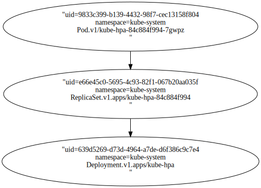
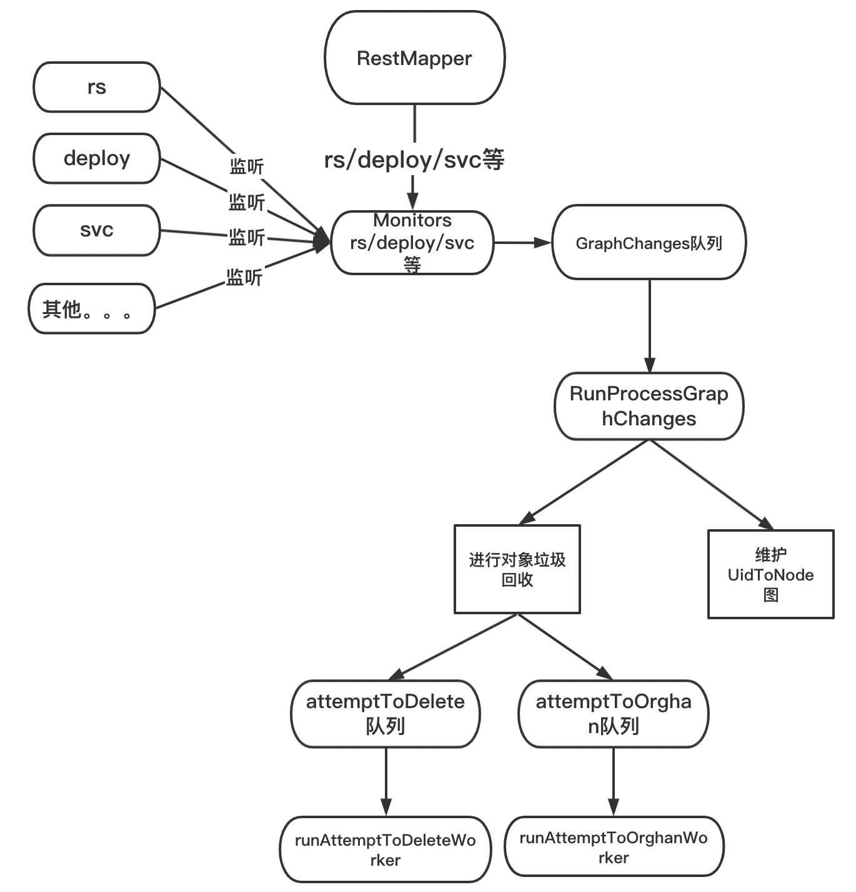

Table of Contents
=================

  * [1. K8s 的垃圾回收策略](#1-k8s-的垃圾回收策略)
  * [2 gc 源码分析](#2-gc-源码分析)
     * [2.1 初始化 garbageCollector 对象](#21-初始化-garbagecollector-对象)
        * [2.1.1 garbageCollector包含的结构体对象](#211-garbagecollector包含的结构体对象)
        * [2.1.2 NewGarbageCollector](#212-newgarbagecollector)
     * [2.2 启动garbageCollector](#22-启动garbagecollector)
        * [2.2.1 启动dependencyGraphBuilder](#221-启动dependencygraphbuilder)
        * [2.2.2 runAttemptToDeleteWorker](#222-runattempttodeleteworker)
        * [2.2.3 runAttemptToOrphanWorker](#223-runattempttoorphanworker)
        * [2.2.4 总结](#224-总结)
     * [2.3  runProcessGraphChanges](#23--runprocessgraphchanges)
     * [2.4 processTransitions函数的处理逻辑](#24-processtransitions函数的处理逻辑)
     * [2.5 runAttemptToOrphanWorker](#25-runattempttoorphanworker)
     * [2.6 attemptToDeleteWorker](#26-attempttodeleteworker)
     * [2.7 uidToNode到底是什么](#27-uidtonode到底是什么)
  * [3.总结](#3总结)

### 1. K8s 的垃圾回收策略

k8s目前支持三种回收策略：

**（1）前台级联删除（Foreground Cascading Deletion）**：在这种删除策略中，所有者对象的删除将会持续到其所有从属对象都被删除为止。当所有者被删除时，会进入“正在删除”（deletion in progress）状态，此时：

* 对象仍然可以通过 REST API 查询到（可通过 kubectl 或 kuboard 查询到）
* 对象的 deletionTimestamp 字段被设置
* 对象的 metadata.finalizers 包含值 foregroundDeletion

**（2）后台级联删除（Background Cascading Deletion）**：这种删除策略会简单很多，它会立即删除所有者的对象，并由垃圾回收器在后台删除其从属对象。这种方式比前台级联删除快的多，因为不用等待时间来删除从属对象。

**（3）孤儿（Orphan）**：这种情况下，对所有者的进行删除只会将其从集群中删除，并使所有对象处于“孤儿”状态。

举例：已有一个deployA, 对应的rs假设为 rsA,  pod为PodA。

（1）前台删除：先删除podA, 再删除rsA, 再删除deployA。  podA的删除如果卡在，rsA也会被卡住。

（2）后台删除：先删除deployA, 再删除rsA, 再删除podA。 podA和rsA是否会删除成功，deploy不会受影响。

（3）孤儿删除：只删除deployA。rsA, podA不受影响。 rsA的owner不再是deployA。

<br>

### 2 gc 源码分析

和deployController, rsController一样，GarbageCollectorController也是kube-controller-manager(kcm)中的一个控制器。

GarbageCollectorController 的启动方法为 `startGarbageCollectorController`，主要逻辑如下：

**从第三步开始每一步都深入展开。第三步对应2.1。**

（1）初始化客户端，用于发现集群中的资源。这个先不关注

（2）获得deletableResources，以及ignoredResources。

deletableResources： 所有支持"delete", "list", "watch" 操作的资源

ignoredResources：kcm启动时GarbageCollectorController的config指定

（3）初始化 garbageCollector 对象。 

（4）启动garbageCollector

（5）garbageCollector同步

（6）开启debug模式

```
func startGarbageCollectorController(ctx ControllerContext) (http.Handler, bool, error) {
  // 1.初始化客户端
	if !ctx.ComponentConfig.GarbageCollectorController.EnableGarbageCollector {
		return nil, false, nil
	}

	gcClientset := ctx.ClientBuilder.ClientOrDie("generic-garbage-collector")
	discoveryClient := cacheddiscovery.NewMemCacheClient(gcClientset.Discovery())

	config := ctx.ClientBuilder.ConfigOrDie("generic-garbage-collector")
	metadataClient, err := metadata.NewForConfig(config)
	if err != nil {
		return nil, true, err
	}

  // 2. 获得deletableResources，以及ignoredResources
	// Get an initial set of deletable resources to prime the garbage collector.
	deletableResources := garbagecollector.GetDeletableResources(discoveryClient)
	ignoredResources := make(map[schema.GroupResource]struct{})
	for _, r := range ctx.ComponentConfig.GarbageCollectorController.GCIgnoredResources {
		ignoredResources[schema.GroupResource{Group: r.Group, Resource: r.Resource}] = struct{}{}
	}
	
	// 3. NewGarbageCollector
	garbageCollector, err := garbagecollector.NewGarbageCollector(
		metadataClient,
		ctx.RESTMapper,
		deletableResources,
		ignoredResources,
		ctx.ObjectOrMetadataInformerFactory,
		ctx.InformersStarted,
	)
	if err != nil {
		return nil, true, fmt.Errorf("failed to start the generic garbage collector: %v", err)
	}

  // 4. 启动garbageCollector
	// Start the garbage collector.
	workers := int(ctx.ComponentConfig.GarbageCollectorController.ConcurrentGCSyncs)
	go garbageCollector.Run(workers, ctx.Stop)

	// Periodically refresh the RESTMapper with new discovery information and sync
	// the garbage collector.
	// 5. garbageCollector同步
	go garbageCollector.Sync(gcClientset.Discovery(), 30*time.Second, ctx.Stop)
  
  // 6. 开启debug模式
	return garbagecollector.NewDebugHandler(garbageCollector), true, nil
}
```

<br>

#### 2.1 初始化 garbageCollector 对象

##### 2.1.1 garbageCollector包含的结构体对象

 garbageCollector需要额外的结构：

attemptToDelete，attemptToOrphan：限速队列

uidToNode：一个缓存依赖关系的图。一个map结构，key=uid, value是一个node结构。

```
type GarbageCollector struct {
	restMapper     resettableRESTMapper
	metadataClient metadata.Interface
	attemptToDelete workqueue.RateLimitingInterface
	attemptToOrphan        workqueue.RateLimitingInterface
	dependencyGraphBuilder *GraphBuilder
	absentOwnerCache *UIDCache
	workerLock sync.RWMutex
}


// GraphBuilder: based on the events supplied by the informers, GraphBuilder updates
// uidToNode, a graph that caches the dependencies as we know, and enqueues
// items to the attemptToDelete and attemptToOrphan.
type GraphBuilder struct {
	restMapper meta.RESTMapper

  // 每一个monitor对应一种资源
	monitors    monitors
	monitorLock sync.RWMutex
	informersStarted <-chan struct{}

	stopCh <-chan struct{}

	running bool

	metadataClient metadata.Interface
 
	graphChanges workqueue.RateLimitingInterface

	uidToNode *concurrentUIDToNode
	attemptToDelete workqueue.RateLimitingInterface
	attemptToOrphan workqueue.RateLimitingInterface

	absentOwnerCache *UIDCache
	sharedInformers  controller.InformerFactory
	ignoredResources map[schema.GroupResource]struct{}
}

type concurrentUIDToNode struct {
	uidToNodeLock sync.RWMutex
	uidToNode     map[types.UID]*node
}

type node struct {
	identity objectReference
	dependentsLock sync.RWMutex
	dependents map[*node]struct{}            //该节点的所有依赖

	deletingDependents     bool
	deletingDependentsLock sync.RWMutex
	
	beingDeleted     bool
	beingDeletedLock sync.RWMutex

	virtual     bool
	virtualLock sync.RWMutex
	
	owners []metav1.OwnerReference         //该节点的所有owner
}
```

举例来说：

假设集群中有：deployA, rsA, podA三个对象。

monitors 负责监听这三种资源的变化。然后根据情况扔进 attemptToDelete，attemptToOrphan队列。

GraphBuilder负责构建一个图。在这种情况下，图的内容为：

Node1( key=deployA.uid ):   它的owner为空，dependents=rsA。

Node2( key=rsA.uid ):   它的owner=deployA，dependents=podA。

Node3( key=pod.uid ):   它的owner=rsA，dependents为空。

<br>

同时，每个节点还有beingDeleted，deletingDependents等关键字段。这样gc根据这个图就可以很方便地进行各种策略的删除。

##### 2.1.2 NewGarbageCollector

NewGarbageCollector就做了俩件事

（1）初始化GarbageCollector结构体

（2）调用controllerFor定义对象变化的处理事件。无论是监听到add, update, del都是将其打包成一个event事件，然后加入graphChanges队列。

```
func NewGarbageCollector(
	metadataClient metadata.Interface,
	mapper resettableRESTMapper,
	deletableResources map[schema.GroupVersionResource]struct{},
	ignoredResources map[schema.GroupResource]struct{},
	sharedInformers controller.InformerFactory,
	informersStarted <-chan struct{},
) (*GarbageCollector, error) {
	attemptToDelete := workqueue.NewNamedRateLimitingQueue(workqueue.DefaultControllerRateLimiter(), "garbage_collector_attempt_to_delete")
	attemptToOrphan := workqueue.NewNamedRateLimitingQueue(workqueue.DefaultControllerRateLimiter(), "garbage_collector_attempt_to_orphan")
	absentOwnerCache := NewUIDCache(500)
	gc := &GarbageCollector{
		metadataClient:   metadataClient,
		restMapper:       mapper,
		attemptToDelete:  attemptToDelete,
		attemptToOrphan:  attemptToOrphan,
		absentOwnerCache: absentOwnerCache,
	}
	gb := &GraphBuilder{
		metadataClient:   metadataClient,
		informersStarted: informersStarted,
		restMapper:       mapper,
		graphChanges:     workqueue.NewNamedRateLimitingQueue(workqueue.DefaultControllerRateLimiter(), "garbage_collector_graph_changes"),
		uidToNode: &concurrentUIDToNode{
			uidToNode: make(map[types.UID]*node),
		},
		attemptToDelete:  attemptToDelete,
		attemptToOrphan:  attemptToOrphan,
		absentOwnerCache: absentOwnerCache,
		sharedInformers:  sharedInformers,
		ignoredResources: ignoredResources,
	}
	
	// 
	if err := gb.syncMonitors(deletableResources); err != nil {
		utilruntime.HandleError(fmt.Errorf("failed to sync all monitors: %v", err))
	}
	gc.dependencyGraphBuilder = gb

	return gc, nil
}
```

<br>

syncMonitors就是同步更新哪些资源需要监听，然后调用controllerFor注册事件处理。

```
func (gb *GraphBuilder) syncMonitors(resources map[schema.GroupVersionResource]struct{}) error {
	gb.monitorLock.Lock()
	defer gb.monitorLock.Unlock()

	toRemove := gb.monitors
	if toRemove == nil {
		toRemove = monitors{}
	}
	current := monitors{}
	errs := []error{}
	kept := 0
	added := 0
	for resource := range resources {
		if _, ok := gb.ignoredResources[resource.GroupResource()]; ok {
			continue
		}
		if m, ok := toRemove[resource]; ok {
			current[resource] = m
			delete(toRemove, resource)
			kept++
			continue
		}
		kind, err := gb.restMapper.KindFor(resource)
		if err != nil {
			errs = append(errs, fmt.Errorf("couldn't look up resource %q: %v", resource, err))
			continue
		}
		c, s, err := gb.controllerFor(resource, kind)
		if err != nil {
			errs = append(errs, fmt.Errorf("couldn't start monitor for resource %q: %v", resource, err))
			continue
		}
		current[resource] = &monitor{store: s, controller: c}
		added++
	}
	gb.monitors = current

	for _, monitor := range toRemove {
		if monitor.stopCh != nil {
			close(monitor.stopCh)
		}
	}

	klog.V(4).Infof("synced monitors; added %d, kept %d, removed %d", added, kept, len(toRemove))
	// NewAggregate returns nil if errs is 0-length
	return utilerrors.NewAggregate(errs)
}
```

controllerFor无论是监听到add, update, del都是将其打包成一个event事件，然后加入graphChanges队列。

```
func (gb *GraphBuilder) controllerFor(resource schema.GroupVersionResource, kind schema.GroupVersionKind) (cache.Controller, cache.Store, error) {
   handlers := cache.ResourceEventHandlerFuncs{
      // add the event to the dependencyGraphBuilder's graphChanges.
      AddFunc: func(obj interface{}) {
         event := &event{
            eventType: addEvent,
            obj:       obj,
            gvk:       kind,
         }
         gb.graphChanges.Add(event)
      },
      UpdateFunc: func(oldObj, newObj interface{}) {
         // TODO: check if there are differences in the ownerRefs,
         // finalizers, and DeletionTimestamp; if not, ignore the update.
         event := &event{
            eventType: updateEvent,
            obj:       newObj,
            oldObj:    oldObj,
            gvk:       kind,
         }
         gb.graphChanges.Add(event)
      },
      DeleteFunc: func(obj interface{}) {
         // delta fifo may wrap the object in a cache.DeletedFinalStateUnknown, unwrap it
         if deletedFinalStateUnknown, ok := obj.(cache.DeletedFinalStateUnknown); ok {
            obj = deletedFinalStateUnknown.Obj
         }
         event := &event{
            eventType: deleteEvent,
            obj:       obj,
            gvk:       kind,
         }
         gb.graphChanges.Add(event)
      },
   }
   shared, err := gb.sharedInformers.ForResource(resource)
   if err != nil {
      klog.V(4).Infof("unable to use a shared informer for resource %q, kind %q: %v", resource.String(), kind.String(), err)
      return nil, nil, err
   }
   klog.V(4).Infof("using a shared informer for resource %q, kind %q", resource.String(), kind.String())
   // need to clone because it's from a shared cache
   shared.Informer().AddEventHandlerWithResyncPeriod(handlers, ResourceResyncTime)
   return shared.Informer().GetController(), shared.Informer().GetStore(), nil
}
```

<br>

#### 2.2 启动garbageCollector

```
func (gc *GarbageCollector) Run(workers int, stopCh <-chan struct{}) {
   defer utilruntime.HandleCrash()
   defer gc.attemptToDelete.ShutDown()
   defer gc.attemptToOrphan.ShutDown()
   defer gc.dependencyGraphBuilder.graphChanges.ShutDown()

   klog.Infof("Starting garbage collector controller")
   defer klog.Infof("Shutting down garbage collector controller")
   
   // 1.启动dependencyGraphBuilder
   go gc.dependencyGraphBuilder.Run(stopCh)

   if !cache.WaitForNamedCacheSync("garbage collector", stopCh, gc.dependencyGraphBuilder.IsSynced) {
      return
   }

   klog.Infof("Garbage collector: all resource monitors have synced. Proceeding to collect garbage")
   
   // 启动runAttemptToDeleteWorker，runAttemptToOrphanWorker
   // gc workers
   for i := 0; i < workers; i++ {
      go wait.Until(gc.runAttemptToDeleteWorker, 1*time.Second, stopCh)
      go wait.Until(gc.runAttemptToOrphanWorker, 1*time.Second, stopCh)
   }

   <-stopCh
}
```

<br>

##### 2.2.1 启动dependencyGraphBuilder

```
// Run sets the stop channel and starts monitor execution until stopCh is
// closed. Any running monitors will be stopped before Run returns.
func (gb *GraphBuilder) Run(stopCh <-chan struct{}) {
	klog.Infof("GraphBuilder running")
	defer klog.Infof("GraphBuilder stopping")

	// Set up the stop channel.
	gb.monitorLock.Lock()
	gb.stopCh = stopCh
	gb.running = true
	gb.monitorLock.Unlock()

	// Start monitors and begin change processing until the stop channel is
	// closed.
	// 1. 启动各个资源的监听
	gb.startMonitors()
	// 2. runProcessGraphChanges开始处理各种事件
	wait.Until(gb.runProcessGraphChanges, 1*time.Second, stopCh)

  // 这里就是有monitor关闭后的处理
	// Stop any running monitors.
	gb.monitorLock.Lock()
	defer gb.monitorLock.Unlock()
	monitors := gb.monitors
	stopped := 0
	for _, monitor := range monitors {
		if monitor.stopCh != nil {
			stopped++
			close(monitor.stopCh)
		}
	}

	// reset monitors so that the graph builder can be safely re-run/synced.
	gb.monitors = nil
	klog.Infof("stopped %d of %d monitors", stopped, len(monitors))
}


// 启动各个资源的监听
func (gb *GraphBuilder) startMonitors() {
	gb.monitorLock.Lock()
	defer gb.monitorLock.Unlock()

	if !gb.running {
		return
	}

	// we're waiting until after the informer start that happens once all the controllers are initialized.  This ensures
	// that they don't get unexpected events on their work queues.
	<-gb.informersStarted

	monitors := gb.monitors
	started := 0
	for _, monitor := range monitors {
		if monitor.stopCh == nil {
			monitor.stopCh = make(chan struct{})
			gb.sharedInformers.Start(gb.stopCh)
			go monitor.Run()
			started++
		}
	}
	klog.V(4).Infof("started %d new monitors, %d currently running", started, len(monitors))
}
```

<br>

##### 2.2.2 runAttemptToDeleteWorker

runAttemptToDeleteWorker就是从attemptToDelete队列中取出来一个对象处理。

```
func (gc *GarbageCollector) runAttemptToDeleteWorker() {
   for gc.attemptToDeleteWorker() {
   }
}

func (gc *GarbageCollector) attemptToDeleteWorker() bool {
   item, quit := gc.attemptToDelete.Get()
   ...
   err := gc.attemptToDeleteItem(n)
   ...
   return true
}
```

##### 2.2.3 runAttemptToOrphanWorker

runAttemptToOrphanWorker就是从attemptToOrphan队列中取出来一个对象处理。

```
func (gc *GarbageCollector) runAttemptToOrphanWorker() {
   for gc.attemptToOrphanWorker() {
   }
}


func (gc *GarbageCollector) attemptToOrphanWorker() bool {
   item, quit := gc.attemptToOrphan.Get()
  
   defer gc.attemptToOrphan.Done(item)
   owner, ok := item.(*node)
   if !ok {
      utilruntime.HandleError(fmt.Errorf("expect *node, got %#v", item))
      return true
   }
   // we don't need to lock each element, because they never get updated
   owner.dependentsLock.RLock()
   dependents := make([]*node, 0, len(owner.dependents))
   for dependent := range owner.dependents {
      dependents = append(dependents, dependent)
   }
   owner.dependentsLock.RUnlock()

   err := gc.orphanDependents(owner.identity, dependents)
   if err != nil {
      utilruntime.HandleError(fmt.Errorf("orphanDependents for %s failed with %v", owner.identity, err))
      gc.attemptToOrphan.AddRateLimited(item)
      return true
   }
   // update the owner, remove "orphaningFinalizer" from its finalizers list
   err = gc.removeFinalizer(owner, metav1.FinalizerOrphanDependents)
   if err != nil {
      utilruntime.HandleError(fmt.Errorf("removeOrphanFinalizer for %s failed with %v", owner.identity, err))
      gc.attemptToOrphan.AddRateLimited(item)
   }
   return true
}
```

<br>

##### 2.2.4 总结

（1）NewGarbageCollector初始化了graphbuild, attempToDelete, attempToOrphan队列，然后定义了资源变化时的处理对象

（2）GarbageCollector.run  做了三个工作。`第一是`， 让监控的所有资源，都用一个处理逻辑。就是：add, update, del都是将其打包成一个event事件，然后加入graphChanges队列。`第二是` ，启动runProcessGraphChanges处理graphChanges队列的对象。`第三是`， 启动AttemptToOrphanWorker，AttemptToDeleteWorker进行gc处理。

（3）到这里，总的来说逻辑就是：

* NewGarbageCollector监听了所有支持 list, watch, delete操作的事件
* 然后定义这些对象所有的add, update, del变化都扔进 graphChanges队列
* 然后启动runProcessGraphChanges，处理graphChanges的对象。runProcessGraphChanges主要做俩件事，一是维护图，二是将可能需要删除的对象，扔进 AttemptToOrphan，或者AttemptToDelete进行处理
* AttemptToOrphanWorker，AttemptToDeleteWorker进行具体的gc处理。

<br>

到这里为止，gc的初始化，以及大概的流程都清楚了。接下来具体分析runProcessGraphChanges函数，以及AttemptToOrphanWorker，AttemptToDeleteWorker的处理逻辑。

<br>

#### 2.3  runProcessGraphChanges

runProcessGraphChanges作用就是俩件事：

（1）时刻uidToNode维护图的正确和完整

（2）将可能需要删除的对象扔进AttemptToOrphan，AttemptToDelete队列

**具体逻辑如下：**

（1）从 graphChanges 取出一个 对象（event），然后判断图里面有没有这个对象。如果存在，将该节点标记为 observed。这个是表示，这个节点不是virtual节点。

（2）分三种情况进行处理。具体是：

```
func (gb *GraphBuilder) runProcessGraphChanges() {
	for gb.processGraphChanges() {
	}
}

// Dequeueing an event from graphChanges, updating graph, populating dirty_queue.
func (gb *GraphBuilder) processGraphChanges() bool {
	item, quit := gb.graphChanges.Get()
	if quit {
		return false
	}
	defer gb.graphChanges.Done(item)
	event, ok := item.(*event)
	if !ok {
		utilruntime.HandleError(fmt.Errorf("expect a *event, got %v", item))
		return true
	}
	obj := event.obj
	accessor, err := meta.Accessor(obj)
	if err != nil {
		utilruntime.HandleError(fmt.Errorf("cannot access obj: %v", err))
		return true
	}
	klog.V(5).Infof("GraphBuilder process object: %s/%s, namespace %s, name %s, uid %s, event type %v", event.gvk.GroupVersion().String(), event.gvk.Kind, accessor.GetNamespace(), accessor.GetName(), string(accessor.GetUID()), event.eventType)
	// Check if the node already exists
	
  // 1.判断图里面有没有这个对象
	existingNode, found := gb.uidToNode.Read(accessor.GetUID())
	// 1.1 如果存在，将其标记为 observed。这个是表示，这个节点不是virtual节点。
	if found {
		// this marks the node as having been observed via an informer event
		// 1. this depends on graphChanges only containing add/update events from the actual informer
		// 2. this allows things tracking virtual nodes' existence to stop polling and rely on informer events
		existingNode.markObserved()
	}
	
	// 2. 分三种情况进行处理。
	switch {
	case (event.eventType == addEvent || event.eventType == updateEvent) && !found:
		newNode := &node{
			identity: objectReference{
				OwnerReference: metav1.OwnerReference{
					APIVersion: event.gvk.GroupVersion().String(),
					Kind:       event.gvk.Kind,
					UID:        accessor.GetUID(),
					Name:       accessor.GetName(),
				},
				Namespace: accessor.GetNamespace(),
			},
			dependents:         make(map[*node]struct{}),
			owners:             accessor.GetOwnerReferences(),
			deletingDependents: beingDeleted(accessor) && hasDeleteDependentsFinalizer(accessor),
			beingDeleted:       beingDeleted(accessor),
		}
		gb.insertNode(newNode)
		// the underlying delta_fifo may combine a creation and a deletion into
		// one event, so we need to further process the event.
		gb.processTransitions(event.oldObj, accessor, newNode)
	case (event.eventType == addEvent || event.eventType == updateEvent) && found:
		// handle changes in ownerReferences
		added, removed, changed := referencesDiffs(existingNode.owners, accessor.GetOwnerReferences())
		if len(added) != 0 || len(removed) != 0 || len(changed) != 0 {
			// check if the changed dependency graph unblock owners that are
			// waiting for the deletion of their dependents.
			gb.addUnblockedOwnersToDeleteQueue(removed, changed)
			// update the node itself
			existingNode.owners = accessor.GetOwnerReferences()
			// Add the node to its new owners' dependent lists.
			gb.addDependentToOwners(existingNode, added)
			// remove the node from the dependent list of node that are no longer in
			// the node's owners list.
			gb.removeDependentFromOwners(existingNode, removed)
		}

		if beingDeleted(accessor) {
			existingNode.markBeingDeleted()
		}
		gb.processTransitions(event.oldObj, accessor, existingNode)
	case event.eventType == deleteEvent:
		if !found {
			klog.V(5).Infof("%v doesn't exist in the graph, this shouldn't happen", accessor.GetUID())
			return true
		}
		// removeNode updates the graph
		gb.removeNode(existingNode)
		existingNode.dependentsLock.RLock()
		defer existingNode.dependentsLock.RUnlock()
		if len(existingNode.dependents) > 0 {
			gb.absentOwnerCache.Add(accessor.GetUID())
		}
		for dep := range existingNode.dependents {
			gb.attemptToDelete.Add(dep)
		}
		for _, owner := range existingNode.owners {
			ownerNode, found := gb.uidToNode.Read(owner.UID)
			if !found || !ownerNode.isDeletingDependents() {
				continue
			}
			// this is to let attempToDeleteItem check if all the owner's
			// dependents are deleted, if so, the owner will be deleted.
			gb.attemptToDelete.Add(ownerNode)
		}
	}
	return true
}
```

<br>

**第一种：** 如果图中不存在这个节点，并且事件为 add或者update，处理方法为：

(1) 初始化一个node节点。然后插入到map中。

```
case (event.eventType == addEvent || event.eventType == updateEvent) && !found:
		newNode := &node{
		  // 该对象的标记，由APIVersion，Kind，UID，Name
			identity: objectReference{
				OwnerReference: metav1.OwnerReference{
					APIVersion: event.gvk.GroupVersion().String(),
					Kind:       event.gvk.Kind,
					UID:        accessor.GetUID(),
					Name:       accessor.GetName(),
				},
				Namespace: accessor.GetNamespace(),
			},
			dependents:         make(map[*node]struct{}),          // 这里现在是空的
			owners:             accessor.GetOwnerReferences(),
			// 判断是否是删dependent
			deletingDependents: beingDeleted(accessor) && hasDeleteDependentsFinalizer(accessor),   
			// 判断是否在正在删除
			beingDeleted:       beingDeleted(accessor),
		}
		gb.insertNode(newNode)
		// the underlying delta_fifo may combine a creation and a deletion into
		// one event, so we need to further process the event.
		gb.processTransitions(event.oldObj, accessor, newNode)
```

（2）insertNode，将这个节点加入map中，并且将这个node加入所有的owner node的dependent中。

假设当前是当前节点是rsA, 这一步会将rsA加入map中，并且增加deployA的一个dependent为rsA.

（3）调用processTransitions进行进一步的处理。processTransitions是一个通用函数，它的作用就是将这个对象放入放到AttemptToOrphan或者AttemptToDelete队列，这个等下具体介绍

<br>

**第二种**，  如果图中存在这个节点，并且事件为 add或者update，处理方法为：

（1）处理references Diff

* 首先根据节点的信息 和 对象最新的信息，判断OwnerReference的变化。这里分为三种变化：

  added 表示该对象的OwnerReference中新增了哪些 owner;  removed表示该对象删除了哪些owner；changed表示哪些改变了

* 针对这三种变化做出的处理如下：

  a. 调用addUnblockedOwnersToDeleteQueue将可能阻塞的owner重新加入队列。具体可以看代码注释中的分析

  b. existingNode.owners = accessor.GetOwnerReferences(), 让节点使用最新的owner

  c. 新增了owner，需要在新增owner中的Dependents增加一个Dependent, 就是该节点

  d. 删除了owner，需要在原来的owner中的Dependents删除这个Dependent, 就是该节点

（2） 如果当前对象有deletionStamp，标记这个节点正在删除

（3）调用processTransitions进行进一步的处理。processTransitions是一个通用函数，它的作用就是将这个对象放入放到AttemptToOrphan或者AttemptToDelete队列，这个等下具体介绍

```
case (event.eventType == addEvent || event.eventType == updateEvent) && found:
		// handle changes in ownerReferences
		added, removed, changed := referencesDiffs(existingNode.owners, accessor.GetOwnerReferences())
		if len(added) != 0 || len(removed) != 0 || len(changed) != 0 {
			// check if the changed dependency graph unblock owners that are
			// waiting for the deletion of their dependents.
			// a.调用addUnblockedOwnersToDeleteQueue将可能阻塞的owner重新加入队列。具体可以看代码注释中的分析
			gb.addUnblockedOwnersToDeleteQueue(removed, changed)
			// update the node itself
			// b.让节点使用最新的owner
			existingNode.owners = accessor.GetOwnerReferences()
			// Add the node to its new owners' dependent lists.
			// c. 新增了owner，需要在新增owner中的Dependents增加一个Dependent, 就是该节点
			gb.addDependentToOwners(existingNode, added)
			// remove the node from the dependent list of node that are no longer in
			// the node's owners list.
			// d. 删除了owner，需要在原来的owner中的Dependents删除这个Dependent, 就是该节点
			gb.removeDependentFromOwners(existingNode, removed)
		}
    
		if beingDeleted(accessor) {
			existingNode.markBeingDeleted()
		}
		gb.processTransitions(event.oldObj, accessor, existingNode)
		
		

// TODO: profile this function to see if a naive N^2 algorithm performs better
// when the number of references is small.
func referencesDiffs(old []metav1.OwnerReference, new []metav1.OwnerReference) (added []metav1.OwnerReference, removed []metav1.OwnerReference, changed []ownerRefPair) {
   oldUIDToRef := make(map[string]metav1.OwnerReference)
   for _, value := range old {
      oldUIDToRef[string(value.UID)] = value
   }
   oldUIDSet := sets.StringKeySet(oldUIDToRef)
   for _, value := range new {
      newUID := string(value.UID)
      if oldUIDSet.Has(newUID) {
         if !reflect.DeepEqual(oldUIDToRef[newUID], value) {
            changed = append(changed, ownerRefPair{oldRef: oldUIDToRef[newUID], newRef: value})
         }
         oldUIDSet.Delete(newUID)
      } else {
         added = append(added, value)
      }
   }
   for oldUID := range oldUIDSet {
      removed = append(removed, oldUIDToRef[oldUID])
   }

   return added, removed, changed
}


// 以foreground方式删除deployA的时候，deployA会被Block，原因在于它在等 rsA的删除。
// 这个时候如果改变rsA的OwnerReference，比如删除owner, deployA。这个时候需要通知deployA,你不用等了，可以直接删除了。
// addUnblockedOwnersToDeleteQueue就是做这样的事情，检测到rsA的OwnerReference变化，将等待的deployA加入删除队列。
// if an blocking ownerReference points to an object gets removed, or gets set to
// "BlockOwnerDeletion=false", add the object to the attemptToDelete queue.
func (gb *GraphBuilder) addUnblockedOwnersToDeleteQueue(removed []metav1.OwnerReference, changed []ownerRefPair) {
	for _, ref := range removed {
		if ref.BlockOwnerDeletion != nil && *ref.BlockOwnerDeletion {
			node, found := gb.uidToNode.Read(ref.UID)
			if !found {
				klog.V(5).Infof("cannot find %s in uidToNode", ref.UID)
				continue
			}
			gb.attemptToDelete.Add(node)
		}
	}
	for _, c := range changed {
		wasBlocked := c.oldRef.BlockOwnerDeletion != nil && *c.oldRef.BlockOwnerDeletion
		isUnblocked := c.newRef.BlockOwnerDeletion == nil || (c.newRef.BlockOwnerDeletion != nil && !*c.newRef.BlockOwnerDeletion)
		if wasBlocked && isUnblocked {
			node, found := gb.uidToNode.Read(c.newRef.UID)
			if !found {
				klog.V(5).Infof("cannot find %s in uidToNode", c.newRef.UID)
				continue
			}
			gb.attemptToDelete.Add(node)
		}
	}
}
```

<br>

**第三种**，这个对象已经删除, 处理方法为：

（1）从图中删除这个节点，如果这个节点有dependents，将这个节点加入absentOwnerCache。这个是非常有用的。假如deployA删除了，rsA通过absentOwnerCache能判断，deployA确实存在，并且被删除了。

（2）将所有的依赖加入attemptToDelete队列

（3）如果这个节点有owners，并且处于删除Dependents中，那么很有可能它的owners正在等自己。现在自己删除了，所以将owners再加入删除队列

```
case event.eventType == deleteEvent:
		if !found {
			klog.V(5).Infof("%v doesn't exist in the graph, this shouldn't happen", accessor.GetUID())
			return true
		}
		// removeNode updates the graph
		gb.removeNode(existingNode)
		existingNode.dependentsLock.RLock()
		defer existingNode.dependentsLock.RUnlock()
		if len(existingNode.dependents) > 0 {
			gb.absentOwnerCache.Add(accessor.GetUID())
		}
		for dep := range existingNode.dependents {
			gb.attemptToDelete.Add(dep)
		}
		for _, owner := range existingNode.owners {
			ownerNode, found := gb.uidToNode.Read(owner.UID)
			if !found || !ownerNode.isDeletingDependents() {
				continue
			}
			// this is to let attempToDeleteItem check if all the owner's
			// dependents are deleted, if so, the owner will be deleted.
			gb.attemptToDelete.Add(ownerNode)
		}
	}
```

<br>

#### 2.4 processTransitions函数的处理逻辑

从上面的分析，可以看出来，runProcessGraphChanges就做了两件事情：

（1）时刻维护图的正确和完整

（2）将可能需要删除的对象扔进AttemptToOrphan，AttemptToDelete队列

processTransitions就是做第二件事情，将可能需要删除的对象扔进AttemptToOrphan，AttemptToDelete队列。

判断的逻辑很简单：

（1）如果这个对象正在删除，并且有orphan这个Finalizer，就将它扔进attemptToOrphan队列

（1）如果这个对象正在删除，并且有foregroundDeletion这个Finalizer，就将它和它的dependents扔进attemptToDelete

```
func (gb *GraphBuilder) processTransitions(oldObj interface{}, newAccessor metav1.Object, n *node) {

	if startsWaitingForDependentsOrphaned(oldObj, newAccessor) {
		klog.V(5).Infof("add %s to the attemptToOrphan", n.identity)
		gb.attemptToOrphan.Add(n)
		return
	}
	
	if startsWaitingForDependentsDeleted(oldObj, newAccessor) {
		klog.V(2).Infof("add %s to the attemptToDelete, because it's waiting for its dependents to be deleted", n.identity)
		// if the n is added as a "virtual" node, its deletingDependents field is not properly set, so always set it here.
		n.markDeletingDependents()
		for dep := range n.dependents {
			gb.attemptToDelete.Add(dep)
		}
		gb.attemptToDelete.Add(n)
	}
}
```

<br>

#### 2.5 runAttemptToOrphanWorker

runAttemptToOrphanWorker逻辑如下：

（1）获得这个节点的所有orphanDependents

（2）调用orphanDependents，删除它的orphanDependents的OwnerReferences。

（3）删除orphan这个Finalizer,让该对象可以被删除

```
func (gc *GarbageCollector) runAttemptToOrphanWorker() {
   for gc.attemptToOrphanWorker() {
   }
}

// attemptToOrphanWorker dequeues a node from the attemptToOrphan, then finds its
// dependents based on the graph maintained by the GC, then removes it from the
// OwnerReferences of its dependents, and finally updates the owner to remove
// the "Orphan" finalizer. The node is added back into the attemptToOrphan if any of
// these steps fail.
func (gc *GarbageCollector) attemptToOrphanWorker() bool {
   item, quit := gc.attemptToOrphan.Get()
   gc.workerLock.RLock()
   defer gc.workerLock.RUnlock()
   if quit {
      return false
   }
   defer gc.attemptToOrphan.Done(item)
   owner, ok := item.(*node)
   if !ok {
      utilruntime.HandleError(fmt.Errorf("expect *node, got %#v", item))
      return true
   }
   // we don't need to lock each element, because they never get updated
   owner.dependentsLock.RLock()
   dependents := make([]*node, 0, len(owner.dependents))
   // 1.获得这个节点的所有orphanDependents
   for dependent := range owner.dependents {
      dependents = append(dependents, dependent)
   }
   owner.dependentsLock.RUnlock()
   
   // 2.调用orphanDependents，删除它的orphanDependents的OwnerReferences。
   // 举例来说，删除deployA时，删除rsA的OwnerReference，这样rsA就不受deployA控制了。
   err := gc.orphanDependents(owner.identity, dependents)
   if err != nil {
      utilruntime.HandleError(fmt.Errorf("orphanDependents for %s failed with %v", owner.identity, err))
      gc.attemptToOrphan.AddRateLimited(item)
      return true
   }
   // update the owner, remove "orphaningFinalizer" from its finalizers list
   // 3. 删除orphan这个Finalizer,让deployA可以被删除
   err = gc.removeFinalizer(owner, metav1.FinalizerOrphanDependents)
   if err != nil {
      utilruntime.HandleError(fmt.Errorf("removeOrphanFinalizer for %s failed with %v", owner.identity, err))
      gc.attemptToOrphan.AddRateLimited(item)
   }
   return true
}
```

<br>

#### 2.6 attemptToDeleteWorker

主要调用attemptToDeleteItem函数。attemptToDeleteItem的逻辑如下：

（1）如果该对象isBeingDeleted,并且没有在删除Dependents，直接返回

（2）如果该对象正在删除dependents, 将dependents加入attemptToDelete队列

（3）调用classifyReferences，计算solid，dangling，waitingForDependentsDeletion的情况，solid，dangling，waitingForDependentsDeletion是OwnerReferences数组

solid：当前节点的owner存在，并且owner的状态不是删除Dependents中

dangling：owner不存在

waitingForDependentsDeletion：owner存在，并且owner的状态是删除Dependents中

（4）根据solid，dangling，waitingForDependentsDeletion的情况进行不同的处理，具体如下：

*  情况1: 如果有至少有一个owner存在，并且不处于删除依赖中。这个时候判断dangling，waitingForDependentsDeletion的数量是否为0。如果为0，说明当前不需要处理；否则，将该节点对应dangling，waitingForDependentsDeletion的节点删除dependents。
* 情况2: 到这里说明 len(solid)=0，这个时候如果有节点在等待这个节点删除，并且这个节点还有依赖，那么将这个节点的blockOwnerDeletion设置为true。然后后台删除这个节点。
  这里举一个例子说明：当前台模式删除deployA时，rsA是当前要处理的节点。这个时候rsA发现deployA再等自己删除，但是自己又有依赖podA，所以这里马上将自己设置为前台删除。这样在deployA看来就实现了先删除podA, 再删除rsA，再删除deployA。
* 情况3: 除了上面的两种情况，根据设置的删除策略删除这个节点。

​       这里举一个例子说明：当后台模式删除deployA时，rsA是当前要处理的节点。这个时候deployA已经删除了，同时没有finalizer，因为只有Orphan, foreGround有finalizer，所以这个时候直接默认以background删除这个节点。

```
func (gc *GarbageCollector) attemptToDeleteWorker() bool {
   item, quit := gc.attemptToDelete.Get()

   err := gc.attemptToDeleteItem(n)

   return true
}


func (gc *GarbageCollector) attemptToDeleteItem(item *node) error {
	klog.V(2).Infof("processing item %s", item.identity)
	// "being deleted" is an one-way trip to the final deletion. We'll just wait for the final deletion, and then process the object's dependents.
	// 1.如果该对象isBeingDeleted,并且没有在删除Dependents，直接返回
	if item.isBeingDeleted() && !item.isDeletingDependents() {
		klog.V(5).Infof("processing item %s returned at once, because its DeletionTimestamp is non-nil", item.identity)
		return nil
	}
	// TODO: It's only necessary to talk to the API server if this is a
	// "virtual" node. The local graph could lag behind the real status, but in
	// practice, the difference is small.
	latest, err := gc.getObject(item.identity)
	switch {
	case errors.IsNotFound(err):
		// the GraphBuilder can add "virtual" node for an owner that doesn't
		// exist yet, so we need to enqueue a virtual Delete event to remove
		// the virtual node from GraphBuilder.uidToNode.
		klog.V(5).Infof("item %v not found, generating a virtual delete event", item.identity)
		gc.dependencyGraphBuilder.enqueueVirtualDeleteEvent(item.identity)
		// since we're manually inserting a delete event to remove this node,
		// we don't need to keep tracking it as a virtual node and requeueing in attemptToDelete
		item.markObserved()
		return nil
	case err != nil:
		return err
	}

	if latest.GetUID() != item.identity.UID {
		klog.V(5).Infof("UID doesn't match, item %v not found, generating a virtual delete event", item.identity)
		gc.dependencyGraphBuilder.enqueueVirtualDeleteEvent(item.identity)
		// since we're manually inserting a delete event to remove this node,
		// we don't need to keep tracking it as a virtual node and requeueing in attemptToDelete
		item.markObserved()
		return nil
	}

	// TODO: attemptToOrphanWorker() routine is similar. Consider merging
	// attemptToOrphanWorker() into attemptToDeleteItem() as well.
	// 2. 如果该对象正在删除dependents, 将dependents加入attemptToDelete队列
	if item.isDeletingDependents() {
		return gc.processDeletingDependentsItem(item)
	}
  
	// compute if we should delete the item
	ownerReferences := latest.GetOwnerReferences()
	if len(ownerReferences) == 0 {
		klog.V(2).Infof("object %s's doesn't have an owner, continue on next item", item.identity)
		return nil
	}
  
  // 3.计算solid，dangling，waitingForDependentsDeletion的情况。
	solid, dangling, waitingForDependentsDeletion, err := gc.classifyReferences(item, ownerReferences)
	if err != nil {
		return err
	}
	klog.V(5).Infof("classify references of %s.\nsolid: %#v\ndangling: %#v\nwaitingForDependentsDeletion: %#v\n", item.identity, solid, dangling, waitingForDependentsDeletion)


  // 4.根据solid，dangling，waitingForDependentsDeletion的情况进行不同的处理
	switch {
	// 情况1: 如果有至少有一个owner存在，并且不处于删除依赖中。这个时候判断dangling，waitingForDependentsDeletion的数量是否为0。如果为0，说明当前不需要处理；否则，将该节点对应dangling，waitingForDependentsDeletion的节点删除dependents。
	case len(solid) != 0:
		klog.V(2).Infof("object %#v has at least one existing owner: %#v, will not garbage collect", item.identity, solid)
		if len(dangling) == 0 && len(waitingForDependentsDeletion) == 0 {
			return nil
		}
		klog.V(2).Infof("remove dangling references %#v and waiting references %#v for object %s", dangling, waitingForDependentsDeletion, item.identity)
		// waitingForDependentsDeletion needs to be deleted from the
		// ownerReferences, otherwise the referenced objects will be stuck with
		// the FinalizerDeletingDependents and never get deleted.
		ownerUIDs := append(ownerRefsToUIDs(dangling), ownerRefsToUIDs(waitingForDependentsDeletion)...)
		patch := deleteOwnerRefStrategicMergePatch(item.identity.UID, ownerUIDs...)
		_, err = gc.patch(item, patch, func(n *node) ([]byte, error) {
			return gc.deleteOwnerRefJSONMergePatch(n, ownerUIDs...)
		})
		return err
	// 情况2: 到这里说明 len(solid)=0，这个时候如果有节点在等待这个节点删除，并且这个节点还有依赖，那么将这个节点的blockOwnerDeletion设置为true。然后后台删除这个节点。
	case len(waitingForDependentsDeletion) != 0 && item.dependentsLength() != 0:
		deps := item.getDependents()
		for _, dep := range deps {
			if dep.isDeletingDependents() {
				// this circle detection has false positives, we need to
				// apply a more rigorous detection if this turns out to be a
				// problem.
				// there are multiple workers run attemptToDeleteItem in
				// parallel, the circle detection can fail in a race condition.
				klog.V(2).Infof("processing object %s, some of its owners and its dependent [%s] have FinalizerDeletingDependents, to prevent potential cycle, its ownerReferences are going to be modified to be non-blocking, then the object is going to be deleted with Foreground", item.identity, dep.identity)
				patch, err := item.unblockOwnerReferencesStrategicMergePatch()
				if err != nil {
					return err
				}
				if _, err := gc.patch(item, patch, gc.unblockOwnerReferencesJSONMergePatch); err != nil {
					return err
				}
				break
			}
		}
		klog.V(2).Infof("at least one owner of object %s has FinalizerDeletingDependents, and the object itself has dependents, so it is going to be deleted in Foreground", item.identity)
		// the deletion event will be observed by the graphBuilder, so the item
		// will be processed again in processDeletingDependentsItem. If it
		// doesn't have dependents, the function will remove the
		// FinalizerDeletingDependents from the item, resulting in the final
		// deletion of the item.
		policy := metav1.DeletePropagationForeground
		return gc.deleteObject(item.identity, &policy)
	// 情况3: 除了上面的两种情况，根据设置的删除策略删除这个节点
	default:
		// item doesn't have any solid owner, so it needs to be garbage
		// collected. Also, none of item's owners is waiting for the deletion of
		// the dependents, so set propagationPolicy based on existing finalizers.
		var policy metav1.DeletionPropagation
		switch {
		case hasOrphanFinalizer(latest):
			// if an existing orphan finalizer is already on the object, honor it.
			policy = metav1.DeletePropagationOrphan
		case hasDeleteDependentsFinalizer(latest):
			// if an existing foreground finalizer is already on the object, honor it.
			policy = metav1.DeletePropagationForeground
		default:
			// otherwise, default to background.
			policy = metav1.DeletePropagationBackground
		}
		klog.V(2).Infof("delete object %s with propagation policy %s", item.identity, policy)
		return gc.deleteObject(item.identity, &policy)
	}
}
```

<br>

#### 2.7 uidToNode到底是什么

在startGarbageCollectorController的时候 开启debug模式

```
return garbagecollector.NewDebugHandler(garbageCollector), true, nil
```

利用这个，我们可以看到uidToNode里的数据。数据太多，我这里就看 kube-system命名空间，kube-hpa这个deploy 在uidToNode的数据。

kcm对应的10252端口

```
。看这个
// 639d5269-d73d-4964-a7de-d6f386c9c7e4是kube-hpa这个deploy的uid。
# curl http://127.0.0.1:10252/debug/controllers/garbagecollector/graph?uid=639d5269-d73d-4964-a7de-d6f386c9c7e4
strict digraph full {
  // Node definitions.
  0 [
    label="\"uid=e66e45c0-5695-4c93-82f1-067b20aa035f\nnamespace=kube-system\nReplicaSet.v1.apps/kube-hpa-84c884f994\n\""
    group="apps"
    version="v1"
    kind="ReplicaSet"
    namespace="kube-system"
    name="kube-hpa-84c884f994"
    uid="e66e45c0-5695-4c93-82f1-067b20aa035f"
    missing="false"
    beingDeleted="false"
    deletingDependents="false"
    virtual="false"
  ];
  1 [
    label="\"uid=9833c399-b139-4432-98f7-cec13158f804\nnamespace=kube-system\nPod.v1/kube-hpa-84c884f994-7gwpz\n\""
    group=""
    version="v1"
    kind="Pod"
    namespace="kube-system"
    name="kube-hpa-84c884f994-7gwpz"
    uid="9833c399-b139-4432-98f7-cec13158f804"
    missing="false"
    beingDeleted="false"
    deletingDependents="false"
    virtual="false"
  ];
  2 [
    label="\"uid=639d5269-d73d-4964-a7de-d6f386c9c7e4\nnamespace=kube-system\nDeployment.v1.apps/kube-hpa\n\""
    group="apps"
    version="v1"
    kind="Deployment"
    namespace="kube-system"
    name="kube-hpa"
    uid="639d5269-d73d-4964-a7de-d6f386c9c7e4"
    missing="false"
    beingDeleted="false"
    deletingDependents="false"
    virtual="false"
  ];

  // Edge definitions.
  0 -> 2;
  1 -> 0;
}
```

可以看出来，这个图就是表示了节点的依赖，同时beingDeleted, deletingDependents表示了当前节点的状态。

这个还可以将图画出来。

```
curl http://127.0.0.1:10252/debug/controllers/garbagecollector/graph?uid=639d5269-d73d-4964-a7de-d6f386c9c7e4 > tmp.dot

dot -Tsvg -o graph.svg tmp.dot
```

graph.svg如下：




### 3.总结

gc这块的逻辑非常绕，也非常难懂。但是多看几遍就会发现这个其他的妙处。这里再次总结一下整个流程。

(1) kcm启动时，gc controller随之启动。gc 启动时，做了以下的初始化工作见下图：

* 定期获取所有能删除的资源，保存到RestMapper。然后启动这些资源的监听事件
* 对这些些资源设置add, update, delete事件的处理逻辑：只要有变化就将其封装成一个event，然后扔进graphChanges队列

（2）runProcessGraphChanges负责处理graphChanges队列中的对象。主要做了俩件事情：

* 第一，根据不同的变化，维护uidToNode这个图。一个对象对应了uidToNode中的一个节点，同时该节点有o wner, depends字段。
* 第二，根据节点的beingDeleted, deletingDependents等字段，判断该节点是否可能要删除。如果要删除，将其扔进attemtToDelete, attemtToOrghan队列

（3）attemtToDeleteWorker, attemtToOrghanWorker负责出来attemtToDelete, attemtToOrghan队列，根据不同的情况进行删除

 

<br>