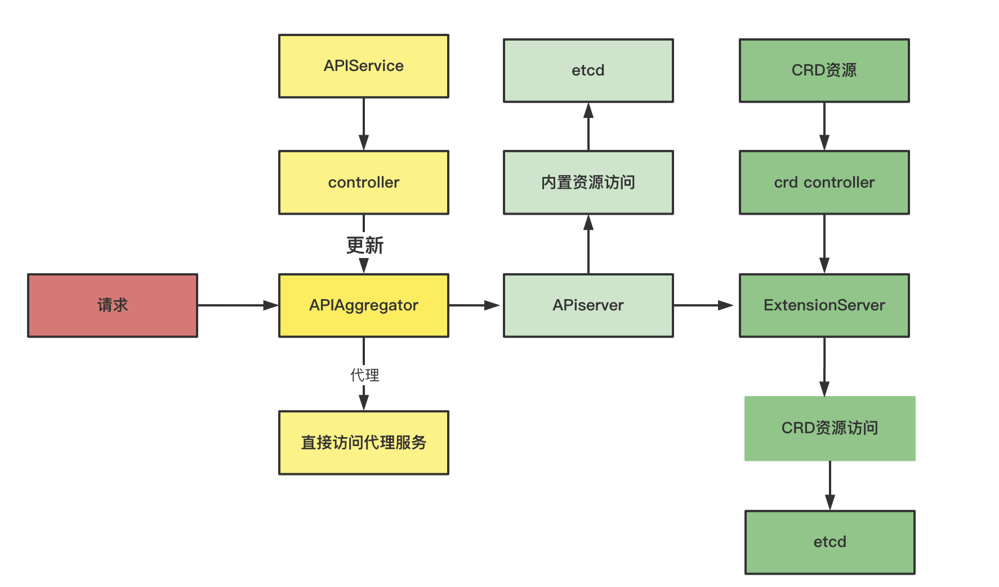

* [1\. kube\-apiserver 背景介绍](#1-kube-apiserver-背景介绍)
* [2\. CreateAggregatorServer源码分析](#2-createaggregatorserver源码分析)
  * [2\.1 NewWithDelegate](#21-newwithdelegate)
    * [2\.1\.1 apiserviceRegistrationController\-处理APIService对象的增删改](#211-apiserviceregistrationcontroller-处理apiservice对象的增删改)
    * [2\.1\.2 availableController](#212-availablecontroller)
  * [2\.2 创建autoRegistrationController](#22-创建autoregistrationcontroller)
    * [2\.2\.1 checkAPIService](#221-checkapiservice)
    * [2\.2\.2 为什么需要这个](#222-为什么需要这个)
  * [2\.3 crdRegistrationController](#23-crdregistrationcontroller)
  * [2\.4 openAPIAggregationController](#24-openapiaggregationcontroller)
* [3\. 总结](#3-总结)

**本章重点：**分析第六个流程，创建APIExtensionsServer

 kube-apiserver整体启动流程如下：

（1）资源注册。

（2）Cobra命令行参数解析

（3）创建APIServer通用配置

（4）创建APIExtensionsServer

（5）创建KubeAPIServer

（6）创建AggregatorServer

（7）启动HTTP服务。

（8）启动HTTPS服务

### 1. kube-apiserver 背景介绍

kube-apiserver其实是包含了3个server: aggregator、apiserver、apiExtensionsServer。通过聚合的方式，对外变成一个kube-apisever对外提供服务。

举例说明，如下图：



当一个请求来的时候，首先经过的是aggregatorServer，aggregatorServer会判断这个服务是否是需要本地处理，如果需要本地处理，就放行到apiserver这一层，处理内置资源（pod, node, svc等等）。如果不是内置资源，那就是CRD资源，转到extensionsSever处理。

**怎么判断是否是本地服务呢？-通过APIService对象**

K8s 有个资源对象叫做APIService, 这个资源就是表示当前支持的服务类型。

```
root@cld-kmaster1-1051:/home/ngadm# kubectl explain APIService
KIND:     APIService
VERSION:  apiregistration.k8s.io/v1

DESCRIPTION:
     APIService represents a server for a particular GroupVersion. Name must be
     "version.group".

FIELDS:
   apiVersion	<string>
     APIVersion defines the versioned schema of this representation of an
     object. Servers should convert recognized schemas to the latest internal
     value, and may reject unrecognized values. More info:
     https://git.k8s.io/community/contributors/devel/sig-architecture/api-conventions.md#resources

   kind	<string>
     Kind is a string value representing the REST resource this object
     represents. Servers may infer this from the endpoint the client submits
     requests to. Cannot be updated. In CamelCase. More info:
     https://git.k8s.io/community/contributors/devel/sig-architecture/api-conventions.md#types-kinds

   metadata	<Object>

   spec	<Object>
     Spec contains information for locating and communicating with a server

   status	<Object>
     Status contains derived information about an API server
     
     
// local 表示本地， 非local表示sever
root:/home/zoux# kubectl get APIService
NAME                                       SERVICE                AVAILABLE   AGE
v1.                                        Local                  True        369d
v1.admissionregistration.k8s.io            Local                  True        369d
v1.apiextensions.k8s.io                    Local                  True        369d
v1.apps                                    Local                  True        369d
v1.authentication.k8s.io                   Local                  True        369d
v1.authorization.k8s.io                    Local                  True        369d
v1.autoscaling                             Local                  True        369d
v1.autoscaling.k8s.io                      Local                  True        35d
v1.batch                                   Local                  True        369d
.... 
v1beta1.batch                              Local                  True        369d
v1beta1.certificates.k8s.io                Local                  True        369d
v1beta1.coordination.k8s.io                Local                  True        369d
v1beta1.custom.metrics.k8s.io              kube-system/kube-hpa   True        369d
...


root:/home/zoux# kubectl get APIService v2alpha1.batch  -oyaml
apiVersion: apiregistration.k8s.io/v1
kind: APIService
metadata:
  creationTimestamp: "2021-06-28T10:02:30Z"
  labels:
    kube-aggregator.kubernetes.io/automanaged: onstart
  name: v2alpha1.batch
  resourceVersion: "34"
  selfLink: /apis/apiregistration.k8s.io/v1/apiservices/v2alpha1.batch
  uid: 30aae086-ca97-4b90-8097-435561d1e56d
spec:
  group: batch
  groupPriorityMinimum: 17400
  service: null
  version: v2alpha1
  versionPriority: 9
status:
  conditions:
  - lastTransitionTime: "2021-06-28T10:02:30Z"
    message: Local APIServices are always available
    reason: Local
    status: "True"
    type: Available
```

**所以访问batch这个group下的资源（就是job）就是本地访问，直接访问apisrver;访问v1beta1.custom.metrics.k8s.io(hpa)就是访问kube-system kube-hpa这个service**

<br>

所以从上面可以知道，AggregatorServer负责处理 `apiregistration.k8s.io` 组下的APIService资源请求，实际上所有的服务都是apiregistration.k8s.io。所以AggregatorServer是一个总的入口。

这也是为什么创建server的顺序为: apiExtensionsServer, apiserver、aggregator。

<br>

### 2. CreateAggregatorServer源码分析

目标：通过源码分析弄清楚具体的流程。

CreateAggregatorServer核心是运行了一下的控制器

- `apiserviceRegistrationController`：负责 APIServices 中资源的注册与删除；
- `availableConditionController`：维护 APIServices 的可用状态，包括其引用 Service 是否可用等；
- `autoRegistrationController`：用于保持 API 中存在的一组特定的 APIServices；
- `crdRegistrationController`：负责将 CRD GroupVersions 自动注册到 APIServices 中；
- `openAPIAggregationController`：将 APIServices 资源的变化同步至提供的 OpenAPI 文档；

```
aggregatorServer, err := createAggregatorServer(aggregatorConfig, kubeAPIServer.GenericAPIServer, apiExtensionsServer.Informers)
	if err != nil {
		// we don't need special handling for innerStopCh because the aggregator server doesn't create any go routines
		return nil, err
	}
	
	
	func createAggregatorServer(aggregatorConfig *aggregatorapiserver.Config, delegateAPIServer genericapiserver.DelegationTarget, apiExtensionInformers apiextensionsinformers.SharedInformerFactory) (*aggregatorapiserver.APIAggregator, error) {
	// 1.创建aggregatorServer
	aggregatorServer, err := aggregatorConfig.Complete().NewWithDelegate(delegateAPIServer)
	if err != nil {
		return nil, err
	}

	// create controllers for auto-registration
	apiRegistrationClient, err := apiregistrationclient.NewForConfig(aggregatorConfig.GenericConfig.LoopbackClientConfig)
	if err != nil {
		return nil, err
	}
	// 2.创建autoRegistrationController
	autoRegistrationController := autoregister.NewAutoRegisterController(aggregatorServer.APIRegistrationInformers.Apiregistration().V1().APIServices(), apiRegistrationClient)
	apiServices := apiServicesToRegister(delegateAPIServer, autoRegistrationController)

	crdRegistrationController := crdregistration.NewCRDRegistrationController(
		apiExtensionInformers.Apiextensions().InternalVersion().CustomResourceDefinitions(),
		autoRegistrationController)

	err = aggregatorServer.GenericAPIServer.AddPostStartHook("kube-apiserver-autoregistration", func(context genericapiserver.PostStartHookContext) error {
		go crdRegistrationController.Run(5, context.StopCh)
		go func() {
			// let the CRD controller process the initial set of CRDs before starting the autoregistration controller.
			// this prevents the autoregistration controller's initial sync from deleting APIServices for CRDs that still exist.
			// we only need to do this if CRDs are enabled on this server.  We can't use discovery because we are the source for discovery.
			if aggregatorConfig.GenericConfig.MergedResourceConfig.AnyVersionForGroupEnabled("apiextensions.k8s.io") {
				crdRegistrationController.WaitForInitialSync()
			}
			autoRegistrationController.Run(5, context.StopCh)
		}()
		return nil
	})
	if err != nil {
		return nil, err
	}

	err = aggregatorServer.GenericAPIServer.AddBootSequenceHealthChecks(
		makeAPIServiceAvailableHealthCheck(
			"autoregister-completion",
			apiServices,
			aggregatorServer.APIRegistrationInformers.Apiregistration().V1().APIServices(),
		),
	)
	if err != nil {
		return nil, err
	}

	return aggregatorServer, nil
}
```

#### 2.1 NewWithDelegate

核心逻辑如下：

（1）利用apiserver生成genericServer，这个和apiserver利用extensionServer生成是一样的

（2）注册路由信息

（3）生成apiserviceRegistrationController，启动监听APIServiceRegistrationController请求

（4）运行availableController

可以看出来这里核心就是运行了apiserviceRegistrationController 和 availableController这2个控制器

```
// NewWithDelegate returns a new instance of APIAggregator from the given config.
func (c completedConfig) NewWithDelegate(delegationTarget genericapiserver.DelegationTarget) (*APIAggregator, error) {
	// Prevent generic API server to install OpenAPI handler. Aggregator server
	// has its own customized OpenAPI handler.
	openAPIConfig := c.GenericConfig.OpenAPIConfig
	c.GenericConfig.OpenAPIConfig = nil
  
  // 1. 利用apiserver生成genericServer
	genericServer, err := c.GenericConfig.New("kube-aggregator", delegationTarget)
	if err != nil {
		return nil, err
	}

	apiregistrationClient, err := clientset.NewForConfig(c.GenericConfig.LoopbackClientConfig)
	if err != nil {
		return nil, err
	}
	informerFactory := informers.NewSharedInformerFactory(
		apiregistrationClient,
		5*time.Minute, // this is effectively used as a refresh interval right now.  Might want to do something nicer later on.
	)

	s := &APIAggregator{
		GenericAPIServer:         genericServer,
		delegateHandler:          delegationTarget.UnprotectedHandler(),
		proxyClientCert:          c.ExtraConfig.ProxyClientCert,
		proxyClientKey:           c.ExtraConfig.ProxyClientKey,
		proxyTransport:           c.ExtraConfig.ProxyTransport,
		proxyHandlers:            map[string]*proxyHandler{},
		handledGroups:            sets.String{},
		lister:                   informerFactory.Apiregistration().V1().APIServices().Lister(),
		APIRegistrationInformers: informerFactory,
		serviceResolver:          c.ExtraConfig.ServiceResolver,
		openAPIConfig:            openAPIConfig,
	}
  
  // 2.注册路由信息
	apiGroupInfo := apiservicerest.NewRESTStorage(c.GenericConfig.MergedResourceConfig, c.GenericConfig.RESTOptionsGetter)
	if err := s.GenericAPIServer.InstallAPIGroup(&apiGroupInfo); err != nil {
		return nil, err
	}

	enabledVersions := sets.NewString()
	for v := range apiGroupInfo.VersionedResourcesStorageMap {
		enabledVersions.Insert(v)
	}
	if !enabledVersions.Has(v1.SchemeGroupVersion.Version) {
		return nil, fmt.Errorf("API group/version %s must be enabled", v1.SchemeGroupVersion.String())
	}

	apisHandler := &apisHandler{
		codecs:         aggregatorscheme.Codecs,
		lister:         s.lister,
		discoveryGroup: discoveryGroup(enabledVersions),
	}
	s.GenericAPIServer.Handler.NonGoRestfulMux.Handle("/apis", apisHandler)
	s.GenericAPIServer.Handler.NonGoRestfulMux.UnlistedHandle("/apis/", apisHandler)
  
  // 3.生成apiserviceRegistrationController，监听APIServiceRegistrationController请求
	apiserviceRegistrationController := NewAPIServiceRegistrationController(informerFactory.Apiregistration().V1().APIServices(), s)
	availableController, err := statuscontrollers.NewAvailableConditionController(
		informerFactory.Apiregistration().V1().APIServices(),
		c.GenericConfig.SharedInformerFactory.Core().V1().Services(),
		c.GenericConfig.SharedInformerFactory.Core().V1().Endpoints(),
		apiregistrationClient.ApiregistrationV1(),
		c.ExtraConfig.ProxyTransport,
		c.ExtraConfig.ProxyClientCert,
		c.ExtraConfig.ProxyClientKey,
		s.serviceResolver,
	)
	if err != nil {
		return nil, err
	}
  
  // 启动监听
	s.GenericAPIServer.AddPostStartHookOrDie("start-kube-aggregator-informers", func(context genericapiserver.PostStartHookContext) error {
		informerFactory.Start(context.StopCh)
		c.GenericConfig.SharedInformerFactory.Start(context.StopCh)
		return nil
	})
	
// 4.运行apiserviceRegistrationController
	s.GenericAPIServer.AddPostStartHookOrDie("apiservice-registration-controller", func(context genericapiserver.PostStartHookContext) error {
		go apiserviceRegistrationController.Run(context.StopCh)
		return nil
	})
	
	// 5. 运行availableController
	s.GenericAPIServer.AddPostStartHookOrDie("apiservice-status-available-controller", func(context genericapiserver.PostStartHookContext) error {
		// if we end up blocking for long periods of time, we may need to increase threadiness.
		go availableController.Run(5, context.StopCh)
		return nil
	})

	return s, nil
}

// 监听APIService这个对象的add, update, delete
// NewAPIServiceRegistrationController returns a new APIServiceRegistrationController.
func NewAPIServiceRegistrationController(apiServiceInformer informers.APIServiceInformer, apiHandlerManager APIHandlerManager) *APIServiceRegistrationController {
	c := &APIServiceRegistrationController{
		apiHandlerManager: apiHandlerManager,
		apiServiceLister:  apiServiceInformer.Lister(),
		apiServiceSynced:  apiServiceInformer.Informer().HasSynced,
		queue:             workqueue.NewNamedRateLimitingQueue(workqueue.DefaultControllerRateLimiter(), "APIServiceRegistrationController"),
	}

	apiServiceInformer.Informer().AddEventHandler(cache.ResourceEventHandlerFuncs{
		AddFunc:    c.addAPIService,
		UpdateFunc: c.updateAPIService,
		DeleteFunc: c.deleteAPIService,
	})

	c.syncFn = c.sync

	return c
}
```

##### 2.1.1 apiserviceRegistrationController-处理APIService对象的增删改

addAPIService, updateAPIService, updateAPIService都是进入队列。通过Run->runWorker->processNextWorkItem->sync处理。

```
func (c *APIServiceRegistrationController) sync(key string) error {
	// 如果APIService对象不存在，就删除
	apiService, err := c.apiServiceLister.Get(key)
	if apierrors.IsNotFound(err) {
		c.apiHandlerManager.RemoveAPIService(key)
		return nil
	}
	if err != nil {
		return err
	}
  // 核心就是AddAPIService函数
	return c.apiHandlerManager.AddAPIService(apiService)
}
```

<br>

AddAPIService函数的核心逻辑：
（1）如果存在，说明路由信息不用修改，直接更新porxy就行

（2）如果不存在，要处理restful url和路由的对应关系

```
// AddAPIService adds an API service.  It is not thread-safe, so only call it on one thread at a time please.
// It's a slow moving API, so its ok to run the controller on a single thread
func (s *APIAggregator) AddAPIService(apiService *v1.APIService) error {
	// if the proxyHandler already exists, it needs to be updated. The aggregation bits do not
	// since they are wired against listers because they require multiple resources to respond
	// 1.如果存在，说明路由信息不用修改，直接更新porxy就行
	if proxyHandler, exists := s.proxyHandlers[apiService.Name]; exists {
		proxyHandler.updateAPIService(apiService)
		if s.openAPIAggregationController != nil {
			s.openAPIAggregationController.UpdateAPIService(proxyHandler, apiService)
		}
		return nil
	}
  
  // 2.如果不存在，要处理restful url和路由的对应关系
	proxyPath := "/apis/" + apiService.Spec.Group + "/" + apiService.Spec.Version
	// v1. is a special case for the legacy API.  It proxies to a wider set of endpoints.
	if apiService.Name == legacyAPIServiceName {
		proxyPath = "/api"
	}
  
	// register the proxy handler
	proxyHandler := &proxyHandler{
		localDelegate:   s.delegateHandler,
		proxyClientCert: s.proxyClientCert,
		proxyClientKey:  s.proxyClientKey,
		proxyTransport:  s.proxyTransport,
		serviceResolver: s.serviceResolver,
	}
	proxyHandler.updateAPIService(apiService)
	if s.openAPIAggregationController != nil {
		s.openAPIAggregationController.AddAPIService(proxyHandler, apiService)
	}
	s.proxyHandlers[apiService.Name] = proxyHandler
	s.GenericAPIServer.Handler.NonGoRestfulMux.Handle(proxyPath, proxyHandler)
	s.GenericAPIServer.Handler.NonGoRestfulMux.UnlistedHandlePrefix(proxyPath+"/", proxyHandler)

	// if we're dealing with the legacy group, we're done here
	if apiService.Name == legacyAPIServiceName {
		return nil
	}

	// if we've already registered the path with the handler, we don't want to do it again.
	if s.handledGroups.Has(apiService.Spec.Group) {
		return nil
	}

	// it's time to register the group aggregation endpoint
	groupPath := "/apis/" + apiService.Spec.Group
	groupDiscoveryHandler := &apiGroupHandler{
		codecs:    aggregatorscheme.Codecs,
		groupName: apiService.Spec.Group,
		lister:    s.lister,
		delegate:  s.delegateHandler,
	}
	// aggregation is protected
	s.GenericAPIServer.Handler.NonGoRestfulMux.Handle(groupPath, groupDiscoveryHandler)
	s.GenericAPIServer.Handler.NonGoRestfulMux.UnlistedHandle(groupPath+"/", groupDiscoveryHandler)
	s.handledGroups.Insert(apiService.Spec.Group)
	return nil
}
```

<br>

updateAPIService的核心逻辑：

（1）如果APIService对象是Local类型，不用设置代理

（2）否则设置路由代理，访问这个restful 服务，都由APIService对应的后端处理

```
func (r *proxyHandler) updateAPIService(apiService *apiregistrationv1api.APIService) {
	if apiService.Spec.Service == nil {
		r.handlingInfo.Store(proxyHandlingInfo{local: true})
		return
	}

	newInfo := proxyHandlingInfo{
		name: apiService.Name,
		restConfig: &restclient.Config{
			TLSClientConfig: restclient.TLSClientConfig{
				Insecure:   apiService.Spec.InsecureSkipTLSVerify,
				ServerName: apiService.Spec.Service.Name + "." + apiService.Spec.Service.Namespace + ".svc",
				CertData:   r.proxyClientCert,
				KeyData:    r.proxyClientKey,
				CAData:     apiService.Spec.CABundle,
			},
		},
		serviceName:      apiService.Spec.Service.Name,
		serviceNamespace: apiService.Spec.Service.Namespace,
		servicePort:      *apiService.Spec.Service.Port,
		serviceAvailable: apiregistrationv1apihelper.IsAPIServiceConditionTrue(apiService, apiregistrationv1api.Available),
	}
	if r.proxyTransport != nil && r.proxyTransport.DialContext != nil {
		newInfo.restConfig.Dial = r.proxyTransport.DialContext
	}
	newInfo.proxyRoundTripper, newInfo.transportBuildingError = restclient.TransportFor(newInfo.restConfig)
	if newInfo.transportBuildingError != nil {
		klog.Warning(newInfo.transportBuildingError.Error())
	}
	r.handlingInfo.Store(newInfo)
}
```

<br>

这里大家可以参考我的一篇文章，就能更清楚理解了

[hpa-自定义metric-server](https://zoux86.github.io/post/2021-6-18-hpa-%E8%87%AA%E5%AE%9A%E4%B9%89metric-server/)

```
root@k8s-master:~/testyaml/hpa# cat tls.yaml 
apiVersion: v1
kind: Service
metadata:
  name: kube-hpa
  namespace: kube-system
spec:
  clusterIP: None
  ports:
  - name: https-hpa-dont-edit-it
    port: 9997
    targetPort: 9997
  selector:
    app: kube-hpa
---
apiVersion: apiregistration.k8s.io/v1beta1
kind: APIService
metadata:
  name: v1beta1.custom.metrics.k8s.io
spec:
  service:
    name: kube-hpa
    namespace: kube-system
    port: 9997
  group: custom.metrics.k8s.io
  version: v1beta1
  insecureSkipTLSVerify: true
  groupPriorityMinimum: 100
  versionPriority: 100
```

##### 2.1.2 availableController

availableController 核心工作就是判断APIService对应的service是否能工作。所以处理监听APIService外，还要监听svc, ep资源。

```
// NewAvailableConditionController returns a new AvailableConditionController.
func NewAvailableConditionController(
	apiServiceInformer informers.APIServiceInformer,
	serviceInformer v1informers.ServiceInformer,
	endpointsInformer v1informers.EndpointsInformer,
	apiServiceClient apiregistrationclient.APIServicesGetter,
	proxyTransport *http.Transport,
	proxyClientCert []byte,
	proxyClientKey []byte,
	serviceResolver ServiceResolver,
) (*AvailableConditionController, error) {
	c := &AvailableConditionController{
		apiServiceClient: apiServiceClient,
		apiServiceLister: apiServiceInformer.Lister(),
		apiServiceSynced: apiServiceInformer.Informer().HasSynced,
		serviceLister:    serviceInformer.Lister(),
		servicesSynced:   serviceInformer.Informer().HasSynced,
		endpointsLister:  endpointsInformer.Lister(),
		endpointsSynced:  endpointsInformer.Informer().HasSynced,
		serviceResolver:  serviceResolver,
		queue: workqueue.NewNamedRateLimitingQueue(
			// We want a fairly tight requeue time.  The controller listens to the API, but because it relies on the routability of the
			// service network, it is possible for an external, non-watchable factor to affect availability.  This keeps
			// the maximum disruption time to a minimum, but it does prevent hot loops.
			workqueue.NewItemExponentialFailureRateLimiter(5*time.Millisecond, 30*time.Second),
			"AvailableConditionController"),
	}

	// if a particular transport was specified, use that otherwise build one
	// construct an http client that will ignore TLS verification (if someone owns the network and messes with your status
	// that's not so bad) and sets a very short timeout.  This is a best effort GET that provides no additional information
	restConfig := &rest.Config{
		TLSClientConfig: rest.TLSClientConfig{
			Insecure: true,
			CertData: proxyClientCert,
			KeyData:  proxyClientKey,
		},
	}
	if proxyTransport != nil && proxyTransport.DialContext != nil {
		restConfig.Dial = proxyTransport.DialContext
	}
	transport, err := rest.TransportFor(restConfig)
	if err != nil {
		return nil, err
	}
	c.discoveryClient = &http.Client{
		Transport: transport,
		// the request should happen quickly.
		Timeout: 5 * time.Second,
	}

	// resync on this one because it is low cardinality and rechecking the actual discovery
	// allows us to detect health in a more timely fashion when network connectivity to
	// nodes is snipped, but the network still attempts to route there.  See
	// https://github.com/openshift/origin/issues/17159#issuecomment-341798063
	apiServiceInformer.Informer().AddEventHandlerWithResyncPeriod(
		cache.ResourceEventHandlerFuncs{
			AddFunc:    c.addAPIService,
			UpdateFunc: c.updateAPIService,
			DeleteFunc: c.deleteAPIService,
		},
		30*time.Second)

	serviceInformer.Informer().AddEventHandler(cache.ResourceEventHandlerFuncs{
		AddFunc:    c.addService,
		UpdateFunc: c.updateService,
		DeleteFunc: c.deleteService,
	})

	endpointsInformer.Informer().AddEventHandler(cache.ResourceEventHandlerFuncs{
		AddFunc:    c.addEndpoints,
		UpdateFunc: c.updateEndpoints,
		DeleteFunc: c.deleteEndpoints,
	})

	c.syncFn = c.sync

	return c, nil
}
```

<br>

这里核心就是AvailableConditionController.sync。具体逻辑不展开了。核心就是更新APIService status。判断APIserver对象的service是否可用

```
func (c *AvailableConditionController) sync(key string) error {
	originalAPIService, err := c.apiServiceLister.Get(key)
```

<br>

```
root@k8s-master:~/testyaml/hpa# kubectl get APIService v1beta1.custom.metrics.k8s.io  -oyaml
apiVersion: apiregistration.k8s.io/v1
kind: APIService
metadata:
  creationTimestamp: "2021-06-13T13:22:01Z"
  name: v1beta1.custom.metrics.k8s.io
  resourceVersion: "1590641"
  selfLink: /apis/apiregistration.k8s.io/v1/apiservices/v1beta1.custom.metrics.k8s.io
  uid: d488d6a8-7e79-4311-a1e9-0b12e4591375
spec:
  group: custom.metrics.k8s.io
  groupPriorityMinimum: 100
  insecureSkipTLSVerify: true
  service:
    name: kube-hpa
    namespace: kube-system
    port: 9997
  version: v1beta1
  versionPriority: 100
status:     //就是这个
  conditions:
  - lastTransitionTime: "2021-06-13T13:42:17Z"
    message: all checks passed
    reason: Passed
    status: "True"
    type: Available
```

#### 2.2 创建autoRegistrationController

autoRegistrationController也监听了APIService。统一通过Run->runWorker->processNextWorkItem->checkAPIService处理。核心就是checkAPIService函数。

```
// NewAutoRegisterController creates a new autoRegisterController.
func NewAutoRegisterController(apiServiceInformer informers.APIServiceInformer, apiServiceClient apiregistrationclient.APIServicesGetter) *autoRegisterController {
   c := &autoRegisterController{
      apiServiceLister:  apiServiceInformer.Lister(),
      apiServiceSynced:  apiServiceInformer.Informer().HasSynced,
      apiServiceClient:  apiServiceClient,
      apiServicesToSync: map[string]*v1.APIService{},

      apiServicesAtStart: map[string]bool{},

      syncedSuccessfullyLock: &sync.RWMutex{},
      syncedSuccessfully:     map[string]bool{},

      queue: workqueue.NewNamedRateLimitingQueue(workqueue.DefaultControllerRateLimiter(), "autoregister"),
   }
   c.syncHandler = c.checkAPIService

   apiServiceInformer.Informer().AddEventHandler(cache.ResourceEventHandlerFuncs{
      AddFunc: func(obj interface{}) {
         cast := obj.(*v1.APIService)
         c.queue.Add(cast.Name)
      },
      UpdateFunc: func(_, obj interface{}) {
         cast := obj.(*v1.APIService)
         c.queue.Add(cast.Name)
      },
      DeleteFunc: func(obj interface{}) {
         cast, ok := obj.(*v1.APIService)
         if !ok {
            tombstone, ok := obj.(cache.DeletedFinalStateUnknown)
            if !ok {
               klog.V(2).Infof("Couldn't get object from tombstone %#v", obj)
               return
            }
            cast, ok = tombstone.Obj.(*v1.APIService)
            if !ok {
               klog.V(2).Infof("Tombstone contained unexpected object: %#v", obj)
               return
            }
         }
         c.queue.Add(cast.Name)
      },
   })

   return c
}
```

##### 2.2.1 checkAPIService

Apiservice按照同步类型分为2类manageOnStart，manageContinuously ，通过标签AutoRegisterManagedLabel标记。

```
const (
	// AutoRegisterManagedLabel is a label attached to the APIService that identifies how the APIService wants to be synced.
	AutoRegisterManagedLabel = "kube-aggregator.kubernetes.io/automanaged"

	// manageOnStart is a value for the AutoRegisterManagedLabel that indicates the APIService wants to be synced one time when the controller starts.
	manageOnStart = "onstart"
	// manageContinuously is a value for the AutoRegisterManagedLabel that indicates the APIService wants to be synced continuously.
	manageContinuously = "true"
)
```

checkAPIService这个函数就注释表就知道，该函数功能更加不同类型的不同动作做同步操作。

<br>

```
// checkAPIService syncs the current APIService against a list of desired APIService objects
//
//                                                 | A. desired: not found | B. desired: sync on start | C. desired: sync always
// ------------------------------------------------|-----------------------|---------------------------|------------------------
// 1. current: lookup error                        | error                 | error                     | error
// 2. current: not found                           | -                     | create once               | create
// 3. current: no sync                             | -                     | -                         | -
// 4. current: sync on start, not present at start | -                     | -                         | -
// 5. current: sync on start, present at start     | delete once           | update once               | update once
// 6. current: sync always                         | delete                | update once               | update
func (c *autoRegisterController) checkAPIService(name string) (err error) {
	desired := c.GetAPIServiceToSync(name)
	curr, err := c.apiServiceLister.Get(name)

	// if we've never synced this service successfully, record a successful sync.
	hasSynced := c.hasSyncedSuccessfully(name)
	if !hasSynced {
		defer func() {
			if err == nil {
				c.setSyncedSuccessfully(name)
			}
		}()
	}

	switch {
	// we had a real error, just return it (1A,1B,1C)
	case err != nil && !apierrors.IsNotFound(err):
		return err

	// we don't have an entry and we don't want one (2A)
	case apierrors.IsNotFound(err) && desired == nil:
		return nil

	// the local object only wants to sync on start and has already synced (2B,5B,6B "once" enforcement)
	case isAutomanagedOnStart(desired) && hasSynced:
		return nil

	// we don't have an entry and we do want one (2B,2C)
	case apierrors.IsNotFound(err) && desired != nil:
		_, err := c.apiServiceClient.APIServices().Create(desired)
		if apierrors.IsAlreadyExists(err) {
			// created in the meantime, we'll get called again
			return nil
		}
		return err

	// we aren't trying to manage this APIService (3A,3B,3C)
	case !isAutomanaged(curr):
		return nil

	// the remote object only wants to sync on start, but was added after we started (4A,4B,4C)
	case isAutomanagedOnStart(curr) && !c.apiServicesAtStart[name]:
		return nil

	// the remote object only wants to sync on start and has already synced (5A,5B,5C "once" enforcement)
	case isAutomanagedOnStart(curr) && hasSynced:
		return nil

	// we have a spurious APIService that we're managing, delete it (5A,6A)
	case desired == nil:
		opts := &metav1.DeleteOptions{Preconditions: metav1.NewUIDPreconditions(string(curr.UID))}
		err := c.apiServiceClient.APIServices().Delete(curr.Name, opts)
		if apierrors.IsNotFound(err) || apierrors.IsConflict(err) {
			// deleted or changed in the meantime, we'll get called again
			return nil
		}
		return err

	// if the specs already match, nothing for us to do
	case reflect.DeepEqual(curr.Spec, desired.Spec):
		return nil
	}

	// we have an entry and we have a desired, now we deconflict.  Only a few fields matter. (5B,5C,6B,6C)
	apiService := curr.DeepCopy()
	apiService.Spec = desired.Spec
	_, err = c.apiServiceClient.APIServices().Update(apiService)
	if apierrors.IsNotFound(err) || apierrors.IsConflict(err) {
		// deleted or changed in the meantime, we'll get called again
		return nil
	}
	return err
}
```

##### 2.2.2 为什么需要这个

作用：用于保持 API 中存在的一组特定的 APIServices

内置资源的APIService都会有标签`kube-aggregator.kubernetes.io/automanaged: onstart`，例如：v1.apps apiService。autoRegistrationController创建并维护这些列表中的APIService，也即我们看到的Local apiService；

CRD资源则是automanaged=true，表示always

而自定义service类型的APIService是没有的这个标签，因为自己会更新路由。

```
roo # kubectl get APIService --show-labels
NAME                                       SERVICE                AVAILABLE   AGE    LABELS
v1.                                        Local                  True        369d   kube-aggregator.kubernetes.io/automanaged=onstart
v1.admissionregistration.k8s.io            Local                  True        369d   kube-aggregator.kubernetes.io/automanaged=onstart
v1.apiextensions.k8s.io                    Local                  True        369d   kube-aggregator.kubernetes.io/automanaged=onstart
v1.apps                                    Local                  True        369d   kube-aggregator.kubernetes.io/automanaged=onstart
v1.authentication.k8s.io                   Local                  True        369d   kube-aggregator.kubernetes.io/automanaged=onstart
v1.authorization.k8s.io                    Local                  True        369d   kube-aggregator.kubernetes.io/automanaged=onstart
v1.autoscaling                             Local                  True        369d   kube-aggregator.kubernetes.io/automanaged=onstart
v1.autoscaling.k8s.io                      Local                  True        35d    kube-aggregator.kubernetes.io/automanaged=true
v1.batch                                   Local                  True        369d   kube-aggregator.kubernetes.io/automanaged=onstart
v1.coordination.k8s.io                     Local                  True        369d   kube-aggregator.kubernetes.io/automanaged=onstart
v1.messaging.k8s.io                        Local                  True        44d    kube-aggregator.kubernetes.io/automanaged=true
v1.networking.k8s.io                       Local                  True        369d   kube-aggregator.kubernetes.io/automanaged=onstart
v1.rbac.authorization.k8s.io               Local                  True        369d   kube-aggregator.kubernetes.io/automanaged=onstart
v1.schedular.istio.io                      Local                  True        41d    kube-aggregator.kubernetes.io/automanaged=true
v1.scheduling.k8s.io                       Local                  True        369d   kube-aggregator.kubernetes.io/automanaged=onstart
v1.security.symphony.netease.com           Local                  True        44d    kube-aggregator.kubernetes.io/automanaged=true
v1.storage.k8s.io                          Local                  True        369d   kube-aggregator.kubernetes.io/automanaged=onstart
v1alpha1.argoproj.io                       Local                  True        41d    kube-aggregator.kubernetes.io/automanaged=true
v1alpha1.auditregistration.k8s.io          Local                  True        369d   kube-aggregator.kubernetes.io/automanaged=onstart
v1alpha1.authentication.istio.io           Local                  True        41d    kube-aggregator.kubernetes.io/automanaged=true
v1alpha1.certmanager.k8s.io                Local                  True        44d    kube-aggregator.kubernetes.io/automanaged=true
v1alpha1.crdlbcontroller.k8s.io            Local                  True        44d    kube-aggregator.kubernetes.io/automanaged=true
v1alpha1.loadbalancer.k8s.io               Local                  True        35d    kube-aggregator.kubernetes.io/automanaged=true
v1alpha1.multicluster.admiralty.io         Local                  True        35d    kube-aggregator.kubernetes.io/automanaged=true
v1alpha1.networking.symphony.netease.com   Local                  True        41d    kube-aggregator.kubernetes.io/automanaged=true
v1alpha1.node.k8s.io                       Local                  True        369d   kube-aggregator.kubernetes.io/automanaged=onstart
v1alpha1.rbac.authorization.k8s.io         Local                  True        369d   kube-aggregator.kubernetes.io/automanaged=onstart
v1alpha1.rbac.istio.io                     Local                  True        35d    kube-aggregator.kubernetes.io/automanaged=true
v1alpha1.resources.symphony.netease.com    Local                  True        44d    kube-aggregator.kubernetes.io/automanaged=true
v1alpha1.scheduling.k8s.io                 Local                  True        369d   kube-aggregator.kubernetes.io/automanaged=onstart
v1alpha1.settings.k8s.io                   Local                  True        369d   kube-aggregator.kubernetes.io/automanaged=onstart
v1alpha1.storage.k8s.io                    Local                  True        369d   kube-aggregator.kubernetes.io/automanaged=onstart
v1alpha2.config.istio.io                   Local                  True        35d    kube-aggregator.kubernetes.io/automanaged=true
v1alpha3.networking.istio.io               Local                  True        41d    kube-aggregator.kubernetes.io/automanaged=true
v1beta1.admissionregistration.k8s.io       Local                  True        369d   kube-aggregator.kubernetes.io/automanaged=onstart
v1beta1.apiextensions.k8s.io               Local                  True        369d   kube-aggregator.kubernetes.io/automanaged=onstart
v1beta1.apps                               Local                  True        172d   kube-aggregator.kubernetes.io/automanaged=onstart
v1beta1.authentication.k8s.io              Local                  True        369d   kube-aggregator.kubernetes.io/automanaged=onstart
v1beta1.authorization.k8s.io               Local                  True        369d   kube-aggregator.kubernetes.io/automanaged=onstart
v1beta1.batch                              Local                  True        369d   kube-aggregator.kubernetes.io/automanaged=onstart
v1beta1.certificates.k8s.io                Local                  True        369d   kube-aggregator.kubernetes.io/automanaged=onstart
v1beta1.coordination.k8s.io                Local                  True        369d   kube-aggregator.kubernetes.io/automanaged=onstart
v1beta1.custom.metrics.k8s.io              kube-system/kube-hpa   True        369d   <none>
v1beta1.discovery.k8s.io                   Local                  True        369d   kube-aggregator.kubernetes.io/automanaged=onstart
v1beta1.events.k8s.io                      Local                  True        369d   kube-aggregator.kubernetes.io/automanaged=onstart
v1beta1.extensions                         Local                  True        369d   kube-aggregator.kubernetes.io/automanaged=onstart
v1beta1.kustomize.toolkit.fluxcd.io        Local                  True        44d    kube-aggregator.kubernetes.io/automanaged=true
```

#### 2.3 crdRegistrationController

crdRegistrationController监听的是crd资源的增删改操作。也是Run->runWorker->processNextWorkItem->handleVersionUpdate。核心看handleVersionUpdate。

从这里可以看出来：APIService就是根据CRD资源的增删改，修改APIService对象。CRD资源则是automanaged=true，表示always

```
func (c *crdRegistrationController) handleVersionUpdate(groupVersion schema.GroupVersion) error {
	apiServiceName := groupVersion.Version + "." + groupVersion.Group

	// check all CRDs.  There shouldn't that many, but if we have problems later we can index them
	crds, err := c.crdLister.List(labels.Everything())
	if err != nil {
		return err
	}
	for _, crd := range crds {
		if crd.Spec.Group != groupVersion.Group {
			continue
		}
		for _, version := range crd.Spec.Versions {
			if version.Name != groupVersion.Version || !version.Served {
				continue
			}

			c.apiServiceRegistration.AddAPIServiceToSync(&v1.APIService{
				ObjectMeta: metav1.ObjectMeta{Name: apiServiceName},
				Spec: v1.APIServiceSpec{
					Group:                groupVersion.Group,
					Version:              groupVersion.Version,
					GroupPriorityMinimum: 1000, // CRDs should have relatively low priority
					VersionPriority:      100,  // CRDs will be sorted by kube-like versions like any other APIService with the same VersionPriority
				},
			})
			return nil
		}
	}

	c.apiServiceRegistration.RemoveAPIServiceToSync(apiServiceName)
	return nil
}

// CRD表示要跟着资源变化一起同步的APIService
// AddAPIServiceToSync registers an API service to sync continuously.
func (c *autoRegisterController) AddAPIServiceToSync(in *v1.APIService) {
	c.addAPIServiceToSync(in, manageContinuously)
}
```

#### 2.4 openAPIAggregationController

openAPIAggregationController 是在PrepareRun中运行的，核心也是监听APIService对象。然后Run->runWorker->processNextWorkItem->sync，同步OpenAPI 文档。

```
// PrepareRun prepares the aggregator to run, by setting up the OpenAPI spec and calling
// the generic PrepareRun.
func (s *APIAggregator) PrepareRun() (preparedAPIAggregator, error) {
	// add post start hook before generic PrepareRun in order to be before /healthz installation
	if s.openAPIConfig != nil {
		s.GenericAPIServer.AddPostStartHookOrDie("apiservice-openapi-controller", func(context genericapiserver.PostStartHookContext) error {
			go s.openAPIAggregationController.Run(context.StopCh)
			return nil
		})
	}

	prepared := s.GenericAPIServer.PrepareRun()

	// delay OpenAPI setup until the delegate had a chance to setup their OpenAPI handlers
	if s.openAPIConfig != nil {
		specDownloader := openapiaggregator.NewDownloader()
		openAPIAggregator, err := openapiaggregator.BuildAndRegisterAggregator(
			&specDownloader,
			s.GenericAPIServer.NextDelegate(),
			s.GenericAPIServer.Handler.GoRestfulContainer.RegisteredWebServices(),
			s.openAPIConfig,
			s.GenericAPIServer.Handler.NonGoRestfulMux)
		if err != nil {
			return preparedAPIAggregator{}, err
		}
		s.openAPIAggregationController = openapicontroller.NewAggregationController(&specDownloader, openAPIAggregator)
	}

	return preparedAPIAggregator{APIAggregator: s, runnable: prepared}, nil
}
```

### 3. 总结

可以看出来AggregatorServer做了很多事情。kube-apiserver实现聚合的关键就是它，通过APIService资源扩展了api。

可以利用这个机制做很多事情，比如自定义mertic-server。比如可以通过添加APIService实现CRD的效果。

社区也有一个专业的工具，详见：https://github.com/kubernetes-sigs/apiserver-builder-alpha/

apiserver-builder-alpha是一系列工具和库的集合，它能够：

1. 为新的API资源创建Go类型、控制器（基于controller-runtime）、测试用例、文档
2. 构建、（独立、在Minikube或者在K8S中）运行扩展的控制平面组件（APIServer）
3. 让在控制器中watch/update资源更简单
4. 让创建新的资源/子资源更简单
5. 提供大部分合理的默认值