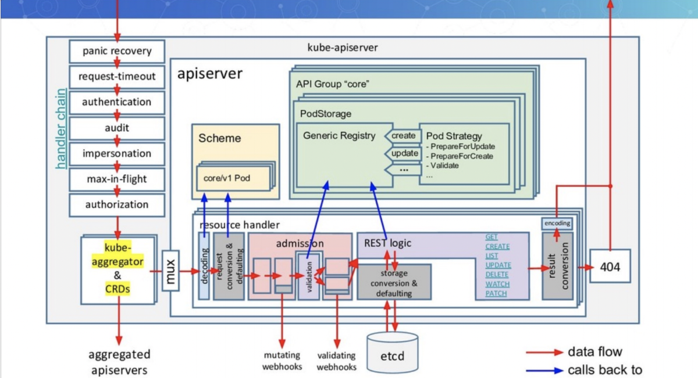

* [1\. 启动http服务](#1-启动http服务)
  * [1\.1 链路流程](#11-链路流程)
  * [1\.2 insecureHandlerChain](#12-insecurehandlerchain)
* [2\. 启动https服务](#2-启动https服务)
  * [2\.1 启动过程](#21-启动过程)
  * [2\.2 DefaultBuildHandlerChain](#22-defaultbuildhandlerchain)
  * [2\.3 调用链路](#23-调用链路)
    * [2\.3\.1\. NewConfig 指定了server\.Config\.BuildHandlerChainFunc=DefaultBuildHandlerChain](#231-newconfig-指定了serverconfigbuildhandlerchainfuncdefaultbuildhandlerchain)
    * [2\.3\.2\. completedConfig\.new 使用这个func](#232-completedconfignew-使用这个func)
    * [2\.3\.3\. createAggregatorServer调用了NewWithDelegate，调用了第二步的New函数](#233-createaggregatorserver调用了newwithdelegate调用了第二步的new函数)
    * [2\.3\.4\. Run函数调用了NonBlockingRun函数](#234-run函数调用了nonblockingrun函数)
* [3 总结](#3-总结)

**本章重点：**分析最后两个流程，启动HTTP，HTTPS服务

 kube-apiserver整体启动流程如下：

（1）资源注册。

（2）Cobra命令行参数解析

（3）创建APIServer通用配置

（4）创建APIExtensionsServer

（5）创建KubeAPIServer

（6）创建AggregatorServer

（7）启动HTTP服务。

（8）启动HTTPS服务

### 1. 启动http服务

#### 1.1 链路流程

Go语言提供的HTTP标准库非常强大，Kubernetes API Server在其基础上并没有过多的封装，因为它的功能和性能已经很完善了，可直接拿来用。在Go语言中开启HTTP服务有很多种方法，例如通过http.ListenAndServe函数可以直接启动HTTP服务，其内部实现了创建

Socket、监控端口等操作。下面看看Kubernetes APIServer通过自定义http.Server的方式创建HTTP服务的过程，代码示例如下：

```
if insecureServingInfo != nil {
		insecureHandlerChain := kubeserver.BuildInsecureHandlerChain(aggregatorServer.GenericAPIServer.UnprotectedHandler(), kubeAPIServerConfig.GenericConfig)
		if err := insecureServingInfo.Serve(insecureHandlerChain, kubeAPIServerConfig.GenericConfig.RequestTimeout, stopCh); err != nil {
			return nil, err
		}
	}
	
	
// Serve starts an insecure http server with the given handler. It fails only if
// the initial listen call fails. It does not block.
func (s *DeprecatedInsecureServingInfo) Serve(handler http.Handler, shutdownTimeout time.Duration, stopCh <-chan struct{}) error {
	insecureServer := &http.Server{
		Addr:           s.Listener.Addr().String(),
		Handler:        handler,
		MaxHeaderBytes: 1 << 20,
	}

	if len(s.Name) > 0 {
		klog.Infof("Serving %s insecurely on %s", s.Name, s.Listener.Addr())
	} else {
		klog.Infof("Serving insecurely on %s", s.Listener.Addr())
	}
	_, err := RunServer(insecureServer, s.Listener, shutdownTimeout, stopCh)
	// NOTE: we do not handle stoppedCh returned by RunServer for graceful termination here
	return err
}


// RunServer spawns a go-routine continuously serving until the stopCh is
// closed.
// It returns a stoppedCh that is closed when all non-hijacked active requests
// have been processed.
// This function does not block
// TODO: make private when insecure serving is gone from the kube-apiserver
func RunServer(
	server *http.Server,
	ln net.Listener,
	shutDownTimeout time.Duration,
	stopCh <-chan struct{},
) (<-chan struct{}, error) {
	if ln == nil {
		return nil, fmt.Errorf("listener must not be nil")
	}

	// Shutdown server gracefully.
	stoppedCh := make(chan struct{})
	go func() {
		defer close(stoppedCh)
		<-stopCh
		ctx, cancel := context.WithTimeout(context.Background(), shutDownTimeout)
		server.Shutdown(ctx)
		cancel()
	}()

	go func() {
		defer utilruntime.HandleCrash()

		var listener net.Listener
		listener = tcpKeepAliveListener{ln.(*net.TCPListener)}
		if server.TLSConfig != nil {
			listener = tls.NewListener(listener, server.TLSConfig)
		}

		err := server.Serve(listener)

		msg := fmt.Sprintf("Stopped listening on %s", ln.Addr().String())
		select {
		case <-stopCh:
			klog.Info(msg)
		default:
			panic(fmt.Sprintf("%s due to error: %v", msg, err))
		}
	}()

	return stoppedCh, nil
}
```

在RunServer函数中，通过Go语言标准库的serverServe监听listener，并在运行过程中为每个连接创建一个goroutine。goroutine读取请求，然后调用Handler函数来处理并响应请求。另外，在Kubernetes API Server的代码中还实现了平滑关闭HTTP服务的功能，利用Go语言标准库的HTTP Server.Shutdown函数可以在不干扰任何活跃连接的情况下关闭服务。其原理是，首先关闭所有的监听listener，然后

关闭所有的空闲连接，接着无限期地等待所有连接变成空闲状态并关闭。如果设置带有超时的Context，将在HTTP服务关闭之前返回Context超时错误。

#### 1.2 insecureHandlerChain 

所以如果是http请求的话。处理函数的链路为：

**WithMaxInFlightLimit：apiserver**限流策略，通过go chan实现限流。--max-requests-inflight=1000 --max-mutating-requests-inflight=1000指定了QPS。

**WithAudit**：  开启审计，日志以event格式输出

**WithAuthentication：** 进行认证，其实是为了方便审计

**WithCORS:**   cors全称是--cors-allowed-origins, 通过kube-apiserver的cors-allowed-origins指定运行的cors. 例如：

-cors-allowed-origins = http://www.example.com, https://*.example.com

**WithTimeoutForNonLongRunningRequests:**  设置超时时间，默认是1min

**WithRequestInfo**: 根据请求信息，补充完整requestInfo结构体信息

**WithCacheControl：** 给request设置Cache-Control信息

**WithPanicRecovery：** 如果一个请求给apiserver造成了panic, 设置http.StatusInternalServerError 

函数介绍：

```
// BuildInsecureHandlerChain sets up the server to listen to http. Should be removed.
func BuildInsecureHandlerChain(apiHandler http.Handler, c *server.Config) http.Handler {
	handler := apiHandler
	handler = genericfilters.WithMaxInFlightLimit(handler, c.MaxRequestsInFlight, c.MaxMutatingRequestsInFlight, c.LongRunningFunc, c.EventQpsRatio, c.RequestTimeout)
	handler = genericapifilters.WithAudit(handler, c.AuditBackend, c.AuditPolicyChecker, c.LongRunningFunc)
	handler = genericapifilters.WithAuthentication(handler, server.InsecureSuperuser{}, nil, nil)
	handler = genericfilters.WithCORS(handler, c.CorsAllowedOriginList, nil, nil, nil, "true")
	handler = genericfilters.WithTimeoutForNonLongRunningRequests(handler, c.LongRunningFunc, c.RequestTimeout)
	handler = genericfilters.WithWaitGroup(handler, c.LongRunningFunc, c.HandlerChainWaitGroup)
	handler = genericapifilters.WithRequestInfo(handler, server.NewRequestInfoResolver(c))
	handler = genericapifilters.WithCacheControl(handler)
	handler = genericfilters.WithPanicRecovery(handler)

	return handler
}
```

请求是从下到上的，所以顺序为：Panic recovery -> TimeOut -> Authentication -> Audit -> MaxInFlightLimit

<br>

### 2. 启动https服务

#### 2.1 启动过程

在NonBlockingRun函数，启动了https服务

```
// NonBlockingRun spawns the secure http server. An error is
// returned if the secure port cannot be listened on.
func (s preparedGenericAPIServer) NonBlockingRun(stopCh <-chan struct{}) error {
	// Use an stop channel to allow graceful shutdown without dropping audit events
	// after http server shutdown.
	auditStopCh := make(chan struct{})

	// Start the audit backend before any request comes in. This means we must call Backend.Run
	// before http server start serving. Otherwise the Backend.ProcessEvents call might block.
	if s.AuditBackend != nil {
		if err := s.AuditBackend.Run(auditStopCh); err != nil {
			return fmt.Errorf("failed to run the audit backend: %v", err)
		}
	}
   
  // 开启https服务
	// Use an internal stop channel to allow cleanup of the listeners on error.
	internalStopCh := make(chan struct{})
	var stoppedCh <-chan struct{}
	if s.SecureServingInfo != nil && s.Handler != nil {
		var err error
		stoppedCh, err = s.SecureServingInfo.Serve(s.Handler, s.ShutdownTimeout, internalStopCh)
		if err != nil {
			close(internalStopCh)
			close(auditStopCh)
			return err
		}
	}

	// Now that listener have bound successfully, it is the
	// responsibility of the caller to close the provided channel to
	// ensure cleanup.
	go func() {
		<-stopCh
		close(internalStopCh)
		if stoppedCh != nil {
			<-stoppedCh
		}
		s.HandlerChainWaitGroup.Wait()
		close(auditStopCh)
	}()

	s.RunPostStartHooks(stopCh)

	if _, err := systemd.SdNotify(true, "READY=1\n"); err != nil {
		klog.Errorf("Unable to send systemd daemon successful start message: %v\n", err)
	}

	return nil
}
```

HTTPS服务在http.Server上增加了TLSConfig配置，TLSConfig用于配置相关证书，可以通过命令行相关参数（--client-ca-file、--tls-private-key-file、--tls-cert-file参数）进行配置。具体过程不再赘述。

#### 2.2 DefaultBuildHandlerChain

很多人在网上看见的都是这个图。左边的handler-chain其实就是https服务的handlers



调用函数为**DefaultBuildHandlerChain**:

DefaultBuildHandlerChain比insecureHandlerChain 多了结果授权的Handler, 其他基本一致。

```
func DefaultBuildHandlerChain(apiHandler http.Handler, c *Config) http.Handler {
	handler := genericapifilters.WithAuthorization(apiHandler, c.Authorization.Authorizer, c.Serializer)
	handler = genericfilters.WithMaxInFlightLimit(handler, c.MaxRequestsInFlight, c.MaxMutatingRequestsInFlight, c.LongRunningFunc, c.EventQpsRatio, c.RequestTimeout)
	handler = genericapifilters.WithImpersonation(handler, c.Authorization.Authorizer, c.Serializer)
	handler = genericapifilters.WithAudit(handler, c.AuditBackend, c.AuditPolicyChecker, c.LongRunningFunc)
	failedHandler := genericapifilters.Unauthorized(c.Serializer, c.Authentication.SupportsBasicAuth)
	failedHandler = genericapifilters.WithFailedAuthenticationAudit(failedHandler, c.AuditBackend, c.AuditPolicyChecker)
	handler = genericapifilters.WithAuthentication(handler, c.Authentication.Authenticator, failedHandler, c.Authentication.APIAudiences)
	handler = genericfilters.WithCORS(handler, c.CorsAllowedOriginList, nil, nil, nil, "true")
	handler = genericfilters.WithTimeoutForNonLongRunningRequests(handler, c.LongRunningFunc, c.RequestTimeout)
	handler = genericfilters.WithWaitGroup(handler, c.LongRunningFunc, c.HandlerChainWaitGroup)
	handler = genericapifilters.WithRequestInfo(handler, c.RequestInfoResolver)
	handler = genericfilters.WithPanicRecovery(handler)
	return handler
}
```


#### 2.3 调用链路

**调用链路**： createAggregatorServer -> NewWithDelegate -> NewConfig -> DefaultBuildHandlerChain

##### 2.3.1. NewConfig 指定了server.Config.BuildHandlerChainFunc=DefaultBuildHandlerChain

```
// NewConfig returns a Config struct with the default values
func NewConfig(codecs serializer.CodecFactory) *Config {
	defaultHealthChecks := []healthz.HealthChecker{healthz.PingHealthz, healthz.LogHealthz}
	return &Config{
		Serializer:                  codecs,
		BuildHandlerChainFunc:       DefaultBuildHandlerChain,
```

##### 2.3.2. completedConfig.new 使用这个func

最终APIServerHandler = DefaultBuildHandlerChain

最终GenericAPIServer.Handler = DefaultBuildHandlerChain

```
// New creates a new server which logically combines the handling chain with the passed server.
// name is used to differentiate for logging. The handler chain in particular can be difficult as it starts delgating.
// delegationTarget may not be nil.
func (c completedConfig) New(name string, delegationTarget DelegationTarget) (*GenericAPIServer, error) {
	if c.Serializer == nil {
		return nil, fmt.Errorf("Genericapiserver.New() called with config.Serializer == nil")
	}
	if c.LoopbackClientConfig == nil {
		return nil, fmt.Errorf("Genericapiserver.New() called with config.LoopbackClientConfig == nil")
	}
	if c.EquivalentResourceRegistry == nil {
		return nil, fmt.Errorf("Genericapiserver.New() called with config.EquivalentResourceRegistry == nil")
	}
  
  // 
	handlerChainBuilder := func(handler http.Handler) http.Handler {
		return c.BuildHandlerChainFunc(handler, c.Config)
	}
	apiServerHandler := NewAPIServerHandler(name, c.Serializer, handlerChainBuilder, delegationTarget.UnprotectedHandler())

}


func NewAPIServerHandler(name string, s runtime.NegotiatedSerializer, handlerChainBuilder HandlerChainBuilderFn, notFoundHandler http.Handler) *APIServerHandler {
	nonGoRestfulMux := mux.NewPathRecorderMux(name)
	if notFoundHandler != nil {
		nonGoRestfulMux.NotFoundHandler(notFoundHandler)
	}

	gorestfulContainer := restful.NewContainer()
	gorestfulContainer.ServeMux = http.NewServeMux()
	gorestfulContainer.Router(restful.CurlyRouter{}) // e.g. for proxy/{kind}/{name}/{*}
	gorestfulContainer.RecoverHandler(func(panicReason interface{}, httpWriter http.ResponseWriter) {
		logStackOnRecover(s, panicReason, httpWriter)
	})
	gorestfulContainer.ServiceErrorHandler(func(serviceErr restful.ServiceError, request *restful.Request, response *restful.Response) {
		serviceErrorHandler(s, serviceErr, request, response)
	})

	director := director{
		name:               name,
		goRestfulContainer: gorestfulContainer,
		nonGoRestfulMux:    nonGoRestfulMux,
	}

	return &APIServerHandler{
		FullHandlerChain:   handlerChainBuilder(director),
		GoRestfulContainer: gorestfulContainer,
		NonGoRestfulMux:    nonGoRestfulMux,
		Director:           director,
	}
}
```

##### 2.3.3. createAggregatorServer调用了NewWithDelegate，调用了第二步的New函数

```
func createAggregatorServer(aggregatorConfig *aggregatorapiserver.Config, delegateAPIServer genericapiserver.DelegationTarget, apiExtensionInformers apiextensionsinformers.SharedInformerFactory) (*aggregatorapiserver.APIAggregator, error) {
	aggregatorServer, err := aggregatorConfig.Complete().NewWithDelegate(delegateAPIServer)
	if err != nil {
		return nil, err
	}

	// create controller
```


所以APIAggregator=DefaultBuildHandlerChain

<br>

最终还调用了server.GenericAPIServer.PrepareRun().Run(stopCh) 

```
// RunAggregator runs the API Aggregator.
func (o AggregatorOptions) RunAggregator(stopCh <-chan struct{}) error {
	


	server, err := config.Complete().NewWithDelegate(genericapiserver.NewEmptyDelegate())
	if err != nil {
		return err
	}
	return server.GenericAPIServer.PrepareRun().Run(stopCh)
}


// NewWithDelegate returns a new instance of APIAggregator from the given config.
func (c completedConfig) NewWithDelegate(delegationTarget genericapiserver.DelegationTarget) (*APIAggregator, error) {
	// Prevent generic API server to install OpenAPI handler. Aggregator server
	// has its own customized OpenAPI handler.
	openAPIConfig := c.GenericConfig.OpenAPIConfig
	c.GenericConfig.OpenAPIConfig = nil

	genericServer, err := c.GenericConfig.New("kube-aggregator", delegationTarget)
	if err != nil {
		return nil, err
	}

```

##### 2.3.4. Run函数调用了NonBlockingRun函数

NonBlockingRun 调用了SecureServingInfo.Serve。handler是s.Handler，就是preparedGenericAPIServer

```
if s.SecureServingInfo != nil && s.Handler != nil {
   var err error
   stoppedCh, err = s.SecureServingInfo.Serve(s.Handler, s.ShutdownTimeout, internalStopCh)
   if err != nil {
      close(internalStopCh)
      close(auditStopCh)
      return err
   }
}
```

### 3 总结

到这里, kube-apiserver 对一个请求的处理就非常清楚了。

（1）先是通过统一的handler chain处理。（http, https是不同的chain, https多了授权相关的处理）

（2)   然后看是否是aggregated server需要出现的请求（APIService）

​	(3)  如果是内置资源或者CRD资源，则通过kube-apiserver处理（MUX后面的流程，接下来进行分析）

