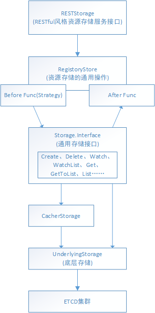

Table of Contents
=================

  * [1. etcd 配置](#1-etcd-配置)
  * [2. Apiserver定义etcd的config](#2-apiserver定义etcd的config)
     * [2.1 DefaultAPIResourceConfigSource](#21-defaultapiresourceconfigsource)
     * [2.2 初始化 storageFactory](#22-初始化-storagefactory)
  * [3. 以pod为例, apiserver是如何add/del/update etcd资源的](#3-以pod为例-apiserver是如何adddelupdate-etcd资源的)
     * [3.1 NewStorage](#31-newstorage)
     * [3.2 pod.Strategy](#32-podstrategy)
     * [3.3 CompleteWithOptions](#33-completewithoptions)
     * [3.4 总结](#34-总结)
  * [4. 总结](#4-总结)
  * [5.参考链接：](#5参考链接)

本节介绍apiserver是如何使用etcd进行存储的。在apiserver的启动流程下中分析到了，不同资源的url注册最终依赖于一个Storage的东西。接下来就分析Storage到底是什么。

### 1. etcd 配置

这里就是指定一些etcd的参数，比如EnableWatchCache，EtcdPathPrefix，数据格式等等。

```
// NewServerRunOptions creates a new ServerRunOptions object with default parameters
func NewServerRunOptions() *ServerRunOptions {
	s := ServerRunOptions{
   ...
   // 资源信息存储路径前缀缺省为：DefaultEtcdPathPrefix = "registry"。但是这个参数我们可以在运行时指定参数覆盖，具体的参数配置为：etcd-prefix
		Etcd:                    genericoptions.NewEtcdOptions(storagebackend.NewDefaultConfig(kubeoptions.DefaultEtcdPathPrefix, nil)),
	...
		}
		// 指定etcd的数据格式为protobuf
		s.Etcd.DefaultStorageMediaType = "application/vnd.kubernetes.protobuf"
	}
  
  
func NewEtcdOptions(backendConfig *storagebackend.Config) *EtcdOptions {
	 options := &EtcdOptions{
		StorageConfig:           *backendConfig,
		DefaultStorageMediaType: "application/json",
		DeleteCollectionWorkers: 1,
		EnableGarbageCollection: true,
		EnableWatchCache:        true,
		DefaultWatchCacheSize:   100,
	}
	options.StorageConfig.CountMetricPollPeriod = time.Minute
	return options
}


func NewDefaultConfig(prefix string, codec runtime.Codec) *Config {
	return &Config{
		Paging:             true,
		Prefix:             prefix,
		Codec:              codec,
		CompactionInterval: DefaultCompactInterval,
	}
}
```

### 2. Apiserver定义etcd的config

cmd/kube-apiserver/app/server.go buildGenericConfig函数回生存很多config，其中就有etcd的config。

buildGenericConfig关于etcd做的事情如下：

- 1、调用 `master.DefaultAPIResourceConfigSource` 加载需要启用的 API Resource
- 2、初始化，并补全StorageFactory的配置。s.Etcd就是上面定义的etcd配置

```
  ...
  // 1.加载默认支持的资源
  genericConfig.MergedResourceConfig = master.DefaultAPIResourceConfigSource()
  ... 
  storageFactoryConfig := kubeapiserver.NewStorageFactoryConfig()
	storageFactoryConfig.APIResourceConfig = genericConfig.MergedResourceConfig
	completedStorageFactoryConfig, err := storageFactoryConfig.Complete(s.Etcd)
	if err != nil {
		lastErr = err
		return
	}
	storageFactory, lastErr = completedStorageFactoryConfig.New()
	if lastErr != nil {
		return
	}
	if genericConfig.EgressSelector != nil {
		storageFactory.StorageConfig.Transport.EgressLookup = genericConfig.EgressSelector.Lookup
	}
	if lastErr = s.Etcd.ApplyWithStorageFactoryTo(storageFactory, genericConfig); lastErr != nil {
		return
	}
```

<br>

#### 2.1 DefaultAPIResourceConfigSource

可以看出来DefaultAPIResourceConfigSource函数就是返回当前集群支持哪些默认的版本和资源。

```
// DefaultAPIResourceConfigSource returns default configuration for an APIResource.
func DefaultAPIResourceConfigSource() *serverstorage.ResourceConfig {
	ret := serverstorage.NewResourceConfig()
	// NOTE: GroupVersions listed here will be enabled by default. Don't put alpha versions in the list.
	ret.EnableVersions(
		admissionregistrationv1.SchemeGroupVersion,
		admissionregistrationv1beta1.SchemeGroupVersion,
		apiv1.SchemeGroupVersion,
		appsv1.SchemeGroupVersion,
		authenticationv1.SchemeGroupVersion,
		authenticationv1beta1.SchemeGroupVersion,
		authorizationapiv1.SchemeGroupVersion,
		authorizationapiv1beta1.SchemeGroupVersion,
		autoscalingapiv1.SchemeGroupVersion,
		autoscalingapiv2beta1.SchemeGroupVersion,
		autoscalingapiv2beta2.SchemeGroupVersion,
		batchapiv1.SchemeGroupVersion,
		batchapiv1beta1.SchemeGroupVersion,
		certificatesapiv1beta1.SchemeGroupVersion,
		coordinationapiv1.SchemeGroupVersion,
		coordinationapiv1beta1.SchemeGroupVersion,
		discoveryv1beta1.SchemeGroupVersion,
		eventsv1beta1.SchemeGroupVersion,
		extensionsapiv1beta1.SchemeGroupVersion,
		networkingapiv1.SchemeGroupVersion,
		networkingapiv1beta1.SchemeGroupVersion,
		nodev1beta1.SchemeGroupVersion,
		policyapiv1beta1.SchemeGroupVersion,
		rbacv1.SchemeGroupVersion,
		rbacv1beta1.SchemeGroupVersion,
		storageapiv1.SchemeGroupVersion,
		storageapiv1beta1.SchemeGroupVersion,
		schedulingapiv1beta1.SchemeGroupVersion,
		schedulingapiv1.SchemeGroupVersion,
	)
	// enable non-deprecated beta resources in extensions/v1beta1 explicitly so we have a full list of what's possible to serve
	ret.EnableResources(
		extensionsapiv1beta1.SchemeGroupVersion.WithResource("ingresses"),
	)
	// disable deprecated beta resources in extensions/v1beta1 explicitly so we have a full list of what's possible to serve
	ret.DisableResources(
		extensionsapiv1beta1.SchemeGroupVersion.WithResource("daemonsets"),
		extensionsapiv1beta1.SchemeGroupVersion.WithResource("deployments"),
		extensionsapiv1beta1.SchemeGroupVersion.WithResource("networkpolicies"),
		extensionsapiv1beta1.SchemeGroupVersion.WithResource("podsecuritypolicies"),
		extensionsapiv1beta1.SchemeGroupVersion.WithResource("replicasets"),
		extensionsapiv1beta1.SchemeGroupVersion.WithResource("replicationcontrollers"),
	)
	// disable deprecated beta versions explicitly so we have a full list of what's possible to serve
	ret.DisableVersions(
		appsv1beta1.SchemeGroupVersion,
		appsv1beta2.SchemeGroupVersion,
	)
	// disable alpha versions explicitly so we have a full list of what's possible to serve
	ret.DisableVersions(
		auditregistrationv1alpha1.SchemeGroupVersion,
		batchapiv2alpha1.SchemeGroupVersion,
		nodev1alpha1.SchemeGroupVersion,
		rbacv1alpha1.SchemeGroupVersion,
		schedulingv1alpha1.SchemeGroupVersion,
		settingsv1alpha1.SchemeGroupVersion,
		storageapiv1alpha1.SchemeGroupVersion,
		flowcontrolv1alpha1.SchemeGroupVersion,
	)

	return ret
}
```

#### 2.2 初始化 storageFactory

这里分为了三步。

第一步：NewStorageFactoryConfig。

第二步：storageFactory, lastErr = completedStorageFactoryConfig.New()

第三步：s.Etcd.ApplyWithStorageFactoryTo(storageFactory, genericConfig)

<br>

**第一步**，NewStorageFactoryConfig就是定义了一些编码解码方式，以及需要覆盖的资源

```
// NewStorageFactoryConfig returns a new StorageFactoryConfig set up with necessary resource overrides.
func NewStorageFactoryConfig() *StorageFactoryConfig {

	resources := []schema.GroupVersionResource{
		batch.Resource("cronjobs").WithVersion("v1beta1"),
		networking.Resource("ingresses").WithVersion("v1beta1"),
		// TODO #83513 csinodes override can be removed in 1.18
		apisstorage.Resource("csinodes").WithVersion("v1beta1"),
		apisstorage.Resource("csidrivers").WithVersion("v1beta1"),
	}

	return &StorageFactoryConfig{
		Serializer:                legacyscheme.Codecs,        //传统的编码解码
		DefaultResourceEncoding:   serverstorage.NewDefaultResourceEncodingConfig(legacyscheme.Scheme),
		ResourceEncodingOverrides: resources,
	}
}
```

<br>

**第二步**，New 就是初始化了一个NewDefaultStorageFactory结构体。

* 描述了如何创建到底层存储的连接，包含了各种存储接口storage.Interface实现的认证信息。

例如默认使用etcd3，编码转换等方式。

```
// Config is configuration for creating a storage backend.
type Config struct {
	// Type defines the type of storage backend. Default ("") is "etcd3".
	Type string
	// Prefix is the prefix to all keys passed to storage.Interface methods.
	Prefix string
	// Transport holds all connection related info, i.e. equal TransportConfig means equal servers we talk to.
	Transport TransportConfig
	// Paging indicates whether the server implementation should allow paging (if it is
	// supported). This is generally configured by feature gating, or by a specific
	// resource type not wishing to allow paging, and is not intended for end users to
	// set.
	Paging bool

	Codec runtime.Codec
	// EncodeVersioner is the same groupVersioner used to build the
	// storage encoder. Given a list of kinds the input object might belong
	// to, the EncodeVersioner outputs the gvk the object will be
	// converted to before persisted in etcd.
	EncodeVersioner runtime.GroupVersioner
	// Transformer allows the value to be transformed prior to persisting into etcd.
	Transformer value.Transformer

	// CompactionInterval is an interval of requesting compaction from apiserver.
	// If the value is 0, no compaction will be issued.
	CompactionInterval time.Duration
	// CountMetricPollPeriod specifies how often should count metric be updated
	CountMetricPollPeriod time.Duration
}
```

以及其他的参数如下：

```
// New returns a new storage factory created from the completed storage factory configuration.
func (c *completedStorageFactoryConfig) New() (*serverstorage.DefaultStorageFactory, error) {
   resourceEncodingConfig := resourceconfig.MergeResourceEncodingConfigs(c.DefaultResourceEncoding, c.ResourceEncodingOverrides)
   storageFactory := serverstorage.NewDefaultStorageFactory(
      c.StorageConfig,      //描述了如何创建到底层存储的连接，包含了各种存储接口storage.Interface实现的认证信息。
      c.DefaultStorageMediaType,  //数据格式，缺省存储媒介类型，application/json
      c.Serializer,              //缺省序列化实例，legacyscheme.Codecs
      resourceEncodingConfig,    // 资源编码配置
      c.APIResourceConfig,    //API启用的资源版本
      SpecialDefaultResourcePrefixes)  //前缀

   // 同居资源绑定，约定了同居资源的查找顺序
   storageFactory.AddCohabitatingResources(networking.Resource("networkpolicies"), extensions.Resource("networkpolicies"))
   storageFactory.AddCohabitatingResources(apps.Resource("deployments"), extensions.Resource("deployments"))
   storageFactory.AddCohabitatingResources(apps.Resource("daemonsets"), extensions.Resource("daemonsets"))
   storageFactory.AddCohabitatingResources(apps.Resource("replicasets"), extensions.Resource("replicasets"))
   storageFactory.AddCohabitatingResources(api.Resource("events"), events.Resource("events"))
   storageFactory.AddCohabitatingResources(api.Resource("replicationcontrollers"), extensions.Resource("replicationcontrollers")) // to make scale subresources equivalent
   storageFactory.AddCohabitatingResources(policy.Resource("podsecuritypolicies"), extensions.Resource("podsecuritypolicies"))
   storageFactory.AddCohabitatingResources(networking.Resource("ingresses"), extensions.Resource("ingresses"))

  
   for _, override := range c.EtcdServersOverrides {
      tokens := strings.Split(override, "#")
      apiresource := strings.Split(tokens[0], "/")

      group := apiresource[0]
      resource := apiresource[1]
      groupResource := schema.GroupResource{Group: group, Resource: resource}

      servers := strings.Split(tokens[1], ";")
      storageFactory.SetEtcdLocation(groupResource, servers)
   }
   if len(c.EncryptionProviderConfigFilepath) != 0 {
      transformerOverrides, err := encryptionconfig.GetTransformerOverrides(c.EncryptionProviderConfigFilepath)
      if err != nil {
         return nil, err
      }
      for groupResource, transformer := range transformerOverrides {
         storageFactory.SetTransformer(groupResource, transformer)
      }
   }
   return storageFactory, nil
}


func NewDefaultStorageFactory(
    config storagebackend.Config,
    defaultMediaType string,                                // 从EtcdOptions参数中传入的，缺省为 application/json，见NewEtcdOptions方法
    defaultSerializer runtime.StorageSerializer,    // 具体的值：legacyscheme.Codecs
    resourceEncodingConfig ResourceEncodingConfig,  // 资源编码配置情况，并不是所有的资源都按照指定的Group来存放，有些特例。另外也可以指定存储在不同etcd、不同的prefix、甚至于不同的编码存储。
    resourceConfig APIResourceConfigSource,  //  启用的资源版本的API情况
    specialDefaultResourcePrefixes map[schema.GroupResource]string,  // 见：SpecialDefaultResourcePrefixes
) *DefaultStorageFactory {
    config.Paging = utilfeature.DefaultFeatureGate.Enabled(features.APIListChunking)
    if len(defaultMediaType) == 0 {
        defaultMediaType = runtime.ContentTypeJSON
    }
    return &DefaultStorageFactory{
        StorageConfig:           config, // 描述了如何创建到底层存储的连接，包含了各种存储接口storage.Interface实现的认证信息。
        Overrides:               map[schema.GroupResource]groupResourceOverrides{}, // 特殊资源处理
        DefaultMediaType:        defaultMediaType,  // 缺省存储媒介类型，application/json
        DefaultSerializer:       defaultSerializer,        // 缺省序列化实例，legacyscheme.Codecs
        ResourceEncodingConfig:  resourceEncodingConfig, // 资源编码配置
        APIResourceConfigSource: resourceConfig,           // API启用的资源版本
        DefaultResourcePrefixes: specialDefaultResourcePrefixes, // 特殊资源prefix

        newStorageCodecFn: NewStorageCodec, // 为提供的存储媒介类型、序列化和请求的存储与内存版本组装一个存储codec
    }
}
```

<br>

**第三步，**初始化 RESTOptionsGetter，后期根据其获取操作 Etcd 的句柄，同时添加 etcd 的健康检查方法

```
func (s *EtcdOptions) ApplyWithStorageFactoryTo(factory serverstorage.StorageFactory, c *server.Config) error {
	if err := s.addEtcdHealthEndpoint(c); err != nil {
		return err
	}
	c.RESTOptionsGetter = &StorageFactoryRestOptionsFactory{Options: *s, StorageFactory: factory}
	return nil
}
```

<br>

最终构建好的DefaultStorageFactory，会被存储在genericapiserver.Config的RESTOptionsGetter成员中，代码如上所示。

<br>

### 3. 以pod为例, apiserver是如何add/del/update etcd资源的

在创建KubeAPIServer的过程中，会调用InstallLegacyAPI注册api资源。其中就有一个NewLegacyRESTStorage的函数

```
func (c LegacyRESTStorageProvider) NewLegacyRESTStorage(restOptionsGetter generic.RESTOptionsGetter) (LegacyRESTStorage, genericapiserver.APIGroupInfo, error) {

 。。。
	podStorage, err := podstore.NewStorage(
		restOptionsGetter,              //这个就是之前的restOptionsGetter，里面有etcd的各种配置
		nodeStorage.KubeletConnectionInfo,
		c.ProxyTransport,
		podDisruptionClient,
	)

	serviceRest, serviceRestProxy := servicestore.NewREST(serviceRESTStorage,
		endpointsStorage,
		podStorage.Pod,
		serviceClusterIPAllocator,
		secondaryServiceClusterIPAllocator,
		serviceNodePortAllocator,
		c.ProxyTransport)

	restStorageMap := map[string]rest.Storage{
		"pods":             podStorage.Pod,
		"pods/attach":      podStorage.Attach,
		"pods/status":      podStorage.Status,
		"pods/log":         podStorage.Log,
		"pods/exec":        podStorage.Exec,
		"pods/portforward": podStorage.PortForward,
		"pods/proxy":       podStorage.Proxy,
		"pods/binding":     podStorage.Binding,
		"bindings":         podStorage.LegacyBinding,

		"podTemplates": podTemplateStorage,

		"replicationControllers":        controllerStorage.Controller,
		"replicationControllers/status": controllerStorage.Status,

		"services":        serviceRest,
		"services/proxy":  serviceRestProxy,
		"services/status": serviceStatusStorage,

		"endpoints": endpointsStorage,

		"nodes":        nodeStorage.Node,
		"nodes/status": nodeStorage.Status,
		"nodes/proxy":  nodeStorage.Proxy,

		"events": eventStorage,

		"limitRanges":                   limitRangeStorage,
		"resourceQuotas":                resourceQuotaStorage,
		"resourceQuotas/status":         resourceQuotaStatusStorage,
		"namespaces":                    namespaceStorage,
		"namespaces/status":             namespaceStatusStorage,
		"namespaces/finalize":           namespaceFinalizeStorage,
		"secrets":                       secretStorage,
		"serviceAccounts":               serviceAccountStorage,
		"persistentVolumes":             persistentVolumeStorage,
		"persistentVolumes/status":      persistentVolumeStatusStorage,
		"persistentVolumeClaims":        persistentVolumeClaimStorage,
		"persistentVolumeClaims/status": persistentVolumeClaimStatusStorage,
		"configMaps":                    configMapStorage,

		"componentStatuses": componentstatus.NewStorage(componentStatusStorage{c.StorageFactory}.serversToValidate),
	}
	if legacyscheme.Scheme.IsVersionRegistered(schema.GroupVersion{Group: "autoscaling", Version: "v1"}) {
		restStorageMap["replicationControllers/scale"] = controllerStorage.Scale
	}
	if legacyscheme.Scheme.IsVersionRegistered(schema.GroupVersion{Group: "policy", Version: "v1beta1"}) {
		restStorageMap["pods/eviction"] = podStorage.Eviction
	}
	if serviceAccountStorage.Token != nil {
		restStorageMap["serviceaccounts/token"] = serviceAccountStorage.Token
	}
	if utilfeature.DefaultFeatureGate.Enabled(features.EphemeralContainers) {
		restStorageMap["pods/ephemeralcontainers"] = podStorage.EphemeralContainers
	}
	apiGroupInfo.VersionedResourcesStorageMap["v1"] = restStorageMap

	return restStorage, apiGroupInfo, nil
}
```

<br>

#### 3.1 NewStorage

```
// NewStorage returns a RESTStorage object that will work against pods.
func NewStorage(optsGetter generic.RESTOptionsGetter, k client.ConnectionInfoGetter, proxyTransport http.RoundTripper, podDisruptionBudgetClient policyclient.PodDisruptionBudgetsGetter) (PodStorage, error) {

	store := &genericregistry.Store{
		NewFunc:                  func() runtime.Object { return &api.Pod{} },    //NewFunc用于构建一个Pod实例
		NewListFunc:              func() runtime.Object { return &api.PodList{} },
		PredicateFunc:            pod.MatchPod,
		DefaultQualifiedResource: api.Resource("pods"),
    
    // 关键点1，pod.Strategy
		CreateStrategy:      pod.Strategy,  
		UpdateStrategy:      pod.Strategy,
		DeleteStrategy:      pod.Strategy,
		ReturnDeletedObject: true,

		TableConvertor: printerstorage.TableConvertor{TableGenerator: printers.NewTableGenerator().With(printersinternal.AddHandlers)},
	}
	options := &generic.StoreOptions{
		RESTOptions: optsGetter,
		AttrFunc:    pod.GetAttrs,
		TriggerFunc: map[string]storage.IndexerFunc{"spec.nodeName": pod.NodeNameTriggerFunc},
	}
	// 关键点2，CompleteWithOptions
	if err := store.CompleteWithOptions(options); err != nil {
		return PodStorage{}, err
	}

	statusStore := *store
	statusStore.UpdateStrategy = pod.StatusStrategy
	ephemeralContainersStore := *store
	ephemeralContainersStore.UpdateStrategy = pod.EphemeralContainersStrategy

	bindingREST := &BindingREST{store: store}
	return PodStorage{
		Pod:                 &REST{store, proxyTransport},
		Binding:             &BindingREST{store: store},
		LegacyBinding:       &LegacyBindingREST{bindingREST},
		Eviction:            newEvictionStorage(store, podDisruptionBudgetClient),
		Status:              &StatusREST{store: &statusStore},
		EphemeralContainers: &EphemeralContainersREST{store: &ephemeralContainersStore},
		Log:                 &podrest.LogREST{Store: store, KubeletConn: k},
		Proxy:               &podrest.ProxyREST{Store: store, ProxyTransport: proxyTransport},
		Exec:                &podrest.ExecREST{Store: store, KubeletConn: k},
		Attach:              &podrest.AttachREST{Store: store, KubeletConn: k},
		PortForward:         &podrest.PortForwardREST{Store: store, KubeletConn: k},
	}, nil
}

```

上面代码的关键，就是store对象的创建，store.Storage的类型为：storage.Interface接口。

这里有两个关键点，pod.Strategy和CompleteWithOptions函数。

#### 3.2 pod.Strategy

可以看出来，podStrategy就是每一个storage独特的地方。比如NamespaceScoped函数表示了这个资源是否有namespaces这个概念。

这决定了了url中是否有namespace前缀。

PrepareForCreate，对接受的pod进行了status的初始化。这样通过kubectl create pod的话。obj包含了template信息。PrepareForCreate函数进行了status的初始化。

```
// podStrategy implements behavior for Pods
type podStrategy struct {
	runtime.ObjectTyper
	names.NameGenerator
}

// Strategy is the default logic that applies when creating and updating Pod
// objects via the REST API.
var Strategy = podStrategy{legacyscheme.Scheme, names.SimpleNameGenerator}

// NamespaceScoped is true for pods.
func (podStrategy) NamespaceScoped() bool {
	return true
}

// PrepareForCreate clears fields that are not allowed to be set by end users on creation.
func (podStrategy) PrepareForCreate(ctx context.Context, obj runtime.Object) {
	pod := obj.(*api.Pod)
	pod.Status = api.PodStatus{
		Phase:    api.PodPending,
		QOSClass: qos.GetPodQOS(pod),
	}

	podutil.DropDisabledPodFields(pod, nil)
}

// PrepareForUpdate clears fields that are not allowed to be set by end users on update.
func (podStrategy) PrepareForUpdate(ctx context.Context, obj, old runtime.Object) {
	newPod := obj.(*api.Pod)
	oldPod := old.(*api.Pod)
	newPod.Status = oldPod.Status

	podutil.DropDisabledPodFields(newPod, oldPod)
}

// Validate validates a new pod.
func (podStrategy) Validate(ctx context.Context, obj runtime.Object) field.ErrorList {
	pod := obj.(*api.Pod)
	allErrs := validation.ValidatePodCreate(pod)
	allErrs = append(allErrs, validation.ValidateConditionalPod(pod, nil, field.NewPath(""))...)
	return allErrs
}

// Canonicalize normalizes the object after validation.
func (podStrategy) Canonicalize(obj runtime.Object) {
}
。。。
```

<br>

#### 3.3 CompleteWithOptions

`store.CompleteWithOptions` 主要功能是为 store 中的配置设置一些默认的值以及根据提供的 options 更新 store，其中最主要的就是初始化 store 的后端存储实例。CompleteWithOptions函数如下：

```
// CompleteWithOptions updates the store with the provided options and
// defaults common fields.
func (e *Store) CompleteWithOptions(options *generic.StoreOptions) error {
	。。。省略了一些检查代码。。。
	
	attrFunc := options.AttrFunc
	if attrFunc == nil {
		if isNamespaced {
			attrFunc = storage.DefaultNamespaceScopedAttr
		} else {
			attrFunc = storage.DefaultClusterScopedAttr
		}
	}
	if e.PredicateFunc == nil {
		e.PredicateFunc = func(label labels.Selector, field fields.Selector) storage.SelectionPredicate {
			return storage.SelectionPredicate{
				Label:    label,
				Field:    field,
				GetAttrs: attrFunc,
			}
		}
	}

  // GetRESTOptions对etcd进行了初始化。
	opts, err := options.RESTOptions.GetRESTOptions(e.DefaultQualifiedResource)
	if err != nil {
		return err
	}

	// ResourcePrefix must come from the underlying factory
	prefix := opts.ResourcePrefix
	if !strings.HasPrefix(prefix, "/") {
		prefix = "/" + prefix
	}
	if prefix == "/" {
		return fmt.Errorf("store for %s has an invalid prefix %q", e.DefaultQualifiedResource.String(), opts.ResourcePrefix)
	}

	// Set the default behavior for storage key generation
	if e.KeyRootFunc == nil && e.KeyFunc == nil {
		if isNamespaced {
			e.KeyRootFunc = func(ctx context.Context) string {
				return NamespaceKeyRootFunc(ctx, prefix)
			}
			e.KeyFunc = func(ctx context.Context, name string) (string, error) {
				return NamespaceKeyFunc(ctx, prefix, name)
			}
		} else {
			e.KeyRootFunc = func(ctx context.Context) string {
				return prefix
			}
			e.KeyFunc = func(ctx context.Context, name string) (string, error) {
				return NoNamespaceKeyFunc(ctx, prefix, name)
			}
		}
	}

	// We adapt the store's keyFunc so that we can use it with the StorageDecorator
	// without making any assumptions about where objects are stored in etcd
	keyFunc := func(obj runtime.Object) (string, error) {
		accessor, err := meta.Accessor(obj)
		if err != nil {
			return "", err
		}

		if isNamespaced {
			return e.KeyFunc(genericapirequest.WithNamespace(genericapirequest.NewContext(), accessor.GetNamespace()), accessor.GetName())
		}

		return e.KeyFunc(genericapirequest.NewContext(), accessor.GetName())
	}

	if e.DeleteCollectionWorkers == 0 {
		e.DeleteCollectionWorkers = opts.DeleteCollectionWorkers
	}

	e.EnableGarbageCollection = opts.EnableGarbageCollection

	if e.ObjectNameFunc == nil {
		e.ObjectNameFunc = func(obj runtime.Object) (string, error) {
			accessor, err := meta.Accessor(obj)
			if err != nil {
				return "", err
			}
			return accessor.GetName(), nil
		}
	}

	if e.Storage.Storage == nil {
		e.Storage.Codec = opts.StorageConfig.Codec
		var err error
		e.Storage.Storage, e.DestroyFunc, err = opts.Decorator(
			opts.StorageConfig,
			prefix,
			keyFunc,
			e.NewFunc,
			e.NewListFunc,
			attrFunc,
			options.TriggerFunc,
		)
		if err != nil {
			return err
		}
		e.StorageVersioner = opts.StorageConfig.EncodeVersioner

		if opts.CountMetricPollPeriod > 0 {
			stopFunc := e.startObservingCount(opts.CountMetricPollPeriod)
			previousDestroy := e.DestroyFunc
			e.DestroyFunc = func() {
				stopFunc()
				if previousDestroy != nil {
					previousDestroy()
				}
			}
		}
	}

	return nil
}
```

在`CompleteWithOptions`方法内，调用了`options.RESTOptions.GetRESTOptions` 方法，其最终返回`generic.RESTOptions` 对象，`generic.RESTOptions` 对象中包含对 etcd 初始化的一些配置、数据序列化方法以及对 etcd 操作的 storage.Interface 对象。其会依次调用`StorageWithCacher-->NewRawStorage-->Create`方法创建最终依赖的后端存储。

```
func (f *StorageFactoryRestOptionsFactory) GetRESTOptions(resource schema.GroupResource) (generic.RESTOptions, error) {
	storageConfig, err := f.StorageFactory.NewConfig(resource)
	if err != nil {
		return generic.RESTOptions{}, fmt.Errorf("unable to find storage destination for %v, due to %v", resource, err.Error())
	}

	ret := generic.RESTOptions{
		StorageConfig:           storageConfig,
		Decorator:               generic.UndecoratedStorage,
		DeleteCollectionWorkers: f.Options.DeleteCollectionWorkers,
		EnableGarbageCollection: f.Options.EnableGarbageCollection,
		ResourcePrefix:          f.StorageFactory.ResourcePrefix(resource),
		CountMetricPollPeriod:   f.Options.StorageConfig.CountMetricPollPeriod,
	}
	if f.Options.EnableWatchCache {
		sizes, err := ParseWatchCacheSizes(f.Options.WatchCacheSizes)
		if err != nil {
			return generic.RESTOptions{}, err
		}
		cacheSize, ok := sizes[resource]
		if !ok {
			cacheSize = f.Options.DefaultWatchCacheSize
		}
		// depending on cache size this might return an undecorated storage
		ret.Decorator = genericregistry.StorageWithCacher(cacheSize)
	}

	return ret, nil
}

// NewRawStorage creates the low level kv storage. This is a work-around for current
// two layer of same storage interface.
// TODO: Once cacher is enabled on all registries (event registry is special), we will remove this method.
func NewRawStorage(config *storagebackend.Config) (storage.Interface, factory.DestroyFunc, error) {
	return factory.Create(*config)
}


// Create creates a storage backend based on given config.
func Create(c storagebackend.Config) (storage.Interface, DestroyFunc, error) {
	switch c.Type {
	case "etcd2":
		return nil, nil, fmt.Errorf("%v is no longer a supported storage backend", c.Type)
	case storagebackend.StorageTypeUnset, storagebackend.StorageTypeETCD3:
		return newETCD3Storage(c)
	default:
		return nil, nil, fmt.Errorf("unknown storage type: %s", c.Type)
	}
}
```

<br>

#### 3.4 总结

Pod对象需要定义好NewStorage，其中在NewStorage中定义了Strategy，里面包含了创建，更新前的各种操作。这样的好处就是，Strorage这一层封装好了每个资源的差异性，下层的etcd来了数据，就只管增删改就行。

同时调用了CompleteWithOptions函数和etcd进行了打通。

<br>

### 4. 总结

k8s中完整的etcd框架是下图所示：这里先分析到Stroage.Interface。知道一个大体流程。后面有需要再深入。





### 5.参考链接：

https://www.jianshu.com/p/daa4ff387a78

书籍：kubernetes源码解剖，郑东