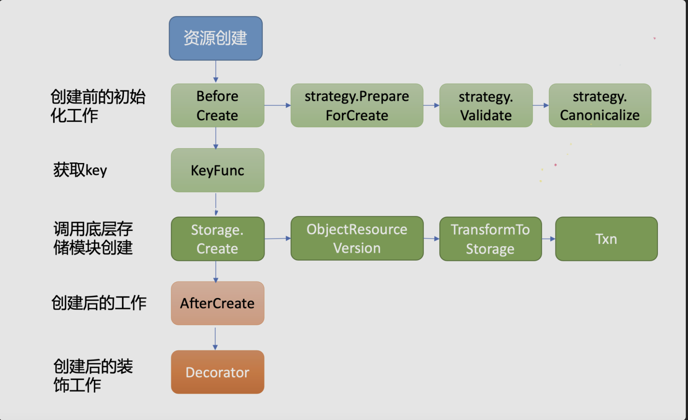

* [1\. 简介](#1-简介)
* [2\. 流程介绍](#2-流程介绍)
* [3\. pod创建](#3-pod创建)
  * [3\.1 pod create 前端逻辑](#31-pod-create-前端逻辑)
  * [3\.2 pod创建\-后端逻辑](#32-pod创建-后端逻辑)
    * [3\.2\.1 BeforeCreate函数](#321-beforecreate函数)
    * [3\.2\.2 Create函数](#322-create函数)
  * [3\.3 总结](#33-总结)
* [4\. Pod 删除](#4-pod-删除)
  * [4\.1 Delete](#41-delete)
  * [4\.2 BeforeDelete](#42-beforedelete)
  * [4\.3 updateForGracefulDeletionAndFinalizers](#43-updateforgracefuldeletionandfinalizers)
  * [4\.4 总结](#44-总结)
* [5\.参考](#5参考)

### 1. 简介

目前只剩下一个请求在kube-apiserver webhook之后，存放etcd之前的操作没有分析了。这里以pod为例介绍一下。

同时也用于快速定位创建，删除，更新，get某个资源时，apiserver做了什么操作。

<br>

再次回顾之前的apiserver初始化逻辑。可以看看之前的文章，回顾一下。

在之前的分析中：

InstallLegacyAPI函数的执行过程分为两步:

**第一步：**通过legacyRESTStorageProvider.NewLegacyRESTStorage函数实例化APIGroupInfo，APIGroupInfo对象用于描述资源组信

息，该对象的VersionedResourcesStorageMap字段用于存储资源与资源存储对象的映射关系，其表现形式为map[string]map[string]rest.Storage （即<资源版本>/<资源>/<资源存储对象>），

例如Pod资源与资源存储对象的映射关系是v1/pods/PodStorage。使Core Groups/v1下的资源与资源存储对象相互映射，代码路径：pkg/registry/core/rest/storage_core.go

```

  // storage就是将ulr和处理函数进行了绑定
	restStorageMap := map[string]rest.Storage{
		"pods":             podStorage.Pod,
		"pods/attach":      podStorage.Attach,
		"pods/status":      podStorage.Status,
		"pods/log":         podStorage.Log,
		"pods/exec":        podStorage.Exec,
		"pods/portforward": podStorage.PortForward,
		"pods/proxy":       podStorage.Proxy,
		"pods/binding":     podStorage.Binding,
		"bindings":         podStorage.LegacyBinding,

		"podTemplates": podTemplateStorage,

		"replicationControllers":        controllerStorage.Controller,
		"replicationControllers/status": controllerStorage.Status,

		"services":        serviceRest,
		"services/proxy":  serviceRestProxy,
		"services/status": serviceStatusStorage,

		"endpoints": endpointsStorage,

		"nodes":        nodeStorage.Node,
		"nodes/status": nodeStorage.Status,
		"nodes/proxy":  nodeStorage.Proxy,

		"events": eventStorage,

		"limitRanges":                   limitRangeStorage,
		"resourceQuotas":                resourceQuotaStorage,
		"resourceQuotas/status":         resourceQuotaStatusStorage,
		"namespaces":                    namespaceStorage,
		"namespaces/status":             namespaceStatusStorage,
		"namespaces/finalize":           namespaceFinalizeStorage,
		"secrets":                       secretStorage,
		"serviceAccounts":               serviceAccountStorage,
		"persistentVolumes":             persistentVolumeStorage,
		"persistentVolumes/status":      persistentVolumeStatusStorage,
		"persistentVolumeClaims":        persistentVolumeClaimStorage,
		"persistentVolumeClaims/status": persistentVolumeClaimStatusStorage,
		"configMaps":                    configMapStorage,

		"componentStatuses": componentstatus.NewStorage(componentStatusStorage{c.StorageFactory}.serversToValidate),
	}
	if legacyscheme.Scheme.IsVersionRegistered(schema.GroupVersion{Group: "autoscaling", Version: "v1"}) {
		restStorageMap["replicationControllers/scale"] = controllerStorage.Scale
	}
	if legacyscheme.Scheme.IsVersionRegistered(schema.GroupVersion{Group: "policy", Version: "v1beta1"}) {
		restStorageMap["pods/eviction"] = podStorage.Eviction
	}
	if serviceAccountStorage.Token != nil {
		restStorageMap["serviceaccounts/token"] = serviceAccountStorage.Token
	}
	if utilfeature.DefaultFeatureGate.Enabled(features.EphemeralContainers) {
		restStorageMap["pods/ephemeralcontainers"] = podStorage.EphemeralContainers
	}
```

<br>

**第二步：** 创建完上面的路由之后，则开始进行路由的安装，执行`InstallLegacyAPIGroup`方法，主要调用链为`InstallLegacyAPIGroup-->installAPIResources-->InstallREST-->Install-->registerResourceHandlers`，最终核心的路由构造在`registerResourceHandlers`方法内。

```

// Install handlers for API resources.
func (a *APIInstaller) Install() ([]metav1.APIResource, *restful.WebService, []error) {
	var apiResources []metav1.APIResource
	var errors []error
	ws := a.newWebService()

	// Register the paths in a deterministic (sorted) order to get a deterministic swagger spec.
	paths := make([]string, len(a.group.Storage))
	var i int = 0
	for path := range a.group.Storage {
		paths[i] = path
		i++
	}
	sort.Strings(paths)
	for _, path := range paths {
		apiResource, err := a.registerResourceHandlers(path, a.group.Storage[path], ws)
		if err != nil {
			errors = append(errors, fmt.Errorf("error in registering resource: %s, %v", path, err))
		}
		if apiResource != nil {
			apiResources = append(apiResources, *apiResource)
		}
	}
	return apiResources, ws, errors
}
```

install方法先创建了一个websevice。然后将所有的api 路径都存入一个数组：paths。对该数组排序（sort）。然后利用for range遍历数组的所有元素，调用registerResourceHandlers方法来对每个api路径注册，也就是和对应的storage以及Webservice绑定。

这里的storage指的是后端etcd的存储。storage变量是个map，Key是REST API的path，Value是rest.Storage接口，该接口就是一个通用的符合Restful要求的资源存储接口。
<br>

注意每个函数都会调用registerResourceHandlers

registerResourceHandlers 函数很长。定义在：staging/src/k8s.io/apiserver/pkg/endpoints/installer.go

代码不贴出来了。具体逻辑为：

（1） 首先对资源的后端存储storage（etcd的存储）进行验证，判断那些方法是storage所支持的。然后将所有支持的方法存入action数组中。比如判断是否支持，create, list, get, list, watch, patch等等动作。

```
	creater, isCreater := storage.(rest.Creater)
	namedCreater, isNamedCreater := storage.(rest.NamedCreater)
	lister, isLister := storage.(rest.Lister)
	getter, isGetter := storage.(rest.Getter)
	getterWithOptions, isGetterWithOptions := storage.(rest.GetterWithOptions)
	gracefulDeleter, isGracefulDeleter := storage.(rest.GracefulDeleter)
	collectionDeleter, isCollectionDeleter := storage.(rest.CollectionDeleter)
	updater, isUpdater := storage.(rest.Updater)
	patcher, isPatcher := storage.(rest.Patcher)
	watcher, isWatcher := storage.(rest.Watcher)
	connecter, isConnecter := storage.(rest.Connecter)
	storageMeta, isMetadata := storage.(rest.StorageMetadata)
```

（2）然后，遍历actions数组，在一个switch语句中，为所有元素定义路由。如贴出的case "GET"这一块，首先创建并包装一个handler对象，然后调用WebService的一系列方法，创建一个route对象，将handler绑定到这个route上。后面还有case "PUT"、case "DELETE"等一系列case，不一一贴出。最后，将route加入routes数组中。

```
{
		case "GET": // Get a resource.
		...
		case "LIST": // List all resources of a kind.
		...
		}
```

### 2. 流程介绍

上面是先注册了Storage，然后再实例化路由。这样每个资源的增删改查，就和路径对应上了。

然后根据registerResourceHandlers函数为每个资源的增删改查绑定  后端处理函数。

注意上面的case "GET", case "LIST"等都是通用的rest入口，最终会调用每个对象storage的处理函数。具体某个对象的storage处理逻辑如下：



接下里以pod为例来说明

### 3. pod创建

#### 3.1 pod create 前端逻辑

create 对应的是post方法，可以看到核心函数就是createHandler（staging/src/k8s.io/apiserver/pkg/endpoints/handlers/create.go）。函数逻辑如下：

（1）如果是dryRun，并且不支持dryRun就退出

（2）经历decode，admission，validation以及encode的流程

（3）调用 r.Create 完成某个资源对象storage处理，这一步是到后端和etcd交互的处理了。之前1,2都是apiserver自己的逻辑处理。

```
	case "POST": // Create a resource.
			var handler restful.RouteFunction
			if isNamedCreater {
				handler = restfulCreateNamedResource(namedCreater, reqScope, admit)
			} else {
				handler = restfulCreateResource(creater, reqScope, admit)
			}
			handler = metrics.InstrumentRouteFunc(action.Verb, group, version, resource, subresource, requestScope, metrics.APIServerComponent, handler)
			article := GetArticleForNoun(kind, " ")
			doc := "create" + article + kind
			if isSubresource {
				doc = "create " + subresource + " of" + article + kind
			}
			route := ws.POST(action.Path).To(handler).
				Doc(doc).
				Param(ws.QueryParameter("pretty", "If 'true', then the output is pretty printed.")).
				Operation("create"+namespaced+kind+strings.Title(subresource)+operationSuffix).
				Produces(append(storageMeta.ProducesMIMETypes(action.Verb), mediaTypes...)...).
				Returns(http.StatusOK, "OK", producedObject).
				// TODO: in some cases, the API may return a v1.Status instead of the versioned object
				// but currently go-restful can't handle multiple different objects being returned.
				Returns(http.StatusCreated, "Created", producedObject).
				Returns(http.StatusAccepted, "Accepted", producedObject).
				Reads(defaultVersionedObject).
				Writes(producedObject)
			if err := AddObjectParams(ws, route, versionedCreateOptions); err != nil {
				return nil, err
			}
			addParams(route, action.Params)
			routes = append(routes, route)
			
			
			
func restfulCreateNamedResource(r rest.NamedCreater, scope handlers.RequestScope, admit admission.Interface) restful.RouteFunction {
	return func(req *restful.Request, res *restful.Response) {
		handlers.CreateNamedResource(r, &scope, admit)(res.ResponseWriter, req.Request)
	}
}


// CreateNamedResource returns a function that will handle a resource creation with name.
func CreateNamedResource(r rest.NamedCreater, scope *RequestScope, admission admission.Interface) http.HandlerFunc {
	return createHandler(r, scope, admission, true)
}


// 核心函数createHandler
func createHandler(r rest.NamedCreater, scope *RequestScope, admit admission.Interface, includeName bool) http.HandlerFunc {
	return func(w http.ResponseWriter, req *http.Request) {
		// For performance tracking purposes.
		trace := utiltrace.New("Create", utiltrace.Field{Key: "url", Value: req.URL.Path}, utiltrace.Field{Key: "user-agent", Value: &lazyTruncatedUserAgent{req}}, utiltrace.Field{Key: "client", Value: &lazyClientIP{req}})
		defer trace.LogIfLong(500 * time.Millisecond)

		if isDryRun(req.URL) && !utilfeature.DefaultFeatureGate.Enabled(features.DryRun) {
			scope.err(errors.NewBadRequest("the dryRun alpha feature is disabled"), w, req)
			return
		}

		// TODO: we either want to remove timeout or document it (if we document, move timeout out of this function and declare it in api_installer)
		timeout := parseTimeout(req.URL.Query().Get("timeout"))

		namespace, name, err := scope.Namer.Name(req)
		if err != nil {
			if includeName {
				// name was required, return
				scope.err(err, w, req)
				return
			}

			// otherwise attempt to look up the namespace
			namespace, err = scope.Namer.Namespace(req)
			if err != nil {
				scope.err(err, w, req)
				return
			}
		}

		ctx, cancel := context.WithTimeout(req.Context(), timeout)
		defer cancel()
		ctx = request.WithNamespace(ctx, namespace)
		outputMediaType, _, err := negotiation.NegotiateOutputMediaType(req, scope.Serializer, scope)
		if err != nil {
			scope.err(err, w, req)
			return
		}

		gv := scope.Kind.GroupVersion()
		s, err := negotiation.NegotiateInputSerializer(req, false, scope.Serializer)
		if err != nil {
			scope.err(err, w, req)
			return
		}

		decoder := scope.Serializer.DecoderToVersion(s.Serializer, scope.HubGroupVersion)

		body, err := limitedReadBody(req, scope.MaxRequestBodyBytes)
		if err != nil {
			scope.err(err, w, req)
			return
		}

		options := &metav1.CreateOptions{}
		values := req.URL.Query()
		if err := metainternalversionscheme.ParameterCodec.DecodeParameters(values, scope.MetaGroupVersion, options); err != nil {
			err = errors.NewBadRequest(err.Error())
			scope.err(err, w, req)
			return
		}
		if errs := validation.ValidateCreateOptions(options); len(errs) > 0 {
			err := errors.NewInvalid(schema.GroupKind{Group: metav1.GroupName, Kind: "CreateOptions"}, "", errs)
			scope.err(err, w, req)
			return
		}
		options.TypeMeta.SetGroupVersionKind(metav1.SchemeGroupVersion.WithKind("CreateOptions"))

		defaultGVK := scope.Kind
		original := r.New()
		trace.Step("About to convert to expected version")
		obj, gvk, err := decoder.Decode(body, &defaultGVK, original)
		if err != nil {
			err = transformDecodeError(scope.Typer, err, original, gvk, body)
			scope.err(err, w, req)
			return
		}
		if gvk.GroupVersion() != gv {
			err = errors.NewBadRequest(fmt.Sprintf("the API version in the data (%s) does not match the expected API version (%v)", gvk.GroupVersion().String(), gv.String()))
			scope.err(err, w, req)
			return
		}
		trace.Step("Conversion done")

		ae := request.AuditEventFrom(ctx)
		admit = admission.WithAudit(admit, ae)
		audit.LogRequestObject(ae, obj, scope.Resource, scope.Subresource, scope.Serializer)

		userInfo, _ := request.UserFrom(ctx)

		// On create, get name from new object if unset
		if len(name) == 0 {
			_, name, _ = scope.Namer.ObjectName(obj)
		}
		admissionAttributes := admission.NewAttributesRecord(obj, nil, scope.Kind, namespace, name, scope.Resource, scope.Subresource, admission.Create, options, dryrun.IsDryRun(options.DryRun), userInfo)
		if mutatingAdmission, ok := admit.(admission.MutationInterface); ok && mutatingAdmission.Handles(admission.Create) {
			err = mutatingAdmission.Admit(ctx, admissionAttributes, scope)
			if err != nil {
				scope.err(err, w, req)
				return
			}
		}

		if scope.FieldManager != nil {
			liveObj, err := scope.Creater.New(scope.Kind)
			if err != nil {
				scope.err(fmt.Errorf("failed to create new object (Create for %v): %v", scope.Kind, err), w, req)
				return
			}

			obj, err = scope.FieldManager.Update(liveObj, obj, managerOrUserAgent(options.FieldManager, req.UserAgent()))
			if err != nil {
				scope.err(fmt.Errorf("failed to update object (Create for %v) managed fields: %v", scope.Kind, err), w, req)
				return
			}
		}

		trace.Step("About to store object in database")
		result, err := finishRequest(timeout, func() (runtime.Object, error) {
			return r.Create(
				ctx,
				name,
				obj,
				rest.AdmissionToValidateObjectFunc(admit, admissionAttributes, scope),
				options,
			)
		})
		if err != nil {
			scope.err(err, w, req)
			return
		}
		trace.Step("Object stored in database")

		code := http.StatusCreated
		status, ok := result.(*metav1.Status)
		if ok && err == nil && status.Code == 0 {
			status.Code = int32(code)
		}

		transformResponseObject(ctx, scope, trace, req, w, code, outputMediaType, result)
	}
}
```

<br>

#### 3.2 pod创建-后端逻辑

**创建pod特有逻辑**: r.Create，从之前的调用链可以看出来。当资源为pod时，e.CreateStrategy=podStrategy。

Create 这里的逻辑是：

（1）调用BeforeCreate做创建之前的工作，详见3.2.1

（2）得到对象的名字以及key，这个也是对象特有的

（3）调用Storage.Create开始创建对象

（4）创建对象后，如果这对象实现了AfterCreate, 再走AfterCreate逻辑，pod没有实现

（5）创建对象后，如果这对象实现了Decorator装饰, 再走AfterCreate逻辑，pod没有实现

```
// Create inserts a new item according to the unique key from the object.
func (e *Store) Create(ctx context.Context, obj runtime.Object, createValidation rest.ValidateObjectFunc, options *metav1.CreateOptions) (runtime.Object, error) {
  // 1。调用BeforeCreate做创建之前的工作，详见3.2.1
	if err := rest.BeforeCreate(e.CreateStrategy, ctx, obj); err != nil {
		return nil, err
	}
	// at this point we have a fully formed object.  It is time to call the validators that the apiserver
	// handling chain wants to enforce.
	if createValidation != nil {
		if err := createValidation(ctx, obj.DeepCopyObject()); err != nil {
			return nil, err
		}
	}
  
  // 2.得到对象的名字以及key，这个也是对象特有的
	name, err := e.ObjectNameFunc(obj)
	if err != nil {
		return nil, err
	}
	key, err := e.KeyFunc(ctx, name)
	if err != nil {
		return nil, err
	}
	qualifiedResource := e.qualifiedResourceFromContext(ctx)
	ttl, err := e.calculateTTL(obj, 0, false)
	if err != nil {
		return nil, err
	}
	
	// 3. 调用Storage.Create开始创建对象
	out := e.NewFunc()
	if err := e.Storage.Create(ctx, key, obj, out, ttl, dryrun.IsDryRun(options.DryRun)); err != nil {
		err = storeerr.InterpretCreateError(err, qualifiedResource, name)
		err = rest.CheckGeneratedNameError(e.CreateStrategy, err, obj)
		if !kubeerr.IsAlreadyExists(err) {
			return nil, err
		}
		if errGet := e.Storage.Get(ctx, key, "", out, false); errGet != nil {
			return nil, err
		}
		accessor, errGetAcc := meta.Accessor(out)
		if errGetAcc != nil {
			return nil, err
		}
		if accessor.GetDeletionTimestamp() != nil {
			msg := &err.(*kubeerr.StatusError).ErrStatus.Message
			*msg = fmt.Sprintf("object is being deleted: %s", *msg)
		}
		return nil, err
	}
	
  // 4.创建对象后，如果这对象实现了AfterCreate, 再走AfterCreate逻辑，pod没有实现
	if e.AfterCreate != nil {
		if err := e.AfterCreate(out); err != nil {
			return nil, err
		}
	}
	
	// 5.创建对象后，如果这对象实现了Decorator装饰, 再走AfterCreate逻辑，pod没有实现
	if e.Decorator != nil {
		if err := e.Decorator(out); err != nil {
			return nil, err
		}
	}
	return out, nil
}
```

##### 3.2.1 BeforeCreate函数

注意这里strategy是Pod

函数逻辑如下：

（1）获取objectMeta, kind, namespaces等信息

（2）设置DeletionTimestamp，DeletionGracePeriodSeconds等所有对象通用的字段

（3）设置pod资源特有的字段，这里是podStrategy

（4）做一下验证，以及Canonicalize，这个也是不同对象特有的

```
// BeforeCreate ensures that common operations for all resources are performed on creation. It only returns
// errors that can be converted to api.Status. It invokes PrepareForCreate, then GenerateName, then Validate.
// It returns nil if the object should be created.
func BeforeCreate(strategy RESTCreateStrategy, ctx context.Context, obj runtime.Object) error {
  // 1.获取objectMeta, kind, namespaces等信息
	objectMeta, kind, kerr := objectMetaAndKind(strategy, obj)
	if kerr != nil {
		return kerr
	}

	if strategy.NamespaceScoped() {
		if !ValidNamespace(ctx, objectMeta) {
			return errors.NewBadRequest("the namespace of the provided object does not match the namespace sent on the request")
		}
	} else if len(objectMeta.GetNamespace()) > 0 {
		objectMeta.SetNamespace(metav1.NamespaceNone)
	}
	
	// 2. 设置DeletionTimestamp，DeletionGracePeriodSeconds等所有对象通用的字段
	objectMeta.SetDeletionTimestamp(nil)
	objectMeta.SetDeletionGracePeriodSeconds(nil)
	
	// 3. 设置pod资源特有的字段，这里是podStrategy
	strategy.PrepareForCreate(ctx, obj)
	FillObjectMetaSystemFields(objectMeta)
	if len(objectMeta.GetGenerateName()) > 0 && len(objectMeta.GetName()) == 0 {
		objectMeta.SetName(strategy.GenerateName(objectMeta.GetGenerateName()))
	}

	// Ensure managedFields is not set unless the feature is enabled
	if !utilfeature.DefaultFeatureGate.Enabled(features.ServerSideApply) {
		objectMeta.SetManagedFields(nil)
	}

	// ClusterName is ignored and should not be saved
	if len(objectMeta.GetClusterName()) > 0 {
		objectMeta.SetClusterName("")
	}
  
  // 4.做一下验证，以及Canonicalize，这个也是不同对象特有的
	if errs := strategy.Validate(ctx, obj); len(errs) > 0 {
		return errors.NewInvalid(kind.GroupKind(), objectMeta.GetName(), errs)
	}

	// Custom validation (including name validation) passed
	// Now run common validation on object meta
	// Do this *after* custom validation so that specific error messages are shown whenever possible
	if errs := genericvalidation.ValidateObjectMetaAccessor(objectMeta, strategy.NamespaceScoped(), path.ValidatePathSegmentName, field.NewPath("metadata")); len(errs) > 0 {
		return errors.NewInvalid(kind.GroupKind(), objectMeta.GetName(), errs)
	}

	strategy.Canonicalize(obj)

	return nil
}
```

以pod为例。podStrategy定义在： pkg/registry/core/pod/strategy.go, pod和其他资源对象一样实现了这样的接口。

```
type RESTCreateStrategy interface {
	runtime.ObjectTyper
	// The name generator is used when the standard GenerateName field is set.
	// The NameGenerator will be invoked prior to validation.
	names.NameGenerator

	// NamespaceScoped returns true if the object must be within a namespace.
	NamespaceScoped() bool
	// PrepareForCreate is invoked on create before validation to normalize
	// the object.  For example: remove fields that are not to be persisted,
	// sort order-insensitive list fields, etc.  This should not remove fields
	// whose presence would be considered a validation error.
	//
	// Often implemented as a type check and an initailization or clearing of
	// status. Clear the status because status changes are internal. External
	// callers of an api (users) should not be setting an initial status on
	// newly created objects.
	PrepareForCreate(ctx context.Context, obj runtime.Object)
	// Validate returns an ErrorList with validation errors or nil.  Validate
	// is invoked after default fields in the object have been filled in
	// before the object is persisted.  This method should not mutate the
	// object.
	Validate(ctx context.Context, obj runtime.Object) field.ErrorList
	// Canonicalize allows an object to be mutated into a canonical form. This
	// ensures that code that operates on these objects can rely on the common
	// form for things like comparison.  Canonicalize is invoked after
	// validation has succeeded but before the object has been persisted.
	// This method may mutate the object. Often implemented as a type check or
	// empty method.
	Canonicalize(obj runtime.Object)
}
```

这里就看看PrepareForCreate。可以看出来这里就是设置了pod.Status=Pending

```
// PrepareForCreate clears fields that are not allowed to be set by end users on creation.
func (podStrategy) PrepareForCreate(ctx context.Context, obj runtime.Object) {
	pod := obj.(*api.Pod)
	pod.Status = api.PodStatus{
		Phase:    api.PodPending,
		QOSClass: qos.GetPodQOS(pod),
	}

	podutil.DropDisabledPodFields(pod, nil)
}
```

##### 3.2.2 Create函数

可以看出来Create是通用的，不要每个对象都实现，就是调用etcd3接口操作数据库了

staging/src/k8s.io/apiserver/pkg/registry/generic/registry/dryrun.go

```
func (s *DryRunnableStorage) Create(ctx context.Context, key string, obj, out runtime.Object, ttl uint64, dryRun bool) error {
	if dryRun {
		if err := s.Storage.Get(ctx, key, "", out, false); err == nil {
			return storage.NewKeyExistsError(key, 0)
		}
		s.copyInto(obj, out)
		return nil
	}
	return s.Storage.Create(ctx, key, obj, out, ttl)
}

s.Storage.Create 实现在k8s.io/apiserver/pkg/storage/etcd3/store.go 
```

#### 3.3 总结

pod创建的逻辑如下：

（1）经过apiserver通用的前端流程，就是判断是post接口，就走Create流程

（2）然后走通用逻辑，beforeCreate -> Create -> AfterCreate等等逻辑

比如： Create流程会先执行通用的部分，比如设置deletionStampTion等字段；然后再执行对象特有的，比如当一个pod对象创建时，需要设置pod.Status=Pending。

### 4. Pod 删除

同样还是回到前端逻辑，这里

```
case "DELETE": // Delete a resource.
   article := GetArticleForNoun(kind, " ")
   doc := "delete" + article + kind
   if isSubresource {
      doc = "delete " + subresource + " of" + article + kind
   }
   handler := metrics.InstrumentRouteFunc(action.Verb, group, version, resource, subresource, requestScope, metrics.APIServerComponent, restfulDeleteResource(gracefulDeleter, isGracefulDeleter, reqScope, admit))
   route := ws.DELETE(action.Path).To(handler).
      Doc(doc).
      Param(ws.QueryParameter("pretty", "If 'true', then the output is pretty printed.")).
      Operation("delete"+namespaced+kind+strings.Title(subresource)+operationSuffix).
      Produces(append(storageMeta.ProducesMIMETypes(action.Verb), mediaTypes...)...).
      Writes(versionedStatus).
      Returns(http.StatusOK, "OK", versionedStatus).
      Returns(http.StatusAccepted, "Accepted", versionedStatus)
   if isGracefulDeleter {
      route.Reads(versionedDeleterObject)
      route.ParameterNamed("body").Required(false)
      if err := AddObjectParams(ws, route, versionedDeleteOptions); err != nil {
         return nil, err
      }
   }
   addParams(route, action.Params)
   routes = append(routes, route)
```

<br>

前端逻辑和之前其实都一样，这里直接分析后端逻辑Delete

```
// DeleteResource returns a function that will handle a resource deletion
// TODO admission here becomes solely validating admission
func DeleteResource(r rest.GracefulDeleter, allowsOptions bool, scope *RequestScope, admit admission.Interface) http.HandlerFunc {
	return func(w http.ResponseWriter, req *http.Request) {
   ...
		trace.Step("About to delete object from database")
		wasDeleted := true
		userInfo, _ := request.UserFrom(ctx)
		staticAdmissionAttrs := admission.NewAttributesRecord(nil, nil, scope.Kind, namespace, name, scope.Resource, scope.Subresource, admission.Delete, options, dryrun.IsDryRun(options.DryRun), userInfo)
		result, err := finishRequest(timeout, func() (runtime.Object, error) {
			obj, deleted, err := r.Delete(ctx, name, rest.AdmissionToValidateObjectDeleteFunc(admit, staticAdmissionAttrs, scope), options)
			wasDeleted = deleted
			return obj, err
		})
		if err != nil {
			scope.err(err, w, req)
			return
		}
		trace.Step("Object deleted from database")


		transformResponseObject(ctx, scope, trace, req, w, status, outputMediaType, result)
	}
}
```

#### 4.1 Delete

核心逻辑如下：

（1）如果delete options指定了UID,ResourceVersion。需要进行对比确定，防止删错。可能会出现反复创建删除的时候删除错

（2）调用BeforeDelete，判断是否要优雅删除，是否正在优雅删除，BeforeDelete的核心逻辑见4.2，注意只有pod在这里会判断为优雅删除

（3）判断是否有finalizers

（4）如果需要优雅删除，或者有finalizers，则执行updateForGracefulDeletionAndFinalizers函数。这个函数会返回当前对象是不是可以立马删除

（5）如果不可以立马删除，返回

（6）如果可以立马删除，删除etcd中的数据

```
// Delete removes the item from storage.
func (e *Store) Delete(ctx context.Context, name string, deleteValidation rest.ValidateObjectFunc, options *metav1.DeleteOptions) (runtime.Object, bool, error) {
	key, err := e.KeyFunc(ctx, name)
	if err != nil {
		return nil, false, err
	}
	obj := e.NewFunc()
	qualifiedResource := e.qualifiedResourceFromContext(ctx)
	if err = e.Storage.Get(ctx, key, "", obj, false); err != nil {
		return nil, false, storeerr.InterpretDeleteError(err, qualifiedResource, name)
	}

	// support older consumers of delete by treating "nil" as delete immediately
	if options == nil {
		options = metav1.NewDeleteOptions(0)
	}
	// 1. 如果delete options指定了UID,ResourceVersion。需要进行对比确定，防止删错。可能会出现反复创建删除的时候删除错
	var preconditions storage.Preconditions
	if options.Preconditions != nil {
		preconditions.UID = options.Preconditions.UID
		preconditions.ResourceVersion = options.Preconditions.ResourceVersion
	}
	// 2.开始BeforeDelete
	graceful, pendingGraceful, err := rest.BeforeDelete(e.DeleteStrategy, ctx, obj, options)
	if err != nil {
		return nil, false, err
	}
	// this means finalizers cannot be updated via DeleteOptions if a deletion is already pending
	if pendingGraceful {
		out, err := e.finalizeDelete(ctx, obj, false)
		return out, false, err
	}
	// check if obj has pending finalizers
	accessor, err := meta.Accessor(obj)
	if err != nil {
		return nil, false, kubeerr.NewInternalError(err)
	}
	
	// 3.判断是否有finalizers
	pendingFinalizers := len(accessor.GetFinalizers()) != 0
	var ignoreNotFound bool
	var deleteImmediately bool = true
	var lastExisting, out runtime.Object

	// Handle combinations of graceful deletion and finalization by issuing
	// the correct updates.
	shouldUpdateFinalizers, _ := deletionFinalizersForGarbageCollection(ctx, e, accessor, options)
	// TODO: remove the check, because we support no-op updates now.
	
	// 4. 如果需要优雅删除，或者有finalizers，则执行updateForGracefulDeletionAndFinalizers函数

	if graceful || pendingFinalizers || shouldUpdateFinalizers {
		err, ignoreNotFound, deleteImmediately, out, lastExisting = e.updateForGracefulDeletionAndFinalizers(ctx, name, key, options, preconditions, deleteValidation, obj)
	}
  
  // 5. 如果不能立马删除，就返回。所以第一次pod删除就会到这里
	// !deleteImmediately covers all cases where err != nil. We keep both to be future-proof.
	if !deleteImmediately || err != nil {
		return out, false, err
	}

	// Going further in this function is not useful when we are
	// performing a dry-run request. Worse, it will actually
	// override "out" with the version of the object in database
	// that doesn't have the finalizer and deletiontimestamp set
	// (because the update above was dry-run too). If we already
	// have that version available, let's just return it now,
	// otherwise, we can call dry-run delete that will get us the
	// latest version of the object.
	if dryrun.IsDryRun(options.DryRun) && out != nil {
		return out, true, nil
	}
  
  
  // 第二次就到这里了，直接删除数据库数据了
	// delete immediately, or no graceful deletion supported
	klog.V(6).Infof("going to delete %s from registry: ", name)
	out = e.NewFunc()
	if err := e.Storage.Delete(ctx, key, out, &preconditions, storage.ValidateObjectFunc(deleteValidation), dryrun.IsDryRun(options.DryRun)); err != nil {
		// Please refer to the place where we set ignoreNotFound for the reason
		// why we ignore the NotFound error .
		if storage.IsNotFound(err) && ignoreNotFound && lastExisting != nil {
			// The lastExisting object may not be the last state of the object
			// before its deletion, but it's the best approximation.
			out, err := e.finalizeDelete(ctx, lastExisting, true)
			return out, true, err
		}
		return nil, false, storeerr.InterpretDeleteError(err, qualifiedResource, name)
	}
	out, err = e.finalizeDelete(ctx, out, true)
	return out, true, err
}
```


#### 4.2 BeforeDelete

函数逻辑如下：

（1）进行DeleteOptions的校验，并且如果指定了uuid,也进行判断

（2）判断是否支持优雅删除，核心是是否实现了RESTGracefulDeleteStrategy接口。这个接口只有Pod实现，所以对应Pod而言是优雅删除的；如果不支持直接返回

（3）如果deletionTime不为空，表示正在优雅删除了

（4）设置deleteTime，和GracePeriodSecond

```

// BeforeDelete tests whether the object can be gracefully deleted.
// If graceful is set, the object should be gracefully deleted.  If gracefulPending
// is set, the object has already been gracefully deleted (and the provided grace
// period is longer than the time to deletion). An error is returned if the
// condition cannot be checked or the gracePeriodSeconds is invalid. The options
// argument may be updated with default values if graceful is true. Second place
// where we set deletionTimestamp is pkg/registry/generic/registry/store.go.
// This function is responsible for setting deletionTimestamp during gracefulDeletion,
// other one for cascading deletions.
func BeforeDelete(strategy RESTDeleteStrategy, ctx context.Context, obj runtime.Object, options *metav1.DeleteOptions) (graceful, gracefulPending bool, err error) {
	objectMeta, gvk, kerr := objectMetaAndKind(strategy, obj)
	if kerr != nil {
		return false, false, kerr
	}
	// 1.进行DeleteOptions的校验，并且如果指定了uuid,也进行判断
	if errs := validation.ValidateDeleteOptions(options); len(errs) > 0 {
		return false, false, errors.NewInvalid(schema.GroupKind{Group: metav1.GroupName, Kind: "DeleteOptions"}, "", errs)
	}
	// Checking the Preconditions here to fail early. They'll be enforced later on when we actually do the deletion, too.
	if options.Preconditions != nil {
		if options.Preconditions.UID != nil && *options.Preconditions.UID != objectMeta.GetUID() {
			return false, false, errors.NewConflict(schema.GroupResource{Group: gvk.Group, Resource: gvk.Kind}, objectMeta.GetName(), fmt.Errorf("the UID in the precondition (%s) does not match the UID in record (%s). The object might have been deleted and then recreated", *options.Preconditions.UID, objectMeta.GetUID()))
		}
		if options.Preconditions.ResourceVersion != nil && *options.Preconditions.ResourceVersion != objectMeta.GetResourceVersion() {
			return false, false, errors.NewConflict(schema.GroupResource{Group: gvk.Group, Resource: gvk.Kind}, objectMeta.GetName(), fmt.Errorf("the ResourceVersion in the precondition (%s) does not match the ResourceVersion in record (%s). The object might have been modified", *options.Preconditions.ResourceVersion, objectMeta.GetResourceVersion()))
		}
	}
	
	// 2. 判断是否支持优雅删除
	gracefulStrategy, ok := strategy.(RESTGracefulDeleteStrategy)
	if !ok {
		// If we're not deleting gracefully there's no point in updating Generation, as we won't update
		// the obcject before deleting it.
		return false, false, nil
	}
	
	// 3.如果deletionTime不为空，所以正在优雅删除了
	// if the object is already being deleted, no need to update generation.
	if objectMeta.GetDeletionTimestamp() != nil {
		// if we are already being deleted, we may only shorten the deletion grace period
		// this means the object was gracefully deleted previously but deletionGracePeriodSeconds was not set,
		// so we force deletion immediately
		// IMPORTANT:
		// The deletion operation happens in two phases.
		// 1. Update to set DeletionGracePeriodSeconds and DeletionTimestamp
		// 2. Delete the object from storage.
		// If the update succeeds, but the delete fails (network error, internal storage error, etc.),
		// a resource was previously left in a state that was non-recoverable.  We
		// check if the existing stored resource has a grace period as 0 and if so
		// attempt to delete immediately in order to recover from this scenario.
		if objectMeta.GetDeletionGracePeriodSeconds() == nil || *objectMeta.GetDeletionGracePeriodSeconds() == 0 {
			return false, false, nil
		}
		// only a shorter grace period may be provided by a user
		if options.GracePeriodSeconds != nil {
			period := int64(*options.GracePeriodSeconds)
			if period >= *objectMeta.GetDeletionGracePeriodSeconds() {
				return false, true, nil
			}
			newDeletionTimestamp := metav1.NewTime(
				objectMeta.GetDeletionTimestamp().Add(-time.Second * time.Duration(*objectMeta.GetDeletionGracePeriodSeconds())).
					Add(time.Second * time.Duration(*options.GracePeriodSeconds)))
			objectMeta.SetDeletionTimestamp(&newDeletionTimestamp)
			objectMeta.SetDeletionGracePeriodSeconds(&period)
			return true, false, nil
		}
		// graceful deletion is pending, do nothing
		options.GracePeriodSeconds = objectMeta.GetDeletionGracePeriodSeconds()
		return false, true, nil
	}

	if !gracefulStrategy.CheckGracefulDelete(ctx, obj, options) {
		return false, false, nil
	}
	
	// 4. 设置deleteTime，和GracePeriodSecond
	now := metav1.NewTime(metav1.Now().Add(time.Second * time.Duration(*options.GracePeriodSeconds)))
	objectMeta.SetDeletionTimestamp(&now)
	objectMeta.SetDeletionGracePeriodSeconds(options.GracePeriodSeconds)
	// If it's the first graceful deletion we are going to set the DeletionTimestamp to non-nil.
	// Controllers of the object that's being deleted shouldn't take any nontrivial actions, hence its behavior changes.
	// Thus we need to bump object's Generation (if set). This handles generation bump during graceful deletion.
	// The bump for objects that don't support graceful deletion is handled in pkg/registry/generic/registry/store.go.
	if objectMeta.GetGeneration() > 0 {
		objectMeta.SetGeneration(objectMeta.GetGeneration() + 1)
	}
	return true, false, nil
}


这是个接口，判断该资源是否可以优雅删除, 只有pod实现了这个接口。
type RESTGracefulDeleteStrategy interface {
	// CheckGracefulDelete should return true if the object can be gracefully deleted and set
	// any default values on the DeleteOptions.
	CheckGracefulDelete(ctx context.Context, obj runtime.Object, options *metav1.DeleteOptions) bool
}
```

#### 4.3 updateForGracefulDeletionAndFinalizers

这里的一个核心就是，如果有finalizer的话，就调用markAsDeleting 函数，该函数也是设置deletionTimestamp和DeletionGracePeriodSeconds

```
// updateForGracefulDeletionAndFinalizers updates the given object for
// graceful deletion and finalization by setting the deletion timestamp and
// grace period seconds (graceful deletion) and updating the list of
// finalizers (finalization); it returns:
//
// 1. an error
// 2. a boolean indicating that the object was not found, but it should be
//    ignored
// 3. a boolean indicating that the object's grace period is exhausted and it
//    should be deleted immediately
// 4. a new output object with the state that was updated
// 5. a copy of the last existing state of the object
func (e *Store) updateForGracefulDeletionAndFinalizers(ctx context.Context, name, key string, options *metav1.DeleteOptions, preconditions storage.Preconditions, deleteValidation rest.ValidateObjectFunc, in runtime.Object) (err error, ignoreNotFound, deleteImmediately bool, out, lastExisting runtime.Object) {
	lastGraceful := int64(0)
	var pendingFinalizers bool
	out = e.NewFunc()
	err = e.Storage.GuaranteedUpdate(
		ctx,
		key,
		out,
		false, /* ignoreNotFound */
		&preconditions,
		storage.SimpleUpdate(func(existing runtime.Object) (runtime.Object, error) {
			if err := deleteValidation(ctx, existing); err != nil {
				return nil, err
			}
			graceful, pendingGraceful, err := rest.BeforeDelete(e.DeleteStrategy, ctx, existing, options)
			if err != nil {
				return nil, err
			}
			if pendingGraceful {
				return nil, errAlreadyDeleting
			}

			// Add/remove the orphan finalizer as the options dictates.
			// Note that this occurs after checking pendingGraceufl, so
			// finalizers cannot be updated via DeleteOptions if deletion has
			// started.
			existingAccessor, err := meta.Accessor(existing)
			if err != nil {
				return nil, err
			}
			needsUpdate, newFinalizers := deletionFinalizersForGarbageCollection(ctx, e, existingAccessor, options)
			if needsUpdate {
				existingAccessor.SetFinalizers(newFinalizers)
			}

			pendingFinalizers = len(existingAccessor.GetFinalizers()) != 0
			if !graceful {
				// set the DeleteGracePeriods to 0 if the object has pendingFinalizers but not supporting graceful deletion
				if pendingFinalizers {
					klog.V(6).Infof("update the DeletionTimestamp to \"now\" and GracePeriodSeconds to 0 for object %s, because it has pending finalizers", name)
					err = markAsDeleting(existing, time.Now())
					if err != nil {
						return nil, err
					}
					return existing, nil
				}
				return nil, errDeleteNow
			}
			lastGraceful = *options.GracePeriodSeconds
			lastExisting = existing
			return existing, nil
		}),
		dryrun.IsDryRun(options.DryRun),
	)
	
	
	
	
markAsDeleting 函数也是设置deletionTimestamp和DeletionGracePeriodSeconds
	
	// markAsDeleting sets the obj's DeletionGracePeriodSeconds to 0, and sets the
// DeletionTimestamp to "now" if there is no existing deletionTimestamp or if the existing
// deletionTimestamp is further in future. Finalizers are watching for such updates and will
// finalize the object if their IDs are present in the object's Finalizers list.
func markAsDeleting(obj runtime.Object, now time.Time) (err error) {
	objectMeta, kerr := meta.Accessor(obj)
	if kerr != nil {
		return kerr
	}
	// This handles Generation bump for resources that don't support graceful
	// deletion. For resources that support graceful deletion is handle in
	// pkg/api/rest/delete.go
	if objectMeta.GetDeletionTimestamp() == nil && objectMeta.GetGeneration() > 0 {
		objectMeta.SetGeneration(objectMeta.GetGeneration() + 1)
	}
	existingDeletionTimestamp := objectMeta.GetDeletionTimestamp()
	if existingDeletionTimestamp == nil || existingDeletionTimestamp.After(now) {
		metaNow := metav1.NewTime(now)
		objectMeta.SetDeletionTimestamp(&metaNow)
	}
	var zero int64 = 0
	objectMeta.SetDeletionGracePeriodSeconds(&zero)
	return nil
}
```

<br>

#### 4.4 总结

(1)  k8S的这套机制，只需要你自己写好对象的strategy就行，beforeCreate, afterCreate等等，不需要和数据库打交道。扩展性很强

(2) K8s 中对象删除基本流程如下：

- 客户端提交删除请求到 API Server

- - 可选传递 GracePeriodSeconds 参数

- API Server 做 Graceful Deletion 检查

- - 若对象实现了 RESTGracefulDeleteStrategy 接口，会调用对应的实现并返回是否需要进行 Graceful 删除

- API Server 检查 Finalizers 并结合是否需要进行 graceful 删除，来决定是否立即删除对象

- - 若对象需要进行 graceful 删除，更新 metadata.DeletionGracePeriodSecond 和 metadata.DeletionTimestamp 字段，不从存储中删除对象

  - 若对象不需要进行 Graceful 删除时

  - - metadata.Finalizers 为空，直接删除
    - metadata.Finalizers 不为空，不删除，只更新 metadata.DeletionTimestamp

注：

当前 k8s 内置资源，只有 Pod 对象实现了 [RESTGracefulDeleteStrategy](https://link.zhihu.com/?target=https%3A//github.com/kubernetes/kubernetes/blob/v1.18.0/staging/src/k8s.io/apiserver/pkg/registry/rest/delete.go%23L55-L61) 接口。对于其他对象，都不会进入 Graceful 删除状态。

<br>

所以k8s中的删除资源时其实是2步，第一步是设置metadata.DeletionTimestamp字段。第二步是正在的删除。

pod是这个逻辑的原因是它实现了RESTGracefulDeleteStrategy接口。

其他资源比如deploy资源也是这个逻辑，是因为K8s删除的时候，会默认后天删除（前台删除，孤儿删除），实际会带finalizer。所以有finalizer实际上也实现了优雅删除。

<br>

当遇到对象删不掉的时候，方法：

- 删除 finalizers ，让关联的逻辑不需要执行
- kubelet delete --force --grace-period 0 直接删除

到这里就结束吧，pod get, list, patch等对象基本都是这个思路

### 5.参考

https://duyanghao.github.io/kubernetes-apiserver-overview/

https://blog.csdn.net/hahachenchen789/article/details/113880166

https://www.kubesre.com/archives/chuang-jian-yi-ge-pod-bei-hou-etcd-de-gu-shi

https://zhuanlan.zhihu.com/p/161072336