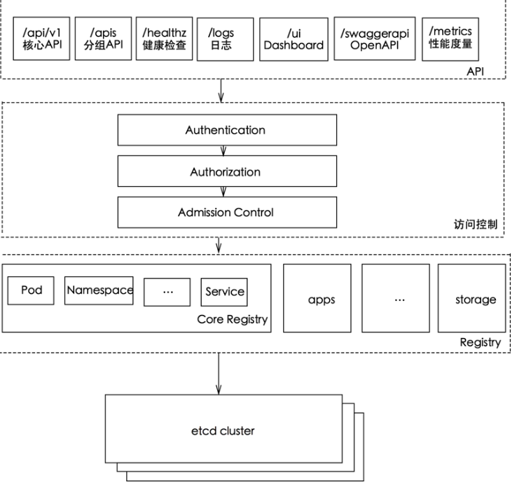
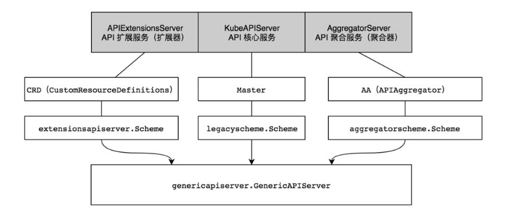
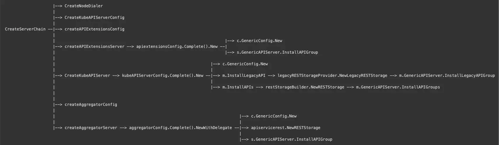
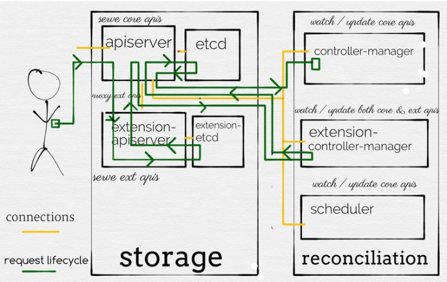

* [Table of Contents](#table-of-contents)
    * [1\. kube\-apiserver组件整体功能](#1-kube-apiserver组件整体功能)
    * [2\. bootstrap\-controller](#2-bootstrap-controller)
      * [2\.1 NewBootstrapController](#21-newbootstrapcontroller)
      * [2\.2 BootstrapController\.PostStartHook](#22-bootstrapcontrollerpoststarthook)
      * [2\.3 四个函数](#23-四个函数)
        * [1\-RunKubernetesNamespaces](#1-runkubernetesnamespaces)
        * [2\- RunKubernetesService](#2--runkubernetesservice)
        * [3\- repairClusterIPs\.RunUntil](#3--repairclusteripsrununtil)
        * [4\-repairNodePorts\.RunUntil](#4-repairnodeportsrununtil)
      * [2\.4 总结](#24-总结)
    * [3\. KubeAPIServer](#3-kubeapiserver)
    * [4\.aggregatorServer](#4aggregatorserver)
    * [5\. apiExtensionsServer](#5-apiextensionsserver)
    * [6\.总结](#6总结)
      * [6\.1 kubeAPIServer, apiExtensionsServer, aggregatorServer 总结](#61-kubeapiserver-apiextensionsserver-aggregatorserver-总结)
      * [6\.2 bootstrap\-controller](#62-bootstrap-controller)
    * [7\. 参考文档](#7-参考文档)

**本章重点：**

（1）对kube-apiserver进行简单介绍

（2）介绍kube-apiserver的四个组成部分：kubeApiServer, aggregatorServer, apiExtensionsServer, 以及bootstrap-controller（这个一般很少关注到）

bootstrap-controller主要有以下四个功能：

- 创建 kubernetes service；
- 创建 default、kube-system 和 kube-public 以及 kube-node-lease 命名空间；
- 提供基于 Service ClusterIP 的修复及检查功能；
- 提供基于 Service NodePort 的修复及检查功能；

<br>

### 1. kube-apiserver组件整体功能

kube-apiserver 是唯一一个和 etcd打交道的组件。其他的组件都是通过apiserver提供的RESTful APIs间接操作集群中的资源，主要有以下的功能：

* 获取请求内容

* 请求内容检查

* 认证、audit、授权、

* 修改式准入控制

* 路由

* 验证式准入控制

* 资源的格式转换、

* 持久化存储到etcd等功能



k8s中api-server实际上包括四个部分：

- **KubeApiServer**： 负责对请求的一些通用处理，包括：认证、鉴权以及各个内建资源(pod, deployment，service and etc)的REST服务等
- **bootstrap-controller**，主要负责Kubernetes default apiserver service的创建以及管理。
- **ApiExtensionsServer**   负责CustomResourceDefinition（CRD）apiResources以及apiVersions的注册，同时处理CRD以及相应CustomResource（CR）的REST请求(如果对应CR不能被处理的话则会返回404)，也是apiserver Delegation的最后一环
- **AggregatorServer**   负责处理 `apiregistration.k8s.io` 组下的APIService资源请求，同时将来自用户的请求拦截转发给aggregated server(AA)

其中**KubeApiServer** , **ApiExtensionsServer**  ,**AggregatorServer**   通过链条的形式组合起来（**使用了责任链模式**）。



接下来将对四个组件进行分析

<br>

### 2. bootstrap-controller

bootstrap-controller主要有以下四个功能：

- 创建 kubernetes service；
- 创建 default、kube-system 和 kube-public 以及 kube-node-lease 命名空间；
- 提供基于 Service ClusterIP 的修复及检查功能；
- 提供基于 Service NodePort 的修复及检查功能；

**创建 kubernetes service就是下面这个 svc. 这个用于集群内部资源的访问**

```
[root@k8s-master ~]# kubectl get svc
NAME         TYPE        CLUSTER-IP   EXTERNAL-IP   PORT(S)   AGE
kubernetes   ClusterIP   10.0.0.1     <none>        443/TCP   108d
[root@k8s-master ~]# kubectl get ep -oyaml
apiVersion: v1
items:
- apiVersion: v1
  kind: Endpoints
  metadata:
    creationTimestamp: 2020-12-23T12:34:11Z
    name: kubernetes
    namespace: default
    resourceVersion: "34"
    selfLink: /api/v1/namespaces/default/endpoints/kubernetes
    uid: 287f22bd-451b-11eb-bb05-fa270004b00d
  subsets:
  - addresses:
    - ip: 192.168.0.4
    ports:
    - name: https
      port: 6443
      protocol: TCP
kind: List
metadata:
  resourceVersion: ""
  selfLink: ""
```

<br>

- **apiserver bootstrap-controller** 创建&运行逻辑在k8s.io/kubernetes/pkg/master目录
- **bootstrap-controller** 主要用于创建以及维护内部kubernetes default apiserver service (就是 default命名空间下的 kubernetes服务)
- **kubernetes default apiserver service spec.selector**为空，这是default apiserver service与其它正常service的最大区别，表明了这个特殊的service对应的endpoints不由endpoints controller控制，而是直接受kube-apiserver bootstrap-controller管理(maintained by this code, not by the pod selector)

```
// CreateServerChain creates the apiservers connected via delegation.
func CreateServerChain(completedOptions completedServerRunOptions, stopCh <-chan struct{}) (*aggregatorapiserver.APIAggregator, error) {

	apiExtensionsServer, err := createAPIExtensionsServer(apiExtensionsConfig, genericapiserver.NewEmptyDelegate())
	if err != nil {
		return nil, err
	}

    // 1.创建KubeAPIServer的时候，调用了CreateKubeAPIServer
	kubeAPIServer, err := CreateKubeAPIServer(kubeAPIServerConfig, apiExtensionsServer.GenericAPIServer)
	if err != nil {
		return nil, err
	}

	// aggregator comes last in the chain
	aggregatorConfig, err := createAggregatorConfig(*kubeAPIServerConfig.GenericConfig, completedOptions.ServerRunOptions, kubeAPIServerConfig.ExtraConfig.VersionedInformers, serviceResolver, proxyTransport, pluginInitializer)
	if err != nil {
		return 
		
	return aggregatorServer, nil
}

## 2.调用了New
// CreateKubeAPIServer creates and wires a workable kube-apiserver
func CreateKubeAPIServer(kubeAPIServerConfig *master.Config, delegateAPIServer genericapiserver.DelegationTarget) (*master.Master, error) {
	kubeAPIServer, err := kubeAPIServerConfig.Complete().New(delegateAPIServer)
	if err != nil {
		return nil, err
	}

	return kubeAPIServer, nil
}


## 3. 其中有一步调用了InstallLegacyAPI
// New returns a new instance of Master from the given config.
// Certain config fields will be set to a default value if unset.
// Certain config fields must be specified, including:
//   KubeletClientConfig
func (c completedConfig) New(delegationTarget genericapiserver.DelegationTarget) (*Master, error) {
	....
	
		if err := m.InstallLegacyAPI(&c, c.GenericConfig.RESTOptionsGetter, legacyRESTStorageProvider); err != nil {
			return nil, err
		}
	}

	return m, nil
}


## 4.installLegacyApi 中将 boot-controller的启动和停止，添加到了apiserver 的 PostStartHook 和 PreShutdownHook 
// InstallLegacyAPI will install the legacy APIs for the restStorageProviders if they are enabled.
func (m *Master) InstallLegacyAPI(c *completedConfig, restOptionsGetter generic.RESTOptionsGetter, legacyRESTStorageProvider corerest.LegacyRESTStorageProvider) error {

   ## 1.将boostrap-controller的启停添加到apiserver 的 PostStartHook 和 PreShutdownHook 
	controllerName := "bootstrap-controller"
	coreClient := corev1client.NewForConfigOrDie(c.GenericConfig.LoopbackClientConfig)
	
	## 2. New一个BootstrapController
	bootstrapController := c.NewBootstrapController(legacyRESTStorage, coreClient, coreClient, coreClient, coreClient.RESTClient())
	
	m.GenericAPIServer.AddPostStartHookOrDie(controllerName, bootstrapController.PostStartHook)
	m.GenericAPIServer.AddPreShutdownHookOrDie(controllerName, bootstrapController.PreShutdownHook)

	return nil
}

## postStartHooks 会在 kube-apiserver 的启动方法 prepared.Run 中调用 RunPostStartHooks 启动所有 Hook

// NonBlockingRun spawns the secure http server. An error is
// returned if the secure port cannot be listened on.
func (s preparedGenericAPIServer) NonBlockingRun(stopCh <-chan struct{}) error {
	// Use an stop channel to allow graceful shutdown without dropping audit events
	// after http server shutdown.
	auditStopCh := make(chan struct{})

	// Start the audit backend before any request comes in. This means we must call Backend.Run
	// before http server start serving. Otherwise the Backend.ProcessEvents call might block.
	if s.AuditBackend != nil {
		if err := s.AuditBackend.Run(auditStopCh); err != nil {
			return fmt.Errorf("failed to run the audit backend: %v", err)
		}
	}

	// Use an internal stop channel to allow cleanup of the listeners on error.
	internalStopCh := make(chan struct{})
	var stoppedCh <-chan struct{}
	if s.SecureServingInfo != nil && s.Handler != nil {
		var err error
		stoppedCh, err = s.SecureServingInfo.Serve(s.Handler, s.ShutdownTimeout, internalStopCh)
		if err != nil {
			close(internalStopCh)
			close(auditStopCh)
			return err
		}
	}

	// Now that listener have bound successfully, it is the
	// responsibility of the caller to close the provided channel to
	// ensure cleanup.
	go func() {
		<-stopCh
		close(internalStopCh)
		if stoppedCh != nil {
			<-stoppedCh
		}
		s.HandlerChainWaitGroup.Wait()
		close(auditStopCh)
	}()

	s.RunPostStartHooks(stopCh)

	if _, err := systemd.SdNotify(true, "READY=1\n"); err != nil {
		klog.Errorf("Unable to send systemd daemon successful start message: %v\n", err)
	}

	return nil
}

// RunPostStartHooks runs the PostStartHooks for the server
func (s *GenericAPIServer) RunPostStartHooks(stopCh <-chan struct{}) {
	s.postStartHookLock.Lock()
	defer s.postStartHookLock.Unlock()
	s.postStartHooksCalled = true

	context := PostStartHookContext{
		LoopbackClientConfig: s.LoopbackClientConfig,
		StopCh:               stopCh,
	}

	for hookName, hookEntry := range s.postStartHooks {
		go runPostStartHook(hookName, hookEntry, context)
	}
}
```

bootstrap controller 的初始化以及启动是在 `CreateKubeAPIServer` 调用链的 `InstallLegacyAPI` 方法中完成的，bootstrap controller 的启停是由 apiserver 的 `PostStartHook` 和 `PreShutdownHook` 进行控制的

<br>

#### 2.1 NewBootstrapController

 bootstrap controller 在初始化时需要设定多个参数，主要有 PublicIP、ServiceCIDR、PublicServicePort 等。PublicIP 是通过命令行参数 `--advertise-address` 指定的，PublicServicePort 通过 `--secure-port` 启动参数来指定（默认为 6443），ServiceCIDR 通过 `--service-cluster-ip-range` 参数指定（默认为 10.0.0.0/24） 

```
// k8s.io/kubernetes/pkg/master/controller.go:87
// NewBootstrapController returns a controller for watching the core capabilities of the master
func (c *completedConfig) NewBootstrapController(legacyRESTStorage corerest.LegacyRESTStorage, serviceClient corev1client.ServicesGetter, nsClient corev1client.NamespacesGetter, eventClient corev1client.EventsGetter, healthClient rest.Interface) *Controller {
	// 1、获取 PublicServicePort  
	_, publicServicePort, err := c.GenericConfig.SecureServing.HostPort()
	if err != nil {
		klog.Fatalf("failed to get listener address: %v", err)
	}

	// 2、指定需要创建的kube-system，kube-public以及kube-node-lease namespace
	systemNamespaces := []string{metav1.NamespaceSystem, metav1.NamespacePublic, corev1.NamespaceNodeLease}

	return &Controller{
		ServiceClient:   serviceClient,
		NamespaceClient: nsClient,
		EventClient:     eventClient,
		healthClient:    healthClient,

		EndpointReconciler: c.ExtraConfig.EndpointReconcilerConfig.Reconciler,
		EndpointInterval:   c.ExtraConfig.EndpointReconcilerConfig.Interval,

		SystemNamespaces:         systemNamespaces,
		SystemNamespacesInterval: 1 * time.Minute,

		ServiceClusterIPRegistry:          legacyRESTStorage.ServiceClusterIPAllocator,
		// ServiceCIDR 通过 --service-cluster-ip-range 参数指定  
		ServiceClusterIPRange:             c.ExtraConfig.ServiceIPRange,
		SecondaryServiceClusterIPRegistry: legacyRESTStorage.SecondaryServiceClusterIPAllocator,
		SecondaryServiceClusterIPRange:    c.ExtraConfig.SecondaryServiceIPRange,

		ServiceClusterIPInterval: 3 * time.Minute,

		ServiceNodePortRegistry: legacyRESTStorage.ServiceNodePortAllocator,
		ServiceNodePortRange:    c.ExtraConfig.ServiceNodePortRange,
		ServiceNodePortInterval: 3 * time.Minute,

		// API Server 绑定的IP，这个IP会作为kubernetes service的Endpoint的IP，通过--advertise-address指定   
		PublicIP: c.GenericConfig.PublicAddress,

		// 取 clusterIP range 中的第一个 IP    
		ServiceIP:                 c.ExtraConfig.APIServerServiceIP,
		// 默认为 443    
		ServicePort:               c.ExtraConfig.APIServerServicePort,
		ExtraServicePorts:         c.ExtraConfig.ExtraServicePorts,
		ExtraEndpointPorts:        c.ExtraConfig.ExtraEndpointPorts,
		// 通过--secure-port指定，默认为6443
		PublicServicePort:         publicServicePort,
		// 缺省是基于 ClusterIP 启动模式，这里为0    
		KubernetesServiceNodePort: c.ExtraConfig.KubernetesServiceNodePort,
	}
}
```

<br>

#### 2.2 BootstrapController.PostStartHook

bootstrapController.PostStartHook 就是下面的 Start()函数.

 kube-apiserver会运行起来前调用BootstrapController.PostStartHook，该函数涵盖了bootstrapController的核心功能，主要包括：修复 ClusterIP、修复 NodePort、更新 kubernetes service以及创建系统所需要的名字空间（default、kube-system、kube-public）。bootstrap controller 在启动后首先会完成一次 ClusterIP、NodePort 和 Kubernets 服务的处理，然后异步循环运行上面的4个工作。以下是其 `PostStartHook`方法： 

```
// k8s.io/kubernetes/pkg/master/controller.go:142
// Start begins the core controller loops that must exist for bootstrapping
// a cluster.
func (c *Controller) Start() {
	if c.runner != nil {
		return
	}

	// 1、首次启动时首先从 kubernetes endpoints 中移除自身的配置，此时 kube-apiserver 可能处于非 ready 状态
	// Reconcile during first run removing itself until server is ready.
	endpointPorts := createEndpointPortSpec(c.PublicServicePort, "https", c.ExtraEndpointPorts)
	if err := c.EndpointReconciler.RemoveEndpoints(kubernetesServiceName, c.PublicIP, endpointPorts); err != nil {
		klog.Errorf("Unable to remove old endpoints from kubernetes service: %v", err)
	}

	// 2、初始化 repairClusterIPs 和 repairNodePorts 对象  
	repairClusterIPs := servicecontroller.NewRepair(c.ServiceClusterIPInterval, c.ServiceClient, c.EventClient, &c.ServiceClusterIPRange, c.ServiceClusterIPRegistry, &c.SecondaryServiceClusterIPRange, c.SecondaryServiceClusterIPRegistry)
	repairNodePorts := portallocatorcontroller.NewRepair(c.ServiceNodePortInterval, c.ServiceClient, c.EventClient, c.ServiceNodePortRange, c.ServiceNodePortRegistry)

	// 3、首先运行一次 repairClusterIPs 和 repairNodePorts，即进行初始化  
	// run all of the controllers once prior to returning from Start.
	if err := repairClusterIPs.RunOnce(); err != nil {
		// If we fail to repair cluster IPs apiserver is useless. We should restart and retry.
		klog.Fatalf("Unable to perform initial IP allocation check: %v", err)
	}
	if err := repairNodePorts.RunOnce(); err != nil {
		// If we fail to repair node ports apiserver is useless. We should restart and retry.
		klog.Fatalf("Unable to perform initial service nodePort check: %v", err)
	}

  // 4、定期执行 bootstrap controller 主要的四个功能(reconciliation)  
	c.runner = async.NewRunner(c.RunKubernetesNamespaces, c.RunKubernetesService, repairClusterIPs.RunUntil, repairNodePorts.RunUntil)
	c.runner.Start()
}

// NewRunner makes a runner for the given function(s). The function(s) should loop until
// the channel is closed.
func NewRunner(f ...func(stop chan struct{})) *Runner {
	return &Runner{loopFuncs: f}
}

// Start begins running.
func (r *Runner) Start() {
	r.lock.Lock()
	defer r.lock.Unlock()
	if r.stop == nil {
		c := make(chan struct{})
		r.stop = &c
		for i := range r.loopFuncs {
			go r.loopFuncs[i](*r.stop)
		}
	}
}
```

<br>

#### 2.3 四个函数

##### 1-RunKubernetesNamespaces

`c.RunKubernetesNamespaces` 主要功能是通过createNamespaceIfNeeded创建 kube-system，kube-public 以及 kube-node-lease 命名空间，之后每隔一分钟检查一次：

```
// RunKubernetesNamespaces periodically makes sure that all internal namespaces exist
func (c *Controller) RunKubernetesNamespaces(ch chan struct{}) {
	wait.Until(func() {
		// Loop the system namespace list, and create them if they do not exist
		for _, ns := range c.SystemNamespaces {
			if err := createNamespaceIfNeeded(c.NamespaceClient, ns); err != nil {
				runtime.HandleError(fmt.Errorf("unable to create required kubernetes system namespace %s: %v", ns, err))
			}
		}
	}, c.SystemNamespacesInterval, ch)
}


// k8s.io/kubernetes/pkg/master/client_util.go:27
func createNamespaceIfNeeded(c corev1client.NamespacesGetter, ns string) error {
	if _, err := c.Namespaces().Get(context.TODO(), ns, metav1.GetOptions{}); err == nil {
		// the namespace already exists
		return nil
	}
	newNs := &corev1.Namespace{
		ObjectMeta: metav1.ObjectMeta{
			Name:      ns,
			Namespace: "",
		},
	}
	_, err := c.Namespaces().Create(context.TODO(), newNs, metav1.CreateOptions{})
	if err != nil && errors.IsAlreadyExists(err) {
		err = nil
	}
	return err
}
```

<br>

##### 2- RunKubernetesService

 `c.RunKubernetesService` 主要是检查 kubernetes service 是否处于正常状态，并定期执行同步操作。首先调用 `/healthz` 接口检查 apiserver 当前是否处于 ready 状态，若处于 ready 状态然后调用 `c.UpdateKubernetesService` 服务更新 kubernetes service 状态 

```
// RunKubernetesService periodically updates the kubernetes service
func (c *Controller) RunKubernetesService(ch chan struct{}) {
	// wait until process is ready
	wait.PollImmediateUntil(100*time.Millisecond, func() (bool, error) {
		var code int
		c.healthClient.Get().AbsPath("/healthz").Do().StatusCode(&code)
		return code == http.StatusOK, nil
	}, ch)

	wait.NonSlidingUntil(func() {
		// Service definition is not reconciled after first
		// run, ports and type will be corrected only during
		// start.
		if err := c.UpdateKubernetesService(false); err != nil {
			runtime.HandleError(fmt.Errorf("unable to sync kubernetes service: %v", err))
		}
	}, c.EndpointInterval, ch)
}
```

`c.UpdateKubernetesService` 的主要逻辑为：

- 1、调用 `createNamespaceIfNeeded` 创建 default namespace；
- 2、调用 `c.CreateOrUpdateMasterServiceIfNeeded` 为 master 创建 kubernetes service；
- 3、调用 `c.EndpointReconciler.ReconcileEndpoints` 更新 master 的 endpoint；

```
// UpdateKubernetesService attempts to update the default Kube service.
func (c *Controller) UpdateKubernetesService(reconcile bool) error {
	// Update service & endpoint records.
	// TODO: when it becomes possible to change this stuff,
	// stop polling and start watching.
	// TODO: add endpoints of all replicas, not just the elected master.
	if err := createNamespaceIfNeeded(c.NamespaceClient, metav1.NamespaceDefault); err != nil {
		return err
	}

	servicePorts, serviceType := createPortAndServiceSpec(c.ServicePort, c.PublicServicePort, c.KubernetesServiceNodePort, "https", c.ExtraServicePorts)
	if err := c.CreateOrUpdateMasterServiceIfNeeded(kubernetesServiceName, c.ServiceIP, servicePorts, serviceType, reconcile); err != nil {
		return err
	}
	endpointPorts := createEndpointPortSpec(c.PublicServicePort, "https", c.ExtraEndpointPorts)
	if err := c.EndpointReconciler.ReconcileEndpoints(kubernetesServiceName, c.PublicIP, endpointPorts, reconcile); err != nil {
		return err
	}
	return nil
}
```

 这里通过createPortAndServiceSpec创建了ServicePort，为Kubernetes default service的创建做准备 

接着掉用CreateOrUpdateMasterServiceIfNeeded创建kubernetes default service：

```go
const kubernetesServiceName = "kubernetes"

// CreateOrUpdateMasterServiceIfNeeded will create the specified service if it
// doesn't already exist.
func (c *Controller) CreateOrUpdateMasterServiceIfNeeded(serviceName string, serviceIP net.IP, servicePorts []corev1.ServicePort, serviceType corev1.ServiceType, reconcile bool) error {
	if s, err := c.ServiceClient.Services(metav1.NamespaceDefault).Get(context.TODO(), serviceName, metav1.GetOptions{}); err == nil {
		// The service already exists.
		if reconcile {
			if svc, updated := reconcilers.GetMasterServiceUpdateIfNeeded(s, servicePorts, serviceType); updated {
				klog.Warningf("Resetting master service %q to %#v", serviceName, svc)
				_, err := c.ServiceClient.Services(metav1.NamespaceDefault).Update(context.TODO(), svc, metav1.UpdateOptions{})
				return err
			}
		}
		return nil
	}
	svc := &corev1.Service{
		ObjectMeta: metav1.ObjectMeta{
			Name:      serviceName,
			Namespace: metav1.NamespaceDefault,
			Labels:    map[string]string{"provider": "kubernetes", "component": "apiserver"},
		},
		Spec: corev1.ServiceSpec{
			Ports: servicePorts,
			// maintained by this code, not by the pod selector
			Selector:        nil,
			ClusterIP:       serviceIP.String(),
			SessionAffinity: corev1.ServiceAffinityNone,
			Type:            serviceType,
		},
	}

	_, err := c.ServiceClient.Services(metav1.NamespaceDefault).Create(context.TODO(), svc, metav1.CreateOptions{})
	if errors.IsAlreadyExists(err) {
		return c.CreateOrUpdateMasterServiceIfNeeded(serviceName, serviceIP, servicePorts, serviceType, reconcile)
	}
	return err
} 
```

逻辑很清晰，先判断是否存在default kubernetes service，如果不存在则创建该service：

```
apiVersion: v1
kind: Service
metadata:
  labels:
    component: apiserver
    provider: kubernetes
  name: kubernetes
  namespace: default
spec:
  clusterIP: 10.96.0.1
  ports:
  - name: https
    port: 443
    protocol: TCP
    targetPort: 6443
  sessionAffinity: None
  type: ClusterIP
```

<br>

注意这里spec.selector为空，这是default kubernetes service与其它正常service的最大区别，表明了这个特殊的service对应的endpoints不由endpoints controller控制，而是直接受kube-apiserver bootstrap-controller管理(maintained by this code, not by the pod selector)

在创建完default kubernetes service之后，会构建default kubernetes endpoint(c.EndpointReconciler.ReconcileEndpoints)

EndpointReconciler 的具体实现由 `EndpointReconcilerType` 决定，`EndpointReconcilerType` 是 `--endpoint-reconciler-type` 参数指定的，可选的参数有 `master-count, lease, none`，每种类型对应不同的 EndpointReconciler 实例，在 v1.18 中默认为 lease，此处仅分析 lease 对应的 EndpointReconciler 的实现

一个集群中可能会有多个 apiserver 实例，因此需要统一管理 apiserver service 的 endpoints，`c.EndpointReconciler.ReconcileEndpoints` 就是用来管理 apiserver endpoints 的。一个集群中 apiserver 的所有实例会在 etcd 中的对应目录下创建 key，并定期更新这个 key 来上报自己的心跳信息，ReconcileEndpoints 会从 etcd 中获取 apiserver 的实例信息并更新 endpoint：


 ```
// createEndpointPortSpec creates an array of endpoint ports
func createEndpointPortSpec(endpointPort int, endpointPortName string, extraEndpointPorts []corev1.EndpointPort) []corev1.EndpointPort {
	endpointPorts := []corev1.EndpointPort{{Protocol: corev1.ProtocolTCP,
		Port: int32(endpointPort),
		Name: endpointPortName,
	}}
	if extraEndpointPorts != nil {
		endpointPorts = append(endpointPorts, extraEndpointPorts...)
	}
	return endpointPorts
}

// NewLeaseEndpointReconciler creates a new LeaseEndpoint reconciler
func NewLeaseEndpointReconciler(epAdapter EndpointsAdapter, masterLeases Leases) EndpointReconciler {
	return &leaseEndpointReconciler{
		epAdapter:             epAdapter,
		masterLeases:          masterLeases,
		stopReconcilingCalled: false,
	}
}

func (c *Config) createLeaseReconciler() reconcilers.EndpointReconciler {
	endpointClient := corev1client.NewForConfigOrDie(c.GenericConfig.LoopbackClientConfig)
	var endpointSliceClient discoveryclient.EndpointSlicesGetter
	if utilfeature.DefaultFeatureGate.Enabled(features.EndpointSlice) {
		endpointSliceClient = discoveryclient.NewForConfigOrDie(c.GenericConfig.LoopbackClientConfig)
	}
	endpointsAdapter := reconcilers.NewEndpointsAdapter(endpointClient, endpointSliceClient)

	ttl := c.ExtraConfig.MasterEndpointReconcileTTL
	config, err := c.ExtraConfig.StorageFactory.NewConfig(api.Resource("apiServerIPInfo"))
	if err != nil {
		klog.Fatalf("Error determining service IP ranges: %v", err)
	}
	leaseStorage, _, err := storagefactory.Create(*config)
	if err != nil {
		klog.Fatalf("Error creating storage factory: %v", err)
	}
	masterLeases := reconcilers.NewLeases(leaseStorage, "/masterleases/", ttl)

	return reconcilers.NewLeaseEndpointReconciler(endpointsAdapter, masterLeases)
}

func (c *Config) createEndpointReconciler() reconcilers.EndpointReconciler {
	klog.Infof("Using reconciler: %v", c.ExtraConfig.EndpointReconcilerType)
	switch c.ExtraConfig.EndpointReconcilerType {
	// there are numerous test dependencies that depend on a default controller
	case "", reconcilers.MasterCountReconcilerType:
		return c.createMasterCountReconciler()
	case reconcilers.LeaseEndpointReconcilerType:
		return c.createLeaseReconciler()
	case reconcilers.NoneEndpointReconcilerType:
		return c.createNoneReconciler()
	default:
		klog.Fatalf("Reconciler not implemented: %v", c.ExtraConfig.EndpointReconcilerType)
	}
	return nil
}

// ReconcileEndpoints lists keys in a special etcd directory.
// Each key is expected to have a TTL of R+n, where R is the refresh interval
// at which this function is called, and n is some small value.  If an
// apiserver goes down, it will fail to refresh its key's TTL and the key will
// expire. ReconcileEndpoints will notice that the endpoints object is
// different from the directory listing, and update the endpoints object
// accordingly.
func (r *leaseEndpointReconciler) ReconcileEndpoints(serviceName string, ip net.IP, endpointPorts []corev1.EndpointPort, reconcilePorts bool) error {
	r.reconcilingLock.Lock()
	defer r.reconcilingLock.Unlock()

	if r.stopReconcilingCalled {
		return nil
	}

	// 更新masterleases key TTL
	// Refresh the TTL on our key, independently of whether any error or
	// update conflict happens below. This makes sure that at least some of
	// the masters will add our endpoint.
	if err := r.masterLeases.UpdateLease(ip.String()); err != nil {
		return err
	}

	return r.doReconcile(serviceName, endpointPorts, reconcilePorts)
}

func (r *leaseEndpointReconciler) doReconcile(serviceName string, endpointPorts []corev1.EndpointPort, reconcilePorts bool) error {
	// 获取default kubernetes endpoints  
	e, err := r.epAdapter.Get(corev1.NamespaceDefault, serviceName, metav1.GetOptions{})
	shouldCreate := false
	if err != nil {
		if !errors.IsNotFound(err) {
			return err
		}

		// 如果不存在，则创建endpoints    
		shouldCreate = true
		e = &corev1.Endpoints{
			ObjectMeta: metav1.ObjectMeta{
				Name:      serviceName,
				Namespace: corev1.NamespaceDefault,
			},
		}
	}
	
  // 从etcd中获取master IP keys(代表了kube-apiserver数目)  
	// ... and the list of master IP keys from etcd
	masterIPs, err := r.masterLeases.ListLeases()
	if err != nil {
		return err
	}
	  
	// Since we just refreshed our own key, assume that zero endpoints
	// returned from storage indicates an issue or invalid state, and thus do
	// not update the endpoints list based on the result.
	if len(masterIPs) == 0 {
		return fmt.Errorf("no master IPs were listed in storage, refusing to erase all endpoints for the kubernetes service")
	}

	// 将dafault kubernetes endpoint与masterIP列表以及端口列表进行比较，验证已经存在的endpoint有效性
	// Next, we compare the current list of endpoints with the list of master IP keys
	formatCorrect, ipCorrect, portsCorrect := checkEndpointSubsetFormatWithLease(e, masterIPs, endpointPorts, reconcilePorts)
	if formatCorrect && ipCorrect && portsCorrect {
		return r.epAdapter.EnsureEndpointSliceFromEndpoints(corev1.NamespaceDefault, e)
	}

	// 如果不正确，则重新创建endpoint  
	if !formatCorrect {
		// Something is egregiously wrong, just re-make the endpoints record.
		e.Subsets = []corev1.EndpointSubset{{
			Addresses: []corev1.EndpointAddress{},
			Ports:     endpointPorts,
		}}
	}

	if !formatCorrect || !ipCorrect {
		// repopulate the addresses according to the expected IPs from etcd
		e.Subsets[0].Addresses = make([]corev1.EndpointAddress, len(masterIPs))
		for ind, ip := range masterIPs {
			e.Subsets[0].Addresses[ind] = corev1.EndpointAddress{IP: ip}
		}

		// Lexicographic order is retained by this step.
		e.Subsets = endpointsv1.RepackSubsets(e.Subsets)
	}

	if !portsCorrect {
		// Reset ports.
		e.Subsets[0].Ports = endpointPorts
	}

	// 创建或者更新default kubernetes endpoint  
	klog.Warningf("Resetting endpoints for master service %q to %v", serviceName, masterIPs)
	if shouldCreate {
		if _, err = r.epAdapter.Create(corev1.NamespaceDefault, e); errors.IsAlreadyExists(err) {
			err = nil
		}
	} else {
		_, err = r.epAdapter.Update(corev1.NamespaceDefault, e)
	}
	return err
}

// checkEndpointSubsetFormatWithLease determines if the endpoint is in the
// format ReconcileEndpoints expects when the controller is using leases.
//
// Return values:
// * formatCorrect is true if exactly one subset is found.
// * ipsCorrect when the addresses in the endpoints match the expected addresses list
// * portsCorrect is true when endpoint ports exactly match provided ports.
//     portsCorrect is only evaluated when reconcilePorts is set to true.
func checkEndpointSubsetFormatWithLease(e *corev1.Endpoints, expectedIPs []string, ports []corev1.EndpointPort, reconcilePorts bool) (formatCorrect bool, ipsCorrect bool, portsCorrect bool) {
	if len(e.Subsets) != 1 {
		return false, false, false
	}
	sub := &e.Subsets[0]
	portsCorrect = true
	if reconcilePorts {
		if len(sub.Ports) != len(ports) {
			portsCorrect = false
		} else {
			for i, port := range ports {
				if port != sub.Ports[i] {
					portsCorrect = false
					break
				}
			}
		}
	}

	ipsCorrect = true
	if len(sub.Addresses) != len(expectedIPs) {
		ipsCorrect = false
	} else {
		// check the actual content of the addresses
		// present addrs is used as a set (the keys) and to indicate if a
		// value was already found (the values)
		presentAddrs := make(map[string]bool, len(expectedIPs))
		for _, ip := range expectedIPs {
			presentAddrs[ip] = false
		}

		// uniqueness is assumed amongst all Addresses.
		for _, addr := range sub.Addresses {
			if alreadySeen, ok := presentAddrs[addr.IP]; alreadySeen || !ok {
				ipsCorrect = false
				break
			}

			presentAddrs[addr.IP] = true
		}
	}

	return true, ipsCorrect, portsCorrect
}
 ```

leaseEndpointReconciler.ReconcileEndpoints的流程如上所示：

- 更新masterleases key TTL
- 获取default kubernetes endpoints
- 如果不存在，则创建endpoints
- 将dafault kubernetes endpoint与masterIP列表以及端口列表进行比较，验证已经存在的endpoint有效性
- 如果不正确，则修正endpoint字段并更新

```
$ ETCDCTL_API=3 etcdctl --endpoints=https://127.0.0.1:2379 --cacert=/etc/kubernetes/pki/etcd/ca.crt --cert=/etc/kubernetes/pki/etcd/server.crt --key=/etc/kubernetes/pki/etcd/server.key get --prefix --keys-only /registry/masterleases
/registry/masterleases/192.168.60.21
/registry/masterleases/192.168.60.22
/registry/masterleases/192.168.60.23
```

 这里再次总结RunKubernetesService的逻辑：检查 kubernetes service 是否处于正常状态，并定期执行同步操作。首先调用 `/healthz` 接口检查 apiserver 当前是否处于 ready 状态，若处于 ready 状态然后调用 `c.UpdateKubernetesService` 服务更新 kubernetes service 状态（创建 default namespace => 创建 kubernetes service => 更新 master 的 endpoint） 

<br>

##### 3- repairClusterIPs.RunUntil

 在Controller.Start函数中， 

```
// Start begins the core controller loops that must exist for bootstrapping
// a cluster.
func (c *Controller) Start() {

	repairClusterIPs := servicecontroller.NewRepair(c.ServiceClusterIPInterval, c.ServiceClient, c.EventClient, &c.ServiceClusterIPRange, c.ServiceClusterIPRegistry, &c.SecondaryServiceClusterIPRange, c.SecondaryServiceClusterIPRegistry)
	repairNodePorts := portallocatorcontroller.NewRepair(c.ServiceNodePortInterval, c.ServiceClient, c.EventClient, c.ServiceNodePortRange, c.ServiceNodePortRegistry)


	c.runner = async.NewRunner(c.RunKubernetesNamespaces, c.RunKubernetesService, repairClusterIPs.RunUntil, repairNodePorts.RunUntil)
	c.runner.Start()
}
```

这里会先创建repairClusterIPs，然后执行repairClusterIPs.RunUntil来提供基于 Service ClusterIP 的修复及检查功能：

```
// k8s.io/kubernetes/pkg/registry/core/service/ipallocator/controller/repair.go:76
// NewRepair creates a controller that periodically ensures that all clusterIPs are uniquely allocated across the cluster
// and generates informational warnings for a cluster that is not in sync.
func NewRepair(interval time.Duration, serviceClient corev1client.ServicesGetter, eventClient corev1client.EventsGetter, network *net.IPNet, alloc rangeallocation.RangeRegistry, secondaryNetwork *net.IPNet, secondaryAlloc rangeallocation.RangeRegistry) *Repair {
	eventBroadcaster := record.NewBroadcaster()
	eventBroadcaster.StartRecordingToSink(&corev1client.EventSinkImpl{Interface: eventClient.Events("")})
	recorder := eventBroadcaster.NewRecorder(legacyscheme.Scheme, v1.EventSource{Component: "ipallocator-repair-controller"})

	return &Repair{
		interval:      interval,
		serviceClient: serviceClient,

		network:          network,
		alloc:            alloc,
		secondaryNetwork: secondaryNetwork,
		secondaryAlloc:   secondaryAlloc,

		leaks:    map[string]int{},
		recorder: recorder,
	}
}

// RunUntil starts the controller until the provided ch is closed.
func (c *Repair) RunUntil(ch chan struct{}) {
	wait.Until(func() {
		if err := c.RunOnce(); err != nil {
			runtime.HandleError(err)
		}
	}, c.interval, ch)
}

// RunOnce verifies the state of the cluster IP allocations and returns an error if an unrecoverable problem occurs.
func (c *Repair) RunOnce() error {
	return retry.RetryOnConflict(retry.DefaultBackoff, c.runOnce)
}

// runOnce verifies the state of the cluster IP allocations and returns an error if an unrecoverable problem occurs.
func (c *Repair) runOnce() error {
	// TODO: (per smarterclayton) if Get() or ListServices() is a weak consistency read,
	// or if they are executed against different leaders,
	// the ordering guarantee required to ensure no IP is allocated twice is violated.
	// ListServices must return a ResourceVersion higher than the etcd index Get triggers,
	// and the release code must not release services that have had IPs allocated but not yet been created
	// See #8295

	// If etcd server is not running we should wait for some time and fail only then. This is particularly
	// important when we start apiserver and etcd at the same time.
	var snapshot *api.RangeAllocation
	var secondarySnapshot *api.RangeAllocation

	var stored, secondaryStored ipallocator.Interface
	var err, secondaryErr error

	// 1、首先从 etcd 中获取已经使用 ClusterIP 的快照  
	err = wait.PollImmediate(time.Second, 10*time.Second, func() (bool, error) {
		var err error
		snapshot, err = c.alloc.Get()
		if err != nil {
			return false, err
		}

		if c.shouldWorkOnSecondary() {
			secondarySnapshot, err = c.secondaryAlloc.Get()
			if err != nil {
				return false, err
			}
		}

		return true, nil
	})
	if err != nil {
		return fmt.Errorf("unable to refresh the service IP block: %v", err)
	}
	// 2、判断 snapshot 是否已经初始化  
	// If not yet initialized.
	if snapshot.Range == "" {
		snapshot.Range = c.network.String()
	}

	if c.shouldWorkOnSecondary() && secondarySnapshot.Range == "" {
		secondarySnapshot.Range = c.secondaryNetwork.String()
	}
	// Create an allocator because it is easy to use.

	stored, err = ipallocator.NewFromSnapshot(snapshot)
	if c.shouldWorkOnSecondary() {
		secondaryStored, secondaryErr = ipallocator.NewFromSnapshot(secondarySnapshot)
	}

	if err != nil || secondaryErr != nil {
		return fmt.Errorf("unable to rebuild allocator from snapshots: %v", err)
	}

	// 3、获取 service list  
	// We explicitly send no resource version, since the resource version
	// of 'snapshot' is from a different collection, it's not comparable to
	// the service collection. The caching layer keeps per-collection RVs,
	// and this is proper, since in theory the collections could be hosted
	// in separate etcd (or even non-etcd) instances.
	list, err := c.serviceClient.Services(metav1.NamespaceAll).List(context.TODO(), metav1.ListOptions{})
	if err != nil {
		return fmt.Errorf("unable to refresh the service IP block: %v", err)
	}

	// 4、将 CIDR 转换为对应的 IP range 格式  
	var rebuilt, secondaryRebuilt *ipallocator.Range
	rebuilt, err = ipallocator.NewCIDRRange(c.network)
	if err != nil {
		return fmt.Errorf("unable to create CIDR range: %v", err)
	}

	if c.shouldWorkOnSecondary() {
		secondaryRebuilt, err = ipallocator.NewCIDRRange(c.secondaryNetwork)
	}

	if err != nil {
		return fmt.Errorf("unable to create CIDR range: %v", err)
	}

	// 5、检查每个 Service 的 ClusterIP，保证其处于正常状态  
	// Check every Service's ClusterIP, and rebuild the state as we think it should be.
	for _, svc := range list.Items {
		if !helper.IsServiceIPSet(&svc) {
			// didn't need a cluster IP
			continue
		}
		ip := net.ParseIP(svc.Spec.ClusterIP)
		if ip == nil {
			// cluster IP is corrupt
			c.recorder.Eventf(&svc, v1.EventTypeWarning, "ClusterIPNotValid", "Cluster IP %s is not a valid IP; please recreate service", svc.Spec.ClusterIP)
			runtime.HandleError(fmt.Errorf("the cluster IP %s for service %s/%s is not a valid IP; please recreate", svc.Spec.ClusterIP, svc.Name, svc.Namespace))
			continue
		}

		// mark it as in-use
		actualAlloc := c.selectAllocForIP(ip, rebuilt, secondaryRebuilt)
		switch err := actualAlloc.Allocate(ip); err {
		// 6、检查 ip 是否泄漏      
		case nil:
			actualStored := c.selectAllocForIP(ip, stored, secondaryStored)
			if actualStored.Has(ip) {
				// remove it from the old set, so we can find leaks
				actualStored.Release(ip)
			} else {
				// cluster IP doesn't seem to be allocated
				c.recorder.Eventf(&svc, v1.EventTypeWarning, "ClusterIPNotAllocated", "Cluster IP %s is not allocated; repairing", ip)
				runtime.HandleError(fmt.Errorf("the cluster IP %s for service %s/%s is not allocated; repairing", ip, svc.Name, svc.Namespace))
			}
			delete(c.leaks, ip.String()) // it is used, so it can't be leaked
		// 7、ip 重复分配      
		case ipallocator.ErrAllocated:
			// cluster IP is duplicate
			c.recorder.Eventf(&svc, v1.EventTypeWarning, "ClusterIPAlreadyAllocated", "Cluster IP %s was assigned to multiple services; please recreate service", ip)
			runtime.HandleError(fmt.Errorf("the cluster IP %s for service %s/%s was assigned to multiple services; please recreate", ip, svc.Name, svc.Namespace))
		// 8、ip 超出范围      
		case err.(*ipallocator.ErrNotInRange):
			// cluster IP is out of range
			c.recorder.Eventf(&svc, v1.EventTypeWarning, "ClusterIPOutOfRange", "Cluster IP %s is not within the service CIDR %s; please recreate service", ip, c.network)
			runtime.HandleError(fmt.Errorf("the cluster IP %s for service %s/%s is not within the service CIDR %s; please recreate", ip, svc.Name, svc.Namespace, c.network))
 		// 9、ip 已经分配完     
		case ipallocator.ErrFull:
			// somehow we are out of IPs
			cidr := actualAlloc.CIDR()
			c.recorder.Eventf(&svc, v1.EventTypeWarning, "ServiceCIDRFull", "Service CIDR %v is full; you must widen the CIDR in order to create new services", cidr)
			return fmt.Errorf("the service CIDR %v is full; you must widen the CIDR in order to create new services", cidr)
		default:
			c.recorder.Eventf(&svc, v1.EventTypeWarning, "UnknownError", "Unable to allocate cluster IP %s due to an unknown error", ip)
			return fmt.Errorf("unable to allocate cluster IP %s for service %s/%s due to an unknown error, exiting: %v", ip, svc.Name, svc.Namespace, err)
		}
	}

	// 10、对比是否有泄漏 ip  
	c.checkLeaked(stored, rebuilt)
	if c.shouldWorkOnSecondary() {
		c.checkLeaked(secondaryStored, secondaryRebuilt)
	}

	// 11、更新快照  
	// Blast the rebuilt state into storage.
	err = c.saveSnapShot(rebuilt, c.alloc, snapshot)
	if err != nil {
		return err
	}

	if c.shouldWorkOnSecondary() {
		err := c.saveSnapShot(secondaryRebuilt, c.secondaryAlloc, secondarySnapshot)
		if err != nil {
			return nil
		}
	}
	return nil
}
```

repairClusterIP 主要解决的问题有：

- 保证集群中所有的 ClusterIP 都是唯一分配的；
- 保证分配的 ClusterIP 不会超出指定范围；
- 确保已经分配给 service 但是因为 crash 等其它原因没有正确创建 ClusterIP

##### 4-repairNodePorts.RunUntil

```
// PreShutdownHook triggers the actions needed to shut down the API Server cleanly.
func (c *Controller) PreShutdownHook() error {
	c.Stop()
	return nil
}

// Stop cleans up this API Servers endpoint reconciliation leases so another master can take over more quickly.
func (c *Controller) Stop() {
	if c.runner != nil {
		c.runner.Stop()
	}
	endpointPorts := createEndpointPortSpec(c.PublicServicePort, "https", c.ExtraEndpointPorts)
	finishedReconciling := make(chan struct{})
	go func() {
		defer close(finishedReconciling)
		klog.Infof("Shutting down kubernetes service endpoint reconciler")
		c.EndpointReconciler.StopReconciling()
		if err := c.EndpointReconciler.RemoveEndpoints(kubernetesServiceName, c.PublicIP, endpointPorts); err != nil {
			klog.Error(err)
		}
	}()

	select {
	case <-finishedReconciling:
		// done
	case <-time.After(2 * c.EndpointInterval):
		// don't block server shutdown forever if we can't reach etcd to remove ourselves
		klog.Warning("RemoveEndpoints() timed out")
	}
}

func (r *leaseEndpointReconciler) RemoveEndpoints(serviceName string, ip net.IP, endpointPorts []corev1.EndpointPort) error {
	if err := r.masterLeases.RemoveLease(ip.String()); err != nil {
		return err
	}

	return r.doReconcile(serviceName, endpointPorts, true)
}

func (r *leaseEndpointReconciler) StopReconciling() {
	r.reconcilingLock.Lock()
	defer r.reconcilingLock.Unlock()
	r.stopReconcilingCalled = true
}

// ReconcileEndpoints lists keys in a special etcd directory.
// Each key is expected to have a TTL of R+n, where R is the refresh interval
// at which this function is called, and n is some small value.  If an
// apiserver goes down, it will fail to refresh its key's TTL and the key will
// expire. ReconcileEndpoints will notice that the endpoints object is
// different from the directory listing, and update the endpoints object
// accordingly.
func (r *leaseEndpointReconciler) ReconcileEndpoints(serviceName string, ip net.IP, endpointPorts []corev1.EndpointPort, reconcilePorts bool) error {
	r.reconcilingLock.Lock()
	defer r.reconcilingLock.Unlock()

	if r.stopReconcilingCalled {
		return nil
	}

	// Refresh the TTL on our key, independently of whether any error or
	// update conflict happens below. This makes sure that at least some of
	// the masters will add our endpoint.
	if err := r.masterLeases.UpdateLease(ip.String()); err != nil {
		return err
	}

	return r.doReconcile(serviceName, endpointPorts, reconcilePorts)
}
```

可以看到PreShutdownHook会先停止ReconcileEndpoints，然后清理掉default Kubernetes endpoint中本身masterIP的记录(cleans up this API Servers endpoint)

#### 2.4 总结

- apiserver bootstrap-controller创建&运行逻辑在k8s.io/kubernetes/pkg/master目录
- bootstrap-controller主要用于创建以及维护内部kubernetes apiserver service
- default kubernetes service spec.selector为空，这是default kubernetes service与其它正常service的最大区别，表明了这个特殊的service对应的endpoints不由endpoints controller控制，而是直接受kube-apiserver bootstrap-controller管理(maintained by this code, not by the pod selector)
- bootstrap-controller的几个主要功能如下：
  - 创建 default、kube-system 和 kube-public 以及 kube-node-lease 命名空间
  - 创建&维护 default kubernetes service以及对应的endpoint
  - 提供基于 Service ClusterIP 的修复及检查功能(`--service-cluster-ip-range`指定范围)
  - 提供基于 Service NodePort 的修复及检查功能(`--service-node-port-range`指定范围)

<br>

### 3. KubeAPIServer

KubeAPIServer主要提供对内建API Resources的操作请求，为Kubernetes中各API Resources注册路由信息，同时暴露RESTful API，使集群中以及集群外的服务都可以通过RESTful API操作Kubernetes中的资源

另外，kubeAPIServer是整个Kubernetes apiserver的核心，下面将要讲述的aggregatorServer以及apiExtensionsServer都是建立在kubeAPIServer基础上进行扩展的(补充了Kubernetes对用户自定义资源的能力支持)

kubeAPIServer最核心的功能是为Kubernetes内置资源添加路由，如下：

- 调用 `m.InstallLegacyAPI` 将核心 API Resources添加到路由中，在apiserver中即是以 `/api` 开头的 resource；
- 调用 `m.InstallAPIs` 将扩展的 API Resources添加到路由中，在apiserver中即是以 `/apis` 开头的 resource；

```
// k8s.io/kubernetes/pkg/master/master.go:332
// New returns a new instance of Master from the given config.
// Certain config fields will be set to a default value if unset.
// Certain config fields must be specified, including:
//   KubeletClientConfig
func (c completedConfig) New(delegationTarget genericapiserver.DelegationTarget) (*Master, error) {
    ...
    // 安装 LegacyAPI(core API)
    // install legacy rest storage
    if c.ExtraConfig.APIResourceConfigSource.VersionEnabled(apiv1.SchemeGroupVersion) {
        legacyRESTStorageProvider := corerest.LegacyRESTStorageProvider{
            StorageFactory:              c.ExtraConfig.StorageFactory,
            ProxyTransport:              c.ExtraConfig.ProxyTransport,
            KubeletClientConfig:         c.ExtraConfig.KubeletClientConfig,
            EventTTL:                    c.ExtraConfig.EventTTL,
            ServiceIPRange:              c.ExtraConfig.ServiceIPRange,
            SecondaryServiceIPRange:     c.ExtraConfig.SecondaryServiceIPRange,
            ServiceNodePortRange:        c.ExtraConfig.ServiceNodePortRange,
            LoopbackClientConfig:        c.GenericConfig.LoopbackClientConfig,
            ServiceAccountIssuer:        c.ExtraConfig.ServiceAccountIssuer,
            ServiceAccountMaxExpiration: c.ExtraConfig.ServiceAccountMaxExpiration,
            APIAudiences:                c.GenericConfig.Authentication.APIAudiences,
        }
        if err := m.InstallLegacyAPI(&c, c.GenericConfig.RESTOptionsGetter, legacyRESTStorageProvider); err != nil {
            return nil, err
        }
    }
    ...
    // 安装 APIs(named groups apis)
    if err := m.InstallAPIs(c.ExtraConfig.APIResourceConfigSource, c.GenericConfig.RESTOptionsGetter, restStorageProviders...); err != nil {
        return nil, err
    }
    ...
    return m, nil
}
```

整个kubeAPIServer提供了三类API Resource接口：

- core group：主要在 `/api/v1` 下；
- named groups：其 path 为 `/apis/$GROUP/$VERSION`；
- 系统状态的一些 API：如`/metrics` 、`/version` 等；

而API的URL大致以 `/apis/{group}/{version}/namespaces/{namespace}/resource/{name}` 组成，结构如下图所示：


kubeAPIServer会为每种API资源创建对应的RESTStorage，RESTStorage的目的是将每种资源的访问路径及其后端存储的操作对应起来：通过构造的REST Storage

实现的接口判断该资源可以执行哪些操作（如：create、update等），将其对应的操作存入到action中，每一个操作对应一个标准的REST method，如create对应

REST method为POST，而update对应REST method为PUT。最终根据actions数组依次遍历，对每一个操作添加一个handler(handler对应REST Storage实现的相

关接口)，并注册到route，最终对外提供RESTful API，如下：

```
// m.GenericAPIServer.InstallLegacyAPIGroup --> s.installAPIResources --> apiGroupVersion.InstallREST --> installer.Install --> a.registerResourceHandlers
// k8s.io/kubernetes/staging/src/k8s.io/apiserver/pkg/endpoints/installer.go:181
func (a *APIInstaller) registerResourceHandlers(path string, storage rest.Storage, ws *restful.WebService) (*metav1.APIResource, error) {
    ...
    // 1、判断该 resource 实现了哪些 REST 操作接口，以此来判断其支持的 verbs 以便为其添加路由
    // what verbs are supported by the storage, used to know what verbs we support per path
    creater, isCreater := storage.(rest.Creater)
    namedCreater, isNamedCreater := storage.(rest.NamedCreater)
    lister, isLister := storage.(rest.Lister)
    getter, isGetter := storage.(rest.Getter)
    ...
    // 2、为 resource 添加对应的 actions(+根据是否支持 namespace)
    // Get the list of actions for the given scope.
    switch {
    case !namespaceScoped:
        // Handle non-namespace scoped resources like nodes.
        resourcePath := resource
        resourceParams := params
        itemPath := resourcePath + "/{name}"
        nameParams := append(params, nameParam)
        proxyParams := append(nameParams, pathParam)
        ...
        // Handler for standard REST verbs (GET, PUT, POST and DELETE).
        // Add actions at the resource path: /api/apiVersion/resource
        actions = appendIf(actions, action{"LIST", resourcePath, resourceParams, namer, false}, isLister)
        actions = appendIf(actions, action{"POST", resourcePath, resourceParams, namer, false}, isCreater)
        ...
    }
    ...
    // 3、从 rest.Storage 到 restful.Route 映射
    // 为每个操作添加对应的 handler
    for _, action := range actions {
        ...
        switch action.Verb {
        ...
        case "POST": // Create a resource.
            var handler restful.RouteFunction
            // 4、初始化 handler
            if isNamedCreater {
                handler = restfulCreateNamedResource(namedCreater, reqScope, admit)
            } else {
                handler = restfulCreateResource(creater, reqScope, admit)
            }
            handler = metrics.InstrumentRouteFunc(action.Verb, group, version, resource, subresource, requestScope, metrics.APIServerComponent, handler)
            ...
            // 5、route 与 handler 进行绑定    
            route := ws.POST(action.Path).To(handler).
                Doc(doc).
                Param(ws.QueryParameter("pretty", "If 'true', then the output is pretty printed.")).
                Operation("create"+namespaced+kind+strings.Title(subresource)+operationSuffix).
                Produces(append(storageMeta.ProducesMIMETypes(action.Verb), mediaTypes...)...).
                Returns(http.StatusOK, "OK", producedObject).
                // TODO: in some cases, the API may return a v1.Status instead of the versioned object
                // but currently go-restful can't handle multiple different objects being returned.
                Returns(http.StatusCreated, "Created", producedObject).
                Returns(http.StatusAccepted, "Accepted", producedObject).
                Reads(defaultVersionedObject).
                Writes(producedObject)
            if err := AddObjectParams(ws, route, versionedCreateOptions); err != nil {
                return nil, err
            }
            addParams(route, action.Params)
            // 6、添加到路由中    
            routes = append(routes, route)
        case "DELETE": // Delete a resource.
        ...
        default:
            return nil, fmt.Errorf("unrecognized action verb: %s", action.Verb)
        }
        for _, route := range routes {
            route.Metadata(ROUTE_META_GVK, metav1.GroupVersionKind{
                Group:   reqScope.Kind.Group,
                Version: reqScope.Kind.Version,
                Kind:    reqScope.Kind.Kind,
            })
            route.Metadata(ROUTE_META_ACTION, strings.ToLower(action.Verb))
            ws.Route(route)
        }
        // Note: update GetAuthorizerAttributes() when adding a custom handler.
    }
    ...
}
```

<br>

kubeAPIServer代码结构整理如下：

```
1. apiserver整体启动逻辑 k8s.io/kubernetes/cmd/kube-apiserver
2. apiserver bootstrap-controller创建&运行逻辑 k8s.io/kubernetes/pkg/master
3. API Resource对应后端RESTStorage(based on genericregistry.Store)创建k8s.io/kubernetes/pkg/registry
4. aggregated-apiserver创建&处理逻辑 k8s.io/kubernetes/staging/src/k8s.io/kube-aggregator
5. extensions-apiserver创建&处理逻辑 k8s.io/kubernetes/staging/src/k8s.io/apiextensions-apiserver
6. apiserver创建&运行 k8s.io/kubernetes/staging/src/k8s.io/apiserver/pkg/server
7. 注册API Resource资源处理handler(InstallREST&Install®isterResourceHandlers) k8s.io/kubernetes/staging/src/k8s.io/apiserver/pkg/endpoints
8. 创建存储后端(etcdv3) k8s.io/kubernetes/staging/src/k8s.io/apiserver/pkg/storage
9. genericregistry.Store.CompleteWithOptions初始化 k8s.io/kubernetes/staging/src/k8s.io/apiserver/pkg/registry
```



<br>

### 4.aggregatorServer

aggregatorServer主要用于处理扩展Kubernetes API Resources的第二种方式Aggregated APIServer(AA)，将CR请求代理给AA：



这里结合Kubernetes官方给出的aggregated apiserver例子[sample-apiserver](https://github.com/kubernetes/sample-apiserver)，总结原理如下：

- aggregatorServer通过APIServices对象关联到某个Service来进行请求的转发，其关联的Service类型进一步决定了请求转发的形式。aggregatorServer包括一个`GenericAPIServer`和维护自身状态的`Controller`。其中`GenericAPIServer`主要处理`apiregistration.k8s.io`组下的APIService资源请求，而Controller包括：
  - `apiserviceRegistrationController`：负责根据APIService定义的aggregated server service构建代理，将CR的请求转发给后端的aggregated server
  - `availableConditionController`：维护 APIServices 的可用状态，包括其引用 Service 是否可用等；
  - `autoRegistrationController`：用于保持 API 中存在的一组特定的 APIServices；
  - `crdRegistrationController`：负责将 CRD GroupVersions 自动注册到 APIServices 中；
  - `openAPIAggregationController`：将 APIServices 资源的变化同步至提供的 OpenAPI 文档；
  
- apiserviceRegistrationController负责根据APIService定义的aggregated server service构建代理，将CR的请求转发给后端的aggregated server。apiService

  有两种类型：Local(Service为空)以及Service(Service非空)。apiserviceRegistrationController负责对这两种类型apiService设置代理：Local类型会直接路

  给kube-apiserver进行处理；而Service类型则会设置代理并将请求转化为对aggregated Service的请求(proxyPath := "/apis/" + apiService.Spec.Group + "/"

  apiService.Spec.Version)，而请求的负载均衡策略则是优先本地访问kube-apiserver(如果service为kubernetes default apiserver service:443)=>通

  service ClusterIP:Port访问(默认) 或者 通过随机选择service endpoint backend进行访问：

```go
func (s *APIAggregator) AddAPIService(apiService *v1.APIService) error {
  ...
    proxyPath := "/apis/" + apiService.Spec.Group + "/" + apiService.Spec.Version
    // v1. is a special case for the legacy API.  It proxies to a wider set of endpoints.
    if apiService.Name == legacyAPIServiceName {
        proxyPath = "/api"
    }
    // register the proxy handler
    proxyHandler := &proxyHandler{
        localDelegate:   s.delegateHandler,
        proxyClientCert: s.proxyClientCert,
        proxyClientKey:  s.proxyClientKey,
        proxyTransport:  s.proxyTransport,
        serviceResolver: s.serviceResolver,
        egressSelector:  s.egressSelector,
    }
  ...
    s.proxyHandlers[apiService.Name] = proxyHandler
    s.GenericAPIServer.Handler.NonGoRestfulMux.Handle(proxyPath, proxyHandler)
    s.GenericAPIServer.Handler.NonGoRestfulMux.UnlistedHandlePrefix(proxyPath+"/", proxyHandler)
  ...
    // it's time to register the group aggregation endpoint
    groupPath := "/apis/" + apiService.Spec.Group
    groupDiscoveryHandler := &apiGroupHandler{
        codecs:    aggregatorscheme.Codecs,
        groupName: apiService.Spec.Group,
        lister:    s.lister,
        delegate:  s.delegateHandler,
    }
    // aggregation is protected
    s.GenericAPIServer.Handler.NonGoRestfulMux.Handle(groupPath, groupDiscoveryHandler)
    s.GenericAPIServer.Handler.NonGoRestfulMux.UnlistedHandle(groupPath+"/", groupDiscoveryHandler)
    s.handledGroups.Insert(apiService.Spec.Group)
    return nil
}
// k8s.io/kubernetes/staging/src/k8s.io/kube-aggregator/pkg/apiserver/handler_proxy.go:109
func (r *proxyHandler) ServeHTTP(w http.ResponseWriter, req *http.Request) {
    // 加载roxyHandlingInfo处理请求  
    value := r.handlingInfo.Load()
    if value == nil {
        r.localDelegate.ServeHTTP(w, req)
        return
    }
    handlingInfo := value.(proxyHandlingInfo)
  ...
    // 判断APIService服务是否正常
    if !handlingInfo.serviceAvailable {
        proxyError(w, req, "service unavailable", http.StatusServiceUnavailable)
        return
    }
    // 将原始请求转化为对APIService的请求
    // write a new location based on the existing request pointed at the target service
    location := &url.URL{}
    location.Scheme = "https"
    rloc, err := r.serviceResolver.ResolveEndpoint(handlingInfo.serviceNamespace, handlingInfo.serviceName, handlingInfo.servicePort)
    if err != nil {
        klog.Errorf("error resolving %s/%s: %v", handlingInfo.serviceNamespace, handlingInfo.serviceName, err)
        proxyError(w, req, "service unavailable", http.StatusServiceUnavailable)
        return
    }
    location.Host = rloc.Host
    location.Path = req.URL.Path
    location.RawQuery = req.URL.Query().Encode()
    newReq, cancelFn := newRequestForProxy(location, req)
    defer cancelFn()
   ...
    proxyRoundTripper = transport.NewAuthProxyRoundTripper(user.GetName(), user.GetGroups(), user.GetExtra(), proxyRoundTripper)
    handler := proxy.NewUpgradeAwareHandler(location, proxyRoundTripper, true, upgrade, &responder{w: w})
    handler.ServeHTTP(w, newReq)
}
```

<br>

```
$ kubectl get APIService           
NAME                                   SERVICE                      AVAILABLE   AGE
...
v1.apps                                Local                        True        50d
...
v1beta1.metrics.k8s.io                 kube-system/metrics-server   True        50d
...
```

```
# default APIServices
$ kubectl get -o yaml APIService/v1.apps
apiVersion: apiregistration.k8s.io/v1
kind: APIService
metadata:
  labels:
    kube-aggregator.kubernetes.io/automanaged: onstart
  name: v1.apps
  selfLink: /apis/apiregistration.k8s.io/v1/apiservices/v1.apps
spec:
  group: apps
  groupPriorityMinimum: 17800
  version: v1
  versionPriority: 15
status:
  conditions:
  - lastTransitionTime: "2020-10-20T10:39:48Z"
    message: Local APIServices are always available
    reason: Local
    status: "True"
    type: Available

# aggregated server    
$ kubectl get -o yaml APIService/v1beta1.metrics.k8s.io
apiVersion: apiregistration.k8s.io/v1
kind: APIService
metadata:
  labels:
    addonmanager.kubernetes.io/mode: Reconcile
    kubernetes.io/cluster-service: "true"
  name: v1beta1.metrics.k8s.io
  selfLink: /apis/apiregistration.k8s.io/v1/apiservices/v1beta1.metrics.k8s.io
spec:
  group: metrics.k8s.io
  groupPriorityMinimum: 100
  insecureSkipTLSVerify: true
  service:
    name: metrics-server
    namespace: kube-system
    port: 443
  version: v1beta1
  versionPriority: 100
status:
  conditions:
  - lastTransitionTime: "2020-12-05T00:50:48Z"
    message: all checks passed
    reason: Passed
    status: "True"
    type: Available

# CRD
$ kubectl get -o yaml APIService/v1.duyanghao.example.com
apiVersion: apiregistration.k8s.io/v1
kind: APIService
metadata:
  labels:
    kube-aggregator.kubernetes.io/automanaged: "true"
  name: v1.duyanghao.example.com
  selfLink: /apis/apiregistration.k8s.io/v1/apiservices/v1.duyanghao.example.com
spec:
  group: duyanghao.example.com
  groupPriorityMinimum: 1000
  version: v1
  versionPriority: 100
status:
  conditions:
  - lastTransitionTime: "2020-12-11T08:45:37Z"
    message: Local APIServices are always available
    reason: Local
    status: "True"
    type: Available
```

- aggregatorServer创建过程中会根据所有kube-apiserver定义的API资源创建默认的APIService列表，名称即是`$VERSION.$GROUP`，这些APIService都会有标签`kube-aggregator.kubernetes.io/automanaged: onstart`，例如：v1.apps apiService。autoRegistrationController创建并维护这些列表中的APIService，也即我们看到的Local apiService；对于自定义的APIService(aggregated server)，则不会对其进行处理
- aggregated server实现CR(自定义API资源) 的CRUD API接口，并可以灵活选择后端存储，可以与core kube-apiserver一起公用etcd，也可自己独立部署etcd数据库或者其它数据库。aggregated server实现的CR API路径为：/apis/$GROUP/$VERSION，具体到sample apiserver为：/apis/wardle.example.com/v1alpha1，下面的资源类型有：flunders以及fischers
- aggregated server通过部署APIService类型资源，service fields指向对应的aggregated server service实现与core kube-apiserver的集成与交互

sample-apiserver目录结构如下，可参考编写自己的aggregated server：

```
staging/src/k8s.io/sample-apiserver
├── artifacts
│   ├── example
│   │   ├── apiservice.yaml
      ...
├── hack
├── main.go
└── pkg
├── admission
├── apis
├── apiserver
├── cmd
├── generated
│   ├── clientset
│   │   └── versioned
              ...
│   │       └── typed
│   │           └── wardle
│   │               ├── v1alpha1
│   │               └── v1beta1
│   ├── informers
│   │   └── externalversions
│   │       └── wardle
│   │           ├── v1alpha1
│   │           └── v1beta1
│   ├── listers
│   │   └── wardle
│   │       ├── v1alpha1
│   │       └── v1beta1
└── registry

```

- - 其中，artifacts用于部署yaml示例
  - hack目录存放自动脚本(eg: update-codegen)
  - main.go是aggregated server启动入口；pkg/cmd负责启动aggregated server具体逻辑；pkg/apiserver用于aggregated server初始化以及路由注册
  - pkg/apis负责相关CR的结构体定义，自动生成(update-codegen)
  - pkg/admission负责准入的相关代码
  - pkg/generated负责生成访问CR的clientset，informers，以及listers
  - pkg/registry目录负责CR相关的RESTStorage实现

更多代码原理详情，参考 [kubernetes-reading-notes](https://github.com/duyanghao/kubernetes-reading-notes/tree/master/core/api-server) 。

<br>

### 5. apiExtensionsServer

apiExtensionsServer主要负责CustomResourceDefinition（CRD）apiResources以及apiVersions的注册，同时处理CRD以及相应CustomResource（CR）的REST请求(如果对应CR不能被处理的话则会返回404)，也是apiserver Delegation的最后一环

原理总结如下：

- Custom Resource，简称CR，是Kubernetes自定义资源类型，与之相对应的就是Kubernetes内置的各种资源类型，例如Pod、Service等。利用CR我们可以定义任何想要的资源类型
- CRD通过yaml文件的形式向Kubernetes注册CR实现自定义api-resources，属于第二种扩展Kubernetes API资源的方式，也是普遍使用的一种
- APIExtensionServer负责CustomResourceDefinition（CRD）apiResources以及apiVersions的注册，同时处理CRD以及相应CustomResource（CR）的REST请求(如果对应CR不能被处理的话则会返回404)，也是apiserver Delegation的最后一环
- `crdRegistrationController`负责将CRD GroupVersions自动注册到APIServices中。具体逻辑为：枚举所有CRDs，然后根据CRD定义的crd.Spec.Group以及crd.Spec.Versions字段构建APIService，并添加到autoRegisterController.apiServicesToSync中，由autoRegisterController进行创建以及维护操作。这也是为什么创建完CRD后会产生对应的APIService对象
- APIExtensionServer包含的controller以及功能如下所示：
  - `openapiController`：将 crd 资源的变化同步至提供的 OpenAPI 文档，可通过访问 `/openapi/v2` 进行查看；
  - `crdController`：负责将 crd 信息注册到 apiVersions 和 apiResources 中，两者的信息可通过 `kubectl api-versions` 和 `kubectl api-resources` 查看；
  - `kubectl api-versions`命令返回所有Kubernetes集群资源的版本信息（实际发出了两个请求，分别是`https://127.0.0.1:6443/api`以及`https://127.0.0.1:6443/apis`，并在最后将两个请求的返回结果进行了合并）

```
$ kubectl -v=8 api-versions 
I1211 11:44:50.276446   22493 loader.go:375] Config loaded from file:  /root/.kube/config
I1211 11:44:50.277005   22493 round_trippers.go:420] GET https://127.0.0.1:6443/api?timeout=32s
...
I1211 11:44:50.290265   22493 request.go:1068] Response Body: {"kind":"APIVersions","versions":["v1"],"serverAddressByClientCIDRs":[{"clientCIDR":"0.0.0.0/0","serverAddress":"x.x.x.x:6443"}]}
I1211 11:44:50.293673   22493 round_trippers.go:420] GET https://127.0.0.1:6443/apis?timeout=32s
...
I1211 11:44:50.298360   22493 request.go:1068] Response Body: {"kind":"APIGroupList","apiVersion":"v1","groups":[{"name":"apiregistration.k8s.io","versions":[{"groupVersion":"apiregistration.k8s.io/v1","version":"v1"},{"groupVersion":"apiregistration.k8s.io/v1beta1","version":"v1beta1"}],"preferredVersion":{"groupVersion":"apiregistration.k8s.io/v1","version":"v1"}},{"name":"extensions","versions":[{"groupVersion":"extensions/v1beta1","version":"v1beta1"}],"preferredVersion":{"groupVersion":"extensions/v1beta1","version":"v1beta1"}},{"name":"apps","versions":[{"groupVersion":"apps/v1","version":"v1"}],"preferredVersion":{"groupVersion":"apps/v1","version":"v1"}},{"name":"events.k8s.io","versions":[{"groupVersion":"events.k8s.io/v1beta1","version":"v1beta1"}],"preferredVersion":{"groupVersion":"events.k8s.io/v1beta1","version":"v1beta1"}},{"name":"authentication.k8s.io","versions":[{"groupVersion":"authentication.k8s.io/v1","version":"v1"},{"groupVersion":"authentication.k8s.io/v1beta1","version":"v1beta1"}],"preferredVersion":{"groupVersion":"authentication.k8s.io/v1"," [truncated 4985 chars]
apiextensions.k8s.io/v1
apiextensions.k8s.io/v1beta1
apiregistration.k8s.io/v1
apiregistration.k8s.io/v1beta1
apps/v1
authentication.k8s.io/v1beta1
...
storage.k8s.io/v1
storage.k8s.io/v1beta1
v1

```


`kubectl api-resources`命令就是先获取所有API版本信息，然后对每一个API版本调用接口获取该版本下的所有API资源类型

```
$ kubectl -v=8 api-resources
 5077 loader.go:375] Config loaded from file:  /root/.kube/config
 I1211 15:19:47.593450   15077 round_trippers.go:420] GET https://127.0.0.1:6443/api?timeout=32s
 I1211 15:19:47.602273   15077 request.go:1068] Response Body: {"kind":"APIVersions","versions":["v1"],"serverAddressByClientCIDRs":[{"clientCIDR":"0.0.0.0/0","serverAddress":"x.x.x.x:6443"}]}
 I1211 15:19:47.606279   15077 round_trippers.go:420] GET https://127.0.0.1:6443/apis?timeout=32s
 I1211 15:19:47.610333   15077 request.go:1068] Response Body: {"kind":"APIGroupList","apiVersion":"v1","groups":[{"name":"apiregistration.k8s.io","versions":[{"groupVersion":"apiregistration.k8s.io/v1","version":"v1"},{"groupVersion":"apiregistration.k8s.io/v1beta1","version":"v1beta1"}],"preferredVersion":{"groupVersion":"apiregistration.k8s.io/v1","version":"v1"}},{"name":"extensions","versions":[{"groupVersion":"extensions/v1beta1","version":"v1beta1"}],"preferredVersion":{"groupVersion":"extensions/v1beta1","version":"v1beta1"}},{"name":"apps","versions":[{"groupVersion":"apps/v1","version":"v1"}],"preferredVersion":{"groupVersion":"apps/v1","version":"v1"}},{"name":"events.k8s.io","versions":[{"groupVersion":"events.k8s.io/v1beta1","version":"v1beta1"}],"preferredVersion":{"groupVersion":"events.k8s.io/v1beta1","version":"v1beta1"}},{"name":"authentication.k8s.io","versions":[{"groupVersion":"authentication.k8s.io/v1","version":"v1"},{"groupVersion":"authentication.k8s.io/v1beta1","version":"v1beta1"}],"preferredVersion":{"groupVersion":"authentication.k8s.io/v1"," [truncated 4985 chars]
 I1211 15:19:47.614700   15077 round_trippers.go:420] GET https://127.0.0.1:6443/apis/batch/v1?timeout=32s
 I1211 15:19:47.614804   15077 round_trippers.go:420] GET https://127.0.0.1:6443/apis/authentication.k8s.io/v1?timeout=32s
 I1211 15:19:47.615687   15077 round_trippers.go:420] GET https://127.0.0.1:6443/apis/auth.tkestack.io/v1?timeout=32s
 https://127.0.0.1:6443/apis/authentication.k8s.io/v1beta1?timeout=32s
 I1211 15:19:47.616794   15077 round_trippers.go:420] GET https://127.0.0.1:6443/apis/coordination.k8s.io/v1?timeout=32s
 I1211 15:19:47.616863   15077 round_trippers.go:420] GET https://127.0.0.1:6443/apis/apps/v1?timeout=32s
 ...
 NAME                              SHORTNAMES   APIGROUP                       NAMESPACED   KIND
 bindings                                                                      true         Binding
 endpoints                         ep                                          true         Endpoints
 events                            ev                                          true         Event
 limitranges                       limits                                      true         LimitRange
 namespaces                        ns                                          false        Namespace
 nodes                             no                                          false        Node
 ...
```

- `namingController`：检查 crd obj 中是否有命名冲突，可在 crd `.status.conditions` 中查看；
- `establishingController`：检查 crd 是否处于正常状态，可在 crd `.status.conditions` 中查看；
- `nonStructuralSchemaController`：检查 crd obj 结构是否正常，可在 crd `.status.conditions` 中查看；
- `apiApprovalController`：检查 crd 是否遵循 Kubernetes API 声明策略，可在 crd `.status.conditions` 中查看；
- `finalizingController`：类似于 finalizes 的功能，与 CRs 的删除有关；

总结CR CRUD APIServer处理逻辑如下：

- createAPIExtensionsServer=>NewCustomResourceDefinitionHandler=>crdHandler=>注册CR CRUD API接口：

```
// New returns a new instance of CustomResourceDefinitions from the given config.
func (c completedConfig) New(delegationTarget genericapiserver.DelegationTarget) (*CustomResourceDefinitions, error) {
  ...
    crdHandler, err := NewCustomResourceDefinitionHandler(
      versionDiscoveryHandler,
        groupDiscoveryHandler,
      s.Informers.Apiextensions().V1().CustomResourceDefinitions(),
        delegateHandler,
      c.ExtraConfig.CRDRESTOptionsGetter,
        c.GenericConfig.AdmissionControl,
      establishingController,
        c.ExtraConfig.ServiceResolver,
      c.ExtraConfig.AuthResolverWrapper,
        c.ExtraConfig.MasterCount,
        s.GenericAPIServer.Authorizer,
        c.GenericConfig.RequestTimeout,
        time.Duration(c.GenericConfig.MinRequestTimeout)*time.Second,
        apiGroupInfo.StaticOpenAPISpec,
        c.GenericConfig.MaxRequestBodyBytes,
    )
    if err != nil {
        return nil, err
    }
    s.GenericAPIServer.Handler.NonGoRestfulMux.Handle("/apis", crdHandler)
    s.GenericAPIServer.Handler.NonGoRestfulMux.HandlePrefix("/apis/", crdHandler)
    ...
    return s, nil
}

```

crdHandler处理逻辑如下：

- 解析req(GET /apis/duyanghao.example.com/v1/namespaces/default/students)，根据请求路径中的group(duyanghao.example.com)，version(v1)，以及resource字段(students)获取对应CRD内容(crd, err := r.crdLister.Get(crdName))
- 通过crd.UID以及crd.Name获取crdInfo，若不存在则创建对应的crdInfo(crdInfo, err := r.getOrCreateServingInfoFor(crd.UID, crd.Name))。crdInfo中包含了CRD定义以及该CRD对应Custom Resource的customresource.REST storage
- customresource.REST storage由CR对应的Group(duyanghao.example.com)，Version(v1)，Kind(Student)，Resource(students)等创建完成，由于CR在Kubernetes代码中并没有具体结构体定义，所以这里会先初始化一个范型结构体Unstructured(用于保存所有类型的Custom Resource)，并对该结构体进行SetGroupVersionKind操作(设置具体Custom Resource Type)
- 从customresource.REST storage获取Unstructured结构体后会对其进行相应转换然后返回

```
// k8s.io/kubernetes/staging/src/k8s.io/apiextensions-apiserver/pkg/apiserver/customresource_handler.go:223
func (r *crdHandler) ServeHTTP(w http.ResponseWriter, req *http.Request) {
  ctx := req.Context()
  requestInfo, ok := apirequest.RequestInfoFrom(ctx)
  ...
  crdName := requestInfo.Resource + "." + requestInfo.APIGroup
  crd, err := r.crdLister.Get(crdName)
  ...
  crdInfo, err := r.getOrCreateServingInfoFor(crd.UID, crd.Name)
  verb := strings.ToUpper(requestInfo.Verb)
  resource := requestInfo.Resource
  subresource := requestInfo.Subresource
  scope := metrics.CleanScope(requestInfo)
  ...
  switch {
  case subresource == "status" && subresources != nil && subresources.Status != nil:
      handlerFunc = r.serveStatus(w, req, requestInfo, crdInfo, terminating, supportedTypes)
  case subresource == "scale" && subresources != nil && subresources.Scale != nil:
      handlerFunc = r.serveScale(w, req, requestInfo, crdInfo, terminating, supportedTypes)
  case len(subresource) == 0:
      handlerFunc = r.serveResource(w, req, requestInfo, crdInfo, terminating, supportedTypes)
  default:
      responsewriters.ErrorNegotiated(
          apierrors.NewNotFound(schema.GroupResource{Group: requestInfo.APIGroup, Resource: requestInfo.Resource}, requestInfo.Name),
          Codecs, schema.GroupVersion{Group: requestInfo.APIGroup, Version: requestInfo.APIVersion}, w, req,
      )
  }
  if handlerFunc != nil {
      handlerFunc = metrics.InstrumentHandlerFunc(verb, requestInfo.APIGroup, requestInfo.APIVersion, resource, subresource, scope, metrics.APIServerComponent, handlerFunc)
      handler := genericfilters.WithWaitGroup(handlerFunc, longRunningFilter, crdInfo.waitGroup)
      handler.ServeHTTP(w, req)
      return
  }
}

```

<br>

### 6.总结

#### 6.1 kubeAPIServer, apiExtensionsServer, aggregatorServer 总结

kubeAPIServer：处理Pod, svc ,deploy等k8s内置资源对象。

apiExtensionsServer：处理CRD相关的对象

aggregatorServer：处理 `apiregistration.k8s.io/v1` 这个组下面的apiserver。

需要aggregatorServer的原因在于：

（1）APIService是集群中的一个对象，用户可以创建这个对象来扩展k8s的apiserver

举例来说。hpa在获取 metric数据时，我们可以定义aggregatorServer。hpa往apiserver发送请求的时候，会 转到 aggregatorServer，然后转到我们自定义的函数，然后从monitor获得数据。

<br>

```
root@k8s-master:~# kubectl get APIService
NAME                                   SERVICE                AVAILABLE                  AGE
v1.                                    Local                  True                       52d
v1.admissionregistration.k8s.io        Local                  True                       52d
v1.apiextensions.k8s.io                Local                  True                       52d
v1.apps                                Local                  True                       52d
v1.authentication.k8s.io               Local                  True                       52d
v1.authorization.k8s.io                Local                  True                       52d
v1.autoscaling                         Local                  True                       52d
v1.batch                               Local                  True                       52d
v1.coordination.k8s.io                 Local                  True                       52d
v1.networking.k8s.io                   Local                  True                       52d
v1.rbac.authorization.k8s.io           Local                  True                       52d
v1.scheduling.k8s.io                   Local                  True                       52d
v1.storage.k8s.io                      Local                  True                       52d
v1alpha1.auditregistration.k8s.io      Local                  True                       52d
v1alpha1.node.k8s.io                   Local                  True                       52d
v1alpha1.rbac.authorization.k8s.io     Local                  True                       52d
v1alpha1.scheduling.k8s.io             Local                  True                       52d
v1alpha1.settings.k8s.io               Local                  True                       52d
v1alpha1.storage.k8s.io                Local                  True                       52d
v1beta1.admissionregistration.k8s.io   Local                  True                       52d
v1beta1.apiextensions.k8s.io           Local                  True                       52d
v1beta1.apps                           Local                  True                       52d
v1beta1.authentication.k8s.io          Local                  True                       52d
v1beta1.authorization.k8s.io           Local                  True                       52d
v1beta1.batch                          Local                  True                       52d
v1beta1.certificates.k8s.io            Local                  True                       52d
v1beta1.coordination.k8s.io            Local                  True                       52d
v1beta1.custom.metrics.k8s.io          kube-system/kube-hpa   False (MissingEndpoints)   41d
v1beta1.discovery.k8s.io               Local                  True                       52d
v1beta1.events.k8s.io                  Local                  True                       52d
v1beta1.extensions                     Local                  True                       52d
v1beta1.networking.k8s.io              Local                  True                       52d
v1beta1.node.k8s.io                    Local                  True                       52d
v1beta1.policy                         Local                  True                       52d
v1beta1.rbac.authorization.k8s.io      Local                  True                       52d
v1beta1.scheduling.k8s.io              Local                  True                       52d
v1beta1.storage.k8s.io                 Local                  True                       52d
v1beta2.apps                           Local                  True                       52d
v2alpha1.batch                         Local                  True                       52d
v2beta1.autoscaling                    Local                  True                       52d
v2beta2.autoscaling                    Local                  True                       52d
root@k8s-master:~#

这个就是apiregistration.k8s.io/v1
root@k8s-master:~# kubectl get APIService v1beta1.custom.metrics.k8s.io -oyaml
apiVersion: apiregistration.k8s.io/v1
kind: APIService
。。。

这个就是apiregistration.k8s.io/v1
root@k8s-master:~# kubectl get APIService v2beta2.autoscaling -oyaml
apiVersion: apiregistration.k8s.io/v1
kind: APIService
```

<br>

#### 6.2 bootstrap-controller

(1) bootstrap-controller主要用于创建以及维护内部kubernetes apiserver service

(2) 维护Service ClusterIP ，Nodeport

###  7. 参考文档

https://github.com/duyanghao/kubernetes-reading-notes/blob/master/core/api-server/extension/bootstrap_controller.md

下面文档更详细的描述k8s是如何管理svc中的ip

  [[k8s apiserver对service的IP和nodeport的管理](https://segmentfault.com/a/1190000021836886)]

kubernetes源码解剖： https://weread.qq.com/web/reader/f1e3207071eeeefaf1e138akb5332110237b53b3a3d68d2