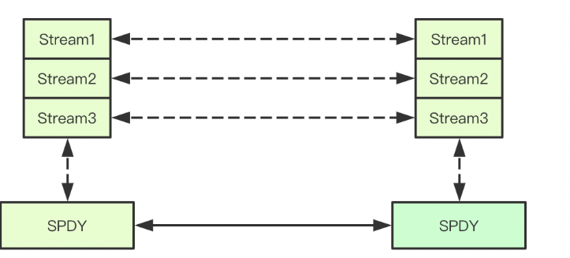

- [0. 章节目标](#0-----)
- [1. kubectl 端做的操作](#1-kubectl------)
  * [1.1 remotecommand包简介](#11-remotecommand---)
  * [1.2 SPDY协议的大致原理](#12-spdy-------)
  * [1.3 kubectl exec请求长什么样子](#13-kubectl-exec-------)
  * [1.4 模仿kubectl 实现一个exec](#14---kubectl-----exec)
- [2. kube-apiserver端](#2-kube-apiserver-)
  * [2.1 pod/exec的路由注册](#21-pod-exec-----)
- [3. kubelet端exec实现](#3-kubelet-exec--)
- [4. 参考文章](#4-----)

### 0. 章节目标

弄清楚kubectl exec -it  podName -n  namespace bash的整个过程

### 1. kubectl 端做的操作

kubectl 相关源代码在 kubectl exec command实现里面。核心代码如下，可以看到就做了两件事：

（1）get pod，确定pod存在，以及pod状态是非completed的

（2）调用remotecommand.NewSPDYExecutor，往apiserver post exec这个SubResource的请求

```
// Run executes a validated remote execution against a pod.
func (p *ExecOptions) Run() error {
    
    // 1. 判断pod是否存在
		p.Pod, err = p.PodClient.Pods(p.Namespace).Get(p.PodName, metav1.GetOptions{})
		
		// 2. 调用
		// TODO: consider abstracting into a client invocation or client helper
		req := restClient.Post().
			Resource("pods").
			Name(pod.Name).
			Namespace(pod.Namespace).
			SubResource("exec")
		req.VersionedParams(&corev1.PodExecOptions{
			Container: containerName,
			Command:   p.Command,
			Stdin:     p.Stdin,
			Stdout:    p.Out != nil,
			Stderr:    p.ErrOut != nil,
			TTY:       t.Raw,
		}, scheme.ParameterCodec)

		return p.Executor.Execute("POST", req.URL(), p.Config, p.In, p.Out, p.ErrOut, t.Raw, sizeQueue)
	}

	if err := t.Safe(fn); err != nil {
		return err
	}

	return nil
}

// Execute期间是remotecommand.NewSPDYExecutor
func (*DefaultRemoteExecutor) Execute(method string, url *url.URL, config *restclient.Config, stdin io.Reader, stdout, stderr io.Writer, tty bool, terminalSizeQueue remotecommand.TerminalSizeQueue) error {
	exec, err := remotecommand.NewSPDYExecutor(config, method, url)
	if err != nil {
		return err
	}
	return exec.Stream(remotecommand.StreamOptions{
		Stdin:             stdin,
		Stdout:            stdout,
		Stderr:            stderr,
		Tty:               tty,
		TerminalSizeQueue: terminalSizeQueue,
	})
}
```

<br>

#### 1.1 remotecommand包简介

`k8s.io/client-go/tools/remotecommand` kubernetes client-go 提供的 remotecommand 包，提供了方法与集群中的容器建立长连接，并设置容器的 stdin，stdout 等。
remotecommand 包提供基于 [SPDY](https://en.wikipedia.org/wiki/SPDY) 协议的 Executor interface，进行和 pod 终端的流的传输。初始化一个 Executor 很简单，只需要调用 remotecommand 的 NewSPDYExecutor 并传入对应参数。
Executor 的 Stream 方法，会建立一个流传输的连接，直到服务端和调用端一端关闭连接，才会停止传输。常用的做法是定义一个如下 `PtyHandler` 的 interface，然后使用你想用的客户端实现该 interface 对应的`Read(p []byte) (int, error)`和`Write(p []byte) (int, error)`方法即可，调用 Stream 方法时，只要将 StreamOptions 的 Stdin Stdout 都设置为 ptyHandler，Executor 就会通过你定义的 write 和 read 方法来传输数据。

#### 1.2 SPDY协议的大致原理

SPDY协议可以理解为是websocket。他是一种在单个 TCP 连接上进行 全双工 通信的协议。



这里实际上就是通过spdy，使得stdin, stdout, stderr都通过一个tcp请求来通信。通过streamid来区分。

具体的实现一般都是通过 在握手阶段将 `http.ResponseWriter` 断言为 `http.Hijacker` 接口并调用其中的 `Hijack()` 方法，拿到原始tcp链接对象并进行接管。

Hijack作用就是：接管http 的tcp连接。

`Hijack()`可以将HTTP对应的TCP连接取出，连接在`Hijack()`之后，HTTP的相关操作就会受到影响，调用方需要负责去关闭连接。

所以需要调用方自己去负责怎么处理tcp流，关闭连接。

正是可以自己去处理tcp流，kubectl 通过spdy就进行了 kubectl <-> apiserver的双向流连接。

<br>

#### 1.3 kubectl exec请求长什么样子

从下面日历可以看出来，这和上面是对上的。先get, 然后再post exec请求。这里主要关注post请求。post请求的url里面有命令，containerName, stdin, tty等信息。

同时头部带有了： X-Stream-Protocol-Version: v4.channel.k8s.io，v3,v2,v1等。这些是k8s基于spdy实现的subprotocol，用于远程建立双向流。v1是第一版，后面每一个版都是进行了优化或者修复。

```
# kubectl exec -it zx-nginx-6b9bf7fc6d-lzhh9 -n test-test bash -v 8
I1113 17:15:18.683343 3409932 loader.go:375] Config loaded from file:  /root/.kube/config

// 第一步，先get pod
I1113 17:15:18.696772 3409932 round_trippers.go:420] GET https://xxx:xxx/api/v1/namespaces/test-test/pods/zx-nginx-6b9bf7fc6d-lzhh9
I1113 17:15:18.696812 3409932 round_trippers.go:427] Request Headers:
I1113 17:15:18.696823 3409932 round_trippers.go:431]     Accept: application/json, */*
I1113 17:15:18.696832 3409932 round_trippers.go:431]     User-Agent: kubectl/v1.17.4 (linux/amd64) kubernetes/6a41ada
I1113 17:15:18.706429 3409932 round_trippers.go:446] Response Status: 200 OK in 9 milliseconds
I1113 17:15:18.706456 3409932 round_trippers.go:449] Response Headers:
I1113 17:15:18.706462 3409932 round_trippers.go:452]     Content-Type: application/json
I1113 17:15:18.706467 3409932 round_trippers.go:452]     Date: Sun, 13 Nov 2022 09:15:18 GMT
I1113 17:15:18.706584 3409932 request.go:1017] Response Body: {"kind":"Pod","apiVersion":"v1","metadata":{"name":"zx-nginx-6b9bf7fc6d-lzhh9","generateName":"zx-nginx-6b9bf7fc6d-","namespace":"test-test","selfLink":"/api/v1/namespaces/test-test/pods/zx-nginx-6b9bf7fc6d-lzhh9","uid":"b496d8fb-0d5e-42e3-ac23-e25d02ae262b","resourceVersion":"1172314995","creationTimestamp":"2022-10-20T02:25:25Z","labels":{"app":"zx-nginx","pod-template-hash":"6b9bf7fc6d","project":"test","uuid":"64cc50af-dbf8-4a75-b7a4-2807606045a5"},"annotations":{"pod.symphony.com/project":"test","symphony.netease.com/last-update-time":"1666232725","v2-subnet":"6a5e6bde-650a-4081-992a-d2aaec2080d5","v2-tenant":"dcf722f63d0249f8b154876a79e1ce05","v2-vpc":"e0a80d55-57c7-4b7f-b9cc-0e7c09647409"},"ownerReferences":[{"apiVersion":"apps/v1","kind":"ReplicaSet","name":"zx-nginx-6b9bf7fc6d","uid":"5c48aca3-f80f-4a21-9853-64c348866edd","controller":true,"blockOwnerDeletion":true}]},"spec":{"volumes":[{"name":"lxc","hostPath":{"path":"/lxcfs", [truncated 3124 chars]


// 第二步post请求
I1113 17:15:18.713105 3409932 round_trippers.go:420] POST https://xxx:xxx/api/v1/namespaces/test-test/pods/zx-nginx-6b9bf7fc6d-lzhh9/exec?command=bash&container=zx-router&stdin=true&stdout=true&tty=true
// request信息
I1113 17:15:18.713132 3409932 round_trippers.go:427] Request Headers:
I1113 17:15:18.713138 3409932 round_trippers.go:431]     User-Agent: kubectl/v1.17.4 (linux/amd64) kubernetes/6a41ada
I1113 17:15:18.713151 3409932 round_trippers.go:431]     X-Stream-Protocol-Version: v4.channel.k8s.io
I1113 17:15:18.713161 3409932 round_trippers.go:431]     X-Stream-Protocol-Version: v3.channel.k8s.io
I1113 17:15:18.713166 3409932 round_trippers.go:431]     X-Stream-Protocol-Version: v2.channel.k8s.io                                                                                                                                      I1113 17:15:18.713175 3409932 round_trippers.go:431]     X-Stream-Protocol-Version: channel.k8s.io


// 返回信息了一个 Upgrade: SPDY/3.1
I1113 17:15:18.736268 3409932 round_trippers.go:446] Response Status: 101 Switching Protocols in 23 milliseconds
I1113 17:15:18.736297 3409932 round_trippers.go:449] Response Headers:
I1113 17:15:18.736303 3409932 round_trippers.go:452]     Connection: Upgrade                                                                                                                                                                I1113 17:15:18.736309 3409932 round_trippers.go:452]     Upgrade: SPDY/3.1
I1113 17:15:18.736315 3409932 round_trippers.go:452]     X-Stream-Protocol-Version: v4.channel.k8s.io                                                                                                                                                                  I1113 17:15:18.736337 3409932 round_trippers.go:452]     Date: Sun, 13 Nov 2022 09:15:18 GMT
```

HTTP/1.1中允许在同一个链接上通过Header头中的Connection配合Upgrade来实现协议的转换，简单来说就是允许在通过HTTP建立的链接之上使用其他的协议来进行通信，这也是k8s中命令中实现协议升级的关键。

在HTTP协议中除了我们常见的HTTP1.1,还支持websocket/spdy等协议,那服务端和客户端如何在http之上完成不同协议的切换呢，首先第一个要素就是这里的101(Switching Protocal)状态码, 即服务端告知客户端我们切换到Uprage定义的协议上来进行通信(复用当前链接)

#### 1.4 模仿kubectl 实现一个exec

从客户端看来，想要实现exec是非常简单的。我post exec这个子资源，并且利用remotecommand这个包的stream函数就可以实现。

当然核心工作是stream函数做的，他直接通过Hijacker获取到两个底层的tcp的readerwriter之后，就可以直接通过io.copy在两个流上完成对应数据的拷贝，这样就不需要在apiserver这个地方进行协议的转换，而是直接通过tcp的流对拷就可以实现请求和结果的转发。

```
streamProtocolV4的实现
func (p *streamProtocolV4) stream(conn streamCreator) error {
	if err := p.createStreams(conn); err != nil {
		return err
	}

	// now that all the streams have been created, proceed with reading & copying

	errorChan := watchErrorStream(p.errorStream, &errorDecoderV4{})

	p.handleResizes()

	p.copyStdin()

	var wg sync.WaitGroup
	p.copyStdout(&wg)
	p.copyStderr(&wg)

	// we're waiting for stdout/stderr to finish copying
	wg.Wait()

	// waits for errorStream to finish reading with an error or nil
	return <-errorChan
}
```

**go实现kubectl exec 示范代码**

```
package main

import (
	"flag"
	"fmt"
	"io"
	"os"
	"path/filepath"

	"golang.org/x/crypto/ssh/terminal"
	corev1 "k8s.io/api/core/v1"
	"k8s.io/client-go/kubernetes"
	"k8s.io/client-go/kubernetes/scheme"
	"k8s.io/client-go/tools/clientcmd"
	"k8s.io/client-go/tools/remotecommand"
	"k8s.io/client-go/util/homedir"
)

func main() {

	var kubeconfig *string
	if home := homedir.HomeDir(); home != "" {
		kubeconfig = flag.String("kubeconfig", filepath.Join(home, "go/src/kubeconfig/xx", "kubeconfig"), "(optional) absolute path to the kubeconfig file")
	} else {
		kubeconfig = flag.String("kubeconfig", "", "absolute path to the kubeconfig file")
	}
	flag.Parse()

	config, err := clientcmd.BuildConfigFromFlags("", *kubeconfig)
	if err != nil {
		panic(err)
	}
	clientset, err := kubernetes.NewForConfig(config)
	if err != nil {
		panic(err)
	}

	// 初始化pod所在的corev1资源组，发送请求
	// PodExecOptions struct 包括Container stdout stdout  Command 等结构
	// scheme.ParameterCodec 应该是pod 的GVK （GroupVersion & Kind）之类的
	req := clientset.CoreV1().RESTClient().Post().
		Resource("pods").
		Name("fix-validate-cm-5b58cf68cd-6mckn").
		Namespace("test-test").
		SubResource("exec").
		VersionedParams(&corev1.PodExecOptions{
			Command: []string{"ls"},
			Stdin:   true,
			Stdout:  true,
			Stderr:  true,
			TTY:     false,
		}, scheme.ParameterCodec)

	// remotecommand 主要实现了http 转 SPDY 添加X-Stream-Protocol-Version相关header 并发送请求
	exec, err := remotecommand.NewSPDYExecutor(config, "POST", req.URL())

	// 检查是不是终端
	if !terminal.IsTerminal(0) || !terminal.IsTerminal(1) {
		fmt.Errorf("stdin/stdout should be terminal")
	}
	// 这个应该是处理Ctrl + C 这种特殊键位
	oldState, err := terminal.MakeRaw(0)
	if err != nil {
		fmt.Println(err)
	}
	defer terminal.Restore(0, oldState)

	// 用IO读写替换 os stdout
	screen := struct {
		io.Reader
		io.Writer
	}{os.Stdin, os.Stdout}

	// 建立链接之后从请求的sream中发送、读取数据
	if err = exec.Stream(remotecommand.StreamOptions{
		Stdin:  screen,
		Stdout: screen,
		Stderr: screen,
		Tty:    false,
	}); err != nil {
		fmt.Print(err)
	}
}

//是可以成功弄出来的
# go run main.go
bin  boot dev docker-entrypoint.d docker-entrypoint.sh etc home ....                                 
```

### 2. kube-apiserver端

#### 2.1 pod/exec的路由注册

这里可以参考 [**11-kube-apiserver 启动http和https服务**](https://github.com/zoux86/learning-k8s-source-code/blob/master/k8s/kube-apiserver/11-kube-apiserver%20%E5%90%AF%E5%8A%A8http%E5%92%8Chttps%E6%9C%8D%E5%8A%A1.md)

了解一下apiserver是如何注册路由的。

简单说一下就是：kube-apiserver调用registerResourceHandlers为pod创建路由。就是访问某个path，对应哪个处理函数。

对于 pod/exec而言可以就是CONNECT动作。执行CONNECT的handler

**为啥是CONNECT呢**

核心代码都在：staging/src/k8s.io/apiserver/pkg/endpoints/installer.go 的registerResourceHandlers

registerResourceHandlers 函数首先会进行一堆判断，根据资源storage判断，某个资源支持哪些操作。

而查看podexec这个资源的storage，它只实现了connet方法。所以他只支持connect动作。

```
creater, isCreater := storage.(rest.Creater)
	namedCreater, isNamedCreater := storage.(rest.NamedCreater)
	lister, isLister := storage.(rest.Lister)
	getter, isGetter := storage.(rest.Getter)
	getterWithOptions, isGetterWithOptions := storage.(rest.GetterWithOptions)
	gracefulDeleter, isGracefulDeleter := storage.(rest.GracefulDeleter)
	collectionDeleter, isCollectionDeleter := storage.(rest.CollectionDeleter)
	updater, isUpdater := storage.(rest.Updater)
	patcher, isPatcher := storage.(rest.Patcher)
	watcher, isWatcher := storage.(rest.Watcher)
	connecter, isConnecter := storage.(rest.Connecter)
	storageMeta, isMetadata := storage.(rest.StorageMetadata)
	storageVersionProvider, isStorageVersionProvider := storage.(rest.StorageVersionProvider)
```

所以，当客户端post exec的时候，最终调用的是下面的方法。

这里的核心就是调用restfulConnectResource方法，实现kube-apiserver-kubelet流的建立。

这样kubectl <-> kube-apiserver <-> kubelet就打通了

```
case "CONNECT":
   for _, method := range connecter.ConnectMethods() {
      connectProducedObject := storageMeta.ProducesObject(method)
      if connectProducedObject == nil {
         connectProducedObject = "string"
      }
      doc := "connect " + method + " requests to " + kind
      if isSubresource {
         doc = "connect " + method + " requests to " + subresource + " of " + kind
      }
      handler := metrics.InstrumentRouteFunc(action.Verb, group, version, resource, subresource, requestScope, metrics.APIServerComponent, restfulConnectResource(connecter, reqScope, admit, path, isSubresource))
      route := ws.Method(method).Path(action.Path).
         To(handler).
         Doc(doc).
         Operation("connect" + strings.Title(strings.ToLower(method)) + namespaced + kind + strings.Title(subresource) + operationSuffix).
         Produces("*/*").
         Consumes("*/*").
         Writes(connectProducedObject)
      if versionedConnectOptions != nil {
         if err := AddObjectParams(ws, route, versionedConnectOptions); err != nil {
            return nil, err
         }
      }
      addParams(route, action.Params)
      routes = append(routes, route)

      // transform ConnectMethods to kube verbs
      if kubeVerb, found := toDiscoveryKubeVerb[method]; found {
         if len(kubeVerb) != 0 {
            kubeVerbs[kubeVerb] = struct{}{}
         }
      }
   }
```

restfulConnectResource的调用路线如下：

```
restfulConnectResource -> ConnectResource->ExecREST.Connect 


// 核心就是调用ExecLocation.streamLocation来根据pod获取node信息，主要是kubelet ip+Port。然后获取kubelet流的连接
// 然后调用newThrottledUpgradeAwareProxyHandler升级流的协议，这就是response看到的101升级信息
// Connect returns a handler for the pod exec proxy
func (r *ExecREST) Connect(ctx context.Context, name string, opts runtime.Object, responder rest.Responder) (http.Handler, error) {
	execOpts, ok := opts.(*api.PodExecOptions)
	if !ok {
		return nil, fmt.Errorf("invalid options object: %#v", opts)
	}
	location, transport, err := pod.ExecLocation(r.Store, r.KubeletConn, ctx, name, execOpts)
	if err != nil {
		return nil, err
	}
	return newThrottledUpgradeAwareProxyHandler(location, transport, false, true, true, responder), nil
}


func streamLocation(
	getter ResourceGetter,
	connInfo client.ConnectionInfoGetter,
	ctx context.Context,
	name string,
	opts runtime.Object,
	container,
	path string,
) (*url.URL, http.RoundTripper, error) {
	pod, err := getPod(getter, ctx, name)
	if err != nil {
		return nil, nil, err
	}

	// Try to figure out a container
	// If a container was provided, it must be valid
	if container == "" {
		switch len(pod.Spec.Containers) {
		case 1:
			container = pod.Spec.Containers[0].Name
		case 0:
			return nil, nil, errors.NewBadRequest(fmt.Sprintf("a container name must be specified for pod %s", name))
		default:
			containerNames := getContainerNames(pod.Spec.Containers)
			initContainerNames := getContainerNames(pod.Spec.InitContainers)
			err := fmt.Sprintf("a container name must be specified for pod %s, choose one of: [%s]", name, containerNames)
			if len(initContainerNames) > 0 {
				err += fmt.Sprintf(" or one of the init containers: [%s]", initContainerNames)
			}
			return nil, nil, errors.NewBadRequest(err)
		}
	} else {
		if !podHasContainerWithName(pod, container) {
			return nil, nil, errors.NewBadRequest(fmt.Sprintf("container %s is not valid for pod %s", container, name))
		}
	}
	nodeName := types.NodeName(pod.Spec.NodeName)
	if len(nodeName) == 0 {
		// If pod has not been assigned a host, return an empty location
		return nil, nil, errors.NewBadRequest(fmt.Sprintf("pod %s does not have a host assigned", name))
	}
	nodeInfo, err := connInfo.GetConnectionInfo(ctx, nodeName)
	if err != nil {
		return nil, nil, err
	}
	params := url.Values{}
	if err := streamParams(params, opts); err != nil {
		return nil, nil, err
	}
	loc := &url.URL{
		Scheme:   nodeInfo.Scheme,
		Host:     net.JoinHostPort(nodeInfo.Hostname, nodeInfo.Port),
		Path:     fmt.Sprintf("/%s/%s/%s/%s", path, pod.Namespace, pod.Name, container),
		RawQuery: params.Encode(),
	}
	return loc, nodeInfo.Transport, nil
}
```

### 3. kubelet端exec实现

参考：https://www.kubernetes.org.cn/7195.html

### 4. 参考文章

[图解kubernetes命令执行核心实现](https://www.kubernetes.org.cn/7195.html)

[kubernetes exec源码简析](https://blog.csdn.net/nangonghen/article/details/110411187)

[Kubernetes首个重要安全漏洞研究&百度云全量修复报告](https://zhuanlan.zhihu.com/p/52268484)

[Kubectl exec 背后到底发生了什么？](https://cloud.tencent.com/developer/article/1632735#:~:text=kubectl%20exec%20%E7%9A%84%E5%B7%A5%E4%BD%9C%E5%8E%9F%E7%90%86%E7%94%A8%E4%B8%80%E5%BC%A0%E5%9B%BE%E5%B0%B1%E5%8F%AF%E4%BB%A5%E8%A1%A8%E7%A4%BA%EF%BC%9A%20%E7%AC%AC%E4%B8%80%E4%B8%AA%20kubectl%20exec%20%E5%9C%A8%E5%AE%B9%E5%99%A8%E5%86%85%E6%89%A7%E8%A1%8C%E4%BA%86%20date,Pod%20%E4%BF%A1%E6%81%AF%E3%80%82%20POST%20%E8%AF%B7%E6%B1%82%E8%B0%83%E7%94%A8%20Pod%20%E7%9A%84%E5%AD%90%E8%B5%84%E6%BA%90%20exec%20%E5%9C%A8%E5%AE%B9%E5%99%A8%E5%86%85%E6%89%A7%E8%A1%8C%E5%91%BD%E4%BB%A4%E3%80%82)

[Kubectl exec 的工作原理解读](https://juejin.cn/post/6844904168860155911)

[使用 client-go 实现 kubectl port-forward](https://www.modb.pro/db/137716)

[自己动手实现一个 kubectl exec](https://cloud.tencent.com/developer/article/1824992)

