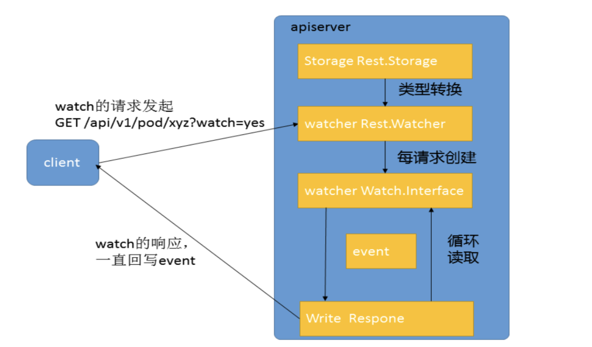
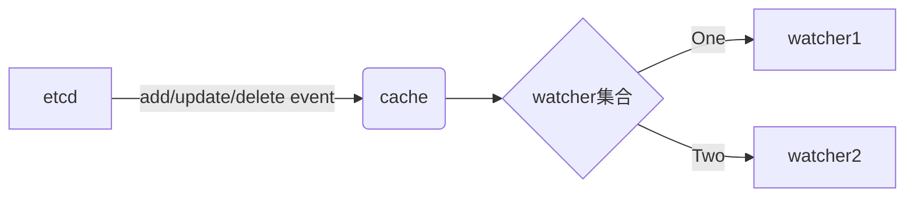

- [0. 背景](#0---)
- [1. List-watch api定义](#1-list-watch-api--)
- [2. 核心handler函数-ListResource](#2---handler---listresource)
  * [2.1 serveWatch](#21-servewatch)
  * [2.2 ServeHTTP](#22-servehttp)
  * [2.3 初步总结](#23-----)
  * [2.3 rw.Watch()](#23-rwwatch--)
    + [2.3.1 WatchPredicate](#231-watchpredicate)
    + [2.3.2 WatchList](#232-watchlist)
  * [2.4 cache的初始化](#24-cache----)
    + [2.4.1 Cacher结构体如下](#241-cacher-----)
    + [2.4.2 cache是如何初始化的-NewCacherFromConfig](#242-cache--------newcacherfromconfig)
    + [2.4.3 Cache的watchCache结构体](#243-cache-watchcache---)
- [3. 参考文档](#3---参考)

### 0. 背景

从代码这边探究一下list-watch的实现方式。为性能优化提供思路

### 1. List-watch api定义

提供list和watch服务的入口是同一个，在API接口中是通过 `GET /pods?watch=true`这种方式来区分是list还是watch

和其他接口意义，这一部分都是定义在 registerResourceHandlers函数中

```
// staging/src/k8s.io/apiserver/pkg/endpoints/installer.go      

case "LIST": // List all resources of a kind.
			doc := "list objects of kind " + kind
			if isSubresource {
				doc = "list " + subresource + " of objects of kind " + kind
			}
			handler := metrics.InstrumentRouteFunc(action.Verb, group, version, resource, subresource, requestScope, metrics.APIServerComponent, restfulListResource(lister, watcher, reqScope, false, a.minRequestTimeout))
			route := ws.GET(action.Path).To(handler).
				Doc(doc).
				Param(ws.QueryParameter("pretty", "If 'true', then the output is pretty printed.")).
				Operation("list"+namespaced+kind+strings.Title(subresource)+operationSuffix).
				Produces(append(storageMeta.ProducesMIMETypes(action.Verb), allMediaTypes...)...).
				Returns(http.StatusOK, "OK", versionedList).
				Writes(versionedList)
			if err := AddObjectParams(ws, route, versionedListOptions); err != nil {
				return nil, err
			}
			switch {
			case isLister && isWatcher:
				doc := "list or watch objects of kind " + kind
				if isSubresource {
					doc = "list or watch " + subresource + " of objects of kind " + kind
				}
				route.Doc(doc)
			case isWatcher:
				doc := "watch objects of kind " + kind
				if isSubresource {
					doc = "watch " + subresource + "of objects of kind " + kind
				}
				route.Doc(doc)
			}
			addParams(route, action.Params)
			routes = append(routes, route)
```

### 2. 核心handler函数-ListResource

上面的handler函数是restfulListResource，核心是调用了ListResource函数。

```
func restfulListResource(r rest.Lister, rw rest.Watcher, scope handlers.RequestScope, forceWatch bool, minRequestTimeout time.Duration) restful.RouteFunction {
	return func(req *restful.Request, res *restful.Response) {
		handlers.ListResource(r, rw, &scope, forceWatch, minRequestTimeout)(res.ResponseWriter, req.Request)
	}
}
```

ListResource具体逻辑如下：

（1）第一步获取ns, name。获取不到ns直接报错，获取不到name，则表示监听多个资源。可以get pods -w 也可以get  pod podA -w

（2）第二步提取label。如果没有label，有name其实也是一个label。  list-watch经常会指定lable减少apiserver压力

（3）第三步，如果是watch，v3级别log会有打印。最终会调用serveWatch函数。注意，如果是list-watch，最终还是只调用rw.watch不会走到第四步。看起来watch包括了list

（4）第四步，如果只是list,调用 r.List(ctx, &opts)

```
func ListResource(r rest.Lister, rw rest.Watcher, scope *RequestScope, forceWatch bool, minRequestTimeout time.Duration) http.HandlerFunc {
	return func(w http.ResponseWriter, req *http.Request) {
		// For performance tracking purposes.
		trace := utiltrace.New("List", utiltrace.Field{Key: "url", Value: req.URL.Path}, utiltrace.Field{Key: "user-agent", Value: &lazyTruncatedUserAgent{req}}, utiltrace.Field{Key: "client", Value: &lazyClientIP{req}})
    // 1.第一步获取ns, name。获取不到ns直接报错，获取不到name，则表示监听多个资源
		namespace, err := scope.Namer.Namespace(req)
		if err != nil {
			scope.err(err, w, req)
			return
		}

		// Watches for single objects are routed to this function.
		// Treat a name parameter the same as a field selector entry.
		hasName := true
		_, name, err := scope.Namer.Name(req)
		if err != nil {
			hasName = false
		}

		ctx := req.Context()
		ctx = request.WithNamespace(ctx, namespace)
  
		outputMediaType, _, err := negotiation.NegotiateOutputMediaType(req, scope.Serializer, scope)
		if err != nil {
			scope.err(err, w, req)
			return
		}
    
    
    // 2.第二步提取label。如果没有label，有name其实也是一个label。  list-watch经常会指定lable减少apiserver压力
		opts := metainternalversion.ListOptions{}
		if err := metainternalversionscheme.ParameterCodec.DecodeParameters(req.URL.Query(), scope.MetaGroupVersion, &opts); err != nil {
			err = errors.NewBadRequest(err.Error())
			scope.err(err, w, req)
			return
		}
  
		// transform fields
		// TODO: DecodeParametersInto should do this.
		if opts.FieldSelector != nil {
			fn := func(label, value string) (newLabel, newValue string, err error) {
				return scope.Convertor.ConvertFieldLabel(scope.Kind, label, value)
			}
			if opts.FieldSelector, err = opts.FieldSelector.Transform(fn); err != nil {
				// TODO: allow bad request to set field causes based on query parameters
				err = errors.NewBadRequest(err.Error())
				scope.err(err, w, req)
				return
			}
		}

		if hasName {
			// metadata.name is the canonical internal name.
			// SelectionPredicate will notice that this is a request for
			// a single object and optimize the storage query accordingly.
			nameSelector := fields.OneTermEqualSelector("metadata.name", name)

			// Note that fieldSelector setting explicitly the "metadata.name"
			// will result in reaching this branch (as the value of that field
			// is propagated to requestInfo as the name parameter.
			// That said, the allowed field selectors in this branch are:
			// nil, fields.Everything and field selector matching metadata.name
			// for our name.
			if opts.FieldSelector != nil && !opts.FieldSelector.Empty() {
				selectedName, ok := opts.FieldSelector.RequiresExactMatch("metadata.name")
				if !ok || name != selectedName {
					scope.err(errors.NewBadRequest("fieldSelector metadata.name doesn't match requested name"), w, req)
					return
				}
			} else {
				opts.FieldSelector = nameSelector
			}
		}
		
		// 3.第三步，如果是watch，v3级别log会有打印。最终会调用rw.Watch函数
		if opts.Watch || forceWatch {
			if rw == nil {
				scope.err(errors.NewMethodNotSupported(scope.Resource.GroupResource(), "watch"), w, req)
				return
			}
			// TODO: Currently we explicitly ignore ?timeout= and use only ?timeoutSeconds=.
			timeout := time.Duration(0)
			if opts.TimeoutSeconds != nil {
				timeout = time.Duration(*opts.TimeoutSeconds) * time.Second
			}
			if timeout == 0 && minRequestTimeout > 0 {
				timeout = time.Duration(float64(minRequestTimeout) * (rand.Float64() + 1.0))
			}
			klog.V(3).Infof("Starting watch for %s, rv=%s labels=%s fields=%s timeout=%s", req.URL.Path, opts.ResourceVersion, opts.LabelSelector, opts.FieldSelector, timeout)
			ctx, cancel := context.WithTimeout(ctx, timeout)
			defer cancel()
			watcher, err := rw.Watch(ctx, &opts)
			if err != nil {
				scope.err(err, w, req)
				return
			}
			requestInfo, _ := request.RequestInfoFrom(ctx)
			metrics.RecordLongRunning(req, requestInfo, metrics.APIServerComponent, func() {
				serveWatch(watcher, scope, outputMediaType, req, w, timeout)
			})
			return
		}

		// Log only long List requests (ignore Watch).
		defer trace.LogIfLong(500 * time.Millisecond)
		trace.Step("About to List from storage")
		result, err := r.List(ctx, &opts)
		if err != nil {
			scope.err(err, w, req)
			return
		}
		trace.Step("Listing from storage done")

		transformResponseObject(ctx, scope, trace, req, w, http.StatusOK, outputMediaType, result)
		trace.Step("Writing http response done", utiltrace.Field{"count", meta.LenList(result)})
	}
}
```


每次有一个watch的url请求过来，都会调用`rw.Watch()`创建一个`watcher`，然后使用`serveWatch()`来处理这个请求。**watcher的生命周期是每个http请求的**，这一点非常重要。

#### 2.1 serveWatch

这里只是实例化一个WatchServer结构体。核心是ServeHTTP函数

```
// serveWatch will serve a watch response.
// TODO: the functionality in this method and in WatchServer.Serve is not cleanly decoupled.
func serveWatch(watcher watch.Interface, scope *RequestScope, mediaTypeOptions negotiation.MediaTypeOptions, req *http.Request, w http.ResponseWriter, timeout time.Duration) {
   options, err := optionsForTransform(mediaTypeOptions, req)
   if err != nil {
      scope.err(err, w, req)
      return
   }

   // negotiate for the stream serializer from the scope's serializer
   serializer, err := negotiation.NegotiateOutputMediaTypeStream(req, scope.Serializer, scope)
   if err != nil {
      scope.err(err, w, req)
      return
   }
   framer := serializer.StreamSerializer.Framer
   streamSerializer := serializer.StreamSerializer.Serializer
   encoder := scope.Serializer.EncoderForVersion(streamSerializer, scope.Kind.GroupVersion())
   useTextFraming := serializer.EncodesAsText
   if framer == nil {
      scope.err(fmt.Errorf("no framer defined for %q available for embedded encoding", serializer.MediaType), w, req)
      return
   }
   // TODO: next step, get back mediaTypeOptions from negotiate and return the exact value here
   mediaType := serializer.MediaType
   if mediaType != runtime.ContentTypeJSON {
      mediaType += ";stream=watch"
   }

   // locate the appropriate embedded encoder based on the transform
   var embeddedEncoder runtime.Encoder
   contentKind, contentSerializer, transform := targetEncodingForTransform(scope, mediaTypeOptions, req)
   if transform {
      info, ok := runtime.SerializerInfoForMediaType(contentSerializer.SupportedMediaTypes(), serializer.MediaType)
      if !ok {
         scope.err(fmt.Errorf("no encoder for %q exists in the requested target %#v", serializer.MediaType, contentSerializer), w, req)
         return
      }
      embeddedEncoder = contentSerializer.EncoderForVersion(info.Serializer, contentKind.GroupVersion())
   } else {
      embeddedEncoder = scope.Serializer.EncoderForVersion(serializer.Serializer, contentKind.GroupVersion())
   }

   ctx := req.Context()

   server := &WatchServer{
      Watching: watcher,
      Scope:    scope,

      UseTextFraming:  useTextFraming,
      MediaType:       mediaType,
      Framer:          framer,
      Encoder:         encoder,
      EmbeddedEncoder: embeddedEncoder,

      Fixup: func(obj runtime.Object) runtime.Object {
         result, err := transformObject(ctx, obj, options, mediaTypeOptions, scope, req)
         if err != nil {
            utilruntime.HandleError(fmt.Errorf("failed to transform object %v: %v", reflect.TypeOf(obj), err))
            return obj
         }
         // When we are transformed to a table, use the table options as the state for whether we
         // should print headers - on watch, we only want to print table headers on the first object
         // and omit them on subsequent events.
         if tableOptions, ok := options.(*metav1beta1.TableOptions); ok {
            tableOptions.NoHeaders = true
         }
         return result
      },

      TimeoutFactory: &realTimeoutFactory{timeout},
   }

   server.ServeHTTP(w, req)
}
```

#### 2.2 ServeHTTP

这里核心就是从`watcher`的结果channel中读取一个event对象，然后持续不断的编码写入到http response的流当中。

```
ch := s.Watching.ResultChan()
	for {
		select {
		case <-cn.CloseNotify():
			return
		case <-timeoutCh:
			return
		case event, ok := <-ch:
			if !ok {
				// End of results.
				return
			}
			metrics.WatchEvents.WithLabelValues(kind.Group, kind.Version, kind.Kind).Inc()

			obj := s.Fixup(event.Object)
			if err := s.EmbeddedEncoder.Encode(obj, buf); err != nil {
				// unexpected error
				utilruntime.HandleError(fmt.Errorf("unable to encode watch object %T: %v", obj, err))
				return
			}

			// ContentType is not required here because we are defaulting to the serializer
			// type
			unknown.Raw = buf.Bytes()
			event.Object = &unknown
			metrics.WatchEventsSizes.WithLabelValues(kind.Group, kind.Version, kind.Kind).Observe(float64(len(unknown.Raw)))

			*outEvent = metav1.WatchEvent{}

			// create the external type directly and encode it.  Clients will only recognize the serialization we provide.
			// The internal event is being reused, not reallocated so its just a few extra assignments to do it this way
			// and we get the benefit of using conversion functions which already have to stay in sync
			*internalEvent = metav1.InternalEvent(event)
			err := metav1.Convert_v1_InternalEvent_To_v1_WatchEvent(internalEvent, outEvent, nil)
			if err != nil {
				utilruntime.HandleError(fmt.Errorf("unable to convert watch object: %v", err))
				// client disconnect.
				return
			}
			if err := e.Encode(outEvent); err != nil {
				utilruntime.HandleError(fmt.Errorf("unable to encode watch object %T: %v (%#v)", outEvent, err, e))
				// client disconnect.
				return
			}
			if len(ch) == 0 {
				flusher.Flush()
			}

			buf.Reset()
		}
	}
```

#### 2.3 初步总结

目前看起来的流程就是这样的：

用户发起一个watch请求，apiserver会初始化一个wach对象。wach.serverhttp会初始化一个流，然后监听一个channel，源源不断的发送channel出现的event到流中。这样客户端就接收到了watch对象了。

目前还有2个问题需要进一步确定：

（1）`rw.Watch()`创建一个`watcher`。创建的watcher到底是什么样子

（2）它是怎么从etcd中获得变化的数据的？又是怎么过滤条件的？



#### 2.3 rw.Watch()

```
// Watcher should be implemented by all Storage objects that
// want to offer the ability to watch for changes through the watch api.
type Watcher interface {
   // 'label' selects on labels; 'field' selects on the object's fields. Not all fields
   // are supported; an error should be returned if 'field' tries to select on a field that
   // isn't supported. 'resourceVersion' allows for continuing/starting a watch at a
   // particular version.
   Watch(ctx context.Context, options *metainternalversion.ListOptions) (watch.Interface, error)
}
```

查看这个函数的实现，最终是：

```
// Watch makes a matcher for the given label and field, and calls
// WatchPredicate. If possible, you should customize PredicateFunc to produce
// a matcher that matches by key. SelectionPredicate does this for you
// automatically.
func (e *Store) Watch(ctx context.Context, options *metainternalversion.ListOptions) (watch.Interface, error) {
	label := labels.Everything()
	if options != nil && options.LabelSelector != nil {
		label = options.LabelSelector
	}
	field := fields.Everything()
	if options != nil && options.FieldSelector != nil {
		field = options.FieldSelector
	}
	predicate := e.PredicateFunc(label, field)

	resourceVersion := ""
	if options != nil {
		resourceVersion = options.ResourceVersion
		predicate.AllowWatchBookmarks = options.AllowWatchBookmarks
	}
	return e.WatchPredicate(ctx, predicate, resourceVersion)
}
```

这里也很简单最终调用了e.WatchPredicate。

其中有个参数是一个函数：predicate，这个也是每个对象storage需要实现的。

以pod为例：predicate对应的函数为MatchPod，其中GetAttrs判断一个对象是否为pod

```
// MatchPod returns a generic matcher for a given label and field selector.
func MatchPod(label labels.Selector, field fields.Selector) storage.SelectionPredicate {
	return storage.SelectionPredicate{
		Label:       label,
		Field:       field,
		GetAttrs:    GetAttrs,
		IndexFields: []string{"spec.nodeName"},
	}
}
```

##### 2.3.1 WatchPredicate

```
// WatchPredicate starts a watch for the items that matches.
func (e *Store) WatchPredicate(ctx context.Context, p storage.SelectionPredicate, resourceVersion string) (watch.Interface, error) {
	if name, ok := p.MatchesSingle(); ok {
		if key, err := e.KeyFunc(ctx, name); err == nil {
			w, err := e.Storage.Watch(ctx, key, resourceVersion, p)
			if err != nil {
				return nil, err
			}
			if e.Decorator != nil {
				return newDecoratedWatcher(w, e.Decorator), nil
			}
			return w, nil
		}
		// if we cannot extract a key based on the current context, the
		// optimization is skipped
	}

	w, err := e.Storage.WatchList(ctx, e.KeyRootFunc(ctx), resourceVersion, p)
	if err != nil {
		return nil, err
	}
	if e.Decorator != nil {
		return newDecoratedWatcher(w, e.Decorator), nil
	}
	return w, nil
}
```

这里有2个点，第一个就是e.Storage.WatchList函数。

第二个就是newDecoratedWatcher(w, e.Decorator)

##### 2.3.2 WatchList

```
// 返回的就是一个watcher对象。第一个参数ctx 上下文信息。第二个e.KeyRootFunc(ctx)其实就是取出来ns/podname， 第三个是resourceversion,指定了按指定值来。没有指定，是空字符串。最后一个参数p就是MatchPod
w, err := e.Storage.WatchList(ctx, e.KeyRootFunc(ctx), resourceVersion, p)


// 到这里Storage只是一个接口。Storage包含了delete,Create, WatchList等等的接口。接下里以pod为例子来看具体实现
func (s *DryRunnableStorage) WatchList(ctx context.Context, key string, resourceVersion string, p storage.SelectionPredicate) (watch.Interface, error) {
	return s.Storage.WatchList(ctx, key, resourceVersion, p)
}
```

WatchList最终调用 Watch函数，在cacher.go中。核心就是：

（1）生成一个新的watcher

（2）找出所有已有的event

（3）将watcher注册到所有的watchers中去

（4）进行watch逻辑的处理

看到这里可能有点懵，因为这是自下而上的分析。

这里有个前提是: 在apiserver运行的时候，apiserver内部有一个大cache，监听保存了所有etcd的数据。

所以，在新来一个watch3之前。可能已有的结构就是下图这样了。

所以对于一个新的watch，做的事情就是：

（1）生成一个新的watch3。对象有filter，watch.Event channel, type资源类型等等

（2）对于新来的watch3，要将cache已有的数据传给watch3处理，这里就是下面的initEvents

（3）新来的watch3, 也要注册到watcher集群里面，这样etcd后面的add/update/delete事件也能触发给这个watch3。



```
staging/src/k8s.io/apiserver/pkg/storage/cacher/cacher.go
// Watch implements storage.Interface.
func (c *Cacher) Watch(ctx context.Context, key string, resourceVersion string, pred storage.SelectionPredicate) (watch.Interface, error) {
	watchRV, err := c.versioner.ParseResourceVersion(resourceVersion)
	if err != nil {
		return nil, err
	}

	c.ready.wait()

	triggerValue, triggerSupported := "", false
	if c.indexedTrigger != nil {
		for _, field := range pred.IndexFields {
			if field == c.indexedTrigger.indexName {
				if value, ok := pred.Field.RequiresExactMatch(field); ok {
					triggerValue, triggerSupported = value, true
				}
			}
		}
	}

	// If there is indexedTrigger defined, but triggerSupported is false,
	// we can't narrow the amount of events significantly at this point.
	//
	// That said, currently indexedTrigger is defined only for couple resources:
	// Pods, Nodes, Secrets and ConfigMaps and there is only a constant
	// number of watchers for which triggerSupported is false (excluding those
	// issued explicitly by users).
	// Thus, to reduce the risk of those watchers blocking all watchers of a
	// given resource in the system, we increase the sizes of buffers for them.
	chanSize := 10
	if c.indexedTrigger != nil && !triggerSupported {
		// TODO: We should tune this value and ideally make it dependent on the
		// number of objects of a given type and/or their churn.
		chanSize = 1000
	}

	// Determine watch timeout('0' means deadline is not set, ignore checking)
	deadline, _ := ctx.Deadline()
	// Create a watcher here to reduce memory allocations under lock,
	// given that memory allocation may trigger GC and block the thread.
	// Also note that emptyFunc is a placeholder, until we will be able
	// to compute watcher.forget function (which has to happen under lock).
	// 1.生成一个新的watcher
	watcher := newCacheWatcher(chanSize, filterWithAttrsFunction(key, pred), emptyFunc, c.versioner, deadline, pred.AllowWatchBookmarks, c.objectType)

	// We explicitly use thread unsafe version and do locking ourself to ensure that
	// no new events will be processed in the meantime. The watchCache will be unlocked
	// on return from this function.
	// Note that we cannot do it under Cacher lock, to avoid a deadlock, since the
	// underlying watchCache is calling processEvent under its lock.
	c.watchCache.RLock()
	defer c.watchCache.RUnlock()
	
	// 2. 找出所有已有的event
	initEvents, err := c.watchCache.GetAllEventsSinceThreadUnsafe(watchRV)
	if err != nil {
		// To match the uncached watch implementation, once we have passed authn/authz/admission,
		// and successfully parsed a resource version, other errors must fail with a watch event of type ERROR,
		// rather than a directly returned error.
		return newErrWatcher(err), nil
	}

	// With some events already sent, update resourceVersion so that
	// events that were buffered and not yet processed won't be delivered
	// to this watcher second time causing going back in time.
	if len(initEvents) > 0 {
		watchRV = initEvents[len(initEvents)-1].ResourceVersion
	}
  
  
  // 3.将watcher注册到所有的watchers中去
	func() {
		c.Lock()
		defer c.Unlock()
		// Update watcher.forget function once we can compute it.
		watcher.forget = forgetWatcher(c, c.watcherIdx, triggerValue, triggerSupported)
		c.watchers.addWatcher(watcher, c.watcherIdx, triggerValue, triggerSupported)

		// Add it to the queue only when the client support watch bookmarks.
		if watcher.allowWatchBookmarks {
			c.bookmarkWatchers.addWatcher(watcher)
		}
		c.watcherIdx++
	}()
	
	// 4.进行watch逻辑的处理
	go watcher.process(ctx, initEvents, watchRV)
	return watcher, nil
}

```

#### 2.4 cache的初始化

对于一个watch请求，apiserver初始化了一个watch，然后建立一个流，发送event。

初始化watch的逻辑出来了。但是还差一步，就是cache的逻辑处理是怎样的。接下里分析这个。

##### 2.4.1 Cacher结构体如下

这里有几个核心的结构体：

	// 和etcd打交道的
	// Underlying storage.Interface.
	storage storage.Interface


​		
	// 从这里看出来，不是缓存所有对象的数据，而是一种数据一个缓存
	// Expected type of objects in the underlying cache.
	objectType reflect.Type
	// "sliding window" of recent changes of objects and the current state.
	// 内存数据
	watchCache *watchCache
	reflector  *cache.Reflector


​	
	type indexedWatchers struct {
		allWatchers   watchersMap
		valueWatchers map[string]watchersMap
	}

完整定义在：staging/src/k8s.io/apiserver/pkg/storage/cacher/cacher.go

其实从上面的分析我们就知道。cache 需要有watch集合外，更重要的是如何和etcd打交道，存储etcd数据。

##### 2.4.2 cache是如何初始化的-NewCacherFromConfig

大概的调用链路为 func (e *Store) CompleteWithOptions -> GetRESTOptions  -> StorageWithCacher ->  NewCacherFromConfig 

在每个对象完成store 补全的时候，通过NewCacherFromConfig生成了cache。

```
// 1.从StorageWithCacher可以看出来，这里的Storage直接和etcd打交道
// Creates a cacher based given storageConfig.
func StorageWithCacher(capacity int) generic.StorageDecorator {
		// TODO: we would change this later to make storage always have cacher and hide low level KV layer inside.
		// Currently it has two layers of same storage interface -- cacher and low level kv.
		cacherConfig := cacherstorage.Config{
			CacheCapacity:  capacity,
			Storage:        s,
			Versioner:      etcd3.APIObjectVersioner{},  //使用etcd3
			ResourcePrefix: resourcePrefix,
			KeyFunc:        keyFunc,
			NewFunc:        newFunc,
			NewListFunc:    newListFunc,
			GetAttrsFunc:   getAttrsFunc,
			IndexerFuncs:   triggerFuncs,
			Codec:          storageConfig.Codec,
		}
		cacher, err := cacherstorage.NewCacherFromConfig(cacherConfig)

}
```

<br>

NewCacherFromConfig 初始化reflector后，通过startCaching函数从etcd获取数据。具体是调用了c.reflector.ListAndWatch函数。这里看起来又封装了，细节没扣出来。先放一下。。

```
// NewCacherFromConfig creates a new Cacher responsible for servicing WATCH and LIST requests from
// its internal cache and updating its cache in the background based on the
// given configuration.
func NewCacherFromConfig(config Config) (*Cacher, error) {
   。。。。
   // Ensure that timer is stopped.
   if !cacher.timer.Stop() {
      // Consume triggered (but not yet received) timer event
      // so that future reuse does not get a spurious timeout.
      <-cacher.timer.C
   }

   watchCache := newWatchCache(
      config.CacheCapacity, config.KeyFunc, cacher.processEvent, config.GetAttrsFunc, config.Versioner)
   listerWatcher := NewCacherListerWatcher(config.Storage, config.ResourcePrefix, config.NewListFunc)
   reflectorName := "storage/cacher.go:" + config.ResourcePrefix

   reflector := cache.NewNamedReflector(reflectorName, listerWatcher, obj, watchCache, 0)
   // Configure reflector's pager to for an appropriate pagination chunk size for fetching data from
   // storage. The pager falls back to full list if paginated list calls fail due to an "Expired" error.
   reflector.WatchListPageSize = storageWatchListPageSize

   cacher.watchCache = watchCache
   cacher.reflector = reflector

   go cacher.dispatchEvents()

   cacher.stopWg.Add(1)
   go func() {
      defer cacher.stopWg.Done()
      defer cacher.terminateAllWatchers()
      wait.Until(
         func() {
            if !cacher.isStopped() {
               cacher.startCaching(stopCh)
            }
         }, time.Second, stopCh,
      )
   }()

   return cacher, nil
}
```

##### 2.4.3 Cache的watchCache结构体

这个是保存在内存中的数据，可以看出来就是一个切片数组。watchCache实现了Add，update, delete函数（etcd的数据变化）并且borc，更新数据。具体不再展开了。

```
// watchCache implements a Store interface.
// However, it depends on the elements implementing runtime.Object interface.
//
// watchCache is a "sliding window" (with a limited capacity) of objects
// observed from a watch.
type watchCache struct {
   sync.RWMutex

   // Condition on which lists are waiting for the fresh enough
   // resource version.
   cond *sync.Cond

   // Maximum size of history window.
   capacity int

   // keyFunc is used to get a key in the underlying storage for a given object.
   keyFunc func(runtime.Object) (string, error)

   // getAttrsFunc is used to get labels and fields of an object.
   getAttrsFunc func(runtime.Object) (labels.Set, fields.Set, error)

   // cache is used a cyclic buffer - its first element (with the smallest
   // resourceVersion) is defined by startIndex, its last element is defined
   // by endIndex (if cache is full it will be startIndex + capacity).
   // Both startIndex and endIndex can be greater than buffer capacity -
   // you should always apply modulo capacity to get an index in cache array.
   cache      []*watchCacheEvent
   startIndex int
   endIndex   int

   // store will effectively support LIST operation from the "end of cache
   // history" i.e. from the moment just after the newest cached watched event.
   // It is necessary to effectively allow clients to start watching at now.
   // NOTE: We assume that <store> is thread-safe.
   store cache.Store

   // ResourceVersion up to which the watchCache is propagated.
   resourceVersion uint64

   // ResourceVersion of the last list result (populated via Replace() method).
   listResourceVersion uint64

   // This handler is run at the end of every successful Replace() method.
   onReplace func()

   // This handler is run at the end of every Add/Update/Delete method
   // and additionally gets the previous value of the object.
   eventHandler func(*watchCacheEvent)

   // for testing timeouts.
   clock clock.Clock

   // An underlying storage.Versioner.
   versioner storage.Versioner
}


func newWatchCache(
	capacity int,
	keyFunc func(runtime.Object) (string, error),
	eventHandler func(*watchCacheEvent),
	getAttrsFunc func(runtime.Object) (labels.Set, fields.Set, error),
	versioner storage.Versioner) *watchCache {
	wc := &watchCache{
		capacity:            capacity,
		keyFunc:             keyFunc,
		getAttrsFunc:        getAttrsFunc,
		cache:               make([]*watchCacheEvent, capacity),
		startIndex:          0,
		endIndex:            0,
		store:               cache.NewStore(storeElementKey),
		resourceVersion:     0,
		listResourceVersion: 0,
		eventHandler:        eventHandler,
		clock:               clock.RealClock{},
		versioner:           versioner,
	}
	wc.cond = sync.NewCond(wc.RLocker())
	return wc
}
```

### 3 参考

https://developer.aliyun.com/article/680204