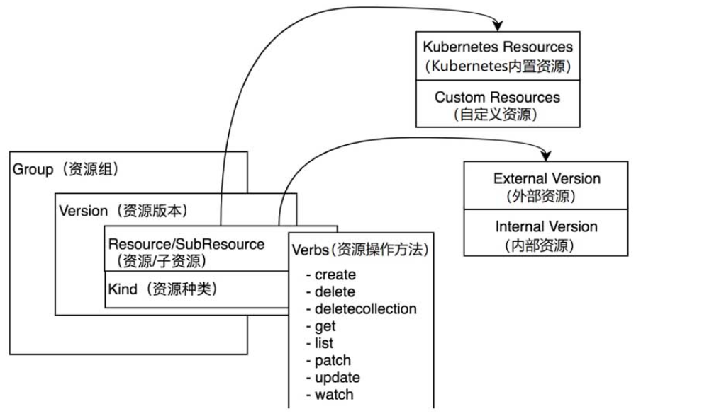
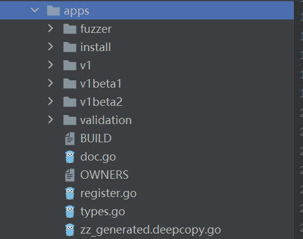
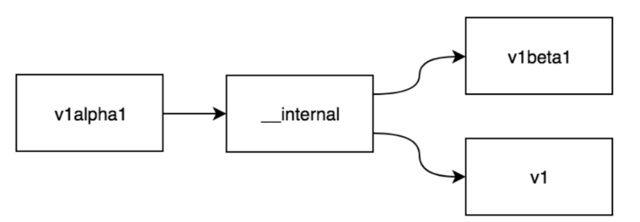

Table of Contents
=================

  * [1. 资源的表示](#1-资源的表示)
     * [1.1 Group](#11-group)
     * [1.2 version](#12-version)
     * [1.3 Resource](#13-resource)
     * [1.4 gvk, gvr是什么](#14-gvk-gvr是什么)
  * [2. 资源外部版本与内部版本](#2-资源外部版本与内部版本)
  * [3. 资源代码定义](#3-资源代码定义)
  * [4. 资源注册](#4-资源注册)
  * [5. k8s内置资源全展](#5-k8s内置资源全展)
  * [6. 资源转换](#6-资源转换)
  * [7. 总结](#7-总结)

**重点：**

（1）k8s中资源是如何表示的

（2）内部资源和外部资源的作用以及相互转换

<br>

### 1. 资源的表示

资源是Kubernetes的核心概念，Kubernetes将资源再次分组和版本化，形成Group（资源组）、Version（资源版本）、Resource（资源）。Group、Version、Resource核心数据结构如图3-1所示。

* Group：被称为资源组，在Kubernetes API Server中也可称其为APIGroup。

* Version：被称为资源版本，在Kubernetes API Server中也可称其为APIVersions。

* Resource：被称为资源，在Kubernetes API Server中也可称其为APIResource。

* Kind：资源种类，描述Resource的种类，与Resource为同一级别。




Kubernetes系统支持多个Group，每个Group支持多个Version，每个Version支持多个Resource，其中部分资源同时会拥有自己的子资源（即SubResource）。例如，Deployment资源拥有Status子资源。

<br>

资源对象由“资源组+资源版本+资源种类”组成，并在实例化后表达一个资源对象，例如Deployment资源实例化后

拥有资源组、资源版本及资源种类，其表现形式为<group>/<version>，Kind=<kind>。

例如 apps/v1，Kind=Deployment。 Apps 表示group, v1表示version, deployment表示kind。

<br>

#### 1.1 Group

```
type APIGroup struct {
	TypeMeta `json:",inline"`
	
	Name string `json:"name" protobuf:"bytes,1,opt,name=name"`
	// 当前这个组支持的所有version
	Versions []GroupVersionForDiscovery `json:"versions" protobuf:"bytes,2,rep,name=versions"`
  
  // GroupVersionForDiscovery是一个结构体，只包含GroupVersion和version两个字段
	PreferredVersion GroupVersionForDiscovery `json:"preferredVersion,omitempty" protobuf:"bytes,3,opt,name=preferredVersion"`

  // CIDR相关
	// +optional
	ServerAddressByClientCIDRs []ServerAddressByClientCIDR `json:"serverAddressByClientCIDRs,omitempty" protobuf:"bytes,4,rep,name=serverAddressByClientCIDRs"`
}
```

Group（资源组），在Kubernetes API Server中也可称其为APIGroup。Kubernetes系统中定义了许多资源组，

这些资源组按照不同功能将资源进行了划分，资源组特点如下。

* 将众多资源按照功能划分成不同的资源组，并允许单独启用/禁用资源组。当然也可以单独启用/禁用资源组中的资源。
* 支持不同资源组中拥有不同的资源版本。这方便组内的资源根据版本进行迭代升级。
* 支持同名的资源种类（即Kind）存在于不同的资源组内。
* 资源组与资源版本通过Kubernetes API Server对外暴露，允许开发者通过HTTP协议进行交互并通过动态客户端（即DynamicClient）进行资源发现。
* 支持CRD自定义资源扩展。

k8s中存在没有组的资源，例如pod，直接就是 /v1/pod

其他的，deploy，  /apps/v1/deploy

<br>

#### 1.2 version

Kubernetes的资源版本控制可分为3种，分别是Alpha、Beta、Stable，它们之间的迭代顺序为Alpha→Beta→Stable，其通常用来表示软件测试过程中的3个阶段。Alpha是第1个阶段，一般用于内部测试；

Beta是第2个阶段，该版本已经修复了大部分不完善之处，但仍有可能存在缺陷和漏洞，一般由特定的用户群来进

行测试；Stable是第3个阶段，此时基本形成了产品并达到了一定的成熟度，可稳定运行。Kubernetes资源版本控

制详情如下。

<br>

Alpha版本名称一般为v1alpha1、v1alpha2、v2alpha1等。

Beta版本命名一般为v1beta1、v1beta2、v2beta1。

Stable版本命名一般为v1、v2、v3。

<br>

#### 1.3 Resource

Resource是一个整体的描述，能直接看出来的点就是 资源名字，缩写，可以支持的操作，组名（Group）等等。

Group负责分组。

version负责标记版本。

kind是结构体完整的描述。

Verbs: 这个资源支持的操作，get, list, watch, create, update, patch, delete等等。

```
// APIResource specifies the name of a resource and whether it is namespaced.
type APIResource struct {
	// name is the plural name of the resource.
	Name string `json:"name" protobuf:"bytes,1,opt,name=name"`
	// singularName is the singular name of the resource.  This allows clients to handle plural and singular opaquely.
	// The singularName is more correct for reporting status on a single item and both singular and plural are allowed
	// from the kubectl CLI interface.
	SingularName string `json:"singularName" protobuf:"bytes,6,opt,name=singularName"`
	// namespaced indicates if a resource is namespaced or not.
	Namespaced bool `json:"namespaced" protobuf:"varint,2,opt,name=namespaced"`
	// group is the preferred group of the resource.  Empty implies the group of the containing resource list.
	// For subresources, this may have a different value, for example: Scale".
	Group string `json:"group,omitempty" protobuf:"bytes,8,opt,name=group"`
	// version is the preferred version of the resource.  Empty implies the version of the containing resource list
	// For subresources, this may have a different value, for example: v1 (while inside a v1beta1 version of the core resource's group)".
	Version string `json:"version,omitempty" protobuf:"bytes,9,opt,name=version"`
	// kind is the kind for the resource (e.g. 'Foo' is the kind for a resource 'foo')
	
	Kind string `json:"kind" protobuf:"bytes,3,opt,name=kind"`
	
	// verbs is a list of supported kube verbs (this includes get, list, watch, create,
	// update, patch, delete, deletecollection, and proxy)
	Verbs Verbs `json:"verbs" protobuf:"bytes,4,opt,name=verbs"`
	// shortNames is a list of suggested short names of the resource.
	
	ShortNames []string `json:"shortNames,omitempty" protobuf:"bytes,5,rep,name=shortNames"`
	// categories is a list of the grouped resources this resource belongs to (e.g. 'all')
	Categories []string `json:"categories,omitempty" protobuf:"bytes,7,rep,name=categories"`
}
```

**Resource**  更多是方便HTTP 协议和 JSON 格式传输的资源展现形式，可以以单个资源对象展现，例如 `.../namespaces/default`，也可以以列表的形式展现，例如 `.../jobs`。要正确的请求资源对象，API-Server 必须知道 `apiVersion` 与请求的资源，这样 API-Server 才能正确地解码请求信息，这些信息正是处于请求的资源路径中。一般来说，把 API Group、API Version 以及 Resource 组合成为 GVR 可以区分特定的资源请求路径，例如 `/apis/batch/v1/jobs` 就是请求所有的 jobs 信息。

#### 1.4 gvk, gvr是什么

Gvk: group, version,kind。用于定位一个资源的总类。用面向对象的思想就是  gvk是一个类。

Gvr: group, version, resource。用于定位到一个资源。用面向对象的思想就是  gvk是一个实例。

```
type GroupVersionKind struct {
	Group   string
	Version string
	Kind    string
}

type GroupVersionResource struct {
	Group    string
	Version  string
	Resource string
}
```

以Pod为例，Kind是{Group:"", Version: "v1", Kind: "Pod"}。

resource有单复数的区别

 那么singular是{Group:"", Version: "v1", Resource: "pod"},  plural则是{Group："", Version："v1", Resource:"pods"}。

```
root@k8s-master:~# kubectl get pod hello-1627480320-8bdhf
NAME                     READY   STATUS      RESTARTS   AGE
hello-1627480320-8bdhf   0/1     Completed   0          3m16s

root@k8s-master:~# kubectl get pods hello-1627480320-8bdhf
Error from server (NotFound): pods "hello-1627480320-8bdhf" not found
```

<br>

GVR 常用于组合成 RESTful API 请求路径。例如，针对应用程序 v1 部署的 RESTful API 请求如下所示：

```fallback
GET /apis/apps/v1/namespaces/{namespace}/deployments/{name}
```

<br>

### 2. 资源外部版本与内部版本

Kubernetes资源代码定义在pkg/apis目录下，在详解资源代码定义之前，先来了解一下资源的外部版本

（External Version）与内部版本（InternalVersion）。在Kubernetes系统中，同一资源对应着两个版本，分别

是外部版本和内部版本。例如，Deployment资源，它所属的外部版本表现形式为apps/v1，内部版本表现形式为

apps/__internal。

* External Object：外部版本资源对象，也称为Versioned Object（即拥有资源版本的资源对象）。外部版本用于对外暴露给用户请求的接口所使用的资源对象，例如，用户在通过YAML或JSON格式的描述文件创建资源对象时，所使用的是外部版本的资源对象。外部版本的资源对象通过资源版本（Alpha、Beta、Stable）进行标识。

*  Internal Object：内部版本资源对象。内部版本不对外暴露，仅在Kubernetes API Server内部使用。内部版本用于多资源版本的转换，例如将v1beta1版本转换为v1版本，其过程为v1beta1→internal→v1，即先将v1beta1转换为内部版本（internal），再由内部版本（internal）转换为v1版本。内部版本资源对象通过runtime.APIVersionInternal（即__internal）进行标识。

<br>

**提示：**在Kubernetes源码中，外部版本的资源类型定义在vendor/k8s.io/api目录下，其完整描述路径为

vendor/k8s.io/api/<group>/<version>/<resource file>。例如，Pod资源的外部版本，定义在

vendor/k8s.io/api/core/v1/目录下。

这里的各个字段，都有提供了 json或者protobuf序列化之后的名称。这是外部的版本。

```
k8s.io/api/core/v1/types.go

// Pod is a collection of containers that can run on a host. This resource is created
// by clients and scheduled onto hosts.
type Pod struct {
	metav1.TypeMeta `json:",inline"`
	// Standard object's metadata.
	// More info: https://git.k8s.io/community/contributors/devel/api-conventions.md#metadata
	// +optional
	metav1.ObjectMeta `json:"metadata,omitempty" protobuf:"bytes,1,opt,name=metadata"`

	// Specification of the desired behavior of the pod.
	// More info: https://git.k8s.io/community/contributors/devel/api-conventions.md#spec-and-status
	// +optional
	Spec PodSpec `json:"spec,omitempty" protobuf:"bytes,2,opt,name=spec"`

	// Most recently observed status of the pod.
	// This data may not be up to date.
	// Populated by the system.
	// Read-only.
	// More info: https://git.k8s.io/community/contributors/devel/api-conventions.md#spec-and-status
	// +optional
	Status PodStatus `json:"status,omitempty" protobuf:"bytes,3,opt,name=status"`
}
```

<br>

pkg/apis/core/types.go

这里也定义了pod，这是pod的内部版本定义。这里就没有任何json,protobuf的名称定义了。

```
// Pod is a collection of containers, used as either input (create, update) or as output (list, get).
type Pod struct {
	metav1.TypeMeta
	// +optional
	metav1.ObjectMeta

	// Spec defines the behavior of a pod.
	// +optional
	Spec PodSpec

	// Status represents the current information about a pod. This data may not be up
	// to date.
	// +optional
	Status PodStatus
}
```

<br>

### 3. 资源代码定义

Kubernetes资源代码定义在pkg/apis目录下，同一资源对应着内部版本和外部版本，内部版本和外部版本的资源代码结构并不相同。资源的内部版本定义了所支持的资源类型（types.go）、资源验证方法（validation.go）、资源注册至资源注册表的方法（install/install.go）等。而资源的外部版本定义了资源的转换方法（conversion.go）、资源的默认值（defaults.go）等。

（1）以Deployment资源为例，它的内部版本定义在pkg/apis/apps/目录下，其资源代码结构如下：



● doc.go：GoDoc文件，定义了当前包的注释信息。在Kubernetes资源包中，它还担当了代码生成器的全局Tags描述文件。

● register.go：定义了资源组、资源版本及资源的注册信息。

● types.go：定义了在当前资源组、资源版本下所支持的资源类型。

● v1、v1beta1、v1beta2：定义了资源组下拥有的资源版本的资源（即外部版本）。

● install：把当前资源组下的所有资源注册到资源注册表中。

● validation：定义了资源的验证方法。

● zz_generated.deepcopy.go：定义了资源的深复制操作，该文件由代码生成器自动生成。

每一个Kubernetes资源目录，都通过register.go代码文件定义所属的资源组和资源版本，内部版本资源对象通过runtime.APIVersionInternal（即__internal）标识，代码示例如下：

```
var SchemeGroupVersion = schema.GroupVersion{Group: GroupName, Version: runtime.APIVersionInternal}
```

每一个Kubernetes资源目录，都通过type.go代码文件定义当前资源组/资源版本下所支持的资源类型，代码示例如下：

代码路径：pkg/apis/apps/types.go

```
type Deployment struct {}
type stateful struct{}
type daemonSet struct{}
```

（2）以Deployment资源为例，它的外部版本定义在pkg/apis/apps/{v1，v1beta1，v1beta2}目录下，其资源代码结构如下：

其中doc.go和register.go的功能与内部版本资源代码结构中的相似，故不再赘述。外部版本的资源代码结构说明如下。

● conversion.go：定义了资源的转换函数（默认转换函数），并将默认转换函数注册到资源注册表中。

● zz_generated.conversion.go：定义了资源的转换函数（自动生成的转换函数），并将生成的转换函数注册到资源注册表中。该文件由代码生成器自动生成。

● defaults.go：定义了资源的默认值函数，并将默认值函数注册到资源注册表中。

● zz_generated.defaults.go：定义了资源的默认值函数（自动生成的默认值函数），并将生成的默认值函数注册到资源注册表中。该文件由代码生成器自动生成。

<br>

外部版本与内部版本资源类型相同，都通过register.go代码文件定义所属的资源组和资源版本，外部版本资源对象

通过资源版本（Alpha、Beta、Stable）标识，代码示例如下：代码路径：pkg/apis/apps/v1/register.go

```
// GroupName is the group name use in this package
const GroupName = "apps"

// SchemeGroupVersion is group version used to register these objects
var SchemeGroupVersion = schema.GroupVersion{Group: GroupName, Version: "v1"}
```

<br>

### 4. 资源注册

在每一个Kubernetes资源组目录中，都拥有一个install/install.go代码文件，它负责将资源信息注册到资源注册表（Scheme）中。以core核心资源组为例，代码示例如下：

```
func init() {
	Install(legacyscheme.Scheme)
}

// Install registers the API group and adds types to a scheme
func Install(scheme *runtime.Scheme) {
	utilruntime.Must(apps.AddToScheme(scheme))
	utilruntime.Must(v1beta1.AddToScheme(scheme))
	utilruntime.Must(v1beta2.AddToScheme(scheme))
	utilruntime.Must(v1.AddToScheme(scheme))
	utilruntime.Must(scheme.SetVersionPriority(v1.SchemeGroupVersion, v1beta2.SchemeGroupVersion, v1beta1.SchemeGroupVersion))
}
```

legacyscheme.Scheme是kube-apiserver组件的全局资源注册表，Kubernetes的所有资源信息都交给资源注册表统一管理。core.AddToScheme函数注册core资源组内部版本的资源。v1.AddToScheme函数注册core资源组外部版本的资源。scheme.SetVersionPriority函数注册资源组的版本顺序，如有多个资源版本，排在最前面的为资源首选版本。

**这里先留个疑问，scheme到底是什么。然后再看为什么要注册到这里。**

<br>

### 5. k8s内置资源全展

Kubernetes系统内置了众多“资源组、资源版本、资源”，这才有了现在功能强大的资源管理系统。可通过如下方式获得当前Kubernetes系统所支持的内置资源。

● kubectl api-versions：列出当前Kubernetes系统支持的资源组和资源版本，其表现形式为<group>/<version>。

● kubectl api-resources：列出当前Kubernetes系统支持的Resource资源列表。

```
[root@k8s-master ~]# kubectl api-versions
admissionregistration.k8s.io/v1beta1
apiextensions.k8s.io/v1beta1
apiregistration.k8s.io/v1
apiregistration.k8s.io/v1beta1
apps/v1
apps/v1beta1
apps/v1beta2
authentication.k8s.io/v1
authentication.k8s.io/v1beta1
authorization.k8s.io/v1
authorization.k8s.io/v1beta1
autoscaling/v1
autoscaling/v2beta1
autoscaling/v2beta2
batch/v1
batch/v1beta1
certificates.k8s.io/v1beta1
coordination.k8s.io/v1beta1
events.k8s.io/v1beta1
extensions/v1beta1
networking.k8s.io/v1
policy/v1beta1
rbac.authorization.k8s.io/v1
rbac.authorization.k8s.io/v1beta1
scheduling.k8s.io/v1beta1
storage.k8s.io/v1
storage.k8s.io/v1beta1
v1
```

<br>

```
root@k8s-master ~]# kubectl api-resources
NAME                              SHORTNAMES   APIGROUP                       NAMESPACED   KIND
bindings                                                                      true         Binding
componentstatuses                 cs                                          false        ComponentStatus
configmaps                        cm                                          true         ConfigMap
endpoints                         ep                                          true         Endpoints
events                            ev                                          true         Event
limitranges                       limits                                      true         LimitRange
namespaces                        ns                                          false        Namespace
nodes                             no                                          false        Node
persistentvolumeclaims            pvc                                         true         PersistentVolumeClaim
persistentvolumes                 pv                                          false        PersistentVolume
pods                              po                                          true         Pod
podtemplates                                                                  true         PodTemplate
replicationcontrollers            rc                                          true         ReplicationController
resourcequotas                    quota                                       true         ResourceQuota
secrets                                                                       true         Secret
serviceaccounts                   sa                                          true         ServiceAccount
services                          svc                                         true         Service
mutatingwebhookconfigurations                  admissionregistration.k8s.io   false        MutatingWebhookConfiguration
validatingwebhookconfigurations                admissionregistration.k8s.io   false        ValidatingWebhookConfiguration
customresourcedefinitions         crd,crds     apiextensions.k8s.io           false        CustomResourceDefinition
apiservices                                    apiregistration.k8s.io         false        APIService
controllerrevisions                            apps                           true         ControllerRevision
daemonsets                        ds           apps                           true         DaemonSet
deployments                       deploy       apps                           true         Deployment
replicasets                       rs           apps                           true         ReplicaSet
statefulsets                      sts          apps                           true         StatefulSet
tokenreviews                                   authentication.k8s.io          false        TokenReview
localsubjectaccessreviews                      authorization.k8s.io           true         LocalSubjectAccessReview
selfsubjectaccessreviews                       authorization.k8s.io           false        SelfSubjectAccessReview
selfsubjectrulesreviews                        authorization.k8s.io           false        SelfSubjectRulesReview
subjectaccessreviews                           authorization.k8s.io           false        SubjectAccessReview
horizontalpodautoscalers          hpa          autoscaling                    true         HorizontalPodAutoscaler
cronjobs                          cj           batch                          true         CronJob
jobs                                           batch                          true         Job
certificatesigningrequests        csr          certificates.k8s.io            false        CertificateSigningRequest
leases                                         coordination.k8s.io            true         Lease
events                            ev           events.k8s.io                  true         Event
daemonsets                        ds           extensions                     true         DaemonSet
deployments                       deploy       extensions                     true         Deployment
ingresses                         ing          extensions                     true         Ingress
networkpolicies                   netpol       extensions                     true         NetworkPolicy
podsecuritypolicies               psp          extensions                     false        PodSecurityPolicy
replicasets                       rs           extensions                     true         ReplicaSet
networkpolicies                   netpol       networking.k8s.io              true         NetworkPolicy
poddisruptionbudgets              pdb          policy                         true         PodDisruptionBudget
podsecuritypolicies               psp          policy                         false        PodSecurityPolicy
clusterrolebindings                            rbac.authorization.k8s.io      false        ClusterRoleBinding
clusterroles                                   rbac.authorization.k8s.io      false        ClusterRole
rolebindings                                   rbac.authorization.k8s.io      true         RoleBinding
roles                                          rbac.authorization.k8s.io      true         Role
priorityclasses                   pc           scheduling.k8s.io              false        PriorityClass
storageclasses                    sc           storage.k8s.io                 false        StorageClass
volumeattachments                              storage.k8s.io                 false        VolumeAttachment
```

这里没有展示版本，如果想看某个对象支持哪些版本可以使用 kubectl explain 

```
root@k8s-master:~# kubectl explain pods
KIND:     Pod
VERSION:  v1

DESCRIPTION:
     Pod is a collection of containers that can run on a host. This resource is
     created by clients and scheduled onto hosts.

FIELDS:
   apiVersion   <string>
     APIVersion defines the versioned schema of this representation of an
     object. Servers should convert recognized schemas to the latest internal
     value, and may reject unrecognized values. More info:
     https://git.k8s.io/community/contributors/devel/sig-architecture/api-conventions.md#resources

   kind <string>
     Kind is a string value representing the REST resource this object
     represents. Servers may infer this from the endpoint the client submits
     requests to. Cannot be updated. In CamelCase. More info:
     https://git.k8s.io/community/contributors/devel/sig-architecture/api-conventions.md#types-kinds

   metadata     <Object>
     Standard object's metadata. More info:
     https://git.k8s.io/community/contributors/devel/sig-architecture/api-conventions.md#metadata

   spec <Object>
     Specification of the desired behavior of the pod. More info:
     https://git.k8s.io/community/contributors/devel/sig-architecture/api-conventions.md#spec-and-status

   status       <Object>
     Most recently observed status of the pod. This data may not be up to date.
     Populated by the system. Read-only. More info:
     https://git.k8s.io/community/contributors/devel/sig-architecture/api-conventions.md#spec-and-status
```

<br>

### 6. 资源转换

k8s中每中资源都在kubernetes/pkg/apis/apps/v1/conversion.go中定义了转换函数。

内部版本（__internal）作为中间桥梁。如下，v1alpha1要想转到v1必须先转换成 (__internal)版本。这样的好处在于，以后新增的版本，只要能和__internal互相转换即可。



```
// 转换函数为
kubernetes/pkg/apis/apps/v1/conversion.go
func addConversionFuncs(scheme *runtime.Scheme) error {
	// Add non-generated conversion functions to handle the *int32 -> int32
	// conversion. A pointer is useful in the versioned type so we can default
	// it, but a plain int32 is more convenient in the internal type. These
	// functions are the same as the autogenerated ones in every other way.
	err := scheme.AddConversionFuncs(
		Convert_v1_StatefulSetSpec_To_apps_StatefulSetSpec,
		Convert_apps_StatefulSetSpec_To_v1_StatefulSetSpec,
		Convert_v1_StatefulSetUpdateStrategy_To_apps_StatefulSetUpdateStrategy,
		Convert_apps_StatefulSetUpdateStrategy_To_v1_StatefulSetUpdateStrategy,
		Convert_extensions_RollingUpdateDaemonSet_To_v1_RollingUpdateDaemonSet,
		Convert_v1_RollingUpdateDaemonSet_To_extensions_RollingUpdateDaemonSet,
		Convert_v1_StatefulSetStatus_To_apps_StatefulSetStatus,
		Convert_apps_StatefulSetStatus_To_v1_StatefulSetStatus,
		Convert_v1_Deployment_To_extensions_Deployment,
		Convert_extensions_Deployment_To_v1_Deployment,
		Convert_extensions_DaemonSet_To_v1_DaemonSet,
		Convert_v1_DaemonSet_To_extensions_DaemonSet,
		Convert_extensions_DaemonSetSpec_To_v1_DaemonSetSpec,
		Convert_v1_DaemonSetSpec_To_extensions_DaemonSetSpec,
		Convert_extensions_DaemonSetUpdateStrategy_To_v1_DaemonSetUpdateStrategy,
		Convert_v1_DaemonSetUpdateStrategy_To_extensions_DaemonSetUpdateStrategy,
		// extensions
		// TODO: below conversions should be dropped in favor of auto-generated
		// ones, see https://github.com/kubernetes/kubernetes/issues/39865
		Convert_v1_DeploymentSpec_To_extensions_DeploymentSpec,
		Convert_extensions_DeploymentSpec_To_v1_DeploymentSpec,
		Convert_v1_DeploymentStrategy_To_extensions_DeploymentStrategy,
		Convert_extensions_DeploymentStrategy_To_v1_DeploymentStrategy,
		Convert_v1_RollingUpdateDeployment_To_extensions_RollingUpdateDeployment,
		Convert_extensions_RollingUpdateDeployment_To_v1_RollingUpdateDeployment,
		Convert_extensions_ReplicaSetSpec_To_v1_ReplicaSetSpec,
		Convert_v1_ReplicaSetSpec_To_extensions_ReplicaSetSpec,
	)
	if err != nil {
		return err
	}
	return nil
}
```

### 7. 总结

（1）k8s中的资源有内部版本和外部版本之分

（2）通过划 group, version。让一个对象支持有多个版本，利于对象的发展，例如alaph->v1

（3）gvk(group, version, kind),  gvr(group, version, resource) 可以方便集群内部和http传输的时候定位到一个对象或者对象列表

<b>

**参考文档**： Kubernetes源码剖析，郑东旭

https://github.com/kubernetes/community/blob/master/contributors/devel/sig-architecture/api-conventions.md

