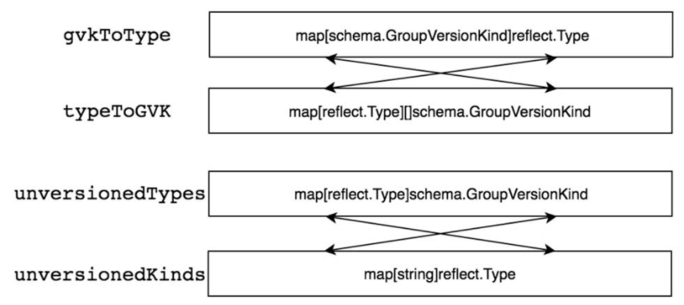
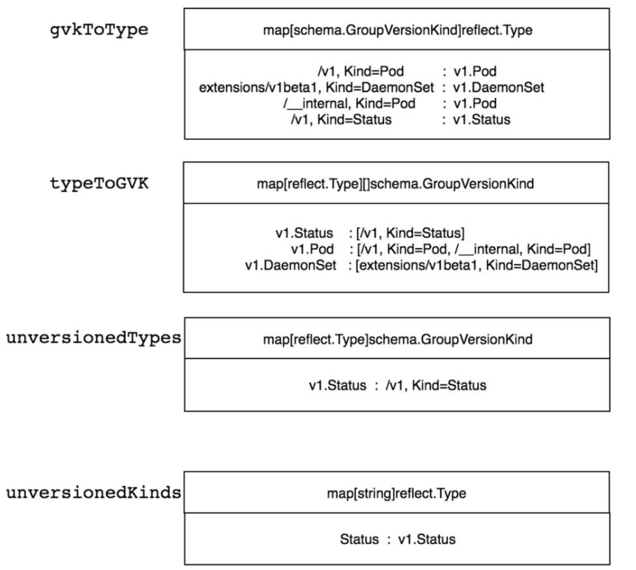

[toc]

<br>

### 1. schema简介-内存型的资源注册表

Kubernetes系统拥有众多资源，每一种资源就是一个资源类型，这些资源类型需要有统一的注册、存储、查询、管理等机制。目前Kubernetes系统中的所有资源类型都已注册到Scheme资源注册表中，其是一个内存型的资源注册表，拥有如下特点。

● 支持注册多种资源类型，包括内部版本和外部版本。

● 支持多种版本转换机制。

● 支持不同资源的序列化/反序列化机制。

Scheme资源注册表支持两种资源类型（Type）的注册，分别是UnversionedType和KnownType资源类型，分别介绍如下。

● UnversionedType：无版本资源类型，这是一个早期Kubernetes系统中的概念，它主要应用于某些没有版本的资源类型，该类型的资源对象并不需要进行转换。在目前的Kubernetes发行版本中，无版本类型已被弱化，几乎所有的资源对象都拥有版本，但在metav1元数据中还有部分类型，它们既属于meta.k8s.io/v1又属于UnversionedType无版本资源类型，例如metav1.Status、metav1.APIVersions、metav1.APIGroupList、metav1.APIGroup、metav1.APIResourceList。

● KnownType：是目前Kubernetes最常用的资源类型，也可称其为“拥有版本的资源类型”。

在Scheme资源注册表中，UnversionedType资源类型的对象通过scheme.AddUnversionedTypes方法进行注册，KnownType资源类型的对象通过scheme.AddKnownTypes方法进行注册。

<br>

### 2.schema数据结构

```
// Scheme defines methods for serializing and deserializing API objects, a type
// registry for converting group, version, and kind information to and from Go
// schemas, and mappings between Go schemas of different versions. A scheme is the
// foundation for a versioned API and versioned configuration over time.
//
// In a Scheme, a Type is a particular Go struct, a Version is a point-in-time
// identifier for a particular representation of that Type (typically backwards
// compatible), a Kind is the unique name for that Type within the Version, and a
// Group identifies a set of Versions, Kinds, and Types that evolve over time. An
// Unversioned Type is one that is not yet formally bound to a type and is promised
// to be backwards compatible (effectively a "v1" of a Type that does not expect
// to break in the future).
//
// Schemes are not expected to change at runtime and are only threadsafe after
// registration is complete.
type Scheme struct {
	// versionMap allows one to figure out the go type of an object with
	// the given version and name.
	// 1.存储GVK与Type的映射关系。  Int, float就是一种type
	gvkToType map[schema.GroupVersionKind]reflect.Type

	// typeToGroupVersion allows one to find metadata for a given go object.
	// The reflect.Type we index by should *not* be a pointer.
	// 2. 存储Type与GVK的映射关系，一个Type会对应一个或多个GVK。 因为一个kind可能有多个版本
	typeToGVK map[reflect.Type][]schema.GroupVersionKind
  
  
	// unversionedTypes are transformed without conversion in ConvertToVersion.
	unversionedTypes map[reflect.Type]schema.GroupVersionKind

	// unversionedKinds are the names of kinds that can be created in the context of any group
	// or version
	// TODO: resolve the status of unversioned types.
	unversionedKinds map[string]reflect.Type

	// Map from version and resource to the corresponding func to convert
	// resource field labels in that version to internal version.
	fieldLabelConversionFuncs map[schema.GroupVersionKind]FieldLabelConversionFunc

	// defaulterFuncs is an array of interfaces to be called with an object to provide defaulting
	// the provided object must be a pointer.
	defaulterFuncs map[reflect.Type]func(interface{})

	// converter stores all registered conversion functions. It also has
	// default converting behavior.
	converter *conversion.Converter

	// versionPriority is a map of groups to ordered lists of versions for those groups indicating the
	// default priorities of these versions as registered in the scheme
	versionPriority map[string][]string

	// observedVersions keeps track of the order we've seen versions during type registration
	observedVersions []schema.GroupVersion

	// schemeName is the name of this scheme.  If you don't specify a name, the stack of the NewScheme caller will be used.
	// This is useful for error reporting to indicate the origin of the scheme.
	schemeName string
}
```

scheme主要有俩大功能：资源的注册，和内部外部资源的转换。

#### 2.1 资源的注册

Scheme资源注册表结构字段说明如下。

● gvkToType：存储GVK与Type的映射关系。  Int, float就是一种type

● typeToGVK：存储Type与GVK的映射关系，一个Type会对应一个或多个GVK。

● unversionedTypes：存储UnversionedType与GVK的映射关系。

● unversionedKinds：存储Kind（资源种类）名称与UnversionedType的映射关系。

Scheme资源注册表通过Go语言的map结构实现映射关系，这些映射关系可以实现高效的正向和反向检索，从Scheme资源注册表中检索某个GVK的Type，它的时间复杂度为O（1）。资源注册表映射关系如下所示。



<br>

##### 2.1.1 k8s资源注册原理

这里先用一个例子说明这种注册模式。下一节详细说一下k8s中时如何注册的

```
|____scheme
| |____test.go
|____test1
| |____test1.go
|____test2
| |____Test2.go
|____test.go
```

scheme/test.go文件如下：很简单，就是定义里一个TestScheme结构体。和一个TestSchemeA变量。

```
package scheme

type TestScheme struct{
	T map[int]int
}

var (
	TestSchemeA = NewTestScheme()
)

func NewTestScheme() *TestScheme{
	return &TestScheme{ T: map[int]int{}}
}
```

<br>

Test1/test1.go文件如下：

```
package test1

import (
	"Practice/scheme"
	"fmt"
)

func init() {
	fmt.Println("before add test1")
	fmt.Println(scheme.TestSchemeA)
	Add(scheme.TestSchemeA)
	fmt.Println("after add test1")
	fmt.Println(scheme.TestSchemeA)
}


func Add(a *scheme.TestScheme) {
	a.T[1] = 1
}
```

Test2/test2.go文件如下：

```
package test2

import (
	"Practice/scheme"
	"fmt"
)

func init() {
	fmt.Println("before add test1")
	fmt.Println(scheme.TestSchemeA)
	Add(scheme.TestSchemeA)
	fmt.Println("after add test1")
	fmt.Println(scheme.TestSchemeA)
}


func Add(a *scheme.TestScheme) {
	a.T[2] = 2
}
```

<br>

Test.go文件如下：

```
package main

import (
	"Practice/scheme"
	_ "Practice/test1"
	_ "Practice/test2"
	"fmt"
)


func main() {
	fmt.Println(scheme.TestSchemeA)
}
```

<br>

运行test.go文件。输出如下：

```
before add test1
&{map[]}
after add test1
&{map[1:1]}
before add test1
&{map[1:1]}
after add test1
&{map[1:1 2:2]}
&{map[1:1 2:2]}
```

所以，可以看出来，通过go包的 init, import将 test1, test2自动注册到了，TestSchemeA这个全局的map中。

##### 2.1.2 k8S资源注册过程

(1) 初始化scheme资源注册表

在legacyscheme包中，定义了scheme资源注册函数，codec编码器以及ParameterCodec参数解码器。它们被定义为全局变量，这些变量在kube-apiserver的任何地方都可以被调用。

```
pkg/api/legacyscheme/scheme.go
var (
	// Scheme is the default instance of runtime.Scheme to which types in the Kubernetes API are already registered.
	// NOTE: If you are copying this file to start a new api group, STOP! Copy the
	// extensions group instead. This Scheme is special and should appear ONLY in
	// the api group, unless you really know what you're doing.
	// TODO(lavalamp): make the above error impossible.
	Scheme = runtime.NewScheme()

	// Codecs provides access to encoding and decoding for the scheme
	Codecs = serializer.NewCodecFactory(Scheme)

	// ParameterCodec handles versioning of objects that are converted to query parameters.
	ParameterCodec = runtime.NewParameterCodec(Scheme)
)
```

（2）注册kubernetes所支持的资源

Kube-apiserver启动的时候导入了master包。master包中的import_known_versions.go文件调用了所有资源的Install包。通过包的导入机制触发Init函数，从而完成了注册。

```
pkg/master/import_known_versions.go

package master

import (
	// These imports are the API groups the API server will support.
	_ "k8s.io/kubernetes/pkg/apis/admission/install"
	_ "k8s.io/kubernetes/pkg/apis/admissionregistration/install"
	_ "k8s.io/kubernetes/pkg/apis/apps/install"
	_ "k8s.io/kubernetes/pkg/apis/auditregistration/install"
	_ "k8s.io/kubernetes/pkg/apis/authentication/install"
	_ "k8s.io/kubernetes/pkg/apis/authorization/install"
	_ "k8s.io/kubernetes/pkg/apis/autoscaling/install"
	_ "k8s.io/kubernetes/pkg/apis/batch/install"
	_ "k8s.io/kubernetes/pkg/apis/certificates/install"
	_ "k8s.io/kubernetes/pkg/apis/coordination/install"
	_ "k8s.io/kubernetes/pkg/apis/core/install"
	_ "k8s.io/kubernetes/pkg/apis/discovery/install"
	_ "k8s.io/kubernetes/pkg/apis/events/install"
	_ "k8s.io/kubernetes/pkg/apis/extensions/install"
	_ "k8s.io/kubernetes/pkg/apis/flowcontrol/install"
	_ "k8s.io/kubernetes/pkg/apis/imagepolicy/install"
	_ "k8s.io/kubernetes/pkg/apis/networking/install"
	_ "k8s.io/kubernetes/pkg/apis/node/install"
	_ "k8s.io/kubernetes/pkg/apis/policy/install"
	_ "k8s.io/kubernetes/pkg/apis/rbac/install"
	_ "k8s.io/kubernetes/pkg/apis/scheduling/install"
	_ "k8s.io/kubernetes/pkg/apis/settings/install"
	_ "k8s.io/kubernetes/pkg/apis/storage/install"
)
```

随便找一个install包, 可以发现这里引入了全局的legacyscheme.Scheme，然后调用了AddToScheme函数进行了注册

```
package install

import (
	"k8s.io/apimachinery/pkg/runtime"
	utilruntime "k8s.io/apimachinery/pkg/util/runtime"
	"k8s.io/kubernetes/pkg/api/legacyscheme"
	"k8s.io/kubernetes/pkg/apis/core"
	"k8s.io/kubernetes/pkg/apis/core/v1"
)

func init() {
	Install(legacyscheme.Scheme)
}

// Install registers the API group and adds types to a scheme
func Install(scheme *runtime.Scheme) {
	utilruntime.Must(core.AddToScheme(scheme))
	utilruntime.Must(v1.AddToScheme(scheme))
	utilruntime.Must(scheme.SetVersionPriority(v1.SchemeGroupVersion))
}


pkg/apis/core/register.go
var (
	// SchemeBuilder object to register various known types
	SchemeBuilder = runtime.NewSchemeBuilder(addKnownTypes)

	// AddToScheme represents a func that can be used to apply all the registered
	// funcs in a scheme
	AddToScheme = SchemeBuilder.AddToScheme
)

func addKnownTypes(scheme *runtime.Scheme) error {
	if err := scheme.AddIgnoredConversionType(&metav1.TypeMeta{}, &metav1.TypeMeta{}); err != nil {
		return err
	}
	scheme.AddKnownTypes(SchemeGroupVersion,
		&Pod{},
		&PodList{},
		&PodStatusResult{},
	   。。。
	)

	return nil
}
```

<br>

##### 2.1.3 每种资源的kind，resource是如何转换的

在register.go函数中注册了资源。而K8S中的每种资源都必须有apiVersion:和Kind字段。所以只要注册一种资源就有了GVK在scheme中

```
pkg/apis/apps/register.go
// Adds the list of known types to the given scheme.
func addKnownTypes(scheme *runtime.Scheme) error {
	// TODO this will get cleaned up with the scheme types are fixed
	scheme.AddKnownTypes(SchemeGroupVersion,
		&DaemonSet{},
		&DaemonSetList{},
		&Deployment{},
		&DeploymentList{},
		&DeploymentRollback{},
		&autoscaling.Scale{},
		&StatefulSet{},
		&StatefulSetList{},
		&ControllerRevision{},
		&ControllerRevisionList{},
		&ReplicaSet{},
		&ReplicaSetList{},
	)
	return nil
}

// AddKnownTypes registers all types passed in 'types' as being members of version 'version'.
// All objects passed to types should be pointers to structs. The name that go reports for
// the struct becomes the "kind" field when encoding. Version may not be empty - use the
// APIVersionInternal constant if you have a type that does not have a formal version.
func (s *Scheme) AddKnownTypes(gv schema.GroupVersion, types ...Object) {
	s.addObservedVersion(gv)
	for _, obj := range types {
		t := reflect.TypeOf(obj)
		if t.Kind() != reflect.Ptr {
			panic("All types must be pointers to structs.")
		}
		t = t.Elem()
		s.AddKnownTypeWithName(gv.WithKind(t.Name()), obj)
	}
}
```

schme只要有gvk就行了，因为gvk->gvr的转换很简单，知道了kind,就知道了resource。resource就行kind的小写，单数和复数形式。

restmapper中定义了转换方法。

staging/src/k8s.io/apimachinery/pkg/api/meta/restmapper.go

```
// ResourceSingularizer implements RESTMapper
// It converts a resource name from plural to singular (e.g., from pods to pod)
func (m *DefaultRESTMapper) ResourceSingularizer(resourceType string) (string, error) {
	partialResource := schema.GroupVersionResource{Resource: resourceType}
	resources, err := m.ResourcesFor(partialResource)
	if err != nil {
		return resourceType, err
	}

	singular := schema.GroupVersionResource{}
	for _, curr := range resources {
		currSingular, ok := m.pluralToSingular[curr]
		if !ok {
			continue
		}
		if singular.Empty() {
			singular = currSingular
			continue
		}

		if currSingular.Resource != singular.Resource {
			return resourceType, fmt.Errorf("multiple possible singular resources (%v) found for %v", resources, resourceType)
		}
	}

	if singular.Empty() {
		return resourceType, fmt.Errorf("no singular of resource %v has been defined", resourceType)
	}

	return singular.Resource, nil
}
```

#### 2.2 内部版本和外部版本的转换

scheme结构体中，有一个converter的结构体，这个结构体包含了所有的转换函数。

```
	// converter stores all registered conversion functions. It also has
	// default converting behavior.
	converter *conversion.Converter
	
	// Converter knows how to convert one type to another.
type Converter struct {
	// Map from the conversion pair to a function which can
	// do the conversion.
	conversionFuncs          ConversionFuncs
	generatedConversionFuncs ConversionFuncs

	// Set of conversions that should be treated as a no-op
	ignoredConversions map[typePair]struct{}

	// This is a map from a source field type and name, to a list of destination
	// field type and name.
	structFieldDests map[typeNamePair][]typeNamePair

	// Allows for the opposite lookup of structFieldDests. So that SourceFromDest
	// copy flag also works. So this is a map of destination field name, to potential
	// source field name and type to look for.
	structFieldSources map[typeNamePair][]typeNamePair

	// Map from an input type to a function which can apply a key name mapping
	inputFieldMappingFuncs map[reflect.Type]FieldMappingFunc

	// Map from an input type to a set of default conversion flags.
	inputDefaultFlags map[reflect.Type]FieldMatchingFlags

	// If non-nil, will be called to print helpful debugging info. Quite verbose.
	Debug DebugLogger

	// nameFunc is called to retrieve the name of a type; this name is used for the
	// purpose of deciding whether two types match or not (i.e., will we attempt to
	// do a conversion). The default returns the go type name.
	nameFunc func(t reflect.Type) string
}
```

converter转换函数需要提前注册，每个资源都需要注册自己内部<->外部转换函数。目前scheme支持5个注册转换函数。分别如下：

（1）scheme.AddIgnoredConversionType: 注册忽略的资源类型，不会只想转换操作。忽略资源对象的转换操作

（2）scheme.AddConversionFuncs: 注册多个conversion Func转换函数

（3）scheme.AddConversionFunc: 注册单个conversion Func转换函数

（4）scheme.AddGeneratedConversionFunc: 注册自动生成的转换函数

（5）scheme.AddFieldLabelConversionFunc: 注册字段标签的转换函数

为什么需要这个，可以参考：https://github.com/kubernetes/kubernetes/pull/4575

<br>

##### 2.2.1 k8s转换函数是如何注册的

也是同样的机制：以core/v1下面的资源为例。

所有的转换函数都定义在这个包中。pkg/apis/core/v1/zz_generated.conversion.go

以Affinity为例，

Convert_core_Affinity_To_v1_Affinity是内部转v1版本的转换函数

Convert_v1_Affinity_To_core_Affinity是v1转内部版本的转换函数。

这些通过init函数进行了注册。

```
pkg/apis/core/v1/register.go
var (
	localSchemeBuilder = &v1.SchemeBuilder
	AddToScheme        = localSchemeBuilder.AddToScheme
)


pkg/apis/core/v1/zz_generated.conversion.go
func init() {
	localSchemeBuilder.Register(RegisterConversions)
}

// RegisterConversions adds conversion functions to the given scheme.
// Public to allow building arbitrary schemes.
func RegisterConversions(s *runtime.Scheme) error {
	if err := s.AddGeneratedConversionFunc((*v1.AWSElasticBlockStoreVolumeSource)(nil), (*core.AWSElasticBlockStoreVolumeSource)(nil), func(a, b interface{}, scope conversion.Scope) error {
		return Convert_v1_AWSElasticBlockStoreVolumeSource_To_core_AWSElasticBlockStoreVolumeSource(a.(*v1.AWSElasticBlockStoreVolumeSource), b.(*core.AWSElasticBlockStoreVolumeSource), scope)
	}); err != nil {
		return err
	}
	if err := s.AddGeneratedConversionFunc((*core.AWSElasticBlockStoreVolumeSource)(nil), (*v1.AWSElasticBlockStoreVolumeSource)(nil), func(a, b interface{}, scope conversion.Scope) error {
		return Convert_core_AWSElasticBlockStoreVolumeSource_To_v1_AWSElasticBlockStoreVolumeSource(a.(*core.AWSElasticBlockStoreVolumeSource), b.(*v1.AWSElasticBlockStoreVolumeSource), scope)
	}); err != nil {
		return err
	}
	if err := s.AddGeneratedConversionFunc((*v1.Affinity)(nil), (*core.Affinity)(nil), func(a, b interface{}, scope conversion.Scope) error {
		return Convert_v1_Affinity_To_core_Affinity(a.(*v1.Affinity), b.(*core.Affinity), scope)
	}); err != nil {
		return err
	}
	if err := s.AddGeneratedConversionFunc((*core.Affinity)(nil), (*v1.Affinity)(nil), func(a, b interface{}, scope conversion.Scope) error {
		return Convert_core_Affinity_To_v1_Affinity(a.(*core.Affinity), b.(*v1.Affinity), scope)
	}); err != nil {
		return err
	}
	if err := s.AddGeneratedConversionFunc((*v1.AttachedVolume)(nil), (*core.AttachedVolume)(nil), func(a, b interface{}, scope conversion.Scope) error {
		return Convert_v1_AttachedVolume_To_core_AttachedVolume(a.(*v1.AttachedVolume), b.(*core.AttachedVolume), scope)
	}); err != nil {
		return err
	}
	if err := s.AddGeneratedConversionFunc((*core.AttachedVolume)(nil), (*v1.AttachedVolume)(nil), func(a, b interface{}, scope conversion.Scope) error {
		return Convert_core_AttachedVolume_To_v1_AttachedVolume(a.(*core.AttachedVolume), b.(*v1.AttachedVolume), scope)
	}); err != nil {
		return err
	}
	if err := s.AddGeneratedConversionFunc((*v1.AvoidPods)(nil), (*core.AvoidPods)(nil), func(a, b interface{}, scope conversion.Scope) error {
		return Convert_v1_AvoidPods_To_core_AvoidPods(a.(*v1.AvoidPods), b.(*core.AvoidPods), scope)
	}); err != nil {
		return err
	}
	if err := s.AddGeneratedConversionFunc((*core.AvoidPods)(nil), (*v1.AvoidPods)(nil), func(a, b interface{}, scope conversion.Scope) error {
		return Convert_core_AvoidPods_To_v1_AvoidPods(a.(*core.AvoidPods), b.(*v1.AvoidPods), scope)
	}); err != nil {
		return err
	}
	....
}
```

<br>

### 3.  Scheme代码展示

```
package main

import (
	appsv1 "k8s.io/api/apps/v1"
	corev1 "k8s.io/api/core/v1"
	metav1 "k8s.io/apimachinery/pkg/apis/meta/v1"
	"k8s.io/apimachinery/pkg/runtime"
	"ks8.io/apimachinery/pkg/runtime/schema"
)

func main() {
	// KnownType external
	coreGv := schema.GroupVersion{Group: "", Version: "v1"}
	extensionsGV := schema.GroupVersion{Group: "extensions", Version: "V1beta1"}
	
	// KnownType internal
	coreInternalGv := schema.GroupVersion{Group: "", Version: "v1"}
	
	// UnversionedType 
	Unversioned := schema.GroupVersion{Group: "", Version: "V1"}
	
	scheme := runtime.NewScheme()
	scheme.AddKnownTypes(coreGv, &corev1.Pod{})
	scheme.AddKnownTypes(extensionsGV, &corev1.DaemonSet{})
	scheme.AddKnownTypes(coreInternalGv, &corev1.Pod{})
	scheme.AddKnownTypes(Unversioned, &metav1.Status{})
}
```

在上述代码中，首先定义了两种类型的GV（资源组、资源版本），KnownType类型有coreGV、extensionsGV、

coreInternalGV对象，其中coreInternalGV对象属于内部版本（即runtime.APIVersionInternal），而

UnversionedType类型有Unversioned对象。通过runtime.NewScheme实例化一个新的Scheme资源注册表。注

册资源类型到Scheme资源注册表有两种方式，第一种通过scheme.AddKnownTypes方法注册KnownType类型的

对象，第二种通过scheme.AddUnversionedTypes方法注册UnversionedType类型的对象。在Scheme Example

代码示例中，我们往Scheme资源注册表中分别注册了Pod、DaemonSet、Pod（内部版本）及Status（无版本资

源类型）类型对象，那么这些资源的映射关系如下所示。



通过这个代码可以看出来，通过AddKnownTypes将资源的对应关系注册到了 schema中。其实就是补充对应的map。

```
// AddKnownTypes registers all types passed in 'types' as being members of version 'version'.
// All objects passed to types should be pointers to structs. The name that go reports for
// the struct becomes the "kind" field when encoding. Version may not be empty - use the
// APIVersionInternal constant if you have a type that does not have a formal version.
func (s *Scheme) AddKnownTypes(gv schema.GroupVersion, types ...Object) {
	s.addObservedVersion(gv)
	for _, obj := range types {
		t := reflect.TypeOf(obj)
		if t.Kind() != reflect.Ptr {
			panic("All types must be pointers to structs.")
		}
		t = t.Elem()
		s.AddKnownTypeWithName(gv.WithKind(t.Name()), obj)
	}
}
```

<br>

### 4. 总结

schema就是一个内存资源版本数据库。scheme可以做这样的事情：

（1）来一个资源，通过scheme就能知道该资源有没有注册到sheme

（2）如果注册了，就知道你这个资源的type, gvk

（3）知道这个资源如何进行内部和外部版本的转换

所以，有了scheme，apiserver就管理起来了资源多版本的问题。

<br>

**参考文档：** Kubernetes源码剖析，郑东旭