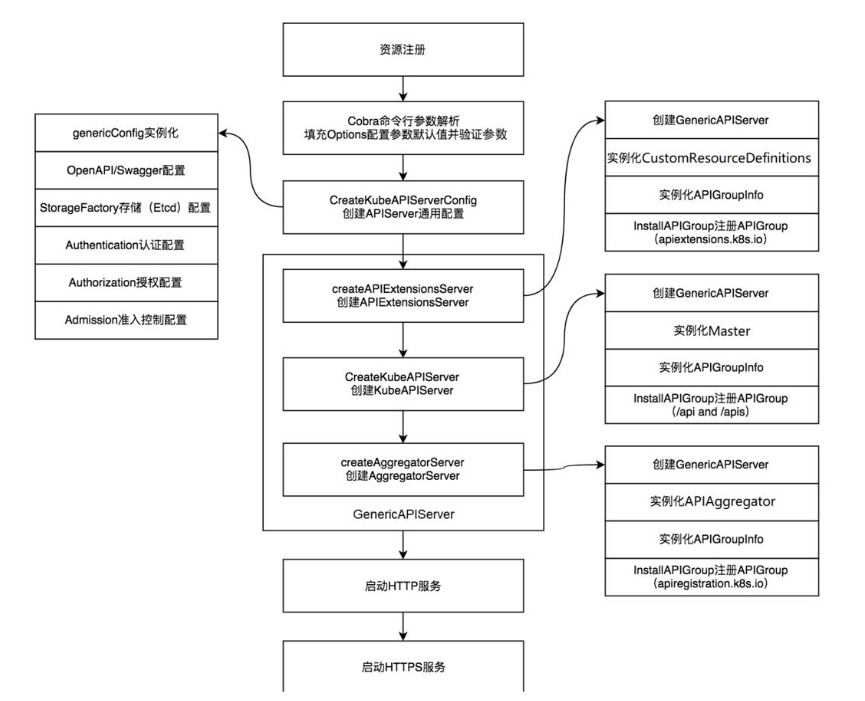
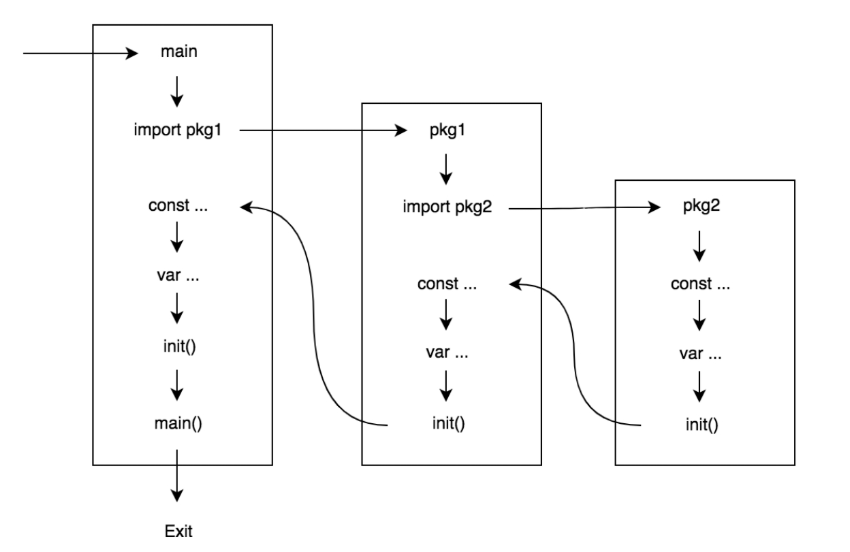

Table of Contents
=================

  * [1. 资源注册](#1-资源注册)
  * [2. Cobra命令行参数解析](#2-cobra命令行参数解析)
     * [2.1.  入口函数 main-&gt;NewAPIServerCommand](#21--入口函数-main-newapiservercommand)
     * [2.2 options.NewServerRunOptions](#22-optionsnewserverrunoptions)
     * [2.3 cmd.Flags()](#23-cmdflags)
     * [2.3.1 C.Name](#231-cname)
     * [2.3.2 NewFlagSet](#232-newflagset)
     * [2.4 s.Flags()](#24-sflags)
     * [2.5 command.Execute() 真正的参数解析](#25-commandexecute-真正的参数解析)
     * [2.6 总结](#26-总结)
  * [3. 总结](#3-总结)

**本章重点：**

（1）kube-apiserver启动过程中，前两个步骤：资源注册和命令行解析

<br>

在kube-apiserver组件启动过程中，代码逻辑可分为9个步骤，分别介绍如下。

（1）资源注册。

（2）Cobra命令行参数解析。

（3）创建APIServer通用配置。

（4）创建APIExtensionsServer。

（5）创建KubeAPIServer。

（6）创建AggregatorServer。

（7）创建GenericAPIServer。

（8）启动HTTP服务。

（9）启动HTTPS服务。


对应的流程图如下：




### 1. 资源注册

kube-apiserver组件启动后的第一件事情是将Kubernetes所支持的资源注册到Scheme资源注册表中，这样后面启动的逻辑才能够从Scheme资源注册表中拿到资源信息并启动和运行APIExtensionsServer、KubeAPIServer、AggregatorServer这3种服务。资源的注册过程并不是通过函数调用触发的，而是通过Go语言的导入（import）和初始化（init）机制触发的。导入和初始化机制如下图所示。




kube-apiserver的资源注册过程就利用了 import 和 init机制，代码示例如下：

在 kube-apiserver 入口函数所在的文件中 cmd\kube-apiserver\app\server.go  （NewAPIServerCommand 函数就在这个文件中）

```
	"k8s.io/kubernetes/pkg/api/legacyscheme"
	"k8s.io/kubernetes/pkg/master"
```

kube-apiserver导入了legacyscheme和master包。kube-apiserver资源注册分为两步：第1步，初始化Scheme资源注册表；第2步，注册Kubernetes所支持的资源。

**初始化资源注册表 scheme**

因为   server.go  import了 legacyscheme包，所以 legacyscheme包里面的 var会被初始化。

而在legacyscheme包中，就初始化了 scheme表。

```
package legacyscheme

import (
	"k8s.io/apimachinery/pkg/runtime"
	"k8s.io/apimachinery/pkg/runtime/serializer"
)

// Scheme is the default instance of runtime.Scheme to which types in the Kubernetes API are already registered.
// NOTE: If you are copying this file to start a new api group, STOP! Copy the
// extensions group instead. This Scheme is special and should appear ONLY in
// the api group, unless you really know what you're doing.
// TODO(lavalamp): make the above error impossible.
var Scheme = runtime.NewScheme()

// Codecs provides access to encoding and decoding for the scheme
var Codecs = serializer.NewCodecFactory(Scheme)

// ParameterCodec handles versioning of objects that are converted to query parameters.
var ParameterCodec = runtime.NewParameterCodec(Scheme)
```

<br>

同样 server.go import了 master包。所以 master 包引入的 包也会 运行  init var等过程。

在 master包中，有一个 pkg\master\import_known_versions.go 文件。这个文件 引入了包，但是啥都没干。这样的目的，就是  完成 引入包的 init, var。

```
package master

// These imports are the API groups the API server will support.
import (
	_ "k8s.io/kubernetes/pkg/apis/admission/install"
	_ "k8s.io/kubernetes/pkg/apis/admissionregistration/install"
	_ "k8s.io/kubernetes/pkg/apis/apps/install"
	_ "k8s.io/kubernetes/pkg/apis/authentication/install"
	_ "k8s.io/kubernetes/pkg/apis/authorization/install"
	_ "k8s.io/kubernetes/pkg/apis/autoscaling/install"
	_ "k8s.io/kubernetes/pkg/apis/batch/install"
	_ "k8s.io/kubernetes/pkg/apis/certificates/install"
	_ "k8s.io/kubernetes/pkg/apis/coordination/install"
	_ "k8s.io/kubernetes/pkg/apis/core/install"
	_ "k8s.io/kubernetes/pkg/apis/events/install"
	_ "k8s.io/kubernetes/pkg/apis/extensions/install"
	_ "k8s.io/kubernetes/pkg/apis/imagepolicy/install"
	_ "k8s.io/kubernetes/pkg/apis/networking/install"
	_ "k8s.io/kubernetes/pkg/apis/policy/install"
	_ "k8s.io/kubernetes/pkg/apis/rbac/install"
	_ "k8s.io/kubernetes/pkg/apis/scheduling/install"
	_ "k8s.io/kubernetes/pkg/apis/settings/install"
	_ "k8s.io/kubernetes/pkg/apis/storage/install"
)
```

随便拿一个为例，例如  k8s.io/kubernetes/pkg/apis/core/install 包

```
package install

import (
	"k8s.io/apimachinery/pkg/runtime"
	utilruntime "k8s.io/apimachinery/pkg/util/runtime"
	"k8s.io/kubernetes/pkg/api/legacyscheme"
	"k8s.io/kubernetes/pkg/apis/core"
	"k8s.io/kubernetes/pkg/apis/core/v1"
)

func init() {
	Install(legacyscheme.Scheme)
}

// Install registers the API group and adds types to a scheme
func Install(scheme *runtime.Scheme) {
	utilruntime.Must(core.AddToScheme(scheme))
	utilruntime.Must(v1.AddToScheme(scheme))
	utilruntime.Must(scheme.SetVersionPriority(v1.SchemeGroupVersion))
}
```

<br>

所以上面的一个 utilruntime.Must(core.AddToScheme(scheme))。

就将pod,podlist等等都注册到了scheme中去。

```
var (
   // SchemeBuilder object to register various known types
   SchemeBuilder = runtime.NewSchemeBuilder(addKnownTypes)

   // AddToScheme represents a func that can be used to apply all the registered
   // funcs in a scheme
   AddToScheme = SchemeBuilder.AddToScheme
)

func addKnownTypes(scheme *runtime.Scheme) error {
   if err := scheme.AddIgnoredConversionType(&metav1.TypeMeta{}, &metav1.TypeMeta{}); err != nil {
      return err
   }
   scheme.AddKnownTypes(SchemeGroupVersion,
      &Pod{},
      &PodList{},
      &PodStatusResult{},
      &PodTemplate{},
      &PodTemplateList{},
      &ReplicationControllerList{},
      &ReplicationController{},
      &ServiceList{},
      &Service{},
      &ServiceProxyOptions{},
      &NodeList{},
      &Node{},
      &NodeProxyOptions{},
      &Endpoints{},
      &EndpointsList{},
      &Binding{},
      &Event{},
      &EventList{},
      &List{},
      &LimitRange{},
      &LimitRangeList{},
      &ResourceQuota{},
      &ResourceQuotaList{},
      &Namespace{},
      &NamespaceList{},
      &ServiceAccount{},
      &ServiceAccountList{},
      &Secret{},
      &SecretList{},
      &PersistentVolume{},
      &PersistentVolumeList{},
      &PersistentVolumeClaim{},
      &PersistentVolumeClaimList{},
      &PodAttachOptions{},
      &PodLogOptions{},
      &PodExecOptions{},
      &PodPortForwardOptions{},
      &PodProxyOptions{},
      &ComponentStatus{},
      &ComponentStatusList{},
      &SerializedReference{},
      &RangeAllocation{},
      &ConfigMap{},
      &ConfigMapList{},
      &EphemeralContainers{},
   )

   return nil
}

// GroupName is the group name use in this package
const GroupName = ""

// SchemeGroupVersion is group version used to register these objects
var SchemeGroupVersion = schema.GroupVersion{Group: GroupName, Version: runtime.APIVersionInternal}
```


这里可以看出来，init中 就注册了 core资源。在上述代码中，core.AddToScheme函数注册了core资源组内部版本的资源，v1.AddToScheme函数注册了core资源

组外部版本的资源，scheme.SetVersionPriority函数注册了资源组的版本顺序。如果有多个资源版本，排在最前面的为资源首选版本。

提示：除将KubeAPIServer（API核心服务）注册至legacyscheme.Scheme资源注册表以外，还需要了解APIExtensionsServer和AggregatorServer资源注册过程。

●  将APIExtensionsServer （API扩展服务）注册至extensionsapiserver.Scheme资源注册表，注册过程定义在vendor/k8s.io/apiextensions-apiserver/pkg/apiserver/apiserver.go中。

●  将AggregatorServer（API聚合服务）注册至aggregatorscheme.Scheme资源注册表，注册过程定义在vendor/k8s.io/kube-aggregator/pkg/apiserver/scheme/scheme.go中。

```
vendor/k8s.io/kube-aggregator/pkg/apiserver/scheme/scheme.go

var (
	Scheme = runtime.NewScheme()
	Codecs = serializer.NewCodecFactory(Scheme)

	// if you modify this, make sure you update the crEncoder
	unversionedVersion = schema.GroupVersion{Group: "", Version: "v1"}
	unversionedTypes   = []runtime.Object{
		&metav1.Status{},
		&metav1.WatchEvent{},
		&metav1.APIVersions{},
		&metav1.APIGroupList{},
		&metav1.APIGroup{},
		&metav1.APIResourceList{},
	}
)

func init() {
	install.Install(Scheme)

	// we need to add the options to empty v1
	metav1.AddToGroupVersion(Scheme, schema.GroupVersion{Group: "", Version: "v1"})

	Scheme.AddUnversionedTypes(unversionedVersion, unversionedTypes...)
}
```

<br>

### 2. Cobra命令行参数解析

#### 2.1.  入口函数 main->NewAPIServerCommand

cmd\kube-apiserver\apiserver.go

```
func main() {
	rand.Seed(time.Now().UTC().UnixNano())

	command := app.NewAPIServerCommand(server.SetupSignalHandler())

	// TODO: once we switch everything over to Cobra commands, we can go back to calling
	// utilflag.InitFlags() (by removing its pflag.Parse() call). For now, we have to set the
	// normalize func and add the go flag set by hand.
	pflag.CommandLine.SetNormalizeFunc(utilflag.WordSepNormalizeFunc)
	pflag.CommandLine.AddGoFlagSet(goflag.CommandLine)
	// utilflag.InitFlags()
	logs.InitLogs()
	defer logs.FlushLogs()

	if err := command.Execute(); err != nil {
		fmt.Fprintf(os.Stderr, "error: %v\n", err)
		os.Exit(1)
	}
}
```

<br>

**NewAPIServerCommand**

```
// NewAPIServerCommand creates a *cobra.Command object with default parameters
func NewAPIServerCommand() *cobra.Command {
    // 1. 定义 NewServerRunOptions。就是定义所有参数的结构体对象。详见：2.2
	s := options.NewServerRunOptions()
	
	// 2. 定义一个 cmd
	cmd := &cobra.Command{
		Use: "kube-apiserver",
		Long: `The Kubernetes API server validates and configures data
for the api objects which include pods, services, replicationcontrollers, and
others. The API Server services REST operations and provides the frontend to the
cluster's shared state through which all other components interact.`,
		RunE: func(cmd *cobra.Command, args []string) error {
			verflag.PrintAndExitIfRequested()
			utilflag.PrintFlags(cmd.Flags())

			// set default options
			completedOptions, err := Complete(s)
			if err != nil {
				return err
			}

			// validate options
			if errs := completedOptions.Validate(); len(errs) != 0 {
				return utilerrors.NewAggregate(errs)
			}

			return Run(completedOptions, genericapiserver.SetupSignalHandler())
		},
	}
    
    
    // 3. 初始化cmd的 flagset。这里就是定义一个空的，以 kube-apserver为名字的 flagset。详见2.3
	fs := cmd.Flags()
	
	
	// 4. 绑定 kube-apiserver各个组件（etcd,CloudProvider等等），详见 2.4
	namedFlagSets := s.Flags()


    // 5. 将各个组件的 flagset加入，fs中。这样fs就有了 kube-apiserver，以及各个组件的flagset了。
	for _, f := range namedFlagSets.FlagSets {
		fs.AddFlagSet(f)
	}
    
    // 6. 设置打印使用函数
	usageFmt := "Usage:\n  %s\n"
	cols, _, _ := term.TerminalSize(cmd.OutOrStdout())
	cmd.SetUsageFunc(func(cmd *cobra.Command) error {
		fmt.Fprintf(cmd.OutOrStderr(), usageFmt, cmd.UseLine())
		cliflag.PrintSections(cmd.OutOrStderr(), namedFlagSets, cols)
		return nil
	})
	
	// 7. 设置help函数。
	cmd.SetHelpFunc(func(cmd *cobra.Command, args []string) {
		fmt.Fprintf(cmd.OutOrStdout(), "%s\n\n"+usageFmt, cmd.Long, cmd.UseLine())
		cliflag.PrintSections(cmd.OutOrStdout(), namedFlagSets, cols)
	})

	return cmd
}
```

<br>

#### 2.2 options.NewServerRunOptions

实例化一个对象，这里包括了所有的部分：GenericServerRunOptions, etcd , SecureServing...CloudProvider等等。

```
// NewServerRunOptions creates a new ServerRunOptions object with default parameters
func NewServerRunOptions() *ServerRunOptions {
	s := ServerRunOptions{
		GenericServerRunOptions: genericoptions.NewServerRunOptions(),
		Etcd:                 genericoptions.NewEtcdOptions(storagebackend.NewDefaultConfig(kubeoptions.DefaultEtcdPathPrefix, nil)),
		SecureServing:        kubeoptions.NewSecureServingOptions(),
		InsecureServing:      kubeoptions.NewInsecureServingOptions(),
		Audit:                genericoptions.NewAuditOptions(),
		Features:             genericoptions.NewFeatureOptions(),
		Admission:            kubeoptions.NewAdmissionOptions(),
		Authentication:       kubeoptions.NewBuiltInAuthenticationOptions().WithAll(),
		Authorization:        kubeoptions.NewBuiltInAuthorizationOptions(),
		CloudProvider:        kubeoptions.NewCloudProviderOptions(),
		StorageSerialization: kubeoptions.NewStorageSerializationOptions(),
		APIEnablement:        genericoptions.NewAPIEnablementOptions(),

		EnableLogsHandler:      true,
		EventTTL:               1 * time.Hour,
		MasterCount:            1,
		EndpointReconcilerType: string(reconcilers.LeaseEndpointReconcilerType),
		KubeletConfig: kubeletclient.KubeletClientConfig{
			Port:         ports.KubeletPort,
			ReadOnlyPort: ports.KubeletReadOnlyPort,
			PreferredAddressTypes: []string{
				// --override-hostname
				string(api.NodeHostName),

				// internal, preferring DNS if reported
				string(api.NodeInternalDNS),
				string(api.NodeInternalIP),

				// external, preferring DNS if reported
				string(api.NodeExternalDNS),
				string(api.NodeExternalIP),
			},
			EnableHttps: true,
			HTTPTimeout: time.Duration(5) * time.Second,
		},
		ServiceNodePortRange: kubeoptions.DefaultServiceNodePortRange,
	}
	s.ServiceClusterIPRange = kubeoptions.DefaultServiceIPCIDR

	// Overwrite the default for storage data format.
	s.Etcd.DefaultStorageMediaType = "application/vnd.kubernetes.protobuf"

	return &s
}
```

以etcd为例，可以看出来，就是实例化etcd对象，然后有默认值的就赋默认值。

```
func NewEtcdOptions(backendConfig *storagebackend.Config) *EtcdOptions {
	options := &EtcdOptions{
		StorageConfig:           *backendConfig,
		DefaultStorageMediaType: "application/json",
		DeleteCollectionWorkers: 1,
		EnableGarbageCollection: true,
		EnableWatchCache:        true,
		DefaultWatchCacheSize:   100,
	}
	options.StorageConfig.CountMetricPollPeriod = time.Minute
	return options
}
```

```
type EtcdOptions struct {
	// The value of Paging on StorageConfig will be overridden by the
	// calculated feature gate value.
	StorageConfig                    storagebackend.Config
	EncryptionProviderConfigFilepath string

	EtcdServersOverrides []string

	// To enable protobuf as storage format, it is enough
	// to set it to "application/vnd.kubernetes.protobuf".
	DefaultStorageMediaType string
	DeleteCollectionWorkers int
	EnableGarbageCollection bool

	// Set EnableWatchCache to false to disable all watch caches
	EnableWatchCache bool
	// Set DefaultWatchCacheSize to zero to disable watch caches for those resources that have no explicit cache size set
	DefaultWatchCacheSize int
	// WatchCacheSizes represents override to a given resource
	WatchCacheSizes []string
}
```


#### 2.3 cmd.Flags()

就是定义一个 kube-apiserver 为名字的 flagset。

```
// Flags returns the complete FlagSet that applies
// to this command (local and persistent declared here and by all parents).
func (c *Command) Flags() *flag.FlagSet {
	if c.flags == nil {
		c.flags = flag.NewFlagSet(c.Name(), flag.ContinueOnError)
		if c.flagErrorBuf == nil {
			c.flagErrorBuf = new(bytes.Buffer)
		}
		c.flags.SetOutput(c.flagErrorBuf)
	}

	return c.flags
}
```

#### 2.3.1 C.Name

 Command.Name = Command.Use。所以这里就是  c.Name = "kube-apiserver"

```
// Name returns the command's name: the first word in the use line.
func (c *Command) Name() string {
	name := c.Use
	i := strings.Index(name, " ")
	if i >= 0 {
		name = name[:i]
	}
	return name
}
```

<br>

#### 2.3.2 NewFlagSet

就是返回一个 flagset对象。

```
// NewFlagSet returns a new, empty flag set with the specified name,
// error handling property and SortFlags set to true.
func NewFlagSet(name string, errorHandling ErrorHandling) *FlagSet {
   f := &FlagSet{
      name:          name,
      errorHandling: errorHandling,
      argsLenAtDash: -1,
      interspersed:  true,
      SortFlags:     true,
   }
   return f
}
```


```
// A FlagSet represents a set of defined flags.
type FlagSet struct {
	// Usage is the function called when an error occurs while parsing flags.
	// The field is a function (not a method) that may be changed to point to
	// a custom error handler.
	Usage func()

	// SortFlags is used to indicate, if user wants to have sorted flags in
	// help/usage messages.
	SortFlags bool

	// ParseErrorsWhitelist is used to configure a whitelist of errors
	ParseErrorsWhitelist ParseErrorsWhitelist

	name              string
	parsed            bool
	actual            map[NormalizedName]*Flag
	orderedActual     []*Flag
	sortedActual      []*Flag
	formal            map[NormalizedName]*Flag
	orderedFormal     []*Flag
	sortedFormal      []*Flag
	shorthands        map[byte]*Flag
	args              []string // arguments after flags
	argsLenAtDash     int      // len(args) when a '--' was located when parsing, or -1 if no --
	errorHandling     ErrorHandling
	output            io.Writer // nil means stderr; use out() accessor
	interspersed      bool      // allow interspersed option/non-option args
	normalizeNameFunc func(f *FlagSet, name string) NormalizedName

	addedGoFlagSets []*goflag.FlagSet
}
```

通过打印日志发现，这个时候都还是空的。

```
I0127 10:51:41.053661    5612 flag.go:1209] zxtest f.name is kube-apiserver
I0127 10:51:41.053666    5612 flag.go:1210] zxtest f.actual is map[]
I0127 10:51:41.053677    5612 flag.go:1211] zxtest f.orderedActual is []
I0127 10:51:41.053684    5612 flag.go:1212] zxtest f.sortedActual is []
I0127 10:51:41.053689    5612 flag.go:1213] zxtest f.formal is map[]
I0127 10:51:41.053695    5612 flag.go:1214] zxtest f.orderedFormal is []
I0127 10:51:41.053702    5612 flag.go:1215] zxtest f.sortedFormal is []
I0127 10:51:41.053708    5612 flag.go:1216] zxtest f.shorthands is map[]
I0127 10:51:41.053714    5612 flag.go:1217] zxtest f.args is []
```

<br>

#### 2.4 s.Flags()

s.Flags就是让 结构体的参数 和启动时输入的参数进行一个绑定。

fss apiserverflag.NamedFlagSets是一个 map，对应 [key] flagSet

可以认为是：

```
fss = {

​    “etcd”， flagset1,

​     "secure serving", flagset2,

} 
```


```
// Flags returns flags for a specific APIServer by section name
func (s *ServerRunOptions) Flags() (fss apiserverflag.NamedFlagSets) {
	// Add the generic flags.
	s.GenericServerRunOptions.AddUniversalFlags(fss.FlagSet("generic"))
	s.Etcd.AddFlags(fss.FlagSet("etcd"))
	s.SecureServing.AddFlags(fss.FlagSet("secure serving"))
	s.InsecureServing.AddFlags(fss.FlagSet("insecure serving"))
	s.InsecureServing.AddUnqualifiedFlags(fss.FlagSet("insecure serving")) // TODO: remove it until kops stops using `--address`
	s.Audit.AddFlags(fss.FlagSet("auditing"))
	s.Features.AddFlags(fss.FlagSet("features"))
	s.Authentication.AddFlags(fss.FlagSet("authentication"))
	s.Authorization.AddFlags(fss.FlagSet("authorization"))
	s.CloudProvider.AddFlags(fss.FlagSet("cloud provider"))
	s.StorageSerialization.AddFlags(fss.FlagSet("storage"))
	s.APIEnablement.AddFlags(fss.FlagSet("api enablement"))
	s.Admission.AddFlags(fss.FlagSet("admission"))

	// Note: the weird ""+ in below lines seems to be the only way to get gofmt to
	// arrange these text blocks sensibly. Grrr.
	fs := fss.FlagSet("misc")
	fs.DurationVar(&s.EventTTL, "event-ttl", s.EventTTL,
		"Amount of time to retain events.")

	fs.BoolVar(&s.AllowPrivileged, "allow-privileged", s.AllowPrivileged,
		"If true, allow privileged containers. [default=false]")

	fs.BoolVar(&s.EnableLogsHandler, "enable-logs-handler", s.EnableLogsHandler,
		"If true, install a /logs handler for the apiserver logs.")

	// Deprecated in release 1.9
	fs.StringVar(&s.SSHUser, "ssh-user", s.SSHUser,
		"If non-empty, use secure SSH proxy to the nodes, using this user name")
	fs.MarkDeprecated("ssh-user", "This flag will be removed in a future version.")

	// Deprecated in release 1.9
	fs.StringVar(&s.SSHKeyfile, "ssh-keyfile", s.SSHKeyfile,
		"If non-empty, use secure SSH proxy to the nodes, using this user keyfile")
	fs.MarkDeprecated("ssh-keyfile", "This flag will be removed in a future version.")

	fs.Int64Var(&s.MaxConnectionBytesPerSec, "max-connection-bytes-per-sec", s.MaxConnectionBytesPerSec, ""+
		"If non-zero, throttle each user connection to this number of bytes/sec. "+
		"Currently only applies to long-running requests.")

	fs.IntVar(&s.MasterCount, "apiserver-count", s.MasterCount,
		"The number of apiservers running in the cluster, must be a positive number. (In use when --endpoint-reconciler-type=master-count is enabled.)")

	fs.StringVar(&s.EndpointReconcilerType, "endpoint-reconciler-type", string(s.EndpointReconcilerType),
		"Use an endpoint reconciler ("+strings.Join(reconcilers.AllTypes.Names(), ", ")+")")

	// See #14282 for details on how to test/try this option out.
	// TODO: remove this comment once this option is tested in CI.
	fs.IntVar(&s.KubernetesServiceNodePort, "kubernetes-service-node-port", s.KubernetesServiceNodePort, ""+
		"If non-zero, the Kubernetes master service (which apiserver creates/maintains) will be "+
		"of type NodePort, using this as the value of the port. If zero, the Kubernetes master "+
		"service will be of type ClusterIP.")

	fs.IPNetVar(&s.ServiceClusterIPRange, "service-cluster-ip-range", s.ServiceClusterIPRange, ""+
		"A CIDR notation IP range from which to assign service cluster IPs. This must not "+
		"overlap with any IP ranges assigned to nodes for pods.")

	fs.Var(&s.ServiceNodePortRange, "service-node-port-range", ""+
		"A port range to reserve for services with NodePort visibility. "+
		"Example: '30000-32767'. Inclusive at both ends of the range.")

	// Kubelet related flags:
	fs.BoolVar(&s.KubeletConfig.EnableHttps, "kubelet-https", s.KubeletConfig.EnableHttps,
		"Use https for kubelet connections.")

	fs.StringSliceVar(&s.KubeletConfig.PreferredAddressTypes, "kubelet-preferred-address-types", s.KubeletConfig.PreferredAddressTypes,
		"List of the preferred NodeAddressTypes to use for kubelet connections.")

	fs.UintVar(&s.KubeletConfig.Port, "kubelet-port", s.KubeletConfig.Port,
		"DEPRECATED: kubelet port.")
	fs.MarkDeprecated("kubelet-port", "kubelet-port is deprecated and will be removed.")

	fs.UintVar(&s.KubeletConfig.ReadOnlyPort, "kubelet-read-only-port", s.KubeletConfig.ReadOnlyPort,
		"DEPRECATED: kubelet port.")

	fs.DurationVar(&s.KubeletConfig.HTTPTimeout, "kubelet-timeout", s.KubeletConfig.HTTPTimeout,
		"Timeout for kubelet operations.")

	fs.StringVar(&s.KubeletConfig.CertFile, "kubelet-client-certificate", s.KubeletConfig.CertFile,
		"Path to a client cert file for TLS.")

	fs.StringVar(&s.KubeletConfig.KeyFile, "kubelet-client-key", s.KubeletConfig.KeyFile,
		"Path to a client key file for TLS.")

	fs.StringVar(&s.KubeletConfig.CAFile, "kubelet-certificate-authority", s.KubeletConfig.CAFile,
		"Path to a cert file for the certificate authority.")

	// TODO: delete this flag in 1.13
	repair := false
	fs.BoolVar(&repair, "repair-malformed-updates", false, "deprecated")
	fs.MarkDeprecated("repair-malformed-updates", "This flag will be removed in a future version")

	fs.StringVar(&s.ProxyClientCertFile, "proxy-client-cert-file", s.ProxyClientCertFile, ""+
		"Client certificate used to prove the identity of the aggregator or kube-apiserver "+
		"when it must call out during a request. This includes proxying requests to a user "+
		"api-server and calling out to webhook admission plugins. It is expected that this "+
		"cert includes a signature from the CA in the --requestheader-client-ca-file flag. "+
		"That CA is published in the 'extension-apiserver-authentication' configmap in "+
		"the kube-system namespace. Components receiving calls from kube-aggregator should "+
		"use that CA to perform their half of the mutual TLS verification.")
	fs.StringVar(&s.ProxyClientKeyFile, "proxy-client-key-file", s.ProxyClientKeyFile, ""+
		"Private key for the client certificate used to prove the identity of the aggregator or kube-apiserver "+
		"when it must call out during a request. This includes proxying requests to a user "+
		"api-server and calling out to webhook admission plugins.")

	fs.BoolVar(&s.EnableAggregatorRouting, "enable-aggregator-routing", s.EnableAggregatorRouting,
		"Turns on aggregator routing requests to endpoints IP rather than cluster IP.")

	fs.StringVar(&s.ServiceAccountSigningKeyFile, "service-account-signing-key-file", s.ServiceAccountSigningKeyFile, ""+
		"Path to the file that contains the current private key of the service account token issuer. The issuer will sign issued ID tokens with this private key. (Requires the 'TokenRequest' feature gate.)")

	return fss
}
```

<br>

map中如果没有就新建一个

```
// FlagSet returns the flag set with the given name and adds it to the
// ordered name list if it is not in there yet.
func (nfs *NamedFlagSets) FlagSet(name string) *pflag.FlagSet {
	if nfs.FlagSets == nil {
		nfs.FlagSets = map[string]*pflag.FlagSet{}
	}
	if _, ok := nfs.FlagSets[name]; !ok {
		nfs.FlagSets[name] = pflag.NewFlagSet(name, pflag.ExitOnError)
		nfs.Order = append(nfs.Order, name)
	}
	return nfs.FlagSets[name]
}
```


还是以etcd为例，这里就是将 EtcdOptions结构体中的一个一个变量和 输入的参数进行绑定。

```
// AddEtcdFlags adds flags related to etcd storage for a specific APIServer to the specified FlagSet
func (s *EtcdOptions) AddFlags(fs *pflag.FlagSet) {
   if s == nil {
      return
   }

   fs.StringSliceVar(&s.EtcdServersOverrides, "etcd-servers-overrides", s.EtcdServersOverrides, ""+
      "Per-resource etcd servers overrides, comma separated. The individual override "+
      "format: group/resource#servers, where servers are URLs, semicolon separated.")

   fs.StringVar(&s.DefaultStorageMediaType, "storage-media-type", s.DefaultStorageMediaType, ""+
      "The media type to use to store objects in storage. "+
      "Some resources or storage backends may only support a specific media type and will ignore this setting.")
   fs.IntVar(&s.DeleteCollectionWorkers, "delete-collection-workers", s.DeleteCollectionWorkers,
      "Number of workers spawned for DeleteCollection call. These are used to speed up namespace cleanup.")

   fs.BoolVar(&s.EnableGarbageCollection, "enable-garbage-collector", s.EnableGarbageCollection, ""+
      "Enables the generic garbage collector. MUST be synced with the corresponding flag "+
      "of the kube-controller-manager.")

   fs.BoolVar(&s.EnableWatchCache, "watch-cache", s.EnableWatchCache,
      "Enable watch caching in the apiserver")

   fs.IntVar(&s.DefaultWatchCacheSize, "default-watch-cache-size", s.DefaultWatchCacheSize,
      "Default watch cache size. If zero, watch cache will be disabled for resources that do not have a default watch size set.")

   fs.StringSliceVar(&s.WatchCacheSizes, "watch-cache-sizes", s.WatchCacheSizes, ""+
      "List of watch cache sizes for every resource (pods, nodes, etc.), comma separated. "+
      "The individual override format: resource[.group]#size, where resource is lowercase plural (no version), "+
      "group is optional, and size is a number. It takes effect when watch-cache is enabled. "+
      "Some resources (replicationcontrollers, endpoints, nodes, pods, services, apiservices.apiregistration.k8s.io) "+
      "have system defaults set by heuristics, others default to default-watch-cache-size")

   fs.StringVar(&s.StorageConfig.Type, "storage-backend", s.StorageConfig.Type,
      "The storage backend for persistence. Options: 'etcd3' (default), 'etcd2'.")

   fs.IntVar(&s.StorageConfig.DeserializationCacheSize, "deserialization-cache-size", s.StorageConfig.DeserializationCacheSize,
      "Number of deserialized json objects to cache in memory.")

   fs.StringSliceVar(&s.StorageConfig.ServerList, "etcd-servers", s.StorageConfig.ServerList,
      "List of etcd servers to connect with (scheme://ip:port), comma separated.")

   fs.StringVar(&s.StorageConfig.Prefix, "etcd-prefix", s.StorageConfig.Prefix,
      "The prefix to prepend to all resource paths in etcd.")

   fs.StringVar(&s.StorageConfig.KeyFile, "etcd-keyfile", s.StorageConfig.KeyFile,
      "SSL key file used to secure etcd communication.")

   fs.StringVar(&s.StorageConfig.CertFile, "etcd-certfile", s.StorageConfig.CertFile,
      "SSL certification file used to secure etcd communication.")

   fs.StringVar(&s.StorageConfig.CAFile, "etcd-cafile", s.StorageConfig.CAFile,
      "SSL Certificate Authority file used to secure etcd communication.")

   fs.BoolVar(&s.StorageConfig.Quorum, "etcd-quorum-read", s.StorageConfig.Quorum,
      "If true, enable quorum read. It defaults to true and is strongly recommended not setting to false.")
   fs.MarkDeprecated("etcd-quorum-read", "This flag is deprecated and the ability to switch off quorum read will be removed in a future release.")

   fs.StringVar(&s.EncryptionProviderConfigFilepath, "experimental-encryption-provider-config", s.EncryptionProviderConfigFilepath,
      "The file containing configuration for encryption providers to be used for storing secrets in etcd")

   fs.DurationVar(&s.StorageConfig.CompactionInterval, "etcd-compaction-interval", s.StorageConfig.CompactionInterval,
      "The interval of compaction requests. If 0, the compaction request from apiserver is disabled.")

   fs.DurationVar(&s.StorageConfig.CountMetricPollPeriod, "etcd-count-metric-poll-period", s.StorageConfig.CountMetricPollPeriod, ""+
      "Frequency of polling etcd for number of resources per type. 0 disables the metric collection.")
}
```

<br>

#### 2.5 command.Execute() 真正的参数解析 

以下的流程都是在该文件中：github.com\spf13\cobra\command.go

这些都是 cobra自动解析的。

command.Execute() -> ExecuteC() -> cmd.execute(flags)

cmd.execute 的大体流程如下：

（1）解析参数

（2）判断cmd是否设置了 run, runE函数。没有就直接返回

（3）运行设置的初始化函数，preRun

（4）运行RunE,或者Run函数。

```
func (c *Command) execute(a []string) (err error) {
	if c == nil {
		return fmt.Errorf("Called Execute() on a nil Command")
	}

	if len(c.Deprecated) > 0 {
		c.Printf("Command %q is deprecated, %s\n", c.Name(), c.Deprecated)
	}

	// initialize help and version flag at the last point possible to allow for user
	// overriding
	c.InitDefaultHelpFlag()
	c.InitDefaultVersionFlag()
  
    // 1. 解析参数
	err = c.ParseFlags(a)
	if err != nil {
		return c.FlagErrorFunc()(c, err)
	}

	// If help is called, regardless of other flags, return we want help.
	// Also say we need help if the command isn't runnable.
	helpVal, err := c.Flags().GetBool("help")
	if err != nil {
		// should be impossible to get here as we always declare a help
		// flag in InitDefaultHelpFlag()
		c.Println("\"help\" flag declared as non-bool. Please correct your code")
		return err
	}

	if helpVal {
		return flag.ErrHelp
	}

	// for back-compat, only add version flag behavior if version is defined
	if c.Version != "" {
		versionVal, err := c.Flags().GetBool("version")
		if err != nil {
			c.Println("\"version\" flag declared as non-bool. Please correct your code")
			return err
		}
		if versionVal {
			err := tmpl(c.OutOrStdout(), c.VersionTemplate(), c)
			if err != nil {
				c.Println(err)
			}
			return err
		}
	}
     
    // 2.判断cmd是否设置了 run, runE函数。
	if !c.Runnable() {
		return flag.ErrHelp
	}
 
    // 3.运行设置的初始化函数
	c.preRun()

	argWoFlags := c.Flags().Args()
	if c.DisableFlagParsing {
		argWoFlags = a
	}

	if err := c.ValidateArgs(argWoFlags); err != nil {
		return err
	}
    
    // 4. 开始运行 Run，或者RunE函数。可以看出来，RunE函数的优先级是大于Run的。
	for p := c; p != nil; p = p.Parent() {
		if p.PersistentPreRunE != nil {
			if err := p.PersistentPreRunE(c, argWoFlags); err != nil {
				return err
			}
			break
		} else if p.PersistentPreRun != nil {
			p.PersistentPreRun(c, argWoFlags)
			break
		}
	}
	if c.PreRunE != nil {
		if err := c.PreRunE(c, argWoFlags); err != nil {
			return err
		}
	} else if c.PreRun != nil {
		c.PreRun(c, argWoFlags)
	}

	if err := c.validateRequiredFlags(); err != nil {
		return err
	}
	if c.RunE != nil {
		if err := c.RunE(c, argWoFlags); err != nil {
			return err
		}
	} else {
		c.Run(c, argWoFlags)
	}
	if c.PostRunE != nil {
		if err := c.PostRunE(c, argWoFlags); err != nil {
			return err
		}
	} else if c.PostRun != nil {
		c.PostRun(c, argWoFlags)
	}
	for p := c; p != nil; p = p.Parent() {
		if p.PersistentPostRunE != nil {
			if err := p.PersistentPostRunE(c, argWoFlags); err != nil {
				return err
			}
			break
		} else if p.PersistentPostRun != nil {
			p.PersistentPostRun(c, argWoFlags)
			break
		}
	}

	return nil
}
```

#### 2.6 总结

（1）这里主要就是利用corba工具，进行初始化。options.NewServerRunOptions 函数将 corba和 kube-apiserver的参数进行了解耦。

（2）Execute()里面才会真正的进行参数解析，所以Run函数外面的都是没有解析的值。打印出来确实都是默认值。Run函数里面的都是参数解析完的。

<br>

### 3. 总结

kube-apiserver启动过程分为9个步骤。这里先分析到两个

（1）资源注册。

（2）Cobra命令行参数解析。

（3）创建APIServer通用配置。

（4）创建APIExtensionsServer。

（5）创建KubeAPIServer。

（6）创建AggregatorServer。

（7）创建GenericAPIServer。

（8）启动HTTP服务。

（9）启动HTTPS服务。

<br>

**参考文档：** Kubernetes源码剖析，郑东旭

