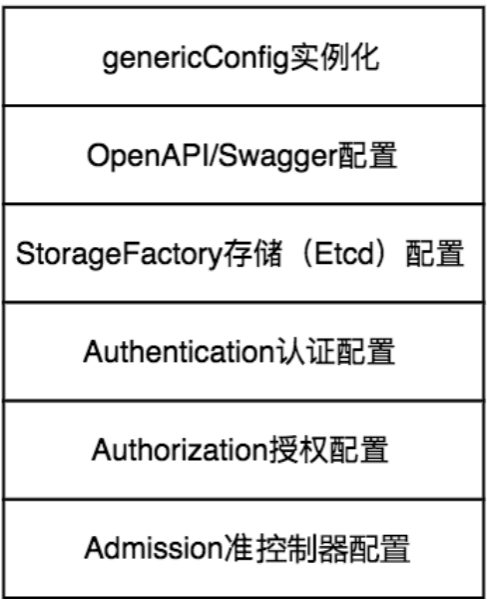
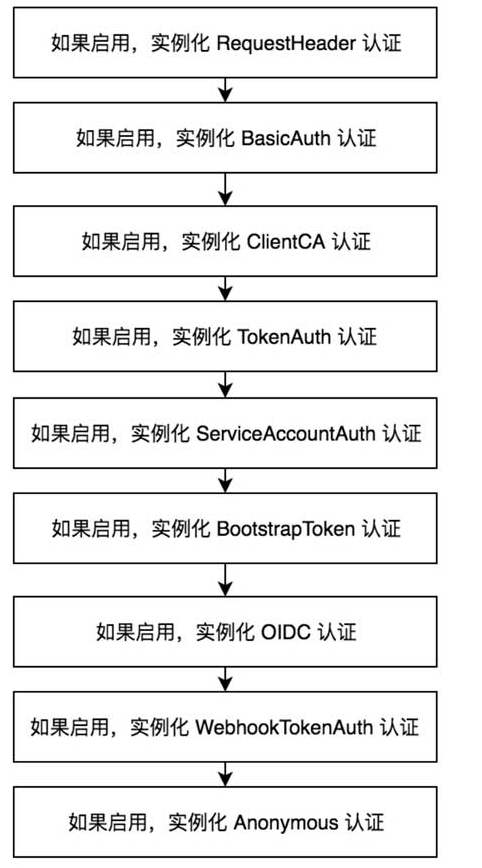
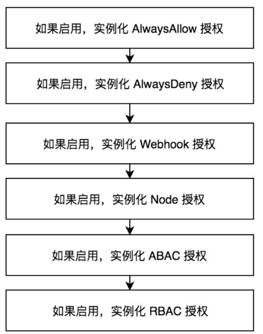

Table of Contents
=================

  * [1. kube-apiserver代码逻辑](#1-kube-apiserver代码逻辑)
     * [(1) RunE](#1-rune)
     * [1.1 completedOptions, err := Complete(s)](#11-completedoptions-err--completes)
     * [1.2 validate](#12-validate)
     * [1.3 Run](#13-run)
        * [1.3.1 CreateServerChain](#131-createserverchain)
           * [1.3.1.1 函数输入输出](#1311-函数输入输出)
           * [1.3.1.2 CreateServerChain 主体](#1312-createserverchain-主体)
           * [1.3.1.3  CreateNodeDialer](#1313--createnodedialer)
        * [1.3.2 PrepareRun](#132-preparerun)
        * [1.3.3 Run](#133-run)
           * [1.3.3.1 NonBlockingRun](#1331-nonblockingrun)
     * [(2) 总结](#2-总结)
  * [2. 创建APIServer通用配置](#2-创建apiserver通用配置)
     * [2.1  genericConfig实例化](#21--genericconfig实例化)
     * [2.2 OpenAPI/Swagger配置](#22-openapiswagger配置)
     * [2.3 StorageFactory存储（Etcd）配置](#23-storagefactory存储etcd配置)
     * [2.4 Authentication认证配置](#24-authentication认证配置)
     * [2.5 Authorization授权配置](#25-authorization授权配置)
     * [2.6 Admission准入控制器配置](#26-admission准入控制器配置)

**本章重点：**

（1）kube-apiserver启动过程中，第三个步骤：资源注册和命令行解析。然后定义通用配置。配置如下：



### 1. kube-apiserver代码逻辑

接上文分析，这里直接从RunE函数开始分析。这部分主要从代码角度，进行 kube-apiserver的 9个流程分析

（1）资源注册。

（2）Cobra命令行参数解析。

（3）创建APIServer通用配置。

（4）创建APIExtensionsServer。

（5）创建KubeAPIServer。

（6）创建AggregatorServer。

（7）创建GenericAPIServer。

（8）启动HTTP服务。

（9）启动HTTPS服务。

#### (1) RunE

这个是NewAPIServerCommand中定义的RunE函数。

```
RunE: func(cmd *cobra.Command, args []string) error {
			// 1. 如果监测到输入了 --version，就打印当前的k8s版本信息，然后退出。
			verflag.PrintAndExitIfRequested()
			
			// 2. 打印flags
			utilflag.PrintFlags(cmd.Flags())
			
			// 3. 补全 s的配置，这里是补充默认的配置。（s := options.NewServerRunOptions()），详见1.1
			// set default options
			completedOptions, err := Complete(s)
			if err != nil {
				return err
			}
			
			// 4. 分组件validate，主要验证每个组件是否缺失一些重要的参数。以及参数是否符合规范等。详见1.2
			// validate options
			if errs := completedOptions.Validate(); len(errs) != 0 {
				return utilerrors.NewAggregate(errs)
			}
            
            // 5. 这里已经获得了所有的配置，并且通过验证，然后真正可以运行 api-server函数。  详见1.3
			return Run(completedOptions, stopCh)
		},
```

<br>

#### 1.1 completedOptions, err := Complete(s)

completedOptions 和 s 都是ServerRunOptions。 complete主要是通过默认的配置补全 s。同时还有一些实现一些限制，比如Etcd.StorageConfig.DeserializationCacheSize>=1000。如果用户设置了小于1000的值，这里会自动改为1000。

```
if s.Etcd.StorageConfig.DeserializationCacheSize < 1000 {
			s.Etcd.StorageConfig.DeserializationCacheSize = 1000
		}
```

<br>

#### 1.2 validate

分组件validate，主要验证每个组件是否缺失一些重要的参数。以及参数是否符合规范等。

```
// Validate checks ServerRunOptions and return a slice of found errors.
func (s *ServerRunOptions) Validate() []error {
	var errors []error
	if errs := s.Etcd.Validate(); len(errs) > 0 {
		errors = append(errors, errs...)
	}
	if errs := validateClusterIPFlags(s); len(errs) > 0 {
		errors = append(errors, errs...)
	}
	if errs := validateServiceNodePort(s); len(errs) > 0 {
		errors = append(errors, errs...)
	}
	if errs := s.SecureServing.Validate(); len(errs) > 0 {
		errors = append(errors, errs...)
	}
	if errs := s.Authentication.Validate(); len(errs) > 0 {
		errors = append(errors, errs...)
	}
	if errs := s.Authorization.Validate(); len(errs) > 0 {
		errors = append(errors, errs...)
	}
	if errs := s.Audit.Validate(); len(errs) > 0 {
		errors = append(errors, errs...)
	}
	if errs := s.Admission.Validate(); len(errs) > 0 {
		errors = append(errors, errs...)
	}
	if errs := s.InsecureServing.Validate(); len(errs) > 0 {
		errors = append(errors, errs...)
	}
	if s.MasterCount <= 0 {
		errors = append(errors, fmt.Errorf("--apiserver-count should be a positive number, but value '%d' provided", s.MasterCount))
	}
	if errs := s.APIEnablement.Validate(legacyscheme.Scheme, apiextensionsapiserver.Scheme, aggregatorscheme.Scheme); len(errs) > 0 {
		errors = append(errors, errs...)
	}

	return errors
}
```

<br>

#### 1.3 Run

这里可以分为三个部分：

（1）CreateServerChain

（2）PrepareRun

（3）Run  ()

```
// Run runs the specified APIServer.  This should never exit.
func Run(completeOptions completedServerRunOptions, stopCh <-chan struct{}) error {
   // To help debugging, immediately log version
   glog.Infof("Version: %+v", version.Get())

   server, err := CreateServerChain(completeOptions, stopCh)
   if err != nil {
      return err
   }

   return server.PrepareRun().Run(stopCh)
}
```

<br>

##### 1.3.1 CreateServerChain

###### 1.3.1.1 函数输入输出

**输入：**   completedOptions 完整的配置；  stopCh，退出信号，`stopCh` 最初是 `NewAPIServerCommand()` 中创建的：

```
stopCh := server.SetupSignalHandler()
```

很容易看出来这个 channel 跟系统信号量绑定了，即 `Ctrl+c` 或 `kill` 通知程序关闭的时候会 close 这个 channel ，然后调用 `<-stopCh` 的地方就会停止阻塞，做关闭程序需要的一些清理操作实现优雅关闭

```
// SetupSignalHandler registered for SIGTERM and SIGINT. A stop channel is returned
// which is closed on one of these signals. If a second signal is caught, the program
// is terminated with exit code 1.
func SetupSignalHandler() (stopCh <-chan struct{}) {
	close(onlyOneSignalHandler) // panics when called twice

	stop := make(chan struct{})
	c := make(chan os.Signal, 2)
	signal.Notify(c, shutdownSignals...)
	go func() {
		<-c
		close(stop)
		<-c
		os.Exit(1) // second signal. Exit directly.
	}()

	return stop
}
```

<br>

**输出：**GenericAPIServer

```
// GenericAPIServer contains state for a Kubernetes cluster api server.
type GenericAPIServer struct {
	// discoveryAddresses is used to build cluster IPs for discovery.
	discoveryAddresses discovery.Addresses

	// LoopbackClientConfig is a config for a privileged loopback connection to the API server
	LoopbackClientConfig *restclient.Config

	// minRequestTimeout is how short the request timeout can be.  This is used to build the RESTHandler
	minRequestTimeout time.Duration

	// ShutdownTimeout is the timeout used for server shutdown. This specifies the timeout before server
	// gracefully shutdown returns.
	ShutdownTimeout time.Duration

	// legacyAPIGroupPrefixes is used to set up URL parsing for authorization and for validating requests
	// to InstallLegacyAPIGroup
	legacyAPIGroupPrefixes sets.String

	// admissionControl is used to build the RESTStorage that backs an API Group.
	admissionControl admission.Interface

	// SecureServingInfo holds configuration of the TLS server.
	SecureServingInfo *SecureServingInfo

	// ExternalAddress is the address (hostname or IP and port) that should be used in
	// external (public internet) URLs for this GenericAPIServer.
	ExternalAddress string

	// Serializer controls how common API objects not in a group/version prefix are serialized for this server.
	// Individual APIGroups may define their own serializers.
	Serializer runtime.NegotiatedSerializer

	// "Outputs"
	// Handler holds the handlers being used by this API server
	Handler *APIServerHandler

	// listedPathProvider is a lister which provides the set of paths to show at /
	listedPathProvider routes.ListedPathProvider

	// DiscoveryGroupManager serves /apis
	DiscoveryGroupManager discovery.GroupManager

	// Enable swagger and/or OpenAPI if these configs are non-nil.
	swaggerConfig *swagger.Config
	openAPIConfig *openapicommon.Config

	// PostStartHooks are each called after the server has started listening, in a separate go func for each
	// with no guarantee of ordering between them.  The map key is a name used for error reporting.
	// It may kill the process with a panic if it wishes to by returning an error.
	postStartHookLock      sync.Mutex
	postStartHooks         map[string]postStartHookEntry
	postStartHooksCalled   bool
	disabledPostStartHooks sets.String

	preShutdownHookLock    sync.Mutex
	preShutdownHooks       map[string]preShutdownHookEntry
	preShutdownHooksCalled bool

	// healthz checks
	healthzLock    sync.Mutex
	healthzChecks  []healthz.HealthzChecker
	healthzCreated bool

	// auditing. The backend is started after the server starts listening.
	AuditBackend audit.Backend

	// Authorizer determines whether a user is allowed to make a certain request. The Handler does a preliminary
	// authorization check using the request URI but it may be necessary to make additional checks, such as in
	// the create-on-update case
	Authorizer authorizer.Authorizer

	// enableAPIResponseCompression indicates whether API Responses should support compression
	// if the client requests it via Accept-Encoding
	enableAPIResponseCompression bool

	// delegationTarget is the next delegate in the chain. This is never nil.
	delegationTarget DelegationTarget

	// HandlerChainWaitGroup allows you to wait for all chain handlers finish after the server shutdown.
	HandlerChainWaitGroup *utilwaitgroup.SafeWaitGroup
}
```

<br>

###### 1.3.1.2 CreateServerChain 主体

```go
// CreateServerChain creates the apiservers connected via delegation.
func CreateServerChain(completedOptions completedServerRunOptions, stopCh <-chan struct{}) (*genericapiserver.GenericAPIServer, error) {
    
    // 1.创建到节点拨号连接,目的为了和节点交互。在云平台中，则需要安装本机的SSH Key到Kubernetes集群中所有节点上，可通过用户名和私钥，SSH到node节点
	nodeTunneler, proxyTransport, err := CreateNodeDialer(completedOptions)
	if err != nil {
		return nil, err
	}

    // 2. 配置API Server的Config。
	kubeAPIServerConfig, insecureServingInfo, serviceResolver, pluginInitializer, admissionPostStartHook, err := CreateKubeAPIServerConfig(completedOptions, nodeTunneler, proxyTransport)
	if err != nil {
		return nil, err
	}

    // 3.这里同时还配置了Extension API Server的Config，用于配置用户自己编写的API Server。
	// If additional API servers are added, they should be gated.
	apiExtensionsConfig, err := createAPIExtensionsConfig(*kubeAPIServerConfig.GenericConfig, kubeAPIServerConfig.ExtraConfig.VersionedInformers, pluginInitializer, completedOptions.ServerRunOptions, completedOptions.MasterCount)
	if err != nil {
		return nil, err
	}
	// 4.创建APIExtensionsServer
	apiExtensionsServer, err := createAPIExtensionsServer(apiExtensionsConfig, genericapiserver.NewEmptyDelegate())
	if err != nil {
		return nil, err
	}
    
    // 5.创建kubeapiserver，这里就是定义了 /apis/groups等这些api。
	kubeAPIServer, err := CreateKubeAPIServer(kubeAPIServerConfig, apiExtensionsServer.GenericAPIServer, admissionPostStartHook)
	if err != nil {
		return nil, err
	}

	// otherwise go down the normal path of standing the aggregator up in front of the API server
	// this wires up openapi
	
	// 6. kubeAPIServer prepareRun
	kubeAPIServer.GenericAPIServer.PrepareRun()

    // 7. apiExtensionsServer prepareRun
	// This will wire up openapi for extension api server
	apiExtensionsServer.GenericAPIServer.PrepareRun()

    // 8. 配置AA config，然后创建AA server。
	// aggregator comes last in the chain
	aggregatorConfig, err := createAggregatorConfig(*kubeAPIServerConfig.GenericConfig, completedOptions.ServerRunOptions, kubeAPIServerConfig.ExtraConfig.VersionedInformers, serviceResolver, proxyTransport, pluginInitializer)
	if err != nil {
		return nil, err
	}
	
	// 9.创建AA server.这里传入了参数 kube-apiserver, apiExtensionServer。
	aggregatorServer, err := createAggregatorServer(aggregatorConfig, kubeAPIServer.GenericAPIServer, apiExtensionsServer.Informers)
	if err != nil {
		// we don't need special handling for innerStopCh because the aggregator server doesn't create any go routines
		return nil, err
	}

	if insecureServingInfo != nil {
		insecureHandlerChain := kubeserver.BuildInsecureHandlerChain(aggregatorServer.GenericAPIServer.UnprotectedHandler(), kubeAPIServerConfig.GenericConfig)
		if err := insecureServingInfo.Serve(insecureHandlerChain, kubeAPIServerConfig.GenericConfig.RequestTimeout, stopCh); err != nil {
			return nil, err
		}
	}

	return aggregatorServer.GenericAPIServer, nil
}
```

createServerChain的主要功能就是定义  各种URI（路径）。这里使用了委托模式，就是先定义 apiExtensionServer, kube-apiserver，但是最后定义AA 。最后返回AA server，并且执行后面的run函数。通过委托模式，就可以执行AA的run，但是 apiExtensionServer, kube-apiserver对应的 rest服务都起来了。

委托模式是软件设计模式中的一项基本技巧。在委托模式中，有两个对象参与处理同一个请求，接受请求的对象将请求委托给另一个对象来处理。委托模式是一项基本技巧，许多其他的模式，如状态模式、策略模式、访问者模式本质上是在更特殊的场合采用了委托模式。委托模式使得我们可以用聚合来替代继承，它还使我们可以模拟mixin。

委托模式参考：https://www.runoob.com/w3cnote/delegate-mode.html

<br>

###### 1.3.1.3  CreateNodeDialer

函数定义如下：

```
func CreateNodeDialer(s completedServerRunOptions) (tunneler.Tunneler, *http.Transport, error) {
```

这里关注 **tunneler** 和 **transport**。

**tunneler** 的最终定义如下，在 pkg\master\tunneler\ssh.go。

从该文件其他函数也可以看出来，这个作用就是 通过私钥公钥等信息，和node节点建立了一个通道。

```
type SSHTunneler struct {
	// Important: Since these two int64 fields are using sync/atomic, they have to be at the top of the struct due to a bug on 32-bit platforms
	// See: https://golang.org/pkg/sync/atomic/ for more information
	lastSync       int64 // Seconds since Epoch
	lastSSHKeySync int64 // Seconds since Epoch

	SSHUser        string
	SSHKeyfile     string
	InstallSSHKey  InstallSSHKey
	HealthCheckURL *url.URL

	tunnels        *ssh.SSHTunnelList
	lastSyncMetric prometheus.GaugeFunc
	clock          clock.Clock

	getAddresses AddressFunc
	stopChan     chan struct{}
}


// Run establishes tunnel loops and returns
func (c *SSHTunneler) Run(getAddresses AddressFunc) {
	if c.stopChan != nil {
		return
	}
	c.stopChan = make(chan struct{})

	// Save the address getter
	if getAddresses != nil {
		c.getAddresses = getAddresses
	}

	// Usernames are capped @ 32
	if len(c.SSHUser) > 32 {
		glog.Warning("SSH User is too long, truncating to 32 chars")
		c.SSHUser = c.SSHUser[0:32]
	}
	glog.Infof("Setting up proxy: %s %s", c.SSHUser, c.SSHKeyfile)

	// public keyfile is written last, so check for that.
	publicKeyFile := c.SSHKeyfile + ".pub"
	exists, err := utilfile.FileExists(publicKeyFile)
	if err != nil {
		glog.Errorf("Error detecting if key exists: %v", err)
	} else if !exists {
		glog.Infof("Key doesn't exist, attempting to create")
		if err := generateSSHKey(c.SSHKeyfile, publicKeyFile); err != nil {
			glog.Errorf("Failed to create key pair: %v", err)
		}
	}

	c.tunnels = ssh.NewSSHTunnelList(c.SSHUser, c.SSHKeyfile, c.HealthCheckURL, c.stopChan)
	// Sync loop to ensure that the SSH key has been installed.
	c.lastSSHKeySync = c.clock.Now().Unix()
	c.installSSHKeySyncLoop(c.SSHUser, publicKeyFile)
	// Sync tunnelList w/ nodes.
	c.lastSync = c.clock.Now().Unix()
	c.nodesSyncLoop()
}
```

<br>

**transport** 看起来就是调用 **tunneler** 的，进行交互，然后进行解析啥的。这里不是很清楚，不过整体而言知道，CreateServerChain就是 和node节点建立交互就行了。

<br>

##### 1.3.2 PrepareRun

定义一些  服务器端的接口，和处理函数。从名字也可以看出来就是补全一下接口用的。

```go
// PrepareRun does post API installation setup steps.
func (s *GenericAPIServer) PrepareRun() preparedGenericAPIServer {
	if s.swaggerConfig != nil {
		routes.Swagger{Config: s.swaggerConfig}.Install(s.Handler.GoRestfulContainer)
	}
	
	// 1.安装OpenAPI,就是定义openapi接口
	if s.openAPIConfig != nil {
		routes.OpenAPI{
			Config: s.openAPIConfig,
		}.Install(s.Handler.GoRestfulContainer, s.Handler.NonGoRestfulMux)
	}
    
    // 2. 安装 Healthz接口,就是定义heal接口
	s.installHealthz()


	// Register audit backend preShutdownHook.
	if s.AuditBackend != nil {
		s.AddPreShutdownHook("audit-backend", func() error {
			s.AuditBackend.Shutdown()
			return nil
		})
	}

	return preparedGenericAPIServer{s}
}
```

<br>

openAPIConfig.Install函数如下：

```go
// Install adds the SwaggerUI webservice to the given mux.
func (oa OpenAPI) Install(c *restful.Container, mux *mux.PathRecorderMux) {
	// NOTE: [DEPRECATION] We will announce deprecation for format-separated endpoints for OpenAPI spec,
	// and switch to a single /openapi/v2 endpoint in Kubernetes 1.10. The design doc and deprecation process
	// are tracked at: https://docs.google.com/document/d/19lEqE9lc4yHJ3WJAJxS_G7TcORIJXGHyq3wpwcH28nU.
	_, err := handler.BuildAndRegisterOpenAPIService("/swagger.json", c.RegisteredWebServices(), oa.Config, mux)
	if err != nil {
		glog.Fatalf("Failed to register open api spec for root: %v", err)
	}
	_, err = handler.BuildAndRegisterOpenAPIVersionedService("/openapi/v2", c.RegisteredWebServices(), oa.Config, mux)
	if err != nil {
		glog.Fatalf("Failed to register versioned open api spec for root: %v", err)
	}
}
```

installHealthz()最终会调用InstallHandler函数。可以看出来，这里就是 定义一个 uri和处理函数。

```go
// InstallHandler registers handlers for health checking on the path
// "/healthz" to mux. *All handlers* for mux must be specified in
// exactly one call to InstallHandler. Calling InstallHandler more
// than once for the same mux will result in a panic.
func InstallHandler(mux mux, checks ...HealthzChecker) {
	InstallPathHandler(mux, "/healthz", checks...)
}
```

<br>

##### 1.3.3 Run

这里看起来和1.3.1有关联。先分析1.3.1。

```go
// Run spawns the secure http server. It only returns if stopCh is closed
// or the secure port cannot be listened on initially.
func (s preparedGenericAPIServer) Run(stopCh <-chan struct{}) error {
	err := s.NonBlockingRun(stopCh)
	if err != nil {
		return err
	}

	<-stopCh

	err = s.RunPreShutdownHooks()
	if err != nil {
		return err
	}

	// Wait for all requests to finish, which are bounded by the RequestTimeout variable.
	s.HandlerChainWaitGroup.Wait()

	return nil
}
```

<br>

###### 1.3.3.1 NonBlockingRun

`s.NonBlockingRun` 的主要逻辑为：

- 1、判断是否要启动审计日志服务；
- 2、调用 `s.SecureServingInfo.Serve` 配置并启动 https server；
- 3、执行 postStartHooks；
- 4、向 systemd 发送 ready 信号；

```go
// NonBlockingRun spawns the secure http server. An error is
// returned if the secure port cannot be listened on.
func (s preparedGenericAPIServer) NonBlockingRun(stopCh <-chan struct{}) error {
	// Use an stop channel to allow graceful shutdown without dropping audit events
	// after http server shutdown.
	auditStopCh := make(chan struct{})
    
    // 1、判断是否要启动审计日志
	// Start the audit backend before any request comes in. This means we must call Backend.Run
	// before http server start serving. Otherwise the Backend.ProcessEvents call might block.
	if s.AuditBackend != nil {
		if err := s.AuditBackend.Run(auditStopCh); err != nil {
			return fmt.Errorf("failed to run the audit backend: %v", err)
		}
	}

	// Use an internal stop channel to allow cleanup of the listeners on error.
	internalStopCh := make(chan struct{})

    // 2、启动 https server
	if s.SecureServingInfo != nil && s.Handler != nil {
		if err := s.SecureServingInfo.Serve(s.Handler, s.ShutdownTimeout, internalStopCh); err != nil {
			close(internalStopCh)
			return err
		}
	}

	// Now that listener have bound successfully, it is the
	// responsibility of the caller to close the provided channel to
	// ensure cleanup.
	go func() {
		<-stopCh
		close(internalStopCh)
		s.HandlerChainWaitGroup.Wait()
		close(auditStopCh)
	}()
   
    // 3、执行 postStartHooks；
	s.RunPostStartHooks(stopCh)
    
    // 4、向 systemd 发送 ready 信号
	if _, err := systemd.SdNotify(true, "READY=1\n"); err != nil {
		glog.Errorf("Unable to send systemd daemon successful start message: %v\n", err)
	}

	return nil
}
```

其中 第二步 Server最终会调用到启动 https服务。

<br>

#### (2) 总结

从代码结流程看，在命令行初始化之后。主要运行了  CreateServerChain这个关键函数。这个就是定义了链条，可以认为是定义了   url 和 处理函数。

然后 PrePareRun, Run都是运行服务。

<br>

### 2. 创建APIServer通用配置

APIServer通用配置是kube-apiserver不同模块实例化所需的配置，APIServer通用配置流程如下图所示。


这里再回到CreateServerChain。CreateServerChain函数中先定定义了通用配置，再启动各个apiserver.

```go
// CreateServerChain creates the apiservers connected via delegation.
func CreateServerChain(completedOptions completedServerRunOptions, stopCh <-chan struct{}) (*genericapiserver.GenericAPIServer, error) {
	nodeTunneler, proxyTransport, err := CreateNodeDialer(completedOptions)
	if err != nil {
		return nil, err
	}

	kubeAPIServerConfig, insecureServingInfo, serviceResolver, pluginInitializer, admissionPostStartHook, err := CreateKubeAPIServerConfig(completedOptions, nodeTunneler, proxyTransport)
	if err != nil {
		return nil, err
	}
  ....
 }
 
 
 
 // CreateKubeAPIServerConfig creates all the resources for running the API server, but runs none of them
func CreateKubeAPIServerConfig(
	s completedServerRunOptions,
	nodeTunneler tunneler.Tunneler,
	proxyTransport *http.Transport,
) (
	config *master.Config,
	insecureServingInfo *genericapiserver.DeprecatedInsecureServingInfo,
	serviceResolver aggregatorapiserver.ServiceResolver,
	pluginInitializers []admission.PluginInitializer,
	admissionPostStartHook genericapiserver.PostStartHookFunc,
	lastErr error,
) {
	var genericConfig *genericapiserver.Config
	var storageFactory *serverstorage.DefaultStorageFactory
	var sharedInformers informers.SharedInformerFactory
	var versionedInformers clientgoinformers.SharedInformerFactory
	genericConfig, sharedInformers, versionedInformers, insecureServingInfo, serviceResolver, pluginInitializers, admissionPostStartHook, storageFactory, lastErr = buildGenericConfig(s.ServerRunOptions, proxyTransport)
	if lastErr != nil {
		return
	}
}

// 最终是 buildGenericConfig 生成了这些配置
// BuildGenericConfig takes the master server options and produces the genericapiserver.Config associated with it
func buildGenericConfig(
	s *options.ServerRunOptions,
	proxyTransport *http.Transport,
) (
	genericConfig *genericapiserver.Config,
	sharedInformers informers.SharedInformerFactory,
	versionedInformers clientgoinformers.SharedInformerFactory,
	insecureServingInfo *genericapiserver.DeprecatedInsecureServingInfo,
	serviceResolver aggregatorapiserver.ServiceResolver,
	pluginInitializers []admission.PluginInitializer,
	admissionPostStartHook genericapiserver.PostStartHookFunc,
	storageFactory *serverstorage.DefaultStorageFactory,
	lastErr error,
) {
   
    // 1. 生成 genericConfig,  用于决定k8s开启哪些资源
	genericConfig = genericapiserver.NewConfig(legacyscheme.Codecs)
	genericConfig.MergedResourceConfig = master.DefaultAPIResourceConfigSource()

    // 2. 生成 OpenAPIConfig/swaggerConfig    swaggerapi 展示
	genericConfig.OpenAPIConfig = genericapiserver.DefaultOpenAPIConfig(generatedopenapi.GetOpenAPIDefinitions, openapinamer.NewDefinitionNamer(legacyscheme.Scheme, extensionsapiserver.Scheme, aggregatorscheme.Scheme))
	genericConfig.OpenAPIConfig.PostProcessSpec = postProcessOpenAPISpecForBackwardCompatibility
	genericConfig.OpenAPIConfig.Info.Title = "Kubernetes"
	genericConfig.SwaggerConfig = genericapiserver.DefaultSwaggerConfig()
	
	// 3. StorageFactory存储（Etcd）配置
	storageFactoryConfig := kubeapiserver.NewStorageFactoryConfig()
	storageFactoryConfig.ApiResourceConfig = genericConfig.MergedResourceConfig
	completedStorageFactoryConfig, err := storageFactoryConfig.Complete(s.Etcd, s.StorageSerialization)
	if err != nil {
		lastErr = err
		return
	}
	storageFactory, lastErr = completedStorageFactoryConfig.New()

    // 4. auth认证
	genericConfig.Authentication.Authenticator, genericConfig.OpenAPIConfig.SecurityDefinitions, err = BuildAuthenticator(s, clientgoExternalClient, sharedInformers)
	if err != nil {
		lastErr = fmt.Errorf("invalid authentication config: %v", err)
		return
	}
   
    // 5. auth授权
	genericConfig.Authorization.Authorizer, genericConfig.RuleResolver, err = BuildAuthorizer(s, versionedInformers)
	
	
   // 6. admission准入控制配置
    pluginInitializers, admissionPostStartHook, err = BuildAdmissionPluginInitializers(
		s,
		client,
		sharedInformers,
		serviceResolver,
		webhookAuthResolverWrapper,
	)
	if err != nil {
		lastErr = fmt.Errorf("failed to create admission plugin initializer: %v", err)
		return
	}

	err = s.Admission.ApplyTo(
		genericConfig,
		versionedInformers,
		kubeClientConfig,
		legacyscheme.Scheme,
		pluginInitializers...)

	
	return
}
```

#### 2.1  genericConfig实例化

CreateServerChain  -> CreateKubeAPIServerConfig -> buildGenericConfig

genericConfig.MergedResourceConfig用于设置启用/禁用GV（资源组、资源版本）及其Resource （资源）。如果未在命令行参数中指定启用/禁用的GV，则通过master.DefaultAPIResourceConfigSource启用默认设置的GV及其资源。master.DefaultAPIResourceConfigSource将启用资源版本为Stable和Beta的资源，默认不启用Alpha资源版本的资源。通过EnableVersions函数启用指定资源，而通过DisableVersions函数禁用指定资源，代码示例如下：

```go
// 1. 生成 genericConfig,  用于决定k8s开启哪些资源
	genericConfig = genericapiserver.NewConfig(legacyscheme.Codecs)
	genericConfig.MergedResourceConfig = master.DefaultAPIResourceConfigSource()


pkg\master\master.go
func DefaultAPIResourceConfigSource() *serverstorage.ResourceConfig {
	ret := serverstorage.NewResourceConfig()
	// NOTE: GroupVersions listed here will be enabled by default. Don't put alpha versions in the list.
	ret.EnableVersions(
		admissionregistrationv1beta1.SchemeGroupVersion,
		apiv1.SchemeGroupVersion,
		appsv1beta1.SchemeGroupVersion,
		appsv1beta2.SchemeGroupVersion,
		appsv1.SchemeGroupVersion,
		authenticationv1.SchemeGroupVersion,
		authenticationv1beta1.SchemeGroupVersion,
		authorizationapiv1.SchemeGroupVersion,
		authorizationapiv1beta1.SchemeGroupVersion,
		autoscalingapiv1.SchemeGroupVersion,
		autoscalingapiv2beta1.SchemeGroupVersion,
		autoscalingapiv2beta2.SchemeGroupVersion,
		batchapiv1.SchemeGroupVersion,
		batchapiv1beta1.SchemeGroupVersion,
		certificatesapiv1beta1.SchemeGroupVersion,
		coordinationapiv1beta1.SchemeGroupVersion,
		eventsv1beta1.SchemeGroupVersion,
		extensionsapiv1beta1.SchemeGroupVersion,
		networkingapiv1.SchemeGroupVersion,
		policyapiv1beta1.SchemeGroupVersion,
		rbacv1.SchemeGroupVersion,
		rbacv1beta1.SchemeGroupVersion,
		storageapiv1.SchemeGroupVersion,
		storageapiv1beta1.SchemeGroupVersion,
		schedulingapiv1beta1.SchemeGroupVersion,
	)
	// disable alpha versions explicitly so we have a full list of what's possible to serve
	ret.DisableVersions(
		admissionregistrationv1alpha1.SchemeGroupVersion,
		batchapiv2alpha1.SchemeGroupVersion,
		rbacv1alpha1.SchemeGroupVersion,
		schedulingv1alpha1.SchemeGroupVersion,
		settingsv1alpha1.SchemeGroupVersion,
		storageapiv1alpha1.SchemeGroupVersion,
	)

	return ret
}
```

<br>

#### 2.2 OpenAPI/Swagger配置

```go
// 2. 生成 OpenAPIConfig/swaggerConfig    swaggerapi 展示
	genericConfig.OpenAPIConfig = genericapiserver.DefaultOpenAPIConfig(generatedopenapi.GetOpenAPIDefinitions, openapinamer.NewDefinitionNamer(legacyscheme.Scheme, extensionsapiserver.Scheme, aggregatorscheme.Scheme))
	genericConfig.OpenAPIConfig.PostProcessSpec = postProcessOpenAPISpecForBackwardCompatibility
	genericConfig.OpenAPIConfig.Info.Title = "Kubernetes"
	genericConfig.SwaggerConfig = genericapiserver.DefaultSwaggerConfig()
```

genericConfig.OpenAPIConfig用于生成OpenAPI规范。在默认的情况下，通过DefaultOpenAPIConfig函数为其设置默认值，代码示例如下：

```go
func DefaultOpenAPIConfig(getDefinitions openapicommon.GetOpenAPIDefinitions, defNamer *apiopenapi.DefinitionNamer) *openapicommon.Config {
	return &openapicommon.Config{
		ProtocolList:   []string{"https"},
		IgnorePrefixes: []string{"/swaggerapi"},
		Info: &spec.Info{
			InfoProps: spec.InfoProps{
				Title: "Generic API Server",
			},
		},
		DefaultResponse: &spec.Response{
			ResponseProps: spec.ResponseProps{
				Description: "Default Response.",
			},
		},
		GetOperationIDAndTags: apiopenapi.GetOperationIDAndTags,
		GetDefinitionName:     defNamer.GetDefinitionName,
		GetDefinitions:        getDefinitions,
	}
}
```

其中 generatedopenapi.GetOpenAPIDefinitions 定义了OpenAPIDefinition文件（OpenAPI定义文件），该文件由openapi-gen代码生成器自动生成。

<br>

#### 2.3 StorageFactory存储（Etcd）配置

kube-apiserver组件使用Etcd作为Kubernetes系统集群的存储，系统中所有资源信息、集群状态、配置信息等都存储于Etcd中，代码示例如下：

```go
// 3. StorageFactory存储（Etcd）配置
	storageFactoryConfig := kubeapiserver.NewStorageFactoryConfig()
	storageFactoryConfig.ApiResourceConfig = genericConfig.MergedResourceConfig
	completedStorageFactoryConfig, err := storageFactoryConfig.Complete(s.Etcd, s.StorageSerialization)
	if err != nil {
		lastErr = err
		return
	}
	storageFactory, lastErr = completedStorageFactoryConfig.New()
```

kubeapiserver.NewStorageFactoryConfig函数实例化了storageFactoryConfig对象，该对象定义了kube-apiserver与Etcd的交互方式，例如Etcd认证、Etcd地址、存储前缀等。另外，该对象也定义了资源存储方式，例如资源信息、资源编码类型、资源状态等。

<br>

#### 2.4 Authentication认证配置

kube-apiserver作为Kubernetes集群的请求入口，接收组件与客户端的访问请求，每个请求都需要经过认证（Authentication）、授权（Authorization）及准入控制器（Admission Controller）3个阶段，之后才能真正地操作资源。

kube-apiserver目前提供了9种认证机制，分别是BasicAuth、ClientCA、TokenAuth、BootstrapToken、RequestHeader、WebhookTokenAuth、Anonymous、OIDC、ServiceAccountAuth。每一种认证机制被实例化后会成为认证器（Authenticator），每一个认证器都被封装在http.Handler请求处理函数中，它们接收组件或客户端的请求并认证请求。kube-apiserver通过BuildAuthenticator函数实例化认证器，代码示例如下：

```go
    // 4. auth认证
	genericConfig.Authentication.Authenticator, genericConfig.OpenAPIConfig.SecurityDefinitions, err = BuildAuthenticator(s, clientgoExternalClient, sharedInformers)
	if err != nil {
		lastErr = fmt.Errorf("invalid authentication config: %v", err)
		return
	}


	
    然后调用 ToAuthorizationConfig 方法
	// BuildAuthorizer constructs the authorizer
func BuildAuthorizer(s *options.ServerRunOptions, versionedInformers clientgoinformers.SharedInformerFactory) (authorizer.Authorizer, authorizer.RuleResolver, error) {
	authorizationConfig := s.Authorization.ToAuthorizationConfig(versionedInformers)
	return authorizationConfig.New()
}

func (s *BuiltInAuthorizationOptions) ToAuthorizationConfig(versionedInformerFactory versionedinformers.SharedInformerFactory) authorizer.AuthorizationConfig {
	return authorizer.AuthorizationConfig{
		AuthorizationModes:          s.Modes,
		PolicyFile:                  s.PolicyFile,
		WebhookConfigFile:           s.WebhookConfigFile,
		WebhookCacheAuthorizedTTL:   s.WebhookCacheAuthorizedTTL,
		WebhookCacheUnauthorizedTTL: s.WebhookCacheUnauthorizedTTL,
		VersionedInformerFactory:    versionedInformerFactory,
	}
}

authorizationConfig.New() = union.New(authorizers...), union.NewRuleResolvers(ruleResolvers...)
```

BuildAuthenticator函数会生成认证器。在该函数中，首先生成认证器的配置文件，然后调用authenticatorConfig.New函数实例化认证器。认证实例化流程如下图所示。



<br>

authenticatorConfig.New函数在实例化认证器的过程中，会根据认证的配置信息（由flags命令行参数传入）决定是否启用认证方法，并对启用的认证方法生成对应的HTTP Handler函数，最后通过union函数将已启用的认证器合并到authenticators数组对象中，代码示例如下：

```
authorizationConfig.New() = union.New(authorizers...), union.NewRuleResolvers(ruleResolvers...)
```

```
authenticators中存放的是已启用的认证器列表。union.New函数将authenticators合并成一个authenticator认证器，实际上将认证器列表存放在union结构的Handlers []authenticator.Request对象中。当客户端请求到达kube-apiserver时，kube-apiserver会遍历认证器列表，尝试执行每个认证器，当有一个认证器返回true时，则认证成功。
```

<br>

#### 2.5 Authorization授权配置

认证和授权的区别在于：  张三发来了一个删除pod的请求。 认证：证明张三是张三， 授权：张三是master，有权限删除这个pod。

在Kubernetes系统组件或客户端请求通过认证阶段之后，会来到授权阶段。kube-apiserver同样支持多种授权机制，并支持同时开启多个授权功能，客户端发起一个请求，在经过授权阶段时，只要有一个授权器通过则授权成功。kube-apiserver目前提供了6种授权机制，分别是AlwaysAllow、AlwaysDeny、Webhook、

Node、ABAC、RBAC。每一种授权机制被实例化后会成为授权器（Authorizer），每一个授权器都被封装在http.Handler请求处理函数中，它们接收组件或客户

端的请求并授权请求。kube-apiserver通过BuildAuthorizer函数实例化授权器，代码示例如下：

```
// 5. auth授权
genericConfig.Authorization.Authorizer, genericConfig.RuleResolver, err = BuildAuthorizer(s, versionedInformers)
```

BuildAuthorizer函数会生成授权器。在该函数中，首先生成授权器的配置文件，然后调用authorizationConfig.New函数实例化授权器。授权实例化流程如下图所示。



authorizationConfig.New函数在实例化授权器的过程中，会根据--authorization-mode参数的配置信息（由flags命令行参数传入）决定是否启用授权方法，并对

启用的授权方法生成对应的HTTP Handler函数，最后通过union函数将已启用的授权器合并到authorizers数组对象中，代码示例如下：

```
// BuildAuthorizer constructs the authorizer
func BuildAuthorizer(s *options.ServerRunOptions, versionedInformers clientgoinformers.SharedInformerFactory) (authorizer.Authorizer, authorizer.RuleResolver, error) {
	authorizationConfig := s.Authorization.ToAuthorizationConfig(versionedInformers)
	return authorizationConfig.New()
}

authorizationConfig.New()
return union.New(authorizers...), union.NewRuleResolvers(ruleResolvers...), nil
```

authorizers中存放的是已启用的授权器列表，ruleResolvers中存放的是已启用的授权器规则解析器，实际上分别将它们存放在union结构的

[]authorizer.Authorizer和[]authorizer.RuleResolver对象中。当客户端请求到达kube-apiserver时，kube-apiserver会遍历授权器列表，并按照顺序执行授权

器，排在前面的授权器具有更高的优先级（允许或拒绝请求）。客户端发起一个请求，在经过授权阶段时，只要有一个授权器通过，则授权成功。

<br>

#### 2.6 Admission准入控制器配置

Kubernetes系统组件或客户端请求通过授权阶段之后，会来到准入控制器阶段，它会在认证和授权请求之后，对象被持久化之前，拦截kube-apiserver的请求，

拦截后的请求进入准入控制器中处理，对请求的资源对象进行自定义（校验、修改或拒绝）等操作。kube-apiserver支持多种准入控制器机制，并支持同时开启多

个准入控制器功能，如果开启了多个准入控制器，则按照顺序执行准入控制器。

kube-apiserver目前提供了31种准入控制器，分别是AlwaysAdmit、AlwaysDeny、AlwaysPullImages、DefaultStorageClass、DefaultTolerationSeconds、

DenyEscalatingExec、DenyExecOnPrivileged、EventRateLimit、ExtendedResourceToleration、ImagePolicyWebhook、

LimitPodHardAntiAffinityTopology、LimitRanger、MutatingAdmissionWebhook、NamespaceAutoProvision、NamespaceExists、NamespaceLifecycle、

NodeRestriction、OwnerReferencesPermissionEnforcement、PersistentVolumeClaimResize、Persistent VolumeLabel、PodNodeSelector、PodPreset、

PodSecurityPolicy、PodTolerationRestriction、Priority、ResourceQuota、SecurityContextDeny、ServiceAccount、StorageObjectInUse Protection、

TaintNodesByCondition、ValidatingAdmissionWebhook。

这个启动的代码在这：

```
    pluginInitializers, admissionPostStartHook, err = BuildAdmissionPluginInitializers(
		s,
		client,
		sharedInformers,
		serviceResolver,
		webhookAuthResolverWrapper,
	)
	if err != nil {
		lastErr = fmt.Errorf("failed to create admission plugin initializer: %v", err)
		return
	}

	err = s.Admission.ApplyTo(
		genericConfig,
		versionedInformers,
		kubeClientConfig,
		legacyscheme.Scheme,
		pluginInitializers...)
```

<br>

kube-apiserver在启动时注册所有准入控制器，准入控制器通过Plugins数据结构统一注册、存放、管理所有的准入控制器。Plugins数据结构如下：

```
// Factory is a function that returns an Interface for admission decisions.
// The config parameter provides an io.Reader handler to the factory in
// order to load specific configurations. If no configuration is provided
// the parameter is nil.
type Factory func(config io.Reader) (Interface, error)

type Plugins struct {
	lock     sync.Mutex
	registry map[string]Factory
}
```

Plugins数据结构字段说明如下。

● registry：以键值对形式存放插件，key为准入控制器的名称，例如AlwaysPullImages、LimitRanger等；value为对应的准入控制器名称的代码实现。

● lock：用于保护registry字段的并发一致性。

其中Factory为准入控制器实现的接口定义，它接收准入控制器的config配置信息，通过--admission-control-config-

file参数指定准入控制器的配置文件，返回准入控制器的插件实现。Plugins数据结构提供了Register方法，为外部提供了准入控制器的注册方法。

kube-apiserver提供了31种准入控制器，kube-apiserver组件在启动时分别在两个位置注册它们，代码示例如下：

```
// RegisterAllAdmissionPlugins registers all admission plugins
func RegisterAllAdmissionPlugins(plugins *admission.Plugins) {
	lifecycle.Register(plugins)
	initialization.Register(plugins)
	validatingwebhook.Register(plugins)
	mutatingwebhook.Register(plugins)
}
```

每个准入控制器都实现了Register方法，通过Register方法可以在Plugins数据结构中注册当前准入控制器。以AlwaysPullImages准入控制器为例，注册方法代码示例如下：

```
// PluginName indicates name of admission plugin.
const PluginName = "ImagePolicyWebhook"

// AuditKeyPrefix is used as the prefix for all audit keys handled by this
// pluggin. Some well known suffixes are listed below.
var AuditKeyPrefix = strings.ToLower(PluginName) + ".image-policy.k8s.io/"

const (
	// ImagePolicyFailedOpenKeySuffix in an annotation indicates the image
	// review failed open when the image policy webhook backend connection
	// failed.
	ImagePolicyFailedOpenKeySuffix string = "failed-open"

	// ImagePolicyAuditRequiredKeySuffix in an annotation indicates the pod
	// should be audited.
	ImagePolicyAuditRequiredKeySuffix string = "audit-required"
)

var (
	groupVersions = []schema.GroupVersion{v1alpha1.SchemeGroupVersion}
)

// Register registers a plugin
func Register(plugins *admission.Plugins) {
	plugins.Register(PluginName, func(config io.Reader) (admission.Interface, error) {
		newImagePolicyWebhook, err := NewImagePolicyWebhook(config)
		if err != nil {
			return nil, err
		}
		return newImagePolicyWebhook, nil
	})
}
```

<br>

**参考文档：**  Kubernetes源码剖析，郑东旭
