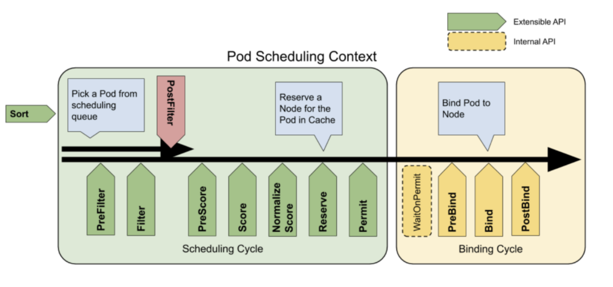

Table of Contents
=================

   * [1. 源码阅读背景](#1-源码阅读背景)
   * [2. Kube-scheduler启动过程-源码分析](#2-kube-scheduler启动过程-源码分析)
      * [2.1 main](#21-main)
      * [2.2 runCommand](#22-runcommand)
         * [2.2.1 ApplyFeatureGates](#221-applyfeaturegates)
         * [2.2 run](#22-run)
            * [2.2.1 scheduler.New](#221-schedulernew)
               * [2.2.2.1 默认配置](#2221-默认配置)
               * [2.2.2.2 schedulerCache](#2222-schedulercache)
               * [2.2.2.3  注册插件，这是NewDefaultRegistry就注册了所有的插件](#2223--注册插件这是newdefaultregistry就注册了所有的插件)
               * [2.2.2.4 实例化Scheduler对象](#2224-实例化scheduler对象)
   * [3 kube-scheduler 调度过程源码分析](#3-kube-scheduler-调度过程源码分析)
      * [3.1 补充知识](#31-补充知识)
      * [3.2 scheduler.Run-开始调度](#32-schedulerrun-开始调度)
      * [3.3 scheduleOne](#33-scheduleone)
      * [3.4 sched.Algorithm.Schedule](#34-schedalgorithmschedule)
      * [3.5 podFitsOnNode](#35-podfitsonnode)
         * [2.5.1 为什么执行2次for循环](#251-为什么执行2次for循环)
         * [2.5.2 预选函数优先级的定义](#252-预选函数优先级的定义)
   * [4.有意思的知识点](#4有意思的知识点)
      * [4.1 这个就是判断是否有实现了接口](#41-这个就是判断是否有实现了接口)


## 1. 源码阅读背景

因工作需要，需要增加额外的scheduler插件，所以正好趁这个机会，对kube-scheduler组件源码进行分析

## 2. Kube-scheduler启动过程-源码分析

### 2.1 main

Main -> runCommand -> Run

```
func main() {
	rand.Seed(time.Now().UnixNano())

	command := app.NewSchedulerCommand()     //没有带任何参数

	// TODO: once we switch everything over to Cobra commands, we can go back to calling
	// utilflag.InitFlags() (by removing its pflag.Parse() call). For now, we have to set the
	// normalize func and add the go flag set by hand.
	pflag.CommandLine.SetNormalizeFunc(cliflag.WordSepNormalizeFunc)
	// utilflag.InitFlags()
	logs.InitLogs()
	defer logs.FlushLogs()

	if err := command.Execute(); err != nil {
		os.Exit(1)
	}
}
```

### 2.2 runCommand

runCommand逻辑如下：

（1）补全config

（2）ApplyFeatureGates根据输入参数，设置Predicates(预选), Priorities（优选）参数

（3）往下执行run函数

```
// runCommand runs the scheduler.
func runCommand(cmd *cobra.Command, args []string, opts *options.Options, registryOptions ...Option) error {
	
	// 1.补全config
	// Get the completed config
	cc := c.Complete()
 
  // 2. ApplyFeatureGates根据输入参数，设置Predicates(预选), Priorities（优选）参数
	// Apply algorithms based on feature gates.
	// TODO: make configurable?
	algorithmprovider.ApplyFeatureGates()

	// Configz registration.
	if cz, err := configz.New("componentconfig"); err == nil {
		cz.Set(cc.ComponentConfig)
	} else {
		return fmt.Errorf("unable to register configz: %s", err)
	}

	ctx, cancel := context.WithCancel(context.Background())
	defer cancel()
  
  // 3. RUN
	return Run(ctx, cc, registryOptions...)
}
```

#### 2.2.1 ApplyFeatureGates

ApplyFeatureGates函数的逻辑就是:

（1）如果开启了 EvenPodsSpread这个FeatureGate (拓扑调度相关), 就会多注册（所有的provider都会注册）EvenPodsSpreadPred这个，和 EvenPodsSpreadPriority这个优选函数
（2）如果开启了ResourceLimitsPriorityFunction这个EvenPodsSpread这个FeatureGate, 就会多注册ResourceLimitsPriority这个优选函数

```
pkg/scheduler/algorithmprovider/plugins.go
// ApplyFeatureGates applies algorithm by feature gates.
func ApplyFeatureGates() func() {
	return defaults.ApplyFeatureGates()
}


// ApplyFeatureGates函数的逻辑就是
// 如果开启了 EvenPodsSpread这个FeatureGate (拓扑调度相关), 就会多注册EvenPodsSpreadPred这个，和 EvenPodsSpreadPriority这个优选函数
// 如果开启了ResourceLimitsPriorityFunction这个EvenPodsSpread这个FeatureGate, 就会多注册ResourceLimitsPriority这个优选函数
pkg/scheduler/algorithmprovider/defaults/defaults.go
func ApplyFeatureGates() (restore func()) {
	snapshot := scheduler.RegisteredPredicatesAndPrioritiesSnapshot()
	
	// Only register EvenPodsSpread predicate & priority if the feature is enabled
	if utilfeature.DefaultFeatureGate.Enabled(features.EvenPodsSpread) {
		klog.Infof("Registering EvenPodsSpread predicate and priority function")
		// register predicate
		scheduler.InsertPredicateKeyToAlgorithmProviderMap(predicates.EvenPodsSpreadPred)
		scheduler.RegisterFitPredicate(predicates.EvenPodsSpreadPred, predicates.EvenPodsSpreadPredicate)
		// register priority
		scheduler.InsertPriorityKeyToAlgorithmProviderMap(priorities.EvenPodsSpreadPriority)
		scheduler.RegisterPriorityMapReduceFunction(
			priorities.EvenPodsSpreadPriority,
			priorities.CalculateEvenPodsSpreadPriorityMap,
			priorities.CalculateEvenPodsSpreadPriorityReduce,
			1,
		)
	}

	// Prioritizes nodes that satisfy pod's resource limits
	if utilfeature.DefaultFeatureGate.Enabled(features.ResourceLimitsPriorityFunction) {
		klog.Infof("Registering resourcelimits priority function")
		scheduler.RegisterPriorityMapReduceFunction(priorities.ResourceLimitsPriority, priorities.ResourceLimitsPriorityMap, nil, 1)
		// Register the priority function to specific provider too.
		scheduler.InsertPriorityKeyToAlgorithmProviderMap(scheduler.RegisterPriorityMapReduceFunction(priorities.ResourceLimitsPriority, priorities.ResourceLimitsPriorityMap, nil, 1))
	}

	restore = func() {
		scheduler.ApplyPredicatesAndPriorities(snapshot)
	}
	return
}


// 每个Provider都注册了
// InsertPredicateKeyToAlgorithmProviderMap insert a fit predicate key to all algorithmProviders which in algorithmProviderMap.
func InsertPredicateKeyToAlgorithmProviderMap(key string) {
	schedulerFactoryMutex.Lock()
	defer schedulerFactoryMutex.Unlock()

	for _, provider := range algorithmProviderMap {
		provider.FitPredicateKeys.Insert(key)
	}
}
```

<br>

ApplyFeatureGates所在的包有一个init函数, 这个注册了默认的优选，预选函数。

会往DefaultProvider, ClusterAutoscalerProvider注册

```
pkg/scheduler/algorithmprovider/defaults/defaults.go

func init() {
	registerAlgorithmProvider(defaultPredicates(), defaultPriorities())
}

const (
	// DefaultProvider defines the default algorithm provider name.
	DefaultProvider = "DefaultProvider"
	
	// ClusterAutoscalerProvider defines the default autoscaler provider
	ClusterAutoscalerProvider = "ClusterAutoscalerProvider"
)


注册就是往默认的DefaultProvider，ClusterAutoscalerProvider注册这些函数
func registerAlgorithmProvider(predSet, priSet sets.String) {
	// Registers algorithm providers. By default we use 'DefaultProvider', but user can specify one to be used
	// by specifying flag.
	scheduler.RegisterAlgorithmProvider(scheduler.DefaultProvider, predSet, priSet)
	// Cluster autoscaler friendly scheduling algorithm.
	scheduler.RegisterAlgorithmProvider(ClusterAutoscalerProvider, predSet,
		copyAndReplace(priSet, priorities.LeastRequestedPriority, priorities.MostRequestedPriority))
}


// RegisterFitPredicateFactory registers a fit predicate factory with the
// algorithm registry. Returns the name with which the predicate was registered.
func RegisterFitPredicateFactory(name string, predicateFactory FitPredicateFactory) string {
	schedulerFactoryMutex.Lock()
	defer schedulerFactoryMutex.Unlock()
	validateAlgorithmNameOrDie(name)
	fitPredicateMap[name] = predicateFactory
	return name
}


// 默认的11个预选函数
func defaultPredicates() sets.String {
	return sets.NewString(
		predicates.NoVolumeZoneConflictPred,
		predicates.MaxEBSVolumeCountPred,
		predicates.MaxGCEPDVolumeCountPred,
		predicates.MaxAzureDiskVolumeCountPred,
		predicates.MaxCSIVolumeCountPred,
		predicates.MatchInterPodAffinityPred,
		predicates.NoDiskConflictPred,
		predicates.GeneralPred,
		predicates.PodToleratesNodeTaintsPred,
		predicates.CheckVolumeBindingPred,
		predicates.CheckNodeUnschedulablePred,
	)
}

// 默认的8个优选函数
func defaultPriorities() sets.String {
	return sets.NewString(
		priorities.SelectorSpreadPriority,
		priorities.InterPodAffinityPriority,
		priorities.LeastRequestedPriority,
		priorities.BalancedResourceAllocation,
		priorities.NodePreferAvoidPodsPriority,
		priorities.NodeAffinityPriority,
		priorities.TaintTolerationPriority,
		priorities.ImageLocalityPriority,
	)
}
```

#### 2.2 run

（1）准备event-client，用于上报event

（2）初始化scheduler. WithName,  With开头的函数就是一个Option,结合WithName来看，这里实际就是将默认的 schedulerName赋值给 cc

（3）start 所有informers

（4）运行所有的sched.Run函数

这里核心分析 初始化scheduler做了什么

```
func Run(ctx context.Context, cc schedulerserverconfig.CompletedConfig, outOfTreeRegistryOptions ...Option) error {
	// To help debugging, immediately log version
	klog.V(1).Infof("Starting Kubernetes Scheduler version %+v", version.Get())
  
  // outOfTreeRegistryOptions参数是看起来是NewSchedulerCommand带过来的，为空的，这个先不管
  // outOfTreeRegistry也是make一个空的map
	outOfTreeRegistry := make(framework.Registry)
	for _, option := range outOfTreeRegistryOptions {
		if err := option(outOfTreeRegistry); err != nil {
			return err
		}
	}
  
  // 1. 准备event-client，用于上报event
  // Prepare event clients.
	if _, err := cc.Client.Discovery().ServerResourcesForGroupVersion(eventsv1beta1.SchemeGroupVersion.String()); err == nil {
		cc.Broadcaster = events.NewBroadcaster(&events.EventSinkImpl{Interface: cc.EventClient.Events("")})
		cc.Recorder = cc.Broadcaster.NewRecorder(scheme.Scheme, cc.ComponentConfig.SchedulerName)
	} else {
		recorder := cc.CoreBroadcaster.NewRecorder(scheme.Scheme, v1.EventSource{Component: cc.ComponentConfig.SchedulerName})
		cc.Recorder = record.NewEventRecorderAdapter(recorder)
	}
	
	
  // 2.初始化scheduler.
  // WithName,With...等等 其实就是一个Option,结合new来看，这里实际就是将默认的 schedulerName赋值给 cc
  
	// Create the scheduler.
	sched, err := scheduler.New(cc.Client,
		cc.InformerFactory,
		cc.PodInformer,
		cc.Recorder,
		ctx.Done(),
		scheduler.WithName(cc.ComponentConfig.SchedulerName),
		scheduler.WithAlgorithmSource(cc.ComponentConfig.AlgorithmSource),
		scheduler.WithHardPodAffinitySymmetricWeight(cc.ComponentConfig.HardPodAffinitySymmetricWeight),
		scheduler.WithPreemptionDisabled(cc.ComponentConfig.DisablePreemption),
		scheduler.WithPercentageOfNodesToScore(cc.ComponentConfig.PercentageOfNodesToScore),
		scheduler.WithBindTimeoutSeconds(cc.ComponentConfig.BindTimeoutSeconds),
		scheduler.WithFrameworkOutOfTreeRegistry(outOfTreeRegistry),
		scheduler.WithFrameworkPlugins(cc.ComponentConfig.Plugins),
		scheduler.WithFrameworkPluginConfig(cc.ComponentConfig.PluginConfig),
		scheduler.WithPodMaxBackoffSeconds(cc.ComponentConfig.PodMaxBackoffSeconds),
		scheduler.WithPodInitialBackoffSeconds(cc.ComponentConfig.PodInitialBackoffSeconds),
	)
	if err != nil {
		return err
	}

	// Prepare the event broadcaster.
	if cc.Broadcaster != nil && cc.EventClient != nil {
		cc.Broadcaster.StartRecordingToSink(ctx.Done())
	}
	if cc.CoreBroadcaster != nil && cc.CoreEventClient != nil {
		cc.CoreBroadcaster.StartRecordingToSink(&corev1.EventSinkImpl{Interface: cc.CoreEventClient.Events("")})
	}
	// Setup healthz checks.
	var checks []healthz.HealthChecker
	if cc.ComponentConfig.LeaderElection.LeaderElect {
		checks = append(checks, cc.LeaderElection.WatchDog)
	}

	// Start up the healthz server.
	if cc.InsecureServing != nil {
		separateMetrics := cc.InsecureMetricsServing != nil
		handler := buildHandlerChain(newHealthzHandler(&cc.ComponentConfig, separateMetrics, checks...), nil, nil)
		if err := cc.InsecureServing.Serve(handler, 0, ctx.Done()); err != nil {
			return fmt.Errorf("failed to start healthz server: %v", err)
		}
	}
	if cc.InsecureMetricsServing != nil {
		handler := buildHandlerChain(newMetricsHandler(&cc.ComponentConfig), nil, nil)
		if err := cc.InsecureMetricsServing.Serve(handler, 0, ctx.Done()); err != nil {
			return fmt.Errorf("failed to start metrics server: %v", err)
		}
	}
	if cc.SecureServing != nil {
		handler := buildHandlerChain(newHealthzHandler(&cc.ComponentConfig, false, checks...), cc.Authentication.Authenticator, cc.Authorization.Authorizer)
		// TODO: handle stoppedCh returned by c.SecureServing.Serve
		if _, err := cc.SecureServing.Serve(handler, 0, ctx.Done()); err != nil {
			// fail early for secure handlers, removing the old error loop from above
			return fmt.Errorf("failed to start secure server: %v", err)
		}
	}
  
  // 3. start 所有informers
	// Start all informers.
	go cc.PodInformer.Informer().Run(ctx.Done())
	cc.InformerFactory.Start(ctx.Done())

	// Wait for all caches to sync before scheduling.
	cc.InformerFactory.WaitForCacheSync(ctx.Done())
  
  
  // 4. 运行所有的sched.Run函数
	// If leader election is enabled, runCommand via LeaderElector until done and exit.
	if cc.LeaderElection != nil {
		cc.LeaderElection.Callbacks = leaderelection.LeaderCallbacks{
			OnStartedLeading: sched.Run,
			OnStoppedLeading: func() {
				klog.Fatalf("leaderelection lost")
			},
		}
		leaderElector, err := leaderelection.NewLeaderElector(*cc.LeaderElection)
		if err != nil {
			return fmt.Errorf("couldn't create leader elector: %v", err)
		}

		leaderElector.Run(ctx)

		return fmt.Errorf("lost lease")
	}

	// Leader election is disabled, so runCommand inline until done.
	sched.Run(ctx)
	return fmt.Errorf("finished without leader elect")
}
```

##### 2.2.1 scheduler.New

（1）创建默认配置，是否开启驱逐等等配置

（2）schedulerCache.new，主要功能就是清理过期的cache

（3）注册插件，这是NewDefaultRegistry就注册了所有的插件

（4）实例化Scheduler对象

```
WithName 其实就是一个Option,结合new来看，这里实际就是将默认的 schedulerName赋值给 cc
// WithName sets schedulerName for Scheduler, the default schedulerName is default-scheduler
func WithName(schedulerName string) Option {
	return func(o *schedulerOptions) {
		o.schedulerName = schedulerName
	}
}

// New returns a Scheduler
func New(client clientset.Interface,
	informerFactory informers.SharedInformerFactory,
	podInformer coreinformers.PodInformer,
	recorder events.EventRecorder,
	stopCh <-chan struct{},
	opts ...Option) (*Scheduler, error) {

	stopEverything := stopCh
	if stopEverything == nil {
		stopEverything = wait.NeverStop
	}
  
  // 2.3.1 创建默认配置
	options := defaultSchedulerOptions
	for _, opt := range opts {
		opt(&options)
	}
  
  // 2.3.2. schedulerCache，主要功能就是清理过期的pod
	schedulerCache := internalcache.New(30*time.Second, stopEverything)
	volumeBinder := volumebinder.NewVolumeBinder(
		client,
		informerFactory.Core().V1().Nodes(),
		informerFactory.Storage().V1().CSINodes(),
		informerFactory.Core().V1().PersistentVolumeClaims(),
		informerFactory.Core().V1().PersistentVolumes(),
		informerFactory.Storage().V1().StorageClasses(),
		time.Duration(options.bindTimeoutSeconds)*time.Second,
	)

  // 2.3.3 注册插件，这是NewDefaultRegistry就注册了所有的插件
  // 默认的scheduler插件是空的，所以会调用NewDefaultRegistry函数
	registry := options.frameworkDefaultRegistry
	if registry == nil {
		registry = frameworkplugins.NewDefaultRegistry(&frameworkplugins.RegistryArgs{
			VolumeBinder: volumeBinder,
		})
	}
	// frameworkOutOfTreeRegistry指定的时候也是空的
	registry.Merge(options.frameworkOutOfTreeRegistry)


	snapshot := nodeinfosnapshot.NewEmptySnapshot()

	configurator := &Configurator{
		client:                         client,
		informerFactory:                informerFactory,
		podInformer:                    podInformer,
		volumeBinder:                   volumeBinder,
		schedulerCache:                 schedulerCache,
		StopEverything:                 stopEverything,
		hardPodAffinitySymmetricWeight: options.hardPodAffinitySymmetricWeight,
		disablePreemption:              options.disablePreemption,
		percentageOfNodesToScore:       options.percentageOfNodesToScore,
		bindTimeoutSeconds:             options.bindTimeoutSeconds,
		podInitialBackoffSeconds:       options.podInitialBackoffSeconds,
		podMaxBackoffSeconds:           options.podMaxBackoffSeconds,
		enableNonPreempting:            utilfeature.DefaultFeatureGate.Enabled(kubefeatures.NonPreemptingPriority),
		registry:                       registry,
		plugins:                        options.frameworkPlugins,
		pluginConfig:                   options.frameworkPluginConfig,
		pluginConfigProducerRegistry:   options.frameworkConfigProducerRegistry,
		nodeInfoSnapshot:               snapshot,
		algorithmFactoryArgs: AlgorithmFactoryArgs{
			SharedLister:                   snapshot,
			InformerFactory:                informerFactory,
			VolumeBinder:                   volumeBinder,
			HardPodAffinitySymmetricWeight: options.hardPodAffinitySymmetricWeight,
		},
		configProducerArgs: &frameworkplugins.ConfigProducerArgs{},
	}

	metrics.Register()
  
  // 2.3.4 实例化Scheduler对象
	var sched *Scheduler
	source := options.schedulerAlgorithmSource
	switch {
	case source.Provider != nil:
		// Create the config from a named algorithm provider.
		sc, err := configurator.CreateFromProvider(*source.Provider)
		if err != nil {
			return nil, fmt.Errorf("couldn't create scheduler using provider %q: %v", *source.Provider, err)
		}
		sched = sc
	case source.Policy != nil:
		// Create the config from a user specified policy source.
		policy := &schedulerapi.Policy{}
		switch {
		case source.Policy.File != nil:
			if err := initPolicyFromFile(source.Policy.File.Path, policy); err != nil {
				return nil, err
			}
		case source.Policy.ConfigMap != nil:
			if err := initPolicyFromConfigMap(client, source.Policy.ConfigMap, policy); err != nil {
				return nil, err
			}
		}
		sc, err := configurator.CreateFromConfig(*policy)
		if err != nil {
			return nil, fmt.Errorf("couldn't create scheduler from policy: %v", err)
		}
		sched = sc
	default:
		return nil, fmt.Errorf("unsupported algorithm source: %v", source)
	}
	// Additional tweaks to the config produced by the configurator.
	sched.Recorder = recorder
	sched.DisablePreemption = options.disablePreemption
	sched.StopEverything = stopEverything
	sched.podConditionUpdater = &podConditionUpdaterImpl{client}
	sched.podPreemptor = &podPreemptorImpl{client}
	sched.scheduledPodsHasSynced = podInformer.Informer().HasSynced

	AddAllEventHandlers(sched, options.schedulerName, informerFactory, podInformer)
	return sched, nil
}
```

###### 2.2.2.1 默认配置

（1） 默认sheduler名字为： default-scheduler

（2）默认关闭抢占

（3）默认的超时等等

（4）这里scheduler没有frameworkPlugins，因为后面predicate/priority-mapped plugins会注册

```
var defaultSchedulerOptions = schedulerOptions{
   schedulerName: v1.DefaultSchedulerName,
   schedulerAlgorithmSource: schedulerapi.SchedulerAlgorithmSource{
      Provider: defaultAlgorithmSourceProviderName(),
   },
   hardPodAffinitySymmetricWeight:  v1.DefaultHardPodAffinitySymmetricWeight,
   disablePreemption:               false,
   percentageOfNodesToScore:        schedulerapi.DefaultPercentageOfNodesToScore,
   bindTimeoutSeconds:              BindTimeoutSeconds,
   podInitialBackoffSeconds:        int64(internalqueue.DefaultPodInitialBackoffDuration.Seconds()),
   podMaxBackoffSeconds:            int64(internalqueue.DefaultPodMaxBackoffDuration.Seconds()),
   frameworkConfigProducerRegistry: frameworkplugins.NewDefaultConfigProducerRegistry(),
   // The plugins and pluginConfig options are currently nil because we currently don't have
   // "default" plugins. All plugins that we run through the framework currently come from two
   // sources: 1) specified in component config, in which case those two options should be
   // set using their corresponding With* functions, 2) predicate/priority-mapped plugins, which
   // pluginConfigProducerRegistry contains a mapping for and produces their configurations.
   // TODO(ahg-g) Once predicates and priorities are migrated to natively run as plugins, the
   // below two parameters will be populated accordingly.
   frameworkPlugins:      nil,
   frameworkPluginConfig: nil,
}
```

###### 2.2.2.2 schedulerCache

主要功能就是清理过期的cache

```
schedulerCache := internalcache.New(30*time.Second, stopEverything)

// New returns a Cache implementation.
// It automatically starts a go routine that manages expiration of assumed pods.
// "ttl" is how long the assumed pod will get expired.
// "stop" is the channel that would close the background goroutine.
func New(ttl time.Duration, stop <-chan struct{}) Cache {
	cache := newSchedulerCache(ttl, cleanAssumedPeriod, stop)
	cache.run()
	return cache
}


func (cache *schedulerCache) run() {
	go wait.Until(cache.cleanupExpiredAssumedPods, cache.period, cache.stop)
}

func (cache *schedulerCache) cleanupExpiredAssumedPods() {
	cache.cleanupAssumedPods(time.Now())
}

// cleanupAssumedPods exists for making test deterministic by taking time as input argument.
// It also reports metrics on the cache size for nodes, pods, and assumed pods.
func (cache *schedulerCache) cleanupAssumedPods(now time.Time) {
	cache.mu.Lock()
	defer cache.mu.Unlock()
	defer cache.updateMetrics()

	// The size of assumedPods should be small
	for key := range cache.assumedPods {
		ps, ok := cache.podStates[key]
		if !ok {
			panic("Key found in assumed set but not in podStates. Potentially a logical error.")
		}
		if !ps.bindingFinished {
			klog.V(3).Infof("Couldn't expire cache for pod %v/%v. Binding is still in progress.",
				ps.pod.Namespace, ps.pod.Name)
			continue
		}
		if now.After(*ps.deadline) {
			klog.Warningf("Pod %s/%s expired", ps.pod.Namespace, ps.pod.Name)
			if err := cache.expirePod(key, ps); err != nil {
				klog.Errorf("ExpirePod failed for %s: %v", key, err)
			}
		}
	}
}
```

###### 2.2.2.3  注册插件，这是NewDefaultRegistry就注册了所有的插件

```
// NewDefaultRegistry builds the default registry with all the in-tree plugins.
// This is the registry that Kubernetes default scheduler uses. A scheduler that runs out of tree
// plugins can register additional plugins through the WithFrameworkOutOfTreeRegistry option.
func NewDefaultRegistry(args *RegistryArgs) framework.Registry {
	return framework.Registry{
		defaultpodtopologyspread.Name:        defaultpodtopologyspread.New,
		imagelocality.Name:                   imagelocality.New,
		tainttoleration.Name:                 tainttoleration.New,
		nodename.Name:                        nodename.New,
		nodeports.Name:                       nodeports.New,
		nodepreferavoidpods.Name:             nodepreferavoidpods.New,
		nodeaffinity.Name:                    nodeaffinity.New,
		podtopologyspread.Name:               podtopologyspread.New,
		nodeunschedulable.Name:               nodeunschedulable.New,
		noderesources.FitName:                noderesources.NewFit,
		noderesources.BalancedAllocationName: noderesources.NewBalancedAllocation,
		noderesources.MostAllocatedName:      noderesources.NewMostAllocated,
		noderesources.LeastAllocatedName:     noderesources.NewLeastAllocated,
		volumebinding.Name: func(_ *runtime.Unknown, _ framework.FrameworkHandle) (framework.Plugin, error) {
			return volumebinding.NewFromVolumeBinder(args.VolumeBinder), nil
		},
		volumerestrictions.Name:        volumerestrictions.New,
		volumezone.Name:                volumezone.New,
		nodevolumelimits.CSIName:       nodevolumelimits.NewCSI,
		nodevolumelimits.EBSName:       nodevolumelimits.NewEBS,
		nodevolumelimits.GCEPDName:     nodevolumelimits.NewGCEPD,
		nodevolumelimits.AzureDiskName: nodevolumelimits.NewAzureDisk,
		nodevolumelimits.CinderName:    nodevolumelimits.NewCinder,
		interpodaffinity.Name:          interpodaffinity.New,
		nodelabel.Name:                 nodelabel.New,
		requestedtocapacityratio.Name:  requestedtocapacityratio.New,
		serviceaffinity.Name:           serviceaffinity.New,
	}
}
```

随便找一个插件，比如node_label

pkg/scheduler/framework/plugins/nodelabel/node_label.go

```

var _ framework.FilterPlugin = &NodeLabel{}
var _ framework.ScorePlugin = &NodeLabel{}

// Name returns name of the plugin. It is used in logs, etc.
func (pl *NodeLabel) Name() string {
	return Name
}

// Filter invoked at the filter extension point.
func (pl *NodeLabel) Filter(ctx context.Context, _ *framework.CycleState, pod *v1.Pod, nodeInfo *nodeinfo.NodeInfo) *framework.Status {
	// Note that NodeLabelPredicate doesn't use predicate metadata, hence passing nil here.
	_, reasons, err := pl.predicate(pod, nil, nodeInfo)
	return migration.PredicateResultToFrameworkStatus(reasons, err)
}

// Score invoked at the score extension point.
func (pl *NodeLabel) Score(ctx context.Context, state *framework.CycleState, pod *v1.Pod, nodeName string) (int64, *framework.Status) {
	nodeInfo, err := pl.handle.SnapshotSharedLister().NodeInfos().Get(nodeName)
	if err != nil {
		return 0, framework.NewStatus(framework.Error, fmt.Sprintf("getting node %q from Snapshot: %v", nodeName, err))
	}
	// Note that node label priority function doesn't use metadata, hence passing nil here.
	s, err := pl.prioritize(pod, nil, nodeInfo)
	return s.Score, migration.ErrorToFrameworkStatus(err)
}

// ScoreExtensions of the Score plugin.
func (pl *NodeLabel) ScoreExtensions() framework.ScoreExtensions {
	return nil
}

```

**补充说明**：ScoreExtensions函数的作用，就是对score进行归一化，或者再处理。

可以认为：ScoreExtensions是对 score的再次处理，参考这个issue:

https://blog.csdn.net/weixin_42663840/article/details/114791229

###### 2.2.2.4 实例化Scheduler对象

这里根据不同的配置生成对应的`sched`，总共有两种方式初始化，第一种是默认的`DefaultProvider`，第二种`Policy`，policy有两种形式加载，包括从文件和ConfigMap。这里先分析默认的方式。

```
// CreateFromProvider creates a scheduler from the name of a registered algorithm provider.
func (c *Configurator) CreateFromProvider(providerName string) (*Scheduler, error) {
	klog.V(2).Infof("Creating scheduler from algorithm provider '%v'", providerName)
	provider, err := GetAlgorithmProvider(providerName)
	if err != nil {
		return nil, err
	}
	return c.CreateFromKeys(provider.FitPredicateKeys, provider.PriorityFunctionKeys, []algorithm.SchedulerExtender{})
}


// CreateFromKeys creates a scheduler from a set of registered fit predicate keys and priority keys.
func (c *Configurator) CreateFromKeys(predicateKeys, priorityKeys sets.String, extenders []algorithm.SchedulerExtender) (*Scheduler, error) {
	klog.V(2).Infof("Creating scheduler with fit predicates '%v' and priority functions '%v'", predicateKeys, priorityKeys)

	if c.GetHardPodAffinitySymmetricWeight() < 1 || c.GetHardPodAffinitySymmetricWeight() > 100 {
		return nil, fmt.Errorf("invalid hardPodAffinitySymmetricWeight: %d, must be in the range 1-100", c.GetHardPodAffinitySymmetricWeight())
	}

	predicateFuncs, pluginsForPredicates, pluginConfigForPredicates, err := c.getPredicateConfigs(predicateKeys)
	if err != nil {
		return nil, err
	}

	priorityConfigs, pluginsForPriorities, pluginConfigForPriorities, err := c.getPriorityConfigs(priorityKeys)
	if err != nil {
		return nil, err
	}

	priorityMetaProducer, err := getPriorityMetadataProducer(c.algorithmFactoryArgs)
	if err != nil {
		return nil, err
	}

	predicateMetaProducer, err := getPredicateMetadataProducer(c.algorithmFactoryArgs)
	if err != nil {
		return nil, err
	}

	// Combine all framework configurations. If this results in any duplication, framework
	// instantiation should fail.
	var plugins schedulerapi.Plugins
	plugins.Append(pluginsForPredicates)
	plugins.Append(pluginsForPriorities)
	plugins.Append(c.plugins)
	var pluginConfig []schedulerapi.PluginConfig
	pluginConfig = append(pluginConfig, pluginConfigForPredicates...)
	pluginConfig = append(pluginConfig, pluginConfigForPriorities...)
	pluginConfig = append(pluginConfig, c.pluginConfig...)

	framework, err := framework.NewFramework(
		c.registry,
		&plugins,
		pluginConfig,
		framework.WithClientSet(c.client),
		framework.WithInformerFactory(c.informerFactory),
		framework.WithSnapshotSharedLister(c.nodeInfoSnapshot),
	)
	if err != nil {
		klog.Fatalf("error initializing the scheduling framework: %v", err)
	}

	podQueue := internalqueue.NewSchedulingQueue(
		c.StopEverything,
		framework,
		internalqueue.WithPodInitialBackoffDuration(time.Duration(c.podInitialBackoffSeconds)*time.Second),
		internalqueue.WithPodMaxBackoffDuration(time.Duration(c.podMaxBackoffSeconds)*time.Second),
	)

	// Setup cache debugger.
	debugger := cachedebugger.New(
		c.informerFactory.Core().V1().Nodes().Lister(),
		c.podInformer.Lister(),
		c.schedulerCache,
		podQueue,
	)
	debugger.ListenForSignal(c.StopEverything)

	go func() {
		<-c.StopEverything
		podQueue.Close()
	}()

	algo := core.NewGenericScheduler(
		c.schedulerCache,
		podQueue,
		predicateFuncs,
		predicateMetaProducer,
		priorityConfigs,
		priorityMetaProducer,
		c.nodeInfoSnapshot,
		framework,
		extenders,
		c.volumeBinder,
		c.informerFactory.Core().V1().PersistentVolumeClaims().Lister(),
		GetPodDisruptionBudgetLister(c.informerFactory),
		c.alwaysCheckAllPredicates,
		c.disablePreemption,
		c.percentageOfNodesToScore,
		c.enableNonPreempting,
	)

	return &Scheduler{
		SchedulerCache:  c.schedulerCache,
		Algorithm:       algo,
		GetBinder:       getBinderFunc(c.client, extenders),
		Framework:       framework,
		NextPod:         internalqueue.MakeNextPodFunc(podQueue),
		Error:           MakeDefaultErrorFunc(c.client, podQueue, c.schedulerCache),
		StopEverything:  c.StopEverything,
		VolumeBinder:    c.volumeBinder,
		SchedulingQueue: podQueue,
		Plugins:         plugins,
		PluginConfig:    pluginConfig,
	}, nil
}
```

<br>

## 3 kube-scheduler 调度过程源码分析

### 3.1 补充知识

参考：https://kubernetes.io/zh/docs/concepts/scheduling-eviction/scheduling-framework/

一个pod的调度流程如下所示：

调度过程（优选 -> 预选） ->  绑定过程

**preFilter:**  前置过滤插件用于预处理 Pod 的相关信息，或者检查集群或 Pod 必须满足的某些条件。 如果 PreFilter 插件返回错误，则调度周期将终止。

**Filter:** 过滤插件用于过滤出不能运行该 Pod 的节点。对于每个节点， 调度器将按照其配置顺序调用这些过滤插件。如果任何过滤插件将节点标记为不可行， 则不会为该节点调用剩下的过滤插件。节点可以被同时进行评估。

**PostFilter:** 这些插件在筛选阶段后调用，但仅在该 Pod 没有可行的节点时调用。 插件按其配置的顺序调用。如果任何后过滤器插件标记节点为“可调度”， 则其余的插件不会调用。典型的后筛选实现是抢占，试图通过抢占其他 Pod 的资源使该 Pod 可以调度。

**preScore:** 前置评分插件用于执行 “前置评分” 工作，即生成一个可共享状态供评分插件使用。 如果 PreScore 插件返回错误，则调度周期将终止。

**Score:** 评分插件用于对通过过滤阶段的节点进行排名。调度器将为每个节点调用每个评分插件。 将有一个定义明确的整数范围，代表最小和最大分数。 在[标准化评分](https://kubernetes.io/zh/docs/concepts/scheduling-eviction/scheduling-framework/#normalize-scoring)阶段之后，调度器将根据配置的插件权重 合并所有插件的节点分数。

**Normalize socre:** 标准化评分插件用于在调度器计算节点的排名之前修改分数。 在此扩展点注册的插件将使用同一插件的[评分](https://kubernetes.io/zh/docs/concepts/scheduling-eviction/scheduling-framework/#scoring) 结果被调用。 每个插件在每个调度周期调用一次。

**Reserve:** Reserve 是一个信息性的扩展点。 管理运行时状态的插件（也成为“有状态插件”）应该使用此扩展点，以便 调度器在节点给指定 Pod 预留了资源时能够通知该插件。 这是在调度器真正将 Pod 绑定到节点之前发生的，并且它存在是为了防止 在调度器等待绑定成功时发生竞争情况。

**Permit**

*Permit* 插件在每个 Pod 调度周期的最后调用，用于防止或延迟 Pod 的绑定。 一个允许插件可以做以下三件事之一：

1. **批准**
   一旦所有 Permit 插件批准 Pod 后，该 Pod 将被发送以进行绑定。

1. **拒绝**
   如果任何 Permit 插件拒绝 Pod，则该 Pod 将被返回到调度队列。 这将触发[Unreserve](https://kubernetes.io/zh/docs/concepts/scheduling-eviction/scheduling-framework/#unreserve) 插件。

1. **等待**（带有超时）
   如果一个 Permit 插件返回 “等待” 结果，则 Pod 将保持在一个内部的 “等待中” 的 Pod 列表，同时该 Pod 的绑定周期启动时即直接阻塞直到得到 [批准](https://kubernetes.io/zh/docs/concepts/scheduling-eviction/scheduling-framework/#frameworkhandle)。如果超时发生，**等待** 变成 **拒绝**，并且 Pod 将返回调度队列，从而触发 [Unreserve](https://kubernetes.io/zh/docs/concepts/scheduling-eviction/scheduling-framework/#unreserve) 插件。

**PreBind**：预绑定插件用于执行 Pod 绑定前所需的任何工作。 例如，一个预绑定插件可能需要提供网络卷并且在允许 Pod 运行在该节点之前 将其挂载到目标节点上。

**Bind：**Bind 插件用于将 Pod 绑定到节点上。直到所有的 PreBind 插件都完成，Bind 插件才会被调用。 各绑定插件按照配置顺序被调用。绑定插件可以选择是否处理指定的 Pod。 如果绑定插件选择处理 Pod，**剩余的绑定插件将被跳过**。

**postBind:** 这是个信息性的扩展点。 绑定后插件在 Pod 成功绑定后被调用。这是绑定周期的结尾，可用于清理相关的资源。

**Unreserve:** 这是个信息性的扩展点。 如果 Pod 被保留，然后在后面的阶段中被拒绝，则 Unreserve 插件将被通知。 Unreserve 插件应该清楚保留 Pod 的相关状态。

使用此扩展点的插件通常也使用[Reserve](https://kubernetes.io/zh/docs/concepts/scheduling-eviction/scheduling-framework/#reserve)。



### 3.2 scheduler.Run-开始调度

就是一直调用scheduleOne函数

```
// Run begins watching and scheduling. It waits for cache to be synced, then starts scheduling and blocked until the context is done.
func (sched *Scheduler) Run(ctx context.Context) {
	if !cache.WaitForCacheSync(ctx.Done(), sched.scheduledPodsHasSynced) {
		return
	}

	wait.UntilWithContext(ctx, sched.scheduleOne, 0)
}
```

<br>

### 3.3 scheduleOne

（1）取出1个pod, 如果pod.DeletionTimestamp!=nil，直接跳过

（2）调用sched.Algorithm.Schedule算法，开始调度这个pod

（3）为pod绑定Volumes

（4）进入reserve步骤

（5）开启协程进行绑定，开启协程进行绑定的原因在于，调度和绑定的分离。这样调度完了后，该函数可以返回，协程继续bind，提高速度。

```
// scheduleOne does the entire scheduling workflow for a single pod.  It is serialized on the scheduling algorithm's host fitting.
func (sched *Scheduler) scheduleOne(ctx context.Context) {
	fwk := sched.Framework
  
  // 1.取出1个pod, 过滤掉DeletionTimestamp不为空的pod
	podInfo := sched.NextPod()
	// pod could be nil when schedulerQueue is closed
	if podInfo == nil || podInfo.Pod == nil {
		return
	}
	pod := podInfo.Pod
	if pod.DeletionTimestamp != nil {
		sched.Recorder.Eventf(pod, nil, v1.EventTypeWarning, "FailedScheduling", "Scheduling", "skip schedule deleting pod: %v/%v", pod.Namespace, pod.Name)
		klog.V(3).Infof("Skip schedule deleting pod: %v/%v", pod.Namespace, pod.Name)
		return
	}

	klog.V(3).Infof("Attempting to schedule pod: %v/%v", pod.Namespace, pod.Name)

	// Synchronously attempt to find a fit for the pod.
	start := time.Now()
	state := framework.NewCycleState()
	state.SetRecordFrameworkMetrics(rand.Intn(100) < frameworkMetricsSamplePercent)
	schedulingCycleCtx, cancel := context.WithCancel(ctx)
	defer cancel()
	
	// 2.开始调度这个pod，sched.Algorithm.Schedule
	scheduleResult, err := sched.Algorithm.Schedule(schedulingCycleCtx, state, pod)
	if err != nil {
		sched.recordSchedulingFailure(podInfo.DeepCopy(), err, v1.PodReasonUnschedulable, err.Error())
		// Schedule() may have failed because the pod would not fit on any host, so we try to
		// preempt, with the expectation that the next time the pod is tried for scheduling it
		// will fit due to the preemption. It is also possible that a different pod will schedule
		// into the resources that were preempted, but this is harmless.
		// 2.1 如果调度失败，并且开启了抢占，就抢占
		if fitError, ok := err.(*core.FitError); ok {
			if sched.DisablePreemption {
				klog.V(3).Infof("Pod priority feature is not enabled or preemption is disabled by scheduler configuration." +
					" No preemption is performed.")
			} else {
				preemptionStartTime := time.Now()
				sched.preempt(schedulingCycleCtx, state, fwk, pod, fitError)
				metrics.PreemptionAttempts.Inc()
				metrics.SchedulingAlgorithmPreemptionEvaluationDuration.Observe(metrics.SinceInSeconds(preemptionStartTime))
				metrics.DeprecatedSchedulingAlgorithmPreemptionEvaluationDuration.Observe(metrics.SinceInMicroseconds(preemptionStartTime))
				metrics.SchedulingLatency.WithLabelValues(metrics.PreemptionEvaluation).Observe(metrics.SinceInSeconds(preemptionStartTime))
				metrics.DeprecatedSchedulingLatency.WithLabelValues(metrics.PreemptionEvaluation).Observe(metrics.SinceInSeconds(preemptionStartTime))
			}
			// Pod did not fit anywhere, so it is counted as a failure. If preemption
			// succeeds, the pod should get counted as a success the next time we try to
			// schedule it. (hopefully)
			metrics.PodScheduleFailures.Inc()
		} else {
			klog.Errorf("error selecting node for pod: %v", err)
			metrics.PodScheduleErrors.Inc()
		}
		return
	}
	metrics.SchedulingAlgorithmLatency.Observe(metrics.SinceInSeconds(start))
	metrics.DeprecatedSchedulingAlgorithmLatency.Observe(metrics.SinceInMicroseconds(start))
	// Tell the cache to assume that a pod now is running on a given node, even though it hasn't been bound yet.
	// This allows us to keep scheduling without waiting on binding to occur.
	assumedPodInfo := podInfo.DeepCopy()
	assumedPod := assumedPodInfo.Pod

	// Assume volumes first before assuming the pod.
	//
	// If all volumes are completely bound, then allBound is true and binding will be skipped.
	//
	// Otherwise, binding of volumes is started after the pod is assumed, but before pod binding.
	//
	
	// 3.为pod绑定Volumes
	// This function modifies 'assumedPod' if volume binding is required.
	allBound, err := sched.VolumeBinder.Binder.AssumePodVolumes(assumedPod, scheduleResult.SuggestedHost)
	if err != nil {
		sched.recordSchedulingFailure(assumedPodInfo, err, SchedulerError,
			fmt.Sprintf("AssumePodVolumes failed: %v", err))
		metrics.PodScheduleErrors.Inc()
		return
	}
   
  // 4.进入reserve步骤
	// Run "reserve" plugins.
	if sts := fwk.RunReservePlugins(schedulingCycleCtx, state, assumedPod, scheduleResult.SuggestedHost); !sts.IsSuccess() {
		sched.recordSchedulingFailure(assumedPodInfo, sts.AsError(), SchedulerError, sts.Message())
		metrics.PodScheduleErrors.Inc()
		return
	}

	// assume modifies `assumedPod` by setting NodeName=scheduleResult.SuggestedHost
	err = sched.assume(assumedPod, scheduleResult.SuggestedHost)
	if err != nil {
		// This is most probably result of a BUG in retrying logic.
		// We report an error here so that pod scheduling can be retried.
		// This relies on the fact that Error will check if the pod has been bound
		// to a node and if so will not add it back to the unscheduled pods queue
		// (otherwise this would cause an infinite loop).
		sched.recordSchedulingFailure(assumedPodInfo, err, SchedulerError, fmt.Sprintf("AssumePod failed: %v", err))
		metrics.PodScheduleErrors.Inc()
		// trigger un-reserve plugins to clean up state associated with the reserved Pod
		fwk.RunUnreservePlugins(schedulingCycleCtx, state, assumedPod, scheduleResult.SuggestedHost)
		return
	}
	// 5. 开启携程进行绑定
	// bind the pod to its host asynchronously (we can do this b/c of the assumption step above).
	go func() {
		bindingCycleCtx, cancel := context.WithCancel(ctx)
		defer cancel()
		metrics.SchedulerGoroutines.WithLabelValues("binding").Inc()
		defer metrics.SchedulerGoroutines.WithLabelValues("binding").Dec()

		// Run "permit" plugins.
		permitStatus := fwk.RunPermitPlugins(bindingCycleCtx, state, assumedPod, scheduleResult.SuggestedHost)
		if !permitStatus.IsSuccess() {
			var reason string
			if permitStatus.IsUnschedulable() {
				metrics.PodScheduleFailures.Inc()
				reason = v1.PodReasonUnschedulable
			} else {
				metrics.PodScheduleErrors.Inc()
				reason = SchedulerError
			}
			if forgetErr := sched.Cache().ForgetPod(assumedPod); forgetErr != nil {
				klog.Errorf("scheduler cache ForgetPod failed: %v", forgetErr)
			}
			// trigger un-reserve plugins to clean up state associated with the reserved Pod
			fwk.RunUnreservePlugins(bindingCycleCtx, state, assumedPod, scheduleResult.SuggestedHost)
			sched.recordSchedulingFailure(assumedPodInfo, permitStatus.AsError(), reason, permitStatus.Message())
			return
		}

		// Bind volumes first before Pod
		if !allBound {
			err := sched.bindVolumes(assumedPod)
			if err != nil {
				sched.recordSchedulingFailure(assumedPodInfo, err, "VolumeBindingFailed", err.Error())
				metrics.PodScheduleErrors.Inc()
				// trigger un-reserve plugins to clean up state associated with the reserved Pod
				fwk.RunUnreservePlugins(bindingCycleCtx, state, assumedPod, scheduleResult.SuggestedHost)
				return
			}
		}

		// Run "prebind" plugins.
		preBindStatus := fwk.RunPreBindPlugins(bindingCycleCtx, state, assumedPod, scheduleResult.SuggestedHost)
		if !preBindStatus.IsSuccess() {
			var reason string
			metrics.PodScheduleErrors.Inc()
			reason = SchedulerError
			if forgetErr := sched.Cache().ForgetPod(assumedPod); forgetErr != nil {
				klog.Errorf("scheduler cache ForgetPod failed: %v", forgetErr)
			}
			// trigger un-reserve plugins to clean up state associated with the reserved Pod
			fwk.RunUnreservePlugins(bindingCycleCtx, state, assumedPod, scheduleResult.SuggestedHost)
			sched.recordSchedulingFailure(assumedPodInfo, preBindStatus.AsError(), reason, preBindStatus.Message())
			return
		}

		err := sched.bind(bindingCycleCtx, assumedPod, scheduleResult.SuggestedHost, state)
		metrics.E2eSchedulingLatency.Observe(metrics.SinceInSeconds(start))
		metrics.DeprecatedE2eSchedulingLatency.Observe(metrics.SinceInMicroseconds(start))
		if err != nil {
			metrics.PodScheduleErrors.Inc()
			// trigger un-reserve plugins to clean up state associated with the reserved Pod
			fwk.RunUnreservePlugins(bindingCycleCtx, state, assumedPod, scheduleResult.SuggestedHost)
			sched.recordSchedulingFailure(assumedPodInfo, err, SchedulerError, fmt.Sprintf("Binding rejected: %v", err))
		} else {
			// Calculating nodeResourceString can be heavy. Avoid it if klog verbosity is below 2.
			if klog.V(2) {
				klog.Infof("pod %v/%v is bound successfully on node %q, %d nodes evaluated, %d nodes were found feasible.", assumedPod.Namespace, assumedPod.Name, scheduleResult.SuggestedHost, scheduleResult.EvaluatedNodes, scheduleResult.FeasibleNodes)
			}

			metrics.PodScheduleSuccesses.Inc()
			metrics.PodSchedulingAttempts.Observe(float64(podInfo.Attempts))
			metrics.PodSchedulingDuration.Observe(metrics.SinceInSeconds(podInfo.InitialAttemptTimestamp))

			// Run "postbind" plugins.
			fwk.RunPostBindPlugins(bindingCycleCtx, state, assumedPod, scheduleResult.SuggestedHost)
		}
	}()
}
```

### 3.4 sched.Algorithm.Schedule

逻辑如下：

（1）执行podPassesBasicChecks，如果pod使用的pvc不存在，或者pvc正在删除中，返回错误

（2）执行 prefilter plugins

（3）执行 filter plugins, 这里就是findNodesThatFit函数

（4）执行优选

（5）返回结果

```
// ScheduleResult represents the result of one pod scheduled. It will contain
// the final selected Node, along with the selected intermediate information.
type ScheduleResult struct {
	// Name of the scheduler suggest host
	SuggestedHost string                //最终优选出来的节点
	// Number of nodes scheduler evaluated on one pod scheduled
	EvaluatedNodes int                 //共有多少个节点参与了评选
	// Number of feasible nodes on one pod scheduled
	FeasibleNodes int                  //共有多少个节点符合pod调度要求
}


// Schedule tries to schedule the given pod to one of the nodes in the node list.
// If it succeeds, it will return the name of the node.
// If it fails, it will return a FitError error with reasons.
func (g *genericScheduler) Schedule(ctx context.Context, state *framework.CycleState, pod *v1.Pod) (result ScheduleResult, err error) {
	trace := utiltrace.New("Scheduling", utiltrace.Field{Key: "namespace", Value: pod.Namespace}, utiltrace.Field{Key: "name", Value: pod.Name})
	defer trace.LogIfLong(100 * time.Millisecond)
   
  // 1.执行podPassesBasicChecks，如果pod使用的pvc不存在，或者pvc正在删除中，返回错误
	if err := podPassesBasicChecks(pod, g.pvcLister); err != nil {
		return result, err
	}
	trace.Step("Basic checks done")

	if err := g.snapshot(); err != nil {
		return result, err
	}
	trace.Step("Snapshoting scheduler cache and node infos done")

	if len(g.nodeInfoSnapshot.NodeInfoList) == 0 {
		return result, ErrNoNodesAvailable
	}
  
  // 2.执行 prefilter plugins
	// Run "prefilter" plugins.
	preFilterStatus := g.framework.RunPreFilterPlugins(ctx, state, pod)
	if !preFilterStatus.IsSuccess() {
		return result, preFilterStatus.AsError()
	}
	trace.Step("Running prefilter plugins done")
   
   
  // 3.执行 filter plugins, 这里就是findNodesThatFit函数
	startPredicateEvalTime := time.Now()
	filteredNodes, failedPredicateMap, filteredNodesStatuses, err := g.findNodesThatFit(ctx, state, pod)
	if err != nil {
		return result, err
	}
	trace.Step("Computing predicates done")
  
  // 3.执行 postfilter plugins
	// Run "postfilter" plugins.
	postfilterStatus := g.framework.RunPostFilterPlugins(ctx, state, pod, filteredNodes, filteredNodesStatuses)
	if !postfilterStatus.IsSuccess() {
		return result, postfilterStatus.AsError()
	}

	if len(filteredNodes) == 0 {
		return result, &FitError{
			Pod:                   pod,
			NumAllNodes:           len(g.nodeInfoSnapshot.NodeInfoList),
			FailedPredicates:      failedPredicateMap,
			FilteredNodesStatuses: filteredNodesStatuses,
		}
	}
	trace.Step("Running postfilter plugins done")
	metrics.SchedulingAlgorithmPredicateEvaluationDuration.Observe(metrics.SinceInSeconds(startPredicateEvalTime))
	metrics.DeprecatedSchedulingAlgorithmPredicateEvaluationDuration.Observe(metrics.SinceInMicroseconds(startPredicateEvalTime))
	metrics.SchedulingLatency.WithLabelValues(metrics.PredicateEvaluation).Observe(metrics.SinceInSeconds(startPredicateEvalTime))
	metrics.DeprecatedSchedulingLatency.WithLabelValues(metrics.PredicateEvaluation).Observe(metrics.SinceInSeconds(startPredicateEvalTime))

	startPriorityEvalTime := time.Now()
	// When only one node after predicate, just use it.
	if len(filteredNodes) == 1 {
		metrics.SchedulingAlgorithmPriorityEvaluationDuration.Observe(metrics.SinceInSeconds(startPriorityEvalTime))
		metrics.DeprecatedSchedulingAlgorithmPriorityEvaluationDuration.Observe(metrics.SinceInMicroseconds(startPriorityEvalTime))
		return ScheduleResult{
			SuggestedHost:  filteredNodes[0].Name,
			EvaluatedNodes: 1 + len(failedPredicateMap) + len(filteredNodesStatuses),
			FeasibleNodes:  1,
		}, nil
	}
  
  
  // 4.执行优选
	metaPrioritiesInterface := g.priorityMetaProducer(pod, filteredNodes, g.nodeInfoSnapshot)
	priorityList, err := g.prioritizeNodes(ctx, state, pod, metaPrioritiesInterface, filteredNodes)
	if err != nil {
		return result, err
	}
 
	metrics.SchedulingAlgorithmPriorityEvaluationDuration.Observe(metrics.SinceInSeconds(startPriorityEvalTime))
	metrics.DeprecatedSchedulingAlgorithmPriorityEvaluationDuration.Observe(metrics.SinceInMicroseconds(startPriorityEvalTime))
	metrics.SchedulingLatency.WithLabelValues(metrics.PriorityEvaluation).Observe(metrics.SinceInSeconds(startPriorityEvalTime))
	metrics.DeprecatedSchedulingLatency.WithLabelValues(metrics.PriorityEvaluation).Observe(metrics.SinceInSeconds(startPriorityEvalTime))

	host, err := g.selectHost(priorityList)
	trace.Step("Prioritizing done")
  
  // 5.返回结果
	return ScheduleResult{
		SuggestedHost:  host,
		EvaluatedNodes: len(filteredNodes) + len(failedPredicateMap) + len(filteredNodesStatuses),
		FeasibleNodes:  len(filteredNodes),
	}, err
}
```

### 3.5 podFitsOnNode

优选函数的核心就是：podFitsOnNode，podFitsOnNode核心就是执行2次for循环，for循环的核心：

（1）遍历所有的 predicates函数，然后执行predicates函数（之前定义的预选函数）【predicates函数是有顺序的】

（2）执行framework的RunFilterPlugins函数

```
// podFitsOnNode checks whether a node given by NodeInfo satisfies the given predicate functions.
// For given pod, podFitsOnNode will check if any equivalent pod exists and try to reuse its cached
// predicate results as possible.
// This function is called from two different places: Schedule and Preempt.
// When it is called from Schedule, we want to test whether the pod is schedulable
// on the node with all the existing pods on the node plus higher and equal priority
// pods nominated to run on the node.
// When it is called from Preempt, we should remove the victims of preemption and
// add the nominated pods. Removal of the victims is done by SelectVictimsOnNode().
// It removes victims from meta and NodeInfo before calling this function.
func (g *genericScheduler) podFitsOnNode(
	ctx context.Context,
	state *framework.CycleState,
	pod *v1.Pod,
	meta predicates.Metadata,
	info *schedulernodeinfo.NodeInfo,
	alwaysCheckAllPredicates bool,
) (bool, []predicates.PredicateFailureReason, *framework.Status, error) {
	var failedPredicates []predicates.PredicateFailureReason
	var status *framework.Status

	podsAdded := false
	// We run predicates twice in some cases. If the node has greater or equal priority
	// nominated pods, we run them when those pods are added to meta and nodeInfo.
	// If all predicates succeed in this pass, we run them again when these
	// nominated pods are not added. This second pass is necessary because some
	// predicates such as inter-pod affinity may not pass without the nominated pods.
	// If there are no nominated pods for the node or if the first run of the
	// predicates fail, we don't run the second pass.
	// We consider only equal or higher priority pods in the first pass, because
	// those are the current "pod" must yield to them and not take a space opened
	// for running them. It is ok if the current "pod" take resources freed for
	// lower priority pods.
	// Requiring that the new pod is schedulable in both circumstances ensures that
	// we are making a conservative decision: predicates like resources and inter-pod
	// anti-affinity are more likely to fail when the nominated pods are treated
	// as running, while predicates like pod affinity are more likely to fail when
	// the nominated pods are treated as not running. We can't just assume the
	// nominated pods are running because they are not running right now and in fact,
	// they may end up getting scheduled to a different node.
	for i := 0; i < 2; i++ {
		metaToUse := meta
		stateToUse := state
		nodeInfoToUse := info
		if i == 0 {
			var err error
			podsAdded, metaToUse, stateToUse, nodeInfoToUse, err = g.addNominatedPods(ctx, pod, meta, state, info)
			if err != nil {
				return false, []predicates.PredicateFailureReason{}, nil, err
			}
		} else if !podsAdded || len(failedPredicates) != 0 || !status.IsSuccess() {
			break
		}
    
    // 1.遍历所有的 predicates函数，然后执行predicates函数（之前定义的预选函数）
		for _, predicateKey := range predicates.Ordering() {
			var (
				fit     bool
				reasons []predicates.PredicateFailureReason
				err     error
			)
     
			if predicate, exist := g.predicates[predicateKey]; exist {
				fit, reasons, err = predicate(pod, metaToUse, nodeInfoToUse)
				if err != nil {
					return false, []predicates.PredicateFailureReason{}, nil, err
				}

				if !fit {
					// eCache is available and valid, and predicates result is unfit, record the fail reasons
					failedPredicates = append(failedPredicates, reasons...)
					// if alwaysCheckAllPredicates is false, short circuit all predicates when one predicate fails.
					if !alwaysCheckAllPredicates {
						klog.V(5).Infoln("since alwaysCheckAllPredicates has not been set, the predicate " +
							"evaluation is short circuited and there are chances " +
							"of other predicates failing as well.")
						break
					}
				}
			}
		}
    
    // 2.执行framework的RunFilterPlugins函数
		status = g.framework.RunFilterPlugins(ctx, stateToUse, pod, nodeInfoToUse)
		if !status.IsSuccess() && !status.IsUnschedulable() {
			return false, failedPredicates, status, status.AsError()
		}
	}

	return len(failedPredicates) == 0 && status.IsSuccess(), failedPredicates, status, nil
}
```


#### 2.5.1 为什么执行2次for循环

如上，在i为0时调用到了addNominatedPods函数，这个函数把更高或者相同优先级的pod（待运行到本node上的）信息增加到meta和nodeInfo中，也就是对应考虑这些nominated都Running的场景；后面i为1对应的就是不考虑这些pod的场景。对于这个2遍过程，注释里是这样解释的：

如果这个node上“指定”了更高或者相等优先级的pods（也就是优先级不低于本pod的一群pods将要跑在这个node上），我们运行predicates过程当这些pods信息全被加到meta和nodeInfo中的情况。如果所有的predicates过程成功了，我们再次运行这些predicates过程在这些pods信息没有被加到meta和nodeInfo的情况。这样第二次过程可能会因为一些pod间的亲和性策略过不了（因为这些计划要跑的pods没有跑，所以可能亲和性被破坏）。这里其实基于2点考虑：

1、有亲和性要求的pod如果认为这些nominated pods在，则在这些nominated pods不在的情况下会异常；

2、有反亲和性要求的pod如果认为这些nominated pods不在，则在这些nominated pods在的情况下会异常。

#### 2.5.2 预选函数优先级的定义

预选函数的定义在：pkg/scheduler/algorithm/predicates/predicates.go

预选函数的注册在：pkg/scheduler/factory.go

这里先不分析了

<br>

## 4.有意思的知识点

### 4.1 这个就是判断是否有实现了接口

http://soiiy.com/index.php/go/13207.html

```
这个语句的作用就是判断  StatelessPreBindExample是否实现了 framework.PreBindPlugin接口
如果实现了就会正常编译，没实现就会编译报错
var _ framework.PreBindPlugin = StatelessPreBindExample{}
```


