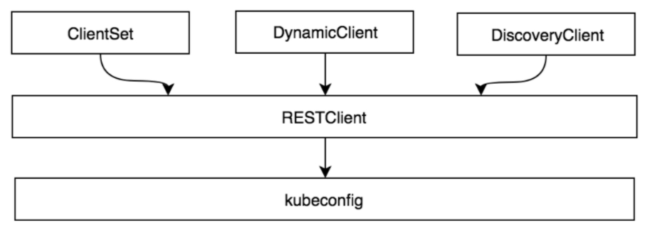

Table of Contents
=================

  * [1. client-go 中4种连接apiserver的客户端](#1-client-go-中4种连接apiserver的客户端)
     * [1.1 restClient客户端](#11-restclient客户端)
     * [1.2 clientSet客户端](#12-clientset客户端)
     * [1.3 DynamicClient客户端](#13-dynamicclient客户端)
     * [1.4 DiscoveryClient客户端](#14-discoveryclient客户端)

### 1. client-go 中4种连接apiserver的客户端

client-go的客户端对象有4个，作用各有不同：

- RESTClient： 是对HTTP Request进行了封装，实现了RESTful风格的API。其他客户端都是在RESTClient基础上的实现。可与用于k8s内置资源和CRD资源
- ClientSet:是对k8s内置资源对象的客户端的集合，默认情况下，不能操作CRD资源，但是通过client-gen代码生成的话，也是可以操作CRD资源的。
- DynamicClient:不仅能对K8S内置资源进行处理，还可以对CRD资源进行处理，不需要client-gen生成代码即可实现。
- DiscoveryClient：用于发现kube-apiserver所支持的资源组、资源版本、资源信息（即Group、Version、Resources）。




RESTClient是最基础的客户端。RESTClient对HTTP Request进行了封装，实现了RESTful风格的API。ClientSet、DynamicClient及DiscoveryClient客户端都是基于RESTClient实现的。


ClientSet在RESTClient的基础上封装了对Resource和Version的管理方法。每一个Resource可以理解为一个客户端，而ClientSet则是多个客户端的集合，每一个Resource和Version都以函数的方式暴露给开发者。ClientSet只能够处理Kubernetes内置资源，它是通过client-gen代码生成器自动生成的。


DynamicClient与ClientSet最大的不同之处是，ClientSet仅能访问Kubernetes自带的资源（即Client集合内的资源），不能直接访问CRD自定义资源。DynamicClient能够处理Kubernetes中的所有资源对象，包括Kubernetes内置资源与CRD自定义资源。

DiscoveryClient发现客户端，用于发现kube-apiserver所支持的资源组、资源版本、资源信息（即Group、Versions、Resources）。以上4种客户端：RESTClient、ClientSet、DynamicClient、DiscoveryClient都可以通过kubeconfig配置信息连接到指定的KubernetesAPI Server。

**总结下**：RESTCLient、ClientSet和DynamicClient都可以对K8S内置资源和CRD资源进行操作。只是clientSet需要生成代码才能操作CRD资源。

而clientSet 和dynamicClient不同在于，dynamicClient可以操作任意的对象，clientset初始化是只能指定一种对象操作。

<br>

<br>


#### 1.1 restClient客户端

rest.RESTClientFor函数通过kubeconfig配置信息实例化RESTClient对象，RESTClient对象构建HTTP请求参数，例如Get函数设置请求方法为get操作，它还支持Post、Put、Delete、Patch等请求方法。

如下的例子可见，restful需要自己确定url，访问资源。并且 restclient核心是通过RESTClientFor函数实例化的。

```
package main

import (
    "fmt"

    corev1 "k8s.io/api/core/v1"
    metav1 "k8s.io/apimachinery/pkg/apis/meta/v1"
    "k8s.io/client-go/kubernetes/scheme"
    "k8s.io/client-go/rest"
    "k8s.io/client-go/tools/clientcmd"
)

func main() {
    // 加载kubeconfig文件，生成config对象
    config, err := clientcmd.BuildConfigFromFlags("", "D:\\coding\\config")

    if err != nil {
        panic(err)
    }
    // 配置API路径和请求的资源组/资源版本信息
    config.APIPath = "api"
    config.GroupVersion = &corev1.SchemeGroupVersion
    config.NegotiatedSerializer = scheme.Codecs

    // 通过rest.RESTClientFor()生成RESTClient对象
    restClient, err := rest.RESTClientFor(config)
    if err != nil {
        panic(err)
    }

    // 通过RESTClient构建请求参数，查询default空间下所有pod资源
    result := &corev1.PodList{}
    err = restClient.Get().
        Namespace("default").
        Resource("pods").
        VersionedParams(&metav1.ListOptions{Limit: 500}, scheme.ParameterCodec).
        Do().
        Into(result)

    if err != nil {
        panic(err)
    }

    for _, d := range result.Items {
        fmt.Printf("NAMESPACE:%v \t NAME: %v \t STATUS: %v\n", d.Namespace, d.Name, d.Status.Phase)
    }
}

// 测试
go run .\restClient-example.go
NAMESPACE:default        NAME: nginx-deployment-6b474476c4-lpld7         STATUS: Running
NAMESPACE:default        NAME: nginx-deployment-6b474476c4-t6xl4         STATUS: Running
```

<br>

#### 1.2 clientSet客户端

RESTClient是一种最基础的客户端，使用时需要指定Resource和Version等信息，编写代码时需要提前知道Resource所在的Group和对应的Version信息。相比RESTClient，ClientSet使用起来更加便捷，一般情况下，开发者对Kubernetes进行二次开发时通常使用ClientSet。

如下的例子可见，clientSet通过 NewForConfig 实现一个客户端。用起来也方便很多。

```
package main

import (
    "fmt"

    apiv1 "k8s.io/api/core/v1"
    metav1 "k8s.io/apimachinery/pkg/apis/meta/v1"
    "k8s.io/client-go/kubernetes"
    "k8s.io/client-go/tools/clientcmd"
)

func main() {
    // 加载kubeconfig文件，生成config对象
    config, err := clientcmd.BuildConfigFromFlags("", "D:\\coding\\config")
    if err != nil {
        panic(err)
    }

    // kubernetes.NewForConfig通过config实例化ClientSet对象
    clientset, err := kubernetes.NewForConfig(config)
    if err != nil {
        panic(err)
    }

    //请求core核心资源组v1资源版本下的Pods资源对象
    podClient := clientset.CoreV1().Pods(apiv1.NamespaceDefault)
    // 设置选项
    list, err := podClient.List(metav1.ListOptions{Limit: 500})
    if err != nil {
        panic(err)
    }

    for _, d := range list.Items {
        fmt.Printf("NAMESPACE: %v \t NAME:%v \t STATUS: %+v\n", d.Namespace, d.Name, d.Status.Phase)
    }
}

// 测试
go run .\clientSet-example.go

NAMESPACE: default       NAME:nginx-deployment-6b474476c4-lpld7          STATUS: Running
NAMESPACE: default       NAME:nginx-deployment-6b474476c4-t6xl4          STATUS: Running
```

<br>

#### 1.3 DynamicClient客户端

DynamicClient是一种动态客户端，它可以对任意Kubernetes资源进行RESTful操作，包括CRD自定义资源。DynamicClient与ClientSet操作类似，同样封装了RESTClient，同样提供了Create、Update、Delete、Get、List、Watch、Patch等方法。DynamicClient与ClientSet最大的不同之处是，ClientSet仅能访问Kubernetes自带的资源（即客户端集合内的资源），不能直接访问CRD自定义资源。ClientSet需要预先实现每种Resource和Version的操作，其内部的数据都是结构化数据（即已知数据结构）。而DynamicClient内部实现了Unstructured，用于处理非结构化数据结构（即无法提前预知数据结构），这也是DynamicClient能够处理CRD自定义资源的关键。

**注意：**

* DynamicClient获得的数据都是一个object类型。存的时候是 unstructured
* DynamicClient不是类型安全的，因此在访问CRD自定义资源时需要特别注意。例如，在操作指针不当的情况下可能会导致程序崩溃。

```
package main

import (
    "fmt"

    apiv1 "k8s.io/api/core/v1"
    corev1 "k8s.io/api/core/v1"
    metav1 "k8s.io/apimachinery/pkg/apis/meta/v1"

    "k8s.io/apimachinery/pkg/runtime"
    "k8s.io/apimachinery/pkg/runtime/schema"
    "k8s.io/client-go/dynamic"
    "k8s.io/client-go/tools/clientcmd"
)

func main() {
    // 加载kubeconfig文件，生成config对象
    config, err := clientcmd.BuildConfigFromFlags("", "D:\\coding\\config")
    if err != nil {
        panic(err)
    }

    // dynamic.NewForConfig函数通过config实例化dynamicClient对象
    dynamicClient, err := dynamic.NewForConfig(config)
    if err != nil {
        panic(err)
    }

    // 通过schema.GroupVersionResource设置请求的资源版本和资源组，设置命名空间和请求参数,得到unstructured.UnstructuredList指针类型的PodList
    gvr := schema.GroupVersionResource{Version: "v1", Resource: "pods"}
    unstructObj, err := dynamicClient.Resource(gvr).Namespace(apiv1.NamespaceDefault).List(metav1.ListOptions{Limit: 500})
    if err != nil {
        panic(err)
    }

    // 通过runtime.DefaultUnstructuredConverter函数将unstructured.UnstructuredList转为PodList类型
    podList := &corev1.PodList{}
    err = runtime.DefaultUnstructuredConverter.FromUnstructured(unstructObj.UnstructuredContent(), podList)
    if err != nil {
        panic(err)
    }

    for _, d := range podList.Items {
        fmt.Printf("NAMESPACE: %v NAME:%v \t STATUS: %+v\n", d.Namespace, d.Name, d.Status.Phase)
    }
}

// 测试
go run .\dynamicClient-example.go
NAMESPACE: default NAME:nginx-deployment-6b474476c4-lpld7        STATUS: Running
NAMESPACE: default NAME:nginx-deployment-6b474476c4-t6xl4        STATUS: Running
```

<br>

#### 1.4 DiscoveryClient客户端

DiscoveryClient是发现客户端，它主要用于发现Kubernetes API Server所支持的资源组、资源版本、资源信息。Kubernetes API Server支持很多资源组、资源版本、资源信息，开发者在开发过程中很难记住所有信息，此时可以通过DiscoveryClient查看所支持的资源组、资源版本、资源信息。kubectl的api-versions和api-resources命令输出也是通过DiscoveryClient实现的。另外，DiscoveryClient同样在RESTClient的基础上进行了封装。DiscoveryClient除了可以发现Kubernetes API Server所支持的资源组、资源版本、资源信息，还可以将这些信息存储到本地，用于本地缓存（Cache），以减轻对Kubernetes API Server访问的压力。在运行Kubernetes组件的机器上，缓存信息默认存储于～/.kube/cache和～/.kube/http-cache下。

```
package main

import (
    "fmt"

    "k8s.io/apimachinery/pkg/runtime/schema"
    "k8s.io/client-go/discovery"
    "k8s.io/client-go/tools/clientcmd"
)

func main() {
    // 加载kubeconfig文件，生成config对象
    config, err := clientcmd.BuildConfigFromFlags("", "D:\\coding\\config")
    if err != nil {
        panic(err)
    }

    // discovery.NewDiscoveryClientForConfigg函数通过config实例化discoveryClient对象
    discoveryClient, err := discovery.NewDiscoveryClientForConfig(config)
    if err != nil {
        panic(err)
    }

    // discoveryClient.ServerGroupsAndResources 返回API Server所支持的资源组、资源版本、资源信息
    _, APIResourceList, err := discoveryClient.ServerGroupsAndResources()
    if err != nil {
        panic(err)
    }

    // 输出所有资源信息
    for _, list := range APIResourceList {
        gv, err := schema.ParseGroupVersion(list.GroupVersion)
        if err != nil {
            panic(err)
        }

        for _, resource := range list.APIResources {
            fmt.Printf("NAME: %v, GROUP: %v, VERSION: %v \n", resource.Name, gv.Group, gv.Version)
        }
    }
}


// 测试
 go run .\discoveryClient-example.go
NAME: bindings, GROUP: , VERSION: v1 
NAME: componentstatuses, GROUP: , VERSION: v1 
NAME: configmaps, GROUP: , VERSION: v1
NAME: endpoints, GROUP: , VERSION: v1
NAME: events, GROUP: , VERSION: v1
NAME: limitranges, GROUP: , VERSION: v1
NAME: namespaces, GROUP: , VERSION: v1
NAME: namespaces/finalize, GROUP: , VERSION: v1
NAME: namespaces/status, GROUP: , VERSION: v1
NAME: nodes, GROUP: , VERSION: v1
NAME: nodes/proxy, GROUP: , VERSION: v1
NAME: nodes/status, GROUP: , VERSION: v1
NAME: persistentvolumeclaims, GROUP: , VERSION: v1
NAME: persistentvolumeclaims/status, GROUP: , VERSION: v1
NAME: persistentvolumes, GROUP: , VERSION: v1
NAME: persistentvolumes/status, GROUP: , VERSION: v1
NAME: pods, GROUP: , VERSION: v1
NAME: pods/attach, GROUP: , VERSION: v1
NAME: pods/binding, GROUP: , VERSION: v1
NAME: pods/eviction, GROUP: , VERSION: v1
NAME: pods/exec, GROUP: , VERSION: v1
NAME: pods/log, GROUP: , VERSION: v1
NAME: pods/portforward, GROUP: , VERSION: v1
NAME: pods/proxy, GROUP: , VERSION: v1
NAME: pods/status, GROUP: , VERSION: v1
NAME: podtemplates, GROUP: , VERSION: v1
NAME: replicationcontrollers, GROUP: , VERSION: v1
NAME: replicationcontrollers/scale, GROUP: , VERSION: v1
NAME: replicationcontrollers/status, GROUP: , VERSION: v1
NAME: resourcequotas, GROUP: , VERSION: v1
NAME: resourcequotas/status, GROUP: , VERSION: v1
NAME: secrets, GROUP: , VERSION: v1
NAME: serviceaccounts, GROUP: , VERSION: v1
NAME: services, GROUP: , VERSION: v1
NAME: services/proxy, GROUP: , VERSION: v1
NAME: services/status, GROUP: , VERSION: v1
NAME: apiservices, GROUP: apiregistration.k8s.io, VERSION: v1
NAME: apiservices/status, GROUP: apiregistration.k8s.io, VERSION: v1
NAME: apiservices, GROUP: apiregistration.k8s.io, VERSION: v1beta1 
NAME: apiservices/status, GROUP: apiregistration.k8s.io, VERSION: v1beta1
NAME: ingresses, GROUP: extensions, VERSION: v1beta1
NAME: ingresses/status, GROUP: extensions, VERSION: v1beta1
NAME: controllerrevisions, GROUP: apps, VERSION: v1
NAME: daemonsets, GROUP: apps, VERSION: v1
NAME: daemonsets/status, GROUP: apps, VERSION: v1
NAME: deployments, GROUP: apps, VERSION: v1
NAME: deployments/scale, GROUP: apps, VERSION: v1
NAME: deployments/status, GROUP: apps, VERSION: v1
NAME: replicasets, GROUP: apps, VERSION: v1
NAME: replicasets/scale, GROUP: apps, VERSION: v1
NAME: replicasets/status, GROUP: apps, VERSION: v1
NAME: statefulsets, GROUP: apps, VERSION: v1
NAME: statefulsets/scale, GROUP: apps, VERSION: v1
NAME: statefulsets/status, GROUP: apps, VERSION: v1
NAME: events, GROUP: events.k8s.io, VERSION: v1beta1
NAME: tokenreviews, GROUP: authentication.k8s.io, VERSION: v1
NAME: tokenreviews, GROUP: authentication.k8s.io, VERSION: v1beta1
NAME: localsubjectacce***eviews, GROUP: authorization.k8s.io, VERSION: v1
NAME: selfsubjectacce***eviews, GROUP: authorization.k8s.io, VERSION: v1
NAME: selfsubjectrulesreviews, GROUP: authorization.k8s.io, VERSION: v1
NAME: subjectacce***eviews, GROUP: authorization.k8s.io, VERSION: v1
NAME: localsubjectacce***eviews, GROUP: authorization.k8s.io, VERSION: v1beta1
NAME: selfsubjectacce***eviews, GROUP: authorization.k8s.io, VERSION: v1beta1
NAME: selfsubjectrulesreviews, GROUP: authorization.k8s.io, VERSION: v1beta1
NAME: subjectacce***eviews, GROUP: authorization.k8s.io, VERSION: v1beta1
NAME: horizontalpodautoscalers, GROUP: autoscaling, VERSION: v1
NAME: horizontalpodautoscalers/status, GROUP: autoscaling, VERSION: v1
NAME: horizontalpodautoscalers, GROUP: autoscaling, VERSION: v2beta1
NAME: horizontalpodautoscalers/status, GROUP: autoscaling, VERSION: v2beta1
NAME: horizontalpodautoscalers, GROUP: autoscaling, VERSION: v2beta2
NAME: horizontalpodautoscalers/status, GROUP: autoscaling, VERSION: v2beta2
NAME: jobs, GROUP: batch, VERSION: v1
NAME: jobs/status, GROUP: batch, VERSION: v1
NAME: cronjobs, GROUP: batch, VERSION: v1beta1
NAME: cronjobs/status, GROUP: batch, VERSION: v1beta1
NAME: certificatesigningrequests, GROUP: certificates.k8s.io, VERSION: v1beta1
NAME: certificatesigningrequests/approval, GROUP: certificates.k8s.io, VERSION: v1beta1
NAME: certificatesigningrequests/status, GROUP: certificates.k8s.io, VERSION: v1beta1
NAME: networkpolicies, GROUP: networking.k8s.io, VERSION: v1
NAME: ingressclasses, GROUP: networking.k8s.io, VERSION: v1beta1
NAME: ingresses, GROUP: networking.k8s.io, VERSION: v1beta1
NAME: ingresses/status, GROUP: networking.k8s.io, VERSION: v1beta1
NAME: poddisruptionbudgets, GROUP: policy, VERSION: v1beta1
NAME: poddisruptionbudgets/status, GROUP: policy, VERSION: v1beta1
NAME: podsecuritypolicies, GROUP: policy, VERSION: v1beta1
NAME: clusterrolebindings, GROUP: rbac.authorization.k8s.io, VERSION: v1
NAME: clusterroles, GROUP: rbac.authorization.k8s.io, VERSION: v1
NAME: rolebindings, GROUP: rbac.authorization.k8s.io, VERSION: v1
NAME: roles, GROUP: rbac.authorization.k8s.io, VERSION: v1
NAME: clusterrolebindings, GROUP: rbac.authorization.k8s.io, VERSION: v1beta1
NAME: clusterroles, GROUP: rbac.authorization.k8s.io, VERSION: v1beta1
NAME: rolebindings, GROUP: rbac.authorization.k8s.io, VERSION: v1beta1
NAME: roles, GROUP: rbac.authorization.k8s.io, VERSION: v1beta1
NAME: csidrivers, GROUP: storage.k8s.io, VERSION: v1
NAME: csinodes, GROUP: storage.k8s.io, VERSION: v1
NAME: storageclasses, GROUP: storage.k8s.io, VERSION: v1
NAME: volumeattachments, GROUP: storage.k8s.io, VERSION: v1
NAME: volumeattachments/status, GROUP: storage.k8s.io, VERSION: v1 
NAME: csidrivers, GROUP: storage.k8s.io, VERSION: v1beta1
NAME: csinodes, GROUP: storage.k8s.io, VERSION: v1beta1
NAME: storageclasses, GROUP: storage.k8s.io, VERSION: v1beta1
NAME: volumeattachments, GROUP: storage.k8s.io, VERSION: v1beta1
NAME: mutatingwebhookconfigurations, GROUP: admissionregistration.k8s.io, VERSION: v1
NAME: validatingwebhookconfigurations, GROUP: admissionregistration.k8s.io, VERSION: v1
NAME: mutatingwebhookconfigurations, GROUP: admissionregistration.k8s.io, VERSION: v1beta1
NAME: validatingwebhookconfigurations, GROUP: admissionregistration.k8s.io, VERSION: v1beta1
NAME: customresourcedefinitions, GROUP: apiextensions.k8s.io, VERSION: v1
NAME: customresourcedefinitions/status, GROUP: apiextensions.k8s.io, VERSION: v1
NAME: customresourcedefinitions, GROUP: apiextensions.k8s.io, VERSION: v1beta1
NAME: customresourcedefinitions/status, GROUP: apiextensions.k8s.io, VERSION: v1beta1
NAME: priorityclasses, GROUP: scheduling.k8s.io, VERSION: v1
NAME: priorityclasses, GROUP: scheduling.k8s.io, VERSION: v1beta1
NAME: leases, GROUP: coordination.k8s.io, VERSION: v1
NAME: leases, GROUP: coordination.k8s.io, VERSION: v1beta1
NAME: runtimeclasses, GROUP: node.k8s.io, VERSION: v1beta1
NAME: endpointslices, GROUP: discovery.k8s.io, VERSION: v1beta1
```

