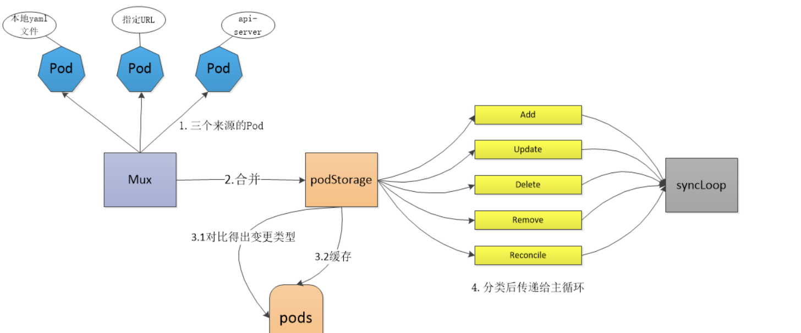

* [1\.背景](#1背景)
* [1\. makePodSourceConfig](#1-makepodsourceconfig)
* [2\. PodConfig 结构体介绍](#2-podconfig-结构体介绍)
* [3\.Merge](#3merge)
* [4\. s\.merge](#4-smerge)
  * [4\.1 updatePodsFunc](#41-updatepodsfunc)
  * [4\.2 checkAndUpdatePod](#42-checkandupdatepod)
* [5\.总结](#5总结)

### 1.背景

从上文中知道，kubelet 监听了apiserver, file ,url等pod资源。然后送到 configCh channel中去。

但是在处理configCh channel的时候，确实 ADD，UPDATE， REMOVE等状态变化。这个肯定是经过转换的。

所以本章节就是了解kubelte到底是如何监听处理apiserver等来源的Pod

<br>

### 1. makePodSourceConfig

这之前的分析中，在NewMainKubelet函数中有一个重要的步骤, 就是makePodSourceConfig。

```
if kubeDeps.PodConfig == nil {
		var err error
		kubeDeps.PodConfig, err = makePodSourceConfig(kubeCfg, kubeDeps, nodeName, bootstrapCheckpointPath)
		if err != nil {
			return nil, err
		}
	}
```

<br>

### 2. PodConfig 结构体介绍

```
// PodConfig is a configuration mux that merges many sources of pod configuration into a single
// consistent structure, and then delivers incremental change notifications to listeners
// in order.
type PodConfig struct {
	pods *podStorage
	mux  *config.Mux

	// the channel of denormalized changes passed to listeners
	updates chan kubetypes.PodUpdate

	// contains the list of all configured sources
	sourcesLock       sync.Mutex
	sources           sets.String
	checkpointManager checkpointmanager.CheckpointManager
}


// PodConfig的构造函数
// NewPodConfig creates an object that can merge many configuration sources into a stream
// of normalized updates to a pod configuration.
func NewPodConfig(mode PodConfigNotificationMode, recorder record.EventRecorder) *PodConfig {
	updates := make(chan kubetypes.PodUpdate, 50)
	storage := newPodStorage(updates, mode, recorder)
	podConfig := &PodConfig{
		pods:    storage,
		mux:     config.NewMux(storage),
		updates: updates,
		sources: sets.String{},
	}
	return podConfig
}
```

podStorage的构造函数及结构定义如下，由结构名得知它主要是负责pod的存储，且它的成员中有一个用于存储pod对象的map,查看了对updates通道的引用是往里面塞入对象，主要通过PodStorage的Merge方法传入

```
// TODO: PodConfigNotificationMode could be handled by a listener to the updates channel
// in the future, especially with multiple listeners.
// TODO: allow initialization of the current state of the store with snapshotted version.
func newPodStorage(updates chan<- kubetypes.PodUpdate, mode PodConfigNotificationMode, recorder record.EventRecorder) *podStorage {
	return &podStorage{
		pods:        make(map[string]map[types.UID]*v1.Pod),
		mode:        mode,
		updates:     updates,
		sourcesSeen: sets.String{},
		recorder:    recorder,
	}
}
```

### 3.Merge

kubelet通过podStorage来实现对三个渠道的Pod的处理。在makePodSourceConfig函数中，针对三个渠道的更新都扔进去了updates channel。以apiserver为例。每个update是有来源的，这里来源kubetypes.ApiserverSource。

```
// newSourceApiserverFromLW holds creates a config source that watches and pulls from the apiserver.
func newSourceApiserverFromLW(lw cache.ListerWatcher, updates chan<- interface{}) {
	send := func(objs []interface{}) {
		var pods []*v1.Pod
		for _, o := range objs {
			pods = append(pods, o.(*v1.Pod))
		}
		updates <- kubetypes.PodUpdate{Pods: pods, Op: kubetypes.SET, Source: kubetypes.ApiserverSource}
	}
	r := cache.NewReflector(lw, &v1.Pod{}, cache.NewUndeltaStore(send, cache.MetaNamespaceKeyFunc), 0)
	go r.Run(wait.NeverStop)
}
```

<br>

而podStorage.Merge对每个来源的数据进行了统一的处理。进行合并。

Merge函数的核心就是调用 s.merge  整理处理 add/updates/del/remove等等的pods。

adds, updates, deletes, removes, reconciles, restores := s.merge(source, change)

```
// Merge normalizes a set of incoming changes from different sources into a map of all Pods
// and ensures that redundant changes are filtered out, and then pushes zero or more minimal
// updates onto the update channel.  Ensures that updates are delivered in order.
func (s *podStorage) Merge(source string, change interface{}) error {
	s.updateLock.Lock()
	defer s.updateLock.Unlock()

	seenBefore := s.sourcesSeen.Has(source)
	adds, updates, deletes, removes, reconciles, restores := s.merge(source, change)
	firstSet := !seenBefore && s.sourcesSeen.Has(source)

	// deliver update notifications
	switch s.mode {
	case PodConfigNotificationIncremental:
		if len(removes.Pods) > 0 {
			s.updates <- *removes
		}
		if len(adds.Pods) > 0 {
			s.updates <- *adds
		}
		if len(updates.Pods) > 0 {
			s.updates <- *updates
		}
		if len(deletes.Pods) > 0 {
			s.updates <- *deletes
		}
		if len(restores.Pods) > 0 {
			s.updates <- *restores
		}
		if firstSet && len(adds.Pods) == 0 && len(updates.Pods) == 0 && len(deletes.Pods) == 0 {
			// Send an empty update when first seeing the source and there are
			// no ADD or UPDATE or DELETE pods from the source. This signals kubelet that
			// the source is ready.
			s.updates <- *adds
		}
		// Only add reconcile support here, because kubelet doesn't support Snapshot update now.
		if len(reconciles.Pods) > 0 {
			s.updates <- *reconciles
		}

	case PodConfigNotificationSnapshotAndUpdates:
		if len(removes.Pods) > 0 || len(adds.Pods) > 0 || firstSet {
			s.updates <- kubetypes.PodUpdate{Pods: s.MergedState().([]*v1.Pod), Op: kubetypes.SET, Source: source}
		}
		if len(updates.Pods) > 0 {
			s.updates <- *updates
		}
		if len(deletes.Pods) > 0 {
			s.updates <- *deletes
		}

	case PodConfigNotificationSnapshot:
		if len(updates.Pods) > 0 || len(deletes.Pods) > 0 || len(adds.Pods) > 0 || len(removes.Pods) > 0 || firstSet {
			s.updates <- kubetypes.PodUpdate{Pods: s.MergedState().([]*v1.Pod), Op: kubetypes.SET, Source: source}
		}

	case PodConfigNotificationUnknown:
		fallthrough
	default:
		panic(fmt.Sprintf("unsupported PodConfigNotificationMode: %#v", s.mode))
	}

	return nil
}
```

### 4. s.merge

```
func (s *podStorage) merge(source string, change interface{}) (adds, updates, deletes, removes, reconciles, restores *kubetypes.PodUpdate) {
  ... 
  
  // 1.关注这个updatePodFunc
	// updatePodFunc is the local function which updates the pod cache *oldPods* with new pods *newPods*.
	// After updated, new pod will be stored in the pod cache *pods*.
	// Notice that *pods* and *oldPods* could be the same cache.
	updatePodsFunc := func(newPods []*v1.Pod, oldPods, pods map[types.UID]*v1.Pod) {
		filtered := filterInvalidPods(newPods, source, s.recorder)
		for _, ref := range filtered {
			// Annotate the pod with the source before any comparison.
			if ref.Annotations == nil {
				ref.Annotations = make(map[string]string)
			}
			ref.Annotations[kubetypes.ConfigSourceAnnotationKey] = source
			if existing, found := oldPods[ref.UID]; found {
				pods[ref.UID] = existing
				needUpdate, needReconcile, needGracefulDelete := checkAndUpdatePod(existing, ref)
				if needUpdate {
					updatePods = append(updatePods, existing)
				} else if needReconcile {
					reconcilePods = append(reconcilePods, existing)
				} else if needGracefulDelete {
					deletePods = append(deletePods, existing)
				}
				continue
			}
			recordFirstSeenTime(ref)
			pods[ref.UID] = ref
			addPods = append(addPods, ref)
		}
	}

	update := change.(kubetypes.PodUpdate)
	switch update.Op {
	case kubetypes.ADD, kubetypes.UPDATE, kubetypes.DELETE:
	...
	case kubetypes.REMOVE:
	...
	// 2.只用关心这个case就行了。因为三个来源塞入数据的时候都是 kubetypes.SET
	case kubetypes.SET:
		klog.V(4).Infof("Setting pods for source %s", source)
		s.markSourceSet(source)
		// Clear the old map entries by just creating a new map
		oldPods := pods
		pods = make(map[types.UID]*v1.Pod)
		updatePodsFunc(update.Pods, oldPods, pods)
	  // 遍历旧的pods, 如果发现旧的pods有，但是新的pod就认识pod已经删除了，就是remove事件
		for uid, existing := range oldPods {
			if _, found := pods[uid]; !found {
				// this is a delete
				removePods = append(removePods, existing)
			}
		}
	case kubetypes.RESTORE:
	default:
		klog.Warningf("Received invalid update type: %v", update)
	}
	return adds, updates, deletes, removes, reconciles, restores
}
```

#### 4.1 updatePodsFunc

updatePodsFunc的核心逻辑如下：

（1）根据PodName进行去重

（2）通过pod Annotations表明pod的来源（apiserver/url/file）

（3）开始分类，逻辑如下：oldPods是podStorage缓存的pods数据。

* 如果pod在oldPods没有找到，那说明肯定就是add，加入addPods
* 如果找到了，调用checkAndUpdatePod进行进一步判断

（4）checkAndUpdatePod逻辑如下：

* 如果本地pod和新pod处理除了状态外，其他都一样，那就是Reconcile，加入reconcilePods

* 如果新pod有DeletionTimestamp，那就是需要needGracefulDelete, 加入deletePods

* 否则就是update，加入updatePods

（5) 遍历旧的pods, 如果发现旧的pods有，但是新的pod就认识pod已经删除了，就是remove事件-这个是SET的逻辑

**注意**：kubelet不是使用其他控制器场景的informer机制，他是使用了更底层的reflect。所以新的Pods，你可以认为是list出来的所有Pods。所以这样可以判断一个pod有没有被删除。

```
updatePodsFunc := func(newPods []*v1.Pod, oldPods, pods map[types.UID]*v1.Pod) {
    // 1.根据PodName进行去重
		filtered := filterInvalidPods(newPods, source, s.recorder)
		for _, ref := range filtered {
			// Annotate the pod with the source before any comparison.
			if ref.Annotations == nil {
				ref.Annotations = make(map[string]string)
			}
			// 2.通过pod Annotations表明pod的来源（apiserver/url/file）
			ref.Annotations[kubetypes.ConfigSourceAnnotationKey] = source
			// oldPods是本地缓存的Pods数据。
			// 3.开始分类，逻辑如下：
			if existing, found := oldPods[ref.UID]; found {
				pods[ref.UID] = existing
				needUpdate, needReconcile, needGracefulDelete := checkAndUpdatePod(existing, ref)
				if needUpdate {
					updatePods = append(updatePods, existing)
				} else if needReconcile {
					reconcilePods = append(reconcilePods, existing)
				} else if needGracefulDelete {
					deletePods = append(deletePods, existing)
				}
				continue
			}
			recordFirstSeenTime(ref)
			pods[ref.UID] = ref
			addPods = append(addPods, ref)
		}
	}
```

#### 4.2 checkAndUpdatePod

参数：existing是本地的pod,  ref是新pod

逻辑：

（1）如果本地pod和新pod处理除了状态外，其他都一样，那就是Reconcile 

（2）如果新pod有DeletionTimestamp，那就是需要needGracefulDelete

（3）否则就是update

```
// checkAndUpdatePod updates existing, and:
//   * if ref makes a meaningful change, returns needUpdate=true
//   * if ref makes a meaningful change, and this change is graceful deletion, returns needGracefulDelete=true
//   * if ref makes no meaningful change, but changes the pod status, returns needReconcile=true
//   * else return all false
//   Now, needUpdate, needGracefulDelete and needReconcile should never be both true
func checkAndUpdatePod(existing, ref *v1.Pod) (needUpdate, needReconcile, needGracefulDelete bool) {

	// 1. this is a reconcile
	// TODO: it would be better to update the whole object and only preserve certain things
	//       like the source annotation or the UID (to ensure safety)
	if !podsDifferSemantically(existing, ref) {
		// this is not an update
		// Only check reconcile when it is not an update, because if the pod is going to
		// be updated, an extra reconcile is unnecessary
		if !reflect.DeepEqual(existing.Status, ref.Status) {
			// Pod with changed pod status needs reconcile, because kubelet should
			// be the source of truth of pod status.
			existing.Status = ref.Status
			needReconcile = true
		}
		return
	}

	// Overwrite the first-seen time with the existing one. This is our own
	// internal annotation, there is no need to update.
	ref.Annotations[kubetypes.ConfigFirstSeenAnnotationKey] = existing.Annotations[kubetypes.ConfigFirstSeenAnnotationKey]

	existing.Spec = ref.Spec
	existing.Labels = ref.Labels
	existing.DeletionTimestamp = ref.DeletionTimestamp
	existing.DeletionGracePeriodSeconds = ref.DeletionGracePeriodSeconds
	existing.Status = ref.Status
	updateAnnotations(existing, ref)

	// 2. this is an graceful delete
	if ref.DeletionTimestamp != nil {
		needGracefulDelete = true
	} else {
		// 3. this is an update
		needUpdate = true
	}

	return
}


// 这些都一样，说明pod是一样的
func podsDifferSemantically(existing, ref *v1.Pod) bool {
	if reflect.DeepEqual(existing.Spec, ref.Spec) &&
		reflect.DeepEqual(existing.Labels, ref.Labels) &&
		reflect.DeepEqual(existing.DeletionTimestamp, ref.DeletionTimestamp) &&
		reflect.DeepEqual(existing.DeletionGracePeriodSeconds, ref.DeletionGracePeriodSeconds) &&
		isAnnotationMapEqual(existing.Annotations, ref.Annotations) {
		return false
	}
	return true
}
```

<br>

### 5.总结

kubelet通过podStorage缓存了所有的旧数据。然后监听三个来源的新数据进行对比。然后更加以下逻辑分类：

（1）旧的有，新的没有那就是删除，对应remove

（2）旧的有，新的有，但是元数据不一样，那就是更新，对应update

（3）旧的有，新的有，元数据也一样，但是status不一样，那就是同步，对应reconclie

（4）旧的没有，新的有，那就是新增，对应add

（5）旧的有，新的有，新的带有deleteTimeStamp，那就是删除，对应delete

