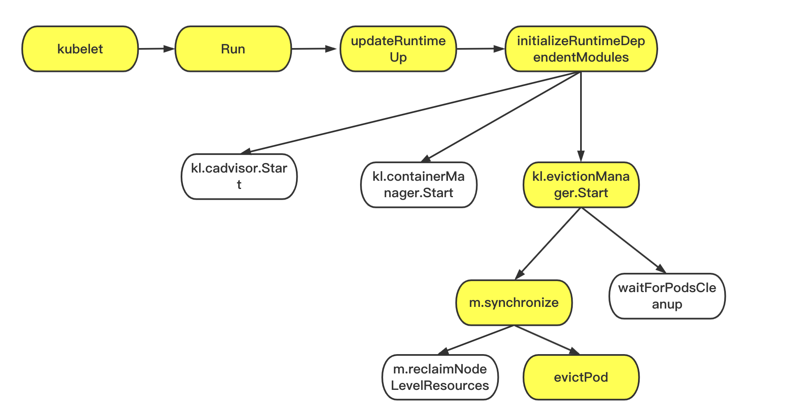

- [1. 关键调用链路](#1-------)
- [2. initializeRuntimeDependentModules](#2-initializeruntimedependentmodules)
- [3. evictionManager.Start](#3-evictionmanagerstart)
  * [3.1 synchronize](#31-synchronize)
    + [3.1.1 summaryProvider.Get(updateStats)](#311-summaryproviderget-updatestats-)
    + [3.1.2 makeSignalObservations](#312-makesignalobservations)
  * [3.2 waitForPodsCleanup](#32-waitforpodscleanup)
- [4. 总结](#4---)

k8s版本信息：v1.17.4

### 1. 关键调用链路



### 2. initializeRuntimeDependentModules

省略kubelet->run->updateRuntimeUp，直接从initializeRuntimeDependentModules开发分析。

initializeRuntimeDependentModules的核心逻辑就是启动evictionManager和其他相关的组件。该函数只在kubelet运行时启动一次。

这里关注的核心函数：

（1）启动cadvisor

（2）启动containerManager

（3）启动evictionManager

因为evictionManager需要的数据是来源于，cadvisor的，所以必须等cadvisor启动完后在启动evictionManager

```
// initializeRuntimeDependentModules will initialize internal modules that require the container runtime to be up.
func (kl *Kubelet) initializeRuntimeDependentModules() {
  // 1. 启动cadvisor
	if err := kl.cadvisor.Start(); err != nil {
		// Fail kubelet and rely on the babysitter to retry starting kubelet.
		// TODO(random-liu): Add backoff logic in the babysitter
		klog.Fatalf("Failed to start cAdvisor %v", err)
	}

	// trigger on-demand stats collection once so that we have capacity information for ephemeral storage.
	// ignore any errors, since if stats collection is not successful, the container manager will fail to start below.
	kl.StatsProvider.GetCgroupStats("/", true)
	// Start container manager.
	node, err := kl.getNodeAnyWay()
	if err != nil {
		// Fail kubelet and rely on the babysitter to retry starting kubelet.
		klog.Fatalf("Kubelet failed to get node info: %v", err)
	}
	
	// 2.启动containerManager
	// containerManager must start after cAdvisor because it needs filesystem capacity information
	if err := kl.containerManager.Start(node, kl.GetActivePods, kl.sourcesReady, kl.statusManager, kl.runtimeService); err != nil {
		// Fail kubelet and rely on the babysitter to retry starting kubelet.
		klog.Fatalf("Failed to start ContainerManager %v", err)
	}
	
	// 3.启动evictionManager
	// eviction manager must start after cadvisor because it needs to know if the container runtime has a dedicated imagefs
	kl.evictionManager.Start(kl.StatsProvider, kl.GetActivePods, kl.podResourcesAreReclaimed, evictionMonitoringPeriod)

	...
}
```

### 3. evictionManager.Start

核心逻辑如下
（1）是否利用kernel memcg notification机制。默认是否，可以通过--kernel-memcg-notification参数开启

kubelet 定期通过 cadvisor 接口采集节点内存使用数据，当节点短时间内内存使用率突增，此时 kubelet 无法感知到也不会有 MemoryPressure 相关事件，但依然会调用 OOMKiller 停止容器。可以通过为 kubelet 配置 `--kernel-memcg-notification`
 参数启用 memcg api，当触发 memory 使用率阈值时 memcg 会主动进行通知；

memcg 主动通知的功能是 cgroup 中已有的，kubelet 会在 `/sys/fs/cgroup/memory/cgroup.event_control`
 文件中写入 memory.available 的阈值，而阈值与 inactive_file 文件的大小有关系，kubelet 也会定期更新阈值，当 memcg 使用率达到配置的阈值后会主动通知 kubelet，kubelet 通过 epoll 机制来接收通知。

这个暂时先了解一下，不做深入。

（2）循环调用synchronize，waitForPodsCleanup来驱逐清理pod。循环间隔是10s，monitoringInterval默认10s

```
kl.evictionManager.Start(kl.StatsProvider, kl.GetActivePods, kl.podResourcesAreReclaimed, evictionMonitoringPeriod)

// Start starts the control loop to observe and response to low compute resources.
func (m *managerImpl) Start(diskInfoProvider DiskInfoProvider, podFunc ActivePodsFunc, podCleanedUpFunc PodCleanedUpFunc, monitoringInterval time.Duration) {
	
	thresholdHandler := func(message string) {
		klog.Infof(message)
		m.synchronize(diskInfoProvider, podFunc)
	}
	// 1.是否利用kernel memcg notification机制。默认是否，可以通过--kernel-memcg-notification参数开启
	if m.config.KernelMemcgNotification {
		for _, threshold := range m.config.Thresholds {
			if threshold.Signal == evictionapi.SignalMemoryAvailable || threshold.Signal == evictionapi.SignalAllocatableMemoryAvailable {
				notifier, err := NewMemoryThresholdNotifier(threshold, m.config.PodCgroupRoot, &CgroupNotifierFactory{}, thresholdHandler)
				if err != nil {
					klog.Warningf("eviction manager: failed to create memory threshold notifier: %v", err)
				} else {
					go notifier.Start()
					m.thresholdNotifiers = append(m.thresholdNotifiers, notifier)
				}
			}
		}
	}
	
	// 2.循环调用synchronize，waitForPodsCleanup来驱逐清理pod。循环间隔是10s，monitoringInterval默认10s
	// start the eviction manager monitoring
	go func() {
		for {
			if evictedPods := m.synchronize(diskInfoProvider, podFunc); evictedPods != nil {
				klog.Infof("eviction manager: pods %s evicted, waiting for pod to be cleaned up", format.Pods(evictedPods))
				m.waitForPodsCleanup(podCleanedUpFunc, evictedPods)
			} else {
				time.Sleep(monitoringInterval)
			}
		}
	}()
}
```

#### 3.1 synchronize

核心逻辑：

（1）得到该节点所有activePods(得到所有Pod然后去掉了status.Phase == v1.PodFailed || status.Phase == v1.PodSucceeded || (pod.DeletionTimestamp != nil && notRunning(status.ContainerStatuses)))

（2）从cadvisor获取详细信息，就是node, pod的资源统计信息-（重要环节）

（3）从统计数据中获得节点资源的使用情况observations

（4）将资源实际使用量和资源容量进行比较，最终得到阈值结构体对象的列表。举例来说就是，我设置了pid, mem, fs三个thresholds,但是通过观察，可能就是mem这一个限制达到了驱逐阈值

（5）再加上最小强制回收值(防止反复驱逐)。算出来最终的哪些限制到阈值了。可以参[最小强制回收](https://kubernetes.io/docs/concepts/scheduling-eviction/node-pressure-eviction/#minimum-eviction-reclaim)_

（6）记录每个限制第一次驱逐时间，因为软驱逐会有时间容忍，所以对于软驱逐而言，过来容忍期还是超了阈值，这个时候就要驱逐

（7）回收节点级的资源，如果回收的资源足够的话，直接返回，不需要驱逐正在运行中的pod

（8）对不同阈值驱逐场景下pod有不同的排序，比如如果是mem驱逐，就是按照req limit的qos进行排序驱逐

（9）按照排序后的结果每次驱逐一个pod,每个Pod的annotation会带有为什么驱逐的关键信息，日志也会打印klog.Infof("eviction manager: pod %s is evicted successfully", format.Pod(pod))

```
// synchronize is the main control loop that enforces eviction thresholds.
// Returns the pod that was killed, or nil if no pod was killed.
func (m *managerImpl) synchronize(diskInfoProvider DiskInfoProvider, podFunc ActivePodsFunc) []*v1.Pod {
	// if we have nothing to do, just return
	// 这个基本不会满足。
	条件1：thresholds是包含evictionHard，evictionSoft等等配置在内，有默认值。所以不会为空
	条件2： 不允许使用 本地临时存储以及emptyDir卷的sizeLimit 属性 或者没有设置thresholds就不进行同步（基本不会）
	thresholds := m.config.Thresholds
	if len(thresholds) == 0 && !utilfeature.DefaultFeatureGate.Enabled(features.LocalStorageCapacityIsolation) {
		return nil
	}

	klog.V(3).Infof("eviction manager: synchronize housekeeping")
	// build the ranking functions (if not yet known)
	// TODO: have a function in cadvisor that lets us know if global housekeeping has completed
	if m.dedicatedImageFs == nil {
		hasImageFs, ok := diskInfoProvider.HasDedicatedImageFs()
		if ok != nil {
			return nil
		}
		m.dedicatedImageFs = &hasImageFs
		m.signalToRankFunc = buildSignalToRankFunc(hasImageFs)
		m.signalToNodeReclaimFuncs = buildSignalToNodeReclaimFuncs(m.imageGC, m.containerGC, hasImageFs)
	}
	
	// 1. 得到该节点所有activePods(得到所有Pod然后去掉了status.Phase == v1.PodFailed || status.Phase == v1.PodSucceeded || (pod.DeletionTimestamp != nil && notRunning(status.ContainerStatuses)))
	activePods := podFunc()
	updateStats := true
	// 2. 从cadvisor获取详细信息，就是node, pod的资源统计信息-（重要环节）
	summary, err := m.summaryProvider.Get(updateStats)
	if err != nil {
		klog.Errorf("eviction manager: failed to get summary stats: %v", err)
		return nil
	}
	
	// 之前内核notify相关，一般不开启，这里忽略
	if m.clock.Since(m.thresholdsLastUpdated) > notifierRefreshInterval {
		m.thresholdsLastUpdated = m.clock.Now()
		for _, notifier := range m.thresholdNotifiers {
			if err := notifier.UpdateThreshold(summary); err != nil {
				klog.Warningf("eviction manager: failed to update %s: %v", notifier.Description(), err)
			}
		}
	}
	
	// 3. 从统计数据中获得节点资源的使用情况observations
	// make observations and get a function to derive pod usage stats relative to those observations.
	observations, statsFunc := makeSignalObservations(summary)
	debugLogObservations("observations", observations)
	
	// 4. 将资源实际使用量和资源容量进行比较，最终得到阈值结构体对象的列表。举例来说就是，我设置了pid, mem, fs三个thresholds,但是通过观察，可能就是mem这一个限制达到了驱逐阈值
	// determine the set of thresholds met independent of grace period
	thresholds = thresholdsMet(thresholds, observations, false)
	debugLogThresholdsWithObservation("thresholds - ignoring grace period", thresholds, observations)
  
  // 5. 加上enforceMinReclaim最小强制回收资源值。https://kubernetes.io/docs/concepts/scheduling-eviction/node-pressure-eviction/#minimum-eviction-reclaim
	// determine the set of thresholds previously met that have not yet satisfied the associated min-reclaim
	if len(m.thresholdsMet) > 0 {
		thresholdsNotYetResolved := thresholdsMet(m.thresholdsMet, observations, true)
		thresholds = mergeThresholds(thresholds, thresholdsNotYetResolved)
	}
	debugLogThresholdsWithObservation("thresholds - reclaim not satisfied", thresholds, observations)
	
	// 6.记录每个限制第一次驱逐时间，因为软驱逐会有时间容忍，所以对于软驱逐而言，过来容忍期还是超了阈值，这个时候就要驱逐
	// track when a threshold was first observed
	now := m.clock.Now()
	thresholdsFirstObservedAt := thresholdsFirstObservedAt(thresholds, m.thresholdsFirstObservedAt, now)

	// the set of node conditions that are triggered by currently observed thresholds
	nodeConditions := nodeConditions(thresholds)
	if len(nodeConditions) > 0 {
		klog.V(3).Infof("eviction manager: node conditions - observed: %v", nodeConditions)
	}

	// track when a node condition was last observed
	nodeConditionsLastObservedAt := nodeConditionsLastObservedAt(nodeConditions, m.nodeConditionsLastObservedAt, now)

	// node conditions report true if it has been observed within the transition period window
	nodeConditions = nodeConditionsObservedSince(nodeConditionsLastObservedAt, m.config.PressureTransitionPeriod, now)
	if len(nodeConditions) > 0 {
		klog.V(3).Infof("eviction manager: node conditions - transition period not met: %v", nodeConditions)
	}

	// determine the set of thresholds we need to drive eviction behavior (i.e. all grace periods are met)
	thresholds = thresholdsMetGracePeriod(thresholdsFirstObservedAt, now)
	debugLogThresholdsWithObservation("thresholds - grace periods satisfied", thresholds, observations)

	// update internal state
	m.Lock()
	m.nodeConditions = nodeConditions
	m.thresholdsFirstObservedAt = thresholdsFirstObservedAt
	m.nodeConditionsLastObservedAt = nodeConditionsLastObservedAt
	m.thresholdsMet = thresholds

	// determine the set of thresholds whose stats have been updated since the last sync
	thresholds = thresholdsUpdatedStats(thresholds, observations, m.lastObservations)
	debugLogThresholdsWithObservation("thresholds - updated stats", thresholds, observations)

	m.lastObservations = observations
	m.Unlock()

	// evict pods if there is a resource usage violation from local volume temporary storage
	// If eviction happens in localStorageEviction function, skip the rest of eviction action
	if utilfeature.DefaultFeatureGate.Enabled(features.LocalStorageCapacityIsolation) {
		if evictedPods := m.localStorageEviction(summary, activePods); len(evictedPods) > 0 {
			return evictedPods
		}
	}

	if len(thresholds) == 0 {
		klog.V(3).Infof("eviction manager: no resources are starved")
		return nil
	}
	
	// 对thresholds排序
	// rank the thresholds by eviction priority
	sort.Sort(byEvictionPriority(thresholds))
	thresholdToReclaim, resourceToReclaim, foundAny := getReclaimableThreshold(thresholds)
	if !foundAny {
		return nil
	}
	klog.Warningf("eviction manager: attempting to reclaim %v", resourceToReclaim)

	// record an event about the resources we are now attempting to reclaim via eviction
	m.recorder.Eventf(m.nodeRef, v1.EventTypeWarning, "EvictionThresholdMet", "Attempting to reclaim %s", resourceToReclaim)

  
  // 7.回收节点级的资源，如果回收的资源足够的话，直接返回，不需要驱逐正在运行中的pod
	// check if there are node-level resources we can reclaim to reduce pressure before evicting end-user pods.
	if m.reclaimNodeLevelResources(thresholdToReclaim.Signal, resourceToReclaim) {
		klog.Infof("eviction manager: able to reduce %v pressure without evicting pods.", resourceToReclaim)
		return nil
	}

	klog.Infof("eviction manager: must evict pod(s) to reclaim %v", resourceToReclaim)

	// rank the pods for eviction
	rank, ok := m.signalToRankFunc[thresholdToReclaim.Signal]
	if !ok {
		klog.Errorf("eviction manager: no ranking function for signal %s", thresholdToReclaim.Signal)
		return nil
	}

	// the only candidates viable for eviction are those pods that had anything running.
	if len(activePods) == 0 {
		klog.Errorf("eviction manager: eviction thresholds have been met, but no pods are active to evict")
		return nil
	}
	
	// 8.对不同阈值驱逐场景下pod有不同的排序，比如如果是mem驱逐，就是按照req limit的qos进行排序驱逐
	// rank the running pods for eviction for the specified resource
	rank(activePods, statsFunc)

	klog.Infof("eviction manager: pods ranked for eviction: %s", format.Pods(activePods))

	//record age of metrics for met thresholds that we are using for evictions.
	for _, t := range thresholds {
		timeObserved := observations[t.Signal].time
		if !timeObserved.IsZero() {
			metrics.EvictionStatsAge.WithLabelValues(string(t.Signal)).Observe(metrics.SinceInSeconds(timeObserved.Time))
			metrics.DeprecatedEvictionStatsAge.WithLabelValues(string(t.Signal)).Observe(metrics.SinceInMicroseconds(timeObserved.Time))
		}
	}

	// we kill at most a single pod during each eviction interval
	// 9.按照排序后的结果每次驱逐一个pod,每个Pod的annotation会带有为什么驱逐的关键信息，日志也会打印klog.Infof("eviction manager: pod %s is evicted successfully", format.Pod(pod))
	for i := range activePods {
		pod := activePods[i]
		gracePeriodOverride := int64(0)
		if !isHardEvictionThreshold(thresholdToReclaim) {
			gracePeriodOverride = m.config.MaxPodGracePeriodSeconds
		}
		message, annotations := evictionMessage(resourceToReclaim, pod, statsFunc)
		if m.evictPod(pod, gracePeriodOverride, message, annotations) {
			metrics.Evictions.WithLabelValues(string(thresholdToReclaim.Signal)).Inc()
			return []*v1.Pod{pod}
		}
	}
	klog.Infof("eviction manager: unable to evict any pods from the node")
	return nil
}
```

##### 3.1.1 summaryProvider.Get(updateStats)

可以看到，这里核心就是从cadvisor算出2个数据，nodeStats 和podStats。

```
func (sp *summaryProviderImpl) Get(updateStats bool) (*statsapi.Summary, error) {
  。。。
	nodeStats := statsapi.NodeStats{
		NodeName:         node.Name,   
		CPU:              rootStats.CPU,
		Memory:           rootStats.Memory,
		Network:          networkStats,
		StartTime:        sp.systemBootTime,
		Fs:               rootFsStats,
		Runtime:          &statsapi.RuntimeStats{ImageFs: imageFsStats},
		Rlimit:           rlimit,
		SystemContainers: sp.GetSystemContainersStats(nodeConfig, podStats, updateStats),
	}
	summary := statsapi.Summary{
		Node: nodeStats,
		Pods: podStats,
	}
	return &summary, nil
}
```

以mem为例：

可以看到，pods的memlimit, RSSBytes,UsageBytes等信息都统计在内

```
if info.Spec.HasMemory && cstat.Memory != nil {
		pageFaults := cstat.Memory.ContainerData.Pgfault
		majorPageFaults := cstat.Memory.ContainerData.Pgmajfault
		memoryStats = &statsapi.MemoryStats{
			Time:            metav1.NewTime(cstat.Timestamp),
			UsageBytes:      &cstat.Memory.Usage,
			WorkingSetBytes: &cstat.Memory.WorkingSet,
			RSSBytes:        &cstat.Memory.RSS,
			PageFaults:      &pageFaults,
			MajorPageFaults: &majorPageFaults,
		}
		// availableBytes = memory limit (if known) - workingset
		if !isMemoryUnlimited(info.Spec.Memory.Limit) {
			availableBytes := info.Spec.Memory.Limit - cstat.Memory.WorkingSet
			memoryStats.AvailableBytes = &availableBytes
		}
	}
```

##### 3.1.2 makeSignalObservations

以Memory为例。构造的Observation就是

```
	if memory := summary.Node.Memory; memory != nil && memory.AvailableBytes != nil && memory.WorkingSetBytes != nil {
		result[evictionapi.SignalMemoryAvailable] = signalObservation{
			available: resource.NewQuantity(int64(*memory.AvailableBytes), resource.BinarySI),
			capacity:  resource.NewQuantity(int64(*memory.AvailableBytes+*memory.WorkingSetBytes), resource.BinarySI),
			time:      memory.Time,
		}
	}
```

这里针对于内存计算需要注意的是：

total_inactive_file为非活动内存:可以被交换到磁盘 cache 缓存存储器存储当前保存在内存中的磁盘数据，所以判断container_memory_working_set_bytes会比container_memory_usage_bytes更为准确

```
memory.working_set = memory.usage - memory.total_inactive_file
memory.available = memory.total - memory.working_set  = memory.total - memory.usage + memory.total_inactive_file
memory.total =  memory.total
```

#### 3.2 waitForPodsCleanup

waitForPodsCleanup逻辑很简单, 就是调用PodResourcesAreReclaimed清理容器volume， cgroup资源

```
func (m *managerImpl) waitForPodsCleanup(podCleanedUpFunc PodCleanedUpFunc, pods []*v1.Pod) {
	timeout := m.clock.NewTimer(podCleanupTimeout)
	defer timeout.Stop()
	ticker := m.clock.NewTicker(podCleanupPollFreq)
	defer ticker.Stop()
	for {
		select {
		case <-timeout.C():
			klog.Warningf("eviction manager: timed out waiting for pods %s to be cleaned up", format.Pods(pods))
			return
		case <-ticker.C():
			for i, pod := range pods {
				if !podCleanedUpFunc(pod) {
					break
				}
				if i == len(pods)-1 {
					klog.Infof("eviction manager: pods %s successfully cleaned up", format.Pods(pods))
					return
				}
			}
		}
	}
}
```

<br>

```
// PodResourcesAreReclaimed returns true if all required node-level resources that a pod was consuming have
// been reclaimed by the kubelet.  Reclaiming resources is a prerequisite to deleting a pod from the API server.
func (kl *Kubelet) PodResourcesAreReclaimed(pod *v1.Pod, status v1.PodStatus) bool {
	if !notRunning(status.ContainerStatuses) {
		// We shouldn't delete pods that still have running containers
		klog.V(3).Infof("Pod %q is terminated, but some containers are still running", format.Pod(pod))
		return false
	}
	// pod's containers should be deleted
	runtimeStatus, err := kl.podCache.Get(pod.UID)
	if err != nil {
		klog.V(3).Infof("Pod %q is terminated, Error getting runtimeStatus from the podCache: %s", format.Pod(pod), err)
		return false
	}
	if len(runtimeStatus.ContainerStatuses) > 0 {
		var statusStr string
		for _, status := range runtimeStatus.ContainerStatuses {
			statusStr += fmt.Sprintf("%+v ", *status)
		}
		klog.V(3).Infof("Pod %q is terminated, but some containers have not been cleaned up: %s", format.Pod(pod), statusStr)
		return false
	}
	if kl.podVolumesExist(pod.UID) && !kl.keepTerminatedPodVolumes {
		// We shouldn't delete pods whose volumes have not been cleaned up if we are not keeping terminated pod volumes
		klog.V(3).Infof("Pod %q is terminated, but some volumes have not been cleaned up", format.Pod(pod))
		return false
	}
	if kl.kubeletConfiguration.CgroupsPerQOS {
		pcm := kl.containerManager.NewPodContainerManager()
		if pcm.Exists(pod) {
			klog.V(3).Infof("Pod %q is terminated, but pod cgroup sandbox has not been cleaned up", format.Pod(pod))
			return false
		}
	}
	return true
}
```

### 4. 总结

kubelet驱逐整体是比较明确的，就是每10s进行一次判断，如果超过了阈值就驱逐。

使用上可以参考[官方的文档](https://kubernetes.io/zh-cn/docs/tasks/administer-cluster/reserve-compute-resources/)。但是官方文档有个错误在于，memory.available是包含system-reserved，kube-reserved这些的，它指的是宿主可以用的资源。

举个例子：

这样是基本上不可能触发mem驱逐的。因为这个驱逐条件是宿主可用的资源小于2Gi, 但是给系统保留了20Gi，所以很难因为pod mem压力大而实现驱逐。反而会因为pod 使用mem过大，超过limit，会触发oom而不是驱逐。

```
--system-reserved=cpu=2000m,memory=20Gi --eviction-hard=memory.available<2Gi,nodefs.available<1Mi,nodefs.inodesFree<1
```

<br>

可用这样设置，就是当宿主可用资源小于25G的时候进行驱逐。这样的设置给了pod 5Gi的空间。当pod可用资源只剩下5Gi的时候，先驱逐，而不是oom。

```
--system-reserved=cpu=2000m,memory=20Gi --eviction-hard=memory.available<25Gi,nodefs.available<1Mi,nodefs.inodesFree<1
```

但是需要注意：oom是个系统概率，驱逐时10s的延迟概念。

当pod只剩下5Gi空间可用时，如果10s内pod使用的mem超过5G，oom会先发出来。

当pod只剩下5Gi空间可用时，如果10s内pod使用的mem不超过5G，驱逐会先发出来。

<br>

代码详见：

SignalMemoryAvailable直接就是mem threshold。设置多少就是多少，包含了system-reserved，kube-reserved

```
// hardEvictionReservation returns a resourcelist that includes reservation of resources based on hard eviction thresholds.
func hardEvictionReservation(thresholds []evictionapi.Threshold, capacity v1.ResourceList) v1.ResourceList {
	if len(thresholds) == 0 {
		return nil
	}
	ret := v1.ResourceList{}
	for _, threshold := range thresholds {
		if threshold.Operator != evictionapi.OpLessThan {
			continue
		}
		switch threshold.Signal {
		case evictionapi.SignalMemoryAvailable:
			memoryCapacity := capacity[v1.ResourceMemory]
			value := evictionapi.GetThresholdQuantity(threshold.Value, &memoryCapacity)
			ret[v1.ResourceMemory] = *value
		case evictionapi.SignalNodeFsAvailable:
			storageCapacity := capacity[v1.ResourceEphemeralStorage]
			value := evictionapi.GetThresholdQuantity(threshold.Value, &storageCapacity)
			ret[v1.ResourceEphemeralStorage] = *value
		}
	}
	return ret
}
```